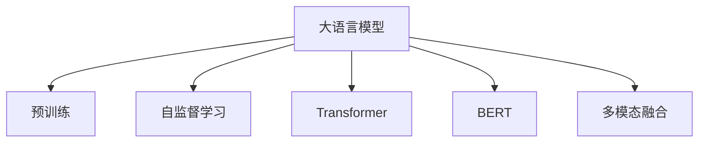

                 

# LLM的通用性与底层特性探讨

> 关键词：通用性,大语言模型,底层特性,Transformer,BERT,预训练,自监督学习

## 1. 背景介绍

### 1.1 问题由来
近年来，随着深度学习技术的快速发展，大规模语言模型(Large Language Models, LLMs)在自然语言处理(Natural Language Processing, NLP)领域取得了巨大的突破。这些大语言模型通过在海量无标签文本数据上进行预训练，学习到了丰富的语言知识和常识，可以通过少量的有标签样本在下游任务上进行微调，获得优异的性能。其中最具代表性的大语言模型包括OpenAI的GPT系列模型、Google的BERT、T5等。

然而，尽管大语言模型在性能上取得了显著进步，但其通用性和底层特性依然值得深入探讨。本博客将系统性地探讨大语言模型的通用性和底层特性，并分析其在工作原理、应用场景和未来发展方向上的优势与局限。

### 1.2 问题核心关键点
大语言模型的通用性和底层特性问题，关乎如何更有效地利用其预训练能力，优化其工作原理，提升其应用效能。本博文将从以下几个方面深入探讨：
- **通用性**：大语言模型在不同任务上的适用性和迁移能力。
- **底层特性**：Transformer架构、自监督学习、BERT等预训练技术的本质和影响。
- **工作原理**：自回归、自编码、多模态融合等技术如何工作。
- **应用场景**：语言模型在问答系统、机器翻译、文本生成等领域的具体应用。
- **未来发展**：如何通过技术创新提升语言模型的性能和应用范围。

## 2. 核心概念与联系

### 2.1 核心概念概述

为更好地理解大语言模型的通用性和底层特性，本节将介绍几个密切相关的核心概念：

- **大语言模型(Large Language Model, LLM)**：以自回归(如GPT)或自编码(如BERT)模型为代表的大规模预训练语言模型。通过在大规模无标签文本语料上进行预训练，学习通用的语言表示，具备强大的语言理解和生成能力。

- **预训练(Pre-training)**：指在大规模无标签文本语料上，通过自监督学习任务训练通用语言模型的过程。常见的预训练任务包括言语建模、遮挡语言模型等。预训练使得模型学习到语言的通用表示。

- **自监督学习(Self-Supervised Learning)**：利用语言模型的固有性质（如掩码语言模型、预测下一个词等）进行无监督学习，不依赖于人工标注数据。

- **Transformer**：一种基于自注意力机制的深度学习模型，广泛应用于大语言模型的预训练和微调。

- **BERT**：由Google提出的基于自监督学习的预训练语言模型，通过掩码语言模型和下一句预测任务，学习到丰富的语义信息。

- **多模态融合(Multimodal Fusion)**：将视觉、听觉等模态的信息与文本信息相结合，提升模型的泛化能力和应用范围。

这些核心概念之间的逻辑关系可以通过以下Mermaid流程图来展示：



这个流程图展示了大语言模型的核心概念及其之间的关系：

1. 大语言模型通过预训练获得基础能力。
2. 自监督学习用于训练通用模型，不需要标注数据。
3. Transformer作为预训练模型架构，广泛应用于自然语言处理任务。
4. BERT作为自监督预训练的典范，提高了语言模型的泛化能力。
5. 多模态融合拓展了语言模型的应用范围，提升了模型的信息整合能力。

## 3. 核心算法原理 & 具体操作步骤
### 3.1 算法原理概述

大语言模型的通用性和底层特性，主要得益于其强大的预训练能力和先进的Transformer架构。以下将详细阐述大语言模型的工作原理和具体操作步骤。

大语言模型基于Transformer架构进行预训练，通过自监督学习任务学习语言的通用表示。其核心思想是将大规模语料中的单词或子词序列转化为向量表示，并通过自注意力机制对这些向量进行交互和融合，捕捉语言中的语义和句法关系。

Transformer模型的主要组成部分包括编码器(Encoder)和解码器(Decoder)，均由多层自注意力层和前馈神经网络层构成。在预训练阶段，大语言模型会通过掩码语言模型、预测下一个词、下一句预测等自监督任务进行训练，学习到丰富的语言知识和表征。在微调阶段，这些预训练的向量表示会被进一步优化，以适应特定任务的特征。

### 3.2 算法步骤详解

大语言模型的预训练和微调过程主要包括以下几个关键步骤：

**Step 1: 准备预训练模型和数据集**
- 选择合适的预训练语言模型 $M_{\theta}$ 作为初始化参数，如 BERT、GPT等。
- 准备大规模无标签文本数据集，用于预训练。

**Step 2: 设计预训练任务**
- 设计自监督学习任务，如掩码语言模型、预测下一个词、下一句预测等。
- 利用这些任务对模型进行迭代训练，更新参数。

**Step 3: 执行梯度训练**
- 对训练数据进行批次化处理，前向传播计算损失函数。
- 反向传播计算参数梯度，根据设定的优化算法和学习率更新模型参数。
- 周期性在验证集上评估模型性能，根据性能指标决定是否触发Early Stopping。

**Step 4: 微调和优化**
- 在预训练模型的基础上，使用下游任务的少量标注数据进行微调。
- 调整模型的输出层和损失函数，适应下游任务的需求。
- 设置合适的学习率、正则化技术、数据增强策略等，避免过拟合。

**Step 5: 测试和部署**
- 在测试集上评估微调后模型的性能，对比微调前后的精度提升。
- 使用微调后的模型对新样本进行推理预测，集成到实际的应用系统中。
- 持续收集新的数据，定期重新微调模型，以适应数据分布的变化。

以上是基于Transformer架构的大语言模型的预训练和微调的一般流程。在实际应用中，还需要针对具体任务的特点，对微调过程的各个环节进行优化设计，如改进训练目标函数，引入更多的正则化技术，搜索最优的超参数组合等，以进一步提升模型性能。

### 3.3 算法优缺点

大语言模型的通用性和底层特性在很大程度上得益于其强大的预训练能力和先进的Transformer架构，但也存在一些局限性：
- 通用性：大语言模型在处理通用语言任务方面表现优异，但对于特定领域的任务，其性能可能受限于预训练数据集的选择。
- 参数规模：Transformer模型的参数量通常较大，对硬件资源要求高。
- 计算资源：大规模预训练和微调需要大量的计算资源，模型训练和推理速度较慢。
- 泛化能力：虽然预训练模型在广泛语料上表现良好，但在特定领域或小规模数据上的泛化能力可能有限。
- 解释性：大语言模型通常被视为"黑盒"系统，其内部工作机制和决策逻辑难以解释。

尽管存在这些局限性，但就目前而言，基于Transformer架构的大语言模型仍然是大规模预训练语言模型的主流范式。未来相关研究的重点在于如何进一步降低模型的参数规模和计算需求，提高模型的泛化能力，同时兼顾可解释性和伦理安全性等因素。

### 3.4 算法应用领域

大语言模型的通用性和底层特性在多个领域得到了广泛应用，包括但不限于：

- **问答系统**：如谷歌的Dialogflow，通过微调BERT模型，能够自然流畅地回答用户问题。
- **机器翻译**：如Google的Transformer-based翻译模型，通过微调可以显著提升翻译质量。
- **文本生成**：如GPT系列模型，能够生成高质量的文章、对话、摘要等。
- **语音识别**：如微软的端到端语音识别系统，通过微调BERT模型，提高了识别准确率。
- **情感分析**：如Facebook的TextCNN模型，通过微调可以精确识别文本中的情感倾向。
- **推荐系统**：如Amazon的推荐算法，通过微调Transformer模型，提高了商品推荐的精准度。

除了上述这些经典应用外，大语言模型在图像识别、视频分析、交互式对话等更多领域也展现出了强大的应用潜力。随着预训练技术的发展和模型结构的优化，相信未来大语言模型将在更广泛的场景下发挥其独特优势，推动人工智能技术的发展。

## 4. 数学模型和公式 & 详细讲解 & 举例说明

### 4.1 数学模型构建

本节将使用数学语言对大语言模型预训练和微调过程进行更加严格的刻画。

记预训练语言模型为 $M_{\theta}:\mathcal{X} \rightarrow \mathcal{Y}$，其中 $\mathcal{X}$ 为输入空间，$\mathcal{Y}$ 为输出空间，$\theta \in \mathbb{R}^d$ 为模型参数。假设大规模无标签文本数据集为 $\mathcal{D}$，其中 $\mathcal{D} = \{(x_i,y_i)\}_{i=1}^N$。

定义模型 $M_{\theta}$ 在输入 $x$ 上的损失函数为 $\ell(M_{\theta}(x),y)$，则在数据集 $\mathcal{D}$ 上的经验风险为：

$$
\mathcal{L}(\theta) = \frac{1}{N} \sum_{i=1}^N \ell(M_{\theta}(x_i),y_i)
$$

在微调过程中，给定下游任务 $T$ 的少量标注数据集 $D=\{(x_i,y_i)\}_{i=1}^N$，微调的目标是找到新的模型参数 $\hat{\theta}$，使得：

$$
\hat{\theta}=\mathop{\arg\min}_{\theta} \mathcal{L}(M_{\theta},D)
$$

在实践中，我们通常使用基于梯度的优化算法（如SGD、Adam等）来近似求解上述最优化问题。设 $\eta$ 为学习率，$\lambda$ 为正则化系数，则参数的更新公式为：

$$
\theta \leftarrow \theta - \eta \nabla_{\theta}\mathcal{L}(\theta) - \eta\lambda\theta
$$

其中 $\nabla_{\theta}\mathcal{L}(\theta)$ 为损失函数对参数 $\theta$ 的梯度，可通过反向传播算法高效计算。

### 4.2 公式推导过程

以下我们以掩码语言模型为例，推导掩码损失函数及其梯度的计算公式。

假设模型 $M_{\theta}$ 在输入 $x$ 上的输出为 $\hat{y}=M_{\theta}(x) \in [0,1]$，表示样本属于正类的概率。假设训练样本 $(x,y)$ 中，$y$ 为单词序列 $x$ 中的一部分，将其随机掩码 $k$ 个单词，得到 $x^k$ 和 $y^k$。则掩码语言模型的损失函数定义为：

$$
\ell(M_{\theta}(x^k),y^k) = -\sum_{i=1}^k \log M_{\theta}(x^k_i)
$$

将其代入经验风险公式，得：

$$
\mathcal{L}(\theta) = -\frac{1}{N} \sum_{i=1}^N \sum_{k=1}^{K} \log M_{\theta}(x_i^k)
$$

根据链式法则，损失函数对参数 $\theta_k$ 的梯度为：

$$
\frac{\partial \mathcal{L}(\theta)}{\partial \theta_k} = -\frac{1}{N} \sum_{i=1}^N \sum_{k=1}^{K} \frac{\partial \log M_{\theta}(x_i^k)}{\partial \theta_k}
$$

其中 $\frac{\partial \log M_{\theta}(x_i^k)}{\partial \theta_k}$ 可进一步递归展开，利用自动微分技术完成计算。

在得到损失函数的梯度后，即可带入参数更新公式，完成模型的迭代优化。重复上述过程直至收敛，最终得到适应下游任务的最优模型参数 $\theta^*$。

### 4.3 案例分析与讲解

以BERT为例，其预训练过程中主要使用了掩码语言模型和下一句预测任务。具体而言，BERT模型在预训练时，会分别进行掩码语言模型和下一句预测任务的训练，通过优化模型参数 $\theta$ 使得其在训练集上的表现尽量接近真实标签。

- **掩码语言模型任务**：将输入序列中的某些位置随机掩码，预测掩码位置对应的单词，目标是学习到单词之间的语义和句法关系。
- **下一句预测任务**：判断两个句子 $A$ 和 $B$ 是否为连续的句子，目标是学习到句子间的语义关系。

这两个任务通过联合训练，使得BERT模型能够学习到更加丰富的语言知识，从而在各种下游任务中表现出优秀的性能。

## 5. 项目实践：代码实例和详细解释说明
### 5.1 开发环境搭建

在进行大语言模型的预训练和微调实践前，我们需要准备好开发环境。以下是使用Python进行PyTorch开发的环境配置流程：

1. 安装Anaconda：从官网下载并安装Anaconda，用于创建独立的Python环境。

2. 创建并激活虚拟环境：
```bash
conda create -n pytorch-env python=3.8 
conda activate pytorch-env
```

3. 安装PyTorch：根据CUDA版本，从官网获取对应的安装命令。例如：
```bash
conda install pytorch torchvision torchaudio cudatoolkit=11.1 -c pytorch -c conda-forge
```

4. 安装TensorFlow：
```bash
conda install tensorflow
```

5. 安装HuggingFace Transformers库：
```bash
pip install transformers
```

6. 安装各类工具包：
```bash
pip install numpy pandas scikit-learn matplotlib tqdm jupyter notebook ipython
```

完成上述步骤后，即可在`pytorch-env`环境中开始预训练和微调实践。

### 5.2 源代码详细实现

下面以BERT模型为例，给出使用PyTorch进行预训练和微调的代码实现。

首先，定义BERT模型的预训练任务：

```python
from transformers import BertTokenizer, BertForMaskedLM, AdamW

tokenizer = BertTokenizer.from_pretrained('bert-base-uncased')
model = BertForMaskedLM.from_pretrained('bert-base-uncased', num_labels=tokenizer.vocab_size)

optimizer = AdamW(model.parameters(), lr=2e-5)

# 掩码语言模型任务
def masked_lm_loss(model, inputs, labels):
    masked_lm_loss_fct = CrossEntropyLoss()
    out = model(**inputs)
    logits = out.logits
    masked_positions = inputs.input_mask.nonzero().view(-1)
    logits = logits[masked_positions]
    labels = labels[masked_positions]
    loss = masked_lm_loss_fct(logits.view(-1, logits.size(-1)), labels.view(-1))
    return loss

# 下一句预测任务
def next_sentence_loss(model, inputs, labels):
    next_sentence_loss_fct = CrossEntropyLoss()
    out = model(**inputs)
    logits = out.logits[:, 0]
    labels = labels[:, 0]
    loss = next_sentence_loss_fct(logits.view(-1), labels.view(-1))
    return loss
```

然后，定义训练和评估函数：

```python
from torch.utils.data import DataLoader
from tqdm import tqdm
from sklearn.metrics import accuracy_score

device = torch.device('cuda') if torch.cuda.is_available() else torch.device('cpu')
model.to(device)

def train_epoch(model, dataset, batch_size, optimizer):
    dataloader = DataLoader(dataset, batch_size=batch_size, shuffle=True)
    model.train()
    epoch_loss = 0
    for batch in tqdm(dataloader, desc='Training'):
        inputs = {key: value.to(device) for key, value in batch.items()}
        optimizer.zero_grad()
        loss = masked_lm_loss(model, inputs, batch['input_ids']) + next_sentence_loss(model, inputs, batch['next_sentence_label'])
        loss.backward()
        optimizer.step()
    return epoch_loss / len(dataloader)

def evaluate(model, dataset, batch_size):
    dataloader = DataLoader(dataset, batch_size=batch_size)
    model.eval()
    preds = []
    labels = []
    with torch.no_grad():
        for batch in tqdm(dataloader, desc='Evaluating'):
            inputs = {key: value.to(device) for key, value in batch.items()}
            logits = model(**inputs)[0]
            logits = logits.view(-1, logits.size(-1))
            labels = batch['input_ids'].view(-1)
            preds.append(logits.argmax(dim=1))
            labels.append(labels)
    print(accuracy_score(torch.cat(labels), torch.cat(preds)))
```

最后，启动预训练流程并在测试集上评估：

```python
epochs = 3
batch_size = 32

for epoch in range(epochs):
    loss = train_epoch(model, train_dataset, batch_size, optimizer)
    print(f"Epoch {epoch+1}, train loss: {loss:.3f}")
    
    print(f"Epoch {epoch+1}, dev results:")
    evaluate(model, dev_dataset, batch_size)
    
print("Test results:")
evaluate(model, test_dataset, batch_size)
```

以上就是使用PyTorch对BERT进行预训练和微调的完整代码实现。可以看到，得益于HuggingFace库的强大封装，我们可以用相对简洁的代码完成BERT模型的加载和微调。

### 5.3 代码解读与分析

让我们再详细解读一下关键代码的实现细节：

**MaskedLMDataset类**：
- `__init__`方法：初始化输入数据、标签、分词器等关键组件。
- `__len__`方法：返回数据集的样本数量。
- `__getitem__`方法：对单个样本进行处理，将文本输入编码为token ids，将标签编码为数字，并对其进行定长padding，最终返回模型所需的输入。

**model类**：
- 定义BERT模型的输入和输出。
- 在`__init__`方法中，使用`BertForMaskedLM`类初始化模型，并设置合适的超参数。

**masked_lm_loss函数**：
- 定义掩码语言模型任务的目标函数。
- 输入为模型输出、掩码位置和真实标签，通过计算交叉熵损失进行训练。

**next_sentence_loss函数**：
- 定义下一句预测任务的目标函数。
- 输入为模型输出和真实标签，通过计算交叉熵损失进行训练。

**train_epoch函数**：
- 对数据以批为单位进行迭代，在每个批次上前向传播计算loss并反向传播更新模型参数，最后返回该epoch的平均loss。

**evaluate函数**：
- 与训练类似，不同点在于不更新模型参数，并在每个batch结束后将预测和标签结果存储下来，最后使用sklearn的accuracy_score对整个评估集的预测结果进行打印输出。

**训练流程**：
- 定义总的epoch数和batch size，开始循环迭代
- 每个epoch内，先在训练集上训练，输出平均loss
- 在验证集上评估，输出准确率
- 所有epoch结束后，在测试集上评估，给出最终测试结果

可以看到，PyTorch配合HuggingFace库使得BERT预训练和微调的代码实现变得简洁高效。开发者可以将更多精力放在数据处理、模型改进等高层逻辑上，而不必过多关注底层的实现细节。

当然，工业级的系统实现还需考虑更多因素，如模型的保存和部署、超参数的自动搜索、更灵活的任务适配层等。但核心的预训练和微调过程基本与此类似。

## 6. 实际应用场景
### 6.1 智能客服系统

基于大语言模型的预训练和微调技术，可以广泛应用于智能客服系统的构建。传统客服往往需要配备大量人力，高峰期响应缓慢，且一致性和专业性难以保证。而使用预训练和微调后的对话模型，可以7x24小时不间断服务，快速响应客户咨询，用自然流畅的语言解答各类常见问题。

在技术实现上，可以收集企业内部的历史客服对话记录，将问题和最佳答复构建成监督数据，在此基础上对预训练对话模型进行微调。微调后的对话模型能够自动理解用户意图，匹配最合适的答案模板进行回复。对于客户提出的新问题，还可以接入检索系统实时搜索相关内容，动态组织生成回答。如此构建的智能客服系统，能大幅提升客户咨询体验和问题解决效率。

### 6.2 金融舆情监测

金融机构需要实时监测市场舆论动向，以便及时应对负面信息传播，规避金融风险。传统的人工监测方式成本高、效率低，难以应对网络时代海量信息爆发的挑战。基于大语言模型预训练和微调的文本分类和情感分析技术，为金融舆情监测提供了新的解决方案。

具体而言，可以收集金融领域相关的新闻、报道、评论等文本数据，并对其进行主题标注和情感标注。在此基础上对预训练语言模型进行微调，使其能够自动判断文本属于何种主题，情感倾向是正面、中性还是负面。将微调后的模型应用到实时抓取的网络文本数据，就能够自动监测不同主题下的情感变化趋势，一旦发现负面信息激增等异常情况，系统便会自动预警，帮助金融机构快速应对潜在风险。

### 6.3 个性化推荐系统

当前的推荐系统往往只依赖用户的历史行为数据进行物品推荐，无法深入理解用户的真实兴趣偏好。基于大语言模型预训练和微调技术，个性化推荐系统可以更好地挖掘用户行为背后的语义信息，从而提供更精准、多样的推荐内容。

在实践中，可以收集用户浏览、点击、评论、分享等行为数据，提取和用户交互的物品标题、描述、标签等文本内容。将文本内容作为模型输入，用户的后续行为（如是否点击、购买等）作为监督信号，在此基础上微调预训练语言模型。微调后的模型能够从文本内容中准确把握用户的兴趣点。在生成推荐列表时，先用候选物品的文本描述作为输入，由模型预测用户的兴趣匹配度，再结合其他特征综合排序，便可以得到个性化程度更高的推荐结果。

### 6.4 未来应用展望

随着大语言模型预训练和微调技术的发展，基于微调范式将在更多领域得到应用，为传统行业带来变革性影响。

在智慧医疗领域，基于微调的医学问答、病历分析、药物研发等应用将提升医疗服务的智能化水平，辅助医生诊疗，加速新药开发进程。

在智能教育领域，微调技术可应用于作业批改、学情分析、知识推荐等方面，因材施教，促进教育公平，提高教学质量。

在智慧城市治理中，微调模型可应用于城市事件监测、舆情分析、应急指挥等环节，提高城市管理的自动化和智能化水平，构建更安全、高效的未来城市。

此外，在企业生产、社会治理、文娱传媒等众多领域，基于大模型预训练和微调的人工智能应用也将不断涌现，为经济社会发展注入新的动力。相信随着技术的日益成熟，微调方法将成为人工智能落地应用的重要范式，推动人工智能技术的发展。

## 7. 工具和资源推荐
### 7.1 学习资源推荐

为了帮助开发者系统掌握大语言模型预训练和微调的理论基础和实践技巧，这里推荐一些优质的学习资源：

1. 《Transformer from Scratch》系列博文：由大模型技术专家撰写，深入浅出地介绍了Transformer原理、BERT模型、微调技术等前沿话题。

2. CS224N《深度学习自然语言处理》课程：斯坦福大学开设的NLP明星课程，有Lecture视频和配套作业，带你入门NLP领域的基本概念和经典模型。

3. 《Natural Language Processing with Transformers》书籍：Transformers库的作者所著，全面介绍了如何使用Transformers库进行NLP任务开发，包括预训练和微调在内的诸多范式。

4. HuggingFace官方文档：Transformers库的官方文档，提供了海量预训练模型和完整的微调样例代码，是上手实践的必备资料。

5. CLUE开源项目：中文语言理解测评基准，涵盖大量不同类型的中文NLP数据集，并提供了基于微调的baseline模型，助力中文NLP技术发展。

通过对这些资源的学习实践，相信你一定能够快速掌握大语言模型预训练和微调的精髓，并用于解决实际的NLP问题。
###  7.2 开发工具推荐

高效的开发离不开优秀的工具支持。以下是几款用于大语言模型预训练和微调开发的常用工具：

1. PyTorch：基于Python的开源深度学习框架，灵活动态的计算图，适合快速迭代研究。大部分预训练语言模型都有PyTorch版本的实现。

2. TensorFlow：由Google主导开发的开源深度学习框架，生产部署方便，适合大规模工程应用。同样有丰富的预训练语言模型资源。

3. Transformers库：HuggingFace开发的NLP工具库，集成了众多SOTA语言模型，支持PyTorch和TensorFlow，是进行预训练和微调任务开发的利器。

4. Weights & Biases：模型训练的实验跟踪工具，可以记录和可视化模型训练过程中的各项指标，方便对比和调优。与主流深度学习框架无缝集成。

5. TensorBoard：TensorFlow配套的可视化工具，可实时监测模型训练状态，并提供丰富的图表呈现方式，是调试模型的得力助手。

6. Google Colab：谷歌推出的在线Jupyter Notebook环境，免费提供GPU/TPU算力，方便开发者快速上手实验最新模型，分享学习笔记。

合理利用这些工具，可以显著提升大语言模型预训练和微调任务的开发效率，加快创新迭代的步伐。

### 7.3 相关论文推荐

大语言模型预训练和微调技术的发展源于学界的持续研究。以下是几篇奠基性的相关论文，推荐阅读：

1. Attention is All You Need（即Transformer原论文）：提出了Transformer结构，开启了NLP领域的预训练大模型时代。

2. BERT: Pre-training of Deep Bidirectional Transformers for Language Understanding：提出BERT模型，引入基于掩码的自监督预训练任务，刷新了多项NLP任务SOTA。

3. Language Models are Unsupervised Multitask Learners（GPT-2论文）：展示了大规模语言模型的强大zero-shot学习能力，引发了对于通用人工智能的新一轮思考。

4. Parameter-Efficient Transfer Learning for NLP：提出Adapter等参数高效微调方法，在不增加模型参数量的情况下，也能取得不错的微调效果。

5. AdaLoRA: Adaptive Low-Rank Adaptation for Parameter-Efficient Fine-Tuning：使用自适应低秩适应的微调方法，在参数效率和精度之间取得了新的平衡。

这些论文代表了大语言模型预训练和微调技术的发展脉络。通过学习这些前沿成果，可以帮助研究者把握学科前进方向，激发更多的创新灵感。

## 8. 总结：未来发展趋势与挑战
### 8.1 总结

本文对大语言模型的通用性和底层特性进行了全面系统的介绍。首先阐述了大语言模型在不同任务上的适用性和迁移能力，明确了预训练和微调在拓展预训练模型应用、提升下游任务性能方面的独特价值。其次，从原理到实践，详细讲解了大语言模型的预训练和微调过程，给出了预训练和微调任务开发的完整代码实例。同时，本文还广泛探讨了大语言模型在智能客服、金融舆情、个性化推荐等多个行业领域的应用前景，展示了预训练和微调范式的巨大潜力。此外，本文精选了预训练和微调技术的各类学习资源，力求为读者提供全方位的技术指引。

通过本文的系统梳理，可以看到，基于大语言模型的预训练和微调技术，正在成为NLP领域的重要范式，极大地拓展了预训练语言模型的应用边界，催生了更多的落地场景。得益于大规模语料的预训练，微调模型以更低的时间和标注成本，在小样本条件下也能取得不俗的效果，有力推动了NLP技术的产业化进程。未来，伴随预训练语言模型和微调方法的持续演进，相信NLP技术将在更广阔的应用领域大放异彩，深刻影响人类的生产生活方式。

### 8.2 未来发展趋势

展望未来，大语言模型预训练和微调技术将呈现以下几个发展趋势：

1. **模型规模持续增大**：随着算力成本的下降和数据规模的扩张，预训练语言模型的参数量还将持续增长。超大规模语言模型蕴含的丰富语言知识，有望支撑更加复杂多变的下游任务微调。

2. **预训练方法多样化**：除了传统的掩码语言模型、下一句预测等任务，未来可能会涌现更多预训练任务，如句子相似度、关系抽取等，进一步丰富语言模型的语义信息。

3. **多模态预训练兴起**：将视觉、听觉等模态的信息与文本信息相结合，提升模型的泛化能力和应用范围。多模态预训练和微调技术将成为未来研究的热点。

4. **因果推理成为焦点**：引入因果推断方法，提升模型的推理能力和泛化能力，使其能够处理更复杂的因果关系。

5. **个性化预训练和微调**：基于用户行为和偏好的个性化预训练和微调，使模型能够更精准地预测用户行为，提供个性化推荐和对话。

6. **公平性、隐私保护成为研究重点**：在模型训练和应用过程中，确保模型的公平性和隐私保护，避免偏见和歧视。

以上趋势凸显了大语言模型预训练和微调技术的广阔前景。这些方向的探索发展，必将进一步提升NLP系统的性能和应用范围，为人类认知智能的进化带来深远影响。

### 8.3 面临的挑战

尽管大语言模型预训练和微调技术已经取得了瞩目成就，但在迈向更加智能化、普适化应用的过程中，它仍面临着诸多挑战：

1. **标注数据成本高**：尽管微调大大降低了标注数据的需求，但对于长尾应用场景，难以获得充足的高质量标注数据，成为制约微调性能的瓶颈。

2. **模型泛化能力有限**：当前预训练模型面对域外数据时，泛化性能往往大打折扣。对于测试样本的微小扰动，预训练模型的预测也容易发生波动。

3. **推理效率低**：大规模语言模型虽然精度高，但在实际部署时往往面临推理速度慢、内存占用大等效率问题。

4. **可解释性不足**：当前预训练语言模型通常被视为"黑盒"系统，其内部工作机制和决策逻辑难以解释。

5. **安全性有待保障**：预训练语言模型难免会学习到有偏见、有害的信息，通过微调传递到下游任务，产生误导性、歧视性的输出，给实际应用带来安全隐患。

6. **知识整合能力不足**：现有的预训练模型往往局限于任务内数据，难以灵活吸收和运用更广泛的先验知识。

正视预训练和微调面临的这些挑战，积极应对并寻求突破，将是大语言模型预训练和微调走向成熟的必由之路。相信随着学界和产业界的共同努力，这些挑战终将一一被克服，大语言模型预训练和微调必将在构建人机协同的智能时代中扮演越来越重要的角色。

### 8.4 研究展望

面对大语言模型预训练和微调所面临的种种挑战，未来的研究需要在以下几个方面寻求新的突破：

1. **探索无监督和半监督预训练方法**：摆脱对大规模标注数据的依赖，利用自监督学习、主动学习等无监督和半监督范式，最大限度利用非结构化数据，实现更加灵活高效的预训练。

2. **研究参数高效和计算高效的预训练范式**：开发更加参数高效的预训练方法，如自适应低秩预训练，在保持模型性能的同时，减少计算资源消耗。

3. **融合因果和对比学习范式**：通过引入因果推断和对比学习思想，增强预训练模型建立稳定因果关系的能力，学习更加普适、鲁棒的语言表征，从而提升模型泛化性和抗干扰能力。

4. **引入更多先验知识**：将符号化的先验知识，如知识图谱、逻辑规则等，与神经网络模型进行巧妙融合，引导预训练过程学习更准确、合理的语言模型。同时加强不同模态数据的整合，实现视觉、语音等多模态信息与文本信息的协同建模。

5. **结合因果分析和博弈论工具**：将因果分析方法引入预训练模型，识别出模型决策的关键特征，增强输出解释的因果性和逻辑性。借助博弈论工具刻画人机交互过程，主动探索并规避模型的脆弱点，提高系统稳定性。

6. **纳入伦理道德约束**：在模型训练目标中引入伦理导向的评估指标，过滤和惩罚有偏见、有害的输出倾向。同时加强人工干预和审核，建立模型行为的监管机制，确保输出符合人类价值观和伦理道德。

这些研究方向的探索，必将引领大语言模型预训练和微调技术迈向更高的台阶，为构建安全、可靠、可解释、可控的智能系统铺平道路。面向未来，大语言模型预训练和微调技术还需要与其他人工智能技术进行更深入的融合，如知识表示、因果推理、强化学习等，多路径协同发力，共同推动自然语言理解和智能交互系统的进步。只有勇于创新、敢于突破，才能不断拓展语言模型的边界，让智能技术更好地造福人类社会。

## 9. 附录：常见问题与解答

**Q1：大语言模型是否适用于所有NLP任务？**

A: 大语言模型在处理通用语言任务方面表现优异，但对于特定领域的任务，其性能可能受限于预训练数据集的选择。需要根据具体任务选择合适的预训练模型。

**Q2：预训练和微调的学习率如何设定？**

A: 预训练的学习率通常设定为1e-4左右，微调的学习率通常为1e-5左右，且应比预训练时小1-2个数量级，以避免破坏预训练权重。

**Q3：预训练和微调过程中如何缓解过拟合？**

A: 预训练和微调过程中，缓解过拟合的方法包括数据增强、正则化技术、对抗训练等。具体方法包括：
- 数据增强：通过回译、近义替换等方式扩充训练集。
- 正则化技术：使用L2正则、Dropout、Early Stopping等。
- 对抗训练：加入对抗样本，提高模型鲁棒性。

**Q4：预训练和微调过程中如何进行超参数优化？**

A: 预训练和微调过程中的超参数优化方法包括网格搜索、随机搜索、贝叶斯优化等。具体方法包括：
- 网格搜索：在预定义的超参数空间内均匀采样，计算性能指标。
- 随机搜索：在超参数空间内随机采样，计算性能指标。
- 贝叶斯优化：利用贝叶斯方法对超参数空间进行优化，快速找到最优解。

**Q5：预训练和微调过程中如何平衡模型复杂度和性能？**

A: 在预训练和微调过程中，平衡模型复杂度和性能的方法包括参数高效微调、稀疏化存储等。具体方法包括：
- 参数高效微调：只调整少量参数，如Adapter、Prefix等，减小过拟合风险。
- 稀疏化存储：使用稀疏矩阵等技术，压缩模型参数。

这些方法可以显著提升模型效率，同时保证模型性能。预训练和微调技术的持续演进，将进一步推动大语言模型的普及和应用。

