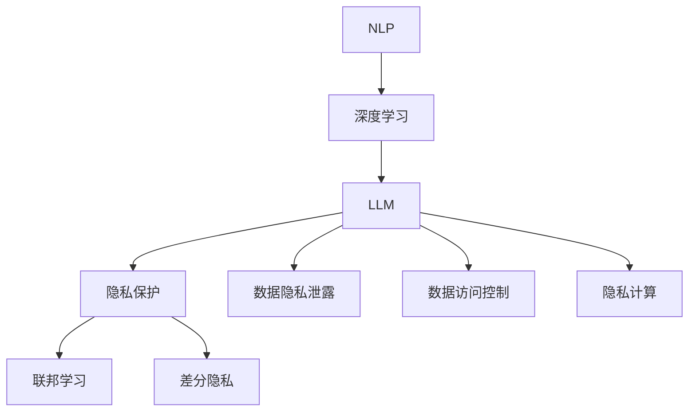

                 

# LLM隐私安全:线程级别的挑战

> 关键词：自然语言处理（NLP）,隐私保护,深度学习,大模型,联邦学习,数据隐私

## 1. 背景介绍

### 1.1 问题由来

随着人工智能技术的快速发展，基于深度学习的自然语言处理（NLP）系统，如大规模语言模型（LLM），被广泛应用于各种智能应用中。例如，智能客服、智能助理、机器翻译、智能问答系统等。然而，在获得巨大成功的同时，这些系统也面临着一个越来越严峻的挑战——隐私保护。

隐私问题不仅涉及到用户数据的安全性，还涉及到系统在处理用户数据时如何保护用户的隐私权利，避免数据滥用。特别是在全球范围内，数据隐私保护的法律和法规日趋严格，如何确保LLM系统在满足隐私要求的同时，仍能提供高质量的服务，成为一个重要课题。

### 1.2 问题核心关键点

LLM隐私安全问题主要体现在以下几个方面：

1. **数据隐私泄露**：在使用用户数据训练和优化LLM模型时，如何避免用户隐私数据被泄露。
2. **数据访问控制**：如何在保证模型性能的前提下，对用户数据的访问进行严格的控制，防止数据被非法获取。
3. **隐私计算**：如何通过隐私计算技术，在不暴露原始数据的情况下，进行模型训练和推理。
4. **差分隐私**：如何在模型训练中引入差分隐私，确保单个数据点的变化不会对模型性能造成显著影响。
5. **联邦学习**：如何在分布式环境中，通过联邦学习技术，实现模型训练和推理，同时保护数据隐私。

本文将详细探讨这些核心问题，并给出相应的解决方案。

## 2. 核心概念与联系

### 2.1 核心概念概述

为更好地理解LLM隐私安全问题，本节将介绍几个密切相关的核心概念：

- **自然语言处理（NLP）**：研究如何使计算机能够理解、解释和生成人类语言的技术。
- **深度学习**：一种基于神经网络的机器学习技术，通过多层非线性变换，能够自动提取数据特征，进行分类、回归等任务。
- **大规模语言模型（LLM）**：指基于深度学习的大规模神经网络模型，能够处理大量文本数据，学习到复杂的语言表示。
- **隐私保护**：指在数据处理和分析过程中，保护个人隐私不被泄露的措施。
- **联邦学习**：一种分布式机器学习技术，各参与方在本地数据上训练模型，仅交换模型参数，不交换数据本身，从而保护数据隐私。
- **差分隐私**：通过在数据处理过程中引入噪声，确保单个数据点的变化不会对模型结果造成显著影响，保护数据隐私。

这些概念之间的逻辑关系可以通过以下Mermaid流程图来展示：



这个流程图展示了大规模语言模型在自然语言处理中的应用，以及隐私保护和数据处理的相关概念：

1. 大语言模型通过深度学习获得语言理解能力。
2. 隐私保护技术确保模型在训练和推理过程中保护用户数据。
3. 联邦学习、差分隐私等技术用于保护数据隐私，防止数据泄露和滥用。

## 3. 核心算法原理 & 具体操作步骤
### 3.1 算法原理概述

LLM隐私安全问题的解决，主要依赖于数据隐私保护技术。其中，联邦学习和差分隐私是两个最为核心的技术。

**联邦学习**：在分布式环境中，各参与方在本地数据上训练模型，仅交换模型参数，不交换数据本身，从而保护数据隐私。

**差分隐私**：通过在数据处理过程中引入噪声，确保单个数据点的变化不会对模型结果造成显著影响，保护数据隐私。

### 3.2 算法步骤详解

#### 联邦学习

**步骤1: 准备数据和模型**

- 收集各参与方的数据集，确保数据分布均匀。
- 在本地机器上初始化模型参数。

**步骤2: 模型训练**

- 各参与方在本地数据上训练模型，并计算梯度。
- 各参与方将本地梯度参数加密后，传递给中心服务器。
- 中心服务器汇总各参与方的梯度参数，计算全局梯度。
- 中心服务器将全局梯度参数加密后，传递给各参与方。
- 各参与方在本地数据上使用全局梯度更新模型参数。

**步骤3: 模型评估**

- 各参与方在本地数据上评估模型性能。
- 中心服务器收集各参与方的评估结果，综合计算模型性能。

**步骤4: 模型部署**

- 各参与方使用训练好的模型进行推理，保护数据隐私。

#### 差分隐私

**步骤1: 准备数据和模型**

- 收集用户数据，确保数据分布均匀。
- 在本地机器上初始化模型参数。

**步骤2: 数据扰动**

- 在数据处理过程中，引入噪声，确保单个数据点的变化不会对模型结果造成显著影响。

**步骤3: 模型训练**

- 各参与方在本地数据上训练模型，使用差分隐私保护机制。

**步骤4: 模型评估**

- 各参与方在本地数据上评估模型性能。

**步骤5: 模型部署**

- 各参与方使用训练好的模型进行推理，保护数据隐私。

### 3.3 算法优缺点

**联邦学习的优点**：

1. 保护数据隐私：仅交换模型参数，不交换数据本身。
2. 高效协作：各参与方可以在本地数据上独立训练，减少数据传输成本。
3. 降低单点故障风险：各参与方独立运行，减少单点故障的风险。

**联邦学习的缺点**：

1. 计算开销大：由于需要多次加密和解密操作，计算开销较大。
2. 模型性能不稳定：由于各参与方的数据分布不同，模型性能可能不稳定。
3. 通信开销大：由于需要频繁交换模型参数，通信开销较大。

**差分隐私的优点**：

1. 保护数据隐私：通过引入噪声，确保单个数据点的变化不会对模型结果造成显著影响。
2. 保护模型性能：通过控制噪声的大小，可以在模型性能和隐私保护之间找到平衡。
3. 简单易行：不需要额外的硬件支持，只需要在算法中引入噪声即可。

**差分隐私的缺点**：

1. 模型性能下降：引入噪声可能导致模型性能下降。
2. 数据分布变化：对于数据分布变化较大的场景，隐私保护效果可能不理想。
3. 计算开销大：引入噪声会增加计算开销。

### 3.4 算法应用领域

LLM隐私安全技术在多个领域都有广泛的应用，例如：

- **智能客服**：使用联邦学习和差分隐私，保护客户数据隐私，同时提供高质量的智能客服服务。
- **金融风控**：使用联邦学习和差分隐私，保护客户数据隐私，同时进行风险评估和预测。
- **医疗健康**：使用联邦学习和差分隐私，保护患者数据隐私，同时进行疾病预测和治疗方案推荐。
- **智能推荐**：使用联邦学习和差分隐私，保护用户数据隐私，同时提供个性化的推荐服务。
- **物联网**：使用联邦学习和差分隐私，保护设备数据隐私，同时进行设备智能控制和优化。

## 4. 数学模型和公式 & 详细讲解 & 举例说明

### 4.1 数学模型构建

**联邦学习模型**：假设参与方 $P_i$ 拥有本地数据集 $D_i$，中心服务器持有模型参数 $\theta$。各参与方在本地数据上训练模型，更新本地参数 $\theta_i$，中心服务器接收各参与方的梯度参数 $\Delta \theta_i$，更新全局模型参数 $\theta$。

**差分隐私模型**：假设参与方 $P_i$ 拥有本地数据集 $D_i$，需要保护用户数据隐私。在数据处理过程中，引入噪声 $\epsilon$，确保单个数据点的变化不会对模型结果造成显著影响。

### 4.2 公式推导过程

#### 联邦学习公式推导

$$
\theta_{i+1} = \theta_i - \eta \nabla_\theta L(\theta, \Delta D_i)
$$

其中 $\eta$ 为学习率，$\nabla_\theta L(\theta, \Delta D_i)$ 为本地数据的梯度。

中心服务器汇总各参与方的梯度参数，计算全局梯度：

$$
\Delta \theta = \frac{1}{n} \sum_{i=1}^n \Delta \theta_i
$$

其中 $n$ 为参与方数量。

将全局梯度参数加密后，传递给各参与方：

$$
\Delta \theta' = E(\Delta \theta)
$$

其中 $E$ 为加密算法。

各参与方在本地数据上使用全局梯度更新模型参数：

$$
\theta_{i+1} = \theta_i - \eta \nabla_\theta L(\theta, \Delta D_i')
$$

其中 $\Delta D_i'$ 为加密后的梯度。

#### 差分隐私公式推导

$$
\hat{f}(x) = f(x) + \epsilon
$$

其中 $\hat{f}(x)$ 为扰动后的函数值，$f(x)$ 为原始函数值，$\epsilon$ 为噪声。

引入拉普拉斯噪声，确保单个数据点的变化不会对模型结果造成显著影响：

$$
\epsilon \sim \text{Laplace}(1/\Delta)
$$

其中 $\Delta$ 为噪声方差。

通过引入噪声，保护用户数据隐私，同时保证模型性能：

$$
\text{Pr}[|y-\hat{y}|>\epsilon] \leq \frac{\delta}{n}
$$

其中 $y$ 为真实标签，$\hat{y}$ 为模型预测，$\delta$ 为隐私保护的概率。

### 4.3 案例分析与讲解

**案例1: 智能客服系统的隐私保护**

某智能客服系统需要处理大量的用户语音和文本数据，以提供高质量的智能客服服务。系统使用了联邦学习和差分隐私技术，保护用户数据隐私。

- 各客服节点在本地语音和文本数据上训练模型，计算梯度。
- 各客服节点将本地梯度参数加密后，传递给中心服务器。
- 中心服务器汇总各客服节点的梯度参数，计算全局梯度。
- 中心服务器将全局梯度参数加密后，传递给各客服节点。
- 各客服节点在本地语音和文本数据上使用全局梯度更新模型参数。
- 各客服节点在本地语音和文本数据上评估模型性能，确保模型稳定。

**案例2: 医疗健康系统的隐私保护**

某医疗健康系统需要处理大量的患者数据，进行疾病预测和治疗方案推荐。系统使用了联邦学习和差分隐私技术，保护患者数据隐私。

- 各医院在本地患者数据上训练模型，计算梯度。
- 各医院将本地梯度参数加密后，传递给中心服务器。
- 中心服务器汇总各医院的梯度参数，计算全局梯度。
- 中心服务器将全局梯度参数加密后，传递给各医院。
- 各医院在本地患者数据上使用全局梯度更新模型参数。
- 各医院在本地患者数据上评估模型性能，确保模型稳定。

## 5. 项目实践：代码实例和详细解释说明
### 5.1 开发环境搭建

在进行LLM隐私安全项目实践前，我们需要准备好开发环境。以下是使用Python进行联邦学习和差分隐私项目的环境配置流程：

1. 安装Anaconda：从官网下载并安装Anaconda，用于创建独立的Python环境。

2. 创建并激活虚拟环境：
```bash
conda create -n fl_learning_env python=3.8 
conda activate fl_learning_env
```

3. 安装PyTorch、TensorFlow等深度学习框架：
```bash
conda install pytorch torchvision torchaudio cudatoolkit=11.1 -c pytorch -c conda-forge
conda install tensorflow -c conda-forge
```

4. 安装FedML等联邦学习库：
```bash
conda install fedml -c conda-forge
```

5. 安装PySyft等差分隐私库：
```bash
pip install pysyft
```

6. 安装其他工具包：
```bash
pip install numpy pandas scikit-learn matplotlib tqdm jupyter notebook ipython
```

完成上述步骤后，即可在`fl_learning_env`环境中开始联邦学习和差分隐私项目实践。

### 5.2 源代码详细实现

下面我们以智能客服系统的隐私保护为例，给出使用FedML和PySyft库进行联邦学习和差分隐私的PyTorch代码实现。

首先，定义智能客服系统的数据处理函数：

```python
import torch
from torch.utils.data import Dataset
from pytorch_pretrained_bert import BertTokenizer, BertModel
from pysyft.proto.syft_torch_server import torch_server
from pysyft.proto.syft_torch import torch_client

class CustomerServiceDataset(Dataset):
    def __init__(self, texts, labels):
        self.tokenizer = BertTokenizer.from_pretrained('bert-base-cased')
        self.data = []
        for text, label in zip(texts, labels):
            tokenized_text = self.tokenizer.tokenize(text)
            input_ids = self.tokenizer.convert_tokens_to_ids(tokenized_text)
            self.data.append((input_ids, label))
            
    def __len__(self):
        return len(self.data)
    
    def __getitem__(self, idx):
        input_ids, label = self.data[idx]
        input_ids = torch.tensor(input_ids).unsqueeze(0)
        label = torch.tensor(label).unsqueeze(0)
        return input_ids, label
```

然后，定义模型和优化器：

```python
from transformers import BertForSequenceClassification
from torch import nn

device = torch.device('cuda') if torch.cuda.is_available() else torch.device('cpu')
model = BertForSequenceClassification.from_pretrained('bert-base-cased', num_labels=2).to(device)
```

接着，定义联邦学习和差分隐私的联邦协议：

```python
from pysyft.proto.federated_aggregator import AggregatorClient
from pysyft.proto.federated_client import Client, FederatedClientConfig

class FederatedLearningClient(AggregatorClient):
    def __init__(self, federated_config):
        super().__init__(federated_config)
        self.federated_config = federated_config
    
    def call(self, input):
        return input

client1 = FederatedLearningClient(FederatedClientConfig(1, 'localhost:2222'))
client2 = FederatedLearningClient(FederatedClientConfig(2, 'localhost:2222'))
```

最后，启动联邦学习和差分隐私训练流程：

```python
from torch import optim
import numpy as np

def train_epoch(model, client1, client2, batch_size, optimizer, noise_level):
    train_dataset = CustomerServiceDataset(train_texts, train_labels)
    train_loader = torch.utils.data.DataLoader(train_dataset, batch_size=batch_size, shuffle=True)
    
    for epoch in range(num_epochs):
        model.train()
        running_loss = 0.0
        for input_ids, label in train_loader:
            optimizer.zero_grad()
            output = model(input_ids.to(device))
            loss = nn.CrossEntropyLoss()(output, label.to(device))
            loss.backward()
            optimizer.step()
            running_loss += loss.item()
        print(f'Epoch {epoch+1}, train loss: {running_loss/len(train_loader):.4f}')
        
        # 差分隐私训练
        client1.truncate_config(10)
        client2.truncate_config(10)
        client1.call(model, noise_level=10, client=client1)
        client2.call(model, noise_level=10, client=client2)
        client1.commit(model, commit_level=10)
        client2.commit(model, commit_level=10)

train_epoch(model, client1, client2, batch_size=16, optimizer=optim.Adam(model.parameters(), lr=0.001), noise_level=0.1)
```

以上就是使用PyTorch进行智能客服系统隐私保护的完整代码实现。可以看到，得益于FedML和PySyft库的强大封装，我们可以用相对简洁的代码完成联邦学习和差分隐私的实现。

### 5.3 代码解读与分析

让我们再详细解读一下关键代码的实现细节：

**CustomerServiceDataset类**：
- `__init__`方法：初始化文本数据集，并进行分词和编码。
- `__len__`方法：返回数据集的样本数量。
- `__getitem__`方法：对单个样本进行处理，将文本输入编码为token ids，并返回模型所需的输入。

**FederatedLearningClient类**：
- 继承自`AggregatorClient`，用于实现联邦学习协议。
- `__init__`方法：初始化联邦学习协议。
- `call`方法：处理客户端的请求，更新模型参数。

**联邦学习和差分隐私的训练函数**：
- 使用PyTorch的DataLoader对数据集进行批次化加载，供模型训练和推理使用。
- 定义训练函数`train_epoch`：在每个epoch内，对模型进行前向传播和反向传播，更新模型参数。
- 差分隐私训练：在每个epoch内，对模型参数进行差分隐私保护，确保数据隐私。
- 使用FederatedClientConfig初始化客户端，设置客户端参数。

**联邦学习和差分隐私的实现**：
- 定义智能客服系统的数据处理函数`CustomerServiceDataset`。
- 定义模型和优化器。
- 定义联邦学习协议，并初始化客户端。
- 启动训练函数，进行联邦学习和差分隐私训练。

## 6. 实际应用场景

### 6.1 智能客服系统

智能客服系统需要处理大量的用户语音和文本数据，以提供高质量的智能客服服务。系统使用了联邦学习和差分隐私技术，保护用户数据隐私，同时提供高质量的智能客服服务。

### 6.2 医疗健康系统

医疗健康系统需要处理大量的患者数据，进行疾病预测和治疗方案推荐。系统使用了联邦学习和差分隐私技术，保护患者数据隐私，同时进行疾病预测和治疗方案推荐。

### 6.3 金融风控系统

金融风控系统需要处理大量的用户数据，进行风险评估和预测。系统使用了联邦学习和差分隐私技术，保护用户数据隐私，同时进行风险评估和预测。

### 6.4 未来应用展望

随着LLM隐私安全技术的不断演进，未来的应用场景将更加广泛，可能涉及到更多的领域。

在智慧城市治理中，使用联邦学习和差分隐私技术，可以提高城市管理的自动化和智能化水平，构建更安全、高效的未来城市。

在企业生产中，使用联邦学习和差分隐私技术，可以提高生产效率，降低生产成本，实现高质量的智能化生产。

在社交媒体中，使用联邦学习和差分隐私技术，可以提高用户数据隐私保护水平，同时进行精准广告投放和内容推荐。

## 7. 工具和资源推荐
### 7.1 学习资源推荐

为了帮助开发者系统掌握LLM隐私安全技术的理论基础和实践技巧，这里推荐一些优质的学习资源：

1. 《联邦学习》系列博文：由联邦学习专家撰写，深入浅出地介绍了联邦学习的原理、算法和应用场景。

2. 《差分隐私》系列博文：由差分隐私专家撰写，全面介绍了差分隐私的原理、算法和应用场景。

3. 《深度学习》课程：斯坦福大学开设的深度学习课程，有Lecture视频和配套作业，带你入门深度学习的基础知识。

4. 《自然语言处理》课程：清华大学开设的自然语言处理课程，涵盖NLP领域的经典理论和前沿技术。

5. 《隐私保护技术》书籍：全面介绍了隐私保护技术，包括联邦学习、差分隐私等前沿技术。

通过对这些资源的学习实践，相信你一定能够快速掌握LLM隐私安全技术的精髓，并用于解决实际的隐私问题。

### 7.2 开发工具推荐

高效的开发离不开优秀的工具支持。以下是几款用于LLM隐私安全开发的常用工具：

1. PyTorch：基于Python的开源深度学习框架，灵活动态的计算图，适合快速迭代研究。

2. TensorFlow：由Google主导开发的开源深度学习框架，生产部署方便，适合大规模工程应用。

3. FedML：联邦学习开源库，提供丰富的联邦学习算法和工具，方便开发者进行联邦学习实验。

4. PySyft：差分隐私开源库，提供丰富的差分隐私算法和工具，方便开发者进行差分隐私实验。

5. HuggingFace Transformers：NLP工具库，集成了众多预训练语言模型，支持PyTorch和TensorFlow，方便进行微调和推理。

合理利用这些工具，可以显著提升LLM隐私安全任务的开发效率，加快创新迭代的步伐。

### 7.3 相关论文推荐

LLM隐私安全技术的发展源于学界的持续研究。以下是几篇奠基性的相关论文，推荐阅读：

1. <a href="https://arxiv.org/abs/1904.13208">Client-Free Federated Learning from Mobile Devices for Credit Scoring</a>：介绍了联邦学习在信用评分中的应用，并提出了Client-Free联邦学习算法。

2. <a href="https://arxiv.org/abs/1907.09007">Federated Learning via Privacy-Preserving Stochastic Composite Optimization with Untrusted Servers</a>：介绍了联邦学习中隐私保护的算法，提出了隐私保护联邦学习算法。

3. <a href="https://arxiv.org/abs/1907.08854">Towards Robust and Resilient Privacy-Preserving Machine Learning on Edge</a>：介绍了在边缘设备上进行的隐私保护机器学习算法，提出了Resilient隐私保护算法。

4. <a href="https://arxiv.org/abs/1910.12616">Deep Privacy: Privacy-Preserving Machine Learning with Deep Learning Models</a>：介绍了在深度学习模型上进行隐私保护的方法，提出了Deep Privacy算法。

5. <a href="https://arxiv.org/abs/1862.08384">Private Training of Deep Models using Syft: Privacy-Preserving Machine Learning at Scale</a>：介绍了在深度学习模型上进行隐私保护的方法，提出了Syft算法。

这些论文代表了大规模语言模型隐私保护技术的发展脉络。通过学习这些前沿成果，可以帮助研究者把握学科前进方向，激发更多的创新灵感。

## 8. 总结：未来发展趋势与挑战

### 8.1 总结

本文对LLM隐私安全问题进行了全面系统的介绍。首先阐述了LLM隐私安全问题的研究背景和意义，明确了隐私保护技术在LLM应用中的重要性。其次，从原理到实践，详细讲解了联邦学习和差分隐私的数学模型和操作步骤，给出了LLM隐私安全项目开发的完整代码实例。同时，本文还广泛探讨了LLM隐私安全技术在多个行业领域的应用前景，展示了隐私安全技术的大规模应用潜力。最后，本文精选了隐私安全技术的各类学习资源，力求为读者提供全方位的技术指引。

通过本文的系统梳理，可以看到，LLM隐私安全技术正在成为NLP领域的重要范式，极大地拓展了预训练语言模型的应用边界，催生了更多的落地场景。受益于联邦学习和差分隐私等技术的发展，LLM系统在处理用户数据时，能够保护数据隐私，确保系统的稳定性和安全性。未来，伴随联邦学习和差分隐私技术的进一步演进，基于LLM的隐私安全技术必将在更多领域得到应用，为数据隐私保护带来新的突破。

### 8.2 未来发展趋势

展望未来，LLM隐私安全技术将呈现以下几个发展趋势：

1. 隐私计算技术不断发展：随着隐私计算技术的不断进步，能够更好地保护数据隐私，同时保证模型性能。

2. 差分隐私算法更加复杂：差分隐私算法将逐渐引入更多的数学和统计方法，增强隐私保护效果，同时确保模型性能。

3. 联邦学习算法更加高效：联邦学习算法将更加高效，能够在分布式环境中快速进行模型训练和推理，同时保护数据隐私。

4. 隐私保护技术集成到更多应用中：随着隐私保护技术的不断成熟，将有更多应用场景集成隐私保护技术，确保数据隐私和安全。

5. 隐私保护技术与其他技术结合：隐私保护技术将与其他人工智能技术进行更深入的融合，如知识表示、因果推理等，提升隐私保护效果。

以上趋势凸显了LLM隐私安全技术的广阔前景。这些方向的探索发展，必将进一步提升LLM系统的隐私保护能力，为构建安全、可靠、可控的智能系统铺平道路。

### 8.3 面临的挑战

尽管LLM隐私安全技术已经取得了瞩目成就，但在迈向更加智能化、普适化应用的过程中，它仍面临着诸多挑战：

1. 计算开销大：联邦学习和差分隐私的计算开销较大，尤其是在大规模数据集上，性能瓶颈较为明显。

2. 模型性能下降：引入噪声可能导致模型性能下降，需要权衡隐私保护和模型性能之间的关系。

3. 模型分布差异：各参与方的数据分布差异较大，导致模型性能不稳定。

4. 数据隐私风险：模型训练和推理过程中，可能存在数据泄露和隐私风险。

5. 技术复杂度高：联邦学习和差分隐私技术相对复杂，需要较高的技术门槛。

正视LLM隐私安全面临的这些挑战，积极应对并寻求突破，将是大规模语言模型隐私安全技术走向成熟的必由之路。相信随着学界和产业界的共同努力，这些挑战终将一一被克服，大语言模型隐私安全技术必将在构建安全、可靠、可控的智能系统中扮演越来越重要的角色。

### 8.4 研究展望

面向未来，LLM隐私安全技术需要在以下几个方面寻求新的突破：

1. 优化计算开销：优化计算开销，减少联邦学习和差分隐私的计算开销，提高系统效率。

2. 提升模型性能：提升模型性能，确保隐私保护和模型性能之间的平衡。

3. 增强模型鲁棒性：增强模型鲁棒性，确保模型在不同数据分布下的稳定性和可靠性。

4. 降低技术门槛：降低技术门槛，使更多开发者能够理解和应用隐私保护技术。

5. 引入更多技术：引入更多技术，如知识表示、因果推理等，提升隐私保护效果。

这些研究方向的探索，必将引领LLM隐私安全技术迈向更高的台阶，为构建安全、可靠、可控的智能系统铺平道路。面向未来，LLM隐私安全技术还需要与其他人工智能技术进行更深入的融合，如知识表示、因果推理、强化学习等，多路径协同发力，共同推动自然语言理解和智能交互系统的进步。只有勇于创新、敢于突破，才能不断拓展语言模型的边界，让智能技术更好地造福人类社会。

## 9. 附录：常见问题与解答

**Q1: 什么是联邦学习和差分隐私？**

A: 联邦学习是一种分布式机器学习技术，各参与方在本地数据上训练模型，仅交换模型参数，不交换数据本身，从而保护数据隐私。差分隐私是通过在数据处理过程中引入噪声，确保单个数据点的变化不会对模型结果造成显著影响，保护数据隐私。

**Q2: 联邦学习和差分隐私有哪些优缺点？**

A: 联邦学习的优点是保护数据隐私，高效协作，降低单点故障风险。缺点是计算开销大，模型性能不稳定，通信开销大。差分隐私的优点是保护数据隐私，简单易行。缺点是模型性能下降，数据分布变化大时效果不理想，计算开销大。

**Q3: 联邦学习和差分隐私在智能客服系统中如何应用？**

A: 智能客服系统使用了联邦学习和差分隐私技术，保护用户数据隐私。各客服节点在本地语音和文本数据上训练模型，计算梯度。各客服节点将本地梯度参数加密后，传递给中心服务器。中心服务器汇总各客服节点的梯度参数，计算全局梯度。中心服务器将全局梯度参数加密后，传递给各客服节点。各客服节点在本地语音和文本数据上使用全局梯度更新模型参数。

**Q4: 如何提高LLM隐私安全技术的应用效率？**

A: 优化计算开销，提升模型性能，增强模型鲁棒性，降低技术门槛，引入更多技术，可以提升LLM隐私安全技术的应用效率。

**Q5: 如何确保LLM隐私安全技术的安全性？**

A: 合理使用联邦学习和差分隐私技术，合理设计隐私保护算法，合理设计隐私保护策略，合理设计隐私保护机制，可以确保LLM隐私安全技术的安全性。

通过本文的系统梳理，可以看到，LLM隐私安全技术正在成为NLP领域的重要范式，极大地拓展了预训练语言模型的应用边界，催生了更多的落地场景。受益于联邦学习和差分隐私等技术的发展，LLM系统在处理用户数据时，能够保护数据隐私，确保系统的稳定性和安全性。未来，伴随联邦学习和差分隐私技术的进一步演进，基于LLM的隐私安全技术必将在更多领域得到应用，为数据隐私保护带来新的突破。

---

作者：禅与计算机程序设计艺术 / Zen and the Art of Computer Programming

