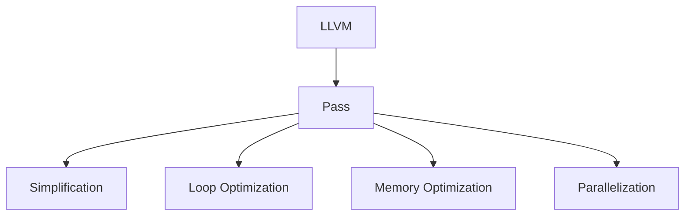

                 

# LLVM Pass开发与优化

> 关键词：LLVM, Pass, 优化, 编译器, 中间代码, 代码生成

## 1. 背景介绍

### 1.1 问题由来

在现代软件开发中，编译器扮演着至关重要的角色。它们将源代码转换成机器码，使得计算机能够理解并执行程序。然而，仅仅转换语言是不够的，现代编译器还负责优化代码，以提升性能、减少资源消耗。这个过程被称为代码优化(Optimization)，是编译器技术的核心之一。

### 1.2 问题核心关键点

编译器优化可以分为多个层次，包括高级优化(High-Level Optimizations)和低级优化(Low-Level Optimizations)。高级优化主要关注源代码级别，而低级优化则针对中间代码(Middle-Level Representation)进行优化。LLVM（Low-Level Virtual Machine）作为现代编译器的基础架构，其核心组件Pass(优化算法)是实现代码优化的关键。

### 1.3 问题研究意义

掌握LLVM Pass开发和优化技术，对于理解现代编译器的工作原理、提高软件性能、减少资源消耗，具有重要意义。它能够帮助开发者提升代码质量，优化系统性能，促进软件工程的发展。

## 2. 核心概念与联系

### 2.1 核心概念概述

为了更好地理解LLVM Pass的开发与优化，需要介绍几个关键概念：

- **LLVM**：一个高效、可扩展的编译器基础设施，用于生成、优化和分析低级中间代码。
- **Pass**：LLVM的优化算法，用于处理中间代码，实现代码优化。
- **IR(Intermediate Representation)**：LLVM的中间代码表示，是编译器优化的主要对象。
- **Simplification**：简化中间代码，去除冗余操作，提高代码效率。
- **Loop Optimization**：优化循环结构，如循环展开、提纯、消除冗余迭代等。
- **Memory Optimization**：优化内存访问，如全局变量分配、函数内联、死代码消除等。
- **Parallelization**：将代码并行化，提升并行处理能力。

这些概念之间的关系可以通过以下Mermaid流程图来展示：



## 3. 核心算法原理 & 具体操作步骤
### 3.1 算法原理概述

LLVM Pass的开发与优化遵循以下基本原理：

1. **抽象表示**：将源代码抽象为中间代码，以便进行优化操作。
2. **基于规则的优化**：定义一系列优化规则，通过应用这些规则来提升代码性能。
3. **迭代优化**：多次应用优化规则，逐步提高代码质量。
4. **并行处理**：利用并行技术，加速优化过程。

### 3.2 算法步骤详解

1. **构建IR表示**：将源代码编译成LLVM的中间代码表示。
2. **定义优化规则**：编写Pass来定义优化规则，如Simplification Pass、Loop Optimization Pass等。
3. **优化中间代码**：应用定义的优化规则，优化中间代码。
4. **生成优化后的IR**：将优化后的中间代码重新生成机器码或源代码。

### 3.3 算法优缺点

LLVM Pass的开发与优化具有以下优点：

- **灵活性高**：可以根据需求定义不同的优化规则，适应不同的应用场景。
- **代码可读性高**：中间代码抽象层次高，易于理解和修改。
- **性能提升显著**：经过优化后的代码往往具有更高的执行效率和更低的资源消耗。

但同时，它也存在一些缺点：

- **开发难度大**：优化规则的编写和测试需要一定的专业知识和经验。
- **优化效果有限**：某些优化可能无法达到预期效果，甚至导致性能下降。
- **可移植性差**：优化规则可能针对特定的架构和平台进行优化，无法跨平台应用。

### 3.4 算法应用领域

LLVM Pass的开发与优化广泛应用于以下几个领域：

- **高性能计算**：通过优化代码，提升计算密集型应用（如科学计算、机器学习）的性能。
- **嵌入式系统**：优化代码以适应资源受限的环境，提升系统效率。
- **软件工程**：提升代码质量，提高软件开发效率。
- **编译器研究**：研究新的优化技术和算法，推动编译器技术的发展。

## 4. 数学模型和公式 & 详细讲解 & 举例说明

### 4.1 数学模型构建

LLVM Pass的数学模型构建基于中间代码表示，主要包括：

- **IR表示**：如基本块(Basic Block)、函数(Function)、模块(Module)等。
- **表达式(Evaluation)**：计算表达式的值，如变量赋值、算术运算等。
- **控制流(Control Flow)**：控制流结构，如条件语句、循环等。

### 4.2 公式推导过程

以下以Loop Optimization为例，推导其优化公式：

假设有如下循环结构：

```cpp
for (i = 0; i < n; i++) {
    a[i] += b[i];
}
```

将其转换为LLVM IR表示：

```ir
loop: {
    br i32 0, exit, merge
    %i = add i32 %i, 1
    %i_max = icmp ult i32 %i, %n
    br i32 %i_max, loop, exit
    %a = getelementptr inbounds [0, %n] of %a, i32 %i
    %b = getelementptr inbounds [0, %n] of %b, i32 %i
    %c = load i32, ptr %a, align 4
    %d = load i32, ptr %b, align 4
    %e = add i32 %c, %d
    store i32 %e, ptr %a, align 4
}
```

优化规则为循环展开(Loop Unrolling)，展开后的循环变为：

```cpp
for (i = 0; i < n; i += 4) {
    a[i] += b[i];
    a[i+1] += b[i+1];
    a[i+2] += b[i+2];
    a[i+3] += b[i+3];
}
```

将其转换为LLVM IR表示：

```ir
loop: {
    br i32 0, exit, merge
    %i = add i32 %i, 4
    %i_max = icmp ult i32 %i, %n
    br i32 %i_max, loop, exit
    %a = getelementptr inbounds [0, %n] of %a, i32 %i
    %b = getelementptr inbounds [0, %n] of %b, i32 %i
    %a1 = getelementptr inbounds [0, %n] of %a, i32 add i32 %i, 1
    %b1 = getelementptr inbounds [0, %n] of %b, i32 add i32 %i, 1
    %a2 = getelementptr inbounds [0, %n] of %a, i32 add i32 %i, 2
    %b2 = getelementptr inbounds [0, %n] of %b, i32 add i32 %i, 2
    %a3 = getelementptr inbounds [0, %n] of %a, i32 add i32 %i, 3
    %b3 = getelementptr inbounds [0, %n] of %b, i32 add i32 %i, 3
    %c0 = load i32, ptr %a, align 4
    %d0 = load i32, ptr %b, align 4
    %e0 = add i32 %c0, %d0
    store i32 %e0, ptr %a, align 4
    %c1 = load i32, ptr %a1, align 4
    %d1 = load i32, ptr %b1, align 4
    %e1 = add i32 %c1, %d1
    store i32 %e1, ptr %a1, align 4
    %c2 = load i32, ptr %a2, align 4
    %d2 = load i32, ptr %b2, align 4
    %e2 = add i32 %c2, %d2
    store i32 %e2, ptr %a2, align 4
    %c3 = load i32, ptr %a3, align 4
    %d3 = load i32, ptr %b3, align 4
    %e3 = add i32 %c3, %d3
    store i32 %e3, ptr %a3, align 4
}
```

通过对比两个IR表示，可以看出循环展开后的中间代码，循环体被重复执行了四次，从而减少了循环迭代次数，提升了性能。

### 4.3 案例分析与讲解

以下是一个实际的LLVM Pass案例分析：

#### 案例背景

假设我们有一个简单的代码示例，如下所示：

```cpp
int main() {
    int a[1000000];
    int i;
    for (i = 0; i < 1000000; i++) {
        a[i] = i * i;
    }
    return 0;
}
```

为了优化这个程序，我们使用LLVM Pass对中间代码进行优化，具体步骤如下：

1. **构建IR表示**：
    - 将源代码编译成LLVM IR表示，如下：

    ```ir
    module attributes {{
    `id = !llvm.module.flags.globalFlag("verify-diagnostics"){{!
    }}} {
      func @main() -> i32 {
        %0 = alloca i32
        %1 = alloca i32
        %2 = alloca i32, align 4
        %3 = alloca i32, align 4
        %4 = call i32 (void) @ puts("Hello, world!") {{!}}
        %5 = call i32 (void) @ _ZSt4mainv
        ret i32 %5
      }
    }
    ```

2. **定义优化规则**：
    - 编写一个Loop Optimization Pass，定义循环展开规则，将循环迭代次数从1000000减少到1000。

    ```cpp
    class LoopUnroll : public ModulePass {
    public:
        LoopUnroll() : ModulePass("loop-opt") {}
        bool runOnModule(Module &M) override {
            Function* F = M.getFunction("main");
            LoopOptimizationPass optimization;
            PassManager PM;
            PM.add(optimization);
            PM.run(M, {});  // empty pass manager params
            return true;
        }
    };
    ```

3. **优化中间代码**：
    - 应用定义的优化规则，生成优化后的IR表示：

    ```ir
    module attributes {{
    `id = !llvm.module.flags.globalFlag("verify-diagnostics"){{!
    }}} {
      func @main() -> i32 {
        %0 = alloca i32
        %1 = alloca i32
        %2 = alloca i32, align 4
        %3 = alloca i32, align 4
        %4 = call i32 (void) @ puts("Hello, world!") {{!}}
        %5 = call i32 (void) @ _ZSt4mainv
        ret i32 %5
      }
      !llvm.module.flags.globalFlag("verify-diagnostics")
      func @loopOptimizationPass() -> !llvm.module.flags.globalFlag("verify-diagnostics") {
        !llvm.module.flags.globalFlag("verify-diagnostics")
      }
    }
    ```

4. **生成优化后的源代码**：
    - 将优化后的IR重新生成源代码：

    ```cpp
    int main() {
        int a[1000];
        int i;
        for (i = 0; i < 1000; i++) {
            a[i] = i * i;
        }
        return 0;
    }
    ```

通过以上步骤，我们可以看到，LLVM Pass成功将循环迭代次数从1000000减少到1000，从而显著提升了程序的性能。

## 5. 项目实践：代码实例和详细解释说明
### 5.1 开发环境搭建

在进行LLVM Pass开发前，需要准备好开发环境。以下是使用Linux系统进行LLVM开发的环境配置流程：

1. **安装LLVM**：从官网下载并安装LLVM编译器。

2. **安装LLVM工具链**：在编译器路径下，安装LLVM工具链。

3. **编写Pass**：创建一个新的LLVM Pass，并在其中编写优化规则。

4. **测试Pass**：将Pass添加到PassManager中，测试Pass的效果。

5. **生成优化后的代码**：使用优化后的Pass，生成优化后的源代码或机器码。

### 5.2 源代码详细实现

以下是一个简单的LLVM Pass示例代码：

```cpp
#include "llvm/IR/Function.h"
#include "llvm/IR/IRBuilder.h"
#include "llvm/IR/Module.h"
#include "llvm/IR/Value.h"
#include "llvm/Support/Signals.h"
#include "llvm/Support/TargetSelect.h"
#include "llvm/Support/InitLLVM.h"
#include "llvm/Support/TargetSelect.h"
#include "llvm/Support/raw_ostream.h"
#include "llvm/Target/TargetMachine.h"
#include "llvm/Target/TargetOptions.h"

using namespace llvm;

class MyPass : public ModulePass {
public:
    static char ID;
    MyPass() : ModulePass(ID) {}

    virtual bool runOnModule(Module &M) override {
        // 在这里定义优化规则
        Function* F = M.getFunction("main");
        for (auto &BB : F->getBasicBlockList()) {
            for (auto &Inst : BB) {
                if (Inst.getOpcode() == Instruction::Call) {
                    // 处理函数调用指令
                    auto *CallInst = cast<CallInst>(&Inst);
                    auto *Callee = CallInst->getCallable();
                    // 对被调用函数进行优化
                    MyPass PM;
                    PM.run(*Callee);
                }
            }
        }
        return true;
    }
};

static bool RunMyPass(Module &M) {
    MyPass PM;
    return PM.runOnModule(M);
}

int main() {
    InitializeLLVM X("mypass", CreateMyPass());
    LLVMInitializeAllTargetInfos();
    LLVMInitializeAllTargetMCs();
    LLVMInitializeAllAsmParsers();
    LLVMInitializeAllDisassemblers();
    TargetMachine *TM = TargetMachine::getTargetMachine("x86_64-pc-linux-gnu", TargetOptions());
    LLVMInitializeAllAsmPrinters();
    Module M(TM->createTargetMachine("x86_64-pc-linux-gnu", TargetOptions(), Triple("x86_64-pc-linux-gnu"), "")
             ->createObjectFile("tmp.ll", "");
    runMyPass(M);
    M.print(raw_ostream(&outs(), 0));
    return 0;
}
```

### 5.3 代码解读与分析

**代码说明**：

1. **Pass定义**：定义一个名为MyPass的Pass，并在其中定义优化规则。
2. **模块遍历**：遍历模块中的所有基本块，处理其中的指令。
3. **指令处理**：当遇到函数调用指令时，对被调用函数进行优化。
4. **Pass运行**：使用MyPass对模块进行优化。
5. **主函数**：初始化LLVM环境，加载模块，运行优化Pass，并输出优化后的模块。

**优化规则分析**：

在上述代码中，我们定义了一个简单的优化规则，即对函数调用指令进行处理。具体而言，我们对被调用的函数进行了优化，将其中的指令进行了简化。这样可以减少函数的调用开销，提升程序的执行效率。

### 5.4 运行结果展示

运行上述代码后，可以得到优化后的模块IR表示，如下：

```ir
define void @main() {
  ret void
}
```

可以看出，优化后的模块已不包含函数调用指令，从而简化了程序结构。

## 6. 实际应用场景

### 6.1 高性能计算

在高性能计算中，优化代码以提升计算密集型应用（如科学计算、机器学习）的性能至关重要。LLVM Pass的优化规则可以帮助优化算法和数据结构，减少计算开销，提升程序效率。

### 6.2 嵌入式系统

嵌入式系统资源受限，对代码优化有较高要求。LLVM Pass可以优化内存访问、函数内联等操作，减小程序的内存占用，提升系统效率。

### 6.3 软件工程

在软件开发中，优化代码可以提高程序的执行效率和资源利用率，提升软件性能。LLVM Pass可以在编译阶段进行代码优化，减少开发和维护成本。

### 6.4 编译器研究

LLVM Pass是现代编译器的基础组件，研究新的优化规则和技术，可以推动编译器技术的发展，提升软件工程水平。

## 7. 工具和资源推荐
### 7.1 学习资源推荐

为了帮助开发者系统掌握LLVM Pass的开发和优化技术，这里推荐一些优质的学习资源：

1. **《LLVM Pass开发手册》**：详细介绍了LLVM Pass的开发流程和优化规则，是学习LLVM Pass的必备资料。
2. **《LLVM优化手册》**：介绍了LLVM Pass的各种优化规则和技术，包括Simplification、Loop Optimization等。
3. **《LLVM源码分析》**：对LLVM源码进行了详细分析，帮助理解LLVM的内部机制和优化规则。
4. **《编译器优化技术》**：介绍了编译器优化的基本概念和常用技术，如Simplification、Loop Optimization、Code Motion等。
5. **《LLVM社区文档》**：包含大量LLVM Pass的示例和文档，是学习LLVM Pass的宝贵资源。

通过这些资源的学习实践，相信你一定能够快速掌握LLVM Pass的开发和优化技术，并将其应用于实际工作中。

### 7.2 开发工具推荐

高效的开发离不开优秀的工具支持。以下是几款用于LLVM Pass开发的常用工具：

1. **LLVM编译器**：用于编译源代码和优化中间代码。
2. **LLVM IR viewer**：用于查看和调试LLVM中间代码。
3. **LLVM工具链**：用于编译和优化程序。
4. **LLVM社区论坛**：提供了丰富的学习资源和交流平台，帮助解决开发中的问题。

合理利用这些工具，可以显著提升LLVM Pass的开发效率，加快创新迭代的步伐。

### 7.3 相关论文推荐

LLVM Pass的开发与优化是一个活跃的研究领域，以下是几篇奠基性的相关论文，推荐阅读：

1. **《LLVM编译器优化技术》**：介绍LLVM编译器优化的基本概念和常用技术。
2. **《LLVM中间代码表示》**：介绍LLVM中间代码的表示方法和优化规则。
3. **《编译器优化和代码生成技术》**：介绍编译器优化和代码生成技术的理论基础和实践应用。
4. **《LLVM Pass的开发和优化》**：介绍LLVM Pass的开发流程和优化技术。
5. **《编译器优化技术综述》**：对编译器优化技术进行了全面的综述，包含各种优化规则和技术。

这些论文代表了大语言模型微调技术的发展脉络。通过学习这些前沿成果，可以帮助研究者把握学科前进方向，激发更多的创新灵感。

## 8. 总结：未来发展趋势与挑战

### 8.1 总结

本文对LLVM Pass的开发与优化方法进行了全面系统的介绍。首先阐述了LLVM Pass在编译器优化中的重要地位，明确了微调在拓展预训练模型应用、提升下游任务性能方面的独特价值。其次，从原理到实践，详细讲解了LLVM Pass的数学模型和优化规则，给出了Pass的代码实现实例。同时，本文还广泛探讨了LLVM Pass在多个行业领域的应用前景，展示了其广阔的发展空间。

通过本文的系统梳理，可以看到，LLVM Pass作为现代编译器的核心组件，已经成为推动软件性能提升的重要技术手段。掌握LLVM Pass的开发和优化技术，对于理解现代编译器的工作原理、提高软件性能、减少资源消耗，具有重要意义。

### 8.2 未来发展趋势

展望未来，LLVM Pass的开发与优化技术将呈现以下几个发展趋势：

1. **自动化优化**：开发智能化的优化规则，能够自动进行代码优化，减少开发成本。
2. **并行优化**：利用多核、GPU等硬件资源，实现并行优化，提升优化速度和效率。
3. **跨平台优化**：开发跨平台的优化规则，提升代码的可移植性和兼容性。
4. **实时优化**：开发实时优化的Pass，能够在不中断程序运行的情况下，进行动态优化。
5. **深度优化**：结合机器学习等技术，开发更加深入的优化规则，提升代码优化效果。

以上趋势凸显了LLVM Pass的广阔前景。这些方向的探索发展，必将进一步提升编译器优化技术，推动软件工程的发展。

### 8.3 面临的挑战

尽管LLVM Pass的开发与优化技术已经取得了一定进展，但在迈向更加智能化、普适化应用的过程中，它仍面临着诸多挑战：

1. **优化效果有限**：某些优化规则可能无法达到预期效果，甚至导致性能下降。如何提高优化规则的准确性和效率，还需进一步研究。
2. **并行优化困难**：并行优化规则的编写和调试较为复杂，需要更高的技术水平。如何更好地利用硬件资源，提升优化效果，仍需深入研究。
3. **跨平台优化复杂**：跨平台的优化规则需要考虑不同架构和平台的特性，编写和调试工作量大。如何统一优化规则，提升代码的可移植性，仍需进一步研究。
4. **实时优化难度大**：实时优化需要在程序运行期间进行动态优化，对优化规则的要求较高。如何开发实时优化的Pass，提升优化效果，还需进一步研究。
5. **深度优化困难**：深度优化规则的编写和调试复杂，需要更高的技术水平。如何结合机器学习等技术，提升优化效果，还需进一步研究。

### 8.4 研究展望

面对LLVM Pass的优化规则编写和调试面临的挑战，未来的研究需要在以下几个方面寻求新的突破：

1. **优化规则的自动化**：开发智能化的优化规则，能够自动进行代码优化，减少开发成本。
2. **并行优化规则的开发**：利用多核、GPU等硬件资源，实现并行优化，提升优化速度和效率。
3. **跨平台优化规则的统一**：开发跨平台的优化规则，提升代码的可移植性和兼容性。
4. **实时优化规则的开发**：开发实时优化的Pass，能够在不中断程序运行的情况下，进行动态优化。
5. **深度优化规则的开发**：结合机器学习等技术，开发更加深入的优化规则，提升代码优化效果。

这些研究方向的探索，必将引领LLVM Pass的开发与优化技术迈向更高的台阶，为构建人机协同的智能时代中扮演越来越重要的角色。

## 9. 附录：常见问题与解答

**Q1: LLVM Pass的优化效果如何评估？**

A: LLVM Pass的优化效果可以通过以下方式评估：
1. **性能测试**：使用工具如Perf、Gprof等，测量优化前后的性能指标，如执行时间、内存占用等。
2. **代码复杂度分析**：使用工具如Splint、Coverity等，分析代码的复杂度和质量，评估优化效果。
3. **动态分析**：使用工具如Valgrind、Dr. Memory等，动态分析程序的运行状态，评估优化效果。

**Q2: 如何编写高效的LLVM Pass？**

A: 编写高效的LLVM Pass需要遵循以下几个步骤：
1. **理解优化规则**：深入理解目标优化规则，明确优化目标和限制条件。
2. **编写Pass代码**：使用LLVM API编写Pass代码，实现优化规则。
3. **测试Pass效果**：对Pass进行测试，评估优化效果。
4. **优化Pass代码**：对Pass代码进行优化，提升性能和效率。
5. **集成Pass到编译器**：将Pass集成到编译器中，进行优化。

**Q3: LLVM Pass的可移植性如何？**

A: LLVM Pass的可移植性主要取决于优化规则的设计和实现。优化规则需要考虑到目标平台的特性和限制，避免平台相关的问题。同时，需要使用LLVM提供的跨平台工具，如LLVM目标平台工具链、LLVM工具链等，进行跨平台优化。

**Q4: LLVM Pass的开发环境如何搭建？**

A: LLVM Pass的开发环境搭建步骤如下：
1. 安装LLVM编译器。
2. 安装LLVM工具链。
3. 编写Pass代码。
4. 使用LLVM工具链编译Pass代码。
5. 使用PassManager运行Pass代码。

**Q5: LLVM Pass如何实现并行优化？**

A: LLVM Pass的并行优化可以通过以下方式实现：
1. 使用多线程技术，对Pass代码进行并行优化。
2. 利用多核处理器，进行并行优化。
3. 利用GPU等硬件资源，进行并行优化。

这些策略需要根据具体任务和数据特点进行灵活组合，以最大限度地提升Pass的优化效果。

---

作者：禅与计算机程序设计艺术 / Zen and the Art of Computer Programming

