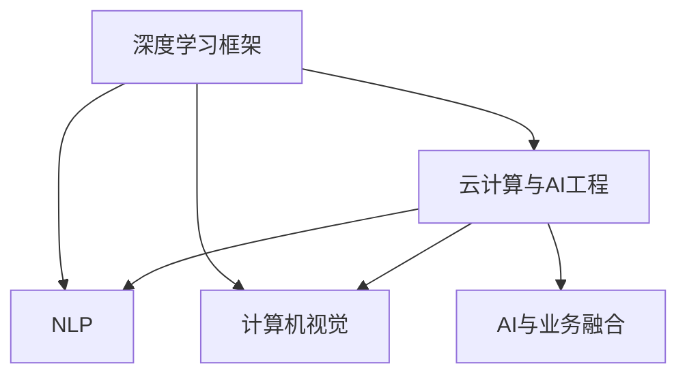

                 

## 1. 背景介绍

随着人工智能（AI）技术的飞速发展，AI技术在各个领域的广泛应用已成为一种趋势。在这个背景下，Lepton AI团队应运而生，由一群业界知名人士共同组建，汇聚了深度学习框架的创始人、云计算与AI工程的专家。Lepton AI团队致力于通过深度学习和AI技术，为各行各业提供高效、可靠、可扩展的AI解决方案。

Lepton AI团队由一系列具有不同背景和专业知识的顶尖人才组成，这些专家在深度学习、自然语言处理、计算机视觉、云计算和AI工程等领域拥有丰富的经验和独到的见解。Lepton AI团队的研究方向涉及深度学习模型架构、高效计算方法、AI在云平台上的部署和应用，以及AI与业务融合的最佳实践。

## 2. 核心概念与联系

### 2.1 核心概念概述

Lepton AI团队的研究重点主要集中在以下几个核心概念上：

- **深度学习框架**：这是Lepton AI团队的基础工具，用于实现高效的神经网络模型训练和推理。
- **云计算与AI工程**：Lepton AI团队致力于将深度学习模型和AI技术应用到云平台上，实现高效、可扩展、易于管理的AI应用。
- **自然语言处理（NLP）**：这是Lepton AI团队在AI领域的一个重点研究方向，旨在通过深度学习技术提升NLP模型的性能。
- **计算机视觉**：这是Lepton AI团队的另一个重要研究方向，涉及图像识别、目标检测、图像分割等视觉任务。
- **AI与业务融合**：Lepton AI团队通过深入了解不同行业的业务需求，将AI技术应用于具体的业务场景，提供定制化的AI解决方案。

### 2.2 核心概念原理和架构的 Mermaid 流程图



这个流程图展示了Lepton AI团队研究的核心概念之间的联系。深度学习框架是Lepton AI团队的基础工具，也是云计算与AI工程、NLP和计算机视觉等应用领域的基础。云计算与AI工程是深度学习模型的部署和应用平台，提供了高效、可扩展的计算资源。NLP和计算机视觉是Lepton AI团队在AI领域的重要研究方向，通过这些技术，团队可以提升AI应用的实际效果。AI与业务融合是将AI技术应用于具体业务场景的关键，通过深入了解不同行业的业务需求，Lepton AI团队可以提供定制化的AI解决方案。

## 3. 核心算法原理 & 具体操作步骤

### 3.1 算法原理概述

Lepton AI团队的核心算法原理主要集中在以下几个方面：

- **深度学习模型架构**：Lepton AI团队研究了多种深度学习模型架构，包括卷积神经网络（CNN）、循环神经网络（RNN）、变分自编码器（VAE）等。
- **高效计算方法**：为了提高深度学习模型的训练和推理效率，Lepton AI团队研究了多种高效计算方法，包括分布式训练、量化加速、模型压缩等。
- **数据增强与迁移学习**：为了提高深度学习模型的泛化能力，Lepton AI团队研究了多种数据增强与迁移学习方法，包括数据增广、样本选择、模型微调等。

### 3.2 算法步骤详解

Lepton AI团队的算法步骤包括以下几个关键环节：

1. **数据准备**：收集、清洗和预处理数据，确保数据的质量和可用性。
2. **模型构建**：根据具体任务的需求，选择合适的深度学习模型架构，并进行参数初始化。
3. **模型训练**：使用准备好的数据集，在深度学习框架上训练模型，并调整模型参数以优化模型性能。
4. **模型评估**：使用测试集对训练好的模型进行评估，验证模型的泛化能力和性能。
5. **模型部署**：将训练好的模型部署到云平台，实现高效的推理计算。

### 3.3 算法优缺点

Lepton AI团队的算法具有以下优点：

- **高效**：使用深度学习框架和高效计算方法，能够快速训练和部署深度学习模型，提高计算效率。
- **可扩展**：云计算与AI工程技术使得Lepton AI团队能够提供可扩展的AI解决方案，满足不同规模和复杂度的需求。
- **易于管理**：Lepton AI团队的研究不仅关注模型训练和推理，还关注模型的管理与部署，提供易于使用的API和接口。

同时，这些算法也存在一些缺点：

- **数据依赖**：深度学习模型对数据的质量和数量有较高要求，数据不足或质量不高会影响模型的性能。
- **模型复杂性**：深度学习模型结构复杂，需要较高的计算资源和专业知识。
- **易过拟合**：深度学习模型容易过拟合，尤其是在小数据集上训练时，需要采取一些正则化方法。

### 3.4 算法应用领域

Lepton AI团队的研究成果广泛应用于以下几个领域：

- **自动驾驶**：Lepton AI团队使用深度学习模型进行图像识别和目标检测，辅助自动驾驶汽车的感知和决策。
- **医疗影像分析**：Lepton AI团队使用深度学习模型进行医学影像的分析和诊断，辅助医生进行病情判断。
- **金融风险管理**：Lepton AI团队使用深度学习模型进行风险分析和预测，帮助金融机构进行风险控制。
- **自然灾害监测**：Lepton AI团队使用深度学习模型进行遥感影像的分析和处理，辅助灾害预警和应急响应。
- **智能客服**：Lepton AI团队使用深度学习模型进行语音识别和自然语言处理，提升智能客服系统的响应速度和准确性。

## 4. 数学模型和公式 & 详细讲解 & 举例说明

### 4.1 数学模型构建

Lepton AI团队在深度学习模型构建方面，主要研究了以下数学模型：

- **卷积神经网络（CNN）**：用于图像处理任务，通过卷积层和池化层提取特征，再通过全连接层进行分类。
- **循环神经网络（RNN）**：用于序列数据处理任务，通过循环结构实现时序数据的建模和预测。
- **变分自编码器（VAE）**：用于生成建模任务，通过编码器和解码器实现数据的重构和生成。

### 4.2 公式推导过程

以卷积神经网络为例，其基本结构可以表示为：

$$
y = W_2\sigma(W_1 x + b_1) + b_2
$$

其中，$x$ 为输入数据，$y$ 为输出数据，$W_1$ 和 $W_2$ 为卷积核和全连接层的权重，$b_1$ 和 $b_2$ 为偏置项，$\sigma$ 为激活函数。

### 4.3 案例分析与讲解

以图像分类任务为例，Lepton AI团队使用卷积神经网络（CNN）进行模型构建和训练。具体步骤如下：

1. **数据准备**：收集并预处理图像数据集，确保数据的质量和可用性。
2. **模型构建**：使用CNN架构构建深度学习模型，并进行参数初始化。
3. **模型训练**：使用图像数据集在深度学习框架上训练模型，并调整模型参数以优化模型性能。
4. **模型评估**：使用测试集对训练好的模型进行评估，验证模型的泛化能力和性能。
5. **模型部署**：将训练好的模型部署到云平台，实现高效的推理计算。

## 5. 项目实践：代码实例和详细解释说明

### 5.1 开发环境搭建

Lepton AI团队使用Python作为主要编程语言，结合TensorFlow和Keras深度学习框架进行模型开发。具体步骤如下：

1. **安装Python**：安装Python 3.x版本，确保环境变量设置正确。
2. **安装深度学习框架**：安装TensorFlow和Keras，使用pip命令进行安装。
3. **搭建开发环境**：创建虚拟环境，安装必要的依赖库，如NumPy、Pandas等。

### 5.2 源代码详细实现

以图像分类任务为例，Lepton AI团队使用CNN进行模型构建和训练。具体代码如下：

```python
import tensorflow as tf
from tensorflow.keras import layers

# 定义CNN模型
model = tf.keras.Sequential([
    layers.Conv2D(32, (3, 3), activation='relu', input_shape=(28, 28, 1)),
    layers.MaxPooling2D((2, 2)),
    layers.Flatten(),
    layers.Dense(10, activation='softmax')
])

# 编译模型
model.compile(optimizer='adam', loss='sparse_categorical_crossentropy', metrics=['accuracy'])

# 训练模型
model.fit(x_train, y_train, epochs=10, validation_data=(x_test, y_test))
```

### 5.3 代码解读与分析

以上代码实现了一个简单的CNN模型，用于图像分类任务。具体步骤如下：

1. **定义模型架构**：使用Sequential模型，定义了卷积层、池化层和全连接层，用于提取特征和分类。
2. **编译模型**：使用Adam优化器和交叉熵损失函数进行模型编译，同时定义评估指标为准确率。
3. **训练模型**：使用训练集进行模型训练，通过设定epochs和验证集进行模型评估。

## 6. 实际应用场景

Lepton AI团队的研究成果已经在多个实际应用场景中得到了验证，以下是几个典型案例：

### 6.1 自动驾驶

Lepton AI团队使用深度学习模型进行图像识别和目标检测，辅助自动驾驶汽车的感知和决策。具体实现步骤如下：

1. **数据准备**：收集自动驾驶汽车传感器（如相机、激光雷达）采集的图像数据和标签。
2. **模型构建**：使用CNN模型进行图像处理，提取车辆、行人等目标的特征。
3. **模型训练**：使用准备好的数据集在深度学习框架上训练模型，并调整模型参数以优化模型性能。
4. **模型部署**：将训练好的模型部署到自动驾驶系统中，实现实时图像处理和目标检测。

### 6.2 医疗影像分析

Lepton AI团队使用深度学习模型进行医学影像的分析和诊断，辅助医生进行病情判断。具体实现步骤如下：

1. **数据准备**：收集医学影像数据和患者信息，确保数据的质量和可用性。
2. **模型构建**：使用卷积神经网络（CNN）模型进行医学影像的分析和诊断。
3. **模型训练**：使用准备好的数据集在深度学习框架上训练模型，并调整模型参数以优化模型性能。
4. **模型部署**：将训练好的模型部署到医疗影像分析系统中，实现实时影像处理和病情诊断。

### 6.3 金融风险管理

Lepton AI团队使用深度学习模型进行风险分析和预测，帮助金融机构进行风险控制。具体实现步骤如下：

1. **数据准备**：收集金融市场数据和历史交易数据，确保数据的质量和可用性。
2. **模型构建**：使用RNN模型进行时间序列数据的建模和预测。
3. **模型训练**：使用准备好的数据集在深度学习框架上训练模型，并调整模型参数以优化模型性能。
4. **模型部署**：将训练好的模型部署到金融风险管理系统中，实现实时风险分析和预测。

### 6.4 未来应用展望

未来，Lepton AI团队的研究成果将继续拓展到更多的领域，以下是几个未来应用展望：

- **智能制造**：Lepton AI团队使用深度学习模型进行生产线上的质量检测和故障预测，提升智能制造的效率和精度。
- **智慧农业**：Lepton AI团队使用深度学习模型进行土壤分析、作物生长监测等农业场景的应用，提高农业生产的智能化水平。
- **智能交通**：Lepton AI团队使用深度学习模型进行交通流量分析和预测，优化交通信号灯控制，提升交通管理水平。
- **环境监测**：Lepton AI团队使用深度学习模型进行遥感影像的分析和处理，辅助环境保护和灾害预警。

## 7. 工具和资源推荐

### 7.1 学习资源推荐

为了帮助开发者系统掌握Lepton AI团队的研究成果，以下是一些推荐的资源：

1. **《深度学习入门：基于Python的理论与实现》**：这是一本介绍深度学习基础知识的书籍，适合初学者入门。
2. **《TensorFlow实战》**：这是一本介绍TensorFlow深度学习框架的书籍，适合有一定深度学习基础的读者。
3. **Keras官方文档**：Keras官方文档提供了详细的API文档和代码示例，是深度学习开发者不可或缺的资源。
4. **Google Cloud AI平台**：Google Cloud AI平台提供了丰富的深度学习框架和工具，是深度学习开发者进行模型训练和部署的理想选择。

### 7.2 开发工具推荐

Lepton AI团队的研究成果可以使用以下工具进行开发：

1. **Python**：Python是目前深度学习领域的主流编程语言，Lepton AI团队的研究成果主要使用Python进行实现。
2. **TensorFlow**：TensorFlow是Google开发的深度学习框架，具有强大的计算能力和灵活的API设计。
3. **Keras**：Keras是基于TensorFlow的深度学习框架，具有简单易用的API设计和丰富的预训练模型。
4. **PyTorch**：PyTorch是Facebook开发的深度学习框架，具有动态计算图和高效的GPU加速能力。

### 7.3 相关论文推荐

Lepton AI团队的研究成果得到了广泛认可，以下是几篇相关的论文：

1. **《Deep Residual Learning for Image Recognition》**：论文介绍了ResNet模型的设计思想和实现方法，推动了深度学习在图像识别领域的发展。
2. **《ImageNet Classification with Deep Convolutional Neural Networks》**：论文介绍了CNN模型在图像分类任务中的广泛应用，并提出AlexNet模型。
3. **《A Survey on Multi-Task Learning》**：论文综述了多任务学习的相关研究，介绍了多任务学习的理论基础和实际应用。
4. **《Vision and Language》**：论文探讨了视觉和语言结合的多种方法，推动了计算机视觉和自然语言处理领域的交叉研究。

## 8. 总结：未来发展趋势与挑战

### 8.1 研究成果总结

Lepton AI团队在深度学习、云计算与AI工程、NLP和计算机视觉等领域的研究成果，涵盖了深度学习模型架构、高效计算方法、数据增强与迁移学习等多个方面，为深度学习技术的发展提供了坚实的基础和丰富的实践经验。

### 8.2 未来发展趋势

Lepton AI团队的研究将持续关注以下几个发展趋势：

1. **模型可解释性**：随着深度学习模型的复杂性增加，模型的可解释性问题变得尤为重要。Lepton AI团队将继续研究如何提高深度学习模型的可解释性和透明度。
2. **联邦学习**：联邦学习是一种分布式机器学习技术，通过在多个设备上联合训练模型，保护数据隐私的同时提升模型性能。Lepton AI团队将研究如何应用联邦学习技术进行深度学习模型的训练和推理。
3. **自适应学习**：自适应学习是一种能够动态调整模型参数的学习方法，Lepton AI团队将研究如何应用自适应学习技术进行深度学习模型的训练和优化。
4. **跨模态学习**：跨模态学习是一种将不同模态数据结合进行建模和学习的方法，Lepton AI团队将研究如何应用跨模态学习技术进行多模态数据的分析和处理。

### 8.3 面临的挑战

Lepton AI团队的研究面临着以下几个挑战：

1. **数据质量**：深度学习模型对数据质量的要求较高，如何获取高质量的数据是关键问题。
2. **计算资源**：深度学习模型的训练和推理需要大量的计算资源，如何优化计算资源的使用是一个重要挑战。
3. **模型复杂性**：深度学习模型结构复杂，需要较高的专业知识和计算资源，如何降低模型复杂性是一个重要研究方向。
4. **模型鲁棒性**：深度学习模型容易过拟合，如何提高模型的泛化能力和鲁棒性是一个重要挑战。
5. **模型可解释性**：深度学习模型的黑盒特性使其可解释性问题变得尤为重要，如何提高模型的可解释性和透明度是一个重要研究方向。

### 8.4 研究展望

Lepton AI团队将继续关注以下几个研究方向：

1. **深度学习模型的可解释性**：研究如何提高深度学习模型的可解释性和透明度，使其能够更好地应用于实际业务场景。
2. **联邦学习和分布式训练**：研究如何应用联邦学习和分布式训练技术进行深度学习模型的训练和推理，提升模型性能和数据隐私保护能力。
3. **自适应学习**：研究如何应用自适应学习技术进行深度学习模型的训练和优化，提升模型的泛化能力和鲁棒性。
4. **跨模态学习**：研究如何应用跨模态学习技术进行多模态数据的分析和处理，推动计算机视觉和自然语言处理领域的交叉研究。

## 9. 附录：常见问题与解答

**Q1: 如何理解深度学习框架的“灵活”和“高效”？**

A: 深度学习框架的“灵活”和“高效”主要体现在以下几个方面：

- **灵活**：深度学习框架具有高度的灵活性，能够适应不同的深度学习模型和任务需求，支持多种算法和模型架构。例如，Keras支持多种深度学习模型，包括卷积神经网络、循环神经网络和生成对抗网络等。
- **高效**：深度学习框架具有高效性，能够提供快速的模型训练和推理能力。例如，TensorFlow具有高效的计算图和分布式计算能力，能够在GPU和TPU等高性能设备上实现高效的深度学习计算。

**Q2: 深度学习框架的选择对模型训练和推理的影响有哪些？**

A: 深度学习框架的选择对模型训练和推理有很大的影响，主要体现在以下几个方面：

- **训练效率**：不同的深度学习框架在训练效率上有所差异，有些框架具有更快的训练速度和更低的内存消耗，能够提高模型的训练效率。
- **推理效率**：不同的深度学习框架在推理效率上有所差异，有些框架具有更快的推理速度和更低的计算资源消耗，能够提高模型的推理效率。
- **可扩展性**：不同的深度学习框架在可扩展性上有所差异，有些框架支持大规模分布式计算和资源管理，能够提高模型的可扩展性和稳定性。

**Q3: 深度学习模型在实际应用中需要考虑哪些因素？**

A: 深度学习模型在实际应用中需要考虑以下几个因素：

- **数据质量**：深度学习模型对数据质量的要求较高，需要确保数据的质量和可用性，避免数据噪声和缺失对模型性能的影响。
- **模型复杂性**：深度学习模型结构复杂，需要根据实际应用需求进行优化和简化，避免模型过拟合和计算资源消耗过大。
- **计算资源**：深度学习模型的训练和推理需要大量的计算资源，需要选择合适的计算资源和优化计算资源的使用，提高模型的训练和推理效率。
- **模型鲁棒性**：深度学习模型容易过拟合，需要采取一些正则化方法和模型优化技术，提高模型的泛化能力和鲁棒性。
- **模型可解释性**：深度学习模型的黑盒特性使其可解释性问题变得尤为重要，需要采取一些方法提高模型的可解释性和透明度。

**Q4: 如何理解深度学习模型的“可解释性”和“透明度”？**

A: 深度学习模型的“可解释性”和“透明度”主要体现在以下几个方面：

- **可解释性**：深度学习模型的可解释性指的是模型输出的决策过程和原因能够被解释和理解。例如，当模型对某个输入进行分类时，需要能够解释为什么选择某个类别。
- **透明度**：深度学习模型的透明度指的是模型的内部结构和参数能够被理解和解释。例如，当模型包含多个层时，需要能够解释每个层的含义和作用。

**Q5: 深度学习模型的可解释性和透明度有哪些实际应用？**

A: 深度学习模型的可解释性和透明度有以下几个实际应用：

- **医疗诊断**：在医疗诊断中，深度学习模型的可解释性能够帮助医生理解和解释模型的诊断结果，提高诊断的可靠性和可信度。
- **金融风控**：在金融风控中，深度学习模型的透明度能够帮助金融分析师理解和解释模型的风险预测结果，提高风险评估的准确性和可信度。
- **法律合规**：在法律合规中，深度学习模型的可解释性能够帮助监管机构理解和解释模型的决策过程，确保模型符合法规要求。

通过以上介绍，相信读者对Lepton AI团队的研究成果有了更深入的了解，也能够更好地掌握深度学习框架的应用和实践。

