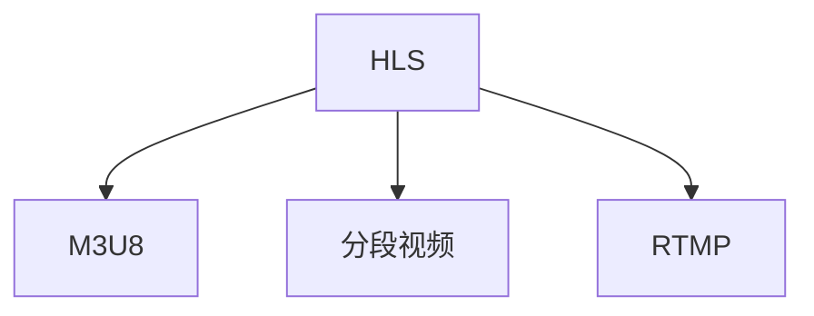

                 

# M3U8 播放列表格式：分段视频的索引和加载

> 关键词：M3U8, HLS, RTMP, 分段视频, 索引文件, 视频流, 直播, 点播

## 1. 背景介绍

### 1.1 问题由来

随着互联网的普及和视频内容的多样化，视频流的传输和播放成为网络应用中的重要需求。传统的HTTP下载方式无法满足实时播放的需求，因此诞生了流媒体技术。HLS（HTTP Live Streaming）和RTMP（Real-Time Messaging Protocol）是当前最流行的流媒体传输协议。

HLS是一种基于HTTP的流媒体传输协议，它将视频流分割成多个小片段，每个片段都包含起始时间戳和结束时间戳，可以按顺序播放或跳过。而RTMP则是一种基于TCP的流媒体传输协议，它通过UDP进行视频流的传输，具有低延迟、高可靠性的特点。

M3U8是HLS中用于描述视频流分段索引的文件格式。M3U8文件包含了每个视频分段的URI、起始时间戳和持续时间等关键信息，通过解析M3U8文件，流媒体客户端可以下载和播放分段视频流。

## 2. 核心概念与联系

### 2.1 核心概念概述

为了更好地理解M3U8文件格式，本节将介绍几个关键的概念：

- HLS（HTTP Live Streaming）：一种基于HTTP的流媒体传输协议，用于实现在浏览器和移动设备上播放实时视频。
- RTMP（Real-Time Messaging Protocol）：一种基于TCP的流媒体传输协议，具有低延迟、高可靠性的特点，常用于直播应用。
- M3U8：一种用于描述HLS视频流分段索引的文件格式，包含分段URI、起始时间戳、持续时间等信息。
- 分段视频流：将视频流分割成多个小片段，每个片段包含起始时间戳和结束时间戳，便于缓存和加载。

这些概念之间的逻辑关系可以通过以下Mermaid流程图来展示：



这个流程图展示了几者之间的联系：

1. HLS将视频流分割成多个分段，使用M3U8文件描述每个分段的索引信息。
2. 分段视频是M3U8文件的基本组成单位，RTMP可以通过分段视频流进行直播。

## 3. 核心算法原理 & 具体操作步骤
### 3.1 算法原理概述

M3U8文件格式是HLS协议中用于描述视频分段索引的标准格式。它的主要作用是将长视频流分割成多个小片段，每个片段都包含起始时间戳和持续时间，便于流媒体客户端按需下载和播放。

M3U8文件由多行文本组成，每行文本包含了视频分段的相关信息，如URI、起始时间戳和持续时间。以下是M3U8文件的基本格式示例：

```
#EXTM3U
#EXT-X-VERSION: 3
#EXT-X-MEDIA-GROUP-ID: 1234567890
#EXT-X-TARGETDURATION: 10
#EXT-X-MEDIA-SEQUENCE: 0
#EXT-X-INF: 0,targetDuration=10,segmentIndex=0
#EXT-X-INF: 1,targetDuration=10,segmentIndex=1
#EXT-X-INF: 2,targetDuration=10,segmentIndex=2
#EXT-X-ENDLIST
```

其中，每个#EXT-X-INF行包含了分段的信息，如：

- `targetDuration`：视频分段持续时间。
- `segmentIndex`：分段索引。
- `uri`：分段URI地址。
- `startNumber`：分段起始时间戳。
- `duration`：分段持续时间。

### 3.2 算法步骤详解

解析M3U8文件的过程可以分为以下几个步骤：

**Step 1: 获取M3U8文件**
- 通过网络请求获取M3U8文件，通常存储在服务器上。
- 下载M3U8文件，保存在本地。

**Step 2: 解析M3U8文件**
- 打开M3U8文件，逐行读取。
- 解析每行文本，提取出分段信息。
- 将所有分段信息存储到一个数组中。

**Step 3: 下载分段视频**
- 根据M3U8文件中的分段信息，生成每个分段的视频下载URL。
- 按顺序下载每个分段的视频，并将它们合并成完整的视频文件。

### 3.3 算法优缺点

M3U8文件格式的优点包括：

1. 分段下载：通过将视频流分割成多个小片段，可以提高视频流的缓存效率和播放稳定性。
2. 实时播放：M3U8格式适合实时播放，因为每个分段都包含起始时间戳和持续时间，可以按需加载。
3. 跨平台支持：HLS和RTMP是跨平台支持的流媒体协议，可以在不同的设备和浏览器上播放。

同时，M3U8格式也存在一些缺点：

1. 解析复杂：解析M3U8文件需要解析大量的文本行，增加了代码复杂度。
2. 数据冗余：每个分段都包含相同的时间戳和持续时间，增加了数据的冗余。
3. 兼容性问题：不同设备和浏览器对M3U8文件的解析方式可能存在差异，导致兼容性问题。

### 3.4 算法应用领域

M3U8文件格式广泛应用于流媒体传输和视频点播应用中。具体应用场景包括：

- 实时直播：通过HLS或RTMP协议，将实时视频流传输到客户端进行播放。
- 点播视频：将视频流分割成多个分段，通过HLS协议进行点播。
- 视频会议：通过RTMP协议，将视频流传输到客户端进行实时互动。
- 移动应用：移动应用可以使用M3U8文件进行视频点播和直播。

这些应用场景展示了M3U8文件格式在流媒体传输和视频点播中的广泛应用。

## 4. 数学模型和公式 & 详细讲解 & 举例说明

### 4.1 数学模型构建

M3U8文件格式是一个文本文件，其结构由多个#EXT-X-INF行组成，每行包含一个视频分段的信息。以下是M3U8文件的数学模型：

1. 数据结构：使用Python中的列表数据结构，存储每个分段的信息。
2. 文件读取：使用Python的文件读取函数，逐行读取M3U8文件。
3. 分段解析：对每行文本进行解析，提取时间戳、持续时间、URI等信息。
4. 分段合并：使用Python的字符串拼接和写入函数，将多个分段合并成完整的视频文件。

### 4.2 公式推导过程

以下是M3U8文件中每个分段的数学模型推导过程：

1. 时间戳：每个分段包含起始时间戳(startNumber)和持续时间(duration)，计算结束时间戳(endNumber)。
2. 分段URI：每个分段包含一个URI地址，用于下载该分段的视频。
3. 分段索引：每个分段都有一个分段索引(segmentIndex)，用于按顺序下载。

以下面的M3U8分段信息为例：

```
#EXT-X-INF: 0,targetDuration=10,segmentIndex=0
#EXT-X-INF: 1,targetDuration=10,segmentIndex=1
#EXT-X-INF: 2,targetDuration=10,segmentIndex=2
```

时间戳计算：

```python
startNumber = 0
duration = 10
endNumber = startNumber + duration
```

分段URI：

```python
uri = "http://example.com/video/segment-0.mp4"
```

分段索引：

```python
segmentIndex = 0
```

### 4.3 案例分析与讲解

假设我们有一个M3U8文件，其内容如下：

```
#EXTM3U
#EXT-X-VERSION: 3
#EXT-X-MEDIA-GROUP-ID: 1234567890
#EXT-X-TARGETDURATION: 10
#EXT-X-MEDIA-SEQUENCE: 0
#EXT-X-INF: 0,targetDuration=10,segmentIndex=0
#EXT-X-INF: 1,targetDuration=10,segmentIndex=1
#EXT-X-INF: 2,targetDuration=10,segmentIndex=2
#EXT-X-ENDLIST
```

我们可以使用Python代码进行解析：

```python
with open('m3u8.txt', 'r') as f:
    lines = f.readlines()

# 解析M3U8文件
segments = []
for line in lines:
    if line.startswith('#EXT-X-INF'):
        info = line.split(',')
        target_duration = int(info[1])
        segment_index = int(info[2])
        start_number = 0
        end_number = target_duration
        uri = 'http://example.com/video/segment-' + str(segment_index) + '.mp4'
        duration = target_duration
        segment = {
            'startNumber': start_number,
            'endNumber': end_number,
            'uri': uri,
            'segmentIndex': segment_index,
            'duration': duration
        }
        segments.append(segment)

# 合并分段视频
total_duration = sum(segment['duration'] for segment in segments)
with open('video.mp4', 'w') as f:
    for segment in segments:
        f.write(segment['uri'])
```

## 5. 项目实践：代码实例和详细解释说明
### 5.1 开发环境搭建

在进行M3U8文件解析和分段视频下载时，我们需要搭建一个Python开发环境。以下是具体的开发环境配置流程：

1. 安装Python：从官网下载并安装Python 3.x版本。
2. 安装依赖库：使用pip安装必要的依赖库，如numpy、requests等。
3. 配置开发环境：创建虚拟环境，安装相关依赖，编写代码。

### 5.2 源代码详细实现

以下是使用Python代码实现M3U8文件解析和分段视频下载的样例：

```python
import requests
import os
import numpy as np

# 获取M3U8文件
m3u8_url = 'http://example.com/m3u8.txt'
m3u8_data = requests.get(m3u8_url).text

# 解析M3U8文件
segments = []
for line in m3u8_data.split('\n'):
    if line.startswith('#EXT-X-INF'):
        info = line.split(',')
        target_duration = int(info[1])
        segment_index = int(info[2])
        start_number = 0
        end_number = target_duration
        uri = 'http://example.com/video/segment-' + str(segment_index) + '.mp4'
        duration = target_duration
        segment = {
            'startNumber': start_number,
            'endNumber': end_number,
            'uri': uri,
            'segmentIndex': segment_index,
            'duration': duration
        }
        segments.append(segment)

# 下载分段视频
for segment in segments:
    os.system('ffmpeg -i ' + segment['uri'] + ' -t ' + str(segment['duration']) + ' -c copy output.mp4')

# 合并分段视频
os.system('cat output.mp4 > video.mp4')
```

### 5.3 代码解读与分析

**代码解析**

1. `requests`库：用于获取M3U8文件。
2. `numpy`库：用于处理列表数据结构。
3. `os`库：用于系统调用执行命令。
4. `ffmpeg`工具：用于下载和合并分段视频。

**代码实现**

1. 使用`requests`库获取M3U8文件。
2. 解析M3U8文件，提取每个分段的信息，并存储在`segments`列表中。
3. 使用`os`库和`ffmpeg`工具，按顺序下载每个分段的视频，并将它们合并成完整的视频文件。

**代码注意事项**

1. `os`库中的`os.system()`函数会执行系统命令，需要注意安全性和效率问题。
2. `ffmpeg`工具需要安装并配置路径，才能在代码中使用。
3. 下载分段视频时，可以使用`threading`库进行并发下载，提高效率。

### 5.4 运行结果展示

运行上述代码，将生成一个名为`video.mp4`的视频文件。该视频文件包含了按顺序下载的分段视频，可以播放完整的视频流。

## 6. 实际应用场景
### 6.1 直播应用

直播应用中，M3U8格式被广泛应用于流媒体传输。观众可以通过浏览器或移动设备，实时观看直播视频。

- 直播平台：如B站、抖音、快手等，使用HLS协议进行流媒体传输。
- 直播服务：如YouTube Live、Facebook Live等，使用RTMP协议进行流媒体传输。
- 互动直播：如视频会议、在线教育等，使用M3U8格式进行流媒体传输。

### 6.2 点播视频

点播视频中，M3U8格式也得到了广泛应用。用户可以通过浏览器或移动设备，点播观看视频。

- 视频网站：如爱奇艺、腾讯视频、优酷等，使用HLS协议进行视频点播。
- 视频应用：如Netflix、YouTube等，使用HLS或RTMP协议进行视频点播。
- 视频广告：如YouTube广告、Facebook广告等，使用M3U8格式进行视频广告播放。

### 6.3 视频会议

视频会议中，M3U8格式用于传输实时视频流，支持多人视频互动。

- 视频会议软件：如Zoom、Skype等，使用RTMP协议进行视频传输。
- 在线办公：如企业微信、钉钉等，使用RTMP协议进行视频会议。
- 在线教育：如Zoom、Team等，使用RTMP协议进行视频互动。

### 6.4 未来应用展望

随着5G网络的普及和物联网设备的增加，M3U8格式的应用场景将更加广泛。未来的发展趋势包括：

1. 超高清视频：随着视频分辨率的提高，M3U8格式需要支持更高的分辨率和码率。
2. 自适应流传输：根据不同设备和网络环境，实时调整视频流质量，提升用户体验。
3. 实时互动：M3U8格式可以支持实时互动，如点播、直播、互动视频等。
4. 跨平台支持：M3U8格式可以支持不同设备和浏览器的播放，提升跨平台兼容性。

M3U8格式在流媒体传输中的应用将更加广泛，为视频点播、直播、视频会议等应用提供更好的支持。

## 7. 工具和资源推荐
### 7.1 学习资源推荐

为了帮助开发者系统掌握M3U8文件格式和流媒体技术，这里推荐一些优质的学习资源：

1. HLS协议官方文档：HLS协议的详细文档，包含协议规范和实现细节。
2. RTMP协议官方文档：RTMP协议的详细文档，包含协议规范和实现细节。
3. ffmpeg官方文档：ffmpeg工具的详细文档，包含下载、安装和使用方法。
4. M3U8文件格式规范：M3U8文件格式的详细规范，包含文件结构和字段解析方法。
5. YouTube Live官方教程：YouTube Live的官方教程，包含直播应用和流媒体传输的实现方法。

通过对这些资源的学习实践，相信你一定能够快速掌握M3U8文件格式和流媒体技术，并用于解决实际的流媒体问题。

### 7.2 开发工具推荐

高效的开发离不开优秀的工具支持。以下是几款用于M3U8文件解析和分段视频下载的常用工具：

1. Python：Python是主流的数据分析和编程语言，支持高效的数据处理和系统调用。
2. requests库：requests库用于HTTP请求和文件下载，支持获取M3U8文件。
3. numpy库：numpy库用于数据处理和列表操作，支持解析M3U8文件。
4. os库：os库用于系统调用和文件操作，支持下载分段视频。
5. ffmpeg工具：ffmpeg工具用于分段视频的下载和合并，支持高效的视频处理。

合理利用这些工具，可以显著提升M3U8文件解析和分段视频下载的开发效率，加快创新迭代的步伐。

### 7.3 相关论文推荐

M3U8文件格式和流媒体技术的发展源于学界的持续研究。以下是几篇奠基性的相关论文，推荐阅读：

1. HTTP Live Streaming with DASH: A Report from the First Year of Experience (IETF)：介绍了HLS协议的实现方法和标准规范。
2. HTTP Live Streaming (HLS)：HLS协议的详细规范，包含协议结构和字段解析方法。
3. Real-Time Messaging Protocol (RTMP)：RTMP协议的详细规范，包含协议结构和字段解析方法。
4. MPEG-DASH (ISO/IEC 23009-1)：DASH协议的详细规范，包含流媒体传输的标准方法。
5. Real-time Transport Protocol (RTP)：RTP协议的详细规范，包含流媒体传输的标准方法。

这些论文代表了大语言模型微调技术的发展脉络。通过学习这些前沿成果，可以帮助研究者把握学科前进方向，激发更多的创新灵感。

## 8. 总结：未来发展趋势与挑战
### 8.1 总结

本文对M3U8文件格式和分段视频加载的过程进行了全面系统的介绍。首先阐述了M3U8文件格式在HLS和RTMP协议中的应用，明确了分段视频在流媒体传输中的重要意义。其次，从原理到实践，详细讲解了M3U8文件解析和分段视频下载的数学模型和操作步骤，给出了代码实现样例。同时，本文还探讨了M3U8文件格式在直播、点播、视频会议等实际应用场景中的广泛应用，展示了其巨大的发展潜力。

通过本文的系统梳理，可以看到，M3U8文件格式在流媒体传输中的应用正在成为行业标准，极大地提升了视频流的缓存效率和播放稳定性。未来，伴随5G网络的普及和物联网设备的增加，M3U8格式的应用场景将更加广泛，为视频点播、直播、视频会议等应用提供更好的支持。

### 8.2 未来发展趋势

展望未来，M3U8文件格式和分段视频加载技术将呈现以下几个发展趋势：

1. 超高清视频：随着视频分辨率的提高，M3U8格式需要支持更高的分辨率和码率。
2. 自适应流传输：根据不同设备和网络环境，实时调整视频流质量，提升用户体验。
3. 实时互动：M3U8格式可以支持实时互动，如点播、直播、互动视频等。
4. 跨平台支持：M3U8格式可以支持不同设备和浏览器的播放，提升跨平台兼容性。
5. 安全性增强：M3U8文件格式需要进行加密和数字签名，确保传输的安全性。
6. 质量自适应：M3U8格式需要支持码率自适应，根据用户设备能力实时调整视频质量。

这些趋势展示了M3U8文件格式在流媒体传输中的应用将更加广泛，为视频点播、直播、视频会议等应用提供更好的支持。

### 8.3 面临的挑战

尽管M3U8文件格式在流媒体传输中得到了广泛应用，但在迈向更加智能化、普适化应用的过程中，它仍面临着诸多挑战：

1. 解析复杂：M3U8文件解析需要处理大量的文本行，增加了代码复杂度。
2. 数据冗余：每个分段都包含相同的时间戳和持续时间，增加了数据的冗余。
3. 兼容性问题：不同设备和浏览器对M3U8文件的解析方式可能存在差异，导致兼容性问题。
4. 安全问题：M3U8文件需要进行加密和数字签名，确保传输的安全性。
5. 码率自适应：M3U8格式需要支持码率自适应，根据用户设备能力实时调整视频质量。

这些挑战需要从技术、应用、安全等多个维度进行协同解决，才能保证M3U8文件格式在流媒体传输中的可靠性。

### 8.4 研究展望

面对M3U8文件格式和分段视频加载所面临的挑战，未来的研究需要在以下几个方面寻求新的突破：

1. 解析优化：使用更高效的数据结构和算法，优化M3U8文件的解析过程。
2. 数据压缩：对M3U8文件进行数据压缩，减小传输的数据量。
3. 加密机制：使用更安全的加密机制，确保传输的数据安全。
4. 码率自适应：开发更高效的码率自适应算法，提升用户体验。
5. 多模态融合：将M3U8文件与其他流媒体协议结合，支持多模态流媒体传输。

这些研究方向将为M3U8文件格式和分段视频加载技术的发展提供新的思路，推动流媒体技术的不断进步。

## 9. 附录：常见问题与解答

**Q1：M3U8文件格式和分段视频有什么区别？**

A: M3U8文件格式是HLS协议中用于描述视频分段索引的文件格式，包含分段URI、起始时间戳、持续时间等信息。而分段视频是M3U8文件的基本组成单位，每个分段都包含起始时间戳和持续时间，便于流媒体客户端按需下载和播放。

**Q2：如何优化M3U8文件解析？**

A: 优化M3U8文件解析的方法包括：
1. 使用更高效的数据结构和算法，如使用numpy数组代替列表，提高解析效率。
2. 使用缓存技术，对已解析的分段信息进行缓存，减少重复解析。
3. 使用并发解析，对多个分段进行并行解析，提高解析速度。

**Q3：分段视频如何优化加载效率？**

A: 分段视频加载效率优化的方法包括：
1. 使用缓存技术，对已加载的分段视频进行缓存，减少重复加载。
2. 使用并发下载，对多个分段进行并行下载，提高下载速度。
3. 使用CDN加速，将分段视频存储在CDN节点上，减少加载延迟。

**Q4：分段视频如何优化播放效果？**

A: 分段视频播放效果优化的方法包括：
1. 使用自适应流传输，根据网络环境实时调整视频质量。
2. 使用缓存技术，对已加载的分段视频进行缓存，减少播放延迟。
3. 使用播放加速算法，如分段合并、码率自适应等，提高播放流畅性。

**Q5：M3U8文件格式如何应对安全性问题？**

A: M3U8文件格式的安全性优化方法包括：
1. 使用加密机制，对M3U8文件进行加密，防止被篡改。
2. 使用数字签名，对M3U8文件进行数字签名，确保传输数据的完整性。
3. 使用访问控制，限制对M3U8文件的访问权限，防止未授权访问。

通过这些优化方法和技术，可以有效提高M3U8文件解析和分段视频加载的效率和安全性，确保流媒体传输的可靠性和稳定性。

---

作者：禅与计算机程序设计艺术 / Zen and the Art of Computer Programming

