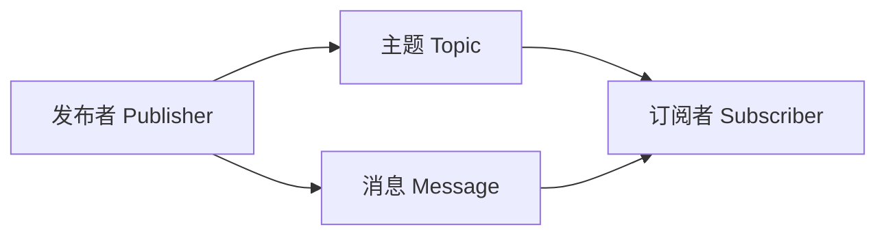
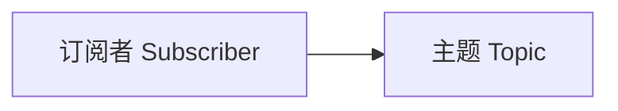
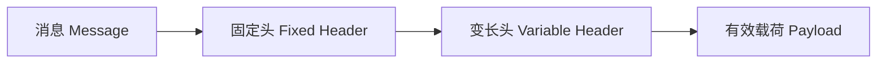
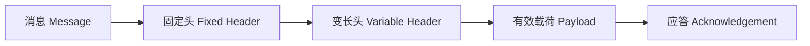

                 

## MQTT协议：轻量级物联网消息传输标准

### 1. 背景介绍

#### 1.1 问题由来
物联网(IoT)是一个广泛的概念，涵盖了许多不同的技术和应用场景，如智能家居、工业自动化、车联网等。随着物联网设备数量的快速增长，设备间的数据通信变得日益频繁且复杂。如何高效、可靠地进行设备间的数据传输，成为物联网应用的核心挑战。

传统的数据通信协议，如TCP/IP，虽然功能强大，但在带宽资源有限、实时性要求高的物联网场景中，显得过于复杂和冗余。因此，轻量级、高效、实时的消息传输协议MQTT（Message Queuing Telemetry Transport）应运而生。MQTT协议的简单、可靠和高效特性，使其成为物联网数据传输的首选标准之一。

#### 1.2 问题核心关键点
MQTT协议的核心在于其简单、可靠、高效的特点，能够适应物联网设备多样性、带宽有限、实时性要求高等特点。MQTT协议采用发布/订阅（Publish/Subscribe）模型，实现设备间轻量级、低延迟的数据传输，广泛应用于智能家居、工业物联网、车联网等领域。

**核心概念**：
- **发布者（Publisher）**：负责发送数据的消息源，可以是单个设备或由多个设备组成的应用程序。
- **订阅者（Subscriber）**：负责接收消息的目标实体，通常是一个设备或一个应用。
- **主题（Topic）**：数据传输的载体，由一个或多个主题组成，每个主题对应一个数据类型。
- **消息（Message）**：传输的数据内容，可以是任何类型的数据，如文本、二进制数据等。

**核心优势**：
- **轻量级**：MQTT协议消息格式简单，占用带宽小。
- **低延迟**：采用无连接的数据传输方式，支持持久化的消息存储。
- **可靠性**：支持消息的可靠传输，并提供QoS（Quality of Service）机制保证消息的发送和接收质量。
- **易于扩展**：支持多协议、多语言、多平台，易于集成到各种物联网设备中。

### 2. 核心概念与联系

#### 2.1 核心概念概述

MQTT协议的核心概念包括发布者、订阅者、主题和消息。以下通过一个简化的示意图，展示MQTT协议的基本架构和消息传输流程：



#### 2.2 Mermaid流程图

**发布者到订阅者的消息传输流程**：


**订阅者与主题的关联**：



**消息的格式**：



**QoS机制**：



### 3. 核心算法原理 & 具体操作步骤
#### 3.1 算法原理概述
MQTT协议采用发布/订阅模式，其核心算法原理包括以下几个步骤：

1. 发布者（Publisher）将消息发布到主题（Topic）。
2. 订阅者（Subscriber）订阅某个主题（Topic），等待消息的到来。
3. MQTT服务器接收并存储发布者的消息，并转发给订阅者。
4. 订阅者接收消息并处理。

#### 3.2 算法步骤详解

##### 3.2.1 发布消息

**步骤1**：发布者（Publisher）创建MQTT客户端，连接到MQTT服务器，并使用`Publish`命令发送消息到指定主题（Topic）。

**步骤2**：消息格式由固定头（Fixed Header）、变长头（Variable Header）和有效载荷（Payload）组成。

**步骤3**：MQTT服务器接收发布者的消息，并进行处理。

##### 3.2.2 订阅消息

**步骤1**：订阅者（Subscriber）创建MQTT客户端，连接到MQTT服务器，并使用`Subscribe`命令订阅指定主题（Topic）。

**步骤2**：MQTT服务器将发布者的消息转发给订阅者。

**步骤3**：订阅者接收到消息并处理。

#### 3.3 算法优缺点

**优点**：
- **轻量级**：消息格式简单，占用的带宽小。
- **低延迟**：无连接的数据传输方式，支持持久化的消息存储。
- **可靠性**：提供QoS机制保证消息的发送和接收质量。
- **易于扩展**：支持多协议、多语言、多平台。

**缺点**：
- **网络开销较大**：由于MQTT协议中包含了固定头和变长头，因此在网络上传输的消息量较大。
- **处理复杂性**：MQTT协议的实现需要考虑网络拓扑、消息存储、数据传输质量等复杂因素。

#### 3.4 算法应用领域

**应用场景**：
- **智能家居**：智能家电设备的控制与状态监测。
- **工业物联网**：工业设备的远程监控与控制。
- **车联网**：车辆与基础设施间的通信。
- **农业物联网**：农业设备的监控与控制。
- **健康医疗**：远程医疗设备的监测与管理。

### 4. 数学模型和公式 & 详细讲解 & 举例说明

#### 4.1 数学模型构建

MQTT协议的数学模型可以简化为一个简单的状态机，用于描述发布者、订阅者和MQTT服务器之间的交互。

**发布者状态机**：

```
Begin --> Publish (发送消息)
       |
       v
       Finish
```

**订阅者状态机**：

```
Begin --> Subscribe (订阅主题)
       |
       v
       Finish
```

**MQTT服务器状态机**：

```
Begin --> Receive (接收消息)
       |          --> Send (转发消息)
       v          |
      Finish     |
```

#### 4.2 公式推导过程

**消息格式**：

```
Fixed Header = Flag + Payload Format Indicator (PFI) + QoS Level
Variable Header = Header Variable
Payload = Payload Data
```

**QoS机制**：

```
QoS Level = 0 (Best Effort) | 1 (At Least Once) | 2 (Exactly Once)
```

**应答机制**：

```
Acknowledgement = Send Ack to Publisher
```

#### 4.3 案例分析与讲解

**案例分析**：
假设一个智能家居系统，通过MQTT协议实现灯光的远程控制。发布者（智能手机APP）可以向MQTT服务器发布命令，订阅者（灯光控制器）接收命令并执行相应的操作。MQTT服务器作为消息转发中心，确保命令的可靠传输。

**讲解**：
- **发布者**：智能手机APP连接到MQTT服务器，发送`Publish`命令到指定主题`lights/control`。
- **MQTT服务器**：接收并存储发布者的命令，并转发给订阅者。
- **订阅者**：灯光控制器接收MQTT服务器的消息，并执行相应的灯光控制操作。

### 5. 项目实践：代码实例和详细解释说明

#### 5.1 开发环境搭建

1. **安装MQTT库**：
   ```python
   pip install paho-mqtt
   ```

2. **搭建MQTT服务器**：
   ```python
   from paho.mqtt import broker
   mqttc = broker.Client()
   mqttc.connect("broker.hivemq.com", 1883, 60)
   ```

3. **搭建MQTT客户端**：
   ```python
   from paho.mqtt import client
   client = client.Client()
   client.connect("broker.hivemq.com", 1883, 60)
   ```

#### 5.2 源代码详细实现

**发布者代码**：

```python
from paho.mqtt import client

def on_publish(client, userdata, mid, rc):
    print("Message published [%d] on topic [%s]" % (mid, userdata.topic))

client = client.Client()
client.on_publish = on_publish
client.connect("broker.hivemq.com", 1883, 60)
client.publish("lights/control", "Turn On")
```

**订阅者代码**：

```python
from paho.mqtt import client

def on_message(client, userdata, msg):
    print("Received message: [%s] on topic [%s]" % (msg.payload, msg.topic))

client = client.Client()
client.on_message = on_message
client.connect("broker.hivemq.com", 1883, 60)
client.subscribe("lights/control")
```

**代码解读与分析**：
- **发布者代码**：创建一个MQTT客户端，连接到MQTT服务器，并使用`publish`方法发送消息到指定主题`lights/control`。
- **订阅者代码**：创建一个MQTT客户端，连接到MQTT服务器，并使用`subscribe`方法订阅指定主题`lights/control`。

**运行结果展示**：
- **发布者**：
  ```
  Message published [1] on topic [lights/control]
  ```
- **订阅者**：
  ```
  Received message: [b'Turn On'] on topic [lights/control]
  ```

### 6. 实际应用场景

#### 6.1 智能家居系统

MQTT协议在智能家居系统中得到了广泛应用。智能家居设备如智能灯泡、智能插座、智能门锁等，可以通过MQTT协议实现远程控制和状态监测。例如，用户可以通过智能手机APP控制家中的灯光，获取家中电器的运行状态。

#### 6.2 工业物联网

MQTT协议在工业物联网中也有着重要的应用。例如，工业设备可以通过MQTT协议实现远程监控和控制。工业设备的状态、性能数据可以通过MQTT协议实时传输到中央管理系统，从而实现设备的远程管理和优化。

#### 6.3 车联网

MQTT协议在车联网中也得到了广泛应用。例如，车辆可以通过MQTT协议与基础设施进行通信，实现车辆的远程监控、调度和管理。同时，车辆还可以接收交通信号灯、交通路况等信息，优化行车路线和速度。

#### 6.4 未来应用展望

随着物联网设备的普及和技术的不断进步，MQTT协议的应用场景将更加广泛。未来，MQTT协议有望在智能城市、智慧农业、智能制造等领域得到广泛应用。

### 7. 工具和资源推荐

#### 7.1 学习资源推荐

1. **MQTT官方文档**：
   - [MQTT官网](https://www.hivemq.com/)
   - [MQTT协议文档](https://docs.hivemq.com/mqtt/latest/)

2. **MQTT教程和示例**：
   - [MQTT教程](https://www.machoto.com/mqtt/)
   - [MQTT示例代码](https://github.com/hivemq/mqtt-plaintext-reader)

3. **MQTT书籍**：
   - 《MQTT实战》 by Artem Lukyanov
   - 《MQTT网络编程》 by Jianhui Zhang

#### 7.2 开发工具推荐

1. **MQTT客户端库**：
   - `paho-mqtt`：Python MQTT客户端库。

2. **MQTT服务器**：
   - `hivemq`：开源的MQTT服务器。

3. **MQTT可视化工具**：
   - `mqttviz`：MQTT消息可视化工具，便于调试和监控MQTT网络。

#### 7.3 相关论文推荐

1. **MQTT协议研究论文**：
   - "Message Queuing Telemetry Transport (MQTT) for IoT" by Jan Erik Svensson and Daniel K stirback

2. **MQTT协议应用论文**：
   - "MQTT in Smart City" by V. Kasetrajanahalli et al.
   - "MQTT in Industrial IoT" by R. Singhal and R. Adair

### 8. 总结：未来发展趋势与挑战

#### 8.1 研究成果总结

MQTT协议作为一种轻量级、高效、可靠的消息传输协议，已经广泛应用于物联网领域。MQTT协议的简单、灵活和高效特性，使其成为物联网设备间数据通信的理想选择。

#### 8.2 未来发展趋势

1. **协议升级**：未来MQTT协议将不断优化和升级，支持更多的功能和特性，如WebSockets、SSL/TLS加密、设备认证等。
2. **新标准的出现**：随着物联网技术的发展，新的MQTT标准和扩展将不断出现，满足不同应用场景的需求。
3. **与其他协议的整合**：MQTT协议将与其他协议（如HTTP、CoAP、AMQP等）整合，形成更加完善的物联网数据通信生态系统。

#### 8.3 面临的挑战

1. **安全问题**：MQTT协议的简单性和无连接特性，使其易受到中间人攻击、数据窃听等安全威胁。
2. **网络延迟**：MQTT协议的网络传输延迟可能对实时性要求高的应用产生影响。
3. **资源消耗**：MQTT协议的实现需要考虑网络拓扑、消息存储、数据传输质量等复杂因素，可能导致资源消耗较大。

#### 8.4 研究展望

未来的研究将集中在以下几个方面：
1. **安全性和隐私保护**：开发更加安全和隐私保护的特性能，增强MQTT协议的可靠性。
2. **高效资源利用**：优化MQTT协议的实现，提高其资源利用效率，支持大规模物联网设备的通信。
3. **跨协议融合**：探索MQTT协议与其他协议的融合，构建更加完善的物联网数据通信生态系统。

### 9. 附录：常见问题与解答

**Q1：MQTT协议为什么适用于物联网？**

A：MQTT协议的轻量级、低延迟、可靠性和易于扩展的特性，使其成为物联网设备间数据通信的理想选择。

**Q2：MQTT协议的QoS机制有哪些？**

A：MQTT协议的QoS机制分为0（Best Effort）、1（At Least Once）、2（Exactly Once）三种，用于保证消息的发送和接收质量。

**Q3：MQTT协议的优点和缺点是什么？**

A：MQTT协议的优点包括轻量级、低延迟、可靠性和易于扩展；缺点包括网络开销较大和处理复杂性。

**Q4：MQTT协议的未来发展方向是什么？**

A：未来MQTT协议将不断优化和升级，支持更多的功能和特性，如WebSockets、SSL/TLS加密、设备认证等。

**Q5：MQTT协议在实际应用中需要注意什么？**

A：MQTT协议在实际应用中需要注意安全问题、网络延迟和资源消耗等问题。

---

作者：禅与计算机程序设计艺术 / Zen and the Art of Computer Programming

