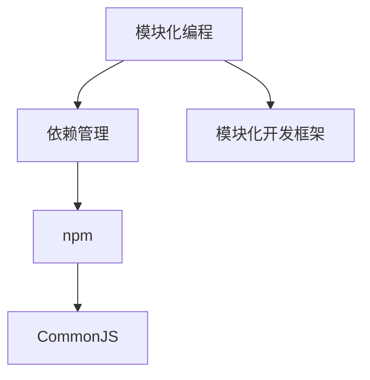

                 

# Node.js 模块化编程实践：管理大型项目和依赖

## 1. 背景介绍

### 1.1 问题由来
随着Web应用的日益复杂，开发大型Node.js应用变得越来越常见。这些应用通常包含了大量的模块、库和第三方依赖，需要有效管理和组织才能确保高效开发和维护。传统的Node.js模块化编程方法虽然简单直接，但在大型项目中往往显得力不从心。因此，探索一种更高效、更可维护的模块化编程方法，成为了开发者的迫切需求。

## 2. 核心概念与联系

### 2.1 核心概念概述

为更好地理解Node.js模块化编程的实践方法，本节将介绍几个密切相关的核心概念：

- 模块化编程（Modular Programming）：将程序划分为多个独立、可复用的小模块，各个模块之间通过明确的接口进行交互。模块化编程有助于提高代码的可读性、可维护性和可扩展性。

- 依赖管理（Dependency Management）：在Node.js中，依赖管理指的是对第三方库和工具的导入和使用进行有效管理和控制，以避免版本冲突、依赖不兼容等问题。

- npm（Node Package Manager）：npm是Node.js官方提供的包管理工具，用于安装、管理和发布Node.js的第三方包。npm已成为Node.js开发者不可或缺的开发工具之一。

- CommonJS：CommonJS是Node.js中使用的模块化标准，通过export和require关键字实现模块的导入和导出。CommonJS规范定义了模块之间的接口，是Node.js模块化编程的基础。

- 模块化开发框架（Module-based Development Frameworks）：如React、Vue等框架，都采用了模块化开发的方式，通过组件化将复杂的UI界面划分为多个独立模块，提升开发效率和用户体验。

这些核心概念之间的逻辑关系可以通过以下Mermaid流程图来展示：



这个流程图展示了大语言模型的核心概念及其之间的关系：

1. 模块化编程是大语言模型的基础，通过将代码划分为多个模块，提升代码的复用性和可维护性。
2. npm是管理第三方依赖的工具，确保依赖的版本和兼容性。
3. CommonJS定义了模块之间的接口，是Node.js模块化编程的基础。
4. 模块化开发框架进一步将模块化编程应用于UI界面等复杂场景，提升开发效率。

## 3. 核心算法原理 & 具体操作步骤
### 3.1 算法原理概述

Node.js的模块化编程实践，本质上是一种组件化、接口化的设计模式，旨在通过合理的模块划分和接口定义，提升代码的可读性、可维护性和可扩展性。

在实践中，开发者通过将项目划分为多个模块，每个模块独立开发、测试和维护。每个模块通过明确的接口与其他模块进行交互，遵循“高内聚、低耦合”的原则。

形式化地，假设项目中共有 $N$ 个模块，每个模块 $M_i$ 的接口定义为 $\mathcal{I}_i$。则模块之间的交互关系可以表示为：

$$
\bigcap_{i=1}^N \mathcal{I}_i \subseteq \mathcal{I}_{所有模块}
$$

即，所有模块的接口交集应该包含在所有模块的接口范围内，确保模块之间的有效通信。

### 3.2 算法步骤详解

Node.js的模块化编程实践一般包括以下几个关键步骤：

**Step 1: 模块划分**
- 根据项目需求，将项目划分为多个独立模块。每个模块负责特定的功能，尽量细粒度、高内聚。
- 每个模块应包含完整的接口定义，包括输入参数、输出结果和可能的异常处理。

**Step 2: 接口定义**
- 定义模块之间的接口，确保模块之间通过接口进行通信，避免直接调用内部方法。
- 使用CommonJS规范的export和require关键字进行模块的导出和导入，清晰定义模块的边界和功能。

**Step 3: 依赖管理**
- 使用npm安装和管理项目依赖，避免依赖冲突和版本不一致。
- 定义项目的依赖清单，并在package.json文件中指定依赖关系，确保所有模块的依赖都是兼容的。

**Step 4: 模块集成**
- 将模块按照一定的顺序进行集成，形成完整的项目结构。通常采用分层结构或事件驱动结构。
- 定义项目入口模块，作为项目的整体控制点，负责加载和管理所有模块。

**Step 5: 测试和部署**
- 对每个模块进行单元测试，确保模块的功能正确性。
- 对整个项目进行集成测试，验证模块之间的交互是否正常。
- 将测试通过的项目打包部署，确保在不同环境中稳定运行。

以上是Node.js模块化编程实践的一般流程。在实际应用中，还需要针对具体项目的特点，对模块划分、接口定义、依赖管理等环节进行优化设计，以进一步提升项目性能和开发效率。

### 3.3 算法优缺点

Node.js的模块化编程实践具有以下优点：
1. 提升代码可维护性。通过模块化编程，代码更加模块化和可复用，便于维护和迭代。
2. 降低耦合度。模块之间通过接口进行通信，减少了模块之间的耦合，提高了系统的灵活性和可扩展性。
3. 便于测试和重用。模块化的设计使得测试和重用变得更加容易，可以独立测试和重用模块，减少开发时间和成本。
4. 支持分布式开发。模块化的设计可以更好地支持分布式开发，不同模块可以在不同环境下独立开发和测试。

同时，该方法也存在一定的局限性：
1. 增加开发复杂度。模块化的设计增加了开发者的认知负担，需要明确模块之间的接口和依赖关系。
2. 性能开销。模块之间的接口调用增加了一定的性能开销，特别是频繁的函数调用和内存分配。
3. 依赖管理复杂。随着项目规模的增大，依赖关系也会变得越来越复杂，需要花费大量时间进行管理和维护。

尽管存在这些局限性，但就目前而言，Node.js模块化编程仍是现代Web应用开发的重要范式。未来相关研究的重点在于如何进一步降低模块化编程的开发复杂度，提高性能，同时兼顾模块化带来的维护性和灵活性。

### 3.4 算法应用领域

Node.js的模块化编程实践，在Web应用开发中已经得到了广泛的应用，涵盖了几乎所有常见场景，例如：

- Web框架开发：如Express、Koa等框架，都是基于模块化编程的典型应用。
- 微服务架构：通过模块化的设计，可以实现独立部署和管理的微服务系统。
- 前端开发：如React、Vue等框架，通过组件化的方式实现了模块化的UI开发。
- 中间件开发：如Socket.IO、Winston等中间件，都是基于模块化编程构建的。

除了上述这些经典应用外，Node.js的模块化编程还被创新性地应用到更多场景中，如服务化API设计、分布式缓存、数据持久化等，为Web应用的开发和运维提供了新的工具和方法。

## 4. 数学模型和公式 & 详细讲解 & 举例说明
### 4.1 数学模型构建

本节将使用数学语言对Node.js模块化编程实践进行更加严格的刻画。

假设项目中共有 $N$ 个模块 $M_1, M_2, \ldots, M_N$，每个模块的接口定义如下：

- 输入：$\mathcal{I}_i = (x_i, y_i)$，其中 $x_i$ 为输入参数，$y_i$ 为输出参数。
- 输出：$\mathcal{O}_i = f_i(x_i)$，其中 $f_i$ 为模块 $M_i$ 的实现函数。

模块之间的接口交集为 $\mathcal{I}_{所有模块} = \bigcap_{i=1}^N \mathcal{I}_i$。模块的集成关系可以表示为：

$$
M_1(x_1) \rightarrow M_2(x_2) \rightarrow \ldots \rightarrow M_{N-1}(x_{N-1}) \rightarrow M_N(x_N) \rightarrow f_N(y_N)
$$

其中，每个模块 $M_i$ 的输出 $x_{i+1}$ 成为下一个模块 $M_{i+1}$ 的输入 $x_{i+1}$。

### 4.2 公式推导过程

以下我们以一个简单的Web框架开发为例，推导模块化编程的数学模型。

假设需要开发一个简单的Web框架，包括路由模块、控制器模块、模板模块和数据库模块。路由模块负责处理请求，控制器模块负责业务逻辑，模板模块负责渲染页面，数据库模块负责数据存储。假设路由模块的接口为：

$$
\mathcal{I}_{路由} = (req, res, next)
$$

其中 $req$ 为请求对象，$res$ 为响应对象，$next$ 为下一个中间件。

路由模块的输出 $req, res, next$ 分别作为控制器模块、模板模块和数据库模块的输入。假设控制器模块的接口为：

$$
\mathcal{I}_{控制器} = (req, res, db)
$$

其中 $db$ 为数据库连接对象。

控制器模块的输出 $req, res, db$ 分别作为模板模块、数据库模块的输入。假设模板模块的接口为：

$$
\mathcal{I}_{模板} = (req, res, db)
$$

其中 $req, res, db$ 分别表示请求、响应和数据库连接。

模板模块的输出 $req, res, db$ 作为数据库模块的输入。假设数据库模块的接口为：

$$
\mathcal{I}_{数据库} = (req, res, sql)
$$

其中 $sql$ 为SQL语句。

数据库模块的输出 $req, res, sql$ 作为路由模块的输入。整个框架的集成关系可以表示为：

$$
req \rightarrow 路由模块 \rightarrow 控制器模块 \rightarrow 模板模块 \rightarrow 数据库模块 \rightarrow res
$$

其中，每个模块的输入和输出通过接口定义进行通信。这种模块化的设计使得每个模块的开发和测试变得更加独立和可控。

### 4.3 案例分析与讲解

假设项目中需要开发一个简单的电子商务平台，包括用户管理、商品管理、订单管理等功能模块。我们可以将这些功能模块划分为多个独立的模块，每个模块负责特定的功能。

- 用户管理模块：负责用户注册、登录、修改等功能，导出接口为：
  $$
  \mathcal{I}_{用户管理} = (req, res)
  $$

- 商品管理模块：负责商品添加、修改、查询等功能，导出接口为：
  $$
  \mathcal{I}_{商品管理} = (req, res)
  $$

- 订单管理模块：负责订单生成、修改、查询等功能，导出接口为：
  $$
  \mathcal{I}_{订单管理} = (req, res)
  $$

通过模块化编程，各个模块独立开发和测试，代码结构更加清晰，便于维护和迭代。模块之间的通信通过接口进行，减少了模块之间的耦合，提高了系统的灵活性和可扩展性。

## 5. 项目实践：代码实例和详细解释说明
### 5.1 开发环境搭建

在进行模块化编程实践前，我们需要准备好开发环境。以下是使用Node.js和npm进行项目开发的配置流程：

1. 安装Node.js和npm：从官网下载安装Node.js和npm，确保是最新的稳定版本。

2. 创建项目目录：在本地创建一个新的项目目录，并初始化npm项目。
```bash
mkdir myproject
cd myproject
npm init
```

3. 安装依赖包：在package.json文件中添加依赖，并安装依赖包。
```bash
npm install express mongoose ejs
```

4. 安装开发工具：安装常用的开发工具，如Visual Studio Code、Git等。

完成上述步骤后，即可在项目目录中开始模块化编程实践。

### 5.2 源代码详细实现

下面我们以一个简单的电子商务平台为例，给出使用Node.js和Express框架进行模块化编程的详细代码实现。

首先，定义用户管理模块：

```javascript
// user.js
const express = require('express');
const router = express.Router();
const bcrypt = require('bcrypt');
const User = require('../models/user');

router.post('/register', async (req, res) => {
  const { username, password } = req.body;
  const salt = await bcrypt.genSalt(10);
  const hashedPassword = await bcrypt.hash(password, salt);
  const user = new User({ username, password: hashedPassword });
  await user.save();
  res.send('User registered successfully');
});

router.post('/login', async (req, res) => {
  const { username, password } = req.body;
  const user = await User.findOne({ username });
  if (!user) return res.status(404).send('User not found');
  const isMatch = await bcrypt.compare(password, user.password);
  if (!isMatch) return res.status(401).send('Invalid password');
  res.send('User logged in successfully');
});

module.exports = router;
```

然后，定义商品管理模块：

```javascript
// product.js
const express = require('express');
const router = express.Router();
const Product = require('../models/product');

router.post('/add', async (req, res) => {
  const { name, price } = req.body;
  const product = new Product({ name, price });
  await product.save();
  res.send('Product added successfully');
});

router.get('/', async (req, res) => {
  const products = await Product.find();
  res.json(products);
});

module.exports = router;
```

接着，定义订单管理模块：

```javascript
// order.js
const express = require('express');
const router = express.Router();
const Order = require('../models/order');

router.post('/create', async (req, res) => {
  const { userId, productId, quantity } = req.body;
  const order = new Order({ userId, productId, quantity });
  await order.save();
  res.send('Order created successfully');
});

router.get('/', async (req, res) => {
  const orders = await Order.find();
  res.json(orders);
});

module.exports = router;
```

最后，定义项目入口模块：

```javascript
// app.js
const express = require('express');
const bodyParser = require('body-parser');
const userRouter = require('./user');
const productRouter = require('./product');
const orderRouter = require('./order');

const app = express();

app.use(bodyParser.urlencoded({ extended: true }));
app.use(bodyParser.json());

app.use('/user', userRouter);
app.use('/product', productRouter);
app.use('/order', orderRouter);

app.listen(3000, () => {
  console.log('Server started on port 3000');
});
```

这样，一个简单的电子商务平台就通过模块化编程构建完成了。每个模块独立开发和测试，通过接口进行通信，代码结构清晰，易于维护和扩展。

### 5.3 代码解读与分析

让我们再详细解读一下关键代码的实现细节：

**user.js模块**：
- 使用Express框架定义路由，处理用户注册和登录请求。
- 使用bcrypt库进行密码加密，确保用户密码的安全性。
- 定义User模型，使用mongoose框架进行数据存储。
- 通过异步操作保证请求的异步处理，提升系统性能。

**product.js模块**：
- 使用Express框架定义路由，处理商品添加和查询请求。
- 定义Product模型，使用mongoose框架进行数据存储。
- 通过异步操作保证请求的异步处理，提升系统性能。

**order.js模块**：
- 使用Express框架定义路由，处理订单生成和查询请求。
- 定义Order模型，使用mongoose框架进行数据存储。
- 通过异步操作保证请求的异步处理，提升系统性能。

**app.js模块**：
- 创建Express应用实例，使用body-parser中间件处理请求体。
- 将用户管理、商品管理和订单管理模块挂载到不同的路由路径。
- 启动应用，监听端口3000。

通过这些模块的协同工作，实现了电子商务平台的各个功能。每个模块独立开发和测试，通过接口进行通信，代码结构清晰，易于维护和扩展。

## 6. 实际应用场景
### 6.1 项目管理和协作
Node.js的模块化编程实践，可以极大地提升项目管理和协作的效率。通过将项目划分为多个模块，每个模块独立开发和测试，不同团队成员可以同时处理不同模块的开发任务，加快项目的迭代速度。

**示例**：
一个大型电子商务平台，可以划分为多个模块，如用户管理、商品管理、订单管理、支付处理等。每个模块独立开发和测试，不同团队成员可以同时处理不同模块的开发任务，加快项目的迭代速度。通过模块化编程，项目的管理和协作变得更加高效和可控。

### 6.2 快速原型开发
Node.js的模块化编程实践，可以快速构建原型，进行快速迭代和验证。通过模块化的设计，开发者可以独立开发和测试每个模块，快速验证模块的功能和性能，并进行优化和改进。

**示例**：
一个新产品原型开发，可以划分为多个模块，如UI设计、功能开发、数据处理等。每个模块独立开发和测试，快速验证模块的功能和性能，并进行优化和改进。通过模块化编程，快速原型开发变得更加高效和可靠。

### 6.3 微服务架构
Node.js的模块化编程实践，可以更好地支持微服务架构。通过模块化的设计，每个服务独立开发和部署，服务之间的通信通过接口进行，使得微服务架构变得更加灵活和可扩展。

**示例**：
一个大型金融系统，可以划分为多个微服务，如用户管理、账户管理、交易管理等。每个服务独立开发和部署，服务之间的通信通过接口进行，使得微服务架构变得更加灵活和可扩展。通过模块化编程，微服务架构变得更加高效和可控。

### 6.4 未来应用展望
随着Node.js的不断发展和社区的壮大，模块化编程实践将得到更广泛的应用和支持。未来，模块化编程可能会进一步与最新的技术趋势相结合，如函数式编程、异步编程等，提升代码的可读性、可维护性和可扩展性。

## 7. 工具和资源推荐
### 7.1 学习资源推荐

为了帮助开发者系统掌握Node.js模块化编程的理论与实践，这里推荐一些优质的学习资源：

1. 《Node.js 设计模式》系列博文：由大语言模型技术专家撰写，深入浅出地介绍了Node.js中的设计模式，包括单例模式、工厂模式、装饰者模式等，适合入门和进阶学习。

2. CS50的《Web开发》课程：哈佛大学开设的Web开发课程，涵盖Node.js、Express、数据库、API设计等基础技术，适合初学者快速入门。

3. 《JavaScript高级程序设计》书籍：阮一峰著，全面介绍了JavaScript语言的高级特性，适合深入理解Node.js的核心原理和实践技巧。

4. Udemy的《Node.js 和 Express 实战》课程：Udemy平台上最受欢迎的Node.js课程，从基础到实战，系统全面地介绍了Node.js和Express框架的使用方法。

5. 《Node.js 设计模式》书籍：黄海广著，详细介绍了Node.js中的设计模式，适合深入理解Node.js的核心原理和实践技巧。

通过对这些资源的学习实践，相信你一定能够快速掌握Node.js模块化编程的精髓，并用于解决实际的NLP问题。

### 7.2 开发工具推荐

高效的开发离不开优秀的工具支持。以下是几款用于Node.js开发常用的工具：

1. Visual Studio Code：微软推出的开源代码编辑器，支持多语言开发，具备丰富的插件生态和社区支持。

2. Git：版本控制系统，用于管理代码的变更和协作。

3. npm：Node.js官方提供的包管理工具，用于安装、管理和发布Node.js的第三方包。

4. Express：流行的Node.js Web框架，提供丰富的中间件和路由功能。

5. Mongoose：流行的Node.js ODM框架，支持MongoDB数据库的操作。

6. Postman：API测试工具，用于测试和调试API接口。

合理利用这些工具，可以显著提升Node.js开发和测试的效率，加快创新迭代的步伐。

### 7.3 相关论文推荐

Node.js模块化编程的发展源于学界的持续研究。以下是几篇奠基性的相关论文，推荐阅读：

1. Modular JavaScript: A New Perspective: 提出模块化编程的思想，并应用到JavaScript语言中，奠定了Node.js模块化编程的理论基础。

2. ECMAScript 6 Modularization: 介绍ES6模块化编程的标准和语法，为Node.js模块化编程提供了语言支持。

3. Asynchronous JavaScript: 详细介绍Node.js异步编程的原理和使用方法，是理解Node.js模块化编程的关键。

4. npm: 介绍npm包管理工具的设计理念和使用方法，是理解Node.js模块化编程的重要组成部分。

5. CommonJS: 详细介绍CommonJS模块化编程的标准和使用方法，是Node.js模块化编程的基础。

这些论文代表了大语言模型模块化编程的发展脉络。通过学习这些前沿成果，可以帮助研究者把握学科前进方向，激发更多的创新灵感。

## 8. 总结：未来发展趋势与挑战
### 8.1 研究成果总结

本文对Node.js模块化编程实践进行了全面系统的介绍。首先阐述了Node.js模块化编程的背景和意义，明确了模块化编程在提升开发效率、降低耦合度方面的独特价值。其次，从原理到实践，详细讲解了模块化编程的数学原理和关键步骤，给出了模块化编程任务开发的完整代码实例。同时，本文还广泛探讨了模块化编程在项目管理和协作、快速原型开发、微服务架构等多个领域的应用前景，展示了模块化编程范式的巨大潜力。

通过本文的系统梳理，可以看到，Node.js模块化编程是现代Web应用开发的重要范式，极大地提升了Web应用的开发和维护效率，为开发者的高效协作提供了有力支撑。模块化编程的思想和实践，将随着Node.js的不断发展和完善，得到更广泛的应用和支持。

### 8.2 未来发展趋势

展望未来，Node.js模块化编程的发展趋势将呈现以下几个方向：

1. 功能增强：未来的模块化编程将涵盖更多Web开发的基础技术和最新趋势，如函数式编程、异步编程、微服务架构等。

2. 社区壮大：Node.js的社区将不断壮大，更多优秀的开源工具和框架将被引入和支持，使得模块化编程变得更加强大和易用。

3. 生态扩展：Node.js的生态系统将不断扩展，更多的开发者和项目将参与其中，带来更多创新的应用和实践。

4. 标准化提升：Node.js的核心标准和规范将不断提升，更多的模块化编程实践将得到官方的支持和推广。

5. 实践普及：模块化编程的思想和实践将得到更广泛的普及，更多的开发者将采用模块化编程来提升开发效率和代码质量。

这些发展趋势将进一步推动Node.js模块化编程的普及和应用，为Web应用的开发和运维提供新的工具和方法。

### 8.3 面临的挑战

尽管Node.js模块化编程已经取得了一定的成果，但在迈向更加智能化、普适化应用的过程中，仍面临诸多挑战：

1. 复杂度增加：模块化编程增加了开发者的认知负担，需要明确模块之间的接口和依赖关系，增加了开发难度。

2. 性能问题：模块之间的接口调用增加了一定的性能开销，特别是频繁的函数调用和内存分配，需要进一步优化。

3. 依赖管理复杂：随着项目规模的增大，依赖关系也会变得越来越复杂，需要花费大量时间进行管理和维护。

4. 生态系统不成熟：Node.js的生态系统仍在不断发展和完善，一些新功能和工具可能不够成熟和稳定，需要进一步探索和验证。

尽管存在这些挑战，但通过持续优化和完善，Node.js模块化编程仍将持续发展和壮大，为Web应用的开发和运维提供新的思路和方法。

### 8.4 研究展望

面对Node.js模块化编程所面临的挑战，未来的研究需要在以下几个方面寻求新的突破：

1. 简化模块化编程的开发复杂度，降低开发者的认知负担，提升开发效率。

2. 优化模块之间的接口调用，提升性能，减少内存分配和函数调用的开销。

3. 探索更灵活的依赖管理方案，减少依赖冲突和版本不一致的风险。

4. 引入更多Web开发的基础技术和最新趋势，如函数式编程、异步编程、微服务架构等，提升代码的可读性、可维护性和可扩展性。

5. 加强Node.js社区的建设和发展，引入更多优秀的开源工具和框架，提升Node.js的生态系统。

这些研究方向的探索，必将引领Node.js模块化编程迈向更高的台阶，为Web应用的开发和运维提供新的思路和方法。面向未来，Node.js模块化编程还需要与其他Web技术进行更深入的融合，如React、Vue等框架，共同推动Web应用的进步和发展。

## 9. 附录：常见问题与解答
**Q1: Node.js模块化编程是否适用于所有Web应用场景？**

A: Node.js模块化编程适用于大多数Web应用场景，特别是对于复杂、大型、高耦合的项目。但对于一些小型、低耦合的项目，模块化编程可能显得过于复杂，反而会降低开发效率。需要根据项目特点选择适合的分层和模块化策略。

**Q2: 模块化编程会增加开发复杂度，如何降低？**

A: 模块化编程确实增加了开发复杂度，但可以通过以下几个方法来降低：
1. 模块划分合理：根据项目需求和复杂度，合理划分模块，避免模块过细或过粗。
2. 接口定义清晰：明确模块之间的接口，减少直接调用内部方法，提升代码的可读性和可维护性。
3. 自动生成文档：使用工具如JSDoc自动生成文档，提升代码的可读性和可维护性。
4. 统一规范：使用统一的编程规范和设计模式，提升代码的一致性和可读性。

**Q3: npm在依赖管理中扮演了什么角色？**

A: npm是Node.js官方提供的包管理工具，用于安装、管理和发布Node.js的第三方包。在依赖管理中，npm扮演了重要的角色：
1. 安装依赖：通过npm install命令安装项目所需的所有依赖包，保证项目运行正常。
2. 管理版本：通过package.json文件管理项目的依赖版本，避免依赖冲突和版本不一致。
3. 发布包：通过npm publish命令发布项目依赖包，使得其他项目可以轻松使用。

**Q4: 如何优化模块之间的接口调用？**

A: 优化模块之间的接口调用，可以提升系统性能，减少内存分配和函数调用的开销。具体方法包括：
1. 使用异步调用：通过异步调用减少函数调用的开销。
2. 缓存数据：通过缓存重复计算的数据，减少重复计算的开销。
3. 批量处理：通过批量处理减少函数调用的次数，提升系统性能。
4. 使用中间件：使用中间件实现一些通用的逻辑，减少函数调用的开销。

**Q5: 如何处理模块化编程中的性能问题？**

A: 处理模块化编程中的性能问题，可以采用以下几个方法：
1. 优化异步操作：通过优化异步操作，减少函数调用的开销。
2. 使用缓存：通过缓存重复计算的数据，减少重复计算的开销。
3. 减少模块调用：通过减少模块之间的调用，减少函数调用的开销。
4. 使用中间件：使用中间件实现一些通用的逻辑，减少函数调用的开销。

通过这些方法，可以进一步优化模块化编程的性能，提升系统性能和稳定性。

---

作者：禅与计算机程序设计艺术 / Zen and the Art of Computer Programming

