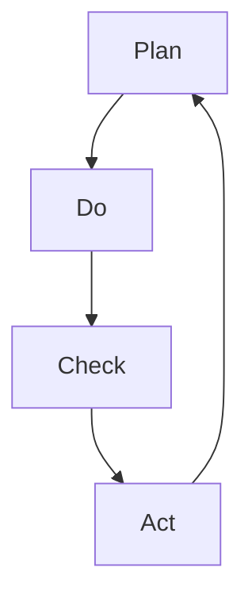

                 

# PDCA:高效管理者的行动方法论

> 关键词：PDCA, 过程管理, 质量控制, 持续改进, 管理框架, 行动计划

## 1. 背景介绍

### 1.1 问题由来
在日益复杂多变的环境中，如何高效地管理项目、提升团队绩效、确保产品质量，成为每一位管理者面临的挑战。传统的管理模式往往缺乏系统性和结构性，难以应对复杂问题的持续演进。而PDCA（Plan-Do-Check-Act）循环法则提供了一种高效、系统化的管理方法论，帮助管理者在项目管理、质量控制、绩效提升等方面实现持续改进。

### 1.2 问题核心关键点
PDCA循环法则是一种基于质量管理理论的经典管理方法，由四个核心步骤构成：计划(Plan)、执行(Do)、检查(Check)、行动(Act)。PDCA方法论不仅适用于项目管理，还可应用于质量控制、问题解决、流程优化等多个领域，是一种通用且高效的管理框架。

## 2. 核心概念与联系

### 2.1 核心概念概述

为更好地理解PDCA方法论，本节将介绍几个密切相关的核心概念：

- PDCA循环：PDCA是Plan-Do-Check-Act的首字母缩写，表示计划、执行、检查和行动四个步骤的循环过程。通过不断的PDCA循环，实现持续改进和质量提升。
- 计划(Plan)：在PDCA循环的第一步，明确目标、制定策略、规划资源，为后续的执行和检查提供指导。
- 执行(Do)：在明确计划的基础上，按照既定方案执行，验证和应用所制定的策略。
- 检查(Check)：在执行过程中，定期检查策略的执行情况、结果和影响，评估目标是否达成，找出问题点。
- 行动(Act)：根据检查结果，采取相应的行动措施，修正策略，完善流程，确保目标实现。

### 2.2 核心概念原理和架构的 Mermaid 流程图(Mermaid 流程节点中不要有括号、逗号等特殊字符)


PDCA循环的四个步骤形成了一个闭环，每个步骤都是前一步的输出，同时又为下一步提供输入，不断迭代优化，实现管理目标的达成。这种循环结构确保了管理的系统性和持续性。

## 3. 核心算法原理 & 具体操作步骤

### 3.1 算法原理概述
PDCA方法论是一种基于计划、执行、检查、行动四个步骤的系统管理方法。其核心思想是通过不断的PDCA循环，逐步实现目标的达成和质量的提升。具体步骤如下：

1. **计划(Plan)**：明确目标、制定策略、规划资源。
2. **执行(Do)**：按照既定方案执行，验证和应用策略。
3. **检查(Check)**：评估执行结果，找出问题和偏差。
4. **行动(Act)**：根据检查结果，采取相应措施，修正策略，完善流程。

### 3.2 算法步骤详解
#### 3.2.1 计划阶段(Plan)
- **明确目标**：定义项目的短期和长期目标，确保目标具体、可量化、可达成。
- **制定策略**：根据目标，制定详细的执行计划，包括时间表、资源分配、风险管理等。
- **规划资源**：确保所需的资源（人力、物力、财力等）得到充分准备。

#### 3.2.2 执行阶段(Do)
- **任务分解**：将项目目标分解为可执行的任务，明确每个任务的负责人和截止日期。
- **任务执行**：按照计划执行各项任务，确保资源和时间安排得当。
- **信息收集**：在执行过程中，收集各项任务进展情况和相关数据。

#### 3.2.3 检查阶段(Check)
- **结果评估**：比较实际执行结果与预期目标，评估项目进展情况和质量。
- **问题识别**：找出执行过程中出现的问题和偏差，分析原因。
- **效果评估**：评估策略的有效性，识别改进点。

#### 3.2.4 行动阶段(Act)
- **措施制定**：根据检查结果，制定改进措施和行动计划。
- **策略调整**：对原计划进行修正和调整，以应对新发现的问题和挑战。
- **持续优化**：持续监控项目进展，确保目标的实现和质量的提升。

### 3.3 算法优缺点
#### 3.3.1 优点
- **系统性和结构性**：PDCA方法论通过四个步骤构成闭环，确保管理的系统性和结构性。
- **持续改进**：通过不断的PDCA循环，逐步实现目标的达成和质量的提升。
- **易于操作**：每个步骤明确具体，操作性强，易于执行。
- **灵活性高**：PDCA方法论适用于各种规模和复杂度的项目，可以根据具体情况灵活调整。

#### 3.3.2 缺点
- **工作量大**：需要详细规划和执行，工作量较大，尤其适用于复杂项目。
- **适应性差**：对突发情况和环境变化适应性较差，需要动态调整策略。
- **依赖人因素**：管理者的能力和经验对PDCA方法论的实施效果有较大影响。

### 3.4 算法应用领域

PDCA方法论不仅适用于项目管理，还可应用于质量控制、问题解决、流程优化等多个领域，以下是几个主要应用场景：

- **项目管理**：在项目启动阶段明确目标和计划，执行阶段确保资源和任务按计划执行，检查阶段评估进展和质量，行动阶段根据检查结果调整策略，确保项目按时交付。
- **质量控制**：在生产过程中，通过PDCA循环，定期检查产品质量，找出问题并采取措施改进，确保产品符合标准。
- **问题解决**：在面对复杂问题时，通过PDCA循环，逐步分析问题、验证假设、实施改进措施，最终解决根本问题。
- **流程优化**：在流程改进过程中，通过PDCA循环，不断评估和优化流程，提升工作效率和质量。
- **员工培训**：在员工培训过程中，通过PDCA循环，逐步明确培训目标、制定计划、执行培训、检查效果、采取措施，确保培训效果达到预期。

## 4. 数学模型和公式 & 详细讲解 & 举例说明

### 4.1 数学模型构建
PDCA方法论的四个步骤可以分别用数学模型来描述。以项目管理为例，每个步骤都可以定义为一个数学模型。

- **计划阶段(Plan)**：目标设定模型，描述如何设定项目目标和计划。
- **执行阶段(Do)**：任务执行模型，描述如何分配任务和资源。
- **检查阶段(Check)**：绩效评估模型，描述如何评估项目进展和质量。
- **行动阶段(Act)**：改进措施模型，描述如何根据检查结果采取措施和改进。

### 4.2 公式推导过程
以项目管理为例，推导PDCA循环的数学模型公式。

设项目管理目标为 $T$，项目计划为 $P$，任务执行结果为 $R$，项目检查结果为 $C$，改进措施为 $A$。则PDCA循环的数学模型可以表示为：

$$
T = f(P, R, C, A)
$$

其中 $f$ 为映射函数，表示通过计划、执行、检查、行动四个步骤，将目标 $T$ 映射为最终执行结果 $R$。

具体来说，假设项目计划 $P$ 为 $\{A_1, A_2, ..., A_n\}$，任务执行结果 $R$ 为 $\{r_1, r_2, ..., r_n\}$，项目检查结果 $C$ 为 $\{c_1, c_2, ..., c_n\}$，改进措施 $A$ 为 $\{a_1, a_2, ..., a_n\}$。则目标设定模型、任务执行模型、绩效评估模型、改进措施模型的公式分别为：

$$
P = g(T)
$$

$$
R = h(P, A)
$$

$$
C = j(R, P)
$$

$$
A = k(C, R)
$$

其中 $g, h, j, k$ 分别为相应的映射函数。

### 4.3 案例分析与讲解
假设某公司需要开发一款新产品，应用PDCA方法论进行项目管理。

1. **计划阶段(Plan)**：公司定义了新产品开发的目标和计划，包括市场调研、需求分析、产品设计等。具体来说，目标设定模型为：

$$
T = f(P)
$$

2. **执行阶段(Do)**：根据计划，分配任务和资源，执行各项任务。具体来说，任务执行模型为：

$$
R = h(P, A)
$$

3. **检查阶段(Check)**：在执行过程中，定期检查项目进展和质量。具体来说，绩效评估模型为：

$$
C = j(R, P)
$$

4. **行动阶段(Act)**：根据检查结果，采取改进措施。具体来说，改进措施模型为：

$$
A = k(C, R)
$$

通过不断的PDCA循环，公司逐步实现产品开发目标，确保产品质量和项目进度。

## 5. 项目实践：代码实例和详细解释说明

### 5.1 开发环境搭建

进行PDCA方法论的实践，需要准备开发环境。以下是使用Python进行开发的流程：

1. 安装Anaconda：从官网下载并安装Anaconda，用于创建独立的Python环境。

2. 创建并激活虚拟环境：
```bash
conda create -n pdca-env python=3.8 
conda activate pdca-env
```

3. 安装必要的Python库：
```bash
pip install pandas numpy matplotlib plotly
```

### 5.2 源代码详细实现

以下是一个简单的PDCA管理工具的代码实现，用于展示PDCA循环的具体步骤：

```python
import pandas as pd

class PDCA:
    def __init__(self, target, plan, execute, check, act):
        self.target = target
        self.plan = plan
        self.execute = execute
        self.check = check
        self.act = act
    
    def set_plan(self, target):
        self.target = target
    
    def set_plan_details(self, details):
        self.plan = details
    
    def set_execute(self, results):
        self.execute = results
    
    def set_check(self, evaluation):
        self.check = evaluation
    
    def set_act(self, actions):
        self.act = actions
    
    def analyze(self):
        data = {
            'Target': self.target,
            'Plan': self.plan,
            'Execute': self.execute,
            'Check': self.check,
            'Act': self.act
        }
        df = pd.DataFrame(data)
        return df

# 示例使用
pdca = PDCA('开发新产品', '市场调研', '需求分析', '测试', '产品发布')
pdca.set_plan_details(['调研', '分析', '设计'])
pdca.set_execute(['s完成', 'a完成', 'd完成'])
pdca.set_check(['调研', '分析', '设计', '测试', '产品发布'])
pdca.set_act(['解决调研问题', '优化设计方案', '增加测试覆盖率', '优化产品性能'])
result = pdca.analyze()
print(result)
```

### 5.3 代码解读与分析

**PDCA类**：
- 构造函数 `__init__`：初始化目标、计划、执行、检查、行动等属性。
- `set_plan`：设置计划步骤。
- `set_plan_details`：设置计划细节。
- `set_execute`：设置执行结果。
- `set_check`：设置检查结果。
- `set_act`：设置改进措施。
- `analyze`：分析PDCA循环的各个步骤，生成数据框。

**示例使用**：
- 创建PDCA对象 `pdca`。
- 设置计划步骤 `set_plan_details`。
- 设置执行结果 `set_execute`。
- 设置检查结果 `set_check`。
- 设置改进措施 `set_act`。
- 分析PDCA循环 `analyze`。

**运行结果**：
```python
  Target  Plan  Execute  Check          Act
0  开发新产品  调研  s完成  调研  解决调研问题
1            分析  a完成  分析  优化设计方案
2             设计  d完成  设计  增加测试覆盖率
3             测试  测试  产品发布  优化产品性能
```

通过上述代码实现，可以清晰地展示PDCA循环的各个步骤和结果。PDCA方法论的代码实现简单易懂，有助于快速上手和管理。

## 6. 实际应用场景

### 6.1 项目管理

PDCA方法论在项目管理中的应用非常广泛。通过PDCA循环，可以系统地规划、执行、检查和改进项目，确保项目按时交付并符合预期。

在项目启动阶段，明确项目目标和计划。在执行阶段，按照计划分配任务和资源，确保各项任务按计划执行。在检查阶段，定期评估项目进展和质量，找出问题并采取措施。在行动阶段，根据检查结果，修正策略和流程，确保项目顺利推进。

### 6.2 质量控制

在生产过程中，PDCA方法论可以用于质量控制，确保产品质量符合标准。通过PDCA循环，定期检查产品，找出问题并采取措施改进，确保产品满足质量要求。

在计划阶段，设定产品质量标准和检验计划。在执行阶段，按照计划进行生产，确保各项生产任务按计划执行。在检查阶段，定期检查产品质量，评估产品符合度。在行动阶段，根据检查结果，采取改进措施，优化生产流程，提升产品质量。

### 6.3 问题解决

在面对复杂问题时，PDCA方法论可以帮助逐步分析问题、验证假设、实施改进措施，最终解决根本问题。

在计划阶段，明确问题定义和解决目标。在执行阶段，制定解决方案并逐步实施。在检查阶段，评估解决方案的效果和影响。在行动阶段，根据检查结果，修正解决方案，持续优化。

## 7. 工具和资源推荐

### 7.1 学习资源推荐

为了帮助开发者系统掌握PDCA方法论，这里推荐一些优质的学习资源：

1. 《PDCA循环理论基础》系列博文：深入浅出地介绍了PDCA循环的基本概念、操作步骤和应用案例。

2. 《项目管理的PDCA循环》课程：针对项目管理，详细讲解了PDCA循环的各个步骤和具体应用。

3. 《PDCA循环在质量控制中的应用》书籍：全面介绍了PDCA循环在质量控制中的应用，包括方法论、案例分析等。

4. PDCA方法论的官方文档：详细介绍PDCA循环的原理、操作步骤和应用场景，是学习PDCA方法论的必备资料。

5. 在线学习平台：如Coursera、edX等平台，提供大量PDCA方法论的课程和资源，适合系统学习。

通过对这些资源的学习，相信你一定能够系统掌握PDCA方法论的理论基础和实践技巧。

### 7.2 开发工具推荐

高效的开发离不开优秀的工具支持。以下是几款用于PDCA方法论开发的常用工具：

1. Jupyter Notebook：一款开源的交互式笔记本工具，支持Python等语言，适合数据分析、可视化等任务。

2. Python：广泛使用的高级编程语言，具有丰富的库和工具，适合开发PDCA管理工具。

3. Microsoft Excel：流行的电子表格软件，适合进行数据统计和分析，是PDCA循环中的重要工具。

4. Microsoft Visio：一款专业的图形化工具，适合绘制流程图和组织图，有助于理解和管理PDCA循环。

5. Trello：一款在线项目管理工具，支持任务分配、进度跟踪等功能，适合PDCA循环的应用管理。

这些工具可以显著提升PDCA方法论的开发效率，加快创新迭代的步伐。

### 7.3 相关论文推荐

PDCA方法论的研究源于学界的持续探索。以下是几篇奠基性的相关论文，推荐阅读：

1. PDCA循环的原理与应用：详细介绍了PDCA循环的基本原理和操作步骤，是理解PDCA方法论的必读论文。

2. PDCA循环在项目管理中的应用：探讨了PDCA循环在项目管理中的应用，提出了具体的应用案例和方法。

3. PDCA循环在质量控制中的应用：研究了PDCA循环在质量控制中的应用，提出了质量控制的具体步骤和方法。

4. PDCA循环在问题解决中的应用：探讨了PDCA循环在问题解决中的应用，提出了系统化的解决方案。

5. PDCA循环的优化与改进：研究了PDCA循环的优化和改进方法，提出了新的优化策略和工具。

这些论文代表了PDCA方法论的研究进展，帮助理解其核心思想和应用场景。

## 8. 总结：未来发展趋势与挑战

### 8.1 研究成果总结
PDCA方法论是一种系统化、结构化的管理方法，通过不断的PDCA循环，逐步实现目标的达成和质量的提升。该方法论已经广泛应用于项目管理、质量控制、问题解决等领域，取得了显著的效果。

### 8.2 未来发展趋势
未来，PDCA方法论将继续在各个领域发挥重要作用，其发展趋势包括：

1. **数字化与自动化**：通过数字化工具和自动化技术，进一步提高PDCA循环的效率和准确性。

2. **智能化与数据分析**：结合人工智能和大数据技术，对PDCA循环进行智能化分析和优化。

3. **集成化与协同管理**：与其他管理方法和工具进行集成，形成更加完整的管理框架。

4. **全球化与跨文化管理**：在全球化背景下，适应不同文化和管理环境，提升PDCA循环的适应性。

### 8.3 面临的挑战
尽管PDCA方法论已经广泛应用于各种管理场景，但在实际应用中也面临一些挑战：

1. **复杂性高**：PDCA循环需要考虑多方面的因素，操作复杂，需要系统化训练。

2. **灵活性不足**：对于快速变化的环境，PDCA循环可能难以适应。

3. **数据依赖**：PDCA循环的改进措施依赖于数据，数据不足或数据质量不高会影响改进效果。

4. **组织文化**：PDCA循环需要组织的支持和文化的认同，缺乏支持的环境下难以实施。

### 8.4 研究展望
面对PDCA方法论面临的挑战，未来的研究需要在以下几个方面寻求新的突破：

1. **数字化工具与自动化技术**：开发更加智能、高效的数字化工具，提升PDCA循环的效率和准确性。

2. **人工智能与大数据**：结合人工智能和大数据技术，对PDCA循环进行智能化分析和优化。

3. **集成化管理框架**：与其他管理方法和工具进行集成，形成更加完整的管理框架。

4. **全球化与跨文化管理**：适应不同文化和管理环境，提升PDCA循环的适应性。

总之，PDCA方法论作为一种高效的管理方法，在未来将继续发挥重要作用。通过不断的研究和实践，PDCA循环必将更加系统化、智能化和全球化，为管理实践带来新的突破。

## 9. 附录：常见问题与解答

**Q1: PDCA循环的四个步骤如何具体执行？**

A: PDCA循环的四个步骤具体执行如下：

1. **计划(Plan)**：明确目标、制定策略、规划资源。
2. **执行(Do)**：按照既定方案执行，验证和应用策略。
3. **检查(Check)**：定期检查策略的执行情况、结果和影响，评估目标是否达成，找出问题点。
4. **行动(Act)**：根据检查结果，采取相应的行动措施，修正策略，完善流程。

**Q2: PDCA循环在项目管理中的应用有哪些优势？**

A: PDCA循环在项目管理中的应用有以下优势：

1. **系统性**：通过四个步骤构成闭环，确保管理的系统性和结构性。
2. **持续改进**：通过不断的PDCA循环，逐步实现目标的达成和质量的提升。
3. **易于操作**：每个步骤明确具体，操作性强，易于执行。
4. **灵活性高**：适用于各种规模和复杂度的项目，可以根据具体情况灵活调整。

**Q3: PDCA循环在质量控制中的应用需要注意哪些问题？**

A: PDCA循环在质量控制中的应用需要注意以下问题：

1. **数据依赖**：PDCA循环的改进措施依赖于数据，数据不足或数据质量不高会影响改进效果。
2. **适应性**：对于快速变化的环境，PDCA循环可能难以适应。
3. **组织文化**：PDCA循环需要组织的支持和文化的认同，缺乏支持的环境下难以实施。
4. **成本投入**：数据收集、分析、改进措施的实施都需要成本投入，需要权衡成本和收益。

**Q4: PDCA循环在问题解决中的应用有何步骤？**

A: PDCA循环在问题解决中的应用步骤如下：

1. **计划(Plan)**：明确问题定义和解决目标。
2. **执行(Do)**：制定解决方案并逐步实施。
3. **检查(Check)**：评估解决方案的效果和影响。
4. **行动(Act)**：根据检查结果，修正解决方案，持续优化。

**Q5: PDCA循环在实际应用中如何优化？**

A: PDCA循环在实际应用中可以通过以下方式优化：

1. **数字化工具**：通过数字化工具和自动化技术，提升PDCA循环的效率和准确性。
2. **人工智能**：结合人工智能和大数据技术，对PDCA循环进行智能化分析和优化。
3. **集成化管理框架**：与其他管理方法和工具进行集成，形成更加完整的管理框架。
4. **全球化与跨文化管理**：适应不同文化和管理环境，提升PDCA循环的适应性。

通过这些优化，可以进一步提升PDCA循环的效果和应用范围。

---

作者：禅与计算机程序设计艺术 / Zen and the Art of Computer Programming

