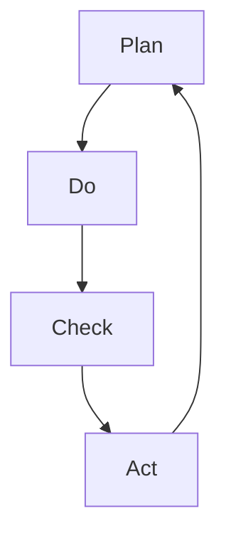

                 

# PDCA循环:管理者落地执行的指南

PDCA循环，即**Plan-Do-Check-Act**循环，是管理学中一种基于科学方法和数据驱动的项目管理方法。它由美国质量管理专家W. Edwards Deming博士于1950年提出，广泛应用于企业管理、质量控制、项目管理等各个领域。PDCA循环的四个步骤——计划、执行、检查、改进，构成了一个系统的管理框架，帮助管理者从问题识别、规划实施、效果评估到持续优化，高效解决各种复杂问题。

本文将详细探讨PDCA循环的核心概念、实现原理、操作步骤，以及在不同领域的应用场景和未来发展趋势，并提供项目实践和相关资源推荐，以期对管理者和项目经理在实际工作中落地执行PDCA循环提供指导。

## 1. 背景介绍

### 1.1 问题由来

在快速变化的市场环境中，企业需要快速响应市场变化，提高运营效率，提升产品或服务的质量和竞争力。传统的线性管理方式往往难以灵活应对复杂的市场环境，导致项目周期长、资源浪费、交付质量不稳定等问题。PDCA循环作为一种系统化的管理方法，通过不断循环迭代，逐步优化决策过程，提升项目管理效率和质量。

### 1.2 问题核心关键点

PDCA循环的核心在于其系统化和动态化的管理思路，通过计划、执行、检查和改进四个步骤的循环往复，实现问题的持续解决和项目的不断优化。具体而言，PDCA循环的四个步骤分别对应：

- **计划(Plan)**：明确目标、制定计划、分配资源、设置关键里程碑。
- **执行(Do)**：按照计划执行，确保资源到位、流程有序、沟通顺畅。
- **检查(Check)**：监测项目进展，评估实施效果，识别偏差和风险。
- **改进(Act)**：根据检查结果，调整计划和执行方式，优化管理流程，固化成功经验，规避失败教训。

## 2. 核心概念与联系

### 2.1 核心概念概述

PDCA循环包含四个核心概念：

- **计划(Plan)**：基于数据分析和决策模型，明确项目目标、任务分解、资源配置和关键路径。
- **执行(Do)**：按照计划，协调资源，执行任务，确保按期完成关键里程碑。
- **检查(Check)**：通过数据监测、定期报告和实时反馈，评估项目进展和实施效果，识别偏差和风险。
- **改进(Act)**：根据检查结果，对计划和执行进行调整优化，形成闭环反馈机制，确保项目持续改进。

### 2.2 核心概念联系

PDCA循环中的四个步骤构成了一个闭环反馈机制，通过持续的计划、执行、检查和改进，实现项目的渐进式优化。其逻辑关系可以通过以下Mermaid流程图来展示：



这个流程图展示了PDCA循环的基本流程：

1. **计划(Plan)**：根据目标和当前状态，制定行动计划，确保资源和任务的合理配置。
2. **执行(Do)**：按照计划，高效执行，确保任务按时完成。
3. **检查(Check)**：通过数据和反馈，监测项目进展，评估执行效果。
4. **改进(Act)**：根据检查结果，调整计划和执行方式，形成闭环，持续改进。

## 3. 核心算法原理 & 具体操作步骤

### 3.1 算法原理概述

PDCA循环的原理基于控制理论，通过数据驱动和持续反馈，实现对复杂系统的有效管理和优化。具体而言，PDCA循环通过不断的闭环反馈，逐步提升项目的管理水平和实施效果。其核心思想是：

- **数据驱动决策**：通过收集和分析数据，发现问题和机会，制定决策和计划。
- **持续改进**：基于数据和反馈，识别偏差和风险，调整计划和执行方式，实现持续优化。

### 3.2 算法步骤详解

PDCA循环的四个步骤，具体操作步骤如下：

**Step 1: 计划(Plan)**

- **目标设定**：明确项目目标和关键绩效指标。
- **问题分析**：通过数据分析和业务讨论，识别项目面临的主要问题和风险。
- **方案制定**：基于问题分析结果，制定详细的实施方案，包括任务分解、资源分配、时间节点等。
- **资源准备**：确保所需资源到位，如人力、技术、资金等。

**Step 2: 执行(Do)**

- **任务分配**：将任务分解到各个团队，明确责任人和时间节点。
- **协同执行**：协调团队合作，确保任务按计划执行。
- **实时监控**：通过数据和报告，实时监控项目进展。
- **问题应对**：及时识别和解决执行过程中出现的问题和障碍。

**Step 3: 检查(Check)**

- **数据收集**：收集项目实施过程中的关键数据，如进度、质量、成本等。
- **效果评估**：根据预设的关键绩效指标，评估项目的实施效果和进展情况。
- **偏差识别**：识别实施过程中的偏差和风险，如进度滞后、质量问题等。
- **反馈机制**：建立反馈机制，及时向团队反馈检查结果，形成闭环。

**Step 4: 改进(Act)**

- **优化方案**：根据检查结果，调整和优化实施方案。
- **资源调整**：根据实施效果，调整资源配置，优化流程和工具。
- **知识固化**：将成功经验和教训，固化为标准流程和最佳实践。
- **持续优化**：建立持续改进机制，形成PDCA循环。

### 3.3 算法优缺点

**优点**：

- **系统化管理**：通过PDCA循环，系统化地处理项目管理的各个环节，确保项目的全面覆盖和持续优化。
- **数据驱动决策**：通过数据收集和分析，提供决策依据，减少主观偏差。
- **持续改进**：通过持续的反馈和改进，逐步提升项目的管理水平和实施效果。

**缺点**：

- **执行成本高**：PDCA循环需要投入较多资源，包括数据收集、分析、报告等，增加了管理成本。
- **灵活性不足**：PDCA循环的固定步骤顺序，可能难以应对突发的变化和紧急情况。
- **实施复杂**：需要团队协作和数据管理，对于项目管理经验不足的团队，实施难度较大。

### 3.4 算法应用领域

PDCA循环适用于各种项目管理场景，包括但不限于：

- **软件开发**：通过PDCA循环，持续优化软件开发的各个环节，提高产品质量和开发效率。
- **生产管理**：在制造业中，PDCA循环用于优化生产流程，提高生产效率和产品质量。
- **市场推广**：在市场营销中，PDCA循环用于优化推广策略，提升品牌影响力和市场份额。
- **售后服务**：通过PDCA循环，持续优化售后服务流程，提高客户满意度和忠诚度。
- **组织变革**：在组织变革中，PDCA循环用于推动组织结构的优化和管理方式的改进。

## 4. 数学模型和公式 & 详细讲解 & 举例说明

### 4.1 数学模型构建

PDCA循环的核心在于通过数据驱动的决策和持续改进，实现项目的渐进式优化。数学模型主要涉及数据的收集、分析、评估和反馈。具体模型构建如下：

- **数据收集模型**：用于收集项目实施过程中的关键数据，如进度、质量、成本等。
- **效果评估模型**：用于评估项目的实施效果和进展情况，通常通过关键绩效指标(KPIs)来进行评估。
- **偏差识别模型**：用于识别实施过程中的偏差和风险，通常通过统计分析和异常检测技术来实现。
- **改进模型**：用于优化实施方案，调整资源配置，提高项目管理水平，通常通过数据分析和模型优化来实现。

### 4.2 公式推导过程

以一个简单的项目进度管理为例，展示PDCA循环的数据模型构建和公式推导过程：

- **数据收集模型**：
  $$
  \text{进度数据} = \{P_i\}_{i=1}^n
  $$
  其中 $P_i$ 表示第 $i$ 个时间点的进度值。

- **效果评估模型**：
  $$
  \text{进度偏差} = \bar{P} - P_t
  $$
  其中 $\bar{P}$ 表示平均进度值，$P_t$ 表示目标进度值。

- **偏差识别模型**：
  $$
  \text{偏差阈值} = \alpha P_t
  $$
  其中 $\alpha$ 表示偏差阈值，用于判断进度是否偏离目标。

- **改进模型**：
  $$
  \text{优化方案} = \begin{cases}
  \text{当前方案} & \text{if } \text{进度偏差} < \alpha P_t \\
  \text{调整方案} & \text{if } \text{进度偏差} \geq \alpha P_t
  \end{cases}
  $$

### 4.3 案例分析与讲解

以一个软件开发项目为例，展示PDCA循环的实际应用：

1. **计划(Plan)**：明确项目目标，如开发一个新的移动应用。识别问题，如技术栈的选择、时间限制等。制定详细方案，分配资源，确保团队和工具到位。

2. **执行(Do)**：按照计划执行，分解任务，如需求分析、设计、编码、测试等。实时监控进度和质量，确保任务按期完成。识别和解决问题，如技术难题、资源不足等。

3. **检查(Check)**：收集进度、质量、成本等关键数据，评估项目实施效果。识别偏差和风险，如进度滞后、质量问题等。建立反馈机制，及时向团队反馈检查结果。

4. **改进(Act)**：根据检查结果，调整优化方案，如增加资源、改进流程等。固化成功经验，规避失败教训，形成PDCA循环。

## 5. 项目实践：代码实例和详细解释说明

### 5.1 开发环境搭建

在进行PDCA循环的实践前，需要准备开发环境：

1. **安装Python**：在官方网站下载安装Python，并配置环境变量。
2. **安装Pandas**：使用 pip 安装Pandas库，用于数据处理和分析。
3. **安装Matplotlib**：使用 pip 安装Matplotlib库，用于数据可视化。
4. **安装Numpy**：使用 pip 安装Numpy库，用于数值计算。

### 5.2 源代码详细实现

以下是一个简单的Python代码示例，用于模拟PDCA循环的数据收集、分析、评估和反馈过程：

```python
import pandas as pd
import numpy as np
import matplotlib.pyplot as plt

# 数据收集
data = pd.DataFrame({'进度': [80, 90, 70, 85, 95], '成本': [10000, 12000, 9000, 11000, 15000]})

# 效果评估
进度偏差 = np.mean(data['进度']) - 100
进度偏差

# 偏差识别
偏差阈值 = 10
进度偏差绝对值

# 改进模型
if 进度偏差绝对值 < 偏差阈值:
    print('当前方案')
else:
    print('调整方案')

# 数据可视化
plt.plot(data['进度'], label='进度')
plt.plot(np.mean(data['进度']), label='平均进度')
plt.legend()
plt.show()
```

### 5.3 代码解读与分析

**数据收集**：通过Pandas库创建一个数据框，包含进度和成本数据。

**效果评估**：计算平均进度，与目标进度100对比，计算进度偏差。

**偏差识别**：设定偏差阈值，识别进度偏差是否超出阈值。

**改进模型**：根据进度偏差，决定是否调整方案。

**数据可视化**：使用Matplotlib库绘制进度趋势图，直观展示项目进展。

## 6. 实际应用场景

### 6.1 软件开发

在软件开发中，PDCA循环用于持续优化项目的各个环节，提高产品质量和开发效率。具体应用场景包括：

- **需求分析**：通过PDCA循环，持续优化需求分析过程，确保需求的准确性和可行性。
- **设计优化**：通过PDCA循环，持续优化设计方案，提高代码质量和可维护性。
- **测试改进**：通过PDCA循环，持续优化测试流程，提高测试覆盖率和测试效率。

### 6.2 生产管理

在制造业中，PDCA循环用于优化生产流程，提高生产效率和产品质量。具体应用场景包括：

- **生产线优化**：通过PDCA循环，持续优化生产线的各个环节，提高生产效率。
- **质量控制**：通过PDCA循环，持续优化质量控制流程，提高产品质量。
- **设备维护**：通过PDCA循环，持续优化设备维护流程，延长设备使用寿命。

### 6.3 市场推广

在市场营销中，PDCA循环用于优化推广策略，提升品牌影响力和市场份额。具体应用场景包括：

- **广告投放优化**：通过PDCA循环，持续优化广告投放策略，提高广告效果。
- **市场分析**：通过PDCA循环，持续优化市场分析过程，识别市场机会和风险。
- **客户关系管理**：通过PDCA循环，持续优化客户关系管理流程，提升客户满意度和忠诚度。

### 6.4 未来应用展望

随着技术的不断进步，PDCA循环将迎来更多的应用场景和创新点：

1. **人工智能应用**：结合人工智能技术，实现数据的智能分析和自动反馈，提升PDCA循环的自动化和智能化水平。
2. **区块链技术**：利用区块链技术，实现数据的安全共享和透明化，提升PDCA循环的可信度和可靠性。
3. **物联网应用**：通过物联网技术，实现对生产、市场、客户等各个环节的实时监测和控制，提升PDCA循环的实时性和准确性。
4. **跨领域融合**：将PDCA循环与其他管理工具和方法（如精益管理、六西格玛）结合，形成跨领域的管理优化框架。

## 7. 工具和资源推荐

### 7.1 学习资源推荐

为了帮助管理者深入理解PDCA循环的原理和应用，这里推荐一些优质的学习资源：

1. **《PDCA循环实战》**：本书详细介绍了PDCA循环的原理、操作步骤和实际应用案例，适合实战型管理者阅读。
2. **《PDCA循环管理方法》**：这是一门在线课程，由国际知名管理专家讲授，涵盖PDCA循环的各个环节，适合初学者入门。
3. **《PDCA循环案例分析》**：通过多个实际案例，深入讲解PDCA循环在不同行业的应用，适合管理者实践参考。
4. **《PDCA循环工具集》**：本书介绍了多种PDCA循环工具和软件，帮助管理者提高项目管理效率。

### 7.2 开发工具推荐

为了提高PDCA循环的实践效率，这里推荐一些常用的开发工具：

1. **Jira**：一款流行的项目管理工具，支持PDCA循环的各个环节，适用于软件开发和生产管理。
2. **Trello**：一款简单易用的项目管理工具，支持任务分配和进度跟踪，适用于中小型项目管理。
3. **Asana**：一款灵活的项目管理工具，支持团队协作和实时反馈，适用于跨领域项目管理。

### 7.3 相关论文推荐

为了深入研究PDCA循环的理论基础和实践应用，这里推荐一些经典的论文：

1. **"PDCA循环的应用与实践"**：深入探讨PDCA循环的理论基础和实际应用，适合学术研究。
2. **"PDCA循环在项目管理中的应用"**：通过多个案例，深入分析PDCA循环在项目管理中的应用效果，适合实践应用。
3. **"PDCA循环的优化与创新"**：探讨PDCA循环的优化策略和创新方向，适合管理者创新实践。

## 8. 总结：未来发展趋势与挑战

### 8.1 研究成果总结

本文详细介绍了PDCA循环的核心概念、实现原理、操作步骤和应用场景，并提供了项目实践和相关资源推荐。通过系统梳理PDCA循环的理论基础和实践方法，帮助管理者在实际工作中高效执行PDCA循环，提升项目管理水平。

### 8.2 未来发展趋势

展望未来，PDCA循环将在更多领域得到应用，为企业的持续改进和创新提供有力支持：

1. **自动化和智能化**：结合人工智能和大数据技术，实现PDCA循环的自动化和智能化，提升管理效率和决策质量。
2. **跨领域融合**：将PDCA循环与其他管理工具和方法结合，形成跨领域的管理优化框架，提升管理水平和效果。
3. **实时化和透明化**：利用物联网和区块链技术，实现PDCA循环的实时化和透明化，提升管理透明度和可信度。
4. **人机协同**：通过人机协同的方式，实现PDCA循环的优化和创新，提升管理灵活性和创新能力。

### 8.3 面临的挑战

尽管PDCA循环已经广泛应用于企业管理和项目管理，但在实际应用中也面临一些挑战：

1. **资源和成本**：PDCA循环需要投入较多资源和成本，对于中小企业和项目而言，实施难度较大。
2. **数据质量**：数据收集和分析的准确性和完整性，直接影响PDCA循环的效果，数据质量问题需重视。
3. **人员培训**：PDCA循环需要管理者和团队具备一定的管理知识和技能，需投入时间和资源进行培训。
4. **文化变革**：PDCA循环需要团队成员具备开放和合作的意识，需进行企业文化变革，营造协同合作的环境。

### 8.4 研究展望

面对PDCA循环面临的挑战，未来的研究需要在以下几个方面寻求新的突破：

1. **数据驱动的PDCA循环**：通过大数据和人工智能技术，提升PDCA循环的数据驱动能力，实现更精准的决策和优化。
2. **人机协同的PDCA循环**：结合人工智能和机器人技术，实现PDCA循环的自动化和智能化，提升管理效率。
3. **跨领域的PDCA循环**：将PDCA循环与其他管理工具和方法结合，形成跨领域的管理优化框架，提升管理水平和效果。
4. **实时化和透明化的PDCA循环**：利用物联网和区块链技术，实现PDCA循环的实时化和透明化，提升管理透明度和可信度。

总之，PDCA循环作为一种系统化的管理方法，已经在各行各业得到了广泛应用，并将在未来继续发挥重要作用。管理者需要不断学习、实践和创新，才能更好地应用PDCA循环，实现项目的持续改进和创新。

## 9. 附录：常见问题与解答

**Q1: 什么是PDCA循环？**

A: PDCA循环，即**Plan-Do-Check-Act**循环，是一种系统化的项目管理方法，通过计划、执行、检查和改进四个步骤，实现项目的持续优化和改进。

**Q2: PDCA循环的四个步骤是什么？**

A: PDCA循环的四个步骤分别为：
1. **计划(Plan)**：明确目标、制定计划、分配资源、设置关键里程碑。
2. **执行(Do)**：按照计划执行，确保资源到位、流程有序、沟通顺畅。
3. **检查(Check)**：通过数据和反馈，监测项目进展，评估实施效果，识别偏差和风险。
4. **改进(Act)**：根据检查结果，调整计划和执行方式，优化管理流程，固化成功经验，规避失败教训。

**Q3: PDCA循环的优点和缺点是什么？**

A: **优点**：
- **系统化管理**：通过PDCA循环，系统化地处理项目管理的各个环节，确保项目的全面覆盖和持续优化。
- **数据驱动决策**：通过数据收集和分析，提供决策依据，减少主观偏差。
- **持续改进**：通过持续的反馈和改进，逐步提升项目的管理水平和实施效果。

**缺点**：
- **执行成本高**：PDCA循环需要投入较多资源，增加了管理成本。
- **灵活性不足**：PDCA循环的固定步骤顺序，可能难以应对突发的变化和紧急情况。
- **实施复杂**：需要团队协作和数据管理，对于项目管理经验不足的团队，实施难度较大。

**Q4: PDCA循环在不同领域的应用场景是什么？**

A: PDCA循环适用于各种项目管理场景，包括但不限于：
- **软件开发**：通过PDCA循环，持续优化软件开发各个环节，提高产品质量和开发效率。
- **生产管理**：在制造业中，PDCA循环用于优化生产流程，提高生产效率和产品质量。
- **市场推广**：在市场营销中，PDCA循环用于优化推广策略，提升品牌影响力和市场份额。
- **售后服务**：通过PDCA循环，持续优化售后服务流程，提高客户满意度和忠诚度。
- **组织变革**：在组织变革中，PDCA循环用于推动组织结构的优化和管理方式的改进。

**Q5: 如何提升PDCA循环的数据驱动能力？**

A: 通过大数据和人工智能技术，提升PDCA循环的数据驱动能力，实现更精准的决策和优化。具体方法包括：
- **数据收集**：使用大数据技术，全面收集项目实施过程中的关键数据。
- **数据分析**：结合人工智能技术，对数据进行深度分析和挖掘，发现问题和机会。
- **数据可视化**：使用数据可视化工具，将数据转化为直观的图表和报告，支持决策。

通过这些方法，可以有效提升PDCA循环的数据驱动能力，实现更精准的决策和优化。

---

作者：禅与计算机程序设计艺术 / Zen and the Art of Computer Programming

