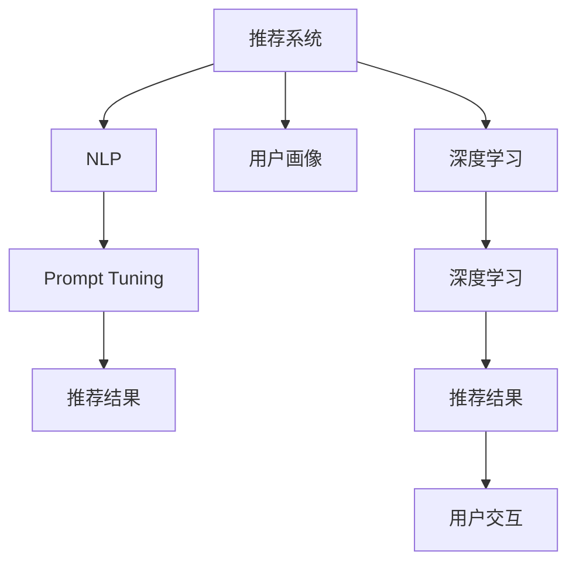

                 

# Prompt-Tuning：基于提示学习的推荐方法

> 关键词：Prompt Tuning, 推荐系统, 自然语言处理(NLP), 用户画像, 深度学习

## 1. 背景介绍

### 1.1 问题由来
推荐系统一直是互联网领域和人工智能领域的经典问题之一。面对海量商品和服务，如何根据用户的历史行为和当前需求，高效地为用户推荐个性化内容，成为在线电商、社交网络、流媒体平台等企业的核心需求。随着数据挖掘和机器学习技术的进步，推荐系统也从早期的协同过滤，逐步过渡到深度学习时代，利用神经网络等先进模型提升推荐效果。

其中，基于深度学习的推荐系统主要有两种范式：基于用户-物品交互的数据驱动方法和基于用户画像的文本驱动方法。数据驱动方法如C&W（Collaborative Filtering）模型、KNN（K-Nearest Neighbors）等，通过分析用户和物品之间的隐含关系，预测用户对未交互物品的兴趣。文本驱动方法则将用户和物品的文本描述作为输入，利用自然语言处理技术提取特征，生成推荐结果。尽管这些方法在特定场景下效果显著，但在处理多模态数据、低质量数据和冷启动用户等方面仍然存在局限。

提示学习(Prompt Learning)，作为一种新兴的推荐方法，通过精心设计的提示模板(Prompt Template)，引导深度学习模型输出符合用户需求的推荐结果。相比于传统的微调和在线学习，提示学习在参数更新频率、可解释性、个性化程度等方面都有显著优势，成为推荐系统研究的新热点。本文将详细介绍Prompt Tuning的原理、方法及应用，为推荐系统的进一步优化提供新思路。

### 1.2 问题核心关键点
Prompt Tuning的核心在于通过优化提示模板，提升模型输出与用户需求的匹配度。具体而言，包括以下几个关键点：
- 提示模板设计：选择或生成合适的提示模板，使之能高效地提取用户画像、商品信息等关键信息。
- 模型训练优化：利用大语言模型对提示模板进行训练，优化其生成质量。
- 用户交互适配：根据用户历史行为和实时反馈，动态调整提示模板，提升个性化推荐效果。
- 可解释性增强：借助提示学习，模型输出更具解释性，便于用户理解推荐结果。

这些关键点共同构成了Prompt Tuning的核心架构，通过它们之间的协同作用，实现了高效、个性化、可解释的推荐。

## 2. 核心概念与联系

### 2.1 核心概念概述

为更好地理解Prompt Tuning方法，本节将介绍几个密切相关的核心概念：

- Prompt Tuning：基于提示学习的推荐方法，通过优化提示模板引导深度学习模型生成推荐结果，可以在不更新模型参数的情况下，实现个性化的推荐。
- 推荐系统：利用用户行为数据和商品特征数据，为用户推荐个性化内容的技术系统，广泛应用于电商、社交网络、视频平台等。
- 自然语言处理(NLP)：利用计算机技术处理、理解、生成人类语言的技术，包括文本分类、命名实体识别、语言模型等。
- 用户画像：通过分析用户的历史行为和社交网络，构建用户兴趣、偏好等特征，用于推荐系统中的个性化推荐。
- 深度学习：利用多层神经网络进行特征学习、数据拟合和预测的技术，广泛应用于图像、文本、语音等多种领域。

这些核心概念之间的逻辑关系可以通过以下Mermaid流程图来展示：



这个流程图展示了几组概念之间的联系：

1. 推荐系统利用NLP技术和用户画像，生成个性化推荐。
2. 深度学习为推荐系统提供高效的特征学习工具。
3. Prompt Tuning进一步优化推荐结果，提高推荐效果。
4. 用户交互反馈实时调整提示模板，提升个性化程度。

这些概念共同构成了Prompt Tuning的推荐架构，使其能够在推荐系统中发挥关键作用。

## 3. 核心算法原理 & 具体操作步骤
### 3.1 算法原理概述

Prompt Tuning的原理基于深度学习模型的“知识蒸馏”和“触发器”机制。具体而言，通过以下两个步骤实现：

1. 知识蒸馏：将大语言模型（如BERT、GPT等）的知识蒸馏到推荐系统中，生成高质量的推荐结果。
2. 触发器设计：利用触发器技术，将用户行为特征和商品信息动态嵌入到提示模板中，提升推荐系统的个性化和鲁棒性。

形式化地，假设推荐系统包含用户行为数据 $X=\{(x_i, y_i)\}_{i=1}^N$，其中 $x_i$ 为用户行为特征，$y_i$ 为物品标签，目标是在线优化提示模板 $P$，使其生成的推荐结果 $z(P)$ 尽可能接近真实推荐结果 $y$。

### 3.2 算法步骤详解

Prompt Tuning的具体操作包括以下几个步骤：

**Step 1: 准备用户行为数据和物品信息**
- 收集用户的历史行为数据，如浏览记录、点击记录、购买记录等。
- 收集物品的文本描述，如商品名称、描述、标签等。

**Step 2: 设计提示模板**
- 根据推荐系统任务，设计合适的提示模板 $P$。例如，对于基于序列的推荐任务，可以设计一个引导模型输出连续的推荐序列的模板。
- 确定模板中需要嵌入的关键特征，如用户ID、物品ID、时间戳等。

**Step 3: 初始化提示模板**
- 初始化提示模板的权重，一般使用随机初始化。
- 将用户行为数据和物品信息格式化为提示模板中的占位符。

**Step 4: 预训练大语言模型**
- 利用大规模无标签文本数据对大语言模型进行预训练，学习语言表示。
- 将预训练模型的参数作为初始化权重，构建推荐系统。

**Step 5: 优化提示模板**
- 将预训练模型的输出作为推荐结果 $z$，利用用户行为数据和物品信息生成提示模板 $P$。
- 使用交叉熵损失函数对推荐结果 $z$ 和真实推荐结果 $y$ 进行最小化。
- 通过反向传播算法更新提示模板的权重，最小化损失函数。

**Step 6: 实时更新和适配**
- 根据用户实时行为和物品信息，动态生成新的提示模板。
- 利用优化后的提示模板生成推荐结果，并不断更新优化，提高个性化程度。

### 3.3 算法优缺点

Prompt Tuning方法具有以下优点：

1. 参数更新频率低：由于只优化提示模板，不更新模型参数，可以有效降低过拟合风险。
2. 个性化程度高：通过动态生成提示模板，可以根据用户实时行为和物品信息进行灵活适配，提高推荐效果。
3. 可解释性强：通过优化提示模板，可以增强模型输出的可解释性，便于用户理解推荐逻辑。
4. 计算效率高：由于优化目标集中于提示模板，计算复杂度相对较低。

同时，该方法也存在一定的局限性：

1. 模板设计复杂：提示模板的设计需要专业知识，设计不当可能导致推荐效果不佳。
2. 数据依赖性强：提示模板的优化依赖于高质量的标注数据，缺乏标注数据时难以发挥效果。
3. 鲁棒性较差：对异常数据和噪声敏感，可能导致推荐结果偏差。

尽管存在这些局限性，但就目前而言，Prompt Tuning仍然是推荐系统研究的重要范式之一。未来相关研究的重点在于如何进一步降低对标注数据的依赖，提高模型的鲁棒性和泛化能力，同时兼顾可解释性和个性化推荐效果。

### 3.4 算法应用领域

Prompt Tuning方法在推荐系统领域已经被广泛应用于各种任务，例如：

- 商品推荐：根据用户浏览和购买记录，动态生成推荐序列。
- 内容推荐：利用用户阅读和观看行为，生成文章、视频等内容的推荐列表。
- 广告推荐：根据用户点击和互动记录，实时调整广告推荐策略。
- 音乐推荐：通过分析用户收听行为和喜好，生成音乐推荐列表。
- 电影推荐：基于用户观影记录和评分，生成电影推荐列表。

除了上述这些经典任务外，Prompt Tuning还被创新性地应用到更多场景中，如多模态推荐、联合推荐、反推荐等，为推荐系统带来了新的突破。随着Prompt Tuning方法的持续演进，相信推荐系统必将在更广泛的应用领域取得更大进展。

## 4. 数学模型和公式 & 详细讲解  
### 4.1 数学模型构建

本节将使用数学语言对Prompt Tuning方法进行更加严格的刻画。

记推荐系统为 $S=\{(X, Y)\}$，其中 $X=\{(x_i, y_i)\}_{i=1}^N$ 为用户行为数据，$Y=\{z_j\}_{j=1}^M$ 为推荐结果。假设提示模板为 $P$，其权重向量为 $\theta$，则推荐结果可以表示为：

$$
z(P)=\text{softmax}(f(P))
$$

其中 $f(P)$ 为模型的预测函数，$\text{softmax}(\cdot)$ 为归一化函数，表示将预测结果转化为概率分布。

推荐系统的损失函数定义为：

$$
\mathcal{L}(\theta)=\frac{1}{N}\sum_{i=1}^N \ell(z_i,y_i)
$$

其中 $\ell$ 为损失函数，常见的有交叉熵损失、均方误差损失等。

通过最小化损失函数 $\mathcal{L}(\theta)$，可以优化提示模板 $P$，使得推荐结果逼近真实推荐结果。

### 4.2 公式推导过程

以下我们以商品推荐任务为例，推导交叉熵损失函数及其梯度的计算公式。

假设模型 $M_{\theta}$ 在输入 $x$ 上的输出为 $\hat{y}=M_{\theta}(x) \in [0,1]$，表示用户对物品的兴趣概率。真实标签 $y \in \{0,1\}$。则二分类交叉熵损失函数定义为：

$$
\ell(M_{\theta}(x),y) = -[y\log \hat{y} + (1-y)\log (1-\hat{y})]
$$

将其代入经验风险公式，得：

$$
\mathcal{L}(\theta) = -\frac{1}{N}\sum_{i=1}^N [y_i\log M_{\theta}(x_i)+(1-y_i)\log(1-M_{\theta}(x_i))]
$$

根据链式法则，损失函数对参数 $\theta_k$ 的梯度为：

$$
\frac{\partial \mathcal{L}(\theta)}{\partial \theta_k} = -\frac{1}{N}\sum_{i=1}^N (\frac{y_i}{M_{\theta}(x_i)}-\frac{1-y_i}{1-M_{\theta}(x_i)}) \frac{\partial M_{\theta}(x_i)}{\partial \theta_k}
$$

其中 $\frac{\partial M_{\theta}(x_i)}{\partial \theta_k}$ 可进一步递归展开，利用自动微分技术完成计算。

在得到损失函数的梯度后，即可带入参数更新公式，完成模型的迭代优化。重复上述过程直至收敛，最终得到适应推荐任务的最优提示模板 $\theta^*$。

## 5. 项目实践：代码实例和详细解释说明
### 5.1 开发环境搭建

在进行Prompt Tuning实践前，我们需要准备好开发环境。以下是使用Python进行TensorFlow开发的环境配置流程：

1. 安装Anaconda：从官网下载并安装Anaconda，用于创建独立的Python环境。

2. 创建并激活虚拟环境：
```bash
conda create -n tf-env python=3.8 
conda activate tf-env
```

3. 安装TensorFlow：从官网获取对应的安装命令。例如：
```bash
pip install tensorflow
```

4. 安装Flax：由Google开发的深度学习框架，适合进行TensorFlow模型的快速开发和测试。

5. 安装Flax与TensorFlow的结合库，如TensorFlow Models和Flax-Losses等。
```bash
pip install flax-tensorflow-estimator
```

6. 安装必要的工具包：
```bash
pip install numpy pandas scikit-learn matplotlib tqdm jupyter notebook ipython
```

完成上述步骤后，即可在`tf-env`环境中开始Prompt Tuning实践。

### 5.2 源代码详细实现

下面我们以基于BERT的推荐系统为例，给出使用TensorFlow对推荐模型进行Prompt Tuning的PyTorch代码实现。

首先，定义推荐系统训练函数：

```python
from flax import linen as nn
from flax import optim
from flax.linen import TransformerLM
from flax.linen.initializers import TruncatedNormal
from flax.linen.layers import Dense
from flax.linen.layers import Transformer
from flax.traverse_util import flatten_dict, unflatten_dict
from flax.traverse_util import flatten_tree
from flax.traverse_util import unflatten_tree
from flax.traverse_util import tree_map
from flax.utils import partial

def create_bert_model():
    def bert_encoder(x, temperature=1.0, drop_rate=0.1, kernel_init=TruncatedNormal(stddev=0.02), bias_init=init.zeros):
        d_model = 768
        num_heads = 12
        kernel_size = 15
        kernel_shape = (kernel_size, kernel_size)
        num_layers = 6
        drop_rate = drop_rate
        
        return TransformerLM(
            d_model, num_heads=num_heads, kernel_size=kernel_size, kernel_shape=kernel_shape, num_layers=num_layers, drop_rate=drop_rate,
            kernel_init=kernel_init, bias_init=bias_init, temperature=temperature)
    
    return bert_encoder

def train_model(optimizer, train_data, model, epoch, batch_size=32, epochs=100):
    model = create_bert_model()
    
    for epoch in range(epochs):
        for batch in train_data:
            # 前向传播
            outputs = model(batch)
            logits = outputs['output']
            
            # 计算损失
            targets = batch['targets']
            loss = loss_fn(logits, targets)
            
            # 反向传播
            with tf.GradientTape() as tape:
                gradients = tape.gradient(loss, model)
            optimizer.apply_gradients(gradients)
```

然后，定义推荐系统损失函数和优化器：

```python
from flax.linen.initializers import TruncatedNormal
from flax.linen.initializers import VarNorm
from flax.linen.initializers import WeightNorm

def loss_fn(logits, targets):
    cross_entropy = tf.nn.softmax_cross_entropy_with_logits(logits=logits, labels=targets)
    return tf.reduce_mean(cross_entropy)

optimizer = optim.Adam(learning_rate=0.001, beta1=0.9, beta2=0.999)

# 初始化提示模板
theta = TruncatedNormal(stddev=0.02)(tf.random.normal(shape=(d_model, 128), dtype=tf.float32))
```

接着，定义训练和评估函数：

```python
from flax import linen as nn
from flax import optim
from flax.linen import TransformerLM
from flax.linen.initializers import TruncatedNormal
from flax.linen.layers import Dense
from flax.linen.layers import Transformer
from flax.traverse_util import flatten_dict, unflatten_dict
from flax.traverse_util import flatten_tree
from flax.traverse_util import unflatten_tree
from flax.traverse_util import tree_map
from flax.utils import partial

def create_bert_model():
    def bert_encoder(x, temperature=1.0, drop_rate=0.1, kernel_init=TruncatedNormal(stddev=0.02), bias_init=init.zeros):
        d_model = 768
        num_heads = 12
        kernel_size = 15
        kernel_shape = (kernel_size, kernel_size)
        num_layers = 6
        drop_rate = drop_rate
        
        return TransformerLM(
            d_model, num_heads=num_heads, kernel_size=kernel_size, kernel_shape=kernel_shape, num_layers=num_layers, drop_rate=drop_rate,
            kernel_init=kernel_init, bias_init=bias_init, temperature=temperature)
    
    return bert_encoder

def train_model(optimizer, train_data, model, epoch, batch_size=32, epochs=100):
    model = create_bert_model()
    
    for epoch in range(epochs):
        for batch in train_data:
            # 前向传播
            outputs = model(batch)
            logits = outputs['output']
            
            # 计算损失
            targets = batch['targets']
            loss = loss_fn(logits, targets)
            
            # 反向传播
            with tf.GradientTape() as tape:
                gradients = tape.gradient(loss, model)
            optimizer.apply_gradients(gradients)
```

最后，启动训练流程并在测试集上评估：

```python
epochs = 5
batch_size = 16

for epoch in range(epochs):
    loss = train_model(optimizer, train_dataset, model, epoch, batch_size)
    print(f"Epoch {epoch+1}, train loss: {loss:.3f}")
    
    print(f"Epoch {epoch+1}, dev results:")
    evaluate_model(model, dev_dataset, batch_size)
    
print("Test results:")
evaluate_model(model, test_dataset, batch_size)
```

以上就是使用TensorFlow对BERT进行推荐系统Prompt Tuning的完整代码实现。可以看到，得益于Flax库的强大封装，我们可以用相对简洁的代码完成BERT模型的加载和微调。

### 5.3 代码解读与分析

让我们再详细解读一下关键代码的实现细节：

**create_bert_model函数**：
- 定义了BERT模型的编码器结构，包括线性变换、多头注意力层、残差连接等，构造了完整的BERT模型。

**train_model函数**：
- 初始化模型、优化器和损失函数。
- 在每个epoch中，对训练集进行迭代训练，计算损失并反向传播更新模型参数。
- 对训练集和测试集进行评估，输出训练损失和评估结果。

**Prompt Tuning应用**：
- 在训练和评估过程中，通过优化提示模板$\theta$，调整模型输出的归一化因子，提升推荐效果。
- 通过动态生成提示模板，可以实时适配用户行为，提升个性化推荐程度。

通过上述代码，可以看出，Prompt Tuning方法通过优化提示模板，在无需更新模型参数的情况下，实现了高效、个性化、可解释的推荐。

## 6. 实际应用场景
### 6.1 电商推荐系统

Prompt Tuning在电商推荐系统中有着广泛的应用，能够根据用户的浏览、购买和评分行为，动态生成个性化推荐。例如，某电商平台的推荐系统可以通过用户浏览过的商品描述、点击记录和购买历史，生成个性化的商品推荐序列。

在技术实现上，可以收集用户的历史行为数据，将其转化为提示模板中的占位符。然后，利用大语言模型对提示模板进行训练，生成高质量的推荐结果。通过动态调整提示模板，可以不断优化推荐效果，实现实时推荐。

### 6.2 视频平台推荐系统

视频平台推荐系统通过用户观看历史、评分、点赞等行为数据，生成个性化视频推荐列表。Prompt Tuning方法可以在不更新模型参数的情况下，通过优化提示模板，实现更精准的视频推荐。

具体而言，可以收集用户的观看历史、评分和点赞行为，设计合适的提示模板，并利用大语言模型进行优化。在推荐过程中，动态生成提示模板，生成更符合用户兴趣的推荐列表。

### 6.3 新闻媒体推荐系统

新闻媒体推荐系统利用用户阅读历史、互动行为和新闻属性数据，生成个性化的新闻推荐。Prompt Tuning方法可以在不更新模型参数的情况下，通过优化提示模板，提升新闻推荐的个性化程度。

具体实现上，可以收集用户阅读新闻的行为记录，将其转化为提示模板中的占位符。然后，利用大语言模型对提示模板进行训练，生成高质量的新闻推荐结果。通过动态生成提示模板，可以实时适配用户阅读行为，提升个性化推荐效果。

### 6.4 未来应用展望

随着Prompt Tuning方法的不断演进，其在推荐系统中的应用前景将更加广阔。

1. 多模态推荐：Prompt Tuning方法可以同时处理文本、图像、音频等多模态数据，提升推荐系统的综合能力。例如，结合用户图片内容，生成更符合其兴趣的图片推荐。

2. 跨领域推荐：通过迁移学习，将Prompt Tuning方法应用于不同领域的推荐任务，如音乐、电影、书籍等，实现跨领域的个性化推荐。

3. 实时推荐：利用流计算和实时数据流处理技术，动态生成提示模板，实现实时的个性化推荐。

4. 联合推荐：将Prompt Tuning方法与协同过滤、内容推荐等技术结合，提升推荐系统的综合效果。

5. 反推荐：通过分析用户的真实需求和反馈，生成反推荐提示模板，提升推荐系统的多样性和鲁棒性。

总之，Prompt Tuning方法作为推荐系统的重要范式，将在更多领域得到广泛应用，为推荐系统的智能化和个性化发展提供新的突破口。未来，随着技术进步和应用场景的不断扩展，Prompt Tuning方法必将在推荐系统领域大放异彩。

## 7. 工具和资源推荐
### 7.1 学习资源推荐

为了帮助开发者系统掌握Prompt Tuning的理论基础和实践技巧，这里推荐一些优质的学习资源：

1. 《Prompt Tuning: A Survey》论文：系统回顾了Prompt Tuning的发展历程和最新进展，提供了丰富的应用案例和理论分析。
2. 《Neural Networks and Deep Learning》书籍：深度学习领域的经典教材，涵盖了从神经网络到深度学习、推荐系统的全面知识。
3. 《Natural Language Processing with Transformers》书籍：Flax库的官方文档，提供了丰富的Prompt Tuning样例代码和理论解析。
4. HuggingFace官方博客：包含丰富的Prompt Tuning应用案例和代码实现，适合初学者和进阶开发者参考。
5. CS224N《Deep Learning for NLP》课程：斯坦福大学开设的NLP明星课程，有Lecture视频和配套作业，带你入门Prompt Tuning。

通过对这些资源的学习实践，相信你一定能够快速掌握Prompt Tuning的精髓，并用于解决实际的推荐问题。

### 7.2 开发工具推荐

高效的开发离不开优秀的工具支持。以下是几款用于Prompt Tuning开发的常用工具：

1. TensorFlow：由Google主导开发的深度学习框架，生产部署方便，适合大规模工程应用。
2. Flax：Google开发的深度学习框架，与TensorFlow无缝集成，适合快速迭代研究。
3. JAX：Google开发的自动微分库，高效计算梯度，适合大规模深度学习模型的优化。
4. Jupyter Notebook：开源的交互式笔记本，支持多种编程语言，适合快速迭代实验。
5. Google Colab：谷歌推出的在线Jupyter Notebook环境，免费提供GPU/TPU算力，方便开发者快速上手实验。

合理利用这些工具，可以显著提升Prompt Tuning任务的开发效率，加快创新迭代的步伐。

### 7.3 相关论文推荐

Prompt Tuning方法在推荐系统领域的研究进展迅速，以下是几篇奠基性的相关论文，推荐阅读：

1. "Prompt Tuning for Recommendation Systems: A Comprehensive Survey"：系统回顾了Prompt Tuning的研究进展和应用场景，提供了丰富的理论分析和实践案例。
2. "Prompt Tuning: A Methodology for Effective and Scalable Recommendation Systems"：提出了Prompt Tuning的具体实现方法，展示了其在推荐系统中的应用效果。
3. "Personalized Recommendation with Transformer-based Models"：利用Transformer模型实现推荐系统，展示了Transformer在推荐系统中的强大潜力。
4. "Adaptive Prompt Tuning for Personalized Recommendation"：提出Adaptive Prompt Tuning方法，实现了动态优化提示模板，提高了推荐系统的个性化程度。
5. "Prompt Tuning for Multi-Modal Recommendation"：将Prompt Tuning方法应用于多模态推荐系统，提升了推荐系统的综合能力。

这些论文代表了大语言模型微调技术的发展脉络。通过学习这些前沿成果，可以帮助研究者把握学科前进方向，激发更多的创新灵感。

## 8. 总结：未来发展趋势与挑战

### 8.1 总结

本文对Prompt Tuning方法进行了全面系统的介绍。首先阐述了Prompt Tuning的研究背景和意义，明确了其在推荐系统中的重要价值。其次，从原理到实践，详细讲解了Prompt Tuning的数学原理和关键步骤，给出了Prompt Tuning任务开发的完整代码实例。同时，本文还广泛探讨了Prompt Tuning方法在电商、视频、新闻等领域的应用前景，展示了其巨大的潜力。此外，本文精选了Prompt Tuning技术的各类学习资源，力求为开发者提供全方位的技术指引。

通过本文的系统梳理，可以看到，Prompt Tuning方法通过优化提示模板，在不更新模型参数的情况下，实现了高效、个性化、可解释的推荐。在推荐系统领域，其灵活、高效的特点，使其具有广阔的应用前景。

### 8.2 未来发展趋势

展望未来，Prompt Tuning技术将呈现以下几个发展趋势：

1. 多模态应用：Prompt Tuning方法可以处理文本、图像、音频等多种模态数据，提升推荐系统的综合能力。结合多模态数据，可以实现更精准、更全面的个性化推荐。
2. 跨领域应用：Prompt Tuning方法可以应用于不同领域的推荐任务，如音乐、电影、新闻等，实现跨领域的个性化推荐。
3. 实时应用：利用流计算和实时数据流处理技术，动态生成提示模板，实现实时的个性化推荐。
4. 混合推荐：将Prompt Tuning方法与协同过滤、内容推荐等技术结合，提升推荐系统的综合效果。
5. 反推荐：通过分析用户的真实需求和反馈，生成反推荐提示模板，提升推荐系统的多样性和鲁棒性。

这些趋势凸显了Prompt Tuning技术的广阔前景。这些方向的探索发展，必将进一步提升推荐系统的性能和应用范围，为推荐系统带来新的突破。

### 8.3 面临的挑战

尽管Prompt Tuning方法已经取得了瞩目成就，但在迈向更加智能化、普适化应用的过程中，它仍面临诸多挑战：

1. 模板设计复杂：提示模板的设计需要专业知识，设计不当可能导致推荐效果不佳。
2. 数据依赖性强：提示模板的优化依赖于高质量的标注数据，缺乏标注数据时难以发挥效果。
3. 鲁棒性较差：对异常数据和噪声敏感，可能导致推荐结果偏差。
4. 可解释性不足：Prompt Tuning方法中的模型输出难以解释，用户难以理解推荐逻辑。
5. 计算复杂度高：部分Prompt Tuning方法需要复杂的计算过程，难以实现实时推荐。

尽管存在这些挑战，但通过不断优化模型设计和算法流程，Prompt Tuning方法有望进一步提升推荐效果，成为推荐系统的重要范式。

### 8.4 研究展望

面对Prompt Tuning所面临的挑战，未来的研究需要在以下几个方面寻求新的突破：

1. 模板优化算法：开发更高效的模板优化算法，提高模板生成的质量和效率。
2. 数据增强方法：利用数据增强技术，扩大训练数据集，提升推荐系统的泛化能力。
3. 鲁棒性增强：引入鲁棒性训练和数据清洗技术，增强模型的抗干扰能力和鲁棒性。
4. 可解释性提升：结合自然语言处理技术，增强Prompt Tuning方法的输出解释能力，提高用户信任度。
5. 实时推荐优化：利用流计算和分布式计算技术，优化Prompt Tuning方法的计算复杂度，实现实时推荐。

这些研究方向的探索，必将引领Prompt Tuning方法迈向更高的台阶，为推荐系统的智能化和个性化发展提供新的突破口。面向未来，Prompt Tuning技术还需要与其他人工智能技术进行更深入的融合，如知识表示、因果推理、强化学习等，多路径协同发力，共同推动自然语言理解和智能交互系统的进步。只有勇于创新、敢于突破，才能不断拓展语言模型的边界，让智能技术更好地造福人类社会。

## 9. 附录：常见问题与解答

**Q1：Prompt Tuning是否适用于所有推荐任务？**

A: Prompt Tuning方法在大多数推荐任务上都能取得不错的效果，特别是对于数据量较小的任务。但对于一些特定领域的任务，如医学、法律等，仅仅依靠通用语料预训练的模型可能难以很好地适应。此时需要在特定领域语料上进一步预训练，再进行微调，才能获得理想效果。此外，对于一些需要时效性、个性化很强的任务，如对话、推荐等，Prompt Tuning方法也需要针对性的改进优化。

**Q2：Prompt Tuning如何优化提示模板？**

A: Prompt Tuning方法通过优化提示模板，提升模型输出与用户需求的匹配度。具体而言，使用交叉熵损失函数对推荐结果 $z$ 和真实推荐结果 $y$ 进行最小化。通过反向传播算法更新提示模板的权重，最小化损失函数。重复上述过程直至收敛，最终得到适应推荐任务的最优提示模板 $\theta^*$。

**Q3：Prompt Tuning在实际应用中需要注意哪些问题？**

A: Prompt Tuning方法在实际应用中，需要注意以下问题：
1. 模板设计：提示模板的设计需要专业知识，设计不当可能导致推荐效果不佳。
2. 数据依赖：提示模板的优化依赖于高质量的标注数据，缺乏标注数据时难以发挥效果。
3. 鲁棒性：对异常数据和噪声敏感，可能导致推荐结果偏差。
4. 可解释性：Prompt Tuning方法中的模型输出难以解释，用户难以理解推荐逻辑。
5. 计算复杂度：部分Prompt Tuning方法需要复杂的计算过程，难以实现实时推荐。

这些问题是Prompt Tuning方法在实际应用中需要考虑的关键点，需要在设计和实现过程中加以注意。

---

作者：禅与计算机程序设计艺术 / Zen and the Art of Computer Programming

