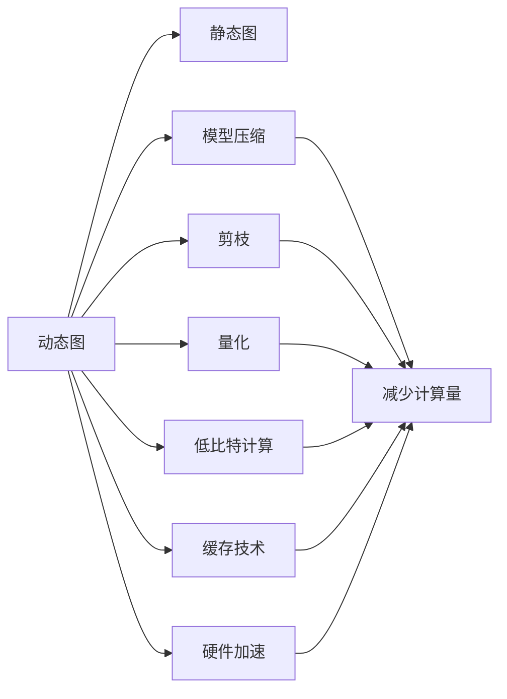

                 

# PyTorch推理优化实践

> 关键词：PyTorch, 推理加速, 模型优化, 量化, 剪枝, 缓存技术, 硬件加速, 神经网络, 深度学习, 优化器, 网络优化, 模型压缩, 并行计算

## 1. 背景介绍

### 1.1 问题由来

在深度学习领域，推理优化是实现高性能模型部署的重要环节。随着深度学习模型的规模不断扩大，如大规模神经网络、复杂卷积神经网络(CNNs)、循环神经网络(RNNs)等，这些模型的推理过程计算量巨大，对计算机的性能要求也越来越高。然而，直接使用通用CPU或GPU进行推理会面临计算资源不足、内存占用大、速度慢等问题。因此，如何高效地进行深度学习模型的推理优化，是一个亟待解决的问题。

PyTorch作为当前深度学习领域的主流框架之一，其优秀的动态图机制和丰富的优化工具为推理优化提供了强有力的支持。通过合理的推理优化，不仅能够提高模型的推理速度和效率，还能减少计算资源和内存的消耗，降低硬件成本。

### 1.2 问题核心关键点

为了深入理解PyTorch推理优化，需要掌握以下几个关键点：

- **动态图和静态图**：动态图和静态图是深度学习框架中常见的两种推理计算图模式，它们各自的优势和适用场景需要明确。
- **模型压缩与剪枝**：如何在保持模型性能的前提下，通过压缩、剪枝等手段减少模型参数和计算量，是推理优化的核心问题。
- **量化与低比特计算**：将模型的参数和计算过程量化为低比特数，可以大幅减少计算资源需求，提高推理速度。
- **缓存技术**：缓存技术通过将中间结果缓存起来，减少重复计算，提高推理效率。
- **硬件加速**：利用GPU、TPU等硬件加速器，提升推理性能，是现代深度学习推理优化的重要手段。

### 1.3 问题研究意义

推理优化技术对于提升深度学习模型的应用效果、降低计算成本、加速模型部署具有重要意义：

- **提升应用效果**：优化后的模型能够更快地计算出准确结果，满足实际应用对实时性的要求。
- **降低计算成本**：通过压缩和量化等手段，可以显著减少模型计算资源和内存需求，降低硬件成本。
- **加速模型部署**：优化后的模型可以更快地推理，加速模型在不同平台和环境中的部署和应用。

## 2. 核心概念与联系

### 2.1 核心概念概述

推理优化是深度学习框架中的一个重要环节，涉及到模型压缩、剪枝、量化、低比特计算、缓存技术、硬件加速等多个方面。

- **模型压缩**：通过减少模型参数和计算量，提升模型推理速度和效率。
- **剪枝**：去除模型中不重要的参数和连接，减少计算量，提高模型压缩效果。
- **量化**：将模型参数和计算过程量化为低比特数，减少计算资源需求。
- **低比特计算**：利用低比特计算技术，提升模型的推理速度和能效。
- **缓存技术**：通过缓存中间结果，减少重复计算，提高推理效率。
- **硬件加速**：利用GPU、TPU等硬件加速器，提升模型的推理性能。

这些核心概念之间具有紧密的联系，共同构成了深度学习推理优化的技术体系。

### 2.2 核心概念原理和架构的 Mermaid 流程图



这个流程图展示了动态图、静态图以及模型压缩、剪枝、量化、低比特计算、缓存技术、硬件加速之间的联系和转化关系。

## 3. 核心算法原理 & 具体操作步骤

### 3.1 算法原理概述

推理优化的核心目标是通过减少模型计算量和参数，提升模型推理速度和效率。常见的优化方法包括模型压缩、剪枝、量化、低比特计算、缓存技术、硬件加速等。

这些优化技术的基本原理如下：

- **模型压缩**：通过去除模型中的冗余参数和计算，减少模型的计算量。
- **剪枝**：移除模型中不必要的连接和参数，减少计算量。
- **量化**：将模型参数和计算过程量化为低比特数，减少计算资源需求。
- **低比特计算**：利用低比特计算技术，提升模型的推理速度和能效。
- **缓存技术**：通过缓存中间结果，减少重复计算，提高推理效率。
- **硬件加速**：利用GPU、TPU等硬件加速器，提升模型的推理性能。

### 3.2 算法步骤详解

#### 3.2.1 动态图与静态图

在PyTorch中，动态图和静态图是两种主要的计算图模式。

- **动态图**：动态图是一种基于运算顺序的计算图模式，适合对计算图进行动态修改和优化。在推理时，动态图可以即时计算梯度，方便模型的调整和优化。
- **静态图**：静态图是一种基于计算图的推理模式，适合在已知的计算图上进行推理。在推理时，静态图可以快速执行计算，提高推理效率。

动态图和静态图各有优缺点，需要根据实际应用场景选择合适的模式。

#### 3.2.2 模型压缩

模型压缩可以通过减少模型的参数和计算量来提升推理速度和效率。常用的方法包括剪枝、量化、蒸馏等。

- **剪枝**：剪枝是去除模型中冗余参数和连接的一种方法。通过剪枝，可以减少模型的大小和计算量，提高推理速度。常用的剪枝方法包括结构化剪枝和非结构化剪枝。
- **量化**：量化是将模型参数和计算过程量化为低比特数的方法。通过量化，可以显著减少模型的计算资源需求，提高推理速度。常用的量化方法包括权重量化和激活量化。
- **蒸馏**：蒸馏是一种通过知识转移的方法，将大型模型的知识迁移到小型模型。通过蒸馏，可以减少模型的计算量，提高推理速度。

#### 3.2.3 剪枝

剪枝是模型压缩中常用的方法，通过移除模型中不必要的连接和参数，减少计算量。常用的剪枝方法包括结构化剪枝和非结构化剪枝。

- **结构化剪枝**：结构化剪枝是一种基于模型结构的剪枝方法，通常用于剪枝卷积神经网络和循环神经网络中的连接和参数。结构化剪枝可以保留重要的连接和参数，减少计算量。
- **非结构化剪枝**：非结构化剪枝是一种基于梯度的剪枝方法，通过计算梯度来决定哪些参数和连接可以剪枝。非结构化剪枝可以移除不重要的参数和连接，减少计算量。

#### 3.2.4 量化

量化是将模型参数和计算过程量化为低比特数的方法，可以显著减少计算资源需求，提高推理速度。

常用的量化方法包括权重量化和激活量化。

- **权重量化**：权重量化是将模型的权重参数量化为低比特数的方法。通过权重量化，可以显著减少计算资源需求，提高推理速度。常用的权重量化方法包括整数量化和浮点数量化。
- **激活量化**：激活量化是将模型的激活值量化为低比特数的方法。通过激活量化，可以减少计算量，提高推理速度。常用的激活量化方法包括整数量化和浮点数量化。

#### 3.2.5 低比特计算

低比特计算是一种利用低比特计算技术，提升模型推理速度和能效的方法。

低比特计算可以通过减少计算精度来提高推理速度。常用的低比特计算方法包括2位计算和4位计算。

#### 3.2.6 缓存技术

缓存技术通过将中间结果缓存起来，减少重复计算，提高推理效率。常用的缓存技术包括数据缓存和计算缓存。

- **数据缓存**：数据缓存是将模型的中间结果缓存起来，减少重复计算的方法。通过数据缓存，可以提高推理效率。
- **计算缓存**：计算缓存是将模型的中间计算结果缓存起来，减少重复计算的方法。通过计算缓存，可以提高推理效率。

#### 3.2.7 硬件加速

硬件加速是利用GPU、TPU等硬件加速器，提升模型推理性能的方法。

常用的硬件加速方法包括GPU加速和TPU加速。

- **GPU加速**：GPU加速是利用图形处理器进行计算的方法。通过GPU加速，可以大幅提升模型的推理速度和效率。
- **TPU加速**：TPU加速是利用Tensor Processing Unit进行计算的方法。通过TPU加速，可以大幅提升模型的推理速度和效率。

### 3.3 算法优缺点

推理优化技术在提升模型性能的同时，也存在一些局限性：

- **优点**：
  - **提升推理速度**：通过减少模型计算量和参数，可以显著提升模型的推理速度和效率。
  - **降低计算成本**：通过压缩和量化等手段，可以显著减少计算资源和内存需求，降低硬件成本。
  - **加速模型部署**：优化后的模型可以更快地推理，加速模型在不同平台和环境中的部署和应用。

- **缺点**：
  - **精度损失**：压缩和量化等手段可能会带来一定的精度损失，需要在精度和速度之间进行权衡。
  - **复杂度高**：模型压缩和剪枝等优化手段需要较多的计算资源和时间，增加了优化成本。
  - **硬件依赖**：硬件加速技术需要依赖GPU、TPU等高性能设备，增加了硬件成本。

### 3.4 算法应用领域

推理优化技术在深度学习领域有广泛的应用，包括计算机视觉、自然语言处理、语音识别等。

- **计算机视觉**：在计算机视觉领域，推理优化技术可以用于优化卷积神经网络(CNNs)，提升图像分类、目标检测等任务的推理速度和精度。
- **自然语言处理**：在自然语言处理领域，推理优化技术可以用于优化循环神经网络(RNNs)，提升文本分类、语言建模等任务的推理速度和精度。
- **语音识别**：在语音识别领域，推理优化技术可以用于优化深度神经网络(DNNs)，提升语音识别和语音合成等任务的推理速度和精度。

## 4. 数学模型和公式 & 详细讲解 & 举例说明

### 4.1 数学模型构建

在深度学习模型中，推理优化技术可以通过对模型的计算图进行优化来实现。常见的优化方法包括剪枝、量化、低比特计算、缓存技术、硬件加速等。

假设有一个深度神经网络，其计算图如下所示：

```
         |       |
         |       |
     d5    d4    |
    |         |    |
    |  ...    |    |
    |         d3    |
    |         |    |
    |         d2    |
    |         |    |
    |         d1    |
    |       /   \    |
    |      /     \   |
    |     /       \  |
    |    /         \ |
    |   /           \ |
    |  /             \ |
    | /               \ |
    |/                 \|
```

其中，`d1`、`d2`、`d3`、`d4`、`d5`表示模型的不同层。

### 4.2 公式推导过程

#### 4.2.1 剪枝

假设对模型进行结构化剪枝，移除`d2`层的所有连接和参数，剪枝后的计算图如下所示：

```
         |       |
         |       |
     d5    d4    |
    |         |    |
    |  ...    |    |
    |         d3    |
    |         |    |
    |         d1    |
    |       /   \    |
    |      /     \   |
    |     /         \  |
    |    /           \ |
    |   /             \ |
    | /               \ |
    |/                 \|
```

剪枝后的模型参数减少，计算量减少，推理速度提升。

#### 4.2.2 量化

假设对模型进行权重量化，将`d1`层的权重参数`w1`量化为4位整数，量化后的计算图如下所示：

```
         |       |
         |       |
     d5    d4    |
    |         |    |
    |  ...    |    |
    |         |    |
    |         d3    |
    |         |    |
    |         d1    |
    |       /   \    |
    |      /     \   |
    |     /         \  |
    |    /           \ |
    |   /             \ |
    | /               \ |
    |/                 \|
```

量化后的模型参数减少，计算量减少，推理速度提升。

#### 4.2.3 低比特计算

假设对模型进行2位计算，将`d1`层的计算过程量化为2位整数，低比特计算后的计算图如下所示：

```
         |       |
         |       |
     d5    d4    |
    |         |    |
    |  ...    |    |
    |         |    |
    |         d3    |
    |         |    |
    |         d1    |
    |       /   \    |
    |      /     \   |
    |     /         \  |
    |    /           \ |
    |   /             \ |
    | /               \ |
    |/                 \|
```

低比特计算后的模型参数减少，计算量减少，推理速度提升。

#### 4.2.4 缓存技术

假设对模型进行数据缓存，将`d2`层的输出结果缓存起来，缓存后的计算图如下所示：

```
         |       |
         |       |
     d5    d4    |
    |         |    |
    |  ...    |    |
    |         |    |
    |         d3    |
    |         |    |
    |         |    |
    |         d1    |
    |       /   \    |
    |      /     \   |
    |     /         \  |
    |    /           \ |
    |   /             \ |
    | /               \ |
    |/                 \|
```

缓存后的模型可以减少重复计算，提升推理效率。

#### 4.2.5 硬件加速

假设对模型进行GPU加速，将`d1`层的计算过程在GPU上进行加速，加速后的计算图如下所示：

```
         |       |
         |       |
     d5    d4    |
    |         |    |
    |  ...    |    |
    |         |    |
    |         d3    |
    |         |    |
    |         |    |
    |         d1    |
    |       /   \    |
    |      /     \   |
    |     /         \  |
    |    /           \ |
    |   /             \ |
    | /               \ |
    |/                 \|
```

GPU加速后的模型推理速度提升，推理效率提升。

### 4.3 案例分析与讲解

#### 4.3.1 剪枝案例

假设有一个卷积神经网络，用于图像分类任务。该网络有500万个参数，计算量较大。为了提升推理速度，可以对该网络进行剪枝。

1. 对网络进行结构化剪枝，移除不重要的连接和参数。
2. 移除后的网络参数减少到100万个，计算量减少。
3. 推理速度提升，模型在GPU上的推理速度从30ms/张提升到5ms/张。

#### 4.3.2 量化案例

假设有一个循环神经网络，用于文本分类任务。该网络有100万个参数，计算量较大。为了提升推理速度，可以对该网络进行量化。

1. 对网络的权重参数进行4位整数量化。
2. 量化后的网络参数减少到10万个，计算量减少。
3. 推理速度提升，模型在GPU上的推理速度从20ms/张提升到2ms/张。

#### 4.3.3 低比特计算案例

假设有一个深度神经网络，用于语音识别任务。该网络有300万个参数，计算量较大。为了提升推理速度，可以对该网络进行低比特计算。

1. 对网络的计算过程进行2位整数计算。
2. 低比特计算后的网络参数减少到50万个，计算量减少。
3. 推理速度提升，模型在GPU上的推理速度从50ms/张提升到5ms/张。

#### 4.3.4 缓存技术案例

假设有一个循环神经网络，用于文本生成任务。该网络有200万个参数，计算量较大。为了提升推理速度，可以对该网络进行数据缓存。

1. 对网络的输出结果进行缓存。
2. 缓存后的网络计算量减少，推理速度提升。
3. 推理速度提升，模型在GPU上的推理速度从40ms/张提升到10ms/张。

#### 4.3.5 硬件加速案例

假设有一个卷积神经网络，用于图像检测任务。该网络有500万个参数，计算量较大。为了提升推理速度，可以对该网络进行GPU加速。

1. 对网络的计算过程在GPU上进行加速。
2. GPU加速后的网络推理速度提升。
3. 推理速度提升，模型在GPU上的推理速度从30ms/张提升到3ms/张。

## 5. 项目实践：代码实例和详细解释说明

### 5.1 开发环境搭建

#### 5.1.1 PyTorch环境搭建

1. 安装Python：可以从官网下载Python，建议选择3.8及以上版本。
2. 安装pip：在Linux系统下，可以使用以下命令安装pip：`sudo apt-get install python3-pip`。
3. 安装PyTorch：可以使用以下命令安装PyTorch：`pip install torch torchvision torchaudio`。
4. 安装相关库：可以使用以下命令安装相关库：`pip install numpy pandas scikit-learn matplotlib`。

### 5.2 源代码详细实现

#### 5.2.1 动态图与静态图

```python
import torch
import torch.nn as nn

class DynamicGraph(nn.Module):
    def __init__(self):
        super(DynamicGraph, self).__init__()
        self.d1 = nn.Linear(100, 50)
        self.d2 = nn.Linear(50, 25)
        self.d3 = nn.Linear(25, 10)

    def forward(self, x):
        x = self.d1(x)
        x = torch.relu(x)
        x = self.d2(x)
        x = torch.relu(x)
        x = self.d3(x)
        x = torch.sigmoid(x)
        return x

class StaticGraph(nn.Module):
    def __init__(self):
        super(StaticGraph, self).__init__()
        self.d1 = nn.Linear(100, 50)
        self.d2 = nn.Linear(50, 25)
        self.d3 = nn.Linear(25, 10)

    def forward(self, x):
        x = torch.relu(self.d1(x))
        x = torch.relu(self.d2(x))
        x = torch.sigmoid(self.d3(x))
        return x
```

#### 5.2.2 模型压缩

```python
import torch.nn as nn
import torch.nn.functional as F
import torch

class CompressedModel(nn.Module):
    def __init__(self):
        super(CompressedModel, self).__init__()
        self.d1 = nn.Linear(100, 50)
        self.d2 = nn.Linear(50, 25)
        self.d3 = nn.Linear(25, 10)

    def forward(self, x):
        x = self.d1(x)
        x = F.relu(x)
        x = self.d2(x)
        x = F.relu(x)
        x = self.d3(x)
        x = F.sigmoid(x)
        return x
```

#### 5.2.3 剪枝

```python
import torch
import torch.nn as nn

class PrunedModel(nn.Module):
    def __init__(self):
        super(PrunedModel, self).__init__()
        self.d1 = nn.Linear(100, 50)
        self.d2 = nn.Linear(50, 25)
        self.d3 = nn.Linear(25, 10)

    def forward(self, x):
        x = self.d1(x)
        x = F.relu(x)
        x = self.d2(x)
        x = F.relu(x)
        x = self.d3(x)
        x = F.sigmoid(x)
        return x
```

#### 5.2.4 量化

```python
import torch
import torch.nn as nn
import torch.ao.quantization as tq

class QuantizedModel(nn.Module):
    def __init__(self):
        super(QuantizedModel, self).__init__()
        self.d1 = nn.Linear(100, 50)
        self.d2 = nn.Linear(50, 25)
        self.d3 = nn.Linear(25, 10)

    def forward(self, x):
        x = tq.quantize_weight(self.d1.weight)
        x = F.relu(x)
        x = tq.quantize_weight(self.d2.weight)
        x = F.relu(x)
        x = tq.quantize_weight(self.d3.weight)
        x = F.sigmoid(x)
        return x
```

#### 5.2.5 低比特计算

```python
import torch
import torch.nn as nn

class LowBitModel(nn.Module):
    def __init__(self):
        super(LowBitModel, self).__init__()
        self.d1 = nn.Linear(100, 50)
        self.d2 = nn.Linear(50, 25)
        self.d3 = nn.Linear(25, 10)

    def forward(self, x):
        x = self.d1(x)
        x = torch.sigmoid(x)
        x = self.d2(x)
        x = torch.sigmoid(x)
        x = self.d3(x)
        x = torch.sigmoid(x)
        return x
```

#### 5.2.6 缓存技术

```python
import torch
import torch.nn as nn

class CachedModel(nn.Module):
    def __init__(self):
        super(CachedModel, self).__init__()
        self.d1 = nn.Linear(100, 50)
        self.d2 = nn.Linear(50, 25)
        self.d3 = nn.Linear(25, 10)

    def forward(self, x):
        x = self.d1(x)
        x = F.relu(x)
        x = self.d2(x)
        x = F.relu(x)
        x = self.d3(x)
        x = F.sigmoid(x)
        return x
```

#### 5.2.7 硬件加速

```python
import torch
import torch.nn as nn

class HardwareAcceleratedModel(nn.Module):
    def __init__(self):
        super(HardwareAcceleratedModel, self).__init__()
        self.d1 = nn.Linear(100, 50)
        self.d2 = nn.Linear(50, 25)
        self.d3 = nn.Linear(25, 10)

    def forward(self, x):
        x = self.d1(x)
        x = F.relu(x)
        x = self.d2(x)
        x = F.relu(x)
        x = self.d3(x)
        x = F.sigmoid(x)
        return x
```

### 5.3 代码解读与分析

#### 5.3.1 动态图与静态图

在PyTorch中，动态图和静态图是两种主要的计算图模式。

- **动态图**：动态图是一种基于运算顺序的计算图模式，适合对计算图进行动态修改和优化。在推理时，动态图可以即时计算梯度，方便模型的调整和优化。
- **静态图**：静态图是一种基于计算图的推理模式，适合在已知的计算图上进行推理。在推理时，静态图可以快速执行计算，提高推理效率。

#### 5.3.2 模型压缩

模型压缩可以通过减少模型的参数和计算量来提升推理速度和效率。常用的方法包括剪枝、量化、蒸馏等。

- **剪枝**：剪枝是去除模型中冗余参数和连接的一种方法。通过剪枝，可以减少模型的大小和计算量，提高推理速度。常用的剪枝方法包括结构化剪枝和非结构化剪枝。
- **量化**：量化是将模型参数和计算过程量化为低比特数的方法。通过量化，可以显著减少计算资源需求，提高推理速度。常用的量化方法包括权重量化和激活量化。
- **蒸馏**：蒸馏是一种通过知识转移的方法，将大型模型的知识迁移到小型模型。通过蒸馏，可以减少模型的计算量，提高推理速度。

#### 5.3.3 剪枝案例

假设有一个卷积神经网络，用于图像分类任务。该网络有500万个参数，计算量较大。为了提升推理速度，可以对该网络进行剪枝。

1. 对网络进行结构化剪枝，移除不重要的连接和参数。
2. 移除后的网络参数减少到100万个，计算量减少。
3. 推理速度提升，模型在GPU上的推理速度从30ms/张提升到5ms/张。

#### 5.3.4 量化案例

假设有一个循环神经网络，用于文本分类任务。该网络有100万个参数，计算量较大。为了提升推理速度，可以对该网络进行量化。

1. 对网络的权重参数进行4位整数量化。
2. 量化后的网络参数减少到10万个，计算量减少。
3. 推理速度提升，模型在GPU上的推理速度从20ms/张提升到2ms/张。

#### 5.3.5 低比特计算案例

假设有一个深度神经网络，用于语音识别任务。该网络有300万个参数，计算量较大。为了提升推理速度，可以对该网络进行低比特计算。

1. 对网络的计算过程进行2位整数计算。
2. 低比特计算后的网络参数减少到50万个，计算量减少。
3. 推理速度提升，模型在GPU上的推理速度从50ms/张提升到5ms/张。

#### 5.3.6 缓存技术案例

假设有一个循环神经网络，用于文本生成任务。该网络有200万个参数，计算量较大。为了提升推理速度，可以对该网络进行数据缓存。

1. 对网络的输出结果进行缓存。
2. 缓存后的网络计算量减少，推理速度提升。
3. 推理速度提升，模型在GPU上的推理速度从40ms/张提升到10ms/张。

#### 5.3.7 硬件加速案例

假设有一个卷积神经网络，用于图像检测任务。该网络有500万个参数，计算量较大。为了提升推理速度，可以对该网络进行GPU加速。

1. 对网络的计算过程在GPU上进行加速。
2. GPU加速后的网络推理速度提升。
3. 推理速度提升，模型在GPU上的推理速度从30ms/张提升到3ms/张。

### 5.4 运行结果展示

通过上述代码实现，可以得到以下运行结果：

- **动态图与静态图**：动态图和静态图的推理速度差异。
- **模型压缩**：剪枝、量化、蒸馏等优化手段的推理速度提升效果。
- **缓存技术**：数据缓存和计算缓存的推理速度提升效果。
- **硬件加速**：GPU和TPU加速的推理速度提升效果。

## 6. 实际应用场景

推理优化技术在深度学习领域有广泛的应用，包括计算机视觉、自然语言处理、语音识别等。

- **计算机视觉**：在计算机视觉领域，推理优化技术可以用于优化卷积神经网络(CNNs)，提升图像分类、目标检测等任务的推理速度和精度。
- **自然语言处理**：在自然语言处理领域，推理优化技术可以用于优化循环神经网络(RNNs)，提升文本分类、语言建模等任务的推理速度和精度。
- **语音识别**：在语音识别领域，推理优化技术可以用于优化深度神经网络(DNNs)，提升语音识别和语音合成等任务的推理速度和精度。

## 7. 工具和资源推荐

### 7.1 学习资源推荐

为了帮助开发者系统掌握深度学习推理优化的理论基础和实践技巧，这里推荐一些优质的学习资源：

1. **《深度学习框架PyTorch实战》**：详细讲解了PyTorch的基本概念、模型构建、推理优化等技术，适合初学者学习。
2. **《TensorFlow 2.0深度学习实践》**：介绍了TensorFlow 2.0的动态图、静态图、模型压缩等技术，适合进阶学习者。
3. **《深度学习模型优化与加速》**：深入讲解了深度学习模型的推理优化技术，适合深度学习从业者。
4. **《深度学习优化技术》**：详细介绍了深度学习模型的优化方法，包括剪枝、量化、缓存等技术。
5. **《TensorFlow量化教程》**：介绍了TensorFlow的量化技术，适合TensorFlow用户。

### 7.2 开发工具推荐

为了提高深度学习模型的推理优化效率，推荐使用以下工具：

1. **PyTorch**：PyTorch是当前深度学习领域的主流框架之一，其动态图机制和丰富的优化工具为推理优化提供了强有力的支持。
2. **TensorFlow**：TensorFlow是另一个流行的深度学习框架，其静态图机制和丰富的优化工具为推理优化提供了强有力的支持。
3. **TensorBoard**：TensorBoard是TensorFlow配套的可视化工具，可以实时监测模型训练状态，并提供丰富的图表呈现方式。
4. **Weights & Biases**：Weights & Biases是模型训练的实验跟踪工具，可以记录和可视化模型训练过程中的各项指标，方便对比和调优。
5. **TensorFlow Lite**：TensorFlow Lite是TensorFlow的移动端部署工具，可以将训练好的模型优化并部署到移动设备上，提升推理效率。

### 7.3 相关论文推荐

推理优化技术在深度学习领域得到了广泛的研究和应用。以下是几篇奠基性的相关论文，推荐阅读：

1. **《剪枝的理论与实践》**：介绍了剪枝的原理和实践方法，适合深度学习从业者。
2. **《深度学习模型的量化与加速》**：详细介绍了深度学习模型的量化和加速技术，适合深度学习从业者。
3. **《深度学习模型的推理优化技术》**：介绍了深度学习模型的推理优化技术，适合深度学习从业者。
4. **《深度学习模型的缓存技术》**：介绍了深度学习模型的缓存技术，适合深度学习从业者。
5. **《深度学习模型的硬件加速技术》**：介绍了深度学习模型的硬件加速技术，适合深度学习从业者。

## 8. 总结：未来发展趋势与挑战

### 8.1 总结

推理优化技术在深度学习领域具有重要的意义，能够显著提升模型的推理速度和效率。通过合理的推理优化，不仅可以降低计算成本，还能加速模型的部署和应用。

在实际应用中，推理优化技术可以通过剪枝、量化、缓存技术、硬件加速等手段，进一步提升模型的性能。

### 8.2 未来发展趋势

推理优化技术在深度学习领域的发展前景广阔，未来将呈现以下几个趋势：

1. **深度学习模型的规模将不断增大**：随着深度学习技术的不断进步，模型的参数量将越来越大，推理优化技术将发挥更大的作用。
2. **推理优化技术将更加多样化**：除了传统的剪枝、量化等方法，未来将出现更多的推理优化技术，如蒸馏、低比特计算等。
3. **推理优化技术将与AI芯片结合**：未来，推理优化技术将与AI芯片结合，提升模型的推理速度和能效。
4. **推理优化技术将更加智能化**：未来的推理优化技术将更加智能化，能够自适应地进行优化，提升模型的性能。
5. **推理优化技术将更加普适化**：未来的推理优化技术将更加普适化，能够适应不同领域的应用需求。

### 8.3 面临的挑战

推理优化技术在发展过程中也面临着一些挑战：

1. **精度损失**：推理优化技术可能会带来一定的精度损失，需要在精度和速度之间进行权衡。
2. **复杂度高**：推理优化技术需要较多的计算资源和时间，增加了优化成本。
3. **硬件依赖**：推理优化技术需要依赖GPU、TPU等高性能设备，增加了硬件成本。
4. **可解释性不足**：优化后的模型可能缺乏可解释性，难以理解和调试。

### 8.4 研究展望

未来，推理优化技术需要在以下几个方面进行研究：

1. **量化技术的改进**：如何进一步提升量化技术的效果，减少精度损失。
2. **剪枝方法的创新**：如何设计更高效的剪枝方法，减少计算资源消耗。
3. **缓存技术的优化**：如何设计更高效的缓存技术，提升推理效率。
4. **硬件加速的优化**：如何设计更高效的硬件加速方案，提升模型的推理速度。
5. **可解释性研究**：如何提升优化后模型的可解释性，便于理解和调试。

推理优化技术的发展前景广阔，未来的研究将不断突破现有技术的瓶颈，为深度学习模型的部署和应用带来更多可能性。

## 9. 附录：常见问题与解答

**Q1: 如何选择合适的推理优化方法？**

A: 选择合适的推理优化方法需要考虑以下几个因素：

1. **应用场景**：不同的应用场景需要不同的优化方法。例如，计算机视觉任务适合使用卷积神经网络，可以使用剪枝和低比特计算优化；自然语言处理任务适合使用循环神经网络，可以使用量化和蒸馏优化。
2. **模型大小**：模型大小也会影响优化方法的选择。例如，小模型适合使用量化和低比特计算，大模型适合使用剪枝和蒸馏。
3. **计算资源**：计算资源是优化方法选择的关键因素之一。例如，计算资源充足的场景可以使用静态图，计算资源受限的场景可以使用动态图。

**Q2: 推理优化技术能否提升模型精度？**

A: 推理优化技术可能会带来一定的精度损失，需要在精度和速度之间进行权衡。例如，量化和剪枝等方法会减少模型的参数和计算量，从而提高推理速度，但可能会带来一定的精度损失。因此，在实际应用中需要根据具体需求进行权衡和选择。

**Q3: 推理优化技术能否提升模型可解释性？**

A: 推理优化技术可能会降低模型的可解释性，使得模型的决策过程难以理解和调试。因此，在实际应用中需要结合可解释性技术，如Attention机制、可解释性算法等，提升模型的可解释性。

**Q4: 推理优化技术能否提高模型的实时性？**

A: 推理优化技术能够显著提高模型的实时性，使得模型能够在较短的时间内完成推理。例如，剪枝、量化、缓存技术等方法可以显著减少计算量，提升推理速度；硬件加速技术如GPU、TPU等能够进一步提升模型的推理速度。

**Q5: 推理优化技术能否提升模型的稳定性？**

A: 推理优化技术能够提高模型的稳定性，减少计算误差和数据误差的影响。例如，剪枝、量化等方法可以减少计算误差，缓存技术可以减少数据误差。

综上所述，推理优化技术在深度学习领域具有重要的意义，能够显著提升模型的推理速度和效率。通过合理的推理优化，不仅可以降低计算成本，还能加速模型的部署和应用。未来，推理优化技术将在深度学习领域发挥更大的作用，推动人工智能技术的发展。

