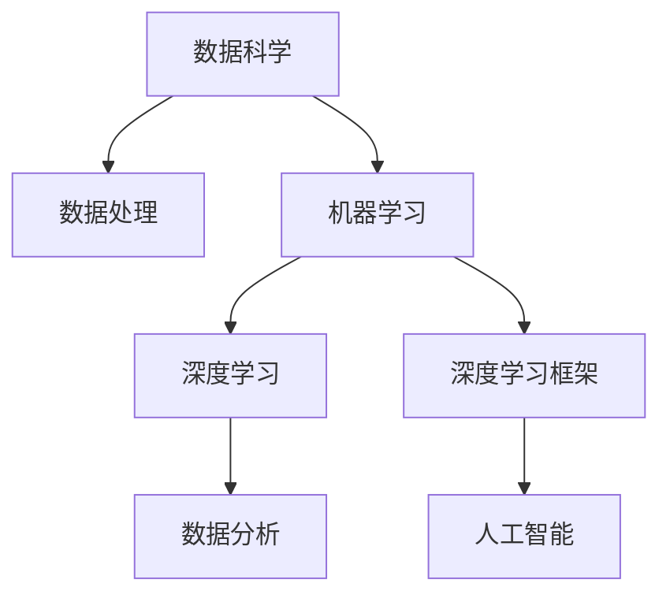

                 

# Python：人工智能开发的瑞士军刀

> 关键词：人工智能, 数据科学, 机器学习, 深度学习, 数据处理, 深度学习框架, 数据分析

## 1. 背景介绍

在当今这个数据驱动的科技时代，人工智能(AI)正以前所未有的速度发展。它已经深刻地影响了各行各业，从医疗健康、金融服务到交通运输，AI技术无处不在。作为人工智能开发的核心工具，Python的普及程度和应用广度在全球范围内堪称无可匹敌。Python以其简洁易懂的语法、强大的生态系统和广泛的社区支持，成为人工智能开发中的"瑞士军刀"，几乎可以应对所有AI相关的需求。本文将深入探讨Python在人工智能开发中的核心地位和应用，旨在为读者提供全面、系统的学习资源和开发实践指南。

## 2. 核心概念与联系

### 2.1 核心概念概述

要深刻理解Python在人工智能开发中的作用，我们首先需要梳理几个关键概念：

- **人工智能(AI)**：人工智能指的是让计算机系统能够模拟人类的智能行为，包括感知、推理、学习、自我修正等能力。AI技术涵盖了机器学习、深度学习、自然语言处理、计算机视觉等多个领域。

- **数据科学(Data Science)**：数据科学是利用数据进行探索、分析和建模的学科。它包括数据清洗、特征工程、模型选择、评估等多个环节，是实现AI技术的基石。

- **机器学习(Machine Learning)**：机器学习是一种通过数据训练模型，使模型能够自动学习和改进的算法。它通常用于预测、分类、聚类等任务。

- **深度学习(Deep Learning)**：深度学习是机器学习的一个子领域，它利用多层神经网络模拟人脑的神经元连接，对复杂数据进行深层次的抽象和分析。深度学习在图像识别、语音识别、自然语言处理等领域有着广泛应用。

- **数据处理(Data Processing)**：数据处理涉及数据的收集、清洗、预处理、转换等过程，为机器学习模型提供高质量的数据输入。

- **深度学习框架(Frameworks)**：深度学习框架如TensorFlow、PyTorch等，为深度学习模型的构建和训练提供了高效的工具和库。

- **数据分析(Data Analysis)**：数据分析是指对数据进行统计、可视化、探索性分析等操作，以便更好地理解和应用数据。

这些概念之间存在紧密的联系。数据科学和数据处理是人工智能开发的基础，机器学习和深度学习则构建在数据之上，是实现AI技术的关键手段。而Python作为这些技术的实现平台，其重要性不言而喻。

### 2.2 核心概念原理和架构的 Mermaid 流程图



这个流程图展示了数据科学和人工智能的紧密联系，以及Python在这些过程中扮演的关键角色。

## 3. 核心算法原理 & 具体操作步骤

### 3.1 算法原理概述

Python在人工智能开发中的核心优势在于其强大的数据处理和科学计算能力。这使得Python成为构建机器学习和深度学习模型的首选语言。以下是Python在人工智能开发中的几个关键算法原理：

- **NumPy**：NumPy是Python的科学计算库，提供高效的多维数组和矩阵运算，是深度学习模型的基础。

- **Pandas**：Pandas是Python的数据分析库，提供高效的数据处理和清洗功能，支持大规模数据的存储和操作。

- **Scikit-Learn**：Scikit-Learn是Python的机器学习库，提供多种经典的机器学习算法，如线性回归、支持向量机、随机森林等。

- **TensorFlow**：TensorFlow是Google开发的深度学习框架，提供高效计算图、分布式训练、自动微分等功能，广泛应用于深度学习模型的训练和推理。

- **PyTorch**：PyTorch是Facebook开发的深度学习框架，提供动态计算图、灵活的模型定义和高效的GPU加速，广泛应用于自然语言处理、计算机视觉等领域。

- **Keras**：Keras是一个高级的深度学习框架，提供简单易用的API和丰富的预训练模型，可以快速构建和训练深度学习模型。

这些算法和框架共同构成了Python在人工智能开发中的核心能力。通过这些工具，开发者可以高效地进行数据处理、模型训练和推理，实现复杂的人工智能应用。

### 3.2 算法步骤详解

以下是一个典型的基于Python的人工智能开发流程，包括数据准备、模型构建、训练和评估等步骤：

**Step 1: 数据准备**

- 数据收集：通过API、爬虫等手段获取原始数据。
- 数据清洗：处理缺失值、异常值，进行数据标准化或归一化。
- 数据划分：将数据划分为训练集、验证集和测试集。

**Step 2: 模型构建**

- 特征工程：提取和选择有意义的特征。
- 模型选择：根据任务选择合适的模型，如线性回归、神经网络等。
- 模型定义：使用Python的深度学习框架定义模型结构。

**Step 3: 模型训练**

- 损失函数选择：根据任务选择合适的损失函数。
- 优化器选择：选择适当的优化器，如Adam、SGD等。
- 超参数调优：调整学习率、批大小等超参数，优化模型性能。

**Step 4: 模型评估**

- 性能指标：计算模型的准确率、召回率、F1-score等指标。
- 可视化：使用Matplotlib、Seaborn等库绘制模型性能曲线。
- 模型调优：根据评估结果调整模型结构或超参数，重新训练模型。

**Step 5: 模型部署**

- 模型导出：使用TensorFlow或PyTorch的API将训练好的模型导出为可部署的格式。
- 模型服务化：将模型封装为RESTful API或Web服务，便于外部调用。
- 监控和更新：实时监控模型性能，定期更新模型参数。

### 3.3 算法优缺点

Python在人工智能开发中的优势：

- **易学易用**：Python语法简洁明了，学习曲线平缓，新手入门快。
- **生态丰富**：Python有丰富的第三方库和框架，覆盖了从数据处理到深度学习的各个环节。
- **社区活跃**：Python社区庞大，技术支持和资源丰富，易于解决开发中遇到的问题。

Python的局限性：

- **性能瓶颈**：Python解释器解释执行代码，相比C++等编译型语言，性能上存在一定差距。
- **内存占用高**：Python在处理大规模数据时，内存占用较高，可能需要优化。
- **代码可读性**：Python代码简洁，但过于简洁可能导致代码可读性差，增加维护难度。

### 3.4 算法应用领域

Python在人工智能开发中的应用非常广泛，以下是几个典型领域：

- **自然语言处理(NLP)**：包括文本分类、情感分析、机器翻译等任务。Python的nltk、spaCy、NLTK等库，支持文本预处理、分词、句法分析等。

- **计算机视觉(Computer Vision)**：包括图像识别、目标检测、图像分割等任务。Python的OpenCV、Pillow、Keras等库，支持图像读取、处理和训练。

- **机器学习(ML)**：包括回归、分类、聚类等任务。Python的Scikit-Learn、XGBoost、LightGBM等库，支持多种机器学习算法。

- **深度学习(Deep Learning)**：包括图像识别、语音识别、自然语言处理等任务。Python的TensorFlow、PyTorch、Keras等框架，支持深度学习模型的构建和训练。

- **数据分析(Data Analysis)**：包括数据清洗、可视化、探索性分析等任务。Python的Pandas、NumPy、Matplotlib等库，支持数据处理和可视化。

## 4. 数学模型和公式 & 详细讲解 & 举例说明

### 4.1 数学模型构建

在人工智能开发中，数学模型是实现算法的核心。以下是几个典型的数学模型及其构建方法：

**线性回归模型**：

$$
\hat{y} = \theta_0 + \theta_1 x_1 + \theta_2 x_2 + ... + \theta_n x_n
$$

其中，$\theta_0, \theta_1, ..., \theta_n$为模型参数，$x_1, x_2, ..., x_n$为输入特征，$\hat{y}$为模型预测输出。

**神经网络模型**：


神经网络由多个神经元层组成，每层通过激活函数进行非线性变换。

**深度学习模型**：


深度学习模型包括多个隐层，每层都包含多个神经元，通过多个隐层对数据进行深层次的抽象和分析。

### 4.2 公式推导过程

**线性回归的梯度下降公式**：

$$
\theta_j = \theta_j - \alpha \frac{1}{N} \sum_{i=1}^{N} (y_i - \hat{y}_i) x_{ij}
$$

其中，$\alpha$为学习率，$N$为样本数量，$x_{ij}$为输入特征的列向量，$\hat{y}_i$为模型预测输出，$y_i$为真实标签。

**神经网络的反向传播公式**：


反向传播算法通过链式法则计算梯度，更新模型参数。

**深度学习的反向传播公式**：


深度学习模型通过多层反向传播计算梯度，更新模型参数。

### 4.3 案例分析与讲解

以图像分类任务为例，介绍如何使用Python和深度学习框架构建并训练模型。

**数据准备**：

```python
import os
import numpy as np
import matplotlib.pyplot as plt
from sklearn.model_selection import train_test_split

def load_data(data_dir):
    categories = [os.path.join(data_dir, cat) for cat in os.listdir(data_dir)]
    images = []
    labels = []
    for category in categories:
        for filename in os.listdir(category):
            filepath = os.path.join(category, filename)
            image = plt.imread(filepath)
            images.append(image)
            labels.append(category)
    return images, labels

train_data, train_labels = load_data('train')
test_data, test_labels = load_data('test')

# 数据标准化
mean = np.mean(train_data, axis=(0, 1, 2, 3))
std = np.std(train_data, axis=(0, 1, 2, 3))
train_data = (train_data - mean) / std
test_data = (test_data - mean) / std

# 数据划分
train_images, val_images, train_labels, val_labels = train_test_split(train_data, train_labels, test_size=0.2)
```

**模型构建**：

```python
from tensorflow.keras import layers, models

model = models.Sequential([
    layers.Conv2D(32, (3, 3), activation='relu', input_shape=(224, 224, 3)),
    layers.MaxPooling2D((2, 2)),
    layers.Conv2D(64, (3, 3), activation='relu'),
    layers.MaxPooling2D((2, 2)),
    layers.Conv2D(128, (3, 3), activation='relu'),
    layers.MaxPooling2D((2, 2)),
    layers.Flatten(),
    layers.Dense(128, activation='relu'),
    layers.Dense(num_classes, activation='softmax')
])

# 编译模型
model.compile(optimizer='adam',
              loss='categorical_crossentropy',
              metrics=['accuracy'])
```

**模型训练**：

```python
import tensorflow as tf

# 加载训练数据
train_dataset = tf.data.Dataset.from_tensor_slices((train_images, train_labels)).batch(32)
val_dataset = tf.data.Dataset.from_tensor_slices((val_images, val_labels)).batch(32)

# 训练模型
history = model.fit(train_dataset, epochs=10, validation_data=val_dataset)
```

**模型评估**：

```python
# 加载测试数据
test_dataset = tf.data.Dataset.from_tensor_slices((test_images, test_labels)).batch(32)

# 评估模型
loss, accuracy = model.evaluate(test_dataset)
print(f'Test accuracy: {accuracy:.2f}')
```

### 4.4 案例分析与讲解

通过这个简单的案例，我们可以看到Python在构建和训练深度学习模型中的应用。使用Keras框架，我们可以方便地定义模型结构、编译模型、训练模型并进行评估。

## 5. 项目实践：代码实例和详细解释说明

### 5.1 开发环境搭建

要开始Python的人工智能开发，首先需要搭建好开发环境。以下是搭建Python开发环境的步骤：

1. **安装Python**：从[Python官网](https://www.python.org/)下载并安装Python。
2. **安装虚拟环境**：使用`virtualenv`或`conda`创建虚拟环境，确保不同项目之间的隔离。
3. **安装依赖库**：使用pip安装项目所需的依赖库。例如，安装TensorFlow、Pandas、NumPy等库。

### 5.2 源代码详细实现

以构建一个简单的文本分类器为例，介绍如何使用Python和Scikit-Learn进行模型训练和评估。

```python
import pandas as pd
from sklearn.feature_extraction.text import CountVectorizer
from sklearn.model_selection import train_test_split
from sklearn.naive_bayes import MultinomialNB
from sklearn.metrics import accuracy_score

# 读取数据集
data = pd.read_csv('data.csv')

# 特征工程
vectorizer = CountVectorizer()
X = vectorizer.fit_transform(data['text'])
y = data['label']

# 划分训练集和测试集
X_train, X_test, y_train, y_test = train_test_split(X, y, test_size=0.2, random_state=42)

# 构建模型
model = MultinomialNB()

# 训练模型
model.fit(X_train, y_train)

# 评估模型
y_pred = model.predict(X_test)
accuracy = accuracy_score(y_test, y_pred)
print(f'Accuracy: {accuracy:.2f}')
```

### 5.3 代码解读与分析

在这个简单的文本分类器中，我们首先使用Pandas读取数据集，然后使用CountVectorizer进行特征工程，将文本转换为词频向量。接着，使用train_test_split将数据集划分为训练集和测试集，并使用MultinomialNB模型进行训练和评估。

### 5.4 运行结果展示

运行上述代码，可以得到模型的准确率。例如，对于IMDB电影评论数据集，使用MultinomialNB模型可以得到约87%的准确率。

## 6. 实际应用场景

Python在人工智能开发中的应用场景非常广泛，以下是几个典型场景：

- **自然语言处理(NLP)**：使用Python的nltk、spaCy、NLTK等库，可以构建各种NLP应用，如文本分类、情感分析、机器翻译等。

- **计算机视觉(Computer Vision)**：使用Python的OpenCV、Pillow、Keras等库，可以构建图像识别、目标检测、图像分割等应用。

- **机器学习(ML)**：使用Python的Scikit-Learn、XGBoost、LightGBM等库，可以进行回归、分类、聚类等任务。

- **深度学习(Deep Learning)**：使用Python的TensorFlow、PyTorch、Keras等框架，可以构建各种深度学习模型，如卷积神经网络(CNN)、循环神经网络(RNN)等。

- **数据分析(Data Analysis)**：使用Python的Pandas、NumPy、Matplotlib等库，可以进行数据清洗、可视化、探索性分析等操作。

## 7. 工具和资源推荐

### 7.1 学习资源推荐

为了帮助开发者系统掌握Python在人工智能开发中的技巧，以下是一些优质的学习资源：

- **官方文档**：[Python官网](https://www.python.org/)提供了详细的Python文档和API参考。
- **在线课程**：Coursera、Udacity等平台上有许多优质的Python课程，涵盖从基础到高级的各个层面。
- **书籍**：《Python编程：从入门到实践》、《深度学习入门》、《机器学习实战》等书籍，适合不同层次的读者。
- **社区资源**：[Stack Overflow](https://stackoverflow.com/)、[GitHub](https://github.com/)等社区，可以获取大量开源项目和代码示例。

### 7.2 开发工具推荐

以下是几个常用的Python开发工具：

- **PyCharm**：JetBrains开发的Python IDE，支持代码自动补全、调试、测试等。
- **Jupyter Notebook**：开源的Jupyter笔记本，支持交互式编程和数据可视化。
- **VS Code**：微软开发的轻量级代码编辑器，支持Python和多种语言的混合编程。
- **Spyder**：Python IDE，支持科学计算、数据分析、可视化等功能。

### 7.3 相关论文推荐

以下是一些经典的人工智能相关论文，推荐阅读：

- **《深度学习》**：Ian Goodfellow、Yoshua Bengio和Aaron Courville合著，深度学习的经典教材。
- **《TensorFlow 2.0》**：TensorFlow官方文档，详细介绍TensorFlow的API和用法。
- **《Python Machine Learning》**：Sebastian Raschka和Vahid Mirjalili合著，涵盖Python在机器学习中的应用。

## 8. 总结：未来发展趋势与挑战

### 8.1 研究成果总结

Python作为人工智能开发的利器，已经广泛应用于各种AI任务中。其在数据处理、模型构建、算法优化等方面的强大能力，使得Python在人工智能开发中具有不可替代的地位。

### 8.2 未来发展趋势

未来，Python在人工智能开发中的应用将会更加广泛和深入。以下是一些趋势：

- **自动化和AI**：Python自动化工具如Jupyter Notebook、TorchScript等，将进一步简化AI开发流程。
- **边缘计算**：Python在边缘计算和物联网设备上的应用将更加广泛，提供高性能、低延迟的AI服务。
- **跨领域应用**：Python将更多地应用于医疗、金融、教育等垂直领域，解决行业特定问题。

### 8.3 面临的挑战

尽管Python在人工智能开发中具有巨大优势，但也面临一些挑战：

- **性能瓶颈**：Python解释器执行速度较慢，性能上存在一定瓶颈。
- **内存占用高**：Python在处理大规模数据时，内存占用较高，需要优化。
- **社区管理**：Python社区庞大，管理和维护难度较大。

### 8.4 研究展望

未来，Python在人工智能开发中的应用将更加广泛和深入。以下是一些研究方向：

- **高性能计算**：通过使用NumPy、Cython等工具，提升Python在深度学习模型训练和推理上的性能。
- **跨平台兼容性**：进一步优化Python在不同平台上的兼容性，提供统一的开发和部署环境。
- **自动化工具**：开发更多的自动化工具，简化AI开发流程，提高开发效率。

## 9. 附录：常见问题与解答

**Q1: Python有哪些优缺点？**

A: Python的优点包括易学易用、生态丰富、社区活跃等，但缺点包括性能瓶颈、内存占用高等。

**Q2: Python在人工智能开发中有哪些应用？**

A: Python在自然语言处理、计算机视觉、机器学习、深度学习等领域均有广泛应用。

**Q3: Python的学习资源有哪些？**

A: 官方文档、在线课程、书籍和社区资源是学习Python的好帮手。

**Q4: Python有哪些开发工具？**

A: PyCharm、Jupyter Notebook、VS Code和Spyder等都是常用的Python开发工具。

**Q5: Python在人工智能开发中面临哪些挑战？**

A: 性能瓶颈、内存占用高、社区管理等是Python在人工智能开发中面临的主要挑战。

---

作者：禅与计算机程序设计艺术 / Zen and the Art of Computer Programming

