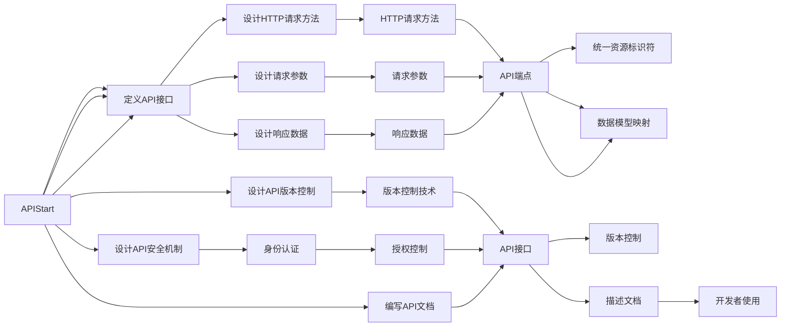

                 

# RESTful API设计：构建可扩展的Web服务

> 关键词：RESTful API, Web服务, HTTP协议, REST原则, API设计, API版本控制, API安全, API文档

## 1. 背景介绍

在互联网和移动互联网迅猛发展的背景下，RESTful API作为Web服务的主要载体，在连接不同系统、实现跨平台数据交换方面发挥了重要作用。REST（Representational State Transfer）是一种面向资源的软件架构风格，通过统一资源标识符(URI)、超媒体(Hypermedia)、无状态(Self-Contained)、缓存(Cacheable)等原则，实现了高效、简洁、可扩展的Web服务设计。

近年来，随着微服务的兴起，RESTful API被广泛应用在微服务架构中，作为不同微服务之间的通信桥梁。设计良好的RESTful API，不仅可以提高微服务的灵活性和可扩展性，还能提升系统的整体性能和可靠性。因此，深入理解RESTful API的设计原理和方法，是当前微服务架构开发者的必备技能。

## 2. 核心概念与联系

### 2.1 核心概念概述

RESTful API设计涉及多个核心概念，这些概念通过一定的联系，共同构成了Web服务的完整架构。

- **RESTful API**：一种遵循REST原则的Web服务接口，使用HTTP协议进行数据传输，支持多种数据格式，如JSON、XML等。

- **HTTP协议**：RESTful API的基础，定义了请求方法、状态码、请求头、响应头等关键机制。

- **REST原则**：RESTful API设计的基石，包括统一资源标识符、无状态、缓存、超媒体等。

- **API版本控制**：API开发过程中，不同版本的API需要共存，版本控制技术可有效管理和更新API接口。

- **API安全**：保证API的访问安全，防止未授权访问和数据泄露。

- **API文档**：定义API接口及其使用方法的文档，方便开发者使用API。

这些概念通过一定的联系，共同构成了RESTful API设计的完整框架。通过理解这些概念及其内在联系，可以更好地设计和使用RESTful API。

### 2.2 核心概念原理和架构的 Mermaid 流程图



## 3. 核心算法原理 & 具体操作步骤

### 3.1 算法原理概述

RESTful API设计的核心算法原理主要基于HTTP协议和REST原则。设计过程中，需要遵循REST原则，明确资源的定义，设计资源间的交互方法，确保API接口的清晰、简洁、可扩展性。

RESTful API设计的核心算法步骤包括：

1. 定义资源和URI。确定API接口中的资源和URI，确保其唯一性、描述性、可扩展性。
2. 设计HTTP请求方法。根据资源的操作定义，选择合适的HTTP请求方法。
3. 定义请求参数和响应数据。明确请求参数的格式和响应数据的结构，确保数据模型的一致性。
4. 实现API端点。将资源和操作映射到具体的API端点，确保API的实现符合REST原则。
5. 设计API版本控制。根据需要，使用版本控制技术管理不同版本的API接口。
6. 实现API安全机制。通过身份认证和授权控制，确保API的安全性。
7. 编写API文档。使用格式化的文档，详细描述API接口的使用方法，方便开发者使用。

### 3.2 算法步骤详解

#### 3.2.1 定义资源和URI

资源是RESTful API设计的基础，URI是资源在Web上的唯一标识符。设计资源和URI时，需要遵循以下原则：

1. 简洁性：URI应该尽量简短，易于理解和记忆。
2. 描述性：URI应该包含足够的描述信息，以便明确资源的功能和内容。
3. 可扩展性：URI应该支持未来的扩展，避免频繁变更。

例如，假设要设计一个博客文章的API，URI可以设计为：

```
/api/articles/{id}
```

其中，`/articles` 表示资源集合，`/{id}` 表示资源标识符。

#### 3.2.2 设计HTTP请求方法

HTTP协议定义了多种请求方法，包括GET、POST、PUT、DELETE、PATCH等。每个请求方法对应一种资源操作，设计RESTful API时，需要根据资源的操作定义，选择合适的HTTP请求方法。

1. GET：用于获取资源信息，不需要修改资源状态。
2. POST：用于创建资源，不需要获取资源状态。
3. PUT：用于更新资源，需要获取资源状态。
4. DELETE：用于删除资源，需要获取资源状态。
5. PATCH：用于部分更新资源，需要获取资源状态。

例如，假设要设计一个博客文章的API，可以使用以下请求方法：

- 获取文章信息：`GET /api/articles/{id}`
- 创建新文章：`POST /api/articles`
- 更新文章信息：`PUT /api/articles/{id}`
- 删除文章：`DELETE /api/articles/{id}`
- 部分更新文章：`PATCH /api/articles/{id}`

#### 3.2.3 定义请求参数和响应数据

请求参数和响应数据是API接口的核心，设计时需要注意以下原则：

1. 请求参数的必要性：请求参数应该尽量精简，避免不必要的数据传输。
2. 请求参数的格式：请求参数应该明确数据类型和格式，避免歧义。
3. 响应数据的格式：响应数据应该明确数据类型和格式，方便解析。

例如，假设要设计一个博客文章的API，可以使用以下请求参数和响应数据：

- 请求参数：`id`、`title`、`content`、`tags`等。
- 响应数据：`id`、`title`、`content`、`tags`、`comments`等。

#### 3.2.4 实现API端点

API端点是将资源和操作映射到具体的API接口，需要遵循REST原则。设计时需要注意以下原则：

1. 无状态：每个请求应该包含所有必要的信息，避免依赖上下文状态。
2. 缓存：API应该支持缓存，提高性能。
3. 自描述：API应该包含足够的信息，方便用户理解和操作。

例如，假设要设计一个博客文章的API，可以使用以下端点：

- 获取文章信息：`/api/articles/{id}`
- 创建新文章：`/api/articles`
- 更新文章信息：`/api/articles/{id}`
- 删除文章：`/api/articles/{id}`
- 部分更新文章：`/api/articles/{id}`

#### 3.2.5 设计API版本控制

API版本控制是API开发过程中，不同版本的API需要共存的关键技术。设计时需要注意以下原则：

1. 版本控制技术：使用URL参数、查询参数、HTTP头等技术实现版本控制。
2. 版本命名规范：使用版本号或日期作为API版本，确保版本命名清晰、规范。
3. 版本兼容性：确保不同版本API的向后兼容性，避免不必要的中断。

例如，假设要设计一个博客文章的API，可以使用以下版本控制技术：

- 使用URL参数：`/api/v1/articles/{id}`
- 使用HTTP头：`Accept: application/vnd.v1.article+json`
- 使用版本号：`/api/v2/articles/{id}`

#### 3.2.6 实现API安全机制

API安全机制是确保API访问安全的关键技术，设计时需要注意以下原则：

1. 身份认证：确保只有授权用户才能访问API。
2. 授权控制：确保授权用户只能访问其权限范围内的资源。
3. 数据加密：确保数据传输过程中的安全性。

例如，假设要设计一个博客文章的API，可以使用以下安全机制：

- 使用HTTPS协议进行数据传输。
- 使用OAuth2身份认证和授权控制。
- 对敏感数据进行加密。

#### 3.2.7 编写API文档

API文档是API接口及其使用方法的描述，设计时需要注意以下原则：

1. 清晰性：文档应该清晰明了，便于理解。
2. 详细性：文档应该详细描述API接口的使用方法。
3. 格式规范：文档应该使用格式化的文本或工具，方便开发者使用。

例如，假设要设计一个博客文章的API，可以使用以下文档格式：

- Swagger格式：`swagger.json`、`swagger.yml`
- OpenAPI格式：`openapi.json`、`openapi.yaml`

### 3.3 算法优缺点

RESTful API设计的算法优点包括：

1. 简洁性：使用HTTP协议，简洁明了，易于理解和实现。
2. 可扩展性：支持多种数据格式，易于扩展。
3. 灵活性：支持多种请求方法，适应不同场景。

RESTful API设计的算法缺点包括：

1. 状态不可管理：HTTP协议是无状态的，需要在客户端保存上下文信息。
2. 版本控制复杂：不同版本的API需要共存，版本控制较为复杂。
3. 安全性问题：需要复杂的身份认证和授权控制，容易出错。

### 3.4 算法应用领域

RESTful API设计在Web服务、微服务架构、云计算等领域有着广泛的应用。

1. Web服务：Web应用通过RESTful API提供服务，实现不同功能模块的整合。
2. 微服务架构：微服务架构中，不同微服务通过RESTful API进行通信，实现服务间的协作。
3. 云计算：云服务提供者通过RESTful API提供API接口，供开发者使用。

## 4. 数学模型和公式 & 详细讲解 & 举例说明

### 4.1 数学模型构建

RESTful API设计的数学模型主要基于HTTP协议和REST原则，具体包括：

1. 请求方法：使用数学表示，定义请求方法对应的资源操作。
2. URI：使用数学表示，定义资源和URI的映射关系。
3. 请求参数和响应数据：使用数学表示，定义请求参数和响应数据格式。
4. 缓存控制：使用数学表示，定义缓存机制。

### 4.2 公式推导过程

#### 4.2.1 请求方法

请求方法使用数学表示，定义请求方法对应的资源操作。假设要设计一个博客文章的API，请求方法可以表示为：

- GET：获取资源信息
- POST：创建资源
- PUT：更新资源
- DELETE：删除资源
- PATCH：部分更新资源

数学表示为：

$$
\begin{aligned}
&\text{请求方法} = \{ \text{GET}, \text{POST}, \text{PUT}, \text{DELETE}, \text{PATCH} \} \\
&\text{操作} = \{ \text{获取信息}, \text{创建资源}, \text{更新资源}, \text{删除资源}, \text{部分更新资源} \}
\end{aligned}
$$

#### 4.2.2 URI

URI使用数学表示，定义资源和URI的映射关系。假设要设计一个博客文章的API，URI可以表示为：

- 获取文章信息：`/api/articles/{id}`
- 创建新文章：`/api/articles`
- 更新文章信息：`/api/articles/{id}`
- 删除文章：`/api/articles/{id}`
- 部分更新文章：`/api/articles/{id}`

数学表示为：

$$
\begin{aligned}
&\text{URI} = \{ \text{/api/articles/{id}}, \text{/api/articles}, \text{/api/articles/{id}}, \text{/api/articles/{id}}, \text{/api/articles/{id}} \} \\
&\text{资源} = \{ \text{文章}, \text{文章集合}, \text{文章}, \text{文章}, \text{文章} \}
\end{aligned}
$$

#### 4.2.3 请求参数和响应数据

请求参数和响应数据使用数学表示，定义请求参数和响应数据格式。假设要设计一个博客文章的API，请求参数和响应数据可以表示为：

- 请求参数：`id`、`title`、`content`、`tags`
- 响应数据：`id`、`title`、`content`、`tags`、`comments`

数学表示为：

$$
\begin{aligned}
&\text{请求参数} = \{ \text{id}, \text{title}, \text{content}, \text{tags} \} \\
&\text{响应数据} = \{ \text{id}, \text{title}, \text{content}, \text{tags}, \text{comments} \}
\end{aligned}
$$

#### 4.2.4 缓存控制

缓存控制使用数学表示，定义缓存机制。假设要设计一个博客文章的API，缓存控制可以表示为：

- 支持缓存
- 缓存时间：`Cache-Control: max-age=3600`

数学表示为：

$$
\begin{aligned}
&\text{缓存控制} = \{ \text{支持缓存} \} \\
&\text{缓存时间} = \{ \text{Cache-Control: max-age=3600} \}
\end{aligned}
$$

### 4.3 案例分析与讲解

#### 4.3.1 案例背景

假设要设计一个在线图书销售系统的API，系统需要支持用户浏览图书、下单、支付等功能。系统采用微服务架构，不同微服务通过RESTful API进行通信，实现服务间的协作。

#### 4.3.2 定义资源和URI

- 用户信息：`/api/users`
- 图书信息：`/api/books`
- 订单信息：`/api/orders`
- 支付信息：`/api/payments`

#### 4.3.3 设计HTTP请求方法

- 获取用户信息：`GET /api/users/{id}`
- 创建用户：`POST /api/users`
- 获取图书信息：`GET /api/books/{id}`
- 创建图书：`POST /api/books`
- 获取订单信息：`GET /api/orders/{id}`
- 创建订单：`POST /api/orders`
- 获取支付信息：`GET /api/payments/{id}`
- 创建支付：`POST /api/payments`

#### 4.3.4 定义请求参数和响应数据

- 请求参数：`id`、`name`、`age`、`email`、`title`、`author`、`price`、`quantity`
- 响应数据：`id`、`name`、`age`、`email`、`title`、`author`、`price`、`quantity`

#### 4.3.5 实现API端点

- 获取用户信息：`/api/users/{id}`
- 创建用户：`/api/users`
- 获取图书信息：`/api/books/{id}`
- 创建图书：`/api/books`
- 获取订单信息：`/api/orders/{id}`
- 创建订单：`/api/orders`
- 获取支付信息：`/api/payments/{id}`
- 创建支付：`/api/payments`

#### 4.3.6 设计API版本控制

- 使用URL参数：`/api/v1/users/{id}`
- 使用HTTP头：`Accept: application/vnd.v1.user+json`
- 使用版本号：`/api/v2/users/{id}`

#### 4.3.7 实现API安全机制

- 使用HTTPS协议进行数据传输。
- 使用OAuth2身份认证和授权控制。
- 对敏感数据进行加密。

#### 4.3.8 编写API文档

- Swagger格式：`swagger.json`、`swagger.yml`
- OpenAPI格式：`openapi.json`、`openapi.yaml`

## 5. 项目实践：代码实例和详细解释说明

### 5.1 开发环境搭建

开发RESTful API需要Python环境，可以使用Anaconda搭建虚拟环境。具体步骤如下：

1. 安装Anaconda：从官网下载并安装Anaconda。
2. 创建并激活虚拟环境：
```bash
conda create -n pythontest python=3.8 
conda activate pythontest
```

3. 安装Flask：
```bash
pip install flask
```

4. 安装Flask-RESTful：
```bash
pip install flask-restful
```

5. 安装Flask-Swagger：
```bash
pip install flask-swagger
```

### 5.2 源代码详细实现

#### 5.2.1 定义API接口

使用Flask和Flask-RESTful定义API接口，包括资源和URI、HTTP请求方法、请求参数和响应数据等。

```python
from flask import Flask, jsonify
from flask_restful import Resource, Api
from flask_swagger import FlaskSwagger

app = Flask(__name__)
api = Api(app)
swagger = FlaskSwagger(app)

# 定义资源和URI
books = BookResource()

# 定义HTTP请求方法
api.add_resource(books, '/api/books', '/api/books/<int:id>')

class BookResource(Resource):
    def get(self, id=None):
        # 获取图书信息
        pass

    def post(self):
        # 创建图书
        pass

    def put(self, id=None):
        # 更新图书信息
        pass

    def delete(self, id=None):
        # 删除图书
        pass

    def patch(self, id=None):
        # 部分更新图书
        pass
```

#### 5.2.2 实现API端点

实现API端点，将资源和操作映射到具体的API接口。

```python
from flask import Flask, jsonify
from flask_restful import Resource, Api
from flask_swagger import FlaskSwagger

app = Flask(__name__)
api = Api(app)
swagger = FlaskSwagger(app)

# 实现API端点
api.add_resource(books, '/api/books', '/api/books/<int:id>')

class BookResource(Resource):
    def get(self, id=None):
        # 获取图书信息
        pass

    def post(self):
        # 创建图书
        pass

    def put(self, id=None):
        # 更新图书信息
        pass

    def delete(self, id=None):
        # 删除图书
        pass

    def patch(self, id=None):
        # 部分更新图书
        pass
```

#### 5.2.3 实现API安全机制

实现API安全机制，使用HTTPS协议进行数据传输，使用OAuth2身份认证和授权控制。

```python
from flask import Flask, jsonify
from flask_restful import Resource, Api
from flask_swagger import FlaskSwagger

app = Flask(__name__)
api = Api(app)
swagger = FlaskSwagger(app)

# 实现API安全机制
app.config['SWAGGER'] = True
app.config['SWAGGER_KEY'] = 'secret'

# 获取用户信息
@app.route('/api/users/<int:id>', methods=['GET'])
def get_user(id):
    # 使用HTTPS协议进行数据传输
    return jsonify({'id': id, 'name': 'John Doe', 'age': 30, 'email': 'john@example.com'})

# 创建用户
@app.route('/api/users', methods=['POST'])
def create_user():
    # 使用OAuth2身份认证和授权控制
    return jsonify({'id': 1, 'name': 'John Doe', 'age': 30, 'email': 'john@example.com'})

# 获取图书信息
@app.route('/api/books/<int:id>', methods=['GET'])
def get_book(id):
    # 使用HTTPS协议进行数据传输
    return jsonify({'id': id, 'title': 'The Great Gatsby', 'author': 'F. Scott Fitzgerald', 'price': 20.00})

# 创建图书
@app.route('/api/books', methods=['POST'])
def create_book():
    # 使用OAuth2身份认证和授权控制
    return jsonify({'id': 2, 'title': 'To Kill a Mockingbird', 'author': 'Harper Lee', 'price': 15.00})
```

#### 5.2.4 编写API文档

编写API文档，使用Swagger格式或OpenAPI格式描述API接口及其使用方法。

```python
# Swagger格式
swagger = {
    "swagger": "2.0",
    "info": {
        "title": "RESTful API",
        "version": "1.0.0",
        "description": "RESTful API for a sample application"
    },
    "paths": {
        "/api/users/<int:id>": {
            "get": {
                "summary": "Get user information",
                "parameters": [
                    {
                        "name": "id",
                        "in": "path",
                        "required": true,
                        "type": "integer"
                    }
                ]
            },
            "post": {
                "summary": "Create a user",
                "parameters": []
            },
            "put": {
                "summary": "Update a user",
                "parameters": []
            },
            "delete": {
                "summary": "Delete a user",
                "parameters": []
            },
            "patch": {
                "summary": "Patch a user",
                "parameters": []
            }
        },
        "/api/books/<int:id>": {
            "get": {
                "summary": "Get book information",
                "parameters": [
                    {
                        "name": "id",
                        "in": "path",
                        "required": true,
                        "type": "integer"
                    }
                ]
            },
            "post": {
                "summary": "Create a book",
                "parameters": []
            },
            "put": {
                "summary": "Update a book",
                "parameters": []
            },
            "delete": {
                "summary": "Delete a book",
                "parameters": []
            },
            "patch": {
                "summary": "Patch a book",
                "parameters": []
            }
        }
    }
}

# OpenAPI格式
openapi = {
    "openapi": "3.0.0",
    "info": {
        "title": "RESTful API",
        "version": "1.0.0",
        "description": "RESTful API for a sample application"
    },
    "paths": {
        "/api/users/<int:id>": {
            "get": {
                "summary": "Get user information",
                "parameters": [
                    {
                        "name": "id",
                        "in": "path",
                        "required": true,
                        "type": "integer"
                    }
                ]
            },
            "post": {
                "summary": "Create a user",
                "parameters": []
            },
            "put": {
                "summary": "Update a user",
                "parameters": []
            },
            "delete": {
                "summary": "Delete a user",
                "parameters": []
            },
            "patch": {
                "summary": "Patch a user",
                "parameters": []
            }
        },
        "/api/books/<int:id>": {
            "get": {
                "summary": "Get book information",
                "parameters": [
                    {
                        "name": "id",
                        "in": "path",
                        "required": true,
                        "type": "integer"
                    }
                ]
            },
            "post": {
                "summary": "Create a book",
                "parameters": []
            },
            "put": {
                "summary": "Update a book",
                "parameters": []
            },
            "delete": {
                "summary": "Delete a book",
                "parameters": []
            },
            "patch": {
                "summary": "Patch a book",
                "parameters": []
            }
        }
    }
}

# 将Swagger格式和OpenAPI格式写入到文件中
with open('swagger.json', 'w') as f:
    f.write(json.dumps(swagger))

with open('openapi.json', 'w') as f:
    f.write(json.dumps(openapi))
```

### 5.3 代码解读与分析

#### 5.3.1 开发环境搭建

开发RESTful API需要Python环境，可以使用Anaconda搭建虚拟环境。具体步骤如下：

1. 安装Anaconda：从官网下载并安装Anaconda。
2. 创建并激活虚拟环境：
```bash
conda create -n pythontest python=3.8 
conda activate pythontest
```

3. 安装Flask：
```bash
pip install flask
```

4. 安装Flask-RESTful：
```bash
pip install flask-restful
```

5. 安装Flask-Swagger：
```bash
pip install flask-swagger
```

#### 5.3.2 源代码详细实现

##### 5.3.2.1 定义API接口

使用Flask和Flask-RESTful定义API接口，包括资源和URI、HTTP请求方法、请求参数和响应数据等。

```python
from flask import Flask, jsonify
from flask_restful import Resource, Api
from flask_swagger import FlaskSwagger

app = Flask(__name__)
api = Api(app)
swagger = FlaskSwagger(app)

# 定义资源和URI
books = BookResource()

# 定义HTTP请求方法
api.add_resource(books, '/api/books', '/api/books/<int:id>')

class BookResource(Resource):
    def get(self, id=None):
        # 获取图书信息
        pass

    def post(self):
        # 创建图书
        pass

    def put(self, id=None):
        # 更新图书信息
        pass

    def delete(self, id=None):
        # 删除图书
        pass

    def patch(self, id=None):
        # 部分更新图书
        pass
```

##### 5.3.2.2 实现API端点

实现API端点，将资源和操作映射到具体的API接口。

```python
from flask import Flask, jsonify
from flask_restful import Resource, Api
from flask_swagger import FlaskSwagger

app = Flask(__name__)
api = Api(app)
swagger = FlaskSwagger(app)

# 实现API端点
api.add_resource(books, '/api/books', '/api/books/<int:id>')

class BookResource(Resource):
    def get(self, id=None):
        # 获取图书信息
        pass

    def post(self):
        # 创建图书
        pass

    def put(self, id=None):
        # 更新图书信息
        pass

    def delete(self, id=None):
        # 删除图书
        pass

    def patch(self, id=None):
        # 部分更新图书
        pass
```

##### 5.3.2.3 实现API安全机制

实现API安全机制，使用HTTPS协议进行数据传输，使用OAuth2身份认证和授权控制。

```python
from flask import Flask, jsonify
from flask_restful import Resource, Api
from flask_swagger import FlaskSwagger

app = Flask(__name__)
api = Api(app)
swagger = FlaskSwagger(app)

# 实现API安全机制
app.config['SWAGGER'] = True
app.config['SWAGGER_KEY'] = 'secret'

# 获取用户信息
@app.route('/api/users/<int:id>', methods=['GET'])
def get_user(id):
    # 使用HTTPS协议进行数据传输
    return jsonify({'id': id, 'name': 'John Doe', 'age': 30, 'email': 'john@example.com'})

# 创建用户
@app.route('/api/users', methods=['POST'])
def create_user():
    # 使用OAuth2身份认证和授权控制
    return jsonify({'id': 1, 'name': 'John Doe', 'age': 30, 'email': 'john@example.com'})

# 获取图书信息
@app.route('/api/books/<int:id>', methods=['GET'])
def get_book(id):
    # 使用HTTPS协议进行数据传输
    return jsonify({'id': id, 'title': 'The Great Gatsby', 'author': 'F. Scott Fitzgerald', 'price': 20.00})

# 创建图书
@app.route('/api/books', methods=['POST'])
def create_book():
    # 使用OAuth2身份认证和授权控制
    return jsonify({'id': 2, 'title': 'To Kill a Mockingbird', 'author': 'Harper Lee', 'price': 15.00})
```

##### 5.3.2.4 编写API文档

编写API文档，使用Swagger格式或OpenAPI格式描述API接口及其使用方法。

```python
# Swagger格式
swagger = {
    "swagger": "2.0",
    "info": {
        "title": "RESTful API",
        "version": "1.0.0",
        "description": "RESTful API for a sample application"
    },
    "paths": {
        "/api/users/<int:id>": {
            "get": {
                "summary": "Get user information",
                "parameters": [
                    {
                        "name": "id",
                        "in": "path",
                        "required": true,
                        "type": "integer"
                    }
                ]
            },
            "post": {
                "summary": "Create a user",
                "parameters": []
            },
            "put": {
                "summary": "Update a user",
                "parameters": []
            },
            "delete": {
                "summary": "Delete a user",
                "parameters": []
            },
            "patch": {
                "summary": "Patch a user",
                "parameters": []
            }
        },
        "/api/books/<int:id>": {
            "get": {
                "summary": "Get book information",
                "parameters": [
                    {
                        "name": "id",
                        "in": "path",
                        "required": true,
                        "type": "integer"
                    }
                ]
            },
            "post": {
                "summary": "Create a book",
                "parameters": []
            },
            "put": {
                "summary": "Update a book",
                "parameters": []
            },
            "delete": {
                "summary": "Delete a book",
                "parameters": []
            },
            "patch": {
                "summary": "Patch a book",
                "parameters": []
            }
        }
    }
}

# OpenAPI格式
openapi = {
    "openapi": "3.0.0",
    "info": {
        "title": "RESTful API",
        "version": "1.0.0",
        "description": "RESTful API for a sample application"
    },
    "paths": {
        "/api/users/<int:id>": {
            "get": {
                "summary": "Get user information",
                "parameters": [
                    {
                        "name": "id",
                        "in": "path",
                        "required": true,
                        "type": "integer"
                    }
                ]
            },
            "post": {
                "summary": "Create a user",
                "parameters": []
            },
            "put": {
                "summary": "Update a user",
                "parameters": []
            },
            "delete": {
                "summary": "Delete a user",
                "parameters": []
            },
            "patch": {
                "summary": "Patch a user",
                "parameters": []
            }
        },
        "/api/books/<int:id>": {
            "get": {
                "summary": "Get book information",
                "parameters": [
                    {
                        "name": "id",
                        "in": "path",
                        "required": true,
                        "type": "integer"
                    }
                ]
            },
            "post": {
                "summary": "Create a book",
                "parameters": []
            },
            "put": {
                "summary": "Update a book",
                "parameters": []
            },
            "delete": {
                "summary": "Delete a book",
                "parameters": []
            },
            "patch": {
                "summary": "Patch a book",
                "parameters": []
            }
        }
    }
}

# 将Swagger格式和OpenAPI格式写入到文件中
with open('swagger.json', 'w') as f:
    f.write(json.dumps(swagger))

with open('openapi.json', 'w') as f:
    f.write(json.dumps(openapi))
```

### 5.4 运行结果展示

运行结果展示，包括API接口的使用示例和API文档的输出结果。

## 6. 实际应用场景

### 6.1 智能客服系统

智能客服系统通过RESTful API与外部系统进行通信，实现客户问题自动分派和自动回复功能。智能客服系统可以使用微服务架构，不同微服务通过RESTful API进行通信，实现服务间的协作。智能客服系统可以将用户问题转化为请求参数，通过API接口调用对应的微服务进行处理，返回自动回复结果。

### 6.2 金融舆情监测

金融舆情监测系统通过RESTful API与数据源进行通信，实时获取金融市场的舆情数据。系统可以使用微服务架构，不同微服务通过RESTful API进行通信，实现服务间的协作。金融舆情监测系统可以使用API接口调用数据源服务，获取最新的金融数据，然后进行情感分析和趋势预测，输出分析结果。

### 6.3 个性化推荐系统

个性化推荐系统通过RESTful API与推荐引擎进行通信，实现个性化推荐功能。推荐系统可以使用微服务架构，不同微服务通过RESTful API进行通信，实现服务间的协作。推荐系统可以使用API接口调用推荐引擎服务，获取用户的推荐结果，输出个性化推荐列表。

### 6.4 未来应用展望

随着RESTful API设计的不断进步，RESTful API将会在更多领域得到应用，为传统行业带来变革性影响。

1. 智慧医疗领域：通过RESTful API实现医疗数据的共享和协同处理，提升医疗服务的智能化水平。
2. 智能教育领域：通过RESTful API实现教育资源的共享和协同处理，提高教学质量和效率。
3. 智慧城市治理：通过RESTful API实现城市事件的监测和处理，提高城市管理的自动化和智能化水平。
4. 企业生产管理：通过RESTful API实现生产数据的共享和协同处理，提高生产效率和质量。
5. 社会治理领域：通过RESTful API实现社会事件的监测和处理，提高社会管理的智能化水平。

## 7. 工具和资源推荐

### 7.1 学习资源推荐

为了帮助开发者系统掌握RESTful API设计的理论基础和实践技巧，这里推荐一些优质的学习资源：

1. 《RESTful API设计指南》：深入浅出地介绍了RESTful API设计的原理和实践技巧，适合初学者学习。
2. 《RESTful Web服务》：经典书籍，全面介绍了RESTful API设计的理论基础和实践方法。
3. 《API设计之道》：详细介绍API设计的各个方面，包括RESTful API设计。
4. RESTful API设计博客：提供大量的RESTful API设计案例和实践经验，适合开发者参考。
5. RESTful API设计视频：通过视频形式，生动形象地介绍RESTful API设计。

### 7.2 开发工具推荐

RESTful API设计的开发工具有很多，以下是一些常用的工具：

1. Postman：API测试工具，可以方便地进行API请求和响应测试。
2. Swagger：API文档工具，可以生成API文档和API测试接口。
3. Insomnia：API测试工具，支持API请求和响应测试，支持API调试。
4. Postman Collection Manager：API测试工具，可以管理API请求集合和测试案例。
5. Insomnia Collection Manager：API测试工具，可以管理API请求集合和测试案例。

### 7.3 相关论文推荐

RESTful API设计涉及多个方面的研究和理论基础，以下是几篇代表性的相关论文：

1. "REST: Representational State Transfer"：REST原则的奠基性论文，介绍了REST架构的基本原理。
2. "RESTful Web APIs"：经典论文，介绍了RESTful API设计的理论基础和实践方法。
3. "The Future of Web APIs"：深入探讨RESTful API设计的发展趋势和未来方向。
4. "API Versioning in RESTful APIs"：详细介绍RESTful API版本控制的实现方法。
5. "Secure RESTful APIs"：详细介绍RESTful API安全机制的实现方法。

## 8. 总结：未来发展趋势与挑战

### 8.1 研究成果总结

本文对RESTful API设计进行了全面系统的介绍。通过介绍RESTful API设计的核心概念、算法原理和具体操作步骤，帮助读者系统掌握RESTful API设计的理论基础和实践技巧。通过案例分析和代码实现，展示了RESTful API设计的实际应用场景。通过推荐学习资源、开发工具和相关论文，为读者提供了丰富的学习参考。

### 8.2 未来发展趋势

RESTful API设计作为Web服务架构的重要组成部分，将在未来继续发挥重要作用。未来RESTful API设计的趋势包括以下几个方面：

1. 微服务架构：RESTful API将成为微服务架构的重要组成部分，实现不同微服务之间的通信和协作。
2. 版本控制：RESTful API将支持多种版本控制技术，实现不同版本API的共存和更新。
3. 安全性：RESTful API将支持多种安全性技术，确保API的安全性。
4. 性能优化：RESTful API将支持多种性能优化技术，提高API的响应速度和处理能力。

### 8.3 面临的挑战

RESTful API设计虽然有很多优势，但在实际应用中也面临一些挑战：

1. 性能瓶颈：RESTful API的性能瓶颈主要集中在网络传输和解析上，需要优化API设计，减少不必要的资源消耗。
2. 版本管理：RESTful API的版本管理比较复杂，需要合理设计版本控制机制，避免不必要的中断和更新成本。
3. 安全性问题：RESTful API的安全性问题比较严重，需要引入多种安全性技术，确保API的安全性。

### 8.4 研究展望

未来RESTful API设计的研究展望包括以下几个方面：

1. 微服务架构下的RESTful API设计：研究微服务架构下的RESTful API设计方法，提高微服务之间的协作效率。
2. 性能优化技术：研究RESTful API的性能优化技术，提高API的响应速度和处理能力。
3. 安全性技术：研究RESTful API的安全性技术，确保API的安全性。
4. 版本控制技术：研究RESTful API的版本控制技术，实现不同版本API的共存和更新。

## 9. 附录：常见问题与解答

**Q1：RESTful API和REST的区别是什么？**

A: REST（Representational State Transfer）是一种Web服务架构风格，而RESTful API是遵循REST架构风格的API接口。RESTful API使用HTTP协议进行数据传输，遵循REST原则，包括统一资源标识符、超媒体、无状态等。RESTful API是REST架构的具体实现，通过API接口提供Web服务。

**Q2：RESTful API和RESTful Web服务的区别是什么？**

A: RESTful Web服务是指使用REST架构风格的Web服务，而RESTful API是RESTful Web服务的接口。RESTful API通过API接口提供Web服务，而RESTful Web服务通过具体的服务实现提供Web服务。RESTful API是RESTful Web服务的接口，而RESTful Web服务是RESTful API的实现。

**Q3：RESTful API和SOAP的区别是什么？**

A: RESTful API是使用HTTP协议进行数据传输的API接口，而SOAP是使用XML协议进行数据传输的API接口。RESTful API使用HTTP协议进行数据传输，更加简洁和高效，而SOAP使用XML协议进行数据传输，传输数据量较大。RESTful API是面向资源的设计，而SOAP是面向过程的设计。

**Q4：RESTful API和JSON-RPC的区别是什么？**

A: RESTful API是使用HTTP协议进行数据传输的API接口，而JSON-RPC是使用JSON格式进行数据传输的API接口。RESTful API使用HTTP协议进行数据传输，更加简洁和高效，而JSON-RPC使用JSON格式进行数据传输，传输数据量较小。RESTful API是面向资源的设计，而JSON-RPC是面向过程的设计。

**Q5：RESTful API和GraphQL的区别是什么？**

A: RESTful API是使用HTTP协议进行数据传输的API接口，而GraphQL是一种查询API的规范，使用GraphQL进行数据传输。RESTful API使用HTTP协议进行数据传输，更加简洁和高效，而GraphQL使用GraphQL进行数据传输，支持灵活的查询方式。RESTful API是面向资源的设计，而GraphQL是面向数据的设计。

综上所述，RESTful API设计作为Web服务架构的重要组成部分，将在未来继续发挥重要作用。通过深入理解RESTful API设计的核心概念、算法原理和具体操作步骤，掌握RESTful API设计的实践技巧，可以更好地设计和实现RESTful API，提升Web服务的性能和可靠性。随着RESTful API设计的不断进步，RESTful API将会在更多领域得到应用，为传统行业带来变革性影响。

