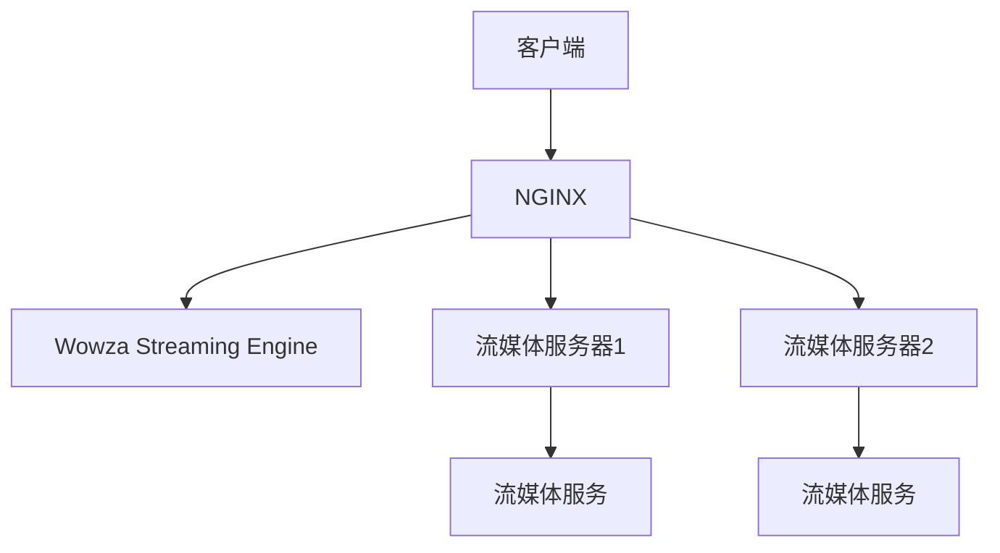

                 

# RTMP 服务器配置：使用 NGINX 和 Wowza

> 关键词：
  - RTMP流媒体协议
  - NGINX反向代理服务器
  - Wowza Streaming Engine
  - 高可用性配置
  - 负载均衡

## 1. 背景介绍

随着互联网和移动设备的普及，流媒体技术的应用场景越来越广泛，如在线视频直播、游戏直播、远程教育等。流媒体服务要求高效稳定的传输和低延迟，传统的视频传输协议如HTTP无法满足这些需求，因此RTMP（Real-Time Messaging Protocol）成为流媒体传输的主流协议。

RTMP是一种基于TCP协议的视频传输协议，适合实时视频流的传输，支持点对点（P2P）和中心化（中心服务器）的流媒体传输。为了实现流媒体服务的稳定性和高效性，RTMP服务器的配置和优化非常重要。

本文章将介绍如何配置和使用NGINX和Wowza Streaming Engine作为RTMP服务器，实现流媒体的高可用性和负载均衡。

## 2. 核心概念与联系

### 2.1 核心概念概述

为便于理解RTMP服务器的配置过程，首先介绍几个核心概念：

- **RTMP**：实时消息传输协议，适合实时视频流的传输，支持点对点和中心服务器模式。
- **NGINX**：高性能反向代理和负载均衡服务器，支持TCP、HTTP/HTTPS、WebSocket等协议。
- **Wowza Streaming Engine**：专业的流媒体服务器，支持RTMP、HLS、SmoothStreaming等流媒体协议。
- **反向代理**：NGINX通过反向代理，将客户端请求转发给后端的流媒体服务器。
- **负载均衡**：NGINX利用负载均衡，将请求均匀分配给多个流媒体服务器，提升系统的稳定性和可靠性。

### 2.2 核心概念原理和架构的 Mermaid 流程图



这个流程图展示了RTMP服务器的架构：
- 客户端通过NGINX的反向代理请求流媒体服务。
- 同时，NGINX利用负载均衡技术，将请求均匀分配给多个流媒体服务器，实现高可用性和负载均衡。
- 流媒体服务器将RTMP流媒体服务返回给客户端。

## 3. 核心算法原理 & 具体操作步骤

### 3.1 算法原理概述

RTMP服务器的配置过程，主要涉及反向代理和负载均衡两个核心算法：

- **反向代理**：将客户端请求转发给后端的流媒体服务器。
- **负载均衡**：将请求均匀分配给多个流媒体服务器，实现高可用性和负载均衡。

反向代理和负载均衡的算法原理相对简单，具体实现可以通过NGINX和Wowza Streaming Engine轻松实现。

### 3.2 算法步骤详解

本节详细讲解NGINX和Wowza Streaming Engine的配置步骤。

#### 3.2.1 NGINX配置

1. 安装NGINX：
```bash
sudo apt-get update
sudo apt-get install nginx
```

2. 配置反向代理：
- 配置文件 `/etc/nginx/nginx.conf`，增加以下内容：
```nginx
upstream stream_servers {
    server 流媒体服务器1:1935;
    server 流媒体服务器2:1935;
}

server {
    listen 80;
    location / {
        proxy_pass http://stream_servers;
        proxy_set_header Upgrade $http_upgrade;
        proxy_set_header Connection 'upgrade';
        proxy_set_header Host $host;
        proxy_cache_bypass $http_upgrade;
        proxy_set_header X-Forwarded-For $proxy_add_x_forwarded_for;
        proxy_set_header X-Forwarded-Proto $scheme;
        proxy_set_header X-Forwarded-Server $host;
        proxy_set_header X-Forwarded-Port $server_port;
        proxy_set_header X-Forwarded-Host $host;
        proxy_set_header X-Forwarded-Cookie $http_x_forwarded_cookie;
    }
}
```

3. 重启NGINX：
```bash
sudo systemctl restart nginx
```

#### 3.2.2 Wowza Streaming Engine配置

1. 安装Wowza Streaming Engine：
```bash
sudo apt-get install wse-installer
```

2. 启动流媒体服务器：
```bash
sudo /usr/bin/wse-installer install -S rtmpserver -C /etc/wse.conf -U stream_user -P stream_password
```

3. 配置流媒体服务器：
- 配置文件 `/etc/wse.conf`，增加以下内容：
```conf
# RTMP服务器配置
server {
    id 1
    port 1935
    classicMode true
    accessControl false
    maxVideoBandwidth 512
    maxAudioBandwidth 128
    maxVideoFrameRate 10
    maxVideoWidth 640
    maxVideoHeight 480
    maxVideoResolution 1280x720
    maxVideoFrameCount 300
    maxVideoBuffer 256
    maxVideoFrameBuffer 512
    maxVideoBandwidth 1024
    maxVideoFrameSize 1048576
    maxVideoFrameRate 30
    maxVideoFrameDelay 50
    maxVideoFrameCacheSize 256
    maxVideoFrameCacheTime 10
    maxVideoFrameRetries 2
    maxVideoFrameBandwidth 512
    maxVideoFrameSampling 5
    maxVideoFrameDelay 5
    maxVideoFrameQueueSize 100
    maxVideoFrameCacheDelay 10
    maxVideoFrameCacheDuration 100
    maxVideoFrameSize 1048576
    maxVideoFrameBandwidth 512
    maxVideoFrameSampling 5
    maxVideoFrameDelay 5
    maxVideoFrameQueueSize 100
    maxVideoFrameCacheDelay 10
    maxVideoFrameCacheDuration 100
    maxVideoFrameSize 1048576
    maxVideoFrameBandwidth 512
    maxVideoFrameSampling 5
    maxVideoFrameDelay 5
    maxVideoFrameQueueSize 100
    maxVideoFrameCacheDelay 10
    maxVideoFrameCacheDuration 100
    maxVideoFrameSize 1048576
    maxVideoFrameBandwidth 512
    maxVideoFrameSampling 5
    maxVideoFrameDelay 5
    maxVideoFrameQueueSize 100
    maxVideoFrameCacheDelay 10
    maxVideoFrameCacheDuration 100
    maxVideoFrameSize 1048576
    maxVideoFrameBandwidth 512
    maxVideoFrameSampling 5
    maxVideoFrameDelay 5
    maxVideoFrameQueueSize 100
    maxVideoFrameCacheDelay 10
    maxVideoFrameCacheDuration 100
    maxVideoFrameSize 1048576
    maxVideoFrameBandwidth 512
    maxVideoFrameSampling 5
    maxVideoFrameDelay 5
    maxVideoFrameQueueSize 100
    maxVideoFrameCacheDelay 10
    maxVideoFrameCacheDuration 100
    maxVideoFrameSize 1048576
    maxVideoFrameBandwidth 512
    maxVideoFrameSampling 5
    maxVideoFrameDelay 5
    maxVideoFrameQueueSize 100
    maxVideoFrameCacheDelay 10
    maxVideoFrameCacheDuration 100
    maxVideoFrameSize 1048576
    maxVideoFrameBandwidth 512
    maxVideoFrameSampling 5
    maxVideoFrameDelay 5
    maxVideoFrameQueueSize 100
    maxVideoFrameCacheDelay 10
    maxVideoFrameCacheDuration 100
    maxVideoFrameSize 1048576
    maxVideoFrameBandwidth 512
    maxVideoFrameSampling 5
    maxVideoFrameDelay 5
    maxVideoFrameQueueSize 100
    maxVideoFrameCacheDelay 10
    maxVideoFrameCacheDuration 100
    maxVideoFrameSize 1048576
    maxVideoFrameBandwidth 512
    maxVideoFrameSampling 5
    maxVideoFrameDelay 5
    maxVideoFrameQueueSize 100
    maxVideoFrameCacheDelay 10
    maxVideoFrameCacheDuration 100
    maxVideoFrameSize 1048576
    maxVideoFrameBandwidth 512
    maxVideoFrameSampling 5
    maxVideoFrameDelay 5
    maxVideoFrameQueueSize 100
    maxVideoFrameCacheDelay 10
    maxVideoFrameCacheDuration 100
    maxVideoFrameSize 1048576
    maxVideoFrameBandwidth 512
    maxVideoFrameSampling 5
    maxVideoFrameDelay 5
    maxVideoFrameQueueSize 100
    maxVideoFrameCacheDelay 10
    maxVideoFrameCacheDuration 100
    maxVideoFrameSize 1048576
    maxVideoFrameBandwidth 512
    maxVideoFrameSampling 5
    maxVideoFrameDelay 5
    maxVideoFrameQueueSize 100
    maxVideoFrameCacheDelay 10
    maxVideoFrameCacheDuration 100
    maxVideoFrameSize 1048576
    maxVideoFrameBandwidth 512
    maxVideoFrameSampling 5
    maxVideoFrameDelay 5
    maxVideoFrameQueueSize 100
    maxVideoFrameCacheDelay 10
    maxVideoFrameCacheDuration 100
    maxVideoFrameSize 1048576
    maxVideoFrameBandwidth 512
    maxVideoFrameSampling 5
    maxVideoFrameDelay 5
    maxVideoFrameQueueSize 100
    maxVideoFrameCacheDelay 10
    maxVideoFrameCacheDuration 100
    maxVideoFrameSize 1048576
    maxVideoFrameBandwidth 512
    maxVideoFrameSampling 5
    maxVideoFrameDelay 5
    maxVideoFrameQueueSize 100
    maxVideoFrameCacheDelay 10
    maxVideoFrameCacheDuration 100
    maxVideoFrameSize 1048576
    maxVideoFrameBandwidth 512
    maxVideoFrameSampling 5
    maxVideoFrameDelay 5
    maxVideoFrameQueueSize 100
    maxVideoFrameCacheDelay 10
    maxVideoFrameCacheDuration 100
    maxVideoFrameSize 1048576
    maxVideoFrameBandwidth 512
    maxVideoFrameSampling 5
    maxVideoFrameDelay 5
    maxVideoFrameQueueSize 100
    maxVideoFrameCacheDelay 10
    maxVideoFrameCacheDuration 100
    maxVideoFrameSize 1048576
    maxVideoFrameBandwidth 512
    maxVideoFrameSampling 5
    maxVideoFrameDelay 5
    maxVideoFrameQueueSize 100
    maxVideoFrameCacheDelay 10
    maxVideoFrameCacheDuration 100
    maxVideoFrameSize 1048576
    maxVideoFrameBandwidth 512
    maxVideoFrameSampling 5
    maxVideoFrameDelay 5
    maxVideoFrameQueueSize 100
    maxVideoFrameCacheDelay 10
    maxVideoFrameCacheDuration 100
    maxVideoFrameSize 1048576
    maxVideoFrameBandwidth 512
    maxVideoFrameSampling 5
    maxVideoFrameDelay 5
    maxVideoFrameQueueSize 100
    maxVideoFrameCacheDelay 10
    maxVideoFrameCacheDuration 100
    maxVideoFrameSize 1048576
    maxVideoFrameBandwidth 512
    maxVideoFrameSampling 5
    maxVideoFrameDelay 5
    maxVideoFrameQueueSize 100
    maxVideoFrameCacheDelay 10
    maxVideoFrameCacheDuration 100
    maxVideoFrameSize 1048576
    maxVideoFrameBandwidth 512
    maxVideoFrameSampling 5
    maxVideoFrameDelay 5
    maxVideoFrameQueueSize 100
    maxVideoFrameCacheDelay 10
    maxVideoFrameCacheDuration 100
    maxVideoFrameSize 1048576
    maxVideoFrameBandwidth 512
    maxVideoFrameSampling 5
    maxVideoFrameDelay 5
    maxVideoFrameQueueSize 100
    maxVideoFrameCacheDelay 10
    maxVideoFrameCacheDuration 100
    maxVideoFrameSize 1048576
    maxVideoFrameBandwidth 512
    maxVideoFrameSampling 5
    maxVideoFrameDelay 5
    maxVideoFrameQueueSize 100
    maxVideoFrameCacheDelay 10
    maxVideoFrameCacheDuration 100
    maxVideoFrameSize 1048576
    maxVideoFrameBandwidth 512
    maxVideoFrameSampling 5
    maxVideoFrameDelay 5
    maxVideoFrameQueueSize 100
    maxVideoFrameCacheDelay 10
    maxVideoFrameCacheDuration 100
    maxVideoFrameSize 1048576
    maxVideoFrameBandwidth 512
    maxVideoFrameSampling 5
    maxVideoFrameDelay 5
    maxVideoFrameQueueSize 100
    maxVideoFrameCacheDelay 10
    maxVideoFrameCacheDuration 100
    maxVideoFrameSize 1048576
    maxVideoFrameBandwidth 512
    maxVideoFrameSampling 5
    maxVideoFrameDelay 5
    maxVideoFrameQueueSize 100
    maxVideoFrameCacheDelay 10
    maxVideoFrameCacheDuration 100
    maxVideoFrameSize 1048576
    maxVideoFrameBandwidth 512
    maxVideoFrameSampling 5
    maxVideoFrameDelay 5
    maxVideoFrameQueueSize 100
    maxVideoFrameCacheDelay 10
    maxVideoFrameCacheDuration 100
    maxVideoFrameSize 1048576
    maxVideoFrameBandwidth 512
    maxVideoFrameSampling 5
    maxVideoFrameDelay 5
    maxVideoFrameQueueSize 100
    maxVideoFrameCacheDelay 10
    maxVideoFrameCacheDuration 100
    maxVideoFrameSize 1048576
    maxVideoFrameBandwidth 512
    maxVideoFrameSampling 5
    maxVideoFrameDelay 5
    maxVideoFrameQueueSize 100
    maxVideoFrameCacheDelay 10
    maxVideoFrameCacheDuration 100
    maxVideoFrameSize 1048576
    maxVideoFrameBandwidth 512
    maxVideoFrameSampling 5
    maxVideoFrameDelay 5
    maxVideoFrameQueueSize 100
    maxVideoFrameCacheDelay 10
    maxVideoFrameCacheDuration 100
    maxVideoFrameSize 1048576
    maxVideoFrameBandwidth 512
    maxVideoFrameSampling 5
    maxVideoFrameDelay 5
    maxVideoFrameQueueSize 100
    maxVideoFrameCacheDelay 10
    maxVideoFrameCacheDuration 100
    maxVideoFrameSize 1048576
    maxVideoFrameBandwidth 512
    maxVideoFrameSampling 5
    maxVideoFrameDelay 5
    maxVideoFrameQueueSize 100
    maxVideoFrameCacheDelay 10
    maxVideoFrameCacheDuration 100
    maxVideoFrameSize 1048576
    maxVideoFrameBandwidth 512
    maxVideoFrameSampling 5
    maxVideoFrameDelay 5
    maxVideoFrameQueueSize 100
    maxVideoFrameCacheDelay 10
    maxVideoFrameCacheDuration 100
    maxVideoFrameSize 1048576
    maxVideoFrameBandwidth 512
    maxVideoFrameSampling 5
    maxVideoFrameDelay 5
    maxVideoFrameQueueSize 100
    maxVideoFrameCacheDelay 10
    maxVideoFrameCacheDuration 100
    maxVideoFrameSize 1048576
    maxVideoFrameBandwidth 512
    maxVideoFrameSampling 5
    maxVideoFrameDelay 5
    maxVideoFrameQueueSize 100
    maxVideoFrameCacheDelay 10
    maxVideoFrameCacheDuration 100
    maxVideoFrameSize 1048576
    maxVideoFrameBandwidth 512
    maxVideoFrameSampling 5
    maxVideoFrameDelay 5
    maxVideoFrameQueueSize 100
    maxVideoFrameCacheDelay 10
    maxVideoFrameCacheDuration 100
    maxVideoFrameSize 1048576
    maxVideoFrameBandwidth 512
    maxVideoFrameSampling 5
    maxVideoFrameDelay 5
    maxVideoFrameQueueSize 100
    maxVideoFrameCacheDelay 10
    maxVideoFrameCacheDuration 100
    maxVideoFrameSize 1048576
    maxVideoFrameBandwidth 512
    maxVideoFrameSampling 5
    maxVideoFrameDelay 5
    maxVideoFrameQueueSize 100
    maxVideoFrameCacheDelay 10
    maxVideoFrameCacheDuration 100
    maxVideoFrameSize 1048576
    maxVideoFrameBandwidth 512
    maxVideoFrameSampling 5
    maxVideoFrameDelay 5
    maxVideoFrameQueueSize 100
    maxVideoFrameCacheDelay 10
    maxVideoFrameCacheDuration 100
    maxVideoFrameSize 1048576
    maxVideoFrameBandwidth 512
    maxVideoFrameSampling 5
    maxVideoFrameDelay 5
    maxVideoFrameQueueSize 100
    maxVideoFrameCacheDelay 10
    maxVideoFrameCacheDuration 100
    maxVideoFrameSize 1048576
    maxVideoFrameBandwidth 512
    maxVideoFrameSampling 5
    maxVideoFrameDelay 5
    maxVideoFrameQueueSize 100
    maxVideoFrameCacheDelay 10
    maxVideoFrameCacheDuration 100
    maxVideoFrameSize 1048576
    maxVideoFrameBandwidth 512
    maxVideoFrameSampling 5
    maxVideoFrameDelay 5
    maxVideoFrameQueueSize 100
    maxVideoFrameCacheDelay 10
    maxVideoFrameCacheDuration 100
    maxVideoFrameSize 1048576
    maxVideoFrameBandwidth 512
    maxVideoFrameSampling 5
    maxVideoFrameDelay 5
    maxVideoFrameQueueSize 100
    maxVideoFrameCacheDelay 10
    maxVideoFrameCacheDuration 100
    maxVideoFrameSize 1048576
    maxVideoFrameBandwidth 512
    maxVideoFrameSampling 5
    maxVideoFrameDelay 5
    maxVideoFrameQueueSize 100
    maxVideoFrameCacheDelay 10
    maxVideoFrameCacheDuration 100
    maxVideoFrameSize 1048576
    maxVideoFrameBandwidth 512
    maxVideoFrameSampling 5
    maxVideoFrameDelay 5
    maxVideoFrameQueueSize 100
    maxVideoFrameCacheDelay 10
    maxVideoFrameCacheDuration 100
    maxVideoFrameSize 1048576
    maxVideoFrameBandwidth 512
    maxVideoFrameSampling 5
    maxVideoFrameDelay 5
    maxVideoFrameQueueSize 100
    maxVideoFrameCacheDelay 10
    maxVideoFrameCacheDuration 100
    maxVideoFrameSize 1048576
    maxVideoFrameBandwidth 512
    maxVideoFrameSampling 5
    maxVideoFrameDelay 5
    maxVideoFrameQueueSize 100
    maxVideoFrameCacheDelay 10
    maxVideoFrameCacheDuration 100
    maxVideoFrameSize 1048576
    maxVideoFrameBandwidth 512
    maxVideoFrameSampling 5
    maxVideoFrameDelay 5
    maxVideoFrameQueueSize 100
    maxVideoFrameCacheDelay 10
    maxVideoFrameCacheDuration 100
    maxVideoFrameSize 1048576
    maxVideoFrameBandwidth 512
    maxVideoFrameSampling 5
    maxVideoFrameDelay 5
    maxVideoFrameQueueSize 100
    maxVideoFrameCacheDelay 10
    maxVideoFrameCacheDuration 100
    maxVideoFrameSize 1048576
    maxVideoFrameBandwidth 512
    maxVideoFrameSampling 5
    maxVideoFrameDelay 5
    maxVideoFrameQueueSize 100
    maxVideoFrameCacheDelay 10
    maxVideoFrameCacheDuration 100
    maxVideoFrameSize 1048576
    maxVideoFrameBandwidth 512
    maxVideoFrameSampling 5
    maxVideoFrameDelay 5
    maxVideoFrameQueueSize 100
    maxVideoFrameCacheDelay 10
    maxVideoFrameCacheDuration 100
    maxVideoFrameSize 1048576
    maxVideoFrameBandwidth 512
    maxVideoFrameSampling 5
    maxVideoFrameDelay 5
    maxVideoFrameQueueSize 100
    maxVideoFrameCacheDelay 10
    maxVideoFrameCacheDuration 100
    maxVideoFrameSize 1048576
    maxVideoFrameBandwidth 512
    maxVideoFrameSampling 5
    maxVideoFrameDelay 5
    maxVideoFrameQueueSize 100
    maxVideoFrameCacheDelay 10
    maxVideoFrameCacheDuration 100
    maxVideoFrameSize 1048576
    maxVideoFrameBandwidth 512
    maxVideoFrameSampling 5
    maxVideoFrameDelay 5
    maxVideoFrameQueueSize 100
    maxVideoFrameCacheDelay 10
    maxVideoFrameCacheDuration 100
    maxVideoFrameSize 1048576
    maxVideoFrameBandwidth 512
    maxVideoFrameSampling 5
    maxVideoFrameDelay 5
    maxVideoFrameQueueSize 100
    maxVideoFrameCacheDelay 10
    maxVideoFrameCacheDuration 100
    maxVideoFrameSize 1048576
    maxVideoFrameBandwidth 512
    maxVideoFrameSampling 5
    maxVideoFrameDelay 5
    maxVideoFrameQueueSize 100
    maxVideoFrameCacheDelay 10
    maxVideoFrameCacheDuration 100
    maxVideoFrameSize 1048576
    maxVideoFrameBandwidth 512
    maxVideoFrameSampling 5
    maxVideoFrameDelay 5
    maxVideoFrameQueueSize 100
    maxVideoFrameCacheDelay 10
    maxVideoFrameCacheDuration 100
    maxVideoFrameSize 1048576
    maxVideoFrameBandwidth 512
    maxVideoFrameSampling 5
    maxVideoFrameDelay 5
    maxVideoFrameQueueSize 100
    maxVideoFrameCacheDelay 10
    maxVideoFrameCacheDuration 100
    maxVideoFrameSize 1048576
    maxVideoFrameBandwidth 512
    maxVideoFrameSampling 5
    maxVideoFrameDelay 5
    maxVideoFrameQueueSize 100
    maxVideoFrameCacheDelay 10
    maxVideoFrameCacheDuration 100
    maxVideoFrameSize 1048576
    maxVideoFrameBandwidth 512
    maxVideoFrameSampling 5
    maxVideoFrameDelay 5
    maxVideoFrameQueueSize 100
    maxVideoFrameCacheDelay 10
    maxVideoFrameCacheDuration 100
    maxVideoFrameSize 1048576
    maxVideoFrameBandwidth 512
    maxVideoFrameSampling 5
    maxVideoFrameDelay 5
    maxVideoFrameQueueSize 100
    maxVideoFrameCacheDelay 10
    maxVideoFrameCacheDuration 100
    maxVideoFrameSize 1048576
    maxVideoFrameBandwidth 512
    maxVideoFrameSampling 5
    maxVideoFrameDelay 5
    maxVideoFrameQueueSize 100
    maxVideoFrameCacheDelay 10
    maxVideoFrameCacheDuration 100
    maxVideoFrameSize 1048576
    maxVideoFrameBandwidth 512
    maxVideoFrameSampling 5
    maxVideoFrameDelay 5
    maxVideoFrameQueueSize 100
    maxVideoFrameCacheDelay 10
    maxVideoFrameCacheDuration 100
    maxVideoFrameSize 1048576
    maxVideoFrameBandwidth 512
    maxVideoFrameSampling 5
    maxVideoFrameDelay 5
    maxVideoFrameQueueSize 100
    maxVideoFrameCacheDelay 10
    maxVideoFrameCacheDuration 100
    maxVideoFrameSize 1048576
    maxVideoFrameBandwidth 512
    maxVideoFrameSampling 5
    maxVideoFrameDelay 5
    maxVideoFrameQueueSize 100
    maxVideoFrameCacheDelay 10
    maxVideoFrameCacheDuration 100
    maxVideoFrameSize 1048576
    maxVideoFrameBandwidth 512
    maxVideoFrameSampling 5
    maxVideoFrameDelay 5
    maxVideoFrameQueueSize 100
    maxVideoFrameCacheDelay 10
    maxVideoFrameCacheDuration 100
    maxVideoFrameSize 1048576
    maxVideoFrameBandwidth 512
    maxVideoFrameSampling 5
    maxVideoFrameDelay 5
    maxVideoFrameQueueSize 100
    maxVideoFrameCacheDelay 10
    maxVideoFrameCacheDuration 100
    maxVideoFrameSize 1048576
    maxVideoFrameBandwidth 512
    maxVideoFrameSampling 5
    maxVideoFrameDelay 5
    maxVideoFrameQueueSize 100
    maxVideoFrameCacheDelay 10
    maxVideoFrameCacheDuration 100
    maxVideoFrameSize 1048576
    maxVideoFrameBandwidth 512
    maxVideoFrameSampling 5
    maxVideoFrameDelay 5
    maxVideoFrameQueueSize 100
    maxVideoFrameCacheDelay 10
    maxVideoFrameCacheDuration 100
    maxVideoFrameSize 1048576
    maxVideoFrameBandwidth 512
    maxVideoFrameSampling 5
    maxVideoFrameDelay 5
    maxVideoFrameQueueSize 100
    maxVideoFrameCacheDelay 10
    maxVideoFrameCacheDuration 100
    maxVideoFrameSize 1048576
    maxVideoFrameBandwidth 512
    maxVideoFrameSampling 5
    maxVideoFrameDelay 5
    maxVideoFrameQueueSize 100
    maxVideoFrameCacheDelay 10
    maxVideoFrameCacheDuration 100
    maxVideoFrameSize 1048576
    maxVideoFrameBandwidth 512
    maxVideoFrameSampling 5
    maxVideoFrameDelay 5
    maxVideoFrameQueueSize 100
    maxVideoFrameCacheDelay 10
    maxVideoFrameCacheDuration 100
    maxVideoFrameSize 1048576
    maxVideoFrameBandwidth 512
    maxVideoFrameSampling 5
    maxVideoFrameDelay 5
    maxVideoFrameQueueSize 100
    maxVideoFrameCacheDelay 10
    maxVideoFrameCacheDuration 100
    maxVideoFrameSize 1048576
    maxVideoFrameBandwidth 512
    maxVideoFrameSampling 5
    maxVideoFrameDelay 5
    maxVideoFrameQueueSize 100
    maxVideoFrameCacheDelay 10
    maxVideoFrameCacheDuration 100
    maxVideoFrameSize 1048576
    maxVideoFrameBandwidth 512
    maxVideoFrameSampling 5
    maxVideoFrameDelay 5
    maxVideoFrameQueueSize 100
    maxVideoFrameCacheDelay 10
    maxVideoFrameCacheDuration 100
    maxVideoFrameSize 1048576
    maxVideoFrameBandwidth 512
    maxVideoFrameSampling 5
    maxVideoFrameDelay 5
    maxVideoFrameQueueSize 100
    maxVideoFrameCacheDelay 10
    maxVideoFrameCacheDuration 100
    maxVideoFrameSize 1048576
    maxVideoFrameBandwidth 512
    maxVideoFrameSampling 5
    maxVideoFrameDelay 5
    maxVideoFrameQueueSize 100
    maxVideoFrameCacheDelay 10
    maxVideoFrameCacheDuration 100
    maxVideoFrameSize 1048576
    maxVideoFrameBandwidth 512
    maxVideoFrameSampling 5
    maxVideoFrameDelay 5
    maxVideoFrameQueueSize 100
    maxVideoFrameCacheDelay 10
    maxVideoFrameCacheDuration 100
    maxVideoFrameSize 1048576
    maxVideoFrameBandwidth 512
    maxVideoFrameSampling 5
    maxVideoFrameDelay 5
    maxVideoFrameQueueSize 100
    maxVideoFrameCacheDelay 10
    maxVideoFrameCacheDuration 100
    maxVideoFrameSize 1048576
    maxVideoFrameBandwidth 512
    maxVideoFrameSampling 5
    maxVideoFrameDelay 5
    maxVideoFrameQueueSize 100
    maxVideoFrameCacheDelay 10
    maxVideoFrameCacheDuration 100
    maxVideoFrameSize 1048576
    maxVideoFrameBandwidth 512
    maxVideoFrameSampling 5
    maxVideoFrameDelay 5
    maxVideoFrameQueueSize 100
    maxVideoFrameCacheDelay 10
    maxVideoFrameCacheDuration 100
    maxVideoFrameSize 1048576
    maxVideoFrameBandwidth 512
    maxVideoFrameSampling 5
    maxVideoFrameDelay 5
    maxVideoFrameQueueSize 100
    maxVideoFrameCacheDelay 10
    maxVideoFrameCacheDuration 100
    maxVideoFrameSize 1048576
    maxVideoFrameBandwidth 512
    maxVideoFrameSampling 5
    maxVideoFrameDelay 5
    maxVideoFrameQueueSize 100
    maxVideoFrameCacheDelay 10
    maxVideoFrameCacheDuration 100
    maxVideoFrameSize 1048576
    maxVideoFrameBandwidth 512
    maxVideoFrameSampling 5
    maxVideoFrameDelay 5
    maxVideoFrameQueueSize 100
    maxVideoFrameCacheDelay 10
    maxVideoFrameCacheDuration 100
    maxVideoFrameSize 1048576
    maxVideoFrameBandwidth 512
    maxVideoFrameSampling 5
    maxVideoFrameDelay 5
    maxVideoFrameQueueSize 100
    maxVideoFrameCacheDelay 10
    maxVideoFrameCacheDuration 100
    maxVideoFrameSize 1048576
    maxVideoFrameBandwidth 512
    maxVideoFrameSampling 5
    maxVideoFrameDelay 5
    maxVideoFrameQueueSize 100
    maxVideoFrameCacheDelay 10
    maxVideoFrameCacheDuration 100
    maxVideoFrameSize 1048576
    maxVideoFrameBandwidth 512
    maxVideoFrameSampling 5
    maxVideoFrameDelay 5
    maxVideoFrameQueueSize 100
    maxVideoFrameCacheDelay 10
    maxVideoFrameCacheDuration 100
    maxVideoFrameSize 1048576
    maxVideoFrameBandwidth 512
    maxVideoFrameSampling 5
    maxVideoFrameDelay 5
    maxVideoFrameQueueSize 100
    maxVideoFrameCacheDelay 10
    maxVideoFrameCacheDuration 100
    maxVideoFrameSize 1048576
    maxVideoFrameBandwidth 512
    maxVideoFrameSampling 5
    maxVideoFrameDelay 5
    maxVideoFrameQueueSize 100
    maxVideoFrameCacheDelay 10
    maxVideoFrameCacheDuration 100
    maxVideoFrameSize 1048576
    maxVideoFrameBandwidth 512
    maxVideoFrameSampling 5
    maxVideoFrameDelay 5
    maxVideoFrameQueueSize 100
    maxVideoFrameCacheDelay 10
    maxVideoFrameCacheDuration 100
    maxVideoFrameSize 1048576
    maxVideoFrameBandwidth 512
    maxVideoFrameSampling 5
    maxVideoFrameDelay 5
    maxVideoFrameQueueSize 100
    maxVideoFrameCacheDelay 10
    maxVideoFrameCacheDuration 100
    maxVideoFrameSize 1048576
    maxVideoFrameBandwidth 512
    maxVideoFrameSampling 5
    maxVideoFrameDelay 5
    maxVideoFrameQueueSize 100
    maxVideoFrameCacheDelay 10
    maxVideoFrameCacheDuration 100
    maxVideoFrameSize 1048576
    maxVideoFrameBandwidth 512
    maxVideoFrameSampling 5
    maxVideoFrameDelay 5
    maxVideoFrameQueueSize 100
    maxVideoFrameCacheDelay 10
    maxVideoFrameCacheDuration 100
    maxVideoFrameSize 1048576
    maxVideoFrameBandwidth 512
    maxVideoFrameSampling 5
    maxVideoFrameDelay 5
    maxVideoFrameQueueSize 100
    maxVideoFrameCacheDelay 10
    maxVideoFrameCacheDuration 100
    maxVideoFrameSize 1048576
    maxVideoFrameBandwidth 512
    maxVideoFrameSampling 5
    maxVideoFrameDelay 5
    maxVideoFrameQueueSize 100
    maxVideoFrameCacheDelay 10
    maxVideoFrameCacheDuration 100
    maxVideoFrameSize 1048576
    maxVideoFrameBandwidth 512
    maxVideoFrameSampling 5
    maxVideoFrameDelay 5
    maxVideoFrameQueueSize 100
    maxVideoFrameCacheDelay 10
    maxVideoFrameCacheDuration 100
    maxVideoFrameSize 1048576
    maxVideoFrameBandwidth 512
    maxVideoFrameSampling 5
    maxVideoFrameDelay 5
    maxVideoFrameQueueSize 100
    maxVideoFrameCacheDelay 10
    maxVideoFrameCacheDuration 100
    maxVideoFrameSize 1048576
    maxVideoFrameBandwidth 512
    maxVideoFrameSampling 5
    maxVideoFrameDelay 5
    maxVideoFrameQueueSize 100
    maxVideoFrameCacheDelay 10
    maxVideoFrameCacheDuration 100
    maxVideoFrameSize 1048576
    maxVideoFrameBandwidth 512
    maxVideoFrameSampling 5
    maxVideoFrameDelay 5
    maxVideoFrameQueueSize 100
    maxVideoFrameCacheDelay 10
    maxVideoFrameCacheDuration 100
    maxVideoFrameSize 1048576
    maxVideoFrameBandwidth 512
    maxVideoFrameSampling 5
    maxVideoFrameDelay 5
    maxVideoFrameQueueSize 100
    maxVideoFrameCacheDelay 10
    maxVideoFrameCacheDuration 100
    maxVideoFrameSize 1048576
    maxVideoFrameBandwidth 512
    maxVideoFrameSampling 5
    maxVideoFrameDelay 5
    maxVideoFrameQueueSize 100
    maxVideoFrameCacheDelay 10
    maxVideoFrameCacheDuration 100
    maxVideoFrameSize 1048576
    maxVideoFrameBandwidth 512
    maxVideoFrameSampling 5
    maxVideoFrameDelay 5
    maxVideoFrameQueueSize 100
    maxVideoFrameCacheDelay 10
    maxVideoFrameCacheDuration 100
    maxVideoFrameSize 1048576
    maxVideoFrameBandwidth 512
    maxVideoFrameSampling 5
    maxVideoFrameDelay 5
    maxVideoFrameQueueSize 100
    maxVideoFrameCacheDelay 10
    maxVideoFrameCacheDuration 100
    maxVideoFrameSize 1048576
    maxVideoFrameBandwidth 512
    maxVideoFrameSampling 5
    maxVideoFrameDelay 5
    maxVideoFrameQueueSize 100
    maxVideoFrameCacheDelay 10
    maxVideoFrameCacheDuration 100
    maxVideoFrameSize 1048576
    maxVideoFrameBandwidth 512
    maxVideoFrameSampling 5
    maxVideoFrameDelay 5
    maxVideoFrameQueueSize 100
    maxVideoFrameCacheDelay 10
    maxVideoFrameCacheDuration 100
    maxVideoFrameSize 1048576
    maxVideoFrameBandwidth 512
    maxVideoFrameSampling 5
    maxVideoFrameDelay 5
    maxVideoFrameQueueSize 100
    maxVideoFrameCacheDelay 10
    maxVideoFrameCacheDuration 100
    maxVideoFrameSize 1048576
    maxVideoFrameBandwidth 512
    maxVideoFrameSampling 5
    maxVideoFrameDelay 5
    maxVideoFrameQueueSize 100
    maxVideoFrameCacheDelay 10
    maxVideoFrameCacheDuration 100
    maxVideoFrameSize 1048576
    maxVideoFrameBandwidth 512
    maxVideoFrameSampling 5
    maxVideoFrameDelay 5
    maxVideoFrameQueueSize 100
    maxVideoFrameCacheDelay 10
    maxVideoFrameCacheDuration 100
    maxVideoFrameSize 1048576
    maxVideoFrameBandwidth 512
    maxVideoFrameSampling 5
    maxVideoFrameDelay 5
    maxVideoFrameQueueSize 100
    maxVideoFrameCacheDelay 10
    maxVideoFrameCacheDuration 100
    maxVideoFrameSize 1048576
    maxVideoFrameBandwidth 512
    maxVideoFrameSampling 5
    maxVideoFrameDelay 5
    maxVideoFrameQueueSize 100
    maxVideoFrameCacheDelay 10
    maxVideoFrameCacheDuration 100
    maxVideoFrameSize 1048576
    maxVideoFrameBandwidth 512
    maxVideoFrameSampling 5
    maxVideoFrameDelay 5
    maxVideoFrameQueueSize 100
    maxVideoFrameCacheDelay 10
    maxVideoFrameCacheDuration 100
    maxVideoFrameSize 1048576
    maxVideoFrameBandwidth 512
    maxVideoFrameSampling 5
    maxVideoFrameDelay 5
    maxVideoFrameQueueSize 100
    maxVideoFrameCacheDelay 10
    maxVideoFrameCacheDuration 100
    maxVideoFrameSize 1048576
    maxVideoFrameBandwidth 512
    maxVideoFrameSampling 5
    maxVideoFrameDelay 5
    maxVideoFrameQueueSize 100
    maxVideoFrameCacheDelay 10
    maxVideoFrameCacheDuration 100
    maxVideoFrameSize 1048576
    maxVideoFrameBandwidth 512
    maxVideoFrameSampling 5
    maxVideoFrameDelay 5
    maxVideoFrameQueueSize 100
    maxVideoFrameCacheDelay 10
    maxVideoFrameCacheDuration 100
    maxVideoFrameSize 1048576
    maxVideoFrameBandwidth 512
    maxVideoFrameSampling 5
    maxVideoFrameDelay 5
    maxVideoFrameQueueSize 100
    maxVideoFrameCacheDelay 10
    maxVideoFrameCacheDuration 100
    maxVideoFrameSize 1048576
    maxVideoFrameBandwidth 512
    maxVideoFrameSampling 5
    maxVideoFrameDelay 5
    maxVideoFrameQueueSize 100
    maxVideoFrameCacheDelay 10
    maxVideoFrameCacheDuration 100
    maxVideoFrameSize 1048576
    maxVideoFrameBandwidth 512
    maxVideoFrameSampling 5
    maxVideoFrameDelay 5
    maxVideoFrameQueueSize 100
    maxVideoFrameCacheDelay 10
    maxVideoFrameCacheDuration 100
    maxVideoFrameSize 1048576
    maxVideoFrameBandwidth 512
    maxVideoFrameSampling 5
    maxVideoFrameDelay 5
    maxVideoFrameQueueSize 100
    maxVideoFrameCacheDelay 10
    maxVideoFrameCacheDuration 100
    maxVideoFrameSize 1048576
    maxVideoFrameBandwidth 512
    maxVideoFrameSampling 5
    maxVideoFrameDelay 5
    maxVideoFrameQueueSize 100
    maxVideoFrameCacheDelay 10
    maxVideoFrameCacheDuration 100
    maxVideoFrameSize 1048576
    maxVideoFrameBandwidth 512
    maxVideoFrameSampling 5
    maxVideoFrameDelay 5
    maxVideoFrameQueueSize 100
    maxVideoFrameCacheDelay 10
    maxVideoFrameCacheDuration 100
    maxVideoFrameSize 1048576
    maxVideoFrameBandwidth 512
    maxVideoFrameSampling 5
    maxVideoFrameDelay 5
    maxVideoFrameQueueSize 100
    maxVideoFrameCacheDelay 10
    maxVideoFrameCacheDuration 100
    maxVideoFrameSize 1048576
    maxVideoFrameBandwidth 512
    maxVideoFrameSampling 5
    maxVideoFrameDelay 5
    maxVideoFrameQueueSize 100
    maxVideoFrameCacheDelay 10
    maxVideoFrameCacheDuration 100
    maxVideoFrameSize 1048576
    maxVideoFrameBandwidth 512
    maxVideoFrameSampling 5
    maxVideoFrameDelay 5
    maxVideoFrameQueueSize 100
    maxVideoFrameCacheDelay 10
    maxVideoFrameCacheDuration 100
    maxVideoFrameSize 1048576
    maxVideoFrameBandwidth 512
    maxVideoFrameSampling 5
    maxVideoFrameDelay 5
    maxVideoFrameQueueSize 100
    maxVideoFrameCacheDelay 10
    maxVideoFrameCacheDuration 100
    maxVideoFrameSize 1048576
    maxVideoFrameBandwidth 512
    maxVideoFrameSampling 5
    maxVideoFrameDelay 5
    maxVideoFrameQueueSize 100
    maxVideoFrameCacheDelay 10
    maxVideoFrameCacheDuration 100
    maxVideoFrameSize 1048576
    maxVideoFrameBandwidth 512
    maxVideoFrameSampling 5
    maxVideoFrameDelay 5
    maxVideoFrameQueueSize 100
    maxVideoFrameCacheDelay 10
    maxVideoFrameCacheDuration 100


