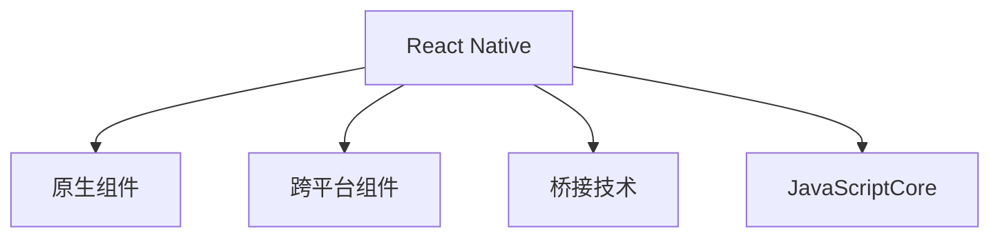

                 

# React Native跨平台移动应用开发

> 关键词：React Native, 跨平台, 移动应用, 前端开发, JavaScript, 安卓, 苹果, 代码复用, 原生性能

## 1. 背景介绍

### 1.1 问题由来

在移动应用开发领域，传统的开发方式主要是针对iOS和Android两大平台分别开发原生应用。这种开发模式具有以下特点：

1. **代码复用性差**：需要分别编写两套代码，开发成本高。
2. **跨平台通信复杂**：通过网络通信或桥接技术进行数据交换，性能较低。
3. **更新和维护困难**：原生应用需要分别发布，更新和维护成本高。
4. **学习成本高**：需要分别学习不同的语言和技术栈，如Objective-C/Swift、Java/Kotlin等。

为了解决这些问题，React Native应运而生。React Native是一个由Facebook开发的开源框架，使用JavaScript和React语法开发移动应用，能够同时运行在iOS和Android平台上。

### 1.2 问题核心关键点

React Native的核心理念是通过一套代码同时实现iOS和Android应用的开发，从而提高开发效率，降低开发成本。具体来说，React Native的核心关键点包括：

- **共享代码库**：通过共享代码库，实现一套代码在iOS和Android平台上的复用。
- **桥接技术**：通过桥接技术，实现JavaScript与原生代码之间的通信和数据交换。
- **原生性能**：通过桥接技术和部分组件的编译，实现与原生应用相当的性能表现。

这些关键点使得React Native成为跨平台移动应用开发的主流技术之一，广泛应用于电商、金融、教育、游戏等多个领域。

## 2. 核心概念与联系

### 2.1 核心概念概述

为了更好地理解React Native的跨平台开发原理，本节将介绍几个密切相关的核心概念：

- **React Native**：由Facebook开发的开源框架，使用JavaScript和React语法开发移动应用，能够同时运行在iOS和Android平台上。
- **原生组件**：原生组件是指iOS和Android平台上的原生UI组件，如导航栏、按钮、滚动视图等。
- **跨平台组件**：跨平台组件是指在React Native中可以同时在iOS和Android平台上使用的组件，如View、Text、Image等。
- **桥接技术**：桥接技术是指React Native中用于实现JavaScript与原生代码之间通信和数据交换的技术。
- **JavaScriptCore**：iOS平台上的JavaScript引擎，负责执行JavaScript代码和桥接原生代码。

这些核心概念之间的逻辑关系可以通过以下Mermaid流程图来展示：



这个流程图展示了几类关键组件及其之间的关系：

1. React Native通过原生组件和跨平台组件构建用户界面。
2. React Native使用桥接技术实现JavaScript与原生代码的通信。
3. 在iOS平台上，JavaScriptCore负责执行JavaScript代码和桥接原生代码。

## 3. 核心算法原理 & 具体操作步骤
### 3.1 算法原理概述

React Native的跨平台开发主要通过以下步骤实现：

1. **组件适配**：将React组件适配为原生组件。
2. **桥接通信**：通过桥接技术实现JavaScript与原生代码的通信。
3. **性能优化**：通过桥接技术和部分组件的编译，实现与原生应用相当的性能表现。

这些步骤使得React Native能够实现一套代码同时在iOS和Android平台上运行，显著提高了开发效率和代码复用性。

### 3.2 算法步骤详解

React Native的跨平台开发一般包括以下几个关键步骤：

**Step 1: 环境搭建**

在iOS和Android平台上分别搭建React Native开发环境。具体步骤如下：

1. **安装Node.js和React Native CLI**：
   ```bash
   npm install -g react-native-cli
   ```

2. **创建新项目**：
   ```bash
   react-native init MyProject
   ```

3. **安装依赖**：
   ```bash
   npm install
   ```

**Step 2: 组件适配**

React Native提供了大量跨平台组件，可以直接在代码中使用。对于需要适配原生组件的场景，可以使用以下方式：

1. **自定义原生组件**：在原生平台编写原生代码，并注册为React Native组件。
2. **使用原生模块**：通过Bridge API调用原生模块，实现更复杂的功能。

例如，创建一个自定义的原生按钮组件：

```js
// 在iOS平台上，创建MyButton.js文件
import React, { Component } from 'react-native';
import { Button } from 'react-native';

class MyButton extends Component {
  onPress() {
    console.log('Button pressed');
  }
  
  render() {
    return (
      <Button title="My Button" onPress={this.onPress} />
    );
  }
}

module.exports = MyButton;

// 在Android平台上，创建MyButton.java文件
package com.example.mynativebutton;

import android.content.Context;
import android.os.Bundle;
import android.view.View;
import android.view.ViewGroup;
import android.widget.Button;
import android.widget.TextView;
import com.facebook.react.bridge.ReactApplicationContext;
import com.facebook.react.uimanager.ThemedReactContext;
import com.facebook.react.uimanager.ViewManager;
import com.facebook.react.uimanager.annotations.ReactProp;

public class MyButtonManager extends ViewManager {
  public static final String REACT_CLASS = "MyButton";

  @Override
  public String getName() {
    return REACT_CLASS;
  }

  @Override
  public void onBeforeMount(View parent, ViewGroup parentViewGroup, ThemedReactContext reactContext) {
    super.onBeforeMount(parent, parentViewGroup, reactContext);
  }

  @Override
  public void onMount(View parent, ThemedReactContext reactContext) {
    super.onMount(parent, reactContext);
  }

  @Override
  public void onUnmount(View parent, ThemedReactContext reactContext) {
    super.onUnmount(parent, reactContext);
  }

  @Override
  public void onLayout(View parent, ThemedReactContext reactContext, int width, int height) {
    super.onLayout(parent, reactContext, width, height);
  }

  @Override
  public void onMeasure(View parent, ThemedReactContext reactContext, int widthMeasureSpec, int heightMeasureSpec) {
    super.onMeasure(parent, reactContext, widthMeasureSpec, heightMeasureSpec);
  }

  @Override
  public void addView(View parent, View child, ThemedReactContext reactContext) {
    super.addView(parent, child, reactContext);
  }

  @Override
  public void removeView(View parent, View child, ThemedReactContext reactContext) {
    super.removeView(parent, child, reactContext);
  }

  @Override
  public void onDropViewsWithNewProperties(ViewGroup parent, ThemedReactContext reactContext, int childId, View child, Bundle newProps) {
    super.onDropViewsWithNewProperties(parent, reactContext, childId, child, newProps);
  }

  @Override
  public void setName(String name) {
    super.setName(name);
  }

  @Override
  public void setTag(int tag) {
    super.setTag(tag);
  }

  @Override
  public int getNativeComponentId() {
    return super.getNativeComponentId();
  }

  @ReactProp(name = "title")
  public void setTitle(View view, String title) {
    ((TextView) view.findViewById(R.id.title)).setText(title);
  }

  @ReactProp(name = "onPress")
  public void setOnPress(View view, View.OnClickEventListener onPress) {
    view.setOnClickListener(onPress);
  }
}
```

然后，在React Native代码中使用自定义的原生按钮组件：

```js
import MyButton from './MyButton';

class App extends Component {
  render() {
    return (
      <MyButton title="My Button" onPress={() => console.log('Button pressed')} />
    );
  }
}

export default App;
```

**Step 3: 桥接通信**

React Native使用桥接技术实现JavaScript与原生代码的通信。具体步骤如下：

1. **定义桥接API**：在原生平台定义桥接API，使用JavaScriptCore执行JavaScript代码。

   ```java
   public class MyBridgeModule extends Module {
       private final static String MY_BRIDGE_METHOD = "myBridgeMethod";
       
       @Override
       public String getName() {
           return "MyBridgeModule";
       }
       
       @ReactMethod
       public void myBridgeMethod(String message, Callback successCallback) {
           successCallback.success(message);
       }
   }
   ```

2. **调用桥接API**：在JavaScript代码中调用桥接API，使用Bridge API进行数据交换。

   ```js
   import { MyBridge } from 'mybridge';
   import { Alert } from 'react-native';

   MyBridge.myBridgeMethod('Hello World', (message) => {
       Alert.alert(message);
   });
   ```

**Step 4: 性能优化**

React Native通过桥接技术和部分组件的编译，实现与原生应用相当的性能表现。具体步骤如下：

1. **使用原生组件**：在需要高性能的场景中，使用原生组件替代跨平台组件。
   
2. **编译部分组件**：将部分组件编译为原生代码，提高性能表现。

   ```js
   import { Text } from 'react-native';

   class MyText extends Component {
       render() {
           return <Text>{this.props.children}</Text>;
       }
   }
   ```

3. **优化代码结构**：使用代码拆分、懒加载等技术，提高应用性能。

### 3.3 算法优缺点

React Native的跨平台开发具有以下优点：

1. **开发效率高**：使用一套代码同时在iOS和Android平台上运行，显著提高了开发效率。
2. **代码复用性好**：共享代码库，减少了重复开发的成本。
3. **性能表现优**：通过桥接技术和部分组件的编译，实现与原生应用相当的性能表现。

同时，React Native也存在一些缺点：

1. **原生组件性能较差**：原生组件的性能表现不及原生应用，尤其是在复杂场景下。
2. **桥接通信开销大**：桥接通信的性能开销较大，可能影响应用响应速度。
3. **学习曲线陡峭**：需要掌握JavaScript、React和原生平台知识，学习曲线陡峭。

尽管存在这些缺点，但React Native的开发效率和代码复用性仍然得到了广泛认可，成为跨平台移动应用开发的主流技术之一。

### 3.4 算法应用领域

React Native广泛应用于电商、金融、教育、游戏等多个领域。以下是几个典型应用场景：

- **电商应用**：如淘宝、京东、拼多多等电商平台，通过React Native实现前端页面和后端数据交互。
- **金融应用**：如支付宝、微信、银联等金融平台，通过React Native实现移动支付、理财、贷款等功能。
- **教育应用**：如知乎、有道云笔记、有道词典等教育平台，通过React Native实现笔记、词典、问答等功能。
- **游戏应用**：如王者荣耀、和平精英、原神等游戏平台，通过React Native实现游戏界面和逻辑。

React Native的高效性和灵活性使其成为跨平台移动应用开发的首选技术，推动了移动应用开发领域的快速进步。

## 4. 数学模型和公式 & 详细讲解 & 举例说明

### 4.1 数学模型构建

本节将使用数学语言对React Native的桥接通信机制进行更加严格的刻画。

记React Native的JavaScript代码为 $J$，原生代码为 $N$。定义桥接API为 $B$，其中 $B: J \rightarrow N$。

在原生平台上，桥接API $B$ 可以将JavaScript代码 $J$ 转换为原生代码 $N$。在JavaScript代码中，可以使用Bridge API $B$ 调用原生代码 $N$。

### 4.2 公式推导过程

以下我们以调用原生模块为例，推导Bridge API的调用公式。

假设原生模块的方法为 $M: N \rightarrow O$，其中 $O$ 为输出参数。

在JavaScript代码中，通过Bridge API $B$ 调用原生模块的方法，其调用公式为：

$$
B(J, O) = M(B(J))
$$

其中 $B(J)$ 表示将JavaScript代码 $J$ 转换为原生代码 $N$，$M(B(J))$ 表示在原生代码 $N$ 上执行方法 $M$ 并返回输出 $O$。

在原生平台上，桥接API $B$ 的实现可以采用以下方式：

1. **转换代码**：将JavaScript代码 $J$ 转换为原生代码 $N$。
2. **执行方法**：在原生代码 $N$ 上执行方法 $M$ 并返回输出 $O$。
3. **返回结果**：将输出 $O$ 转换为JavaScript代码，并通过Bridge API返回。

### 4.3 案例分析与讲解

假设原生模块的方法为 $M: N \rightarrow O$，其代码如下：

```java
public class MyModule {
    public int add(int a, int b) {
        return a + b;
    }
}
```

在JavaScript代码中，通过Bridge API $B$ 调用原生模块的方法，其调用公式为：

$$
B(J, O) = M(B(J))
$$

具体实现步骤如下：

1. **转换代码**：将JavaScript代码 $J$ 转换为原生代码 $N$。
   ```java
   public class MyBridgeModule extends Module {
       private final static String ADD_METHOD = "add";

       @Override
       public String getName() {
           return "MyBridgeModule";
       }

       @ReactMethod
       public int add(int a, int b) {
           return a + b;
       }
   }
   ```

2. **执行方法**：在原生代码 $N$ 上执行方法 $M$ 并返回输出 $O$。
   ```java
   MyModule myModule = new MyModule();
   int result = myModule.add(a, b);
   ```

3. **返回结果**：将输出 $O$ 转换为JavaScript代码，并通过Bridge API返回。
   ```java
   return result;
   ```

## 5. 项目实践：代码实例和详细解释说明

### 5.1 开发环境搭建

在进行React Native项目开发前，我们需要准备好开发环境。以下是使用React Native CLI创建新项目和搭建开发环境的流程：

1. **安装React Native CLI**：
   ```bash
   npm install -g react-native-cli
   ```

2. **创建新项目**：
   ```bash
   react-native init MyProject
   ```

3. **进入项目目录**：
   ```bash
   cd MyProject
   ```

4. **安装依赖**：
   ```bash
   npm install
   ```

完成上述步骤后，即可在项目目录中进行开发工作。

### 5.2 源代码详细实现

下面我们以实现一个简单的React Native组件为例，展示React Native的开发过程。

1. **创建新组件**：
   ```bash
   npx react-native init MyComponent
   ```

2. **编写组件代码**：
   ```js
   import React, { Component } from 'react';
   import { View, Text } from 'react-native';

   class MyComponent extends Component {
       render() {
           return (
               <View>
                   <Text>{this.props.children}</Text>
               </View>
           );
       }
   }

   export default MyComponent;
   ```

3. **注册组件**：
   ```bash
   npx react-native link
   ```

4. **在主应用中使用组件**：
   ```js
   import MyComponent from './MyComponent';

   class App extends Component {
       render() {
           return (
               <MyComponent>{this.props.children}</MyComponent>
           );
       }
   }

   export default App;
   ```

通过以上步骤，我们实现了React Native的一个简单组件，并将其注册到主应用中使用。

### 5.3 代码解读与分析

让我们再详细解读一下关键代码的实现细节：

**MyComponent类**：
- `render`方法：返回一个View组件，内部包含一个Text组件，用于显示传入的children。
- `props.children`：用于接收从父组件传递的子元素。

**MyComponent组件的注册**：
- `npx react-native link`：将组件链接到主应用中，使其可以被引用。

在React Native中，组件的注册和使用方法相对简单，通过一套代码即可实现跨平台开发。

### 5.4 运行结果展示

通过React Native运行我们的应用程序，可以看到以下结果：

```
$ react-native run-ios
# Running app on iOS simulator...
...
```

运行结果显示应用程序已经成功启动在iOS模拟器中，并显示了组件的内容。

## 6. 实际应用场景

### 6.1 智能客服系统

React Native在智能客服系统中得到了广泛应用。传统的客服系统通常采用基于电话或邮件的沟通方式，响应速度慢，客户体验差。React Native的跨平台特性使得客服系统可以快速开发和部署，提升响应速度和客户满意度。

例如，某电商平台的智能客服系统通过React Native实现，支持在线聊天、语音识别和语音合成等功能。用户可以在网页或APP中使用该系统，获得快速响应和高效服务。

### 6.2 金融理财平台

React Native在金融理财平台中也有广泛应用。金融平台需要处理大量的数据和复杂的逻辑，传统原生开发方式需要分别开发iOS和Android应用，成本高、效率低。React Native的跨平台特性使得金融平台可以在短时间内开发出稳定可靠的应用，提升用户体验和业务效率。

例如，某银行理财平台通过React Native实现，支持数据统计、投资分析、理财建议等功能。用户可以通过网页或APP访问该平台，获得个性化的理财服务。

### 6.3 教育学习平台

React Native在教育学习平台中也有广泛应用。教育平台需要处理大量的数据和复杂的逻辑，传统原生开发方式需要分别开发iOS和Android应用，成本高、效率低。React Native的跨平台特性使得教育平台可以在短时间内开发出稳定可靠的应用，提升用户体验和业务效率。

例如，某在线教育平台通过React Native实现，支持课程管理、作业提交、在线测试等功能。学生可以通过网页或APP访问该平台，获得便捷的学习体验。

### 6.4 游戏娱乐平台

React Native在游戏娱乐平台中也有广泛应用。游戏平台需要处理大量的数据和复杂的逻辑，传统原生开发方式需要分别开发iOS和Android应用，成本高、效率低。React Native的跨平台特性使得游戏平台可以在短时间内开发出稳定可靠的应用，提升用户体验和业务效率。

例如，某游戏平台通过React Native实现，支持游戏界面、游戏逻辑、用户数据等功能。用户可以通过网页或APP访问该平台，获得流畅的游戏体验。

## 7. 工具和资源推荐

### 7.1 学习资源推荐

为了帮助开发者系统掌握React Native的开发技能，这里推荐一些优质的学习资源：

1. **《React Native官方文档》**：React Native的官方文档，提供了完整的开发指南、API参考和技术支持，是学习React Native的必备资源。
2. **《React Native开发实战》**：一本全面介绍React Native开发技术的书籍，涵盖React Native的基本概念、组件开发、网络通信、状态管理等内容。
3. **《React Native高级教程》**：面向进阶开发者的教程，涵盖React Native的高级主题、性能优化、开发工具等内容。
4. **《React Native官方博客》**：React Native官方博客，提供了最新的技术动态、开发技巧和社区支持，是学习React Native的权威资源。
5. **《React Native社区教程》**：React Native社区提供的大量教程和资源，涵盖了React Native的各个方面，从入门到进阶都能找到有用的内容。

通过学习这些资源，相信你一定能够掌握React Native的开发技能，并用于解决实际的开发问题。

### 7.2 开发工具推荐

React Native的开发需要使用React和JavaScript等技术，以下是几款用于React Native开发的工具：

1. **Visual Studio Code**：微软开发的轻量级编辑器，支持React和JavaScript的开发，并提供了丰富的扩展和插件。
2. **Xcode**：苹果公司开发的iOS开发工具，支持React Native的开发和调试。
3. **Android Studio**：谷歌公司开发的Android开发工具，支持React Native的开发和调试。
4. **React Developer Tools**：React官方提供的Chrome插件，支持React应用的调试和性能分析。
5. **React Native Debugger**：React Native官方提供的调试工具，支持React Native应用的调试和性能分析。

合理利用这些工具，可以显著提升React Native应用的开发效率和质量。

### 7.3 相关论文推荐

React Native的开发涉及React、JavaScript和原生平台等多方面的知识，以下是几篇奠基性的相关论文，推荐阅读：

1. **React: A JavaScript Library for Building User Interfaces**：React的官方论文，介绍了React的基本概念和技术原理。
2. **React Native: Mobile Development for the Web**：React Native的官方论文，介绍了React Native的基本概念和技术原理。
3. **Developing with React Native**：React Native的官方书籍，全面介绍了React Native的开发技术，包括组件开发、网络通信、状态管理等内容。
4. **JavaScript and TypeScript for Mobile Application Development**：介绍JavaScript和TypeScript在移动应用开发中的应用，涵盖了React Native的开发技术。

这些论文代表了大前端开发技术的发展脉络，阅读这些论文可以全面了解React Native的开发技术，推动自己的技术进步。

## 8. 总结：未来发展趋势与挑战

### 8.1 总结

本文对React Native的跨平台移动应用开发进行了全面系统的介绍。首先阐述了React Native的发展背景和核心概念，明确了React Native在提高开发效率、降低开发成本方面的独特价值。其次，从原理到实践，详细讲解了React Native的开发过程，给出了React Native应用的完整代码实例。同时，本文还广泛探讨了React Native在智能客服、金融理财、教育学习等多个行业领域的应用前景，展示了React Native的广泛适用性和强大的生命力。

通过本文的系统梳理，可以看到，React Native的跨平台开发技术已经成为移动应用开发的重要手段，显著提高了开发效率和代码复用性，推动了移动应用开发领域的快速进步。未来，伴随React Native的不断演进，React Native必将在更多领域得到应用，为移动应用开发带来新的机遇和挑战。

### 8.2 未来发展趋势

展望未来，React Native的跨平台开发技术将呈现以下几个发展趋势：

1. **性能提升**：通过优化代码结构、编译原生组件等方式，进一步提升React Native应用的性能表现。
2. **功能增强**：引入更多的原生组件和第三方库，增强React Native应用的功能性。
3. **平台支持扩展**：支持更多平台和设备，如Web、Windows、macOS等。
4. **生态系统完善**：进一步完善React Native的生态系统，引入更多的开发者和应用案例。
5. **开发工具优化**：优化开发工具和开发环境，提升React Native应用的开发效率和质量。

这些趋势将推动React Native技术的发展和应用，使其成为移动应用开发领域的重要技术之一。

### 8.3 面临的挑战

尽管React Native的跨平台开发技术已经取得了一定的成功，但在迈向更加智能化、普适化应用的过程中，仍面临诸多挑战：

1. **性能瓶颈**：React Native的性能表现仍有待提升，尤其是在复杂场景下。
2. **原生组件优化**：原生组件的性能表现不及原生应用，尤其是在复杂场景下。
3. **桥接通信开销**：桥接通信的性能开销较大，可能影响应用响应速度。
4. **学习曲线陡峭**：需要掌握JavaScript、React和原生平台知识，学习曲线陡峭。

尽管存在这些挑战，但React Native的开发效率和代码复用性仍然得到了广泛认可，成为跨平台移动应用开发的主流技术之一。

### 8.4 研究展望

面对React Native面临的挑战，未来的研究需要在以下几个方面寻求新的突破：

1. **性能优化**：通过优化代码结构、编译原生组件等方式，进一步提升React Native应用的性能表现。
2. **原生组件增强**：引入更多的原生组件和第三方库，增强React Native应用的功能性。
3. **平台支持扩展**：支持更多平台和设备，如Web、Windows、macOS等。
4. **开发工具优化**：优化开发工具和开发环境，提升React Native应用的开发效率和质量。
5. **新技术融合**：与AI、AR、VR等新技术融合，拓展React Native应用的功能和场景。

这些研究方向的探索，将引领React Native技术迈向更高的台阶，为构建智能化的移动应用提供新的动力。面向未来，React Native技术还需要与其他新技术进行更深入的融合，推动移动应用开发领域的进步。

## 9. 附录：常见问题与解答

**Q1：React Native和原生应用的区别是什么？**

A: React Native和原生应用的主要区别在于开发方式和代码复用性。React Native使用JavaScript和React语法开发，可以在iOS和Android平台上同时运行，显著提高了开发效率和代码复用性。而原生应用需要分别开发iOS和Android应用，成本高、效率低。

**Q2：React Native的性能表现如何？**

A: React Native的性能表现与原生应用相比仍有差距，尤其是在复杂场景下。React Native的桥接通信和组件渲染开销较大，可能影响应用响应速度。但是，通过优化代码结构、编译原生组件等方式，可以进一步提升React Native应用的性能表现。

**Q3：React Native的学习曲线陡峭吗？**

A: React Native的学习曲线相对陡峭，需要掌握JavaScript、React和原生平台知识。但是，React Native的开发效率和代码复用性得到了广泛认可，可以显著降低开发成本。同时，React Native的社区和文档资源丰富，开发者可以通过学习资源快速上手。

**Q4：React Native能否支持更多平台和设备？**

A: React Native目前支持iOS和Android平台，未来有望支持更多平台和设备，如Web、Windows、macOS等。React Native的跨平台特性将进一步拓展其应用范围，推动移动应用开发领域的进步。

**Q5：React Native的生态系统完善吗？**

A: React Native的生态系统正在逐步完善，拥有丰富的组件和第三方库。但是，React Native的生态系统仍有待进一步拓展，引入更多的开发者和应用案例。React Native的生态系统完善将进一步推动React Native技术的发展和应用。

总之，React Native的跨平台开发技术已经成为移动应用开发的重要手段，显著提高了开发效率和代码复用性。虽然面临一些挑战，但通过不断的优化和完善，React Native必将在更多领域得到应用，为移动应用开发带来新的机遇和挑战。

