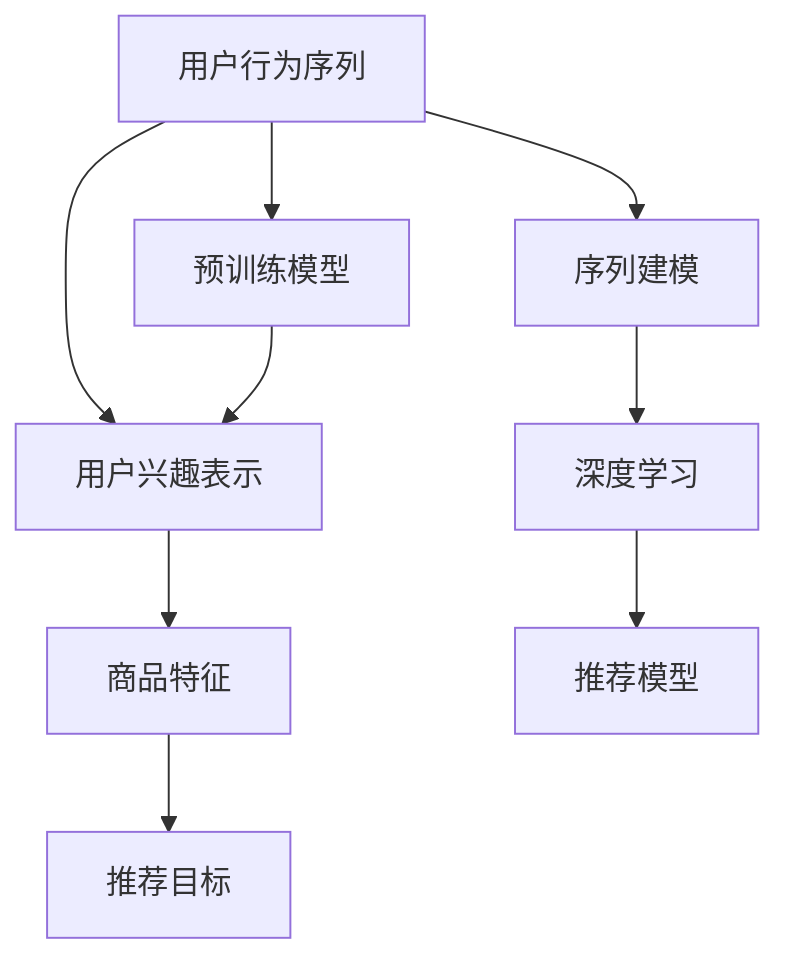

                 

# Recommendation as Language Processing的新范式

> 关键词：推荐系统,语言处理,深度学习,序列建模,预训练模型,自然语言理解

## 1. 背景介绍

### 1.1 问题由来
推荐系统（Recommendation System）是电子商务、内容分发、在线广告等领域的核心技术之一，其目的是根据用户的历史行为、兴趣偏好等数据，为其推荐可能感兴趣的商品、内容或服务。传统推荐系统往往依赖于用户行为数据的特征工程，通过手工设计特征进行模型训练和预测。然而，这种基于特征工程的推荐方法存在诸多局限：

1. 数据依赖性强。需要收集和标注大量用户行为数据，工作量巨大。
2. 特征维度高。用户行为特征通常维数较高，难以手工处理。
3. 特征工程复杂。手工设计特征需要丰富的领域知识，容易陷入“特征工程陷阱”。
4. 实时性差。特征工程和模型训练过程耗时较长，难以实时响应用户请求。

因此，传统推荐系统逐渐向更加自动化、可解释性强的推荐方法演进。近年来，自然语言处理（Natural Language Processing, NLP）与深度学习技术的结合，为推荐系统注入了新的活力。通过语言处理，推荐系统能够从文本中自动提取用户兴趣和行为信息，提升推荐效果。基于语言处理的推荐系统，逐渐成为一种新的推荐范式。

### 1.2 问题核心关键点
本节将详细阐述基于语言处理的推荐系统，尤其是预训练模型在推荐系统中的应用，探讨其核心原理、算法步骤和实际应用。

- 预训练模型：指在大规模无标签文本数据上，通过自监督学习任务训练得到的语言模型，如BERT、GPT等。
- 推荐系统：通过用户文本数据进行特征提取和模型训练，自动推荐用户可能感兴趣的商品、内容或服务。
- 序列建模：将用户行为序列建模，利用语言处理技术提取序列中的关键特征，提升推荐效果。
- 深度学习：基于神经网络的深度学习方法，能够高效处理大规模数据，自动学习特征表示。

## 2. 核心概念与联系

### 2.1 核心概念概述

为更好地理解基于语言处理的推荐系统，本节将介绍几个关键概念及其之间的联系：

- 用户行为序列（User Behavior Sequences）：指用户在电子商务网站、内容平台等交互过程中产生的行为记录，如浏览、点击、购买等。
- 用户兴趣表示（User Interest Representation）：指从用户行为序列中提取出的兴趣偏好和行为模式，如浏览的类别、点击的页面、购买的商品等。
- 商品特征（Item Features）：指商品的属性信息，如价格、评分、标签等。
- 推荐目标（Recommendation Objective）：指推荐系统希望达到的优化目标，如最大化用户满意度、最大化商业收益等。

这些概念之间的逻辑关系可以通过以下Mermaid流程图来展示：



这个流程图展示了基于语言处理的推荐系统的工作原理：

1. 从用户行为序列中提取用户兴趣。
2. 基于用户兴趣，从商品特征库中筛选相关商品。
3. 通过推荐目标优化，选择最合适的商品推荐给用户。
4. 预训练模型作为特征提取器，提升推荐效果。
5. 序列建模和深度学习方法，自动学习用户行为序列中的关键特征。

## 3. 核心算法原理 & 具体操作步骤
### 3.1 算法原理概述

基于语言处理的推荐系统，本质上是一种深度学习模型，通过自然语言理解技术，从用户行为序列中提取特征，实现个性化推荐。其核心思想是：将用户行为序列视作文本数据，利用预训练模型提取文本特征，结合深度学习算法，学习用户兴趣和行为模式，从而实现精准推荐。

形式化地，假设用户行为序列为 $S=\{x_t\}_{t=1}^T$，其中 $x_t$ 为第 $t$ 个行为记录。推荐系统的目标为在给定用户行为序列 $S$ 和商品特征库 $C=\{c_i\}_{i=1}^M$ 的情况下，最大化推荐效果 $f(S,C)$。

### 3.2 算法步骤详解

基于语言处理的推荐系统一般包括以下几个关键步骤：

**Step 1: 准备预训练模型和数据集**
- 选择合适的预训练语言模型 $M_{\theta}$ 作为初始化参数，如 BERT、GPT等。
- 准备用户行为序列和商品特征的数据集 $D$，划分为训练集、验证集和测试集。一般要求标注数据与预训练数据的分布不要差异过大。

**Step 2: 添加任务适配层**
- 根据推荐任务类型，在预训练模型顶层设计合适的输出层和损失函数。
- 对于推荐任务，通常在顶层添加线性回归层和均方误差损失函数。
- 对于召回任务，通常使用逻辑回归层和交叉熵损失函数。

**Step 3: 设置推荐超参数**
- 选择合适的优化算法及其参数，如 Adam、SGD 等，设置学习率、批大小、迭代轮数等。
- 设置正则化技术及强度，包括权重衰减、Dropout、Early Stopping 等。
- 确定冻结预训练参数的策略，如仅微调顶层，或全部参数都参与微调。

**Step 4: 执行梯度训练**
- 将训练集数据分批次输入模型，前向传播计算损失函数。
- 反向传播计算参数梯度，根据设定的优化算法和学习率更新模型参数。
- 周期性在验证集上评估模型性能，根据性能指标决定是否触发 Early Stopping。
- 重复上述步骤直到满足预设的迭代轮数或 Early Stopping 条件。

**Step 5: 测试和部署**
- 在测试集上评估推荐模型 $M_{\hat{\theta}}$ 的性能，对比微调前后的效果提升。
- 使用推荐模型对新用户行为序列进行预测，集成到实际的应用系统中。
- 持续收集新的用户行为数据，定期重新微调模型，以适应数据分布的变化。

以上是基于语言处理的推荐系统的一般流程。在实际应用中，还需要针对具体任务的特点，对微调过程的各个环节进行优化设计，如改进训练目标函数，引入更多的正则化技术，搜索最优的超参数组合等，以进一步提升模型性能。

### 3.3 算法优缺点

基于语言处理的推荐系统具有以下优点：

1. 自动化特征提取。利用预训练语言模型自动提取用户行为序列中的关键特征，无需手工设计特征。
2. 泛化能力强。预训练模型在大规模数据上学习到丰富的语言知识，具备较强的泛化能力，能够较好适应不同领域的推荐任务。
3. 推荐效果优秀。通过深度学习技术，提升推荐模型的性能和精准度。
4. 高效灵活。深度学习模型具有高效处理大规模数据的能力，能够快速响应实时推荐需求。

同时，该方法也存在一些局限性：

1. 对数据质量要求高。预训练模型需要高质量、大规模的文本数据进行训练，数据获取成本较高。
2. 模型复杂度高。深度学习模型参数量较大，训练和推理过程较为复杂。
3. 鲁棒性不足。推荐模型容易受到输入数据扰动的影响，需要进一步提升模型的鲁棒性。
4. 计算资源需求高。深度学习模型对计算资源和存储资源有较高要求，需要较大的算力支持。

尽管存在这些局限性，但基于语言处理的推荐系统仍然是目前推荐技术的重要方向，尤其在处理大规模、实时化推荐任务时，具备显著的优势。未来相关研究的重点在于如何进一步降低预训练模型的数据需求，提高模型的泛化能力和鲁棒性，同时兼顾计算效率和资源消耗。

### 3.4 算法应用领域

基于语言处理的推荐系统已经在电商推荐、内容推荐、广告推荐等众多领域得到广泛应用，具体包括：

- 电商推荐：根据用户浏览、点击、购买等行为记录，推荐可能感兴趣的商品。
- 内容推荐：根据用户阅读、点赞、评论等行为记录，推荐可能感兴趣的文章、视频等。
- 广告推荐：根据用户行为数据，推荐可能感兴趣的广告位和广告内容。
- 社交推荐：根据用户社交网络数据，推荐可能感兴趣的朋友、群组等。
- 个性化推荐：根据用户行为数据，推荐可能感兴趣的商品、内容或服务。

除了这些经典任务外，基于语言处理的推荐系统也被创新性地应用到更多场景中，如可控推荐、多目标推荐、情感推荐等，为推荐技术带来了全新的突破。随着预训练模型和推荐方法的不断进步，相信推荐系统将在更广阔的应用领域大放异彩。

## 4. 数学模型和公式 & 详细讲解  
### 4.1 数学模型构建

本节将使用数学语言对基于语言处理的推荐系统进行更加严格的刻画。

记用户行为序列为 $S=\{x_t\}_{t=1}^T$，商品特征库为 $C=\{c_i\}_{i=1}^M$，推荐目标为 $f(S,C)$。假设推荐模型为 $M_{\theta}=\{x_{pred}\}_{t=1}^T$，其中 $x_{pred}$ 为模型预测的用户行为序列。

定义推荐模型在数据样本 $(x,y)$ 上的损失函数为 $\ell(M_{\theta}(x),y)$，则在数据集 $D$ 上的经验风险为：

$$
\mathcal{L}(\theta) = \frac{1}{N} \sum_{i=1}^N \ell(M_{\theta}(x_i),y_i)
$$

其中 $\ell$ 为针对推荐任务设计的损失函数，用于衡量模型预测输出与真实标签之间的差异。常见的损失函数包括均方误差损失、交叉熵损失等。

### 4.2 公式推导过程

以下我们以电商推荐任务为例，推导基于用户行为序列的推荐损失函数及其梯度的计算公式。

假设模型 $M_{\theta}$ 在输入 $S$ 上的输出为 $x_{pred}=(x_{pred_t})_{t=1}^T$，表示模型预测的用户行为序列。真实标签 $y$ 为购物车中的商品序列 $y=(y_t)_{t=1}^T$。则推荐损失函数定义为：

$$
\ell(M_{\theta}(S),y) = \frac{1}{T} \sum_{t=1}^T \|x_{pred_t}-y_t\|_2^2
$$

将其代入经验风险公式，得：

$$
\mathcal{L}(\theta) = \frac{1}{N} \sum_{i=1}^N \frac{1}{T} \sum_{t=1}^T \|x_{pred_{i,t}}-y_{i,t}\|_2^2
$$

根据链式法则，损失函数对参数 $\theta_k$ 的梯度为：

$$
\frac{\partial \mathcal{L}(\theta)}{\partial \theta_k} = \frac{1}{N} \sum_{i=1}^N \frac{1}{T} \sum_{t=1}^T \frac{\partial x_{pred_{i,t}}}{\partial \theta_k} \cdot 2(x_{pred_{i,t}}-y_{i,t})
$$

其中 $\frac{\partial x_{pred_{i,t}}}{\partial \theta_k}$ 可进一步递归展开，利用自动微分技术完成计算。

在得到损失函数的梯度后，即可带入参数更新公式，完成模型的迭代优化。重复上述过程直至收敛，最终得到适应电商推荐任务的最优模型参数 $\theta^*$。

## 5. 项目实践：代码实例和详细解释说明
### 5.1 开发环境搭建

在进行推荐系统开发前，我们需要准备好开发环境。以下是使用Python进行PyTorch开发的环境配置流程：

1. 安装Anaconda：从官网下载并安装Anaconda，用于创建独立的Python环境。

2. 创建并激活虚拟环境：
```bash
conda create -n recommendation-env python=3.8 
conda activate recommendation-env
```

3. 安装PyTorch：根据CUDA版本，从官网获取对应的安装命令。例如：
```bash
conda install pytorch torchvision torchaudio cudatoolkit=11.1 -c pytorch -c conda-forge
```

4. 安装Transformers库：
```bash
pip install transformers
```

5. 安装各类工具包：
```bash
pip install numpy pandas scikit-learn matplotlib tqdm jupyter notebook ipython
```

完成上述步骤后，即可在`recommendation-env`环境中开始推荐系统开发。

### 5.2 源代码详细实现

下面我们以电商推荐任务为例，给出使用Transformers库对BERT模型进行电商推荐系统微调的PyTorch代码实现。

首先，定义电商推荐任务的数据处理函数：

```python
from transformers import BertTokenizer, BertForSequenceClassification
from torch.utils.data import Dataset
import torch

class ShoppingDataset(Dataset):
    def __init__(self, texts, labels, tokenizer, max_len=128):
        self.texts = texts
        self.labels = labels
        self.tokenizer = tokenizer
        self.max_len = max_len
        
    def __len__(self):
        return len(self.texts)
    
    def __getitem__(self, item):
        text = self.texts[item]
        label = self.labels[item]
        
        encoding = self.tokenizer(text, return_tensors='pt', max_length=self.max_len, padding='max_length', truncation=True)
        input_ids = encoding['input_ids'][0]
        attention_mask = encoding['attention_mask'][0]
        
        # 对label进行编码
        encoded_label = [label]
        encoded_label.extend([0] * (self.max_len - len(encoded_label)))
        labels = torch.tensor(encoded_label, dtype=torch.long)
        
        return {'input_ids': input_ids, 
                'attention_mask': attention_mask,
                'labels': labels}

# 标签与id的映射
label2id = {'buy': 0, 'ignore': 1}
id2label = {v: k for k, v in label2id.items()}

# 创建dataset
tokenizer = BertTokenizer.from_pretrained('bert-base-cased')

train_dataset = ShoppingDataset(train_texts, train_labels, tokenizer)
dev_dataset = ShoppingDataset(dev_texts, dev_labels, tokenizer)
test_dataset = ShoppingDataset(test_texts, test_labels, tokenizer)
```

然后，定义模型和优化器：

```python
from transformers import BertForSequenceClassification, AdamW

model = BertForSequenceClassification.from_pretrained('bert-base-cased', num_labels=len(label2id))

optimizer = AdamW(model.parameters(), lr=2e-5)
```

接着，定义训练和评估函数：

```python
from torch.utils.data import DataLoader
from tqdm import tqdm
from sklearn.metrics import classification_report

device = torch.device('cuda') if torch.cuda.is_available() else torch.device('cpu')
model.to(device)

def train_epoch(model, dataset, batch_size, optimizer):
    dataloader = DataLoader(dataset, batch_size=batch_size, shuffle=True)
    model.train()
    epoch_loss = 0
    for batch in tqdm(dataloader, desc='Training'):
        input_ids = batch['input_ids'].to(device)
        attention_mask = batch['attention_mask'].to(device)
        labels = batch['labels'].to(device)
        model.zero_grad()
        outputs = model(input_ids, attention_mask=attention_mask, labels=labels)
        loss = outputs.loss
        epoch_loss += loss.item()
        loss.backward()
        optimizer.step()
    return epoch_loss / len(dataloader)

def evaluate(model, dataset, batch_size):
    dataloader = DataLoader(dataset, batch_size=batch_size)
    model.eval()
    preds, labels = [], []
    with torch.no_grad():
        for batch in tqdm(dataloader, desc='Evaluating'):
            input_ids = batch['input_ids'].to(device)
            attention_mask = batch['attention_mask'].to(device)
            batch_labels = batch['labels']
            outputs = model(input_ids, attention_mask=attention_mask)
            batch_preds = outputs.logits.argmax(dim=2).to('cpu').tolist()
            batch_labels = batch_labels.to('cpu').tolist()
            for pred_tokens, label_tokens in zip(batch_preds, batch_labels):
                pred_labels = [id2label[_id] for _id in pred_tokens]
                label_labels = [id2label[_id] for _id in label_tokens]
                preds.append(pred_labels[:len(label_labels)])
                labels.append(label_labels)
                
    print(classification_report(labels, preds))
```

最后，启动训练流程并在测试集上评估：

```python
epochs = 5
batch_size = 16

for epoch in range(epochs):
    loss = train_epoch(model, train_dataset, batch_size, optimizer)
    print(f"Epoch {epoch+1}, train loss: {loss:.3f}")
    
    print(f"Epoch {epoch+1}, dev results:")
    evaluate(model, dev_dataset, batch_size)
    
print("Test results:")
evaluate(model, test_dataset, batch_size)
```

以上就是使用PyTorch对BERT进行电商推荐系统微调的完整代码实现。可以看到，得益于Transformers库的强大封装，我们可以用相对简洁的代码完成BERT模型的加载和微调。

### 5.3 代码解读与分析

让我们再详细解读一下关键代码的实现细节：

**ShoppingDataset类**：
- `__init__`方法：初始化文本、标签、分词器等关键组件。
- `__len__`方法：返回数据集的样本数量。
- `__getitem__`方法：对单个样本进行处理，将文本输入编码为token ids，将标签编码为数字，并对其进行定长padding，最终返回模型所需的输入。

**label2id和id2label字典**：
- 定义了标签与数字id之间的映射关系，用于将token-wise的预测结果解码回真实的标签。

**训练和评估函数**：
- 使用PyTorch的DataLoader对数据集进行批次化加载，供模型训练和推理使用。
- 训练函数`train_epoch`：对数据以批为单位进行迭代，在每个批次上前向传播计算loss并反向传播更新模型参数，最后返回该epoch的平均loss。
- 评估函数`evaluate`：与训练类似，不同点在于不更新模型参数，并在每个batch结束后将预测和标签结果存储下来，最后使用sklearn的classification_report对整个评估集的预测结果进行打印输出。

**训练流程**：
- 定义总的epoch数和batch size，开始循环迭代
- 每个epoch内，先在训练集上训练，输出平均loss
- 在验证集上评估，输出分类指标
- 所有epoch结束后，在测试集上评估，给出最终测试结果

可以看到，PyTorch配合Transformers库使得BERT微调的代码实现变得简洁高效。开发者可以将更多精力放在数据处理、模型改进等高层逻辑上，而不必过多关注底层的实现细节。

当然，工业级的系统实现还需考虑更多因素，如模型的保存和部署、超参数的自动搜索、更灵活的任务适配层等。但核心的推荐范式基本与此类似。

## 6. 实际应用场景
### 6.1 智能客服系统

基于语言处理的推荐系统，可以广泛应用于智能客服系统的构建。传统客服往往需要配备大量人力，高峰期响应缓慢，且一致性和专业性难以保证。而使用基于语言处理的推荐系统，可以7x24小时不间断服务，快速响应客户咨询，用自然流畅的语言解答各类常见问题。

在技术实现上，可以收集企业内部的历史客服对话记录，将问题和最佳答复构建成监督数据，在此基础上对预训练推荐系统进行微调。微调后的推荐系统能够自动理解用户意图，匹配最合适的答复模板进行回复。对于客户提出的新问题，还可以接入检索系统实时搜索相关内容，动态组织生成回答。如此构建的智能客服系统，能大幅提升客户咨询体验和问题解决效率。

### 6.2 金融舆情监测

金融机构需要实时监测市场舆论动向，以便及时应对负面信息传播，规避金融风险。传统的人工监测方式成本高、效率低，难以应对网络时代海量信息爆发的挑战。基于语言处理的推荐系统，可以实现金融舆情监测的新解决方案。

具体而言，可以收集金融领域相关的新闻、报道、评论等文本数据，并对其进行主题标注和情感标注。在此基础上对预训练语言模型进行微调，使其能够自动判断文本属于何种主题，情感倾向是正面、中性还是负面。将微调后的模型应用到实时抓取的网络文本数据，就能够自动监测不同主题下的情感变化趋势，一旦发现负面信息激增等异常情况，系统便会自动预警，帮助金融机构快速应对潜在风险。

### 6.3 个性化推荐系统

当前的推荐系统往往只依赖用户的历史行为数据进行物品推荐，无法深入理解用户的真实兴趣偏好。基于语言处理的推荐系统，可以更好地挖掘用户行为背后的语义信息，从而提供更精准、多样的推荐内容。

在实践中，可以收集用户浏览、点击、评论、分享等行为数据，提取和用户交互的物品标题、描述、标签等文本内容。将文本内容作为模型输入，用户的后续行为（如是否点击、购买等）作为监督信号，在此基础上微调预训练语言模型。微调后的模型能够从文本内容中准确把握用户的兴趣点。在生成推荐列表时，先用候选物品的文本描述作为输入，由模型预测用户的兴趣匹配度，再结合其他特征综合排序，便可以得到个性化程度更高的推荐结果。

### 6.4 未来应用展望

随着语言处理技术和大规模预训练模型的发展，基于语言处理的推荐系统将呈现出更多的应用场景，为各行各业带来新的变革。

在智慧医疗领域，基于语言处理的推荐系统可以推荐合适的医疗信息、专家咨询、药物方案等，提升医疗服务的智能化水平，辅助医生诊疗，加速新药开发进程。

在智能教育领域，语言处理推荐系统可以实现作业批改、学情分析、知识推荐等功能，因材施教，促进教育公平，提高教学质量。

在智慧城市治理中，语言处理推荐系统可以用于事件监测、舆情分析、应急指挥等环节，提高城市管理的自动化和智能化水平，构建更安全、高效的未来城市。

此外，在企业生产、社会治理、文娱传媒等众多领域，基于语言处理的推荐系统也将不断涌现，为传统行业数字化转型升级提供新的技术路径。相信随着技术的日益成熟，推荐系统必将在更广阔的应用领域大放异彩，深刻影响人类的生产生活方式。

## 7. 工具和资源推荐
### 7.1 学习资源推荐

为了帮助开发者系统掌握语言处理推荐系统的理论基础和实践技巧，这里推荐一些优质的学习资源：

1. 《深度学习推荐系统》书籍：系统介绍了推荐系统的基本原理和深度学习技术，适合初学者和中级读者。
2. 《Recommender Systems: Algorithms, Applications and Recommendations》课程：斯坦福大学开设的推荐系统课程，涵盖了推荐系统的主要算法和技术。
3. 《深度学习基础》课程：国内顶尖大学提供的深度学习课程，适合对推荐系统感兴趣的开发者。
4. 《Recommendation Systems in Action》书籍：实用指南，介绍了多种推荐算法的实现方法和实际案例。
5. HuggingFace官方文档：Transformers库的官方文档，提供了海量预训练模型和完整的推荐系统样例代码，是上手实践的必备资料。

通过对这些资源的学习实践，相信你一定能够快速掌握语言处理推荐系统的精髓，并用于解决实际的推荐问题。
###  7.2 开发工具推荐

高效的开发离不开优秀的工具支持。以下是几款用于语言处理推荐系统开发的常用工具：

1. PyTorch：基于Python的开源深度学习框架，灵活动态的计算图，适合快速迭代研究。大部分预训练语言模型都有PyTorch版本的实现。
2. TensorFlow：由Google主导开发的开源深度学习框架，生产部署方便，适合大规模工程应用。同样有丰富的预训练语言模型资源。
3. Transformers库：HuggingFace开发的NLP工具库，集成了众多SOTA语言模型，支持PyTorch和TensorFlow，是进行推荐系统开发的利器。
4. Weights & Biases：模型训练的实验跟踪工具，可以记录和可视化模型训练过程中的各项指标，方便对比和调优。与主流深度学习框架无缝集成。
5. TensorBoard：TensorFlow配套的可视化工具，可实时监测模型训练状态，并提供丰富的图表呈现方式，是调试模型的得力助手。
6. Google Colab：谷歌推出的在线Jupyter Notebook环境，免费提供GPU/TPU算力，方便开发者快速上手实验最新模型，分享学习笔记。

合理利用这些工具，可以显著提升语言处理推荐系统的开发效率，加快创新迭代的步伐。

### 7.3 相关论文推荐

语言处理推荐系统的发展源于学界的持续研究。以下是几篇奠基性的相关论文，推荐阅读：

1. Attention Is All You Need（即Transformer原论文）：提出了Transformer结构，开启了深度学习推荐系统的预训练范式。
2. Neural Collaborative Filtering（NCF）: A Model-based Approach for Recommender Systems: NCF模型：提出基于深度神经网络的推荐算法，取得了推荐系统SOTA。
3. Multi-Task Learning from Massive Text Data: A Novel Recommender System Framework：利用多任务学习从大规模文本数据中学习推荐模型。
4. Deep Learning for Recommendation Engines：综述了深度学习在推荐系统中的应用，介绍了多种深度学习推荐模型。
5. Vector Space Approach to Information Retrieval: A Survey: 综述了基于向量空间的推荐算法，介绍了多种特征工程和推荐算法。

这些论文代表了大规模推荐系统的核心研究进展，通过学习这些前沿成果，可以帮助研究者把握学科前进方向，激发更多的创新灵感。

## 8. 总结：未来发展趋势与挑战

### 8.1 总结

本文对基于语言处理的推荐系统进行了全面系统的介绍。首先阐述了语言处理推荐系统的研究背景和意义，明确了推荐系统中的核心概念和推荐原理。其次，从原理到实践，详细讲解了推荐系统的数学模型和算法步骤，给出了推荐系统开发的完整代码实例。同时，本文还广泛探讨了推荐系统在智能客服、金融舆情、个性化推荐等多个领域的应用前景，展示了语言处理推荐系统的巨大潜力。此外，本文精选了推荐系统的各类学习资源，力求为读者提供全方位的技术指引。

通过本文的系统梳理，可以看到，基于语言处理的推荐系统正在成为推荐技术的重要方向，极大地拓展了预训练语言模型的应用边界，催生了更多的落地场景。得益于大规模预训练语言模型的强大能力，语言处理推荐系统能够在无需手工设计特征的情况下，从文本数据中自动提取关键信息，提升推荐效果。未来，伴随预训练语言模型和推荐方法的不断进步，相信推荐系统将在更广阔的应用领域大放异彩，深刻影响人类的生产生活方式。

### 8.2 未来发展趋势

展望未来，语言处理推荐系统将呈现以下几个发展趋势：

1. 模型规模持续增大。随着算力成本的下降和数据规模的扩张，预训练语言模型的参数量还将持续增长。超大规模语言模型蕴含的丰富语言知识，有望支撑更加复杂多变的推荐任务。
2. 推荐方法日趋多样。除了传统的基于序列的推荐方法外，未来会涌现更多基于图、知识图谱的推荐方法，提升推荐效果的泛化性和鲁棒性。
3. 实时性提升。通过分布式训练和推理技术，语言处理推荐系统将实现更高的实时响应能力，满足用户实时推荐需求。
4. 用户交互增强。通过多轮对话技术，语言处理推荐系统能够实现与用户的深度互动，提升用户体验。
5. 多模态推荐崛起。当前的推荐系统往往只考虑文本数据，未来会进一步拓展到图像、视频、语音等多模态数据推荐。多模态信息的融合，将显著提升推荐系统的智能水平和用户体验。
6. 个性化推荐强化。通过深度学习技术，推荐系统能够更好地理解用户的个性化需求，实现更加精准、多样化的推荐。

这些趋势凸显了语言处理推荐系统的广阔前景。这些方向的探索发展，必将进一步提升推荐系统的性能和用户体验，为推荐技术带来新的突破。

### 8.3 面临的挑战

尽管语言处理推荐系统已经取得了瞩目成就，但在迈向更加智能化、普适化应用的过程中，它仍面临着诸多挑战：

1. 数据依赖性强。预训练语言模型需要高质量、大规模的文本数据进行训练，数据获取成本较高。
2. 模型复杂度高。深度学习模型参数量较大，训练和推理过程较为复杂。
3. 鲁棒性不足。推荐模型容易受到输入数据扰动的影响，需要进一步提升模型的鲁棒性。
4. 计算资源需求高。深度学习模型对计算资源和存储资源有较高要求，需要较大的算力支持。
5. 可解释性不足。推荐模型通常缺乏可解释性，难以对其决策过程进行分析和调试。
6. 安全性有待保障。预训练语言模型难免会学习到有偏见、有害的信息，需要通过模型筛选和规则约束，确保输出的安全性。

尽管存在这些挑战，但语言处理推荐系统仍然是目前推荐技术的重要方向，尤其在处理大规模、实时化推荐任务时，具备显著的优势。未来相关研究的重点在于如何进一步降低预训练模型的数据需求，提高模型的泛化能力和鲁棒性，同时兼顾计算效率和资源消耗。

### 8.4 研究展望

面对语言处理推荐系统所面临的种种挑战，未来的研究需要在以下几个方面寻求新的突破：

1. 探索无监督和半监督推荐方法。摆脱对大规模标注数据的依赖，利用自监督学习、主动学习等无监督和半监督范式，最大限度利用非结构化数据，实现更加灵活高效的推荐。
2. 研究参数高效和计算高效的推荐方法。开发更加参数高效的推荐方法，在固定大部分预训练参数的同时，只更新极少量的任务相关参数。同时优化推荐模型的计算图，减少前向传播和反向传播的资源消耗，实现更加轻量级、实时性的部署。
3. 融合因果和对比学习范式。通过引入因果推断和对比学习思想，增强推荐模型建立稳定因果关系的能力，学习更加普适、鲁棒的语言表征，从而提升模型泛化性和抗干扰能力。
4. 引入更多先验知识。将符号化的先验知识，如知识图谱、逻辑规则等，与神经网络模型进行巧妙融合，引导推荐过程学习更准确、合理的语言模型。同时加强不同模态数据的整合，实现视觉、语音等多模态信息与文本信息的协同建模。
5. 结合因果分析和博弈论工具。将因果分析方法引入推荐模型，识别出模型决策的关键特征，增强输出解释的因果性和逻辑性。借助博弈论工具刻画人机交互过程，主动探索并规避模型的脆弱点，提高系统稳定性。
6. 纳入伦理道德约束。在模型训练目标中引入伦理导向的评估指标，过滤和惩罚有偏见、有害的输出倾向。同时加强人工干预和审核，建立模型行为的监管机制，确保输出符合人类价值观和伦理道德。

这些研究方向的探索，必将引领语言处理推荐系统技术迈向更高的台阶，为构建安全、可靠、可解释、可控的智能系统铺平道路。面向未来，语言处理推荐系统还需要与其他人工智能技术进行更深入的融合，如知识表示、因果推理、强化学习等，多路径协同发力，共同推动推荐技术的发展和应用。只有勇于创新、敢于突破，才能不断拓展推荐系统的边界，让智能技术更好地造福人类社会。

## 9. 附录：常见问题与解答
**Q1：语言处理推荐系统是否适用于所有推荐任务？**

A: 语言处理推荐系统在大多数推荐任务上都能取得不错的效果，特别是对于数据量较小的任务。但对于一些特定领域的任务，如医学、法律等，仅仅依靠通用语料预训练的模型可能难以很好地适应。此时需要在特定领域语料上进一步预训练，再进行微调，才能获得理想效果。此外，对于一些需要时效性、个性化很强的任务，如对话、推荐等，语言处理推荐方法也需要针对性的改进优化。

**Q2：推荐系统如何优化推荐目标？**

A: 推荐系统的推荐目标可以通过不同的优化指标来定义，如最大化用户满意度、最大化商业收益等。在训练过程中，通过定义适当的损失函数，对推荐模型进行优化。常见的优化目标函数包括均方误差损失、交叉熵损失等。同时，可以通过A/B测试等手段，评估不同目标函数对推荐效果的影响，选择最优的目标函数。

**Q3：推荐系统如何缓解冷启动问题？**

A: 冷启动问题是指在推荐系统中，用户没有足够的行为数据，难以进行有效推荐。为缓解冷启动问题，可以采用以下方法：
1. 用户画像建模：通过用户的个人信息、社交网络等数据，建立用户画像，用于预测用户兴趣。
2. 物品推荐榜：为新物品推荐，可以基于热门物品或热门标签等进行推荐。
3. 推荐榜榜首推荐：为新用户推荐，可以通过热门物品或热门标签等进行推荐。
4. 推荐榜榜尾推荐：为新物品推荐，可以基于热门物品或热门标签等进行推荐。

这些方法可以在一定程度上缓解冷启动问题，提升推荐系统的性能和用户满意度。

**Q4：推荐系统如何处理用户隐私问题？**

A: 推荐系统在处理用户数据时，需要严格遵守隐私保护法规，如GDPR、CCPA等。为保护用户隐私，可以采用以下方法：
1. 匿名化处理：对用户数据进行匿名化处理，保护用户隐私。
2. 用户数据控制：提供给用户控制自身数据的权利，如数据删除、数据导出等。
3. 数据访问限制：仅在用户授权的情况下，访问和使用用户数据。
4. 数据加密：对用户数据进行加密处理，保护数据安全。

这些方法可以在一定程度上保护用户隐私，提升推荐系统的可信度和安全性。

**Q5：推荐系统如何处理恶意推荐？**

A: 恶意推荐是指推荐系统为了某些不正当目的，推荐不合适的物品或内容。为防止恶意推荐，可以采用以下方法：
1. 内容过滤：对推荐内容进行过滤，去除有害信息。
2. 行为监测：监测推荐行为，发现恶意行为及时干预。
3. 规则约束：设置推荐规则，限制推荐内容。
4. 模型约束：通过模型约束，限制推荐内容。

这些方法可以在一定程度上防止恶意推荐，提升推荐系统的安全性和可靠性。

---

作者：禅与计算机程序设计艺术 / Zen and the Art of Computer Programming

