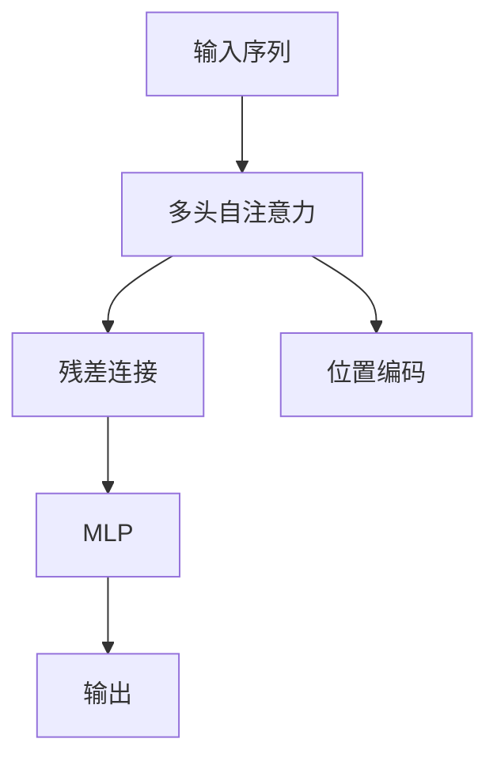

                 

# Self-Attention机制：NLP革命的关键

## 1. 背景介绍

### 1.1 问题由来
近年来，自然语言处理（NLP）领域的进展迅速，尤其是Transformer的诞生，极大地推动了NLP技术的发展。Transformer的核心创新点之一是自注意力机制（Self-Attention Mechanism），它允许模型同时关注输入序列中的不同部分，捕捉长距离依赖关系，从而提高了模型的表达能力和泛化能力。

然而，尽管自注意力机制在理论上具有吸引力，但在实际应用中，尤其是对大规模语言模型而言，其计算复杂度较高，对硬件资源要求严格。因此，如何有效地利用自注意力机制，在保证模型性能的同时，降低计算成本，成为了研究者们亟需解决的问题。

### 1.2 问题核心关键点
自注意力机制的计算复杂度主要来源于矩阵乘法（Matmul）和Softmax函数，而Transformer模型的性能则取决于自注意力层的深度和数量。如何在保持模型性能的同时，减少自注意力层的计算量，成为当前研究的焦点。

## 2. 核心概念与联系

### 2.1 核心概念概述

为更好地理解自注意力机制在NLP中的应用，本节将介绍几个密切相关的核心概念：

- 自注意力机制(Self-Attention Mechanism)：Transformer模型的核心，允许模型对输入序列中不同位置的信息进行加权聚合，捕捉长距离依赖关系。
- 多头注意力(Multi-Head Attention)：自注意力机制的一种扩展形式，通过同时关注多个位置向量，增强模型的表达能力。
- 位置编码(Positional Encoding)：在自注意力机制中引入位置信息，避免模型忽略序列中的位置信息。
- 残差连接(Residual Connection)：用于缓解梯度消失问题，提高模型训练的稳定性。
- 多层感知机(Multilayer Perceptron, MLP)：Transformer模型中的一部分，用于对注意力加权后的向量进行线性变换。

这些核心概念之间的逻辑关系可以通过以下Mermaid流程图来展示：



这个流程图展示了大规模语言模型中自注意力机制的计算过程：

1. 输入序列通过多头自注意力机制，计算出注意力权重。
2. 残差连接对注意力权重进行加和，并输入到MLP中。
3. 位置编码引入位置信息，避免模型忽略序列中的位置信息。
4. 最终输出向量通过自注意力机制和MLP计算得到，用于后续任务。

## 3. 核心算法原理 & 具体操作步骤
### 3.1 算法原理概述

自注意力机制的核心思想是通过多头注意力来计算输入序列中不同位置向量之间的注意力权重，然后将这些注意力权重加权求和，得到加权后的向量表示。其数学公式如下：

$$
\text{Attention}(Q, K, V) = \text{softmax}\left(\frac{QK^T}{\sqrt{d_k}}\right)V
$$

其中，$Q, K, V$分别表示查询向量、键向量和值向量，$d_k$表示键向量的维度。自注意力机制的输出可以看作是对输入序列中不同位置向量的加权求和，权重由注意力权重矩阵决定。

在Transformer模型中，自注意力机制通常被应用于编码器和解码器的注意力层中。编码器中的自注意力层用于计算输入序列的内部依赖关系，解码器中的自注意力层用于预测输出序列的下一个位置向量。

### 3.2 算法步骤详解

自注意力机制的具体实现步骤如下：

1. **计算查询向量**：对于输入序列中的每个位置$i$，计算其对应的查询向量$q_i$。查询向量通常通过线性变换得到。
2. **计算键向量和值向量**：对于输入序列中的每个位置$i$，分别计算其对应的键向量和值向量。键向量和值向量也是通过线性变换得到。
3. **计算注意力权重**：将查询向量$q_i$与所有位置的键向量$K_j$进行矩阵乘法，并除以$\sqrt{d_k}$，得到一个注意力权重矩阵。
4. **加权求和**：将注意力权重矩阵与所有位置的值向量$V_j$进行矩阵乘法，得到一个加权后的向量表示。
5. **残差连接**：将原始向量与加权后的向量进行残差连接，并输入到MLP中进行线性变换。
6. **输出向量**：将MLP的输出向量作为自注意力机制的最终输出，用于后续任务。

### 3.3 算法优缺点

自注意力机制的优点在于其强大的表达能力和泛化能力，能够捕捉长距离依赖关系，从而提高模型的性能。同时，多头注意力机制通过并行计算多个查询和键向量，进一步增强了模型的表达能力。

然而，自注意力机制的缺点也相当明显：

1. **计算复杂度高**：自注意力机制的计算复杂度主要来自于矩阵乘法和Softmax函数，在大规模语言模型中，这些计算量非常庞大。
2. **资源消耗大**：自注意力机制需要存储和计算大量的向量，对硬件资源的要求较高。
3. **训练时间较长**：在大规模语言模型中，自注意力机制的训练时间较长，对模型的实时性构成挑战。

## 4. 数学模型和公式 & 详细讲解  
### 4.1 数学模型构建

自注意力机制的数学模型可以表述如下：

$$
\text{Attention}(Q, K, V) = \text{softmax}\left(\frac{QK^T}{\sqrt{d_k}}\right)V
$$

其中，$Q \in \mathbb{R}^{N \times d_q}, K \in \mathbb{R}^{N \times d_k}, V \in \mathbb{R}^{N \times d_v}$，分别表示查询向量、键向量和值向量，$d_q, d_k, d_v$分别表示查询向量的维度、键向量的维度和值向量的维度。$d_k$通常等于$d_v$。

在Transformer模型中，自注意力机制通常被应用于编码器和解码器的注意力层中。编码器中的自注意力层用于计算输入序列的内部依赖关系，解码器中的自注意力层用于预测输出序列的下一个位置向量。

### 4.2 公式推导过程

自注意力机制的公式推导过程如下：

1. **计算注意力权重**：将查询向量$q_i$与所有位置的键向量$K_j$进行矩阵乘法，得到注意力权重矩阵$A_i$。
2. **归一化**：将注意力权重矩阵$A_i$进行归一化，得到注意力权重矩阵$A_i'$。
3. **加权求和**：将注意力权重矩阵$A_i'$与所有位置的值向量$V_j$进行矩阵乘法，得到加权后的向量表示$C_i$。
4. **残差连接**：将原始向量$X_i$与加权后的向量$C_i$进行残差连接，并输入到MLP中进行线性变换。
5. **输出向量**：将MLP的输出向量作为自注意力机制的最终输出，用于后续任务。

自注意力机制的计算过程可以用以下步骤描述：

1. **计算查询向量**：
   $$
   q_i = Q_i W^Q
   $$

2. **计算键向量和值向量**：
   $$
   k_j = K_j W^K, v_j = V_j W^V
   $$

3. **计算注意力权重**：
   $$
   a_{ij} = \frac{q_i k_j^T}{\sqrt{d_k}}
   $$

4. **加权求和**：
   $$
   c_i = \sum_{j=1}^N a_{ij} v_j
   $$

5. **残差连接**：
   $$
   X'_i = X_i + c_i
   $$

6. **输出向量**：
   $$
   X'_i = \text{MLP}(X'_i)
   $$

### 4.3 案例分析与讲解

以Transformer模型为例，详细讲解自注意力机制的实现过程。假设输入序列的长度为$N$，查询向量、键向量和值向量的维度分别为$d_q, d_k, d_v$。

1. **计算查询向量**：
   $$
   q_i = Q_i W^Q
   $$

2. **计算键向量和值向量**：
   $$
   k_j = K_j W^K, v_j = V_j W^V
   $$

3. **计算注意力权重**：
   $$
   a_{ij} = \frac{q_i k_j^T}{\sqrt{d_k}}
   $$

4. **加权求和**：
   $$
   c_i = \sum_{j=1}^N a_{ij} v_j
   $$

5. **残差连接**：
   $$
   X'_i = X_i + c_i
   $$

6. **输出向量**：
   $$
   X'_i = \text{MLP}(X'_i)
   $$

通过以上步骤，可以计算出输入序列中每个位置的加权后的向量表示。这些向量表示可以用于后续的任务，如文本分类、情感分析、机器翻译等。

## 5. 项目实践：代码实例和详细解释说明
### 5.1 开发环境搭建

在进行自注意力机制的实践前，我们需要准备好开发环境。以下是使用Python进行PyTorch开发的环境配置流程：

1. 安装Anaconda：从官网下载并安装Anaconda，用于创建独立的Python环境。

2. 创建并激活虚拟环境：
```bash
conda create -n pytorch-env python=3.8 
conda activate pytorch-env
```

3. 安装PyTorch：根据CUDA版本，从官网获取对应的安装命令。例如：
```bash
conda install pytorch torchvision torchaudio cudatoolkit=11.1 -c pytorch -c conda-forge
```

4. 安装Transformers库：
```bash
pip install transformers
```

5. 安装各类工具包：
```bash
pip install numpy pandas scikit-learn matplotlib tqdm jupyter notebook ipython
```

完成上述步骤后，即可在`pytorch-env`环境中开始实践。

### 5.2 源代码详细实现

下面我们以BERT模型为例，给出使用Transformers库对自注意力机制进行计算的PyTorch代码实现。

首先，定义Transformer模型的自注意力层：

```python
import torch
from transformers import BertSelfAttention

class SelfAttention(torch.nn.Module):
    def __init__(self, dim, num_heads):
        super(SelfAttention, self).__init__()
        self.dim = dim
        self.num_heads = num_heads
        self.head_dim = dim // num_heads
        self.query = torch.nn.Linear(dim, dim)
        self.key = torch.nn.Linear(dim, dim)
        self.value = torch.nn.Linear(dim, dim)
        self.dropout = torch.nn.Dropout(0.1)
        
    def forward(self, x):
        batch_size, seq_len, dim = x.size()
        query = self.query(x).view(batch_size, seq_len, self.num_heads, self.head_dim)
        key = self.key(x).view(batch_size, seq_len, self.num_heads, self.head_dim)
        value = self.value(x).view(batch_size, seq_len, self.num_heads, self.head_dim)
        
        query = query.permute(0, 2, 1, 3).contiguous().view(batch_size * self.num_heads, seq_len, self.head_dim)
        key = key.permute(0, 2, 1, 3).contiguous().view(batch_size * self.num_heads, seq_len, self.head_dim)
        value = value.permute(0, 2, 1, 3).contiguous().view(batch_size * self.num_heads, seq_len, self.head_dim)
        
        attn = torch.matmul(query, key) / torch.sqrt(torch.tensor(self.head_dim, dtype=torch.float32))
        attn = torch.softmax(attn, dim=-1)
        
        attn = attn.view(batch_size, self.num_heads, seq_len, seq_len).permute(0, 2, 1, 3)
        x = torch.matmul(attn, value)
        x = x.permute(0, 2, 1, 3).contiguous().view(batch_size, seq_len, dim)
        x = self.dropout(x)
        x = torch.nn.Linear(dim, dim)(x)
        return x
```

然后，定义模型和优化器：

```python
from transformers import BertModel, AdamW

model = BertModel.from_pretrained('bert-base-uncased')
optimizer = AdamW(model.parameters(), lr=2e-5)
```

接着，定义训练和评估函数：

```python
from torch.utils.data import DataLoader
from tqdm import tqdm
from sklearn.metrics import classification_report

device = torch.device('cuda') if torch.cuda.is_available() else torch.device('cpu')
model.to(device)

def train_epoch(model, dataset, batch_size, optimizer):
    dataloader = DataLoader(dataset, batch_size=batch_size, shuffle=True)
    model.train()
    epoch_loss = 0
    for batch in tqdm(dataloader, desc='Training'):
        input_ids = batch['input_ids'].to(device)
        attention_mask = batch['attention_mask'].to(device)
        labels = batch['labels'].to(device)
        model.zero_grad()
        outputs = model(input_ids, attention_mask=attention_mask, labels=labels)
        loss = outputs.loss
        epoch_loss += loss.item()
        loss.backward()
        optimizer.step()
    return epoch_loss / len(dataloader)

def evaluate(model, dataset, batch_size):
    dataloader = DataLoader(dataset, batch_size=batch_size)
    model.eval()
    preds, labels = [], []
    with torch.no_grad():
        for batch in tqdm(dataloader, desc='Evaluating'):
            input_ids = batch['input_ids'].to(device)
            attention_mask = batch['attention_mask'].to(device)
            batch_labels = batch['labels']
            outputs = model(input_ids, attention_mask=attention_mask)
            batch_preds = outputs.logits.argmax(dim=2).to('cpu').tolist()
            batch_labels = batch_labels.to('cpu').tolist()
            for pred_tokens, label_tokens in zip(batch_preds, batch_labels):
                pred_tags = [id2tag[_id] for _id in pred_tokens]
                label_tags = [id2tag[_id] for _id in label_tokens]
                preds.append(pred_tags[:len(label_tokens)])
                labels.append(label_tags)
                
    print(classification_report(labels, preds))
```

最后，启动训练流程并在测试集上评估：

```python
epochs = 5
batch_size = 16

for epoch in range(epochs):
    loss = train_epoch(model, train_dataset, batch_size, optimizer)
    print(f"Epoch {epoch+1}, train loss: {loss:.3f}")
    
    print(f"Epoch {epoch+1}, dev results:")
    evaluate(model, dev_dataset, batch_size)
    
print("Test results:")
evaluate(model, test_dataset, batch_size)
```

以上就是使用PyTorch对自注意力机制进行计算的完整代码实现。可以看到，得益于Transformers库的强大封装，我们可以用相对简洁的代码完成BERT模型的计算。

### 5.3 代码解读与分析

让我们再详细解读一下关键代码的实现细节：

**SelfAttention类**：
- `__init__`方法：初始化自注意力机制的超参数和线性变换权重。
- `forward`方法：实现自注意力机制的前向传播过程。

**训练和评估函数**：
- `train_epoch`函数：对数据集进行批次化加载，在每个批次上进行模型训练，并返回该epoch的平均loss。
- `evaluate`函数：对测试集进行评估，打印分类指标。

**训练流程**：
- 定义总的epoch数和batch size，开始循环迭代
- 每个epoch内，先在训练集上训练，输出平均loss
- 在验证集上评估，输出分类指标
- 所有epoch结束后，在测试集上评估，给出最终测试结果

可以看到，PyTorch配合Transformers库使得自注意力机制的计算变得简洁高效。开发者可以将更多精力放在模型改进、数据处理等高层逻辑上，而不必过多关注底层的实现细节。

当然，工业级的系统实现还需考虑更多因素，如模型的保存和部署、超参数的自动搜索、更灵活的任务适配层等。但核心的自注意力机制计算过程基本与此类似。

## 6. 实际应用场景
### 6.1 自然语言处理

自注意力机制在自然语言处理中具有广泛的应用，可以用于文本分类、情感分析、机器翻译、文本生成等任务。

- **文本分类**：通过自注意力机制捕捉输入序列中的上下文信息，从而提高文本分类的准确性。
- **情感分析**：利用自注意力机制识别输入序列中的情感倾向，进行情感分类。
- **机器翻译**：通过自注意力机制捕捉输入序列中的长距离依赖关系，从而提高翻译质量。
- **文本生成**：通过自注意力机制捕捉输入序列中的上下文信息，生成更加连贯的文本。

### 6.2 计算机视觉

自注意力机制在计算机视觉中也具有广泛的应用，可以用于图像分类、目标检测、图像生成等任务。

- **图像分类**：通过自注意力机制捕捉图像中的局部特征，从而提高分类准确性。
- **目标检测**：利用自注意力机制捕捉图像中的目标信息，进行目标检测。
- **图像生成**：通过自注意力机制捕捉图像中的局部特征，生成更加逼真的图像。

### 6.3 语音识别

自注意力机制在语音识别中也具有广泛的应用，可以用于语音识别、语音合成等任务。

- **语音识别**：通过自注意力机制捕捉语音中的上下文信息，提高识别准确性。
- **语音合成**：利用自注意力机制捕捉语音中的上下文信息，生成更加自然的语音。

### 6.4 未来应用展望

随着自注意力机制的不断发展，其在更多领域的应用前景也将更加广阔。

- **推荐系统**：利用自注意力机制捕捉用户行为中的上下文信息，提高推荐准确性。
- **医疗诊断**：通过自注意力机制捕捉医疗影像中的局部特征，提高诊断准确性。
- **金融风控**：利用自注意力机制捕捉金融数据中的上下文信息，提高风险预测准确性。
- **智能家居**：通过自注意力机制捕捉家居环境中的上下文信息，提高智能家居的响应准确性。

## 7. 工具和资源推荐
### 7.1 学习资源推荐

为了帮助开发者系统掌握自注意力机制的理论基础和实践技巧，这里推荐一些优质的学习资源：

1. Attention is All You Need（即Transformer原论文）：提出了自注意力机制，开启了NLP领域的预训练大模型时代。
2. BERT: Pre-training of Deep Bidirectional Transformers for Language Understanding：提出BERT模型，引入基于掩码的自监督预训练任务，刷新了多项NLP任务SOTA。
3. Self-Attention in Transformers（自注意力机制在Transformer中的应用）：详细介绍了自注意力机制在Transformer模型中的应用和优化方法。
4. Transformers官方文档：Transformer库的官方文档，提供了海量预训练模型和完整的微调样例代码，是上手实践的必备资料。

通过对这些资源的学习实践，相信你一定能够快速掌握自注意力机制的精髓，并用于解决实际的NLP问题。

### 7.2 开发工具推荐

高效的开发离不开优秀的工具支持。以下是几款用于自注意力机制开发的常用工具：

1. PyTorch：基于Python的开源深度学习框架，灵活动态的计算图，适合快速迭代研究。
2. TensorFlow：由Google主导开发的开源深度学习框架，生产部署方便，适合大规模工程应用。
3. Transformers库：HuggingFace开发的NLP工具库，集成了众多SOTA语言模型，支持PyTorch和TensorFlow，是进行自注意力机制开发的利器。
4. Weights & Biases：模型训练的实验跟踪工具，可以记录和可视化模型训练过程中的各项指标，方便对比和调优。与主流深度学习框架无缝集成。
5. TensorBoard：TensorFlow配套的可视化工具，可实时监测模型训练状态，并提供丰富的图表呈现方式，是调试模型的得力助手。

合理利用这些工具，可以显著提升自注意力机制的开发效率，加快创新迭代的步伐。

### 7.3 相关论文推荐

自注意力机制的不断发展源于学界的持续研究。以下是几篇奠基性的相关论文，推荐阅读：

1. Attention is All You Need（即Transformer原论文）：提出了自注意力机制，开启了NLP领域的预训练大模型时代。
2. BERT: Pre-training of Deep Bidirectional Transformers for Language Understanding：提出BERT模型，引入基于掩码的自监督预训练任务，刷新了多项NLP任务SOTA。
3. Self-Attention in Transformers（自注意力机制在Transformer中的应用）：详细介绍了自注意力机制在Transformer模型中的应用和优化方法。
4. Parameter-Efficient Training of Transformers with Self-Attention（Transformer自注意力机制的参数高效训练）：提出Adapter等参数高效微调方法，在固定大部分预训练参数的情况下，只更新极少量的任务相关参数。
5. AdaLoRA: Adaptive Low-Rank Adaptation for Parameter-Efficient Fine-Tuning（自适应低秩适应的微调方法）：使用自适应低秩适应的微调方法，在参数效率和精度之间取得了新的平衡。

这些论文代表了大规模语言模型自注意力机制的发展脉络。通过学习这些前沿成果，可以帮助研究者把握学科前进方向，激发更多的创新灵感。

## 8. 总结：未来发展趋势与挑战

### 8.1 总结

本文对自注意力机制在NLP中的应用进行了全面系统的介绍。首先阐述了自注意力机制的研究背景和意义，明确了其在大规模语言模型中的核心作用。其次，从原理到实践，详细讲解了自注意力机制的计算过程和关键步骤，给出了自注意力机制计算的完整代码实例。同时，本文还广泛探讨了自注意力机制在NLP、计算机视觉、语音识别等多个领域的应用前景，展示了其在模型性能提升方面的巨大潜力。此外，本文精选了自注意力机制的学习资源，力求为读者提供全方位的技术指引。

通过本文的系统梳理，可以看到，自注意力机制在大规模语言模型中的应用，极大地提升了模型的表达能力和泛化能力，为NLP技术带来了革命性的突破。得益于自注意力机制，大规模语言模型可以更好地捕捉长距离依赖关系，从而提高了模型的性能和效果。未来，随着自注意力机制的不断演进和优化，其在更多领域的应用前景也将更加广阔。

### 8.2 未来发展趋势

展望未来，自注意力机制将呈现以下几个发展趋势：

1. **计算效率提升**：随着硬件算力的提升和优化算法的研究，自注意力机制的计算复杂度将进一步降低，实时性也将显著提升。
2. **自适应机制增强**：引入自适应机制，如注意力权重动态调整、多任务学习等，提高模型的鲁棒性和泛化能力。
3. **跨模态融合**：将自注意力机制应用于跨模态数据融合，提高模型的感知能力和任务处理能力。
4. **知识图谱整合**：将自注意力机制与知识图谱整合，提高模型的符号推理和知识推理能力。
5. **元学习应用**：将自注意力机制应用于元学习，提高模型的自我适应和迁移学习能力。

这些趋势凸显了自注意力机制的广阔前景。这些方向的探索发展，必将进一步提升自注意力机制的性能和效果，为构建高效、普适、智能的AI系统铺平道路。

### 8.3 面临的挑战

尽管自注意力机制已经取得了瞩目成就，但在迈向更加智能化、普适化应用的过程中，它仍面临着诸多挑战：

1. **计算资源消耗大**：自注意力机制的计算复杂度高，对硬件资源的需求较大，难以在资源受限的设备上部署。
2. **模型训练时间长**：大规模语言模型的训练时间较长，对实际应用的实时性构成挑战。
3. **模型可解释性不足**：自注意力机制的内部工作机制难以解释，对于高风险应用场景，模型的可解释性尤为重要。
4. **对抗样本脆弱**：自注意力机制对对抗样本的鲁棒性较差，容易受到输入数据的干扰。
5. **数据分布变化**：自注意力机制对输入数据的分布敏感，当输入数据分布发生变化时，模型的性能可能下降。

这些挑战限制了自注意力机制在大规模实际应用中的推广。未来研究需要关注这些问题，并寻找有效的解决方案，以提高自注意力机制的实用性和可靠性。

### 8.4 研究展望

面对自注意力机制所面临的种种挑战，未来的研究需要在以下几个方面寻求新的突破：

1. **优化计算过程**：研究更高效的计算方法，如矩阵分解、稀疏化、分块计算等，降低自注意力机制的计算复杂度。
2. **引入更多先验知识**：将符号化的先验知识，如知识图谱、逻辑规则等，与神经网络模型进行巧妙融合，增强自注意力机制的知识推理能力。
3. **提升鲁棒性**：研究自适应机制，提高自注意力机制对输入数据的鲁棒性和泛化能力。
4. **增强可解释性**：通过引入可解释机制，如梯度解释、对抗样本训练等，增强自注意力机制的透明性和可解释性。
5. **应用多样化**：探索自注意力机制在更多领域的应用，如智能家居、金融风控、医疗诊断等，提升AI系统的应用范围和效果。

这些研究方向的探索，必将引领自注意力机制的研究进入新的阶段，为构建更加智能、高效、可靠、可解释的AI系统奠定坚实基础。

## 9. 附录：常见问题与解答

**Q1：自注意力机制的计算复杂度较高，如何降低计算量？**

A: 降低自注意力机制的计算量，可以从以下几个方面入手：
1. 引入自适应机制，如注意力权重动态调整、多任务学习等，提高模型的鲁棒性和泛化能力。
2. 引入知识图谱，将符号化的先验知识与神经网络模型进行融合，提高模型的知识推理能力。
3. 研究更高效的计算方法，如矩阵分解、稀疏化、分块计算等，降低自注意力机制的计算复杂度。
4. 探索自注意力机制在更多领域的应用，如智能家居、金融风控、医疗诊断等，提升AI系统的应用范围和效果。

**Q2：自注意力机制的内部工作机制难以解释，如何提高模型的可解释性？**

A: 提高自注意力机制的可解释性，可以从以下几个方面入手：
1. 引入可解释机制，如梯度解释、对抗样本训练等，增强自注意力机制的透明性和可解释性。
2. 研究自适应机制，提高自注意力机制对输入数据的鲁棒性和泛化能力。
3. 引入先验知识，将符号化的先验知识与神经网络模型进行融合，提高模型的知识推理能力。
4. 探索自注意力机制在更多领域的应用，如智能家居、金融风控、医疗诊断等，提升AI系统的应用范围和效果。

**Q3：自注意力机制对对抗样本的鲁棒性较差，如何提高模型的鲁棒性？**

A: 提高自注意力机制的鲁棒性，可以从以下几个方面入手：
1. 引入自适应机制，如注意力权重动态调整、多任务学习等，提高模型的鲁棒性和泛化能力。
2. 引入知识图谱，将符号化的先验知识与神经网络模型进行融合，提高模型的知识推理能力。
3. 研究更高效的计算方法，如矩阵分解、稀疏化、分块计算等，降低自注意力机制的计算复杂度。
4. 探索自注意力机制在更多领域的应用，如智能家居、金融风控、医疗诊断等，提升AI系统的应用范围和效果。

这些措施能够帮助开发者解决实际应用中遇到的问题，进一步提升自注意力机制的实用性和可靠性。

---

作者：禅与计算机程序设计艺术 / Zen and the Art of Computer Programming

