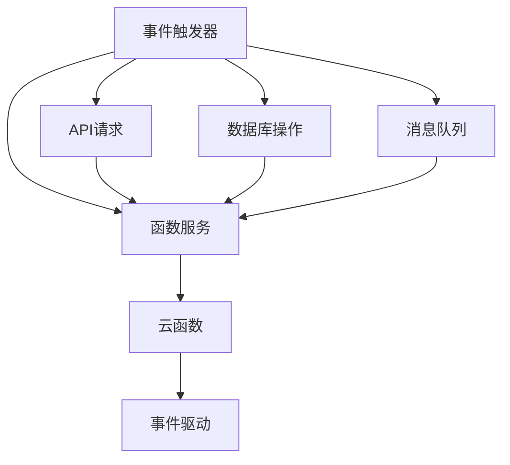

                 

# Serverless架构：AWS Lambda与Azure Functions

> 关键词：Serverless, AWS Lambda, Azure Functions, 云计算, 无服务器, 事件驱动, 开发与部署, 微服务

## 1. 背景介绍

### 1.1 问题由来

在云计算时代，企业越来越多地依赖云服务来构建和运行应用程序。传统云计算服务如VM、容器等，需要企业在硬件、网络、操作系统等多个方面进行维护和管理，带来了大量的运营成本和复杂性。因此，企业开始探索新的云计算模式，以降低成本、提升效率。

与此同时，微服务架构的兴起，使得应用系统的复杂度不断增加，传统的DevOps模式也面临压力。如何实现微服务的自动化、可扩展性和高可用性，成为云计算领域的重要课题。

在这一背景下，Serverless架构应运而生。Serverless架构通过抽象底层资源，提供自动化的部署、扩缩容、运维管理等能力，让开发者可以专注于应用的开发和业务逻辑的实现，降低了部署和运维的复杂度。

### 1.2 问题核心关键点

Serverless架构的核心是事件驱动的函数服务。函数服务是一种轻量级的服务，通过接收事件触发器（如API请求、数据库操作、消息队列等），执行相应的业务逻辑，并自动完成状态管理、资源分配等操作，减少了手动管理资源的需求，提高了应用的部署和扩展效率。

目前，主要的Serverless函数服务提供商包括AWS Lambda、Azure Functions、Google Cloud Functions等。这些服务都提供了自动化的计算资源管理、事件触发机制、状态管理等功能，使得开发者可以更加专注于业务逻辑的实现。

## 2. 核心概念与联系

### 2.1 核心概念概述

为更好地理解Serverless架构中的AWS Lambda与Azure Functions，本节将介绍几个密切相关的核心概念：

- **Serverless架构**：一种基于云计算的架构模式，通过抽象底层资源，提供自动化部署、扩展、运维管理等功能，让开发者专注于应用开发。
- **事件驱动函数**：根据特定事件触发，执行相应业务逻辑的函数服务，如AWS Lambda、Azure Functions等。
- **函数即服务(FaaS)**：即提供按需计算的函数服务，无需关注底层资源管理和扩展问题，开发者只需关注业务逻辑实现。
- **云函数**：即运行在云平台上的函数服务，如AWS Lambda、Azure Functions等。
- **事件触发器**：触发函数执行的外部事件，如API请求、数据库操作、消息队列等。

这些概念之间通过事件驱动和函数服务的桥梁联系在一起，共同构建了Serverless架构的核心能力。

### 2.2 核心概念原理和架构的 Mermaid 流程图



这个流程图展示了Serverless架构的核心原理和架构：

1. 事件触发器将外部事件（如API请求、数据库操作、消息队列等）转化为函数服务执行的触发条件。
2. 函数服务根据触发事件，调用相应的云函数执行业务逻辑。
3. 云函数在云端自动管理资源，执行函数逻辑，并返回结果。
4. 函数逻辑执行完成后，触发器会根据结果发送响应，完成事件驱动的完整过程。

## 3. 核心算法原理 & 具体操作步骤
### 3.1 算法原理概述

AWS Lambda和Azure Functions的核心算法原理基于函数即服务(FaaS)模型。函数即服务模型通过抽象底层资源，提供自动化计算资源管理和事件驱动的函数执行能力。开发者只需编写业务逻辑，无需关注资源管理、扩展、运维等细节。

具体而言，函数即服务模型包括以下关键组件：

- **函数服务**：根据事件触发器调用，执行相应业务逻辑的轻量级服务。
- **触发器**：触发函数执行的外部事件，如API请求、数据库操作、消息队列等。
- **状态管理**：自动管理函数执行状态，包括任务队列、超时处理、重试机制等。
- **资源分配**：根据函数执行需求，自动分配和释放计算资源，提升函数服务的弹性。
- **日志记录**：自动记录函数执行日志，支持故障排查和监控分析。

### 3.2 算法步骤详解

以下是AWS Lambda和Azure Functions的核心算法步骤详解：

**Step 1: 准备函数服务和触发器**

1. 注册函数服务：在AWS或Azure控制台中创建函数服务，设置函数名称、执行代码、内存配置等参数。

2. 配置触发器：根据业务需求，配置相应的触发器，如API Gateway、S3、Azure Storage Queue等。

**Step 2: 编写和部署函数代码**

1. 编写函数代码：根据业务逻辑，编写函数代码。AWS Lambda和Azure Functions都支持多种编程语言，如Python、Node.js、Java等。

2. 部署函数代码：将函数代码上传到AWS Lambda或Azure Functions，进行自动化部署和测试。

**Step 3: 配置函数服务**

1. 设置函数参数：根据业务需求，设置函数的内存、执行超时、并发度等参数。

2. 配置环境变量：根据业务需求，设置函数所需的环境变量，如数据库连接信息、API密钥等。

**Step 4: 测试和监控**

1. 测试函数服务：使用测试工具（如Postman、curl等）调用API Gateway，验证函数服务的正常执行。

2. 监控函数服务：通过AWS CloudWatch或Azure Monitor，监控函数服务的性能指标，如执行时间、错误率等。

**Step 5: 扩展和优化**

1. 扩展函数服务：根据业务需求，动态扩展函数服务的并发度，提升函数的响应速度和吞吐量。

2. 优化函数服务：根据监控数据，优化函数代码和配置，提升函数服务的性能和稳定性。

### 3.3 算法优缺点

AWS Lambda和Azure Functions具有以下优点：

- **自动化资源管理**：自动管理函数执行的资源，无需手动分配和释放资源，简化运维管理。
- **弹性扩展**：根据函数执行需求，自动扩展函数服务，提升应用的弹性。
- **高可用性**：自动管理状态和重试机制，提升函数服务的可靠性。
- **快速部署**：支持自动化部署和测试，减少手动部署和测试的时间。

同时，这些函数服务也存在一定的局限性：

- **冷启动延迟**：函数服务在初次调用时，需要进行冷启动，造成一定延迟。
- **状态管理复杂**：自动管理状态可能带来一定的复杂度，开发者的业务逻辑需要适应自动管理机制。
- **功能受限**：函数服务提供的功能相对有限，需要开发者自行实现一些高级功能。
- **费用计算**：函数执行的计算资源消耗需要付费，不同服务提供商的计费方式和费用模型略有差异。

### 3.4 算法应用领域

AWS Lambda和Azure Functions广泛应用于各种云计算场景，特别是在以下领域：

- **微服务架构**：将应用系统拆分为多个微服务，每个微服务通过函数服务实现，提高应用的可扩展性和可维护性。
- **事件驱动架构**：通过函数服务实现事件驱动的业务逻辑，如API Gateway触发、数据库操作触发、消息队列触发等，提高系统的响应速度和弹性。
- **自动化运维**：通过函数服务实现自动化运维任务，如系统监控、日志分析、告警处理等，提升运维效率和质量。
- **云计算原生应用**：在云原生环境中构建和部署应用，通过函数服务实现应用的编排、部署、扩展等操作，提高应用的灵活性和可移植性。
- **DevOps集成**：将函数服务与DevOps工具集成，如Jenkins、GitLab等，实现自动化部署和持续集成，提高开发效率。

此外，AWS Lambda和Azure Functions还广泛用于API开发、实时数据处理、物联网、区块链等新兴领域，展示出强大的应用潜力和发展前景。

## 4. 数学模型和公式 & 详细讲解 & 举例说明

### 4.1 数学模型构建

AWS Lambda和Azure Functions的数学模型主要基于事件驱动函数服务。以下是事件驱动函数服务的数学模型构建：

设函数服务为 $F$，事件触发器为 $T$，触发条件为 $C$。函数执行过程可以分为以下几个步骤：

1. 函数服务 $F$ 根据触发器 $T$ 的触发条件 $C$ 进行调用。

2. 函数服务 $F$ 执行业务逻辑 $L$。

3. 函数服务 $F$ 将执行结果 $R$ 返回给触发器 $T$。

4. 触发器 $T$ 根据执行结果 $R$ 进行响应，完成事件驱动的完整过程。

用数学公式表示如下：

$$
R = F(C) \\
T(C, R)
$$

其中，$F$ 为函数服务，$T$ 为触发器，$C$ 为触发条件，$L$ 为函数执行逻辑，$R$ 为执行结果。

### 4.2 公式推导过程

根据上述模型，我们可以进一步推导函数执行的计算复杂度。设函数执行时间为 $T_F$，触发条件处理时间为 $T_T$，触发条件获取时间为 $T_C$，执行结果处理时间为 $T_R$。则函数执行的总时间 $T$ 为：

$$
T = T_F + T_T + T_C + T_R
$$

由于函数服务的冷启动和状态管理等操作，$T_F$ 和 $T_T$ 通常较大，可能影响函数的响应速度。因此，优化函数执行时间和触发条件处理时间，是提高函数服务性能的关键。

### 4.3 案例分析与讲解

以AWS Lambda和Azure Functions为例，分析函数执行过程：

**AWS Lambda**

1. 触发条件处理：AWS Lambda支持多种触发器，如API Gateway、S3、Kinesis等。触发条件处理时间通常较小，$T_T$ 较低。

2. 函数执行：AWS Lambda根据事件触发器调用函数，执行业务逻辑 $L$。函数执行时间 $T_F$ 与函数逻辑的复杂度有关，不同语言的函数执行时间略有差异。

3. 执行结果处理：AWS Lambda将执行结果返回给触发器，处理时间 $T_R$ 较短。

**Azure Functions**

1. 触发条件处理：Azure Functions支持多种触发器，如HTTP请求、消息队列、数据库操作等。触发条件处理时间通常较小，$T_T$ 较低。

2. 函数执行：Azure Functions根据事件触发器调用函数，执行业务逻辑 $L$。函数执行时间 $T_F$ 与函数逻辑的复杂度有关，不同语言的函数执行时间略有差异。

3. 执行结果处理：Azure Functions将执行结果返回给触发器，处理时间 $T_R$ 较短。

## 5. 项目实践：代码实例和详细解释说明

### 5.1 开发环境搭建

以下是AWS Lambda和Azure Functions的开发环境搭建步骤：

**AWS Lambda**

1. 安装AWS CLI和SDK：使用AWS官方文档安装AWS CLI和SDK，并进行配置。

2. 配置函数服务：在AWS控制台中创建函数服务，设置函数名称、执行代码、内存配置等参数。

3. 部署函数代码：将函数代码上传到AWS Lambda，进行自动化部署和测试。

**Azure Functions**

1. 安装Azure CLI和SDK：使用Azure官方文档安装Azure CLI和SDK，并进行配置。

2. 创建函数服务：在Azure控制台中创建函数服务，设置函数名称、执行代码、触发器等参数。

3. 部署函数代码：将函数代码上传到Azure Functions，进行自动化部署和测试。

### 5.2 源代码详细实现

以下是AWS Lambda和Azure Functions的函数代码实现示例：

**AWS Lambda**

```python
import json
import boto3

def lambda_handler(event, context):
    # 解析API请求参数
    params = json.loads(event['body'])
    
    # 调用API Gateway触发器
    api_client = boto3.client('apigateway')
    response = api_client.put_item(Item=params, TableName='users')
    
    # 返回响应结果
    return {
        'statusCode': 200,
        'body': json.dumps('PutItem success')
    }
```

**Azure Functions**

```javascript
async function main(req, res) {
    // 解析HTTP请求参数
    params = req.body;
    
    // 调用HTTP触发器
    response = await callAPI(req, res);
    
    // 返回响应结果
    return {
        status: 200,
        body: 'PutItem success'
    };
}

async function callAPI(req, res) {
    // 调用API Gateway触发器
    api_client = new APIGatewayClient();
    response = await api_client.putItem(params);
    
    return response;
}
```

### 5.3 代码解读与分析

AWS Lambda和Azure Functions的代码实现展示了函数服务的核心逻辑：

**AWS Lambda**

1. `lambda_handler`：Lambda函数的入口，接收事件和上下文信息。
2. `json.loads(event['body'])`：解析API请求的JSON参数。
3. `boto3.client('apigateway')`：创建API Gateway客户端，调用PutItem操作。
4. `return`：返回API请求的响应结果。

**Azure Functions**

1. `main`：Azure函数入口，接收HTTP请求和响应。
2. `req.body`：解析HTTP请求的JSON参数。
3. `callAPI(req, res)`：调用API Gateway触发器，返回API请求的响应结果。

### 5.4 运行结果展示

AWS Lambda和Azure Functions的运行结果展示了函数服务的基本功能：

**AWS Lambda**

1. 在AWS控制台中运行函数，调用API Gateway触发器。
2. 返回JSON格式的响应结果。

**Azure Functions**

1. 在Azure控制台中运行函数，调用HTTP触发器。
2. 返回JSON格式的响应结果。

## 6. 实际应用场景

### 6.1 智能客服系统

基于AWS Lambda和Azure Functions的Serverless架构，可以构建智能客服系统的核心引擎。智能客服系统通过函数服务实现问答、对话、知识图谱等核心功能，提供自然语言理解和对话生成能力。

具体而言，可以将客服对话数据上传到函数服务，进行数据分析和处理。函数服务根据客户意图，调用知识图谱API获取答案，生成回复。同时，函数服务可以实时监控客户对话，分析用户行为，提升客服体验。

### 6.2 物联网设备管理

AWS Lambda和Azure Functions可以用于物联网设备的远程管理和控制。函数服务根据设备状态和事件触发器，进行状态监控、故障诊断、命令下发等操作，提升物联网设备的运行效率和可靠性。

具体而言，可以收集物联网设备的运行数据，上传到函数服务。函数服务根据数据监控设备的运行状态，发现异常后发送告警信息。同时，函数服务可以根据用户指令，发送控制命令，调整设备运行参数。

### 6.3 实时数据处理

AWS Lambda和Azure Functions可以用于实时数据处理和分析。函数服务根据数据源和事件触发器，进行数据清洗、转换、分析等操作，生成实时报表和洞察。

具体而言，可以将实时数据源（如日志、事件、消息队列等）上传到函数服务。函数服务根据数据格式和业务需求，进行数据清洗和转换，生成实时报表和洞察。同时，函数服务可以定期进行数据备份，保障数据的可靠性和安全性。

### 6.4 未来应用展望

随着Serverless架构的不断发展，AWS Lambda和Azure Functions在各个领域的应用场景将不断扩展，展示出更大的应用潜力。

未来，AWS Lambda和Azure Functions将广泛应用于以下领域：

- **区块链技术**：通过函数服务实现区块链网络的操作，提升区块链应用的灵活性和可扩展性。
- **边缘计算**：在边缘设备上运行函数服务，实现本地计算和数据处理，提升网络传输效率和应用响应速度。
- **自动驾驶**：通过函数服务实现车辆感知、决策、控制等核心功能，提升自动驾驶的安全性和可靠性。
- **医疗健康**：通过函数服务实现患者数据管理、医疗影像分析、医疗咨询等应用，提升医疗服务的智能化水平。
- **金融科技**：通过函数服务实现交易处理、风险管理、客户服务等应用，提升金融服务的效率和质量。
- **教育培训**：通过函数服务实现在线教育、智能辅导、课程推荐等应用，提升教育培训的个性化和智能化水平。

## 7. 工具和资源推荐

### 7.1 学习资源推荐

为了帮助开发者系统掌握AWS Lambda和Azure Functions的理论基础和实践技巧，这里推荐一些优质的学习资源：

1. **AWS Lambda官方文档**：提供详细的函数服务文档、API参考和最佳实践指南，是学习AWS Lambda的重要资源。
2. **Azure Functions官方文档**：提供详细的函数服务文档、API参考和最佳实践指南，是学习Azure Functions的重要资源。
3. **《Serverless架构设计》书籍**：由AWS和Azure官方联合编写，全面介绍了Serverless架构的设计原理、应用场景和最佳实践。
4. **《AWS Lambda实战》书籍**：由AWS官方认证作者撰写，深入浅出地介绍了AWS Lambda的开发和运维技巧。
5. **《Azure Functions实战》书籍**：由Azure官方认证作者撰写，深入浅出地介绍了Azure Functions的开发和运维技巧。
6. **《Serverless编程范式》博客**：由AWS和Azure官方联合发布，介绍Serverless架构的编程范式和最佳实践，值得开发者学习和参考。

通过这些资源的学习实践，相信你一定能够快速掌握AWS Lambda和Azure Functions的核心能力，并用于解决实际的云计算问题。

### 7.2 开发工具推荐

高效的开发离不开优秀的工具支持。以下是几款用于AWS Lambda和Azure Functions开发的常用工具：

1. **AWS CLI和SDK**：用于管理AWS Lambda函数的命令行工具和软件包。
2. **Azure CLI和SDK**：用于管理Azure Functions函数的命令行工具和软件包。
3. **Visual Studio Code**：轻量级的开发IDE，支持AWS Lambda和Azure Functions的插件，方便开发和调试。
4. **AWS CloudWatch**：用于监控和管理AWS Lambda函数的云服务。
5. **Azure Monitor**：用于监控和管理Azure Functions函数的云服务。
6. **AWS SAM（Serverless Application Model）**：用于构建和管理AWS Lambda函数的框架和工具。
7. **Azure Functions Core Tools**：用于构建和管理Azure Functions函数的框架和工具。

合理利用这些工具，可以显著提升AWS Lambda和Azure Functions函数的开发效率，加快创新迭代的步伐。

### 7.3 相关论文推荐

AWS Lambda和Azure Functions的发展源于学界的持续研究。以下是几篇奠基性的相关论文，推荐阅读：

1. **《Serverless架构设计》论文**：介绍了Serverless架构的设计原理、应用场景和最佳实践，是Serverless架构的重要基础。
2. **《Function as a Service（FaaS）模型》论文**：提出了函数即服务模型，介绍了FaaS模型的核心组件和优势。
3. **《AWS Lambda冷启动优化》论文**：介绍了AWS Lambda冷启动优化的关键技术和方法，提升函数服务的响应速度。
4. **《Azure Functions事件驱动编程》论文**：介绍了Azure Functions的事件驱动编程模型和最佳实践，提升函数服务的扩展性和可靠性。
5. **《Serverless架构的性能优化》论文**：介绍了Serverless架构的性能优化技术和方法，提升函数服务的性能和稳定性。
6. **《Serverless架构的可扩展性研究》论文**：介绍了Serverless架构的可扩展性设计和实现方法，提升函数服务的应用范围和规模。

这些论文代表了大语言模型微调技术的发展脉络。通过学习这些前沿成果，可以帮助研究者把握学科前进方向，激发更多的创新灵感。

## 8. 总结：未来发展趋势与挑战

### 8.1 总结

本文对AWS Lambda和Azure Functions的Serverless架构进行了全面系统的介绍。首先阐述了Serverless架构的背景和核心概念，明确了函数即服务模型的核心价值。其次，从原理到实践，详细讲解了函数即服务的数学模型和操作步骤，给出了函数服务的代码实现和运行结果。同时，本文还广泛探讨了函数即服务在智能客服、物联网、实时数据处理等多个领域的应用前景，展示了Serverless架构的广阔应用潜力。此外，本文精选了函数即服务的各类学习资源，力求为开发者提供全方位的技术指引。

通过本文的系统梳理，可以看到，AWS Lambda和Azure Functions的函数即服务模型正在成为云计算的重要范式，极大地降低了应用开发的复杂度和运维管理的成本，提高了应用的部署和扩展效率。未来，伴随Serverless架构的持续演进，基于函数即服务的云计算应用必将取得更大的突破，为云计算的产业生态带来深刻的变革。

### 8.2 未来发展趋势

展望未来，Serverless架构和函数即服务模型将呈现以下几个发展趋势：

1. **多云支持**：更多的云服务提供商将支持Serverless架构和函数即服务模型，提升应用的可移植性和灵活性。
2. **事件驱动应用**：更多的应用场景将采用事件驱动架构，提升应用的响应速度和弹性。
3. **混合云架构**：在混合云环境中，函数即服务将发挥重要作用，提升应用的部署和扩展效率。
4. **边缘计算**：在边缘设备上运行函数即服务，提升网络的传输效率和应用的响应速度。
5. **无服务器API网关**：通过函数即服务实现API网关，提升API的扩展性和安全性。
6. **容器和函数融合**：将函数即服务与容器技术融合，提升应用的部署和扩展效率。

这些趋势凸显了Serverless架构和函数即服务模型的广泛应用前景，必将为云计算应用带来革命性的影响。

### 8.3 面临的挑战

尽管AWS Lambda和Azure Functions的函数即服务模型已经取得了显著成就，但在迈向更加智能化、普适化应用的过程中，它仍面临诸多挑战：

1. **冷启动延迟**：函数即服务在初次调用时，需要进行冷启动，造成一定延迟。如何优化冷启动机制，提升函数的响应速度，将是重要的优化方向。
2. **状态管理复杂**：自动管理状态可能带来一定的复杂度，开发者的业务逻辑需要适应自动管理机制。如何设计灵活的状态管理策略，提升函数的可维护性，将是重要的研究方向。
3. **功能受限**：函数即服务提供的功能相对有限，需要开发者自行实现一些高级功能。如何通过函数即服务和其它云服务结合，实现更丰富的应用场景，将是重要的应用方向。
4. **计费和费用**：函数即服务的计算资源消耗需要付费，不同服务提供商的计费方式和费用模型略有差异。如何设计合理的计费策略，提升应用的成本效益，将是重要的实践方向。

### 8.4 研究展望

面对函数即服务面临的这些挑战，未来的研究需要在以下几个方面寻求新的突破：

1. **冷启动优化**：优化函数即服务的冷启动机制，减少冷启动延迟，提升函数的响应速度。
2. **状态管理设计**：设计灵活的状态管理策略，提升函数即服务的可维护性和可靠性。
3. **函数即服务融合**：将函数即服务与其它云服务（如容器、数据库、消息队列等）融合，实现更丰富的应用场景。
4. **多云协同**：在多云环境中，设计统一的事件驱动架构，提升应用的跨云迁移和扩展能力。
5. **成本效益分析**：设计合理的计费策略，提升应用的经济性和成本效益，降低企业的云服务成本。

这些研究方向的探索，必将引领Serverless架构和函数即服务模型迈向更高的台阶，为云计算应用带来更加高效、可靠、灵活的解决方案。面向未来，Serverless架构和函数即服务模型还将与其他云计算技术进行更深入的融合，共同推动云计算应用的不断发展。

## 9. 附录：常见问题与解答

**Q1: 什么是AWS Lambda？**

A: AWS Lambda是一种无服务器函数服务，允许开发者以编程方式编写和部署应用，而无需关心底层计算资源的管理和扩展。

**Q2: 什么是Azure Functions？**

A: Azure Functions是一种无服务器函数服务，允许开发者以编程方式编写和部署应用，而无需关心底层计算资源的管理和扩展。

**Q3: 如何部署AWS Lambda函数？**

A: 1. 创建函数服务，设置函数名称、执行代码、内存配置等参数。2. 将函数代码上传到AWS Lambda，进行自动化部署和测试。

**Q4: 如何部署Azure Functions函数？**

A: 1. 创建函数服务，设置函数名称、执行代码、触发器等参数。2. 将函数代码上传到Azure Functions，进行自动化部署和测试。

**Q5: AWS Lambda和Azure Functions的区别是什么？**

A: AWS Lambda和Azure Functions都是无服务器函数服务，但它们在功能和计费模型等方面略有差异。AWS Lambda支持多种编程语言，API网关等触发器，而Azure Functions支持HTTP请求、消息队列、数据库操作等多种触发器。AWS Lambda的计费方式为按请求计费，而Azure Functions的计费方式为按执行时间计费。

---

作者：禅与计算机程序设计艺术 / Zen and the Art of Computer Programming

