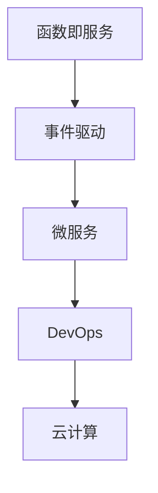

                 

# Serverless架构：事件驱动的云计算模型

> 关键词：Serverless, 云计算, 事件驱动, 函数即服务, 微服务, 自动化部署, DevOps

## 1. 背景介绍

### 1.1 问题由来
随着云计算技术的普及和应用场景的不断扩展，传统云服务的模式逐渐显现出其局限性。如何在云端以一种更加灵活、高效、经济的方式部署和管理应用，成为了云计算领域亟需解决的问题。

**Serverless架构**作为一种新兴的云计算模型，近年来得到了广泛关注。通过将应用的逻辑封装为无状态的函数，并按需触发和执行，Serverless架构实现了对资源的按需管理和自动扩展，降低了开发和运维成本，同时提升了系统的可扩展性和可靠性。

### 1.2 问题核心关键点
Serverless架构的核心在于其事件驱动的设计理念，即应用程序的执行依赖于外部事件触发。这种架构模式与云计算的"按需服务"理念紧密结合，使得资源的使用更加弹性，功能开发更加高效。

具体来说，Serverless架构的关键点包括：

- **事件触发**：应用程序的执行由外部事件驱动，如用户请求、消息队列等。
- **函数即服务**：将应用程序的逻辑封装为无状态的函数，按需执行。
- **无服务器管理**：由云服务提供商自动管理服务器和资源分配，开发者无需关心底层基础设施。
- **按需计费**：根据实际使用情况计费，避免资源浪费。

这些特性使得Serverless架构成为构建云原生应用的理想选择，被广泛应用于微服务、事件驱动架构、数据处理、物联网等领域。

### 1.3 问题研究意义
研究Serverless架构的意义在于其对传统云服务模式的革命性突破，通过其核心技术提升云应用的性能、灵活性和可管理性，为云计算的发展带来新的方向和价值。具体如下：

1. **降低成本**：通过按需计费和弹性扩展，Serverless架构避免了传统云服务固定的资源消耗和维护成本。
2. **提升性能**：Serverless架构实现了应用的快速启动和自动扩展，提升了系统的响应速度和可用性。
3. **简化开发**：Serverless架构的函数即服务模式简化了应用开发和部署流程，降低了开发门槛。
4. **增强可扩展性**：Serverless架构基于事件触发的设计使得系统更容易水平扩展。
5. **优化运维**：自动化的资源管理和弹性伸缩机制减少了运维的复杂性和成本。

## 2. 核心概念与联系

### 2.1 核心概念概述

为更好地理解Serverless架构，本节将介绍几个密切相关的核心概念：

- **函数即服务(FaaS)**：指将应用程序逻辑封装为无状态函数，通过API网关或事件触发器进行调用和执行的云服务模型。
- **事件驱动**：指应用系统基于外部事件进行逻辑处理，由事件触发器负责异步调用函数。
- **微服务**：指将大型应用拆分为多个独立部署、运行于独立进程的小服务，各个服务通过轻量级通信机制进行协作。
- **DevOps**：指软件开发和运维一体化的实践，通过持续集成、持续交付和持续监控提升软件交付效率和质量。
- **云计算**：指通过互联网提供可扩展、自服务的计算资源，包括存储、网络、数据库等，用户无需管理底层基础设施。

这些核心概念之间的逻辑关系可以通过以下Mermaid流程图来展示：



这个流程图展示的核心概念之间的关系：

1. 函数即服务是Serverless架构的核心组件，用于封装应用逻辑。
2. 事件驱动使得函数在外部事件触发时进行执行，是函数即服务的关键机制。
3. 微服务将大型应用拆分为独立运行的小服务，与函数即服务理念相契合。
4. DevOps通过持续集成、持续交付和持续监控，实现微服务和函数即服务的自动化部署和运维。
5. 云计算为微服务和函数即服务提供了基础设施和资源支持。

这些概念共同构成了Serverless架构的核心框架，使其能够以一种更加灵活、高效的方式进行云应用开发和部署。

## 3. 核心算法原理 & 具体操作步骤

### 3.1 算法原理概述

Serverless架构的核心算法原理可以总结为以下几个方面：

1. **函数即服务**：将应用程序逻辑封装为无状态的函数，函数在事件触发时执行，执行结果作为输出返回。
2. **事件驱动**：函数由外部事件触发执行，例如HTTP请求、数据库操作、消息队列等。
3. **无服务器管理**：云服务提供商负责管理函数运行所需的服务器和资源，开发者无需关心底层基础设施。
4. **按需计费**：函数根据实际执行次数和资源消耗计费，避免了资源的浪费。

这些原理构成了Serverless架构的基本框架，使得应用能够以一种灵活、高效、经济的方式在云上运行。

### 3.2 算法步骤详解

Serverless架构的具体实现步骤包括：

1. **应用设计**：将应用逻辑设计为无状态的函数，明确输入和输出，设计合适的触发器和数据存储策略。
2. **函数开发**：使用支持Serverless的开发框架，如AWS Lambda、Azure Functions等，编写函数代码。
3. **环境配置**：配置函数运行所需的环境和资源，包括语言运行时、依赖库、内存等。
4. **事件绑定**：将函数与触发器绑定，指定触发事件的来源和类型。
5. **部署和测试**：将函数代码和配置上传至云平台，进行自动化的部署和测试。
6. **监控和优化**：实时监控函数的运行情况和性能指标，进行调优和优化。

### 3.3 算法优缺点

Serverless架构的优点包括：

1. **高度灵活**：根据实际需求动态调整函数数量和资源，避免了传统云服务的固定资源消耗。
2. **低成本**：按需计费模式降低了资源浪费，同时简化了运维成本。
3. **高扩展性**：函数即服务和事件驱动的设计使得系统易于水平扩展。
4. **快速迭代**：简化了开发和部署流程，提高了开发效率。

同时，Serverless架构也存在一些缺点：

1. **冷启动延迟**：函数在触发时需要等待资源分配，导致首次执行有一定的延迟。
2. **开发复杂度增加**：开发者需要掌握云计算平台和框架的特定知识，增加了开发难度。
3. **容器限制**：部分Serverless平台对函数运行时和依赖库有限制，开发者需要事先确认兼容性。
4. **安全性问题**：函数即服务和事件驱动的设计增加了安全管理的复杂性。

### 3.4 算法应用领域

Serverless架构在多个领域得到了广泛应用，以下是一些典型应用场景：

1. **微服务架构**：将大型应用拆分为独立部署、运行于独立进程的小服务，各服务通过轻量级通信机制进行协作，适合构建复杂、可扩展的系统。
2. **事件驱动应用**：基于事件触发的设计，适用于处理各种异步事件，如消息队列、数据库操作、用户请求等。
3. **数据处理和分析**：利用函数即服务和事件驱动的设计，进行大规模数据的批处理、实时处理和分析。
4. **物联网应用**：适用于处理大量设备生成的数据，通过函数即服务实现低延迟、高可靠的数据处理。
5. **聊天机器人**：通过事件驱动的方式处理用户交互，实现实时响应和交互。

这些应用场景展示了Serverless架构的广泛适用性，使得开发者能够在不同的业务领域中充分发挥其优势。

## 4. 数学模型和公式 & 详细讲解 & 举例说明

### 4.1 数学模型构建

本节将使用数学语言对Serverless架构的基本原理进行更加严格的刻画。

设函数 $f$ 在事件触发器 $e$ 的驱动下执行，函数输入为 $x$，函数执行结果为 $y$。函数 $f$ 的输入和输出关系可以表示为：

$$
y = f(x)
$$

函数 $f$ 的执行由事件 $e$ 触发，事件 $e$ 的定义可以表示为：

$$
e = \{e_1, e_2, \ldots, e_n\}
$$

其中 $e_i$ 为事件 $e$ 中的第 $i$ 个事件，每个事件 $e_i$ 可以表示为：

$$
e_i = (x_i, y_i)
$$

其中 $x_i$ 为事件 $e_i$ 的输入，$y_i$ 为事件 $e_i$ 的输出。

函数 $f$ 在事件触发器 $e$ 下的执行流程可以表示为：

1. 接收事件 $e_i$，将输入 $x_i$ 传递给函数 $f$。
2. 函数 $f$ 对输入 $x_i$ 进行处理，生成输出 $y_i$。
3. 将输出 $y_i$ 返回给事件 $e_i$ 的调用方。

### 4.2 公式推导过程

以AWS Lambda函数为例，其基本执行流程可以表示为：

1. 函数在Lambda上部署并配置触发器。
2. 事件触发器发送事件给Lambda函数。
3. Lambda函数接收事件，执行逻辑处理。
4. 将处理结果返回给事件触发器。

设Lambda函数 $f$ 的输入为 $x$，函数执行结果为 $y$，事件触发器 $e$ 的定义为 $\{e_1, e_2, \ldots, e_n\}$，事件 $e_i$ 的输入为 $x_i$，输出为 $y_i$。则Lambda函数的执行过程可以表示为：

$$
y_i = f(x_i)
$$

其中 $f(x_i)$ 表示Lambda函数在事件 $e_i$ 驱动下的执行结果。

Lambda函数的执行流程可以进一步表示为：

$$
y_i = \begin{cases}
\text{如果 } e_i \text{ 触发 } f \text{ 执行} \\
f(x_i) \\
\text{返回 } y_i
\end{cases}
$$

Lambda函数的执行流程可以用以下伪代码表示：

```python
while True:
    event = await event_trigger()
    input = parse_input(event)
    output = f(input)
    return output
```

其中 `event_trigger()` 表示触发函数的事件获取器，`parse_input()` 表示解析事件输入的方法，`f(input)` 表示Lambda函数执行逻辑，`output` 表示函数执行结果。

### 4.3 案例分析与讲解

假设有一个Serverless架构的应用，用于处理用户登录请求。该应用包括两个函数：一个用于用户注册，另一个用于用户登录验证。

1. **用户注册**函数在HTTP POST请求下触发，处理用户的注册信息，并将注册成功的用户信息存储到数据库中。
2. **用户登录验证**函数在HTTP POST请求下触发，验证用户的登录信息，并将验证结果返回给客户端。

这两个函数的执行流程可以表示为：

1. 用户在客户端发送HTTP POST请求到注册函数，触发函数的执行。
2. 注册函数接收用户请求，处理注册信息，并将用户信息存储到数据库中。
3. 注册函数返回注册成功的结果给客户端。
4. 用户在客户端发送HTTP POST请求到登录验证函数，触发函数的执行。
5. 登录验证函数接收用户请求，验证用户信息，并将验证结果返回给客户端。

这两个函数的执行过程可以用以下伪代码表示：

```python
# 注册函数
def register_user(request):
    # 处理用户注册信息，存储到数据库中
    # 返回注册成功的结果
    return "注册成功"

# 登录验证函数
def login_user(request):
    # 验证用户信息，返回验证结果
    return "登录成功"
```

在实际应用中，这些函数可以部署到AWS Lambda上，并配置HTTP触发器进行调用。这样，用户请求就会触发相应的函数执行，实现自动化、可扩展的系统。

## 5. 项目实践：代码实例和详细解释说明

### 5.1 开发环境搭建

进行Serverless架构的开发实践前，需要先准备好开发环境。以下是使用AWS Lambda进行Serverless应用开发的步骤：

1. 安装并配置AWS CLI：从官网下载并安装AWS CLI，并进行必要的配置。
2. 安装并配置AWS SAM：AWS SAM是一个开源的Serverless应用框架，用于简化Serverless应用的开发和部署。
3. 安装并配置AWS CloudFormation：AWS CloudFormation是一个云资源模板工具，用于自动化云资源部署和管理。

完成上述步骤后，即可在AWS上进行Serverless应用的开发实践。

### 5.2 源代码详细实现

下面我们以一个简单的Web应用为例，给出使用AWS Lambda和SAM进行Serverless应用的代码实现。

首先，创建一个新的SAM应用项目：

```bash
sam init
```

然后，在应用项目中编写函数代码。假设有一个名为 `HelloWorld` 的函数，用于返回“Hello, World!”字符串。该函数的代码如下：

```python
def hello_world(event, context):
    return "Hello, World!"
```

接着，配置函数触发器。假设函数通过HTTP GET请求触发，触发器配置如下：

```yaml
HelloWorld:
  handler: hello_world.lambda_handler
  events:
    GET:
      path: /
      authorizer:
        arn: arn:aws:lambda:us-west-2:123456789012:function:HelloWorld
```

最后，使用以下命令将应用部署到AWS Lambda上：

```bash
sam build
sam deploy --stack-name HelloWorldStack --capabilities CAPABILITY_IAM
```

这样，函数 `HelloWorld` 就会被部署到AWS Lambda上，并配置HTTP触发器进行调用。

### 5.3 代码解读与分析

让我们再详细解读一下关键代码的实现细节：

**SAM配置文件**：
- `HelloWorld` 函数：指定函数名称和处理函数。
- `events`：配置函数触发器。
- `GET`：指定HTTP触发器。
- `path`：指定触发路径。
- `authorizer`：指定授权方式。

**Python函数代码**：
- `hello_world` 函数：接收 `event` 和 `context` 参数，返回字符串“Hello, World!”。
- `lamba_handler` 函数：Lambda函数的入口函数。

**部署命令**：
- `sam build`：构建应用，生成云资源模板。
- `sam deploy`：部署应用，创建云资源。

这样，一个简单的Serverless应用就被部署到AWS Lambda上，并通过HTTP触发器进行调用。开发者可以根据需要添加更多的函数和触发器，实现更复杂的业务逻辑。

## 6. 实际应用场景

### 6.1 物联网应用

Serverless架构在物联网应用中具有显著优势。物联网设备通常具有数量庞大、分布广泛、状态多样等特点，传统的集中式架构难以满足这些需求。

以智能家居为例，一个家庭中可能包含多个设备，如智能音箱、智能灯光、智能温控器等。这些设备需要实时收集用户行为数据，进行分析和处理，并基于用户行为数据进行智能控制。

通过Serverless架构，可以将每个设备的逻辑封装为无状态的函数，通过消息队列等触发器进行异步调用。这样，每个设备可以独立运行，避免单点故障，同时可以快速扩展，应对并发请求。

### 6.2 数据处理和分析

数据处理和分析是大数据时代的核心需求，Serverless架构提供了高效的解决方案。

以大数据批处理为例，传统的MapReduce模式需要预先分配计算资源，并进行复杂的资源管理。而Serverless架构可以通过事件触发的方式，按需分配资源，并自动扩展计算节点，提升了数据处理的灵活性和效率。

假设有一个大数据批处理任务，需要从数据库中读取数据，进行清洗、分析和统计，并将结果存储到数据库中。这个任务可以分为多个子任务，每个子任务可以封装为一个函数，通过事件触发器进行调用。这样，整个任务就可以按需分配计算资源，提升了数据处理的效率。

### 6.3 微服务架构

微服务架构是现代应用架构的核心趋势，Serverless架构提供了良好的支持。

以电商平台的订单处理为例，一个电商平台的订单处理系统可以拆分为多个独立运行的微服务，如订单生成、订单审核、支付处理、物流跟踪等。每个微服务可以封装为一个函数，通过事件触发器进行调用。这样，每个微服务可以独立部署和运行，提升了系统的可靠性和可扩展性。

假设有一个订单生成服务，接收用户提交的订单信息，并将订单信息存储到数据库中。这个服务可以封装为一个函数，通过HTTP POST触发器进行调用。这样，订单生成服务就可以独立运行，快速扩展，提升系统的处理能力。

### 6.4 未来应用展望

随着Serverless架构的不断发展和应用，其在更多领域将展现出广阔的前景。

1. **边缘计算**：Serverless架构可以应用于边缘计算场景，提供低延迟、高可靠的数据处理能力，满足物联网、车联网等对实时性的要求。
2. **自动化运维**：Serverless架构的自动化部署和运维特性，使得自动化运维成为可能，提高了系统的稳定性和可靠性。
3. **人工智能应用**：Serverless架构可以与人工智能技术结合，提供高效、灵活的机器学习模型训练和推理能力。
4. **区块链应用**：Serverless架构可以应用于区块链领域，提供高性能、高可扩展的智能合约执行和数据处理能力。
5. **游戏开发**：Serverless架构可以应用于游戏开发，提供高效的实时渲染和数据处理能力，提升游戏体验。

## 7. 工具和资源推荐

### 7.1 学习资源推荐

为了帮助开发者系统掌握Serverless架构的理论基础和实践技巧，这里推荐一些优质的学习资源：

1. **《Serverless架构指南》**：详细介绍Serverless架构的基本概念、设计原理和最佳实践，适合入门读者学习。
2. **AWS Lambda官方文档**：AWS Lambda的官方文档，提供了丰富的函数开发、部署和运维资源，适合开发者实践使用。
3. **Serverless框架和工具概览**：介绍了当前流行的Serverless框架和工具，包括AWS SAM、Serverless Framework等，适合开发者了解和比较。
4. **Serverless应用开发实战**：详细讲解了Serverless应用开发的实践案例，包括函数开发、部署和运维等，适合开发者参考和借鉴。
5. **Serverless架构设计模式**：总结了Serverless架构中的设计模式，如事件驱动、函数即服务、微服务等，适合开发者学习和应用。

通过对这些资源的学习实践，相信你一定能够快速掌握Serverless架构的精髓，并用于解决实际的云应用问题。

### 7.2 开发工具推荐

高效的开发离不开优秀的工具支持。以下是几款用于Serverless应用开发的常用工具：

1. **AWS Lambda**：AWS Lambda是AWS提供的Serverless函数即服务，支持多种编程语言，提供了丰富的API网关、消息队列、数据存储等功能，适合开发高性能、可扩展的云应用。
2. **AWS SAM**：AWS SAM是一个开源的Serverless应用框架，用于简化Serverless应用的开发和部署，适合开发者快速构建、测试和部署Serverless应用。
3. **Serverless Framework**：Serverless Framework是一个通用的Serverless应用框架，支持AWS Lambda、Azure Functions、Google Cloud Functions等云平台，提供了强大的CI/CD集成能力，适合开发者持续集成和持续部署。
4. **AWS CloudFormation**：AWS CloudFormation是一个云资源模板工具，用于自动化云资源部署和管理，适合开发者简化Serverless应用的部署和运维。
5. **AWS X-Ray**：AWS X-Ray是AWS提供的云应用性能监控工具，用于实时监控和分析Serverless应用的性能，适合开发者优化应用性能。

合理利用这些工具，可以显著提升Serverless应用的开发效率，加快创新迭代的步伐。

### 7.3 相关论文推荐

Serverless架构的发展离不开学界的持续研究。以下是几篇奠基性的相关论文，推荐阅读：

1. **Serverless Computing: Concepts, Technology, and Economics**：提出了Serverless计算的概念、技术架构和经济模型，奠定了Serverless架构的理论基础。
2. **Event-Driven Architecture: A Survey**：总结了事件驱动架构的原理、应用场景和实现技术，为Serverless架构提供了参考。
3. **Serverless Architecture: Principles and Practice**：详细讲解了Serverless架构的设计原则和实践经验，适合开发者参考和借鉴。
4. **Towards Serverless Cloud Computing**：探讨了Serverless云计算的趋势和挑战，为Serverless架构的未来发展提供了方向。
5. **Principles and Patterns for Serverless Architectures**：总结了Serverless架构的设计模式和最佳实践，为开发者提供了实用的指导。

这些论文代表了大规模计算和云架构研究的前沿成果，通过学习这些前沿成果，可以帮助研究者把握学科前进方向，激发更多的创新灵感。

## 8. 总结：未来发展趋势与挑战

### 8.1 总结

本文对Serverless架构进行了全面系统的介绍。首先阐述了Serverless架构的研究背景和意义，明确了其在云应用开发和部署中的独特价值。其次，从原理到实践，详细讲解了Serverless架构的核心算法和具体操作步骤，给出了Serverless应用开发的完整代码实例。同时，本文还广泛探讨了Serverless架构在物联网、数据处理、微服务等多个领域的应用前景，展示了其广泛适用性。此外，本文精选了Serverless架构的学习资源，力求为读者提供全方位的技术指引。

通过本文的系统梳理，可以看到，Serverless架构以其事件驱动和函数即服务的设计理念，为云应用开发和部署带来了新的思路和工具。Serverless架构的按需计费、自动化运维、高扩展性等特点，使得其在当前云计算时代具有广泛的应用前景，是构建高效、可扩展、低成本云应用的重要选择。未来，随着Serverless架构的不断发展和应用，相信其在更多领域将展现出更大的潜力和价值。

### 8.2 未来发展趋势

Serverless架构的未来发展趋势包括：

1. **智能化**：随着人工智能技术的发展，Serverless架构将更加智能化，能够自动进行资源管理和弹性扩展。
2. **边缘计算**：Serverless架构将向边缘计算场景扩展，提供低延迟、高可靠的数据处理能力。
3. **自动化运维**：Serverless架构将更加自动化，提供自动化的部署、运维和安全管理能力。
4. **多云和混合云**：Serverless架构将支持多云和混合云部署，提供跨云平台的资源管理和应用集成。
5. **无服务器管理**：Serverless架构将实现全流程的无服务器管理，从代码开发、部署、运维到生命周期管理。
6. **区块链应用**：Serverless架构将与区块链技术结合，提供高性能、高可扩展的智能合约执行和数据处理能力。

这些趋势将进一步提升Serverless架构的灵活性、可靠性和可扩展性，为云应用开发和部署带来新的机遇。

### 8.3 面临的挑战

尽管Serverless架构已经取得了显著进展，但在迈向更加智能化、普适化应用的过程中，它仍面临诸多挑战：

1. **冷启动延迟**：函数在触发时需要等待资源分配，导致首次执行有一定的延迟。
2. **开发复杂度增加**：开发者需要掌握云计算平台和框架的特定知识，增加了开发难度。
3. **容器限制**：部分Serverless平台对函数运行时和依赖库有限制，开发者需要事先确认兼容性。
4. **安全性问题**：函数即服务和事件驱动的设计增加了安全管理的复杂性。
5. **成本控制**：虽然按需计费模式降低了资源浪费，但过于频繁的函数执行可能导致成本过高。

这些挑战需要在未来的研究中不断克服，以进一步提升Serverless架构的可用性和可扩展性。

### 8.4 研究展望

面对Serverless架构所面临的挑战，未来的研究需要在以下几个方面寻求新的突破：

1. **冷启动优化**：研究如何优化函数启动过程，缩短冷启动延迟，提升应用响应速度。
2. **高效开发工具**：开发更高效、更易用的开发工具，降低开发者对Serverless架构的入门门槛。
3. **兼容性增强**：研究如何在多个Serverless平台上兼容运行函数，提升跨云平台的迁移能力。
4. **安全性保障**：研究如何增强Serverless架构的安全性，保障数据和应用的隐私和安全性。
5. **成本优化**：研究如何优化函数执行次数和资源使用，降低Serverless应用的成本。

这些研究方向将进一步推动Serverless架构的发展，提升其应用价值和普及度。相信随着学界和产业界的共同努力，Serverless架构必将带来更多创新和突破，为云计算时代带来新的发展机遇。

## 9. 附录：常见问题与解答

**Q1：Serverless架构是否适用于所有云应用？**

A: Serverless架构并非适用于所有云应用，其适用性取决于应用的特性和需求。一般来说，适用于以下类型的应用：

1. **事件驱动**：需要基于外部事件进行逻辑处理的应用，如消息队列、数据库操作、用户请求等。
2. **无状态**：逻辑上无需保存状态的应用，如API网关、微服务、数据处理等。
3. **高扩展性**：需要快速扩展、灵活调度的应用，如聊天机器人、实时数据处理、物联网等。

对于需要保存状态、高并发处理能力的应用，Serverless架构可能不是最优选择。

**Q2：如何选择合适的Serverless平台？**

A: 选择合适的Serverless平台需要考虑多个因素，包括技术成熟度、兼容性、资源限制、成本等。以下是一些选择Serverless平台的建议：

1. **AWS Lambda**：AWS Lambda是Serverless架构的标杆，适用于多种编程语言和云平台，技术成熟度高，功能丰富。
2. **Azure Functions**：Azure Functions是Azure提供的Serverless函数即服务，适用于Azure平台，功能丰富，支持多种触发器。
3. **Google Cloud Functions**：Google Cloud Functions是Google提供的Serverless函数即服务，适用于Google Cloud平台，支持多种触发器和语言。
4. **IBM Watson**：IBM Watson提供基于Serverless的AI和认知服务，适用于需要复杂数据处理和人工智能应用场景。

选择合适的平台需要根据应用需求和技术栈进行综合评估。

**Q3：如何优化Serverless应用的性能？**

A: 优化Serverless应用的性能需要从多个方面入手，包括函数启动优化、资源配置、负载均衡等。以下是一些优化建议：

1. **函数启动优化**：通过预热机制、使用多线程启动等方式，优化函数启动过程。
2. **资源配置**：合理配置函数的内存、CPU、网络等资源，避免资源浪费。
3. **负载均衡**：使用Serverless平台提供的负载均衡机制，合理分配请求。
4. **缓存策略**：合理使用缓存，减少重复计算和资源消耗。
5. **异步调用**：使用异步调用机制，提高函数并发度。

这些优化策略可以显著提升Serverless应用的性能，降低资源成本。

**Q4：如何保障Serverless应用的安全性？**

A: 保障Serverless应用的安全性需要从多个方面入手，包括函数访问控制、数据加密、日志审计等。以下是一些保障建议：

1. **函数访问控制**：使用AWS IAM、Azure RBAC等机制，严格控制函数的访问权限。
2. **数据加密**：使用HTTPS、AES等加密技术，保障数据传输和存储的安全性。
3. **日志审计**：使用AWS CloudTrail、Azure Monitor等工具，实时监控和审计函数的执行过程，发现异常行为。
4. **权限管理**：使用AWS IAM、Azure RBAC等机制，管理函数的访问权限，避免权限滥用。

这些保障策略可以显著提升Serverless应用的安全性，避免数据泄露和非法访问。

**Q5：如何评估Serverless应用的性能和成本？**

A: 评估Serverless应用的性能和成本需要从多个方面入手，包括性能指标、计算资源、响应时间等。以下是一些评估建议：

1. **性能指标**：使用AWS CloudWatch、Azure Monitor等工具，实时监控函数的响应时间、并发度、错误率等性能指标。
2. **计算资源**：使用AWS CloudWatch、Azure Monitor等工具，监控函数的计算资源使用情况，避免资源浪费。
3. **成本分析**：使用AWS Cost Explorer、Azure Cost Management等工具，分析函数的执行成本，优化资源配置。
4. **负载均衡**：使用Serverless平台提供的负载均衡机制，合理分配请求，避免单点故障。

这些评估策略可以显著提升Serverless应用的性能和成本控制能力，优化资源配置和用户体验。

---

作者：禅与计算机程序设计艺术 / Zen and the Art of Computer Programming

