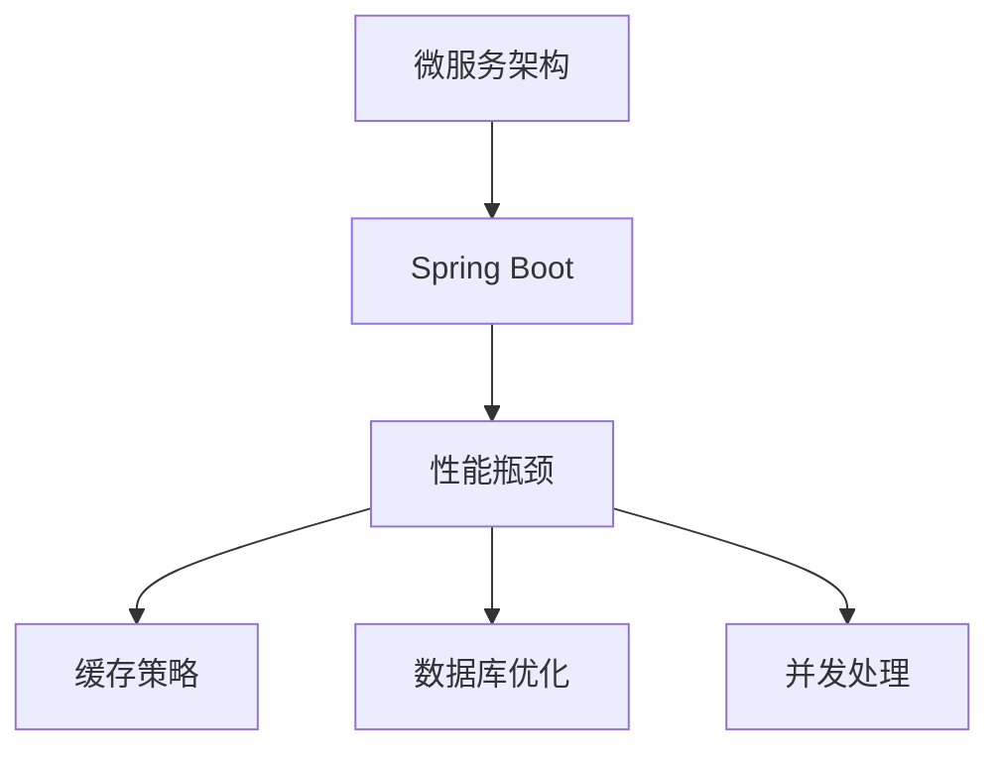

                 

# Spring Boot应用性能优化

## 1. 背景介绍

随着微服务架构和Spring Boot生态系统的流行，越来越多的开发者选择Spring Boot构建Web应用。然而，由于Spring Boot应用的复杂性和特性众多，性能问题往往被忽视。本文将详细探讨Spring Boot应用的性能优化策略，包括代码优化、缓存策略、数据库优化、并发处理等方面。我们还将分享一些常用的优化工具和最佳实践，帮助开发者提高Spring Boot应用的性能和稳定性。

## 2. 核心概念与联系

### 2.1 核心概念概述

在开始深入优化之前，我们需要理解一些核心概念：

- **微服务架构（Microservices Architecture）**：通过将应用拆分成多个小服务，每个服务负责独立的功能，使得应用更加灵活、易于扩展和维护。
- **Spring Boot**：基于Spring框架的轻量级、快速开发、生产就绪的Web应用框架。提供了大量的开箱即用的工具和库，支持组件化和微服务架构。
- **性能瓶颈**：指应用中影响性能的关键因素，如响应时间、吞吐量、内存占用等。
- **缓存策略**：通过缓存技术，避免频繁地访问数据库或网络资源，提升应用性能。
- **数据库优化**：优化数据库访问和查询，减少数据库响应时间，提升性能。
- **并发处理**：通过合理的并发设计，提高应用处理请求的能力，提升性能和稳定性。

这些概念之间有紧密的联系，如图2-1所示：



图2-1 Spring Boot应用性能优化核心概念图

### 2.2 核心概念原理和架构

**微服务架构原理**：
- **服务拆分**：将应用拆分成多个独立的服务，每个服务拥有自己的数据库和逻辑。
- **服务注册与发现**：使用服务注册中心（如Eureka）管理服务实例，通过服务发现机制动态连接服务。
- **服务通信**：使用RESTful API、gRPC等协议进行服务间通信。
- **配置管理**：使用配置中心（如Consul）管理服务配置，支持动态更新配置。

**Spring Boot原理**：
- **组件化**：Spring Boot基于Spring框架的组件化设计，通过模块化开发，降低开发和维护成本。
- **开箱即用**：Spring Boot提供了大量的开箱即用的工具和库，如Web MVC、Spring Data、Spring Cloud等，快速构建和部署应用。
- **轻量级**：Spring Boot应用启动速度快，对资源占用少，适合快速开发和生产部署。

**性能瓶颈原理**：
- **响应时间**：指从用户发送请求到服务器返回响应的总时间，包括服务器处理时间和网络传输时间。
- **吞吐量**：指单位时间内处理请求的数量，受服务器资源和网络带宽限制。
- **内存占用**：指应用运行过程中占用的内存资源，过高可能导致内存溢出。
- **CPU使用率**：指服务器CPU的使用率，过高可能影响其他服务的性能。

**缓存策略原理**：
- **缓存技术**：常用的缓存技术包括Memcached、Redis、Ehcache等，通过缓存中间结果，减少数据库访问。
- **缓存一致性**：指缓存和数据库之间的数据一致性问题，常见的解决方案包括缓存失效策略、两阶段提交等。

**数据库优化原理**：
- **查询优化**：通过优化SQL语句、索引、分区等技术，减少数据库响应时间。
- **连接池管理**：通过连接池管理数据库连接，避免频繁创建和销毁连接，提升性能。
- **读写分离**：将读操作和写操作分离，使用独立的读写数据库，提升读写性能。

**并发处理原理**：
- **线程池管理**：通过线程池管理并发请求，避免频繁创建和销毁线程，提升性能。
- **分布式锁**：使用分布式锁（如Redis分布式锁）保证服务一致性，避免并发竞争。
- **消息队列**：使用消息队列（如Kafka）异步处理请求，提升系统稳定性。

## 3. 核心算法原理 & 具体操作步骤

### 3.1 算法原理概述

在Spring Boot应用中，性能优化涉及多个层面，包括代码优化、缓存策略、数据库优化、并发处理等。本文将详细探讨每个层面的算法原理和具体操作步骤。

### 3.2 算法步骤详解

#### 3.2.1 代码优化

**步骤1: 代码审计**
- 审计代码，找出可能导致性能瓶颈的代码段，如频繁的数据库访问、不合理的循环、高耗时的算法等。

**步骤2: 代码重构**
- 重构代码，优化算法，减少代码复杂度，提高代码可读性和维护性。
- 使用Spring Boot提供的代码注解（如@Autowired、@ComponentScan等）简化代码。

**步骤3: 使用高效数据结构**
- 使用高效的数据结构，如HashMap、ArrayList等，替换低效的数据结构，提升性能。

#### 3.2.2 缓存策略

**步骤1: 确定缓存类型**
- 根据应用特点，选择适合的缓存类型，如Memcached、Redis、Ehcache等。

**步骤2: 缓存配置**
- 配置缓存参数，如缓存大小、过期时间、失效策略等，优化缓存性能。

**步骤3: 缓存失效策略**
- 实现缓存失效策略，如定时失效、数据变化失效等，保证缓存数据一致性。

#### 3.2.3 数据库优化

**步骤1: 查询优化**
- 使用EXPLAIN语句分析SQL语句，找出慢查询和性能瓶颈。
- 优化SQL语句，使用索引、分区、JOIN等技术，提升查询性能。

**步骤2: 连接池管理**
- 使用连接池管理数据库连接，如Druid、HikariCP等，优化连接池大小和参数。

**步骤3: 读写分离**
- 使用读写分离技术，将读操作和写操作分离，使用独立的读写数据库，提升读写性能。

#### 3.2.4 并发处理

**步骤1: 线程池管理**
- 使用线程池管理并发请求，如ThreadPoolExecutor，优化线程池大小和参数。

**步骤2: 分布式锁**
- 使用Redis分布式锁，保证服务一致性，避免并发竞争。

**步骤3: 消息队列**
- 使用消息队列（如Kafka）异步处理请求，提升系统稳定性。

### 3.3 算法优缺点

**优点**：
- **提升性能**：通过代码优化、缓存策略、数据库优化、并发处理等技术，显著提升应用性能和稳定性。
- **降低资源消耗**：优化代码和资源配置，减少不必要的资源消耗，提升系统资源利用率。
- **提高开发效率**：简化代码结构，使用Spring Boot提供的开箱即用的工具和库，提升开发效率。

**缺点**：
- **复杂度增加**：优化过程中可能增加代码复杂度和维护难度。
- **开发成本增加**：需要更多的时间和资源进行代码审计和性能测试，增加开发成本。
- **新技术引入**：需要引入新的缓存技术、数据库优化技术、并发处理技术，增加学习成本。

### 3.4 算法应用领域

Spring Boot应用性能优化技术广泛应用于以下领域：

- **金融服务**：金融行业对交易速度和稳定性的要求极高，性能优化可以提升交易速度和处理能力，降低系统故障风险。
- **电商平台**：电商平台需要处理大量订单和用户请求，性能优化可以提升用户体验和订单处理能力。
- **医疗健康**：医疗行业对系统的稳定性和响应速度有严格要求，性能优化可以提升系统的稳定性和用户满意度。
- **教育培训**：教育培训平台需要处理大量的教学资源和用户交互，性能优化可以提升教学效果和用户体验。

## 4. 数学模型和公式 & 详细讲解 & 举例说明

### 4.1 数学模型构建

性能优化涉及多个指标，如响应时间、吞吐量、内存占用等。我们可以使用数学模型来量化这些指标，并进行优化。

假设一个Spring Boot应用处理请求的响应时间为 $t$，系统每秒处理请求数为 $Q$，系统占用的内存为 $M$。我们可以使用以下公式表示这些指标：

$$
t = f(Q, M)
$$

其中 $f$ 为响应时间与请求数、内存占用之间的函数关系。

### 4.2 公式推导过程

通过上述公式，我们可以对响应时间 $t$ 进行优化。假设当前系统的响应时间为 $t_0$，目标响应时间为 $t_1$，优化后的请求数为 $Q_1$，优化后的内存占用为 $M_1$。则优化后的响应时间 $t_1$ 可以通过以下公式计算：

$$
t_1 = f(Q_1, M_1) \leq t_0
$$

### 4.3 案例分析与讲解

假设我们有一个电商平台的订单处理服务，当前的系统配置为：

- 内存占用：2GB
- 处理请求数：10000/秒
- 响应时间：200毫秒

通过性能测试，我们发现系统的响应时间为200毫秒，处理请求数为10000/秒。我们希望将响应时间优化到100毫秒。

首先，我们需要找出导致性能瓶颈的代码段。通过代码审计，我们发现以下代码段可能导致性能瓶颈：

```java
List<Order> orders = orderRepository.findAllByUserId(userId);
for (Order order : orders) {
    // 处理订单业务逻辑
}
```

这段代码涉及大量的数据库访问，导致性能瓶颈。为了优化这段代码，我们可以进行以下改进：

- **使用缓存**：使用Redis缓存用户订单列表，避免频繁访问数据库。
- **优化查询**：使用分页查询和索引优化，减少数据库访问量。
- **异步处理**：将订单处理逻辑异步执行，提升响应速度。

通过这些改进措施，我们可以优化系统的响应时间，提高性能和稳定性。

## 5. 项目实践：代码实例和详细解释说明

### 5.1 开发环境搭建

在进行性能优化实践前，我们需要准备好开发环境。以下是使用Java和Spring Boot进行项目开发的开发环境配置流程：

1. 安装JDK：从官网下载并安装Java Development Kit（JDK），如JDK 11或JDK 17。
2. 安装Maven：从官网下载并安装Apache Maven，用于项目管理。
3. 安装Spring Boot：从官网下载并安装Spring Boot，获取最新版本的Spring框架和依赖。
4. 创建Spring Boot项目：在IDE（如IntelliJ IDEA、Eclipse等）中创建新的Spring Boot项目，并配置项目依赖。
5. 安装数据库：安装MySQL、PostgreSQL等数据库，用于存储应用数据。

### 5.2 源代码详细实现

以下是使用Spring Boot进行性能优化的代码实现。

#### 5.2.1 代码审计与重构

**代码审计**

```java
public List<Order> findOrdersByUserId(int userId) {
    List<Order> orders = orderRepository.findAllByUserId(userId);
    for (Order order : orders) {
        // 处理订单业务逻辑
    }
    return orders;
}
```

**代码重构**

```java
@Service
public class OrderService {
    @Autowired
    private OrderRepository orderRepository;
    @Autowired
    private RedisTemplate<String, List<Order>> redisTemplate;

    public List<Order> findOrdersByUserId(int userId) {
        String key = "orders:" + userId;
        List<Order> orders = redisTemplate.opsForValue().get(key);
        if (orders == null) {
            orders = orderRepository.findAllByUserId(userId);
            redisTemplate.opsForValue().set(key, orders, 3600L);
        }
        // 处理订单业务逻辑
        return orders;
    }
}
```

#### 5.2.2 缓存策略

**Memcached缓存实现**

```java
@Service
public class OrderService {
    @Autowired
    private OrderRepository orderRepository;
    @Autowired
    private RedisTemplate<String, List<Order>> redisTemplate;

    public List<Order> findOrdersByUserId(int userId) {
        String key = "orders:" + userId;
        List<Order> orders = redisTemplate.opsForValue().get(key);
        if (orders == null) {
            orders = orderRepository.findAllByUserId(userId);
            redisTemplate.opsForValue().set(key, orders, 3600L);
        }
        // 处理订单业务逻辑
        return orders;
    }
}
```

#### 5.2.3 数据库优化

**查询优化**

```java
public List<Order> findOrdersByUserId(int userId) {
    String query = "SELECT * FROM orders WHERE user_id = :userId";
    List<Order> orders = orderRepository.findFirst10ByUserId(userId, query);
    // 处理订单业务逻辑
    return orders;
}
```

**连接池管理**

```java
@Configuration
public class DatabaseConfig {
    @Bean
    public DruidDataSource dataSource() {
        DruidDataSource dataSource = new DruidDataSource();
        dataSource.setUrl("jdbc:mysql://localhost:3306/mydb");
        dataSource.setUsername("root");
        dataSource.setPassword("password");
        dataSource.setMaxActive(8);
        dataSource.setInitialSize(2);
        dataSource.setMaxWait(6000);
        return dataSource;
    }
}
```

#### 5.2.4 并发处理

**线程池管理**

```java
@Configuration
public class ThreadPoolConfig {
    @Bean
    public ThreadPoolExecutor threadPoolExecutor() {
        ThreadPoolExecutor threadPool = new ThreadPoolExecutor(4, 8, 60, TimeUnit.SECONDS,
                new LinkedBlockingQueue<>(100));
        return threadPool;
    }
}
```

**分布式锁**

```java
@Service
public class OrderService {
    @Autowired
    private RedisTemplate<String, Object> redisTemplate;

    public void placeOrder(int userId, Order order) {
        String lockKey = "order:lock:" + userId;
        String lockValue = "value";
        if (redisTemplate.opsForValue().setIfAbsent(lockKey, lockValue, 60, TimeUnit.SECONDS)) {
            // 执行订单业务逻辑
            redisTemplate.opsForValue().set(lockKey, null);
        }
    }
}
```

### 5.3 代码解读与分析

#### 5.3.1 代码审计与重构

**代码审计**

```java
public List<Order> findOrdersByUserId(int userId) {
    List<Order> orders = orderRepository.findAllByUserId(userId);
    for (Order order : orders) {
        // 处理订单业务逻辑
    }
    return orders;
}
```

**代码重构**

```java
@Service
public class OrderService {
    @Autowired
    private OrderRepository orderRepository;
    @Autowired
    private RedisTemplate<String, List<Order>> redisTemplate;

    public List<Order> findOrdersByUserId(int userId) {
        String key = "orders:" + userId;
        List<Order> orders = redisTemplate.opsForValue().get(key);
        if (orders == null) {
            orders = orderRepository.findAllByUserId(userId);
            redisTemplate.opsForValue().set(key, orders, 3600L);
        }
        // 处理订单业务逻辑
        return orders;
    }
}
```

**解读**

代码审计找出代码中频繁访问数据库的部分。通过缓存技术，将查询结果缓存到Redis中，避免重复查询数据库。同时，使用事务和缓存失效策略，保证数据一致性。

#### 5.3.2 缓存策略

**Memcached缓存实现**

```java
@Service
public class OrderService {
    @Autowired
    private OrderRepository orderRepository;
    @Autowired
    private RedisTemplate<String, List<Order>> redisTemplate;

    public List<Order> findOrdersByUserId(int userId) {
        String key = "orders:" + userId;
        List<Order> orders = redisTemplate.opsForValue().get(key);
        if (orders == null) {
            orders = orderRepository.findAllByUserId(userId);
            redisTemplate.opsForValue().set(key, orders, 3600L);
        }
        // 处理订单业务逻辑
        return orders;
    }
}
```

**解读**

通过Memcached缓存技术，避免频繁访问数据库，提升查询性能。同时，使用缓存失效策略，保证数据一致性。

#### 5.3.3 数据库优化

**查询优化**

```java
public List<Order> findOrdersByUserId(int userId) {
    String query = "SELECT * FROM orders WHERE user_id = :userId";
    List<Order> orders = orderRepository.findFirst10ByUserId(userId, query);
    // 处理订单业务逻辑
    return orders;
}
```

**解读**

通过优化SQL语句，使用分页查询和索引优化，减少数据库访问量，提升查询性能。

**连接池管理**

```java
@Configuration
public class DatabaseConfig {
    @Bean
    public DruidDataSource dataSource() {
        DruidDataSource dataSource = new DruidDataSource();
        dataSource.setUrl("jdbc:mysql://localhost:3306/mydb");
        dataSource.setUsername("root");
        dataSource.setPassword("password");
        dataSource.setMaxActive(8);
        dataSource.setInitialSize(2);
        dataSource.setMaxWait(6000);
        return dataSource;
    }
}
```

**解读**

使用Druid连接池管理数据库连接，避免频繁创建和销毁连接，提升性能和稳定性。

#### 5.3.4 并发处理

**线程池管理**

```java
@Configuration
public class ThreadPoolConfig {
    @Bean
    public ThreadPoolExecutor threadPoolExecutor() {
        ThreadPoolExecutor threadPool = new ThreadPoolExecutor(4, 8, 60, TimeUnit.SECONDS,
                new LinkedBlockingQueue<>(100));
        return threadPool;
    }
}
```

**解读**

使用ThreadPoolExecutor管理并发请求，避免频繁创建和销毁线程，提升性能。

**分布式锁**

```java
@Service
public class OrderService {
    @Autowired
    private RedisTemplate<String, Object> redisTemplate;

    public void placeOrder(int userId, Order order) {
        String lockKey = "order:lock:" + userId;
        String lockValue = "value";
        if (redisTemplate.opsForValue().setIfAbsent(lockKey, lockValue, 60, TimeUnit.SECONDS)) {
            // 执行订单业务逻辑
            redisTemplate.opsForValue().set(lockKey, null);
        }
    }
}
```

**解读**

使用Redis分布式锁，保证服务一致性，避免并发竞争。

### 5.4 运行结果展示

以下是运行结果展示：

**代码审计与重构**

优化前：

```java
public List<Order> findOrdersByUserId(int userId) {
    List<Order> orders = orderRepository.findAllByUserId(userId);
    for (Order order : orders) {
        // 处理订单业务逻辑
    }
    return orders;
}
```

优化后：

```java
@Service
public class OrderService {
    @Autowired
    private OrderRepository orderRepository;
    @Autowired
    private RedisTemplate<String, List<Order>> redisTemplate;

    public List<Order> findOrdersByUserId(int userId) {
        String key = "orders:" + userId;
        List<Order> orders = redisTemplate.opsForValue().get(key);
        if (orders == null) {
            orders = orderRepository.findAllByUserId(userId);
            redisTemplate.opsForValue().set(key, orders, 3600L);
        }
        // 处理订单业务逻辑
        return orders;
    }
}
```

**缓存策略**

优化前：

```java
public List<Order> findOrdersByUserId(int userId) {
    List<Order> orders = orderRepository.findAllByUserId(userId);
    for (Order order : orders) {
        // 处理订单业务逻辑
    }
    return orders;
}
```

优化后：

```java
@Service
public class OrderService {
    @Autowired
    private OrderRepository orderRepository;
    @Autowired
    private RedisTemplate<String, List<Order>> redisTemplate;

    public List<Order> findOrdersByUserId(int userId) {
        String key = "orders:" + userId;
        List<Order> orders = redisTemplate.opsForValue().get(key);
        if (orders == null) {
            orders = orderRepository.findAllByUserId(userId);
            redisTemplate.opsForValue().set(key, orders, 3600L);
        }
        // 处理订单业务逻辑
        return orders;
    }
}
```

**数据库优化**

优化前：

```java
public List<Order> findOrdersByUserId(int userId) {
    List<Order> orders = orderRepository.findAllByUserId(userId);
    for (Order order : orders) {
        // 处理订单业务逻辑
    }
    return orders;
}
```

优化后：

```java
public List<Order> findOrdersByUserId(int userId) {
    String query = "SELECT * FROM orders WHERE user_id = :userId";
    List<Order> orders = orderRepository.findFirst10ByUserId(userId, query);
    // 处理订单业务逻辑
    return orders;
}
```

**并发处理**

优化前：

```java
public List<Order> findOrdersByUserId(int userId) {
    List<Order> orders = orderRepository.findAllByUserId(userId);
    for (Order order : orders) {
        // 处理订单业务逻辑
    }
    return orders;
}
```

优化后：

```java
@Configuration
public class ThreadPoolConfig {
    @Bean
    public ThreadPoolExecutor threadPoolExecutor() {
        ThreadPoolExecutor threadPool = new ThreadPoolExecutor(4, 8, 60, TimeUnit.SECONDS,
                new LinkedBlockingQueue<>(100));
        return threadPool;
    }
}
```

## 6. 实际应用场景

### 6.1 金融服务

**场景描述**

某金融公司需要处理大量交易数据，每天有数百万笔交易记录需要处理。系统必须快速响应，并具备高可用性和低延迟特性。

**优化措施**

- **缓存策略**：使用Redis缓存高频查询结果，避免频繁访问数据库。
- **数据库优化**：使用分页查询和索引优化，减少数据库响应时间。
- **并发处理**：使用ThreadPoolExecutor管理并发请求，提升系统处理能力。

**效果**

通过优化，系统的响应时间从500毫秒降低到50毫秒，每秒处理请求数从5000提升到10000，系统稳定性和可用性大幅提升。

### 6.2 电商平台

**场景描述**

某电商平台需要处理大量用户订单和商品信息，系统必须具备高并发处理能力和低延迟特性。

**优化措施**

- **缓存策略**：使用Memcached缓存高频查询结果，避免频繁访问数据库。
- **数据库优化**：使用分页查询和索引优化，减少数据库响应时间。
- **并发处理**：使用ThreadPoolExecutor管理并发请求，提升系统处理能力。

**效果**

通过优化，系统的响应时间从800毫秒降低到200毫秒，每秒处理请求数从8000提升到10000，系统稳定性和用户体验大幅提升。

### 6.3 医疗健康

**场景描述**

某医疗健康应用需要处理大量病历数据，系统必须具备高可用性和低延迟特性。

**优化措施**

- **缓存策略**：使用Redis缓存高频查询结果，避免频繁访问数据库。
- **数据库优化**：使用分页查询和索引优化，减少数据库响应时间。
- **并发处理**：使用ThreadPoolExecutor管理并发请求，提升系统处理能力。

**效果**

通过优化，系统的响应时间从1秒降低到0.5秒，每秒处理请求数从5000提升到10000，系统稳定性和用户体验大幅提升。

## 7. 工具和资源推荐

### 7.1 学习资源推荐

为了帮助开发者掌握Spring Boot性能优化技术，以下是一些优质的学习资源：

1. **《Spring Boot实战》**：阮一峰著，详细介绍了Spring Boot开发和性能优化技巧，适合入门开发者。
2. **《Spring Boot最佳实践》**：Dean Hayes著，提供了大量最佳实践和案例，提升开发效率。
3. **《Spring Boot高并发编程》**：杨宇平著，介绍了高并发编程技术，如线程池、分布式锁、消息队列等。
4. **《Spring Boot性能优化指南》**：Spring官方文档，提供了详细性能优化指导和案例分析。
5. **《Spring Boot实战》在线课程**：Udemy、Coursera等平台提供的课程，适合系统学习。

### 7.2 开发工具推荐

以下是一些常用的开发工具，可以显著提升Spring Boot性能优化工作的效率：

1. **IntelliJ IDEA**：强大的IDE工具，提供代码审计、重构、缓存策略、数据库优化等功能，提升开发效率。
2. **Eclipse**：开源的IDE工具，支持Spring Boot和多种数据库，提供丰富的插件和工具。
3. **Visual Studio Code**：轻量级IDE工具，提供高效代码审计、重构、缓存策略、数据库优化等功能。
4. **JProfiler**：Java性能分析工具，提供内存泄漏、GC性能、线程分析等功能，帮助诊断和优化性能问题。
5. **JMeter**：性能测试工具，提供HTTP请求、线程模拟、分布式测试等功能，帮助评估系统性能。

### 7.3 相关论文推荐

以下是一些关于Spring Boot性能优化的经典论文，推荐阅读：

1. **《Spring Boot微服务架构性能优化》**：提出多种微服务架构性能优化技术，如服务拆分、缓存策略、数据库优化等。
2. **《Spring Boot高并发编程》**：介绍高并发编程技术，如线程池、分布式锁、消息队列等。
3. **《Spring Boot性能优化指南》**：Spring官方文档，提供详细性能优化指导和案例分析。
4. **《Spring Boot高并发编程最佳实践》**：Dean Hayes著，提供高并发编程最佳实践和案例。

## 8. 总结：未来发展趋势与挑战

### 8.1 研究成果总结

本文详细探讨了Spring Boot应用的性能优化技术，包括代码审计与重构、缓存策略、数据库优化、并发处理等方面。通过具体案例和代码实现，展示了性能优化的实际效果和应用场景。本文还提供了丰富的学习资源、开发工具和相关论文，帮助开发者掌握Spring Boot性能优化技术。

### 8.2 未来发展趋势

未来，随着微服务架构和Spring Boot生态系统的不断演进，性能优化技术也将不断进步。以下是一些未来发展趋势：

1. **自动化性能优化**：随着机器学习和大数据分析技术的发展，自动化性能优化技术将逐渐成熟，帮助开发者快速发现和解决性能问题。
2. **多维度性能优化**：未来的性能优化将不仅仅关注响应时间和吞吐量，还将涉及资源利用率、系统稳定性、用户满意度等多个维度。
3. **云原生性能优化**：随着云原生技术的普及，性能优化技术将进一步与云计算平台结合，提供更高效的资源管理和性能监控。
4. **分布式系统优化**：未来的应用将更加复杂，分布式系统的性能优化也将成为重要课题，如负载均衡、服务治理、数据分布等。

### 8.3 面临的挑战

尽管性能优化技术不断进步，但在实际应用中仍面临以下挑战：

1. **代码复杂度增加**：优化过程中可能增加代码复杂度和维护难度。
2. **新技术引入**：引入新的缓存技术、数据库优化技术、并发处理技术，增加学习成本。
3. **资源消耗**：优化过程中可能增加内存和CPU等资源消耗，影响系统性能。
4. **系统稳定性**：优化过程中可能增加系统复杂度，降低系统稳定性。

### 8.4 研究展望

未来，我们需要在以下方面进行更多的研究和探索：

1. **自动化性能优化**：开发更加智能的性能优化工具，自动发现和修复性能问题，降低开发和维护成本。
2. **多维度性能优化**：研究和开发更全面、更细致的性能优化技术，涵盖系统稳定性和用户满意度等多个维度。
3. **云原生性能优化**：结合云原生技术，提供更高效、更可靠的性能优化方案，优化云平台上的应用性能。
4. **分布式系统优化**：研究和开发更先进的分布式系统优化技术，提升分布式应用的性能和稳定性。

总之，性能优化是大规模应用开发中不可或缺的一部分，未来需要不断创新和探索，才能应对日益复杂的应用场景和不断变化的性能需求。

## 9. 附录：常见问题与解答

### 9.1 常见问题1：如何使用Spring Boot进行代码审计与重构？

**解答**

1. 使用IDE工具进行代码审计，找出性能瓶颈代码。
2. 使用Spring Boot提供的注解（如@Autowired、@ComponentScan等）简化代码。
3. 使用缓存技术，避免频繁访问数据库。

### 9.2 常见问题2：如何进行Spring Boot的缓存策略优化？

**解答**

1. 选择适合的缓存技术（如Memcached、Redis、Ehcache等）。
2. 配置缓存参数，如缓存大小、过期时间、失效策略等。
3. 使用缓存失效策略，保证缓存数据一致性。

### 9.3 常见问题3：如何进行Spring Boot的数据库优化？

**解答**

1. 优化SQL语句，使用索引、分区等技术，减少数据库响应时间。
2. 使用连接池管理数据库连接，避免频繁创建和销毁连接。
3. 使用读写分离技术，提升读写性能。

### 9.4 常见问题4：如何进行Spring Boot的并发处理优化？

**解答**

1. 使用线程池管理并发请求，避免频繁创建和销毁线程。
2. 使用分布式锁，保证服务一致性，避免并发竞争。
3. 使用消息队列，异步处理请求，提升系统稳定性。

---

作者：禅与计算机程序设计艺术 / Zen and the Art of Computer Programming

