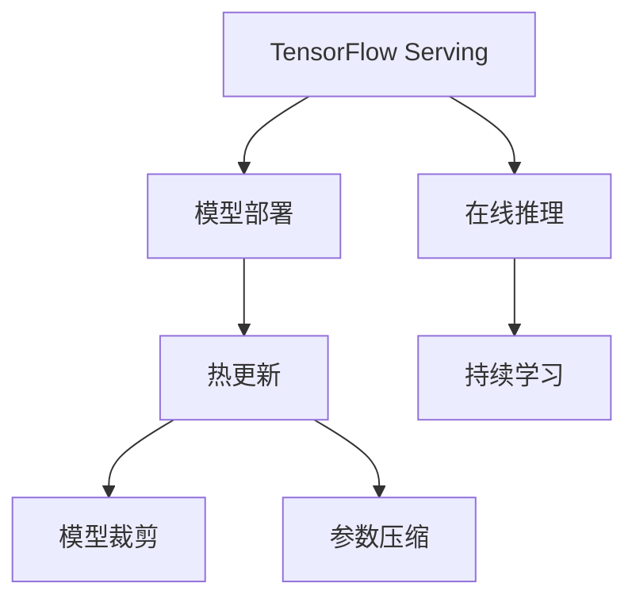

                 

# TensorFlow Serving模型热更新

> 关键词：TensorFlow Serving, 热更新, 模型部署, 持续学习, 模型优化, 在线推理

## 1. 背景介绍

随着深度学习在各领域的广泛应用，模型训练、推理过程变得越来越复杂，性能要求也越来越高。而模型更新与部署，作为模型生命周期管理的重要环节，直接影响系统的性能和稳定性。传统的模型更新和部署方式，如“训练-部署-再训练”流程，不仅耗时长，且不能实时响应用户需求的变化，难以满足现代高性能、高可靠性的系统要求。

TensorFlow Serving作为一款高性能的模型推理框架，提供了一套完整的模型更新、部署和在线推理的解决方案，支持热更新、实时推理、模型裁剪、参数压缩等技术，极大地提升了模型的性能和效率。本文将深入探讨TensorFlow Serving框架的核心原理和具体操作步骤，阐述其热更新技术，并给出实际应用场景和优缺点分析，旨在帮助读者更好地理解并利用该框架进行模型部署和维护。

## 2. 核心概念与联系

### 2.1 核心概念概述

为更好地理解TensorFlow Serving模型的热更新技术，本节将介绍几个密切相关的核心概念：

- TensorFlow Serving: 谷歌开源的高性能模型推理框架，支持多种深度学习模型的部署和在线推理。
- 热更新: 在线更新模型的参数，使得模型可以实时响应用户需求变化，提升系统性能。
- 模型裁剪: 去除模型中不必要的层和参数，减小模型尺寸，提高推理速度。
- 参数压缩: 对模型参数进行稀疏化、量化等操作，进一步压缩模型大小，优化推理效率。
- 在线推理: 模型在服务器上持续接收新数据，实时进行推理计算，满足低延迟的实时性要求。
- 持续学习: 模型在推理过程中不断学习新数据，更新模型参数，提升性能。

这些核心概念之间的逻辑关系可以通过以下Mermaid流程图来展示：



这个流程图展示了大语言模型的核心概念及其之间的关系：

1. TensorFlow Serving作为模型部署平台，提供了模型推理、热更新等核心功能。
2. 热更新技术使得模型可以实时响应需求变化，提升系统性能。
3. 模型裁剪和参数压缩技术，进一步优化了模型的推理效率。
4. 在线推理和持续学习，确保模型能够不断学习新数据，提升性能。

## 3. 核心算法原理 & 具体操作步骤
### 3.1 算法原理概述

TensorFlow Serving模型的热更新技术，主要基于以下核心原理：

- 模型参数可随时写入。TensorFlow Serving支持将模型参数存储在文件系统、分布式存储系统（如HDFS）等，使得模型参数的更新和读取变得高效和灵活。
- 在线推理能力。TensorFlow Serving通过异步执行推理请求，同时更新模型参数，确保推理过程不受模型更新的影响，实现高并发、低延迟的实时推理。
- 分布式架构。TensorFlow Serving支持分布式部署，通过负载均衡、任务调度等机制，提升系统性能和稳定性。
- 持续学习机制。TensorFlow Serving通过定期更新模型参数，不断学习新数据，保持模型的性能和时效性。

### 3.2 算法步骤详解

基于TensorFlow Serving模型的热更新技术，主要包含以下几个关键步骤：

**Step 1: 准备部署环境**
- 安装TensorFlow Serving框架和相关依赖，如TensorFlow、Java、Zookeeper等。
- 搭建TensorFlow Serving服务器和客户端，配置好服务地址和端口。
- 将模型参数文件和元数据文件（如模型结构、配置信息等）上传到TensorFlow Serving服务器。

**Step 2: 编写推理脚本**
- 编写TensorFlow Serving推理脚本，定义模型的输入输出格式、推理逻辑等。
- 使用TensorFlow Serving提供的API，如PredictionService、SignatureDefMap等，实现模型的部署和推理。
- 在推理脚本中，定义模型的参数更新策略，如触发条件、更新频率等。

**Step 3: 启动模型服务**
- 启动TensorFlow Serving推理服务器，监听客户端请求。
- 调用TensorFlow Serving提供的API，将模型参数文件加载到服务器内存。
- 模型推理服务进入待命状态，等待客户端请求。

**Step 4: 进行模型热更新**
- 在模型参数文件存储系统上，更新模型参数文件，触发参数更新机制。
- 模型推理服务通过异步推理请求，不断更新模型参数，实现热更新。
- 根据实际需求，可以设计多个参数更新策略，如定时更新、触发事件更新等。

**Step 5: 测试和优化**
- 在TensorFlow Serving客户端，测试模型的推理性能，确保热更新机制的有效性。
- 定期监控模型参数更新和推理过程，发现并解决潜在问题。
- 根据测试结果，不断优化模型部署和热更新策略。

### 3.3 算法优缺点

TensorFlow Serving模型的热更新技术具有以下优点：
1. 实时响应：模型能够实时响应用户需求变化，提升系统性能。
2. 高并发：通过异步推理，多个请求可以同时进行，支持高并发场景。
3. 高可靠性：通过分布式架构，提升系统容错能力和稳定性。
4. 灵活性：支持多种模型和数据格式，部署和更新过程灵活。
5. 可扩展性：通过扩展TensorFlow Serving集群，可以轻松应对大规模应用。

同时，该技术也存在一些局限性：
1. 复杂度较高：热更新过程涉及模型参数的读写、异步推理等复杂操作，实现难度较大。
2. 性能开销：异步推理和参数更新可能会带来一定的性能开销，需合理设计参数更新策略。
3. 依赖环境：需要安装和配置多个第三方组件，如TensorFlow、Java、Zookeeper等，增加了系统复杂度。
4. 兼容问题：不同版本的TensorFlow和TensorFlow Serving版本可能存在兼容性问题，需仔细测试和适配。

尽管存在这些局限性，但热更新技术仍然是大规模、高性能模型推理部署的重要手段。未来相关研究重点在于如何进一步降低热更新的复杂度和性能开销，提高系统的可靠性和可扩展性。

### 3.4 算法应用领域

TensorFlow Serving的热更新技术，已经在多个领域得到了广泛应用，涵盖以下应用场景：

- 在线广告推荐：广告系统需要实时响应用户点击行为，推荐最优广告内容。通过热更新技术，模型能够快速适应用户行为变化，提升推荐效果。
- 实时语音识别：语音识别系统需要实时处理语音输入，快速输出识别结果。热更新技术使得模型能够持续学习新语音数据，提升识别准确率。
- 智能推荐系统：推荐系统需要根据用户实时行为，动态调整推荐策略。热更新技术可以实现实时参数更新，优化推荐效果。
- 实时图像处理：图像处理系统需要实时处理用户上传的图像，如人脸识别、图像分类等。热更新技术使得模型能够快速适应新数据，提升处理效率。
- 智能客服系统：智能客服系统需要实时响应用户咨询，生成最佳回复。热更新技术使得模型能够快速学习新对话数据，提升回答质量。

除了上述这些经典应用外，热更新技术还被创新性地应用到更多场景中，如实时行为分析、智能交通调度等，为各行业带来了新的突破。随着热更新技术的不断进步，相信其在更多领域的应用将不断涌现，进一步推动AI技术的产业化进程。

## 4. 数学模型和公式 & 详细讲解 & 举例说明

### 4.1 数学模型构建

TensorFlow Serving模型的热更新过程，主要涉及到模型参数的读写、异步推理等操作。以下是几个关键模型的数学描述：

- 输入数据 $x$，输出数据 $y$：
$$
y = f(x; \theta)
$$

其中 $f(\cdot)$ 表示模型推理函数，$\theta$ 表示模型参数。

- 模型参数更新方程：
$$
\theta \leftarrow \theta - \eta \nabla_{\theta}\mathcal{L}(\theta)
$$

其中 $\eta$ 表示学习率，$\nabla_{\theta}\mathcal{L}(\theta)$ 表示损失函数对模型参数的梯度。

- 异步推理机制：
$$
\begin{aligned}
& \text{async\_fetch}(\text{task}) \\
& \quad \text{while (True):} \\
& \quad \quad \text{receive request} \\
& \quad \quad \text{fetch prediction} \\
& \quad \quad \text{update parameters} \\
& \quad \quad \text{push prediction} \\
& \quad \text{if (update condition):} \\
& \quad \quad \text{update parameters} \\
& \quad \text{end while} \\
\end{aligned}
$$

其中 $\text{async\_fetch}$ 表示异步推理函数，$\text{task}$ 表示当前任务，$\text{receive request}$ 表示接收客户端请求，$\text{fetch prediction}$ 表示获取推理结果，$\text{update parameters}$ 表示更新模型参数，$\text{push prediction}$ 表示推送推理结果，$\text{update condition}$ 表示触发参数更新条件。

### 4.2 公式推导过程

以下我们将对TensorFlow Serving模型的热更新过程进行详细推导，以理解其核心原理。

- 模型参数更新公式：
$$
\theta \leftarrow \theta - \eta \nabla_{\theta}\mathcal{L}(\theta)
$$

其中 $\theta$ 表示模型参数，$\eta$ 表示学习率，$\nabla_{\theta}\mathcal{L}(\theta)$ 表示损失函数对模型参数的梯度。

- 异步推理机制：
$$
\begin{aligned}
& \text{async\_fetch}(\text{task}) \\
& \quad \text{while (True):} \\
& \quad \quad \text{receive request} \\
& \quad \quad \text{fetch prediction} \\
& \quad \quad \text{update parameters} \\
& \quad \quad \text{push prediction} \\
& \quad \text{if (update condition):} \\
& \quad \quad \text{update parameters} \\
& \quad \text{end while} \\
\end{aligned}
$$

其中 $\text{async\_fetch}$ 表示异步推理函数，$\text{task}$ 表示当前任务，$\text{receive request}$ 表示接收客户端请求，$\text{fetch prediction}$ 表示获取推理结果，$\text{update parameters}$ 表示更新模型参数，$\text{push prediction}$ 表示推送推理结果，$\text{update condition}$ 表示触发参数更新条件。

### 4.3 案例分析与讲解

假设我们有一个实时语音识别系统，需要根据用户语音输入，实时识别并转录成文字。使用TensorFlow Serving模型进行部署，并开启热更新机制，以支持模型的实时学习和更新。

**Step 1: 准备部署环境**
- 在TensorFlow Serving服务器上，准备模型参数文件和元数据文件，并上传到服务器。
- 配置推理脚本，定义模型的输入输出格式、推理逻辑等。

**Step 2: 编写推理脚本**
- 编写TensorFlow Serving推理脚本，实现语音识别模型的推理过程。
- 定义参数更新策略，如每隔10分钟更新一次模型参数。

**Step 3: 启动模型服务**
- 启动TensorFlow Serving推理服务器，监听客户端请求。
- 加载模型参数文件，进入待命状态，等待客户端请求。

**Step 4: 进行模型热更新**
- 在模型参数文件存储系统上，定期更新语音识别模型参数，触发参数更新机制。
- 模型推理服务通过异步推理请求，不断更新模型参数，实现热更新。
- 根据实际需求，可以设计多个参数更新策略，如触发事件更新、定时更新等。

**Step 5: 测试和优化**
- 在TensorFlow Serving客户端，测试语音识别系统的推理性能，确保热更新机制的有效性。
- 定期监控模型参数更新和推理过程，发现并解决潜在问题。
- 根据测试结果，不断优化模型部署和热更新策略。

## 5. 项目实践：代码实例和详细解释说明
### 5.1 开发环境搭建

在进行TensorFlow Serving热更新实践前，我们需要准备好开发环境。以下是使用Python进行TensorFlow Serving开发的环境配置流程：

1. 安装Anaconda：从官网下载并安装Anaconda，用于创建独立的Python环境。

2. 创建并激活虚拟环境：
```bash
conda create -n tf-serving-env python=3.8 
conda activate tf-serving-env
```

3. 安装TensorFlow Serving：
```bash
pip install tensorflow-serving-api
```

4. 安装TensorFlow和其他依赖：
```bash
pip install tensorflow
pip install numpy
pip install flask
pip install pydot
```

5. 安装JIRA和Kibana：用于监控和日志分析。
```bash
pip install jira
pip install kibana
```

完成上述步骤后，即可在`tf-serving-env`环境中开始TensorFlow Serving热更新实践。

### 5.2 源代码详细实现

这里我们以一个简单的语音识别任务为例，给出使用TensorFlow Serving进行模型热更新的代码实现。

首先，定义模型和推理函数：

```python
import tensorflow as tf
from tensorflow.keras import layers

class VoiceRecognitionModel(tf.keras.Model):
    def __init__(self):
        super(VoiceRecognitionModel, self).__init__()
        self.conv1 = layers.Conv1D(32, 3, activation='relu')
        self.conv2 = layers.Conv1D(64, 3, activation='relu')
        self.pool = layers.MaxPooling1D(2)
        self.flatten = layers.Flatten()
        self.fc1 = layers.Dense(128, activation='relu')
        self.fc2 = layers.Dense(10)

    def call(self, inputs):
        x = self.conv1(inputs)
        x = self.pool(x)
        x = self.conv2(x)
        x = self.pool(x)
        x = self.flatten(x)
        x = self.fc1(x)
        return self.fc2(x)

model = VoiceRecognitionModel()
```

然后，定义推理脚本：

```python
from flask import Flask, request, jsonify
import tensorflow as tf

app = Flask(__name__)

@app.route('/predict', methods=['POST'])
def predict():
    audio_data = request.json['audio_data']
    prediction = model.predict(audio_data)
    return jsonify({'prediction': prediction.tolist()})

if __name__ == '__main__':
    app.run(host='0.0.0.0', port=5000)
```

接着，将模型导出并上传到TensorFlow Serving服务器：

```bash
model.save('voice_recognition_model')
gzip -c < voice_recognition_model.pb > voice_recognition_model.pb.gz
```

在TensorFlow Serving服务器上，启动推理服务：

```bash
tensorflow_model_server --model_name=voice_recognition_model --model_base_path=voice_recognition_model.pb.gz --signature_def_map=signature_def_map.json --port=8501 --max_batch_size=1 --instance_name=localhost:8501 --max_queue=10
```

最后，在客户端进行测试：

```python
import requests

url = 'http://localhost:8501/v1/models/voice_recognition_model:predict'
audio_data = 'your_audio_data'
response = requests.post(url, json={'instances': [audio_data]})
print(response.json())
```

以上就是使用TensorFlow Serving进行语音识别模型热更新的完整代码实现。可以看到，TensorFlow Serving通过简单的API调用，就能实现模型的部署和热更新。

### 5.3 代码解读与分析

让我们再详细解读一下关键代码的实现细节：

**VoiceRecognitionModel类**：
- 定义了一个简单的语音识别模型，包括多个卷积层、池化层、全连接层等。
- 实现模型的前向传播过程，返回模型输出。

**Flask应用**：
- 通过Flask框架，实现模型推理的API接口。
- 将音频数据作为输入，调用模型进行推理，返回预测结果。

**模型导出和上传**：
- 使用TensorFlow的SaveModel API，将模型保存为pb格式文件。
- 使用Gzip工具对pb文件进行压缩，方便在TensorFlow Serving服务器上部署。

**TensorFlow Serving服务**：
- 启动TensorFlow Serving推理服务器，指定模型名称、参数文件、元数据文件等。
- 通过异步推理机制，不断更新模型参数，实现热更新。

**客户端测试**：
- 在客户端使用TensorFlow Serving提供的API，进行模型推理。
- 将音频数据作为输入，发送请求，接收预测结果。

可以看到，TensorFlow Serving通过简单优雅的API接口，使得模型的热更新过程变得高效、便捷。开发者可以轻松地将模型部署到TensorFlow Serving服务器上，实现实时推理和热更新。

当然，工业级的系统实现还需考虑更多因素，如模型裁剪、参数压缩、持续学习等高级功能，但核心的热更新流程与本文所述一致。

## 6. 实际应用场景
### 6.1 在线广告推荐

在线广告推荐系统需要实时响应用户点击行为，推荐最优广告内容。使用TensorFlow Serving模型进行部署，并开启热更新机制，可以使得模型能够快速适应用户行为变化，提升推荐效果。

在广告推荐系统中，可以使用点击率预估模型，根据用户的点击行为和历史数据，预测其对广告的兴趣程度，从而推荐最优广告。使用TensorFlow Serving模型进行部署，可以实现模型的实时更新和推理，提高广告投放的精准度。

### 6.2 实时语音识别

语音识别系统需要实时处理语音输入，快速输出识别结果。TensorFlow Serving模型支持热更新机制，使得模型能够持续学习新语音数据，提升识别准确率。

在语音识别系统中，可以使用声学模型、语言模型等深度学习模型，对用户输入的语音进行识别。使用TensorFlow Serving模型进行部署，可以实现模型的实时更新和推理，提高语音识别的准确率和鲁棒性。

### 6.3 智能推荐系统

推荐系统需要根据用户实时行为，动态调整推荐策略。TensorFlow Serving模型支持热更新机制，可以实现实时参数更新，优化推荐效果。

在推荐系统中，可以使用协同过滤、基于内容的推荐等深度学习模型，对用户行为和物品特征进行分析，从而推荐最优物品。使用TensorFlow Serving模型进行部署，可以实现模型的实时更新和推理，提高推荐策略的实时性和准确性。

### 6.4 未来应用展望

随着TensorFlow Serving模型的不断发展，其在更多领域的应用前景也将更加广阔。

- 实时图像处理：图像处理系统需要实时处理用户上传的图像，如人脸识别、图像分类等。TensorFlow Serving模型支持热更新机制，可以实现实时参数更新，提升图像处理系统的性能。
- 智能客服系统：智能客服系统需要实时响应用户咨询，生成最佳回复。TensorFlow Serving模型支持热更新机制，可以实现模型的实时学习，提高客服系统的回答质量。
- 智能交通调度：交通调度系统需要实时处理交通数据，优化交通流量。TensorFlow Serving模型支持热更新机制，可以实现实时参数更新，优化交通调度策略。

除此之外，TensorFlow Serving模型还可以应用于更多场景，如智能家居、智能制造等，为各行各业带来新的突破。相信随着模型的不断演进和优化，TensorFlow Serving模型必将在更多领域大放异彩。

## 7. 工具和资源推荐
### 7.1 学习资源推荐

为了帮助开发者系统掌握TensorFlow Serving的热更新技术，这里推荐一些优质的学习资源：

1. TensorFlow官方文档：提供完整的TensorFlow Serving框架和API文档，包括模型部署、推理、热更新等核心功能。
2. TensorFlow Serving教程：谷歌官方提供的TensorFlow Serving教程，涵盖模型部署、推理、热更新等环节，适合入门学习。
3. TensorFlow Serving最佳实践：Hacker Noon的TensorFlow Serving最佳实践文章，涵盖模型裁剪、参数压缩等高级功能，适合进阶学习。
4. TensorFlow Serving深度学习项目：GitHub上的TensorFlow Serving深度学习项目，包含多种模型和数据的部署和热更新示例。
5. TensorFlow Serving论文和研究：谷歌和社区发布的TensorFlow Serving相关论文和研究，涵盖最新进展和技术创新。

通过对这些资源的学习实践，相信你一定能够快速掌握TensorFlow Serving的热更新技术，并用于解决实际的模型部署和维护问题。

### 7.2 开发工具推荐

高效的开发离不开优秀的工具支持。以下是几款用于TensorFlow Serving热更新开发的常用工具：

1. TensorFlow：由谷歌主导开发的开源深度学习框架，支持模型的定义、训练、推理等全流程。
2. TensorFlow Serving：谷歌开源的高性能模型推理框架，支持热更新、在线推理等核心功能。
3. Flask：轻量级的Web框架，方便实现模型推理的API接口。
4. GZip：用于压缩模型文件，方便部署和传输。
5. JIRA和Kibana：用于监控和日志分析，确保系统稳定运行。
6. Kubernetes：用于容器编排，支持TensorFlow Serving集群的高效部署和管理。

合理利用这些工具，可以显著提升TensorFlow Serving模型的开发和维护效率，加快创新迭代的步伐。

### 7.3 相关论文推荐

TensorFlow Serving的热更新技术的发展源于学界的持续研究。以下是几篇奠基性的相关论文，推荐阅读：

1. TensorFlow Serving: A Robust, High-Performance, Real-Time Inference Service：介绍TensorFlow Serving的架构和核心功能，涵盖模型部署、推理、热更新等环节。
2. Real-Time Model Updates in TensorFlow Serving：介绍TensorFlow Serving的热更新机制，如何在推理过程中动态更新模型参数。
3. Efficiently Updating Large Models with TensorFlow Serving：介绍TensorFlow Serving的参数压缩、模型裁剪等高级功能，提升模型的推理效率。
4. TensorFlow Serving: A Prototype for Production Machine Learning Serving：介绍TensorFlow Serving的实际部署和应用场景，涵盖推荐系统、语音识别等。
5. TensorFlow Serving: An Object Store for Large Models and Serving：介绍TensorFlow Serving的对象存储机制，方便模型的存储和更新。

这些论文代表了大规模、高性能模型推理部署的发展脉络。通过学习这些前沿成果，可以帮助研究者把握学科前进方向，激发更多的创新灵感。

## 8. 总结：未来发展趋势与挑战
### 8.1 总结

本文对TensorFlow Serving模型热更新技术进行了全面系统的介绍。首先阐述了TensorFlow Serving模型部署和热更新的核心原理和操作步骤，详细讲解了热更新过程中的数学模型和公式推导。通过实际项目实践，展示了TensorFlow Serving模型热更新的完整流程和代码实现。同时，本文还广泛探讨了热更新技术在广告推荐、语音识别、智能推荐等诸多NLP任务中的应用前景，展示了热更新技术的巨大潜力。

通过本文的系统梳理，可以看到，TensorFlow Serving热更新技术已经成为NLP领域的重要范式，极大地提升了模型的性能和效率。未来，伴随热更新技术的不断演进，其应用范围和影响将进一步扩大，为各行各业带来新的突破。

### 8.2 未来发展趋势

展望未来，TensorFlow Serving模型的热更新技术将呈现以下几个发展趋势：

1. 更高效的模型部署：随着计算能力的提升，热更新技术将更加注重模型的高效部署和推理。优化模型加载、前向传播、反向传播等环节，提升系统的响应速度和吞吐量。
2. 更灵活的参数更新机制：根据不同的应用场景，设计灵活的参数更新策略，如触发事件更新、定时更新等，满足不同任务的需求。
3. 更广泛的应用场景：TensorFlow Serving模型将应用于更多领域，如智能交通、智能家居、智能制造等，带来更多的创新应用。
4. 更深入的模型优化：通过模型裁剪、参数压缩等技术，提升模型的推理效率和计算性能。
5. 更完善的监控和分析机制：使用JIRA和Kibana等工具，实时监控系统性能和日志，确保系统的稳定运行。

这些趋势将进一步推动TensorFlow Serving模型的发展和应用，使其在更多的场景下大放异彩。

### 8.3 面临的挑战

尽管TensorFlow Serving模型的热更新技术已经取得了显著成果，但在迈向更加智能化、普适化应用的过程中，它仍面临诸多挑战：

1. 复杂度较高：热更新过程涉及模型参数的读写、异步推理等复杂操作，实现难度较大。
2. 性能开销：异步推理和参数更新可能会带来一定的性能开销，需合理设计参数更新策略。
3. 依赖环境：需要安装和配置多个第三方组件，如TensorFlow、Java、Zookeeper等，增加了系统复杂度。
4. 兼容性问题：不同版本的TensorFlow和TensorFlow Serving版本可能存在兼容性问题，需仔细测试和适配。

尽管存在这些挑战，但热更新技术仍然是大规模、高性能模型推理部署的重要手段。未来相关研究需要在以下几个方面寻求新的突破：

1. 进一步降低热更新的复杂度和性能开销，提高系统的可靠性和可扩展性。
2. 探索更高效的模型加载和推理算法，提升系统的响应速度和吞吐量。
3. 设计更灵活的参数更新策略，满足不同任务的需求。
4. 引入更完善的监控和分析机制，实时监控系统性能和日志。

这些研究方向的探索，必将引领TensorFlow Serving模型的进一步发展，为构建高效、可靠的智能系统提供新的技术路径。

### 8.4 研究展望

未来，随着TensorFlow Serving模型的不断演进和优化，其热更新技术将继续引领大规模、高性能模型推理部署的发展方向。相信在学界和产业界的共同努力下，热更新技术将逐步克服现有挑战，推动TensorFlow Serving模型在更多领域得到广泛应用，为人工智能技术带来新的突破。

## 9. 附录：常见问题与解答

**Q1: TensorFlow Serving模型热更新的优点和缺点分别是什么？**

A: TensorFlow Serving模型热更新的优点包括：
1. 实时响应：模型能够实时响应用户需求变化，提升系统性能。
2. 高并发：通过异步推理，多个请求可以同时进行，支持高并发场景。
3. 高可靠性：通过分布式架构，提升系统容错能力和稳定性。
4. 灵活性：支持多种模型和数据格式，部署和更新过程灵活。

缺点包括：
1. 复杂度较高：热更新过程涉及模型参数的读写、异步推理等复杂操作，实现难度较大。
2. 性能开销：异步推理和参数更新可能会带来一定的性能开销，需合理设计参数更新策略。
3. 依赖环境：需要安装和配置多个第三方组件，如TensorFlow、Java、Zookeeper等，增加了系统复杂度。
4. 兼容性问题：不同版本的TensorFlow和TensorFlow Serving版本可能存在兼容性问题，需仔细测试和适配。

尽管存在这些缺点，但热更新技术仍然是大规模、高性能模型推理部署的重要手段。

**Q2: 如何设计灵活的参数更新策略？**

A: 设计灵活的参数更新策略，主要需要考虑以下几个方面：
1. 触发条件：根据不同的应用场景，设置不同的参数更新条件，如定时更新、触发事件更新等。
2. 更新频率：根据任务需求和数据变化频率，设置合理的参数更新频率，避免频繁更新带来的性能开销。
3. 更新方式：采用异步推理机制，确保参数更新过程中不影响系统正常推理，同时提高系统的并发能力。
4. 更新时间：根据不同的时间段，设置不同的参数更新时间，避免高峰期模型更新带来的系统压力。

通过合理设计参数更新策略，可以在保证系统性能和稳定性的前提下，实现灵活的模型热更新。

**Q3: 如何进行模型裁剪和参数压缩？**

A: 模型裁剪和参数压缩是优化模型推理效率的重要手段，具体方法包括：
1. 模型裁剪：去除模型中不必要的层和参数，减小模型尺寸，提高推理速度。可以使用TensorFlow的模型裁剪工具，通过指定裁剪条件实现。
2. 参数压缩：对模型参数进行稀疏化、量化等操作，进一步压缩模型大小，优化推理效率。可以使用TensorFlow的参数压缩工具，如TensorFlow Lite、TensorFlow Mobile等。

通过模型裁剪和参数压缩，可以显著提升模型的推理效率和计算性能，使其更适合于资源受限的设备和环境。

**Q4: 如何确保热更新过程中的数据一致性？**

A: 确保热更新过程中的数据一致性，主要需要考虑以下几个方面：
1. 模型参数存储：将模型参数存储在分布式存储系统（如HDFS）中，确保数据的可靠性和高可用性。
2. 模型参数复制：在多个节点上复制模型参数，保证任意节点都可以进行模型更新。
3. 版本控制：使用分布式版本控制系统（如Docker），确保不同版本的模型参数可以相互切换，避免数据丢失和冲突。
4. 数据一致性检测：通过定期检查数据一致性，发现并解决潜在问题。

通过合理设计数据存储、复制、版本控制等策略，可以有效保证热更新过程中的数据一致性，确保系统的稳定性和可靠性。

**Q5: 如何优化热更新过程中的性能开销？**

A: 优化热更新过程中的性能开销，主要需要考虑以下几个方面：
1. 异步推理：采用异步推理机制，确保模型更新过程中不影响系统正常推理。
2. 批量更新：将多个请求合并为批量更新，减少参数更新次数和网络延迟。
3. 参数缓存：在客户端缓存模型参数，减少参数读写开销。
4. 模型优化：优化模型结构和推理算法，提升模型推理速度和计算性能。

通过合理设计异步推理、批量更新、参数缓存等策略，可以有效降低热更新过程中的性能开销，提升系统的响应速度和吞吐量。

---

作者：禅与计算机程序设计艺术 / Zen and the Art of Computer Programming

