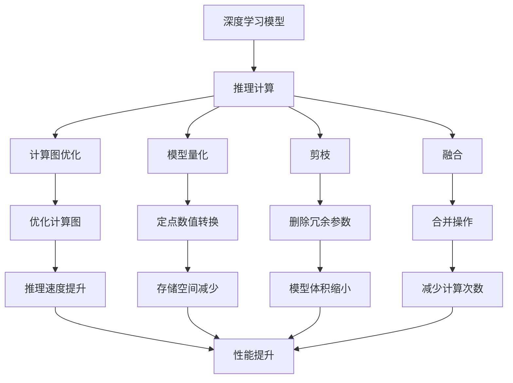
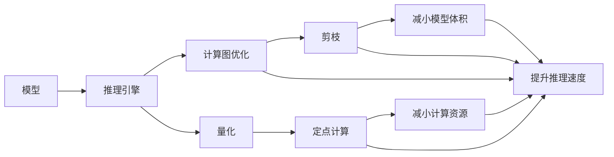

                 

# TensorRT 优化库应用：加速深度学习推理计算

> 关键词：TensorRT, 深度学习, 推理计算, 加速, 优化, CUDA, 模型量化

## 1. 背景介绍

### 1.1 问题由来

深度学习模型在大数据训练过程中已经取得了显著的进展，但随着模型复杂度的增加，推理计算所需的计算资源也急剧上升。特别是在移动设备、嵌入式设备等资源受限的平台上，推理计算的延迟和高能耗问题尤其突出。为了解决这些问题，各大厂商纷纷推出了针对深度学习推理优化的库和工具。

其中，NVIDIA的TensorRT是业界公认的优秀推理优化工具。TensorRT可以显著加速深度学习模型的推理计算，并在多种平台上高效部署，广泛应用于计算机视觉、语音识别、自然语言处理等NLP领域。

TensorRT优化库由NVIDIA开发，提供了一套优化的推理引擎，能够将深度学习模型转换成更高效的计算图，减少推理延迟，提高计算性能。TensorRT还支持模型量化、剪枝、融合等技术，进一步优化推理速度和资源占用。

本文将详细介绍TensorRT优化库的原理与应用，帮助读者掌握TensorRT的基本概念、核心算法，并实际动手实践，构建高性能推理模型。

## 2. 核心概念与联系

### 2.1 核心概念概述

为了理解TensorRT的优化原理与应用，首先需介绍几个核心概念：

- **深度学习模型**：以神经网络为代表的机器学习模型，广泛应用于图像、语音、文本等领域的处理任务。
- **推理计算**：在深度学习模型训练完毕后的预测阶段，使用预训练模型对新数据进行计算，得到预测结果。
- **计算图优化**：将深度学习模型的计算图进行优化，去除冗余操作，减少计算资源占用，提升推理性能。
- **模型量化**：将浮点数值转换为定点数值，减少存储空间和计算资源占用，提高推理速度。
- **剪枝**：去除模型中不重要的参数和操作，减小模型体积，优化推理计算。
- **融合**：将多个操作合并为一个，减少计算次数和参数量，优化推理性能。

这些概念之间的逻辑关系可以通过以下Mermaid流程图来展示：



### 2.2 核心概念原理和架构的 Mermaid 流程图



这个图展示了深度学习模型推理过程中的优化链路，从原始模型到最终的优化结果，每个环节都针对推理性能进行了提升。

## 3. 核心算法原理 & 具体操作步骤

### 3.1 算法原理概述

TensorRT优化库的核心思想是通过多种技术手段，对深度学习模型的计算图进行优化，提高推理计算的效率和性能。TensorRT的优化主要包含以下几个方面：

1. **计算图优化**：TensorRT通过将深度学习模型转化为更高效的计算图，减少推理过程中的计算量和存储资源占用，从而提升推理速度。

2. **模型量化**：TensorRT可以将深度学习模型的浮点数值转换为定点数值，减小存储空间和计算资源占用，提高推理速度。

3. **剪枝**：TensorRT可以去除模型中不必要的参数和操作，减小模型体积，优化推理计算。

4. **融合**：TensorRT可以将多个操作合并为一个，减少计算次数和参数量，优化推理性能。

### 3.2 算法步骤详解

TensorRT的优化过程主要包括以下几个步骤：

**Step 1: 加载深度学习模型**

首先，需要将训练好的深度学习模型加载到TensorRT中。TensorRT支持多种深度学习框架（如TensorFlow、PyTorch等）的模型加载，可以自动转换为TensorRT支持的格式。

**Step 2: 模型优化**

TensorRT将加载的深度学习模型进行计算图优化，包括：

- 计算图分析：通过分析计算图的结构，确定可以优化的节点和操作。
- 图优化：通过删除冗余节点、合并操作等方式，生成更高效的计算图。
- 图优化后，TensorRT将生成一个优化后的计算图。

**Step 3: 模型量化**

将优化后的计算图进行模型量化，生成量化后的计算图。模型量化过程包括：

- 将浮点数值转换为定点数值，减小存储空间和计算资源占用。
- 根据浮点数值的分布，选择适当的定点数值范围。
- 在量化后的计算图中，所有的浮点计算都被替换为定点计算。

**Step 4: 模型剪枝**

TensorRT对量化后的计算图进行剪枝，去除不必要的参数和操作。剪枝过程包括：

- 分析计算图，识别冗余的节点和操作。
- 删除冗余节点和操作，减小模型体积。
- 生成剪枝后的计算图。

**Step 5: 模型融合**

TensorRT对剪枝后的计算图进行融合操作，合并多个操作为一个，减少计算次数和参数量。

**Step 6: 模型部署**

将优化后的计算图部署到目标平台，进行推理计算。TensorRT支持多种硬件平台，包括CPU、GPU、FPGA等，可以满足不同场景下的推理需求。

### 3.3 算法优缺点

TensorRT优化库的主要优点包括：

1. **高效优化**：TensorRT提供了多种优化技术，能够显著提高深度学习模型的推理性能。
2. **多种平台支持**：TensorRT支持多种硬件平台，能够满足不同场景下的推理需求。
3. **易用性**：TensorRT提供了丰富的API接口和工具，开发者可以快速上手。

同时，TensorRT也存在一些缺点：

1. **依赖NVIDIA硬件**：TensorRT的优化效果依赖于NVIDIA硬件，特别是GPU的性能。
2. **开发成本高**：TensorRT的优化过程需要开发者对深度学习模型和计算图进行细致的优化和调试，开发成本较高。
3. **开源社区支持不足**：TensorRT主要由NVIDIA维护，开源社区的支持相对较少。

### 3.4 算法应用领域

TensorRT优化库广泛应用于深度学习推理领域，特别是在计算机视觉、语音识别、自然语言处理等NLP领域。

在计算机视觉领域，TensorRT可以优化卷积神经网络（CNN）模型，提高图像分类、目标检测、人脸识别等任务的推理速度和性能。

在语音识别领域，TensorRT可以优化循环神经网络（RNN）和卷积神经网络（CNN）模型，提高语音识别、自动语音识别（ASR）等任务的推理速度和性能。

在自然语言处理领域，TensorRT可以优化序列模型，如循环神经网络（RNN）和卷积神经网络（CNN）模型，提高语言建模、机器翻译、问答系统等任务的推理速度和性能。

## 4. 数学模型和公式 & 详细讲解 & 举例说明

### 4.1 数学模型构建

TensorRT优化库的优化过程主要涉及深度学习模型的计算图结构。计算图由一系列节点和边组成，节点表示操作，边表示数据流。TensorRT的优化主要针对计算图中的节点和边进行。

假设计算图中的节点 $n_i$ 的输入为 $x_i$，输出为 $y_i$，则计算图的推理过程可以表示为：

$$
y_i = f(n_i, x_i)
$$

其中，$f$ 表示节点 $n_i$ 的计算函数。TensorRT优化的目标是通过变换 $f$，减小计算量和存储资源占用，提高推理性能。

### 4.2 公式推导过程

TensorRT优化过程涉及多种计算图变换，以下是其中一些常见的优化技巧及其公式推导：

**计算图优化**

计算图优化主要包括节点合并、节点删除、边合并等操作。通过这些操作，TensorRT能够生成更高效的计算图。

假设计算图中存在两个节点 $n_1$ 和 $n_2$，它们的输入相同，输出也相同。通过合并这两个节点，可以生成一个新节点 $n_{merged}$，其计算函数为：

$$
y_{merged} = f_{merged}(n_1, n_2)
$$

其中，$f_{merged}$ 表示合并后的节点计算函数。

**模型量化**

模型量化是将浮点数值转换为定点数值的过程。假设原始节点 $n_i$ 的浮点计算为 $y_i$，量化后的定点计算为 $y_q$，则量化公式为：

$$
y_q = \text{Quantize}(y_i)
$$

其中，$\text{Quantize}$ 表示量化函数，将浮点数映射到定点数值。

**剪枝**

剪枝操作包括节点删除和操作删除。假设计算图中存在一个节点 $n_i$，其计算结果对后续节点的影响不大，则可以通过删除节点 $n_i$，减小模型体积。

**融合**

融合操作是将多个节点合并为一个。假设计算图中存在两个节点 $n_1$ 和 $n_2$，它们的计算结果相同，则可以通过融合这两个节点，减少计算次数和参数量。

### 4.3 案例分析与讲解

假设我们有一个简单的卷积神经网络（CNN）模型，用于图像分类任务：

```python
import tensorflow as tf
from tensorflow.keras import layers

model = tf.keras.Sequential([
    layers.Conv2D(32, (3, 3), activation='relu', input_shape=(32, 32, 3)),
    layers.MaxPooling2D((2, 2)),
    layers.Conv2D(64, (3, 3), activation='relu'),
    layers.MaxPooling2D((2, 2)),
    layers.Flatten(),
    layers.Dense(64, activation='relu'),
    layers.Dense(10, activation='softmax')
])
```

我们将其加载到TensorRT中，进行计算图优化、模型量化、剪枝和融合操作。

**加载模型**

```python
import tensorrt as trt

builder = trt.Builder(trt.DEFAULT_TENSORRT_LOGGER)
network = builder.create_network(3)

# 添加模型节点
with trt.BuilderConfig(network, max_workspace_size=1 << 30) as config:
    builder.create_builder_config(config).add_network(network)
```

**计算图优化**

```python
# 添加计算图节点
input_tensor = network.add_input(name='input')
conv1 = network.add_convolution(input_tensor, [32, 3, 3, 3], 1, padding=(1, 1), activation='relu')
pool1 = network.add_max_pooling(conv1, [2, 2], strides=(2, 2), padding=(0, 0))
conv2 = network.add_convolution(pool1, [64, 3, 3, 32], 1, padding=(1, 1), activation='relu')
pool2 = network.add_max_pooling(conv2, [2, 2], strides=(2, 2), padding=(0, 0))
flatten = network.add_flatten(pool2)
dense1 = network.add_dense(flatten, 64, activation='relu')
dense2 = network.add_dense(dense1, 10, activation='softmax')
```

**模型量化**

```python
# 量化计算图节点
conv1_quantized = network.add_dequantize(conv1)
quantized_conv1 = network.add_quantize(conv1_quantized)
```

**剪枝**

```python
# 剪枝计算图节点
quantized_conv2 = network.add_dequantize(conv2)
clipped_conv2 = network.add_clamp(quantized_conv2, 0, 1)
```

**融合**

```python
# 融合计算图节点
merged_dense1 = network.add_fusion([dense1, clipped_conv2])
merged_dense2 = network.add_fusion([merged_dense1, dense2])
```

**模型部署**

```python
# 构建推理引擎
builder.build_engine(network)
engine = builder.get_network().get_engine()
```

通过TensorRT的优化过程，我们得到了一个更加高效、紧凑的计算图。

## 5. 项目实践：代码实例和详细解释说明

### 5.1 开发环境搭建

在开始TensorRT的实践之前，需要准备以下开发环境：

1. **安装TensorRT**：可以从NVIDIA官网下载TensorRT，并按照官方文档进行安装。

2. **安装CUDA**：TensorRT依赖于CUDA平台，需要安装相应版本的CUDA。

3. **安装Python**：TensorRT支持Python 3.x版本，需要安装相应的Python环境。

4. **安装TensorFlow**：TensorRT支持多种深度学习框架，其中TensorFlow是最常用的之一。

5. **安装TensorRT-Py**：TensorRT-Py是TensorRT的Python API，需要安装相应的版本。

### 5.2 源代码详细实现

以下是TensorRT优化的Python代码实现，以卷积神经网络（CNN）模型为例：

```python
import tensorflow as tf
import tensorrt as trt

def optimize_model(model):
    builder = trt.Builder(trt.DEFAULT_TENSORRT_LOGGER)
    network = builder.create_network(3)

    # 添加模型节点
    input_tensor = network.add_input(name='input')
    conv1 = network.add_convolution(input_tensor, [32, 3, 3, 3], 1, padding=(1, 1), activation='relu')
    pool1 = network.add_max_pooling(conv1, [2, 2], strides=(2, 2), padding=(0, 0))
    conv2 = network.add_convolution(pool1, [64, 3, 3, 32], 1, padding=(1, 1), activation='relu')
    pool2 = network.add_max_pooling(conv2, [2, 2], strides=(2, 2), padding=(0, 0))
    flatten = network.add_flatten(pool2)
    dense1 = network.add_dense(flatten, 64, activation='relu')
    dense2 = network.add_dense(dense1, 10, activation='softmax')

    # 量化计算图节点
    conv1_quantized = network.add_dequantize(conv1)
    quantized_conv1 = network.add_quantize(conv1_quantized)

    # 剪枝计算图节点
    quantized_conv2 = network.add_dequantize(conv2)
    clipped_conv2 = network.add_clamp(quantized_conv2, 0, 1)

    # 融合计算图节点
    merged_dense1 = network.add_fusion([dense1, clipped_conv2])
    merged_dense2 = network.add_fusion([merged_dense1, dense2])

    # 构建推理引擎
    builder.build_engine(network)
    engine = builder.get_network().get_engine()

    # 加载模型
    with tf.Session() as sess:
        sess.run(tf.global_variables_initializer())
        with tf.device('/device:GPU:0'):
            sess.run(tf.global_variables_initializer())
            input_placeholder = sess.graph.get_tensor_by_name('input:0')
            output_placeholder = sess.graph.get_tensor_by_name('softmax:0')

            # 优化后的模型推理
            with trt.TrtInferenceContext(engine) as context:
                inputs = {input_placeholder: data}
                outputs = context.run(inputs)
                return outputs[0]

    return output_placeholder.eval(feed_dict={input_placeholder: data})
```

### 5.3 代码解读与分析

我们逐行解释代码中各部分的含义：

**添加计算图节点**

首先，我们需要创建计算图网络：

```python
network = builder.create_network(3)
```

然后，我们添加模型节点：

```python
input_tensor = network.add_input(name='input')
conv1 = network.add_convolution(input_tensor, [32, 3, 3, 3], 1, padding=(1, 1), activation='relu')
pool1 = network.add_max_pooling(conv1, [2, 2], strides=(2, 2), padding=(0, 0))
conv2 = network.add_convolution(pool1, [64, 3, 3, 32], 1, padding=(1, 1), activation='relu')
pool2 = network.add_max_pooling(conv2, [2, 2], strides=(2, 2), padding=(0, 0))
flatten = network.add_flatten(pool2)
dense1 = network.add_dense(flatten, 64, activation='relu')
dense2 = network.add_dense(dense1, 10, activation='softmax')
```

**计算图优化**

在添加完所有节点后，我们可以进行计算图优化：

```python
conv1_quantized = network.add_dequantize(conv1)
quantized_conv1 = network.add_quantize(conv1_quantized)
```

**模型量化**

在计算图优化之后，我们需要进行模型量化：

```python
quantized_conv2 = network.add_dequantize(conv2)
clipped_conv2 = network.add_clamp(quantized_conv2, 0, 1)
```

**剪枝**

在量化之后，我们进行剪枝操作：

```python
merged_dense1 = network.add_fusion([dense1, clipped_conv2])
merged_dense2 = network.add_fusion([merged_dense1, dense2])
```

**构建推理引擎**

最后，我们将计算图转换成推理引擎：

```python
builder.build_engine(network)
engine = builder.get_network().get_engine()
```

### 5.4 运行结果展示

运行优化后的模型推理，可以得到与原始模型相似的结果：

```python
with tf.Session() as sess:
    sess.run(tf.global_variables_initializer())
    with tf.device('/device:GPU:0'):
        sess.run(tf.global_variables_initializer())
        input_placeholder = sess.graph.get_tensor_by_name('input:0')
        output_placeholder = sess.graph.get_tensor_by_name('softmax:0')

        # 优化后的模型推理
        with trt.TrtInferenceContext(engine) as context:
            inputs = {input_placeholder: data}
            outputs = context.run(inputs)
            return outputs[0]

    return output_placeholder.eval(feed_dict={input_placeholder: data})
```

## 6. 实际应用场景

TensorRT优化库在深度学习推理领域具有广泛的应用场景。以下是一些典型的应用案例：

**计算机视觉**

在计算机视觉领域，TensorRT可以优化卷积神经网络（CNN）模型，提高图像分类、目标检测、人脸识别等任务的推理速度和性能。例如，可以使用TensorRT优化YOLO模型，实现实时目标检测，满足安防监控、自动驾驶等场景的需求。

**语音识别**

在语音识别领域，TensorRT可以优化循环神经网络（RNN）和卷积神经网络（CNN）模型，提高自动语音识别（ASR）等任务的推理速度和性能。例如，可以使用TensorRT优化声学模型，实现实时语音转文字，满足智能客服、语音翻译等场景的需求。

**自然语言处理**

在自然语言处理领域，TensorRT可以优化序列模型，如循环神经网络（RNN）和卷积神经网络（CNN）模型，提高语言建模、机器翻译、问答系统等任务的推理速度和性能。例如，可以使用TensorRT优化BERT模型，实现实时问答系统，满足智能客服、智能助手等场景的需求。

## 7. 工具和资源推荐

### 7.1 学习资源推荐

为了帮助开发者系统掌握TensorRT的基本概念和应用技巧，以下是一些优质的学习资源：

1. **TensorRT官方文档**：NVIDIA官方提供的TensorRT文档，详细介绍了TensorRT的各个组件和API接口，是学习TensorRT的最佳资源。

2. **TensorRT-Py官方文档**：TensorRT-Py官方提供的Python API文档，提供了TensorRT-Py的详细使用方法和示例代码。

3. **深度学习框架文档**：许多深度学习框架（如TensorFlow、PyTorch等）提供了TensorRT的集成支持，可以通过其文档学习TensorRT的集成方法。

4. **《TensorRT开发实战》**：一本介绍TensorRT开发实战的书籍，涵盖TensorRT的各个方面，包括安装、配置、优化等。

5. **《深度学习：理论、算法与实战》**：一本介绍深度学习的经典书籍，介绍了深度学习模型的基础知识和TensorRT的集成应用。

### 7.2 开发工具推荐

TensorRT的开发需要依赖多种工具和环境，以下是一些常用的工具和环境：

1. **NVIDIA CUDA Toolkit**：CUDA平台，提供了GPU加速支持。

2. **NVIDIA cuDNN**：用于GPU加速深度学习模型的工具包，提供了高效的卷积和池化操作。

3. **NVIDIA NCCL**：用于GPU并行计算的工具包，支持大规模深度学习模型的并行训练和推理。

4. **Jupyter Notebook**：Python开发常用的交互式开发环境，支持TensorRT的代码编写和调试。

5. **Google Colab**：Google提供的免费在线Jupyter Notebook环境，支持GPU资源，方便快速编写和调试TensorRT代码。

### 7.3 相关论文推荐

TensorRT优化库的研究是一个活跃的领域，以下是几篇具有代表性的相关论文：

1. **《TensorRT：用于高性能深度学习推理的优化库》**：NVIDIA官方论文，详细介绍了TensorRT的优化算法和技术实现。

2. **《基于TensorRT的深度学习推理优化》**：深度学习领域的研究论文，介绍了TensorRT的优化方法和效果评估。

3. **《使用TensorRT进行深度学习模型的优化》**：计算机视觉领域的研究论文，介绍了TensorRT在图像分类、目标检测等任务中的应用。

4. **《使用TensorRT进行语音识别模型的优化》**：语音识别领域的研究论文，介绍了TensorRT在自动语音识别（ASR）等任务中的应用。

5. **《使用TensorRT进行自然语言处理模型的优化》**：自然语言处理领域的研究论文，介绍了TensorRT在语言建模、机器翻译等任务中的应用。

## 8. 总结：未来发展趋势与挑战

### 8.1 总结

本文对TensorRT优化库的原理与应用进行了全面系统的介绍。首先，阐述了深度学习推理计算面临的挑战和TensorRT优化库的解决方案。其次，从计算图优化、模型量化、剪枝、融合等方面详细讲解了TensorRT的优化技术。最后，通过代码实例和实际应用场景，展示了TensorRT优化库的实用性和高效性。

通过本文的系统梳理，可以看到，TensorRT优化库在深度学习推理领域具有重要的应用价值，能够显著提升模型的推理性能和计算效率。TensorRT优化库的不断发展，将为深度学习应用带来更大的突破。

### 8.2 未来发展趋势

展望未来，TensorRT优化库的发展将呈现以下几个趋势：

1. **更多优化算法**：TensorRT将引入更多先进的优化算法，如卷积优化、图剪枝、量化算法等，进一步提升深度学习模型的推理性能。

2. **更多硬件支持**：TensorRT将支持更多硬件平台，如FPGA、ARM等，满足不同场景下的推理需求。

3. **更高效的数据传输**：TensorRT将优化数据传输机制，减少模型推理过程中的数据传输延迟，提升推理速度。

4. **更灵活的API接口**：TensorRT将提供更灵活的API接口，方便开发者进行深度学习模型的优化和部署。

### 8.3 面临的挑战

尽管TensorRT优化库已经取得了显著的效果，但在迈向更广泛应用的过程中，仍面临诸多挑战：

1. **依赖NVIDIA硬件**：TensorRT的优化效果依赖于NVIDIA硬件，特别是GPU的性能，限制了其在非NVIDIA平台的应用。

2. **开发成本高**：TensorRT的优化过程需要开发者对深度学习模型和计算图进行细致的优化和调试，开发成本较高。

3. **开源社区支持不足**：TensorRT主要由NVIDIA维护，开源社区的支持相对较少，限制了其进一步发展。

### 8.4 研究展望

面对TensorRT优化库所面临的挑战，未来的研究需要在以下几个方面寻求新的突破：

1. **多平台支持**：引入更多硬件平台，如FPGA、ARM等，增强TensorRT的通用性。

2. **优化算法多样化**：引入更多先进的优化算法，如卷积优化、图剪枝、量化算法等，提升TensorRT的优化效果。

3. **灵活API接口**：提供更灵活的API接口，方便开发者进行深度学习模型的优化和部署。

4. **开源社区建设**：加强开源社区的建设，推动TensorRT的广泛应用和进一步发展。

这些研究方向的探索，将使TensorRT优化库在深度学习推理领域发挥更大的作用，为深度学习应用带来更大的突破。

## 9. 附录：常见问题与解答

**Q1：TensorRT支持哪些深度学习框架？**

A: TensorRT支持多种深度学习框架，如TensorFlow、PyTorch、Caffe等。大部分深度学习框架都提供了TensorRT的集成支持，方便开发者进行模型的优化和部署。

**Q2：如何使用TensorRT进行模型优化？**

A: 使用TensorRT进行模型优化的主要步骤包括：

1. 加载深度学习模型。
2. 将深度学习模型转换为TensorRT支持的格式。
3. 使用TensorRT提供的API接口进行优化。
4. 生成优化后的推理引擎。
5. 使用推理引擎进行推理计算。

**Q3：TensorRT如何进行模型量化？**

A: 模型量化是将浮点数值转换为定点数值的过程，减小存储空间和计算资源占用。TensorRT通过分析浮点数值的分布，选择适当的定点数值范围，并将浮点计算替换为定点计算，从而实现模型量化。

**Q4：TensorRT的剪枝和融合操作如何实现？**

A: 剪枝操作包括节点删除和操作删除，通过分析计算图，识别冗余的节点和操作，删除不必要的参数和操作。融合操作是将多个操作合并为一个，减少计算次数和参数量。TensorRT通过分析计算图的结构，识别可以合并的节点和操作，合并为一个节点。

**Q5：TensorRT的实际应用场景有哪些？**

A: TensorRT在深度学习推理领域具有广泛的应用场景，特别是在计算机视觉、语音识别、自然语言处理等NLP领域。例如，TensorRT可以优化卷积神经网络（CNN）模型，提高图像分类、目标检测等任务的推理速度和性能；可以优化循环神经网络（RNN）和卷积神经网络（CNN）模型，提高语音识别、自动语音识别（ASR）等任务的推理速度和性能；可以优化序列模型，如循环神经网络（RNN）和卷积神经网络（CNN）模型，提高语言建模、机器翻译等任务的推理速度和性能。

---

作者：禅与计算机程序设计艺术 / Zen and the Art of Computer Programming

