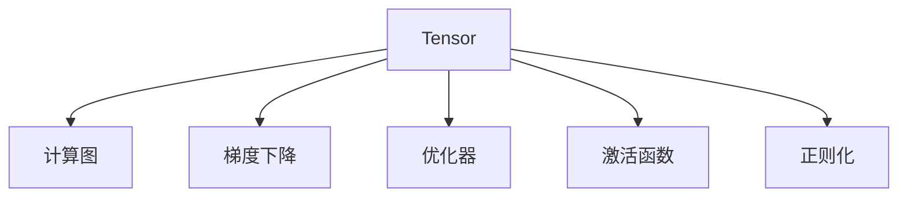

                 

# Tensor计算：深度学习的数学基石

> 关键词：Tensor, 张量, 深度学习, 计算图, 梯度下降, 反向传播, 优化器, 神经网络, 卷积, 循环神经网络, 矩阵乘法, 激活函数, 正则化

## 1. 背景介绍

### 1.1 问题由来

深度学习（Deep Learning），作为人工智能领域的一个重要分支，近年来在图像识别、语音识别、自然语言处理等领域取得了显著的进展。然而，深度学习模型的本质是什么？它们是如何计算和优化的？这些问题一直困扰着广大学者。为此，本文将深入探讨Tensor（张量）计算在深度学习中的基础地位，揭示其在深度学习数学模型构建和计算优化中的核心作用。

### 1.2 问题核心关键点

Tensor计算，即张量计算，是深度学习模型的基础。它通过多维数组（即张量）来存储和操作数据，使得模型的计算过程更加高效和灵活。Tensor计算的核心包括：

1. 张量作为数据载体，通过维度的扩展，支持模型对大规模数据的处理和运算。
2. 计算图（Computational Graph），用于表示整个计算过程，包括前向传播和反向传播。
3. 梯度下降算法（Gradient Descent），用于通过反向传播计算和更新模型参数。
4. 各类优化器（Optimizers），如SGD、Adam等，用于加速模型训练和提高收敛速度。
5. 激活函数（Activation Functions），如ReLU、Sigmoid等，用于模型非线性变换。

这些核心概念和算法，共同构成了深度学习模型的计算基础，使得模型能够高效地处理和优化复杂的数据和任务。

## 2. 核心概念与联系

### 2.1 核心概念概述

为更好地理解Tensor计算在深度学习中的作用，本节将介绍几个密切相关的核心概念：

- **Tensor**：多维数组，是深度学习中数据的基本表示形式。Tensor计算通过Tensor来存储和操作数据。
- **计算图**：表示计算过程的图形结构，前向传播和反向传播均通过计算图完成。
- **梯度下降**：通过反向传播计算梯度，更新模型参数以最小化损失函数。
- **优化器**：调整学习率等超参数，加速模型训练和提高收敛速度。
- **激活函数**：用于模型非线性变换，增强模型的表达能力。
- **正则化**：防止模型过拟合，如L1、L2正则化、Dropout等。

这些核心概念之间的逻辑关系可以通过以下Mermaid流程图来展示：



这个流程图展示了几大核心概念的相互关系：

1. Tensor作为数据载体，通过计算图进行前向传播和反向传播。
2. 梯度下降通过计算图计算梯度，优化器调整学习率等参数，加速模型训练。
3. 激活函数用于模型非线性变换，正则化防止模型过拟合。

## 3. 核心算法原理 & 具体操作步骤

### 3.1 算法原理概述

Tensor计算的核心是梯度下降算法，通过反向传播（Backpropagation）计算梯度，并更新模型参数以最小化损失函数。在深度学习中，前向传播用于计算模型的输出，反向传播用于计算损失函数的梯度，两者通过计算图进行组合。

形式化地，假设模型 $M_{\theta}$ 的输入为 $x$，输出为 $y$，损失函数为 $\mathcal{L}$，则梯度下降的目标是最小化损失函数：

$$
\theta^* = \mathop{\arg\min}_{\theta} \mathcal{L}(M_{\theta}(x))
$$

其中，$\theta$ 为模型参数，$M_{\theta}$ 为模型在参数 $\theta$ 下的输出。通过反向传播，计算梯度：

$$
\nabla_{\theta}\mathcal{L}(x) = \frac{\partial \mathcal{L}(M_{\theta}(x))}{\partial \theta}
$$

并将梯度代入梯度下降公式，更新模型参数：

$$
\theta \leftarrow \theta - \eta\nabla_{\theta}\mathcal{L}(x)
$$

其中，$\eta$ 为学习率，控制模型参数的更新幅度。

### 3.2 算法步骤详解

Tensor计算在深度学习中的应用，通常包括以下几个关键步骤：

**Step 1: 准备Tensor和计算图**

- 定义Tensor，用于存储输入数据和模型参数。
- 定义计算图，表示前向传播和反向传播过程。

**Step 2: 前向传播计算**

- 将输入数据输入计算图，通过计算图计算模型输出。

**Step 3: 计算损失函数**

- 计算模型输出与真实标签之间的差异，得到损失函数值。

**Step 4: 反向传播计算梯度**

- 通过反向传播算法，计算损失函数对每个模型参数的梯度。

**Step 5: 更新模型参数**

- 根据梯度下降公式，更新模型参数。

**Step 6: 监控和评估**

- 在验证集或测试集上评估模型性能，如准确率、精确度、召回率等指标。

### 3.3 算法优缺点

Tensor计算在深度学习中的应用具有以下优点：

1. **高效性**：通过张量计算，模型能够高效地处理大规模数据，加速计算过程。
2. **灵活性**：计算图结构灵活，支持复杂模型的构建和优化。
3. **可扩展性**：支持多GPU、多机器的分布式计算，提高计算效率。

同时，Tensor计算也存在一些缺点：

1. **资源消耗大**：大模型和复杂计算图需要大量的计算资源，如GPU、内存等。
2. **调试困难**：计算图复杂，调试和维护成本较高。
3. **学习曲线陡峭**：需要较高的数学和编程技能，入门难度较大。

尽管存在这些局限性，Tensor计算仍然是深度学习模型的基础，广泛应用于各种NLP、计算机视觉、语音识别等任务中。

### 3.4 算法应用领域

Tensor计算在深度学习中的应用非常广泛，覆盖了几乎所有常见任务，例如：

- **图像分类**：如MNIST、CIFAR-10等数据集上的分类任务。
- **目标检测**：如Faster R-CNN、YOLO等模型的检测任务。
- **机器翻译**：如Seq2Seq模型、Transformer等模型的翻译任务。
- **语音识别**：如CTC模型、Attention机制等模型的语音识别任务。
- **自然语言处理**：如BERT、GPT等模型的语言处理任务。
- **强化学习**：如DQN、DeepMind AlphaGo等模型的强化学习任务。

除了上述这些经典任务外，Tensor计算也被创新性地应用到更多场景中，如生成对抗网络（GANs）、自监督学习等前沿技术，为深度学习技术带来了新的突破。

## 4. 数学模型和公式 & 详细讲解 & 举例说明

### 4.1 数学模型构建

本节将使用数学语言对Tensor计算的过程进行更加严格的刻画。

记模型 $M_{\theta}$ 的输入为 $x$，输出为 $y$，损失函数为 $\mathcal{L}$，则梯度下降的目标是最小化损失函数：

$$
\theta^* = \mathop{\arg\min}_{\theta} \mathcal{L}(M_{\theta}(x))
$$

假设模型 $M_{\theta}$ 为神经网络，输出为 $y = M_{\theta}(x)$，其中 $x \in \mathbb{R}^n$，$y \in \mathbb{R}^m$。假设损失函数 $\mathcal{L}$ 为均方误差，则：

$$
\mathcal{L}(y, y^*) = \frac{1}{2}\sum_{i=1}^m (y_i - y_i^*)^2
$$

其中，$y_i^*$ 为真实标签，$y_i$ 为模型预测结果。

### 4.2 公式推导过程

以下我们以二分类任务为例，推导梯度下降算法的过程。

假设模型 $M_{\theta}$ 为逻辑回归模型，输出为 $y = \sigma(\theta^T x)$，其中 $\sigma(x) = \frac{1}{1+e^{-x}}$ 为sigmoid激活函数，$\theta \in \mathbb{R}^n$ 为模型参数。假设损失函数 $\mathcal{L}$ 为二分类交叉熵损失，则：

$$
\mathcal{L}(y, y^*) = -\frac{1}{N}\sum_{i=1}^N [y_i\log \sigma(\theta^T x_i)+(1-y_i)\log (1-\sigma(\theta^T x_i))]
$$

将其代入经验风险公式，得：

$$
\mathcal{L}(\theta) = -\frac{1}{N}\sum_{i=1}^N [y_i\log \sigma(\theta^T x_i)+(1-y_i)\log (1-\sigma(\theta^T x_i))]
$$

通过链式法则，损失函数对参数 $\theta_k$ 的梯度为：

$$
\frac{\partial \mathcal{L}(\theta)}{\partial \theta_k} = -\frac{1}{N}\sum_{i=1}^N [(y_i-\hat{y_i})\sigma(\theta^T x_i)(1-\sigma(\theta^T x_i))x_{ik}]
$$

其中，$\hat{y_i} = \sigma(\theta^T x_i)$ 为模型预测结果。

在得到损失函数的梯度后，即可带入梯度下降公式，完成模型的迭代优化。重复上述过程直至收敛，最终得到适应下游任务的最优模型参数 $\theta^*$。

### 4.3 案例分析与讲解

考虑一个简单的二分类任务，数据集 $D=\{(x_i, y_i)\}_{i=1}^N$，其中 $x_i \in \mathbb{R}^2$，$y_i \in \{0,1\}$。假设模型 $M_{\theta}$ 为线性回归模型，输出为 $y = \theta^T x + b$。假设损失函数 $\mathcal{L}$ 为均方误差损失，则：

$$
\mathcal{L}(y, y^*) = \frac{1}{2N}\sum_{i=1}^N (y_i - \theta^T x_i - b)^2
$$

通过反向传播，计算梯度：

$$
\frac{\partial \mathcal{L}(\theta)}{\partial \theta_k} = -\frac{1}{N}\sum_{i=1}^N (y_i - \theta^T x_i - b)x_{ik}
$$

带入梯度下降公式，更新模型参数：

$$
\theta \leftarrow \theta - \eta\nabla_{\theta}\mathcal{L}(x)
$$

其中，$\eta$ 为学习率，控制模型参数的更新幅度。

## 5. 项目实践：代码实例和详细解释说明

### 5.1 开发环境搭建

在进行Tensor计算实践前，我们需要准备好开发环境。以下是使用Python进行PyTorch开发的环境配置流程：

1. 安装Anaconda：从官网下载并安装Anaconda，用于创建独立的Python环境。

2. 创建并激活虚拟环境：
```bash
conda create -n pytorch-env python=3.8 
conda activate pytorch-env
```

3. 安装PyTorch：根据CUDA版本，从官网获取对应的安装命令。例如：
```bash
conda install pytorch torchvision torchaudio cudatoolkit=11.1 -c pytorch -c conda-forge
```

4. 安装TensorFlow：
```bash
pip install tensorflow
```

5. 安装各类工具包：
```bash
pip install numpy pandas scikit-learn matplotlib tqdm jupyter notebook ipython
```

完成上述步骤后，即可在`pytorch-env`环境中开始Tensor计算实践。

### 5.2 源代码详细实现

下面我们以线性回归为例，给出使用PyTorch进行Tensor计算的PyTorch代码实现。

首先，定义线性回归模型：

```python
import torch
import torch.nn as nn
import torch.optim as optim

# 定义线性回归模型
class LinearRegression(nn.Module):
    def __init__(self, input_dim, output_dim):
        super(LinearRegression, self).__init__()
        self.linear = nn.Linear(input_dim, output_dim)
    
    def forward(self, x):
        return self.linear(x)
```

然后，定义损失函数和优化器：

```python
# 定义均方误差损失函数
def mse_loss(y_pred, y_true):
    return ((y_pred - y_true) ** 2).mean()

# 定义优化器
optimizer = optim.SGD(model.parameters(), lr=0.01)
```

接着，定义训练和评估函数：

```python
# 训练函数
def train(model, train_data, num_epochs):
    criterion = nn.MSELoss()
    for epoch in range(num_epochs):
        for inputs, targets in train_data:
            optimizer.zero_grad()
            outputs = model(inputs)
            loss = criterion(outputs, targets)
            loss.backward()
            optimizer.step()
        print(f'Epoch {epoch+1}, Loss: {loss:.4f}')

# 评估函数
def evaluate(model, test_data):
    total_loss = 0
    with torch.no_grad():
        for inputs, targets in test_data:
            outputs = model(inputs)
            total_loss += criterion(outputs, targets).item()
    return total_loss / len(test_data)
```

最后，启动训练流程并在测试集上评估：

```python
# 准备数据集
x_train = torch.tensor([[1, 2], [2, 3], [3, 4], [4, 5]], dtype=torch.float32)
y_train = torch.tensor([[3], [5], [7], [9]], dtype=torch.float32)
x_test = torch.tensor([[5, 6], [6, 7], [7, 8]], dtype=torch.float32)
y_test = torch.tensor([[11], [13], [15]], dtype=torch.float32)

# 创建模型和数据集
model = LinearRegression(input_dim=2, output_dim=1)
train_data = list(zip(x_train, y_train))
test_data = list(zip(x_test, y_test))

# 训练模型
train(model, train_data, num_epochs=100)

# 评估模型
print(f'Test Loss: {evaluate(model, test_data)}')
```

以上就是使用PyTorch进行Tensor计算的完整代码实现。可以看到，通过定义模型、损失函数和优化器，利用Tensor计算的强大能力，我们能够高效地完成模型训练和评估。

### 5.3 代码解读与分析

让我们再详细解读一下关键代码的实现细节：

**LinearRegression类**：
- `__init__`方法：初始化模型参数，包括线性层。
- `forward`方法：前向传播计算输出。

**mse_loss函数**：
- 计算均方误差损失函数。

**train函数**：
- 遍历数据集，每次更新模型参数，计算并输出损失函数值。

**evaluate函数**：
- 遍历测试集，计算损失函数值并返回均值。

**训练流程**：
- 准备数据集，创建模型和优化器。
- 在训练集上训练模型，输出每个epoch的损失函数值。
- 在测试集上评估模型性能，输出测试损失值。

可以看到，通过Tensor计算，我们能够高效地进行模型训练和评估。通过定义模型、损失函数和优化器，我们能够快速地搭建和训练深度学习模型。Tensor计算的强大能力，使得深度学习模型的开发变得更加高效和灵活。

当然，工业级的系统实现还需考虑更多因素，如模型的保存和部署、超参数的自动搜索、更灵活的任务适配层等。但核心的Tensor计算范式基本与此类似。

## 6. 实际应用场景

### 6.1 智能推荐系统

Tensor计算在智能推荐系统中的应用，可以显著提升推荐效果。传统推荐系统往往只依赖用户的历史行为数据进行物品推荐，无法深入理解用户的真实兴趣偏好。通过Tensor计算，我们可以构建更复杂的推荐模型，如协同过滤、矩阵分解等，能够从用户的行为数据中挖掘更深刻的隐藏信息，推荐更符合用户兴趣的物品。

在实践中，可以收集用户浏览、点击、评论、分享等行为数据，提取和用户交互的物品标题、描述、标签等文本内容。将文本内容作为模型输入，用户的后续行为（如是否点击、购买等）作为监督信号，在此基础上微调预训练语言模型。微调后的模型能够从文本内容中准确把握用户的兴趣点。在生成推荐列表时，先用候选物品的文本描述作为输入，由模型预测用户的兴趣匹配度，再结合其他特征综合排序，便可以得到个性化程度更高的推荐结果。

### 6.2 图像识别系统

Tensor计算在图像识别系统中的应用，能够显著提升模型的识别精度和效率。传统图像识别模型往往依赖手工设计的特征提取器，难以捕捉图像中的复杂特征。通过Tensor计算，我们可以构建更复杂的卷积神经网络（CNN）模型，如ResNet、VGG等，能够自动学习图像中的高级特征，提升识别精度。

在实践中，可以使用TensorFlow等框架构建CNN模型，通过训练集进行监督学习，得到最优的模型参数。在测试集上评估模型性能，调整模型参数，提高模型的泛化能力。通过Tensor计算，我们能够高效地进行模型训练和推理，构建高性能的图像识别系统。

### 6.3 自然语言处理系统

Tensor计算在自然语言处理系统中的应用，能够显著提升模型的理解能力和生成能力。传统NLP模型往往依赖手工设计的特征提取器，难以捕捉语言的语义和结构信息。通过Tensor计算，我们可以构建更复杂的Transformer模型，如BERT、GPT等，能够自动学习语言的语义和结构信息，提升模型的理解能力和生成能力。

在实践中，可以使用TensorFlow等框架构建Transformer模型，通过训练集进行监督学习，得到最优的模型参数。在测试集上评估模型性能，调整模型参数，提高模型的泛化能力。通过Tensor计算，我们能够高效地进行模型训练和推理，构建高性能的自然语言处理系统。

## 7. 工具和资源推荐

### 7.1 学习资源推荐

为了帮助开发者系统掌握Tensor计算的理论基础和实践技巧，这里推荐一些优质的学习资源：

1. 《深度学习》系列博文：由大模型技术专家撰写，深入浅出地介绍了Tensor计算原理、TensorFlow等框架的搭建和应用。

2. 《TensorFlow官方文档》：TensorFlow官方文档，提供了详尽的API参考和实践指南，是Tensor计算的权威资料。

3. 《PyTorch官方文档》：PyTorch官方文档，提供了详尽的API参考和实践指南，是Tensor计算的权威资料。

4. 《机器学习实战》书籍：介绍TensorFlow和Keras等框架的实践应用，适合初学者入门。

5. 《Deep Learning with Python》书籍：介绍TensorFlow的高级应用，适合进阶学习者。

通过对这些资源的学习实践，相信你一定能够快速掌握Tensor计算的精髓，并用于解决实际的深度学习问题。

### 7.2 开发工具推荐

高效的开发离不开优秀的工具支持。以下是几款用于Tensor计算开发的常用工具：

1. TensorFlow：由Google主导开发的开源深度学习框架，支持分布式计算和GPU加速，适用于大规模工程应用。

2. PyTorch：基于Python的开源深度学习框架，灵活动态的计算图，适合快速迭代研究。

3. Keras：高级神经网络API，支持多种后端，如TensorFlow、Theano等，适用于快速原型开发。

4. Jupyter Notebook：支持代码块、数学公式、图表等，适用于交互式开发和教学。

5. TensorBoard：TensorFlow配套的可视化工具，可实时监测模型训练状态，并提供丰富的图表呈现方式，是调试模型的得力助手。

6. Weights & Biases：模型训练的实验跟踪工具，可以记录和可视化模型训练过程中的各项指标，方便对比和调优。

合理利用这些工具，可以显著提升Tensor计算的开发效率，加快创新迭代的步伐。

### 7.3 相关论文推荐

Tensor计算作为深度学习的基础，相关论文研究也取得了许多重要成果。以下是几篇奠基性的相关论文，推荐阅读：

1. TensorFlow: A System for Large-Scale Machine Learning：提出TensorFlow框架，支持分布式计算和GPU加速，是深度学习的主流框架之一。

2. PyTorch: Tensors and Dynamic neural networks in Python with strong GPU acceleration：提出PyTorch框架，支持动态计算图，适用于快速迭代研究。

3. A Survey of Optimization Techniques for Deep Neural Networks：综述了各种优化算法，如SGD、Adam等，用于加速模型训练和提高收敛速度。

4. Understanding the difficulty of training deep feedforward neural networks：分析了深度神经网络的训练困难，提出各种优化算法和正则化方法，如Dropout、L2正则化等。

5. Deep Residual Learning for Image Recognition：提出ResNet模型，通过残差连接解决深度神经网络的退化问题，提升了模型的表达能力。

这些论文代表了大模型计算的基础研究方向，通过学习这些前沿成果，可以帮助研究者把握学科前进方向，激发更多的创新灵感。

## 8. 总结：未来发展趋势与挑战

### 8.1 总结

本文对Tensor计算在深度学习中的应用进行了全面系统的介绍。首先阐述了Tensor计算在深度学习中的基础地位，明确了Tensor计算在数据表示、计算图构建、梯度下降、优化器设计等关键环节的作用。其次，从原理到实践，详细讲解了Tensor计算的数学模型和关键步骤，给出了Tensor计算任务开发的完整代码实例。同时，本文还广泛探讨了Tensor计算在智能推荐、图像识别、自然语言处理等多个领域的应用前景，展示了Tensor计算的广泛适用性。

通过本文的系统梳理，可以看到，Tensor计算作为深度学习的基础，在模型构建和计算优化中发挥了核心作用。Tensor计算的高效性、灵活性和可扩展性，使得深度学习模型能够高效地处理和优化大规模数据，构建高性能的人工智能系统。未来，随着Tensor计算技术的不断进步，深度学习将迎来更广阔的发展空间，为人机协同的智能时代带来新的突破。

### 8.2 未来发展趋势

展望未来，Tensor计算在深度学习中的应用将呈现以下几个发展趋势：

1. **多模态计算**：Tensor计算不仅支持数值计算，还能支持图像、视频、语音等多种模态数据的处理和计算，扩展了Tensor计算的应用范围。

2. **分布式计算**：Tensor计算将支持更多分布式计算框架，如TensorFlow、PyTorch等，加速大规模模型的训练和推理。

3. **自动机器学习**：通过自动化算法调优，Tensor计算将进一步降低深度学习模型的开发成本，提升模型的训练效率。

4. **硬件加速**：Tensor计算将支持更多硬件加速方案，如GPU、TPU、FPGA等，进一步提升计算速度和模型性能。

5. **模型压缩和加速**：通过模型压缩、量化等技术，Tensor计算将支持更多轻量级模型，降低计算资源消耗。

6. **模型解释性**：通过模型可视化、可解释性技术，Tensor计算将增强模型的解释能力，帮助用户理解模型的决策过程。

这些趋势凸显了Tensor计算在深度学习中的重要地位，展示了Tensor计算技术的广阔前景。Tensor计算技术的不断进步，将推动深度学习模型的应用更加广泛和高效，为人类认知智能的进化带来深远影响。

### 8.3 面临的挑战

尽管Tensor计算在深度学习中取得了显著成果，但在迈向更加智能化、普适化应用的过程中，它仍面临诸多挑战：

1. **资源消耗大**：大模型和复杂计算图需要大量的计算资源，如GPU、内存等，资源消耗大。

2. **调试困难**：计算图复杂，调试和维护成本较高，需要更多技术支持和实践经验。

3. **学习曲线陡峭**：需要较高的数学和编程技能，入门难度较大。

4. **模型泛化性不足**：复杂的模型结构可能导致模型泛化能力不足，难以适应新场景和新数据。

5. **可解释性不足**：模型的决策过程缺乏可解释性，难以理解模型的内部机制。

6. **安全性问题**：模型可能学习到有偏见、有害的信息，带来安全隐患。

7. **隐私保护**：大规模数据处理可能涉及隐私问题，如何保护用户隐私成为重要课题。

8. **计算效率低**：模型压缩和加速技术仍有待提升，模型推理速度慢。

这些挑战需要未来的研究和实践加以解决，才能使Tensor计算技术在深度学习中发挥更大的作用。

### 8.4 研究展望

面对Tensor计算所面临的挑战，未来的研究需要在以下几个方面寻求新的突破：

1. **优化模型结构**：优化模型的计算图和参数，提升模型的泛化能力和可解释性。

2. **强化自动化学习**：通过自动化算法调优，降低深度学习模型的开发成本，提升模型的训练效率。

3. **提升硬件加速**：支持更多硬件加速方案，加速大规模模型的训练和推理。

4. **增强模型解释性**：通过模型可视化、可解释性技术，增强模型的解释能力，帮助用户理解模型的决策过程。

5. **保护用户隐私**：通过数据脱敏、差分隐私等技术，保护用户隐私，解决数据安全问题。

6. **提升计算效率**：通过模型压缩、量化等技术，提升模型的计算效率，降低资源消耗。

这些研究方向的探索，必将引领Tensor计算技术迈向更高的台阶，为构建安全、可靠、可解释、可控的智能系统铺平道路。面向未来，Tensor计算技术还需要与其他人工智能技术进行更深入的融合，如知识表示、因果推理、强化学习等，多路径协同发力，共同推动深度学习模型的进步。只有勇于创新、敢于突破，才能不断拓展Tensor计算的边界，让智能技术更好地造福人类社会。

## 9. 附录：常见问题与解答

**Q1：Tensor计算与矩阵计算有何区别？**

A: Tensor计算是深度学习模型的基础，通过多维数组（即Tensor）来存储和操作数据。Tensor计算不仅支持矩阵计算，还支持高维张量计算，可以处理更加复杂的数据结构。Tensor计算还包括计算图、梯度下降等关键组件，构建深度学习模型时需要进行前后向传播，计算梯度并更新参数。

**Q2：Tensor计算中，如何设置合适的学习率？**

A: 设置合适的学习率是Tensor计算中的关键步骤。学习率过大会导致模型发散，学习率过小会导致模型收敛慢。一般来说，初始学习率可以从0.01开始，然后逐步减小。也可以使用学习率调度策略，如学习率衰减、学习率剪枝等，确保模型收敛。

**Q3：Tensor计算中，如何避免梯度消失和梯度爆炸问题？**

A: 梯度消失和梯度爆炸问题是Tensor计算中的常见问题。为了避免这些问题，可以使用梯度裁剪、权重初始化等技术。此外，选择合适的激活函数和优化器也能在一定程度上缓解这些问题。

**Q4：Tensor计算中，如何防止模型过拟合？**

A: 防止模型过拟合是Tensor计算中的重要任务。可以使用正则化技术，如L1正则化、L2正则化、Dropout等。此外，还可以通过数据增强、对抗训练等技术，提高模型的泛化能力。

**Q5：Tensor计算中，如何优化模型的计算效率？**

A: 优化模型的计算效率是Tensor计算中的重要任务。可以使用模型压缩、量化等技术，减少模型参数和计算量。此外，还可以通过优化计算图、使用分布式计算等技术，提高模型的计算效率。

这些问题的解答，可以帮助开发者更好地理解Tensor计算，并应用于实际的深度学习模型构建中。

---

作者：禅与计算机程序设计艺术 / Zen and the Art of Computer Programming

