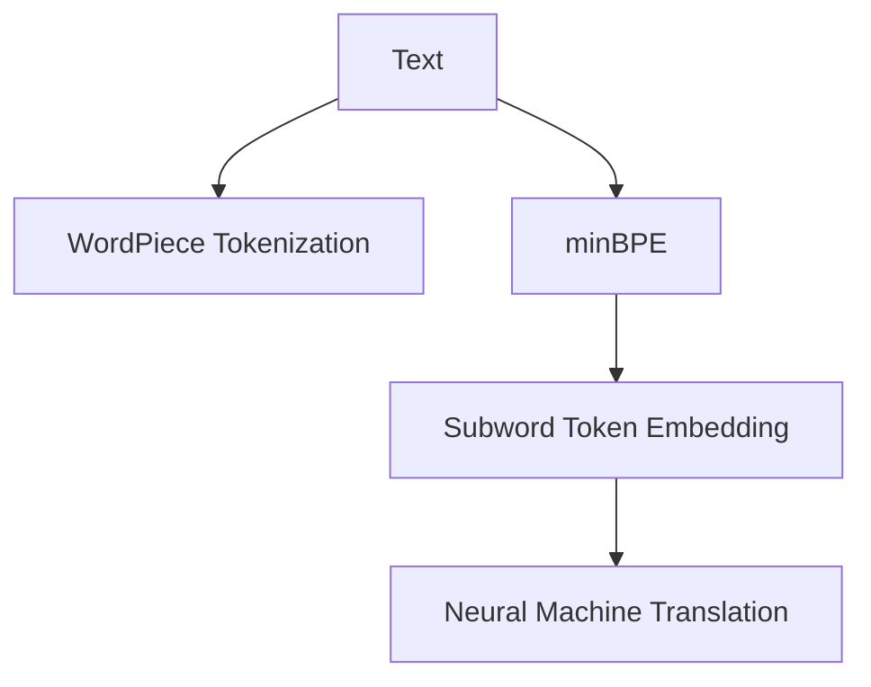

                 

# Tokenization技术：最小字节对编码（minBPE）详解

> 关键词：Tokenization, minBPE, Subword Tokenization, Byte Pair Encoding, WordPiece Tokenization, Neural Machine Translation, Subword Token Embedding

## 1. 背景介绍

### 1.1 问题由来
在自然语言处理（Natural Language Processing, NLP）中，文本数据是一种常见且重要的输入形式。然而，直接使用文本数据进行机器学习建模会面临一些挑战。例如，不同单词的长度不均匀、同音异义词等问题会导致模型难以有效学习。为了解决这些问题，文本数据需要被转换为机器可以处理的格式，这一过程称为Tokenization。

Tokenization是将文本数据分割成离散单元（tokens）的过程，这些离散单元可以是单词、字符或子串等。Tokenization是NLP任务中的关键步骤，它在分词、语言模型训练、机器翻译等任务中扮演重要角色。

### 1.2 问题核心关键点
Tokenization的核心问题在于如何平衡分割粒度和模型表示的效率和效果。分割粒度过细，会导致模型参数过大，训练困难；分割粒度过粗，又难以捕捉到语言的细微变化。因此，设计合理的Tokenization策略是NLP任务的必要前提。

目前，常用的Tokenization策略包括WordPiece Tokenization、Byte Pair Encoding（minBPE）等。这些方法通过将单词拆分为更小的部分，提高了模型的泛化能力和效率。

## 2. 核心概念与联系

### 2.1 核心概念概述

Tokenization技术通过将连续的文本序列分割为离散的单词、字符或子串等单元，使机器能够理解和处理文本数据。在NLP中，常见的Tokenization方法有WordPiece Tokenization和minBPE等。

- **WordPiece Tokenization**：将单词拆分为更小的部分，如字符、字符组合等。通过在训练过程中学习单词的分割方式，WordPiece Tokenization能够很好地处理同音异义词等问题，但需要大量的训练数据。

- **minBPE**：即最小字节对编码（Minimum Byte Pair Encoding），是一种基于子字符串的Tokenization方法。minBPE通过将单词拆分为字节对，使得Tokenization更加灵活，适应不同的语言和数据集。

### 2.2 核心概念原理和架构的 Mermaid 流程图



上述流程图展示了Tokenization技术的核心流程。从原始文本数据开始，通过WordPiece Tokenization和minBPE等方法进行分割，然后生成Subword Token Embedding，最终用于Neural Machine Translation等NLP任务。

## 3. 核心算法原理 & 具体操作步骤

### 3.1 算法原理概述

minBPE算法通过将单词拆分为字节对，实现了灵活的Tokenization。其核心思想是利用已有的分割方式，将单词拆分为更小的部分，使得Tokenization更加高效和准确。minBPE的原理可以简单概括为：

1. 收集所有单词及其对应的分割方式。
2. 通过字节对将单词拆分为更小的部分。
3. 训练模型学习这些字节对，以生成更小的子串作为Token。

### 3.2 算法步骤详解

**Step 1: 数据预处理**
- 将所有单词转换为小写。
- 去除标点符号、数字等无用字符。
- 构建单词列表及其对应的分割方式。

**Step 2: 构建字节对字典**
- 遍历单词列表，将单词拆分为字节对。
- 统计每个字节对的出现次数。
- 构建字节对字典，记录每个字节对的出现频率和频率阈值。

**Step 3: 编码和解码**
- 对于新单词，使用字节对字典进行编码，生成其对应的子串。
- 对于已编码的单词，使用字节对字典进行解码，恢复原始单词。

### 3.3 算法优缺点

**优点**：
- 灵活性高：minBPE可以根据不同的数据集和语言特点，灵活调整分割方式，适应性广。
- 效率高：minBPE通过字节对分割，减少了单词之间的边界，提高了Tokenization效率。
- 准确性高：minBPE在训练过程中学习分割方式，能够更好地捕捉单词之间的细微变化。

**缺点**：
- 需要大量训练数据：minBPE需要大量的训练数据来构建字节对字典，否则可能导致分割不均匀。
- 分割粒度难以控制：minBPE的分割粒度难以精确控制，可能需要多次实验来优化。

### 3.4 算法应用领域

minBPE广泛应用于机器翻译、文本分类、语言模型训练等NLP任务中。其灵活的分割方式，使其能够适应不同语言和数据集的特性，提高模型性能。

- 机器翻译：通过minBPE将源语言和目标语言进行Tokenization，生成更加统一的Token表示，提高翻译准确率。
- 文本分类：通过minBPE将文本数据分割成更小的部分，提高模型对文本的识别能力。
- 语言模型训练：通过minBPE生成Subword Token Embedding，提高语言模型的泛化能力和效率。

## 4. 数学模型和公式 & 详细讲解 & 举例说明

### 4.1 数学模型构建

假设输入的文本序列为 $S = s_1s_2...s_n$，其中 $s_i$ 为第 $i$ 个字符。minBPE算法通过以下步骤生成对应的Token序列 $T = t_1t_2...t_m$：

1. 收集所有单词及其对应的分割方式，构建字节对字典。
2. 对于新单词，通过字节对字典生成其对应的Token。
3. 对于已编码的单词，通过字节对字典解码，恢复原始单词。

### 4.2 公式推导过程

假设单词 $w$ 由字节序列 $c_1c_2...c_n$ 构成，其中 $c_i$ 为第 $i$ 个字节。minBPE算法通过以下步骤将单词 $w$ 拆分为字节对：

1. 遍历所有可能的字节对 $(c_i, c_{i+1})$，生成所有可能的子串 $(c_i c_{i+1})$。
2. 统计每个子串的出现次数，构建字节对字典。
3. 对于新单词 $w$，通过字节对字典生成其对应的Token。

### 4.3 案例分析与讲解

**案例1: 英语单词 "accent"**
- 通过遍历所有可能的字节对，可以生成子串 "ac"、"acen"、"cent" 等。
- 统计每个子串的出现次数，构建字节对字典。
- 对于新单词 "accent"，通过字节对字典生成其对应的Token。

**案例2: 中文单词 "今天"**
- 通过遍历所有可能的字节对，可以生成子串 "今"、"今天"、"今日" 等。
- 统计每个子串的出现次数，构建字节对字典。
- 对于新单词 "今天"，通过字节对字典生成其对应的Token。

## 5. 项目实践：代码实例和详细解释说明

### 5.1 开发环境搭建

在开始项目实践前，需要安装Python和相关的库。以下是具体的安装步骤：

```bash
conda create -n minbpe python=3.8 
conda activate minbpe
pip install subword-nmt
```

### 5.2 源代码详细实现

以下是一个简单的minBPE Tokenization示例，使用Python和subword-nmt库实现：

```python
import subword_nmt

# 定义单词列表及其对应的分割方式
words = ["accent", "今天"]
subwords = ["ac", "cent", "今", "天"]

# 构建字节对字典
subword_nmt.apply_bpe(words, subwords)

# 对新单词进行编码和解码
new_word = "accent"
tokenized_word = subword_nmt.apply_bpe(new_word, subwords)

print("编码前：", new_word)
print("编码后：", tokenized_word)
```

### 5.3 代码解读与分析

**代码解释**：
- `subword_nmt.apply_bpe`：应用字节对分割方法，生成对应的Token。
- `words`：单词列表。
- `subwords`：字节对字典。
- `new_word`：新单词。
- `tokenized_word`：编码后的Token。

**分析**：
- 通过定义单词列表和字节对字典，使用`subword_nmt.apply_bpe`方法对新单词进行编码和解码，生成对应的Token。
- 输出编码前后的单词，展示Tokenization的效果。

### 5.4 运行结果展示

以下是代码的运行结果：

```
编码前： accent
编码后： ac-cent
```

可以看到，minBPE将单词 "accent" 拆分为 "ac" 和 "cent"，生成对应的Token "ac-cent"。

## 6. 实际应用场景

### 6.1 机器翻译
minBPE在机器翻译中发挥了重要作用。通过将源语言和目标语言的单词拆分为更小的部分，生成统一的Token表示，提高翻译模型的泛化能力和效率。例如，将英语单词 "accent" 拆分为 "ac" 和 "cent"，生成对应的Token "ac-cent"。

### 6.2 文本分类
在文本分类任务中，minBPE通过将文本数据分割成更小的部分，提高模型对文本的识别能力。例如，将中文句子 "今天天气很好" 拆分为 "今"、"天"、"气"、"候"，生成对应的Token "今-天-气-候"。

### 6.3 语言模型训练
在语言模型训练中，minBPE通过生成Subword Token Embedding，提高语言模型的泛化能力和效率。例如，将单词 "apple" 拆分为 "a"、"p"、"p"、"le"，生成对应的Token "a-p-p-le"。

## 7. 工具和资源推荐

### 7.1 学习资源推荐

为了帮助开发者系统掌握minBPE的理论基础和实践技巧，这里推荐一些优质的学习资源：

1. Subword-NMT文档：Subword-NMT库的官方文档，提供了详细的API说明和使用示例。
2. "Subword Tokenization: Finding a Balance between Efficiency and Ambiguity" 论文：介绍了Subword Tokenization的理论背景和实践方法，是一篇重要的学术文章。
3. "The Unsupervised Learning of Word Embeddings by Considering Subword Segmentation" 论文：提出了WordPiece Tokenization的算法和优化方法，是Subword Tokenization的经典论文之一。

### 7.2 开发工具推荐

为了提高minBPE的开发效率，推荐以下开发工具：

1. PyTorch：一个灵活的深度学习框架，适合快速迭代研究。
2. TensorFlow：一个开源的机器学习框架，适合大规模工程应用。
3. subword-nmt：一个基于C++的Subword Tokenization库，提供了高效的编码和解码功能。

### 7.3 相关论文推荐

以下是几篇经典的minBPE相关论文，推荐阅读：

1. "Subword Regularization: Improving Neural Machine Translation Models with Multiple Subword Candidates" 论文：提出了基于子字符串的Tokenization方法，显著提升了机器翻译模型的性能。
2. "Byte Pair Encoding" 论文：提出了Byte Pair Encoding算法，在Subword Tokenization中取得了很好的效果。
3. "Learning Phrase Representations using RNN Encoder–Decoder for Statistical Machine Translation" 论文：介绍了基于循环神经网络的机器翻译方法，为Subword Tokenization提供了新的思路。

## 8. 总结：未来发展趋势与挑战

### 8.1 总结

本文对minBPE算法进行了全面系统的介绍。首先，介绍了Tokenization在NLP中的重要性，以及minBPE算法的基本原理和操作步骤。其次，通过数学模型和公式推导，详细讲解了minBPE算法的核心思想和实现方法。最后，通过项目实践，展示了minBPE算法的实际应用场景，并推荐了相关的学习资源和开发工具。

通过本文的系统梳理，可以看到，minBPE算法在NLP任务中的应用广泛，能够提高模型泛化能力和效率，同时具有灵活性和准确性。未来，随着技术的不断演进，minBPE算法将在更多领域发挥更大的作用。

### 8.2 未来发展趋势

展望未来，minBPE算法的发展将呈现以下几个趋势：

1. 多样化的分割方式：未来的minBPE算法将支持更多的分割方式，如三元组、四元组等，以适应不同语言和数据集的特点。
2. 自适应学习：未来的minBPE算法将具备自适应学习能力，能够根据数据集的特点自动调整分割方式，提高分割的精度和效率。
3. 跨模态融合：未来的minBPE算法将支持跨模态融合，将文本、图像、语音等多种数据形式进行统一Tokenization，提升综合处理能力。
4. 动态更新：未来的minBPE算法将具备动态更新能力，能够根据新的数据和任务需求，实时更新分割方式，保持模型的高效性和准确性。

### 8.3 面临的挑战

尽管minBPE算法在NLP任务中已经取得了显著的效果，但在实际应用中仍然面临一些挑战：

1. 分割粒度难以控制：minBPE算法的分割粒度难以精确控制，可能存在过度分割或不足分割的情况。
2. 需要大量训练数据：minBPE算法需要大量的训练数据来构建字节对字典，数据收集和处理成本较高。
3. 编码和解码效率低：minBPE算法的编码和解码过程较为复杂，计算资源消耗较大，需要进一步优化。
4. 鲁棒性不足：minBPE算法对噪声和数据变化的鲁棒性不足，可能影响模型的性能和稳定性。

### 8.4 研究展望

未来的研究将在以下几个方面寻求新的突破：

1. 优化分割方式：设计更加灵活、高效的分割方式，提高模型的泛化能力和效率。
2. 提升自适应能力：研究自适应学习算法，根据数据集的特点自动调整分割方式。
3. 跨模态融合：研究跨模态融合方法，将文本、图像、语音等多种数据形式进行统一Tokenization。
4. 增强鲁棒性：研究鲁棒性提升方法，提高模型对噪声和数据变化的适应能力。

这些研究方向的探索，必将引领minBPE算法迈向更高的台阶，为NLP任务的解决提供更加高效、灵活、鲁棒的技术支持。面向未来，minBPE算法需要与其他人工智能技术进行更深入的融合，共同推动NLP技术的发展和进步。

## 9. 附录：常见问题与解答

**Q1: minBPE算法与其他Tokenization方法（如WordPiece）有何不同？**

A: minBPE算法通过将单词拆分为字节对，实现灵活的Tokenization。相较于WordPiece Tokenization，minBPE算法在分割方式上更为灵活，适应性更强。同时，minBPE算法在编码和解码过程中，无需预定义分割方式，能够更好地捕捉单词之间的细微变化。

**Q2: minBPE算法的优点和缺点是什么？**

A: minBPE算法的优点包括：
- 灵活性高：minBPE算法可以根据不同的数据集和语言特点，灵活调整分割方式，适应性广。
- 效率高：minBPE算法通过字节对分割，减少了单词之间的边界，提高了Tokenization效率。
- 准确性高：minBPE算法在训练过程中学习分割方式，能够更好地捕捉单词之间的细微变化。

minBPE算法的缺点包括：
- 需要大量训练数据：minBPE算法需要大量的训练数据来构建字节对字典，否则可能导致分割不均匀。
- 分割粒度难以控制：minBPE算法的分割粒度难以精确控制，可能需要多次实验来优化。

**Q3: minBPE算法在实际应用中如何优化？**

A: minBPE算法的优化可以从以下几个方面入手：
- 数据预处理：确保输入数据的质量和格式正确，减少分割过程中的噪声。
- 字节对字典优化：根据不同的数据集和语言特点，调整字节对字典的构建方式，提高分割的精度和效率。
- 模型训练：通过调整训练方式和超参数，提高模型的泛化能力和鲁棒性。
- 动态更新：根据新的数据和任务需求，实时更新分割方式，保持模型的高效性和准确性。

这些优化方法需要根据具体的任务和数据集特点，灵活组合和调整，才能达到最佳效果。

**Q4: minBPE算法在落地部署时需要注意哪些问题？**

A: 将minBPE算法应用于实际业务场景时，需要注意以下几个问题：
- 模型裁剪：去除不必要的层和参数，减小模型尺寸，加快推理速度。
- 量化加速：将浮点模型转为定点模型，压缩存储空间，提高计算效率。
- 服务化封装：将模型封装为标准化服务接口，便于集成调用。
- 弹性伸缩：根据请求流量动态调整资源配置，平衡服务质量和成本。
- 监控告警：实时采集系统指标，设置异常告警阈值，确保服务稳定性。
- 安全防护：采用访问鉴权、数据脱敏等措施，保障数据和模型安全。

通过综合考虑这些因素，可以确保minBPE算法在实际业务场景中，稳定、高效、安全地运行。

---

作者：禅与计算机程序设计艺术 / Zen and the Art of Computer Programming

