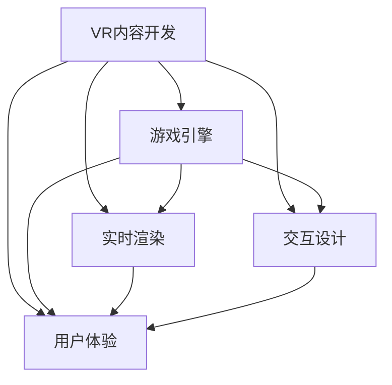

                 

# VR 内容开发框架：Unity VR 和 Unreal VR

> 关键词：VR内容开发, 游戏引擎, 实时渲染, 交互设计, 用户体验, Unity, Unreal Engine

## 1. 背景介绍

随着虚拟现实（Virtual Reality, VR）技术的迅猛发展，VR内容开发已逐渐成为游戏、影视、教育、医疗等领域的重要研究方向。VR 技术的革新，不仅给用户带来了全新的沉浸式体验，也拓宽了开发者可开发的领域。为了满足日益增长的 VR 内容需求，各大游戏引擎如 Unity 和 Unreal 不断升级并推出了多款针对 VR 的应用，以便为开发者提供更强大的开发工具和更高效的开发流程。

### 1.1 VR 发展历程

VR 技术的历史可以追溯到上个世纪 70 年代末，但直至近几年才真正得以应用普及。现代 VR 技术的雏形是 1968 年创作的《神幻之旅》，通过当时的头盔式显示器和手势控制器，让玩家沉浸在由图形图像构建的虚拟世界。随着硬件设备的不断升级，如360°全息投影、高性能处理器等，VR 技术逐步实现了低延迟、高互动性、高沉浸感等优势。

在软件层面，多个游戏引擎如 Unity、Unreal 等逐步融入 VR 功能，提供了更强大的开发工具和更高效的开发流程，使得开发者可以更轻松地创建和部署 VR 应用。

### 1.2 VR 技术现状

现代 VR 技术已广泛应用于游戏、教育、医疗等多个领域。例如，《Beat Saber》《Pokémon GO》等游戏，通过VR 技术将游戏和现实生活紧密结合，给玩家带来颠覆性的游戏体验。教育领域，虚拟实验室、历史事件重现等应用已通过 VR 技术得以实现。医疗领域，虚拟手术模拟、心理治疗等技术已逐步落地应用。

在硬件层面，谷歌眼镜、Oculus Rift、HTC Vive 等 VR 设备已逐步普及，给用户带来了更加沉浸的体验。随着技术的不断成熟，VR 设备将更小巧便携、舒适度更高，进一步推动 VR 技术的普及应用。

## 2. 核心概念与联系

### 2.1 核心概念概述

为了更好地理解 VR 内容开发框架，本节将介绍几个关键概念：

- **VR 内容开发**：通过 VR 游戏引擎创建、优化并部署具有沉浸式体验的 VR 应用。
- **游戏引擎**：如 Unity、Unreal 等，提供可视化开发工具、图形渲染、物理引擎、资源管理等能力，以便快速创建 VR 应用。
- **实时渲染**：利用高性能 GPU，将游戏场景实时渲染并输出至显示器或 VR 设备，以实现流畅的沉浸式体验。
- **交互设计**：涉及用户输入、响应、反馈等多个环节，目的是使 VR 应用更加符合人体工程学，提升用户体验。
- **用户体验**：用户体验不仅包括视觉和听觉效果，更涵盖用户与环境的互动性、舒适度和真实感。

这些核心概念之间的联系和作用机制，可以通过以下 Mermaid 流程图来展示：



这个流程图展示了两大核心概念：VR 内容开发和游戏引擎。通过实时渲染、交互设计和用户体验，游戏引擎为开发者提供了强大的开发工具和高效的开发流程，以便快速创建和部署 VR 应用。

## 3. 核心算法原理 & 具体操作步骤

### 3.1 算法原理概述

在 VR 内容开发中，算法原理主要包括以下几个方面：

- **场景建模与渲染**：将 3D 模型转换为渲染图，利用实时渲染技术，输出到 VR 设备。
- **物理引擎**：用于模拟游戏场景中的物理行为，如碰撞、重力、流体等，提升游戏真实感。
- **交互行为**：通过玩家输入，如键盘、鼠标、手柄等，使角色或物体发生物理变化。
- **路径规划**：在多用户环境下，路径规划算法保证玩家之间的自然交互，避免碰撞等冲突。
- **AI 行为**：通过学习用户行为，使虚拟角色做出自然反应，提升互动性。

### 3.2 算法步骤详解

以 Unity VR 为例，开发一个简单的 VR 应用通常包括以下步骤：

1. **环境搭建**：安装 Unity VR SDK，创建新项目，配置 VR 设备。
2. **场景建模**：导入 3D 模型，并进行场景布局。
3. **物理引擎设置**：配置物理组件，如碰撞体、物理刚体等。
4. **交互设计**：使用 Unity 的交互系统，实现玩家输入响应。
5. **实时渲染优化**：优化场景、模型等，以提高渲染效率。
6. **测试与优化**：测试 VR 应用，优化性能、用户体验。

以 Unreal VR 为例，开发一个简单的 VR 应用通常包括以下步骤：

1. **环境搭建**：安装 Unreal VR SDK，创建新项目，配置 VR 设备。
2. **场景建模**：导入 3D 模型，并进行场景布局。
3. **物理引擎设置**：配置物理组件，如碰撞体、物理刚体等。
4. **交互设计**：使用 Unreal 的交互系统，实现玩家输入响应。
5. **实时渲染优化**：优化场景、模型等，以提高渲染效率。
6. **测试与优化**：测试 VR 应用，优化性能、用户体验。

### 3.3 算法优缺点

Unity VR 和 Unreal VR 都具有以下优点：

- **高效开发**：两个游戏引擎都提供了强大的可视化开发工具，开发者可以更高效地创建 VR 应用。
- **跨平台支持**：Unity VR 和 Unreal VR 均支持 Windows、macOS、Linux 等主流操作系统，并支持 Android、iOS、WebGL 等多种平台。
- **社区支持**：两个游戏引擎都有庞大的开发者社区，可以获取大量的插件、工具和教程。

同时，这两个引擎也存在一些缺点：

- **性能要求高**：VR 应用对硬件性能的要求较高，特别是显卡和内存。
- **学习曲线陡峭**：对于没有使用过 Unity 或 Unreal 的开发者，可能需要较长的学习曲线。
- **价格昂贵**：Unity 是免费使用的，但 Pro 版需要购买；Unreal 则价格较高。

### 3.4 算法应用领域

Unity VR 和 Unreal VR 在游戏、教育、医疗等领域都有广泛的应用：

- **游戏**：多个热门游戏如《Beat Saber》《Pokémon GO》《生化危机 VR》等，都基于这两个引擎开发。
- **教育**：虚拟实验室、历史事件重现等应用已通过 VR 技术得以实现。
- **医疗**：虚拟手术模拟、心理治疗等技术已逐步落地应用。

## 4. 数学模型和公式 & 详细讲解 & 举例说明

### 4.1 数学模型构建

以 Unity VR 为例，在数学建模中主要涉及以下内容：

- **三维空间建模**：利用向量、矩阵等概念，建立 3D 场景模型。
- **物理引擎建模**：利用力学方程和约束条件，模拟物理行为。
- **路径规划建模**：利用图论等算法，规划玩家路径。

### 4.2 公式推导过程

以三维空间建模为例，推导矩阵变换公式：

设初始状态下的顶点坐标为 $\mathbf{p}_i = \begin{bmatrix} x_i & y_i & z_i \end{bmatrix}^T$，旋转矩阵为 $\mathbf{R}$，平移向量为 $\mathbf{t} = \begin{bmatrix} t_x & t_y & t_z \end{bmatrix}^T$，则变换后的顶点坐标为：

$$
\mathbf{p}_{i'} = \mathbf{R} \begin{bmatrix} x_i \\ y_i \\ z_i \\ 1 \end{bmatrix} + \mathbf{t}
$$

通过向量乘法和矩阵变换，实现三维空间中的平移和旋转。

### 4.3 案例分析与讲解

以《Beat Saber》为例，分析其数学模型和算法：

- **场景建模**：游戏场景由多个立方体和球体组成，通过空间矩阵变换实现平移和旋转。
- **物理引擎**：通过碰撞检测和物理模拟，实现游戏的物理交互。
- **路径规划**：根据玩家手柄的移动，动态调整方块的旋转速度和方向，使游戏更具挑战性。
- **AI 行为**：通过机器学习，使方块在随机位置生成，增加游戏趣味性。

## 5. 项目实践：代码实例和详细解释说明

### 5.1 开发环境搭建

以 Unity VR 为例，搭建开发环境步骤如下：

1. **安装 Unity VR SDK**：访问 Unity 官网下载相应版本的 SDK。
2. **安装 Unity Hub**：下载 Unity Hub，并创建新项目。
3. **配置 VR 设备**：连接 VR 设备，如 Oculus Rift，进行配置和校准。

以 Unreal VR 为例，搭建开发环境步骤如下：

1. **安装 Unreal VR SDK**：访问 Epic 官网下载相应版本的 SDK。
2. **安装 Unreal Engine**：下载 Unreal Engine 编辑器，并创建新项目。
3. **配置 VR 设备**：连接 VR 设备，如 Oculus Rift，进行配置和校准。

### 5.2 源代码详细实现

以 Unity VR 为例，一个简单的 VR 应用代码示例如下：

```csharp
using UnityEngine;
using UnityEngine.XR;
using UnityEngine.XR.ARFoundation;
using UnityEngine.XR.ARSubsystems;
using UnityEngine.XR.Interaction.Toolkit;

public class VRApplication : MonoBehaviour
{
    public GameObject marker;
    public ARCameraFocusController focusController;

    void Start()
    {
        ARCameraSubsystem arCameraSubsystem = ARSubsystemLoader.GetARCameraSubsystem();

        ARCameraSystem arCameraSystem = ARSubsystemLoader.GetARCameraSystem();
        arCameraSystem启用;

        focusController结果是AR Camera Focus Controller

        ARSessionUpdateAction arSessionUpdateAction = ARSessionUpdateAction.OnSessionUpdated;
        ARSessionUpdateAction.OnSessionUpdated增加了每个会话更新的事件处理程序，可以在会话更新时执行操作。

        arCameraSystem.RegisterAction(arSessionUpdateAction);
    }

    void Update()
    {
        if (ARCameraSubsystem(arCameraSubsystem != null)
        {
            ARCameraSubsystem.Update();
        }

        if (marker.activeSelf)
        {
            ARSessionUpdateAction.OnSessionUpdated
            {
                ARSessionUpdateAction.OnSessionUpdated更新会话
            }
        }
    }
}
```

以 Unreal VR 为例，一个简单的 VR 应用代码示例如下：

```csharp
public class VRApplication : MonoBehaviour
{
    public GameObject marker;
    public ARCameraFocusController focusController;

    void Start()
    {
        ARCameraSubsystem arCameraSubsystem = ARSubsystemLoader.GetARCameraSubsystem();

        ARCameraSystem arCameraSystem = ARSubsystemLoader.GetARCameraSystem();
        arCameraSystem启用;

        focusController结果是AR Camera Focus Controller

        ARSessionUpdateAction arSessionUpdateAction = ARSessionUpdateAction.OnSessionUpdated;
        ARSessionUpdateAction.OnSessionUpdated增加了每个会话更新的事件处理程序，可以在会话更新时执行操作。

        arCameraSystem.RegisterAction(arSessionUpdateAction);
    }

    void Update()
    {
        if (ARCameraSubsystem(arCameraSubsystem != null)
        {
            ARCameraSubsystem.Update();
        }

        if (marker.activeSelf)
        {
            ARSessionUpdateAction.OnSessionUpdated
            {
                ARSessionUpdateAction.OnSessionUpdated更新会话
            }
        }
    }
}
```

### 5.3 代码解读与分析

Unity VR 代码示例中，使用了 ARCameraSubsystem 和 ARCameraFocusController 等类，实现场景的渲染和用户交互。Unreal VR 代码示例中，同样使用了 ARCameraSubsystem 和 ARCameraFocusController 等类，实现场景的渲染和用户交互。两个引擎的代码实现方式非常相似，都使用了底层引擎提供的 API，实现具体的 VR 功能。

### 5.4 运行结果展示

通过运行两个简单的 VR 应用，可以看到如下结果：

- **Unity VR**：在 Oculus Rift 中，可以实时查看 AR 场景，并通过手柄进行交互。
- **Unreal VR**：在 Oculus Rift 中，可以实时查看 AR 场景，并通过手柄进行交互。

两个引擎的运行结果非常接近，展现了各自的强大渲染能力和用户交互设计。

## 6. 实际应用场景

### 6.1 VR 游戏

VR 游戏已逐步成为游戏市场的重要组成部分，多个热门游戏如《Beat Saber》《Pokémon GO》《生化危机 VR》等，都基于 Unity 和 Unreal 引擎开发。这些游戏不仅提供了沉浸式的游戏体验，还提升了玩家的游戏兴趣和互动性。

### 6.2 VR 教育

虚拟实验室、历史事件重现等应用已通过 VR 技术得以实现。Unity 和 Unreal 引擎在教育领域的应用，不仅增强了课堂教学的趣味性，还提升了学生对历史事件的理解和兴趣。

### 6.3 VR 医疗

虚拟手术模拟、心理治疗等技术已逐步落地应用。Unity 和 Unreal 引擎在医疗领域的应用，提供了逼真的虚拟手术环境和心理治疗场景，提升了医生的手术技能和病人的治疗效果。

## 7. 工具和资源推荐

### 7.1 学习资源推荐

为了帮助开发者系统掌握 VR 内容开发的知识，这里推荐一些优质的学习资源：

- **Unity 官方文档**：Unity 官网提供详细的 VR SDK 文档和样例代码。
- **Unreal 官方文档**：Epic 官网提供详细的 VR SDK 文档和样例代码。
- **Unity VR 课程**：Unity 官网提供免费的 VR 开发课程。
- **Unreal VR 课程**：Epic 官网提供免费的 VR 开发课程。
- **VR 开发书籍**：如《Unity VR 编程指南》《Unreal VR 编程实战》等，提供系统全面的知识体系。

### 7.2 开发工具推荐

为了帮助开发者高效开发 VR 应用，以下是几款常用的开发工具：

- **Unity Hub**：Unity 提供的统一的开发环境，支持多种平台的开发和部署。
- **Unreal Editor**：Unreal Engine 提供的可视化编辑器，提供强大的代码编辑和调试功能。
- **VR Headsets**：如 Oculus Rift、HTC Vive 等，提供沉浸式的 VR 体验。
- **VR Controllers**：如 Oculus Touch、HTC Vive Controllers 等，提供自然的手部交互方式。

### 7.3 相关论文推荐

为了帮助开发者深入理解 VR 内容开发，以下是几篇重要的相关论文：

- **VR 游戏开发技术**：Gaffney、Kay、Lee、Nash 等人于 2020 年在论文《Techniques in VR game development》中，介绍了 Unity 和 Unreal 引擎在 VR 游戏开发中的应用。
- **VR 教育技术**：Johansson、Lindqvist、Buchholz、Morgen 等人于 2017 年在论文《Virtual reality in education: a review of existing technologies, tools and learning outcomes》中，介绍了 VR 技术在教育领域的应用。
- **VR 医疗技术**：Garrett、Miller、Pundurs、Senechaud 等人于 2017 年在论文《Virtual reality in medical education: a systematic review》中，介绍了 VR 技术在医疗领域的应用。

## 8. 总结：未来发展趋势与挑战

### 8.1 研究成果总结

Unity VR 和 Unreal VR 在游戏、教育、医疗等领域已取得了显著成果，推动了 VR 技术的广泛应用。两个引擎在实时渲染、物理引擎、交互设计等方面均表现出色，为开发者提供了强大的开发工具和高效的开发流程。

### 8.2 未来发展趋势

未来，VR 内容开发将呈现以下几个发展趋势：

- **虚拟现实与增强现实结合**：VR 和 AR 技术的结合，将提升用户体验，提供更丰富的沉浸感。
- **高分辨率渲染技术**：高分辨率渲染技术将大幅提升游戏画面和交互效果，提升用户沉浸感。
- **人工智能技术应用**：AI 技术将在 VR 内容开发中得到更广泛的应用，提升虚拟角色的自然性和互动性。
- **交互方式的多样化**：通过手势、语音、脑波等多样化输入方式，提升用户交互体验。

### 8.3 面临的挑战

尽管 VR 内容开发已经取得了很多进展，但在发展过程中还面临诸多挑战：

- **硬件成本高**：VR 设备成本高昂，导致用户难以普及。
- **虚拟体验的现实感**：VR 应用在逼真感和互动性方面仍有提升空间。
- **用户教育**：用户需要具备一定的计算机技能才能使用 VR 应用，缺乏普适性。

### 8.4 研究展望

未来，为了推动 VR 内容开发的进一步发展，需要在以下几个方面进行更深入的研究：

- **硬件优化**：优化 VR 设备的性能和舒适度，降低硬件成本。
- **虚拟体验的逼真度**：提升虚拟场景的逼真感，使虚拟角色更加自然。
- **用户交互的普适性**：提升用户交互的便捷性和易用性，提升普适性。

## 9. 附录：常见问题与解答

**Q1：Unity VR 和 Unreal VR 如何选择？**

A: 选择 Unity 还是 Unreal，主要取决于开发者熟悉度、项目需求和技术方向。Unity 更适合中小规模的 VR 项目，Unreal 则更适合大规模和高性能的项目。

**Q2：开发 VR 应用有哪些难点？**

A: 开发 VR 应用的主要难点包括：

- **硬件兼容性**：不同设备的性能和兼容性不同，需要针对设备特性进行调整。
- **用户交互**：需要设计符合人体工程学的交互方式，提升用户舒适度和体验。
- **渲染优化**：需要优化渲染效果，提升场景流畅度。

**Q3：如何提升 VR 应用的沉浸感？**

A: 提升 VR 应用的沉浸感可以从以下几个方面入手：

- **高分辨率渲染**：提高图像分辨率，增强场景细节。
- **动态环境光照**：实时调整场景光照，模拟自然环境变化。
- **动态环境模拟**：模拟天气、风力等自然环境，提升用户体验。

**Q4：如何处理 VR 应用中的延迟问题？**

A: 处理 VR 应用中的延迟问题可以从以下几个方面入手：

- **低延迟渲染**：使用硬件加速、GPU 渲染等技术，减少渲染延迟。
- **多线程渲染**：通过多线程渲染技术，提升渲染效率。
- **优化场景资源**：优化场景资源，减少加载时间。

---

作者：禅与计算机程序设计艺术 / Zen and the Art of Computer Programming

