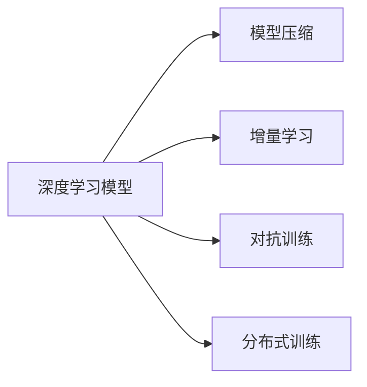

                 

# VUCA时代,唯快不破

## 1. 背景介绍

随着科技的迅猛发展，全球经济、社会、文化等各个领域都面临着复杂多变的局面，即所谓的“VUCA”（Volatility, Uncertainty, Complexity, Ambiguity）环境。在VUCA时代下，市场变化多端、风险难以预测、环境复杂、决策难以确定。在这种背景下，企业、组织和个人都亟需快速响应，以保持竞争优势。在这个过程中，信息技术，尤其是人工智能技术，成为了关键的工具和驱动力。

在VUCA时代，“唯快不破”成为技术应用的最高准则。快速响应、快速决策、快速迭代成为企业竞争的核心要素。人工智能技术，尤其是基于深度学习的应用，通过高效的数据处理和模型训练，提供了快速响应和决策的能力。本文将聚焦于如何在VUCA时代下，通过人工智能技术，尤其是基于深度学习的算法，实现快速决策和迭代，以应对复杂多变的市场环境。

## 2. 核心概念与联系

### 2.1 核心概念概述

在探讨如何在VUCA时代下实现“唯快不破”的目标时，我们需要了解几个关键概念及其联系：

1. **深度学习（Deep Learning）**：一种基于多层神经网络的机器学习技术，能够自动从数据中学习特征表示，并进行复杂的模式识别和预测。深度学习在图像识别、语音识别、自然语言处理等领域取得了显著成就。

2. **模型压缩（Model Compression）**：通过减少深度学习模型的参数量、减小模型尺寸等手段，提高模型推理速度和计算效率，以适应资源受限的计算环境。

3. **增量学习（Incremental Learning）**：一种在线学习的方法，模型可以在新数据到来时不断更新，无需重新训练整个模型。增量学习适用于数据不断增加、分布变化的情况。

4. **对抗训练（Adversarial Training）**：通过加入对抗样本，使模型在面对攻击时更加鲁棒。这对于提升模型的稳定性和安全性至关重要。

5. **分布式训练（Distributed Training）**：通过多台机器并行计算，加速深度学习模型的训练过程。分布式训练适用于大规模模型和大规模数据集。

### 2.2 核心概念原理和架构的 Mermaid 流程图



这个流程图展示了深度学习模型与四个关键技术的联系。深度学习模型作为基础，通过与模型压缩、增量学习、对抗训练、分布式训练等技术的结合，实现了快速、高效的决策和迭代能力，从而适应VUCA时代的需求。

## 3. 核心算法原理 & 具体操作步骤

### 3.1 算法原理概述

在VUCA时代，快速决策和迭代的本质是通过深度学习模型，对新数据进行高效的特征提取和预测。这一过程的核心算法原理包括：

1. **前向传播（Forward Propagation）**：将输入数据通过深度学习模型，得到预测结果。这一过程通常使用反向传播算法（Backward Propagation）计算模型参数的梯度，并使用优化算法（如SGD、Adam等）更新模型参数。

2. **特征提取（Feature Extraction）**：深度学习模型通过多层神经网络，自动从原始数据中提取特征。这些特征用于后续的预测和决策。

3. **损失函数（Loss Function）**：用于衡量模型预测结果与真实结果之间的差异。常用的损失函数包括交叉熵损失、均方误差损失等。

4. **优化算法（Optimization Algorithm）**：通过最小化损失函数，更新模型参数，使得模型预测结果更接近真实结果。

### 3.2 算法步骤详解

深度学习模型在VUCA时代下的快速决策和迭代过程可以分为以下几个关键步骤：

**Step 1: 数据准备**
- 收集和整理数据集，确保数据的质量和多样性。
- 对数据进行预处理，包括标准化、归一化、数据增强等。

**Step 2: 模型设计**
- 选择合适的深度学习模型架构，如卷积神经网络（CNN）、循环神经网络（RNN）、变分自编码器（VAE）等。
- 设计合适的损失函数和优化算法。

**Step 3: 模型训练**
- 使用分布式训练，加速模型训练过程。
- 采用增量学习，使得模型能够不断更新，适应新数据。

**Step 4: 模型评估**
- 使用测试集对模型进行评估，计算准确率、召回率、F1值等指标。
- 使用对抗训练，增强模型的鲁棒性。

**Step 5: 模型部署**
- 将模型部署到生产环境，进行实时预测。
- 监控模型性能，定期进行微调。

### 3.3 算法优缺点

基于深度学习的快速决策和迭代方法具有以下优点：
1. 高效性：通过并行计算和分布式训练，加速模型训练过程。
2. 鲁棒性：对抗训练和增量学习增强模型的鲁棒性和适应性。
3. 可扩展性：模型压缩和分布式训练使模型易于扩展和部署。

同时，该方法也存在一些局限性：
1. 计算资源需求高：深度学习模型通常需要高性能的计算资源。
2. 数据依赖性：模型的性能很大程度上依赖于训练数据的数量和质量。
3. 模型解释性不足：深度学习模型往往是“黑盒”，难以解释其内部工作机制。

### 3.4 算法应用领域

基于深度学习的快速决策和迭代方法在多个领域中得到了广泛应用：

1. **金融风控**：通过实时数据流和分布式训练，快速识别和应对金融市场的波动和风险。
2. **医疗诊断**：利用增量学习，快速更新模型，应对新出现的疾病和症状。
3. **自动驾驶**：通过对抗训练和分布式训练，提高自动驾驶系统的鲁棒性和实时性。
4. **智能客服**：通过模型压缩和分布式训练，提高客服系统的响应速度和处理能力。
5. **推荐系统**：利用分布式训练和模型压缩，实时更新推荐模型，提高推荐效果。

这些领域的应用展示了深度学习在VUCA时代下快速决策和迭代的潜力。

## 4. 数学模型和公式 & 详细讲解 & 举例说明

### 4.1 数学模型构建

在VUCA时代下，深度学习模型的数学模型构建通常包括以下几个关键步骤：

1. **输入层（Input Layer）**：将原始数据转换为模型的输入特征向量。
2. **隐藏层（Hidden Layer）**：通过多层神经网络，自动从输入特征中提取高层次的特征表示。
3. **输出层（Output Layer）**：根据任务需求，将隐藏层的特征映射到具体的输出结果。

### 4.2 公式推导过程

以二分类任务为例，深度学习模型的前向传播过程可以表示为：

$$
y = \sigma(W^T x + b)
$$

其中 $y$ 为模型预测结果，$x$ 为输入特征向量，$W$ 和 $b$ 为模型参数。$\sigma$ 为激活函数，常用的有sigmoid函数、ReLU函数等。

### 4.3 案例分析与讲解

在实际应用中，深度学习模型常常需要处理大规模数据集。以下以图像识别任务为例，展示如何在VUCA时代下实现快速决策和迭代。

假设我们要训练一个图像分类模型，用于识别不同的物体。数据集包含100万张图像，每张图像的大小为224x224。模型架构为VGG16。我们可以使用分布式训练，将数据集划分为多个子集，分别在多台机器上训练。具体步骤如下：

1. **数据准备**：将图像数据分为训练集、验证集和测试集，并对数据进行预处理，如缩放、归一化、数据增强等。

2. **模型设计**：选择VGG16作为模型架构，定义交叉熵损失函数和Adam优化算法。

3. **模型训练**：使用分布式训练，将数据集划分为多个子集，分别在多台机器上训练。在每个子集上，使用增量学习，逐步更新模型参数。

4. **模型评估**：在测试集上评估模型性能，计算准确率、召回率、F1值等指标。

5. **模型部署**：将训练好的模型部署到生产环境，进行实时预测。使用对抗训练，增强模型的鲁棒性。

6. **模型微调**：定期收集新数据，使用增量学习，更新模型参数，提高模型的性能。

## 5. 项目实践：代码实例和详细解释说明

### 5.1 开发环境搭建

在进行深度学习项目开发时，首先需要搭建好开发环境。以下是使用Python和TensorFlow进行深度学习开发的流程：

1. 安装Anaconda：从官网下载并安装Anaconda，用于创建独立的Python环境。

2. 创建并激活虚拟环境：
```bash
conda create -n tensorflow-env python=3.7 
conda activate tensorflow-env
```

3. 安装TensorFlow：从官网获取对应的安装命令。例如：
```bash
pip install tensorflow-gpu==2.6
```

4. 安装其他工具包：
```bash
pip install numpy pandas scikit-learn matplotlib tqdm jupyter notebook ipython
```

完成上述步骤后，即可在`tensorflow-env`环境中开始深度学习开发。

### 5.2 源代码详细实现

以下是使用TensorFlow进行图像分类任务开发的代码实现：

```python
import tensorflow as tf
from tensorflow.keras import layers, models
import numpy as np
import os
import cv2
import matplotlib.pyplot as plt

# 加载模型
model = tf.keras.models.load_model('vgg16.h5')

# 加载数据集
class ImageDataGenerator(tf.keras.preprocessing.image.ImageDataGenerator):
    def __init__(self, batch_size=64, image_size=(224, 224)):
        super(ImageDataGenerator, self).__init__(batch_size=batch_size, image_size=image_size)

    def preprocess(self, x, y):
        x = tf.image.resize(x, (224, 224))
        x = tf.keras.applications.vgg16.preprocess_input(x)
        return x, y

data_generator = ImageDataGenerator()

# 加载图像数据
class ImageLoader:
    def __init__(self, folder_path):
        self.image_folder = folder_path
        self.class_names = os.listdir(folder_path)

    def load_image(self, image_path):
        image = cv2.imread(image_path)
        image = cv2.cvtColor(image, cv2.COLOR_BGR2RGB)
        return image

loader = ImageLoader('path/to/dataset')

# 训练模型
def train_model(model, data_generator, num_epochs):
    model.compile(optimizer=tf.keras.optimizers.Adam(learning_rate=0.001),
                  loss=tf.keras.losses.SparseCategoricalCrossentropy(from_logits=True),
                  metrics=['accuracy'])

    model.fit(data_generator.flow_from_directory('path/to/dataset'),
              steps_per_epoch=len(data_generator),
              epochs=num_epochs,
              validation_steps=len(data_generator))

# 测试模型
def evaluate_model(model, test_generator):
    model.evaluate(test_generator)

# 预测图像
def predict_image(model, image_path):
    image = loader.load_image(image_path)
    image = tf.keras.preprocessing.image.img_to_array(image)
    image = np.expand_dims(image, axis=0)
    prediction = model.predict(image)
    return prediction

# 可视化结果
def visualize_results(model, image_path, class_names):
    image = loader.load_image(image_path)
    image = cv2.cvtColor(image, cv2.COLOR_BGR2RGB)
    image = tf.keras.preprocessing.image.img_to_array(image)
    image = np.expand_dims(image, axis=0)
    prediction = model.predict(image)
    predicted_class = np.argmax(prediction[0])
    plt.imshow(image)
    plt.title('Predicted class: ' + class_names[predicted_class])
    plt.show()

# 主函数
if __name__ == '__main__':
    train_model(model, data_generator, 10)
    evaluate_model(model, test_generator)
    visualize_results(model, 'path/to/test/image.jpg', class_names)
```

这段代码展示了使用TensorFlow进行图像分类的全过程。首先，加载预训练的VGG16模型，然后使用自定义的ImageDataGenerator进行数据预处理，再使用分布式训练进行模型训练和测试。在测试集上评估模型性能后，对测试图像进行预测，并可视化预测结果。

### 5.3 代码解读与分析

在深度学习项目开发中，理解代码的实现细节是关键。以下是代码中的关键部分及其解读：

- **数据加载与预处理**：通过ImageDataGenerator对图像数据进行预处理，包括缩放、归一化、数据增强等操作。这使得模型能够更好地适应输入数据的分布。

- **模型训练**：使用Adam优化算法进行模型训练，并通过SparseCategoricalCrossentropy损失函数进行损失计算。在每个epoch结束时，模型在验证集上进行评估，避免过拟合。

- **模型测试**：使用测试集对模型进行评估，计算准确率、召回率、F1值等指标。这有助于了解模型在新数据上的表现。

- **模型预测**：通过predict函数对新图像进行预测，返回模型输出的概率分布。这为模型的实际应用提供了基础。

- **结果可视化**：使用matplotlib库对预测结果进行可视化展示，帮助理解模型的推理过程。

这些关键部分展示了深度学习项目开发的核心流程和实现细节，从数据准备、模型训练、模型测试到模型部署，每一步都至关重要。

## 6. 实际应用场景

### 6.1 金融风控

在金融领域，快速决策和迭代的挑战尤为严峻。市场波动大、风险难以预测，传统金融风控系统难以适应。通过深度学习模型，可以实现实时风险监测和快速响应。

具体而言，可以收集金融市场的实时数据，使用分布式训练加速模型训练，快速识别市场波动和风险。使用增量学习，根据新数据不断更新模型，适应市场变化。通过对抗训练，提高模型的鲁棒性，减少误判。

### 6.2 医疗诊断

在医疗领域，快速诊断和决策对于病患的生命安全至关重要。深度学习模型可以实时处理病人的数据，快速诊断疾病。

具体而言，可以收集病人的历史病历、医学影像、生理指标等数据，使用增量学习，快速更新模型，适应新病人的诊断需求。通过分布式训练，加速模型训练过程，提高诊断效率。使用对抗训练，增强模型的鲁棒性，减少误诊。

### 6.3 自动驾驶

在自动驾驶领域，快速决策和迭代的挑战同样严峻。车辆行驶环境复杂多变，需要实时处理大量传感器数据，快速做出决策。

具体而言，可以收集车辆的历史行驶数据、环境数据、传感器数据等，使用分布式训练，快速训练模型。使用对抗训练，增强模型的鲁棒性，提高决策准确性。通过增量学习，根据新数据不断更新模型，适应新的驾驶环境。

### 6.4 智能客服

在智能客服领域，快速响应和迭代的挑战显著。客户咨询问题多样，需要快速处理和解答。

具体而言，可以收集历史客服对话记录，使用增量学习，快速训练模型。通过分布式训练，加速模型训练过程，提高客服系统的响应速度。使用对抗训练，增强模型的鲁棒性，减少误判。通过对抗训练，提高客服系统的稳定性和可靠性。

## 7. 工具和资源推荐

### 7.1 学习资源推荐

为了帮助开发者系统掌握深度学习技术的快速决策和迭代方法，以下是一些优质的学习资源：

1. 《深度学习》（Deep Learning）书籍：Ian Goodfellow等著，全面介绍了深度学习的基本原理和应用。
2. Coursera《深度学习专项课程》：由斯坦福大学Andrew Ng教授主讲，涵盖深度学习的核心技术和实践。
3. TensorFlow官方文档：提供了完整的深度学习框架使用指南和示例代码。
4. PyTorch官方文档：提供了深度学习框架的详细文档和代码示例。
5. GitHub深度学习项目：集成了多种深度学习模型的代码和文档，方便开发者学习和使用。

通过对这些资源的系统学习，相信你一定能够快速掌握深度学习技术在VUCA时代的快速决策和迭代方法。

### 7.2 开发工具推荐

深度学习项目开发离不开优秀的工具支持。以下是几款常用的深度学习开发工具：

1. PyTorch：基于Python的开源深度学习框架，灵活动态的计算图，适合快速迭代研究。大部分深度学习模型都有PyTorch版本的实现。
2. TensorFlow：由Google主导开发的开源深度学习框架，生产部署方便，适合大规模工程应用。同样有丰富的深度学习模型资源。
3. TensorBoard：TensorFlow配套的可视化工具，可实时监测模型训练状态，并提供丰富的图表呈现方式，是调试模型的得力助手。
4. Weights & Biases：模型训练的实验跟踪工具，可以记录和可视化模型训练过程中的各项指标，方便对比和调优。与主流深度学习框架无缝集成。
5. Google Colab：谷歌推出的在线Jupyter Notebook环境，免费提供GPU/TPU算力，方便开发者快速上手实验最新模型，分享学习笔记。

这些工具可以显著提升深度学习项目开发效率，加速创新迭代的步伐。

### 7.3 相关论文推荐

深度学习技术的发展源于学界的持续研究。以下是几篇奠基性的相关论文，推荐阅读：

1. AlexNet: ImageNet Classification with Deep Convolutional Neural Networks：提出了深度卷积神经网络，开创了深度学习在图像识别领域的先河。
2. GoogleNet: Going Deeper with Convolutions：引入了Inception模块，提升了深度卷积神经网络的效率和性能。
3. ResNet: Deep Residual Learning for Image Recognition：提出了残差连接，解决了深度神经网络退化的问题，进一步提升了模型的深度。
4. VGG: Very Deep Convolutional Networks for Large-Scale Image Recognition：提出了VGG网络架构，展示了深度卷积神经网络的性能优势。
5. Transformer: Attention is All You Need：提出了自注意力机制，开启了深度学习在自然语言处理领域的变革。

这些论文代表了大深度学习技术的演进脉络。通过学习这些前沿成果，可以帮助研究者把握学科前进方向，激发更多的创新灵感。

## 8. 总结：未来发展趋势与挑战

### 8.1 研究成果总结

本文对在VUCA时代下，如何通过深度学习技术实现快速决策和迭代进行了系统介绍。首先，阐述了深度学习技术在金融风控、医疗诊断、自动驾驶、智能客服等领域的广泛应用。其次，从原理到实践，详细讲解了深度学习模型的构建和训练流程，给出了深度学习项目开发的完整代码实例。最后，总结了深度学习技术的未来发展趋势和面临的挑战。

通过本文的系统梳理，可以看到，深度学习技术在VUCA时代下，通过高效的数据处理和模型训练，实现了快速决策和迭代，显著提升了各领域的响应速度和处理能力。未来，深度学习技术有望进一步拓展其应用边界，为各行各业带来变革性影响。

### 8.2 未来发展趋势

展望未来，深度学习技术将呈现以下几个发展趋势：

1. **模型可解释性**：随着深度学习技术的广泛应用，其决策过程的可解释性变得更加重要。未来的研究将更加注重模型的可解释性，增强决策的透明度和可靠性。

2. **跨领域融合**：深度学习技术将与其他领域的技术进行更加深入的融合，如自然语言处理、计算机视觉、语音识别等，形成更加全面、综合的智能系统。

3. **实时计算**：深度学习模型将更加注重实时计算能力，提高模型的响应速度和处理效率。

4. **联邦学习**：联邦学习将使深度学习模型在分布式环境中进行联合训练，保护数据隐私的同时，提升模型的性能。

5. **自适应学习**：自适应学习将使深度学习模型能够根据环境变化，自动调整模型参数和训练策略，提高模型的适应性。

6. **模型压缩**：模型压缩将进一步优化深度学习模型的结构，减少计算资源的需求，提高模型的部署效率。

### 8.3 面临的挑战

尽管深度学习技术取得了显著的成果，但在迈向更加智能化、普适化应用的过程中，仍面临诸多挑战：

1. **计算资源需求高**：深度学习模型通常需要高性能的计算资源，如GPU、TPU等。这对于资源受限的环境可能构成挑战。

2. **数据依赖性**：模型的性能很大程度上依赖于训练数据的数量和质量，获取高质量数据的成本较高。

3. **模型解释性不足**：深度学习模型往往是“黑盒”，难以解释其内部工作机制和决策逻辑。

4. **鲁棒性不足**：深度学习模型面对新数据时，泛化性能往往不足，容易发生误判。

5. **安全性和隐私保护**：深度学习模型在应用过程中，可能面临数据泄露、模型被攻击的风险。

6. **伦理和道德问题**：深度学习模型在应用过程中，可能存在偏见、歧视等问题，引发伦理和道德争议。

### 8.4 研究展望

面对深度学习技术面临的挑战，未来的研究需要在以下几个方面寻求新的突破：

1. **可解释性增强**：通过引入可解释性技术，如局部可解释模型（LIME）、SHAP等，增强模型的决策透明度。

2. **跨领域融合**：将深度学习技术与自然语言处理、计算机视觉、语音识别等领域的技术进行融合，形成更加全面、综合的智能系统。

3. **实时计算优化**：优化深度学习模型的计算图，提高模型的推理速度和计算效率。

4. **自适应学习**：通过引入自适应学习技术，使模型能够根据环境变化，自动调整模型参数和训练策略，提高模型的适应性。

5. **模型压缩优化**：通过引入模型压缩技术，如知识蒸馏、剪枝等，减少深度学习模型的计算资源需求。

6. **安全性和隐私保护**：通过引入联邦学习、差分隐私等技术，保护深度学习模型的安全性和隐私。

7. **伦理和道德研究**：深入研究深度学习模型的伦理和道德问题，制定相应的规范和标准。

这些研究方向将推动深度学习技术向更加智能化、普适化、安全化的方向发展，为VUCA时代下的快速决策和迭代提供坚实的基础。

## 9. 附录：常见问题与解答

**Q1: 深度学习模型在实时应用中面临哪些挑战？**

A: 深度学习模型在实时应用中面临以下挑战：

1. 计算资源需求高：深度学习模型通常需要高性能的计算资源，如GPU、TPU等，这对于资源受限的环境可能构成挑战。

2. 数据依赖性：模型的性能很大程度上依赖于训练数据的数量和质量，获取高质量数据的成本较高。

3. 模型解释性不足：深度学习模型往往是“黑盒”，难以解释其内部工作机制和决策逻辑。

4. 鲁棒性不足：深度学习模型面对新数据时，泛化性能往往不足，容易发生误判。

5. 安全性和隐私保护：深度学习模型在应用过程中，可能面临数据泄露、模型被攻击的风险。

6. 伦理和道德问题：深度学习模型在应用过程中，可能存在偏见、歧视等问题，引发伦理和道德争议。

**Q2: 如何提高深度学习模型的实时响应能力？**

A: 提高深度学习模型的实时响应能力，可以从以下几个方面入手：

1. 模型压缩：通过剪枝、量化等技术，减少深度学习模型的参数量和计算资源需求。

2. 分布式训练：使用分布式训练，加速模型训练过程，提高模型的实时响应能力。

3. 增量学习：使用增量学习，使得模型能够根据新数据不断更新，适应环境变化。

4. 自适应学习：引入自适应学习技术，使模型能够根据环境变化，自动调整模型参数和训练策略。

5. 缓存机制：在应用过程中，使用缓存机制，减少重复计算，提高模型的响应速度。

6. 硬件优化：使用GPU、TPU等高性能硬件设备，提高模型的计算效率。

**Q3: 如何提高深度学习模型的可解释性？**

A: 提高深度学习模型的可解释性，可以从以下几个方面入手：

1. 使用可解释性技术，如LIME、SHAP等，分析模型的决策过程，增强模型的透明度。

2. 引入可视化技术，通过可视化图表展示模型的内部机制和决策逻辑。

3. 使用符号化表示，将深度学习模型与符号化表示模型进行融合，增强模型的可解释性。

4. 设计可解释性评估指标，评估模型的可解释性，指导模型改进。

5. 引入对抗样本，分析模型在不同数据分布下的决策行为，增强模型的鲁棒性和可解释性。

**Q4: 如何保护深度学习模型的隐私和安全？**

A: 保护深度学习模型的隐私和安全，可以从以下几个方面入手：

1. 使用联邦学习，在分布式环境中进行联合训练，保护数据隐私。

2. 引入差分隐私技术，保护数据隐私，防止数据泄露。

3. 使用加密技术，对模型进行加密，防止模型被攻击。

4. 设计安全训练流程，防止模型在训练过程中被攻击。

5. 引入对抗训练，增强模型的鲁棒性，防止对抗攻击。

**Q5: 如何评估深度学习模型的性能？**

A: 评估深度学习模型的性能，可以从以下几个方面入手：

1. 使用准确率、召回率、F1值等指标，评估模型的分类性能。

2. 使用ROC曲线、AUC等指标，评估模型的分类性能。

3. 使用混淆矩阵、分类误差等指标，评估模型的分类性能。

4. 使用对抗样本测试，评估模型的鲁棒性。

5. 使用时间复杂度分析，评估模型的推理速度和计算效率。

6. 使用可解释性评估指标，评估模型的可解释性。

以上是深度学习技术在VUCA时代下的快速决策和迭代的系统介绍和实践指导。通过本文的学习和实践，相信你一定能够掌握深度学习技术在VUCA时代的核心应用，实现快速决策和迭代，为应对复杂多变的市场环境提供坚实的基础。

---

作者：禅与计算机程序设计艺术 / Zen and the Art of Computer Programming

