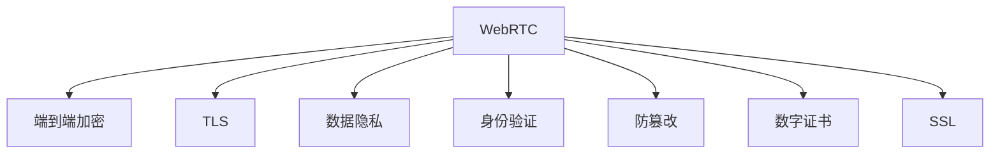

                 

# WebRTC安全性：端到端加密通信的实现

> 关键词：WebRTC, 端到端加密, 安全通信, 传输层安全性(TLS), 数据隐私, 数据完整性, 防篡改, 数字证书, 身份验证, 安全套接字层(SSL)

## 1. 背景介绍

### 1.1 问题由来
随着互联网技术的发展，网络通信的安全性问题日益突出。在传统的文本、图像等数据的传输中，数据容易被窃听、篡改和伪造，给用户的隐私和数据安全带来了巨大威胁。为了解决这些问题，网络通信领域引入了端到端加密(End-to-End Encryption)技术，确保数据在传输过程中只能被发送方和接收方访问，避免中间人攻击和其他形式的攻击。

WebRTC是一种实时通信技术，广泛应用于浏览器和移动应用之间的音视频通话、文件共享等场景。WebRTC使用端到端加密技术，为网络通信提供了一层重要的安全保障。但随着WebRTC应用的普及，其安全性问题也日益显现。如何确保WebRTC通信的安全性，成为当前WebRTC应用开发的一个重要课题。

### 1.2 问题核心关键点
在WebRTC中，安全性问题主要集中在以下几个方面：

1. **传输层安全性(TLS)**：WebRTC默认使用TLS协议来保障数据传输的安全性。TLS是一种加密通信协议，用于在客户端和服务器之间建立一个安全的连接。

2. **数据隐私和完整性**：WebRTC需要确保数据在传输过程中不被窃听和篡改。这包括防止数据在传输过程中被截取、修改或伪造。

3. **身份验证**：WebRTC需要验证通信双方的身份，确保通信双方是可信的，避免中间人攻击。

4. **防篡改**：WebRTC需要确保数据在传输过程中不被修改，避免数据被恶意篡改。

5. **数字证书**：WebRTC使用数字证书来验证通信双方的身份和公钥，确保公钥的安全性和可信性。

6. **安全套接字层(SSL)**：WebRTC可以使用SSL协议来增强数据传输的安全性。SSL协议提供了对称加密和公钥加密，确保数据的安全传输。

## 2. 核心概念与联系

### 2.1 核心概念概述

为了更好地理解WebRTC的安全性实现，本节将介绍几个密切相关的核心概念：

- **WebRTC**：是一种实时通信技术，通过浏览器和设备之间的点对点(peer-to-peer)通信，实现音视频通话、文件共享等功能。
- **传输层安全性(TLS)**：是一种加密通信协议，用于在客户端和服务器之间建立一个安全的连接。
- **数据隐私和完整性**：确保数据在传输过程中不被窃听和篡改。
- **身份验证**：验证通信双方的身份，确保通信双方是可信的。
- **防篡改**：确保数据在传输过程中不被修改，避免数据被恶意篡改。
- **数字证书**：用于验证通信双方的身份和公钥，确保公钥的安全性和可信性。
- **安全套接字层(SSL)**：是一种加密通信协议，用于增强数据传输的安全性。

这些核心概念之间的逻辑关系可以通过以下Mermaid流程图来展示：



这个流程图展示了大语言模型的核心概念及其之间的关系：

1. WebRTC通过端到端加密技术，为网络通信提供一层重要的安全保障。
2. WebRTC默认使用TLS协议来保障数据传输的安全性。
3. WebRTC需要确保数据在传输过程中不被窃听和篡改，确保数据隐私和完整性。
4. WebRTC需要验证通信双方的身份，确保通信双方是可信的。
5. WebRTC需要防止数据被恶意篡改。
6. WebRTC使用数字证书来验证通信双方的身份和公钥，确保公钥的安全性和可信性。
7. WebRTC可以使用SSL协议来增强数据传输的安全性。

这些概念共同构成了WebRTC的安全性实现框架，使其能够在各种场景下提供强大的安全性保障。通过理解这些核心概念，我们可以更好地把握WebRTC的安全性工作原理和优化方向。

## 3. 核心算法原理 & 具体操作步骤
### 3.1 算法原理概述

WebRTC的安全性实现，本质上是通过端到端加密技术，确保数据在传输过程中只能被发送方和接收方访问，避免中间人攻击和其他形式的攻击。具体来说，WebRTC使用以下算法和步骤来实现数据传输的安全性：

1. **传输层安全性(TLS)**：WebRTC使用TLS协议来保障数据传输的安全性。TLS协议使用公钥加密和对称加密技术，确保数据在传输过程中不被窃听和篡改。

2. **身份验证**：WebRTC使用数字证书来验证通信双方的身份。数字证书包含公钥和证书的签名，通过证书颁发机构(CA)来验证证书的真实性和公钥的有效性。

3. **数据隐私和完整性**：WebRTC使用哈希函数来确保数据的完整性，使用对称加密技术来保护数据的隐私性。

4. **防篡改**：WebRTC使用数字签名技术来防止数据被篡改。数字签名通过非对称加密技术生成，确保数据的不可篡改性。

5. **安全套接字层(SSL)**：WebRTC可以使用SSL协议来增强数据传输的安全性。SSL协议提供了对称加密和公钥加密，确保数据的安全传输。

### 3.2 算法步骤详解

以下是WebRTC安全性实现的详细步骤：

**Step 1: 生成公钥和私钥**
- 使用非对称加密算法，生成通信双方的公钥和私钥。公钥用于加密和验证数据，私钥用于解密数据。

**Step 2: 证书生成和验证**
- 使用数字证书生成算法，生成数字证书。数字证书包含公钥和证书的签名，通过证书颁发机构(CA)来验证证书的真实性和公钥的有效性。

**Step 3: 建立TLS连接**
- 使用TLS协议在客户端和服务器之间建立一个安全的连接。TLS协议使用公钥加密和对称加密技术，确保数据在传输过程中不被窃听和篡改。

**Step 4: 数据加密和传输**
- 使用对称加密算法，对数据进行加密，确保数据的隐私性。使用数字签名算法，对数据进行签名，确保数据的完整性和防篡改性。

**Step 5: 数据解密和验证**
- 接收方使用私钥解密数据，验证数字签名，确保数据的完整性和防篡改性。

**Step 6: SSL连接建立**
- 在TLS连接的基础上，使用SSL协议进一步增强数据传输的安全性。SSL协议提供了对称加密和公钥加密，确保数据的安全传输。

### 3.3 算法优缺点

WebRTC的安全性实现，具有以下优点：

1. **安全性高**：TLS协议使用公钥加密和对称加密技术，确保数据在传输过程中不被窃听和篡改。SSL协议提供了对称加密和公钥加密，进一步增强了数据传输的安全性。

2. **身份验证严格**：WebRTC使用数字证书来验证通信双方的身份，确保通信双方是可信的。数字证书通过证书颁发机构(CA)来验证证书的真实性和公钥的有效性，增强了通信的安全性。

3. **数据隐私性好**：WebRTC使用对称加密技术来保护数据的隐私性，确保数据只能被发送方和接收方访问。

4. **防篡改能力强**：WebRTC使用数字签名技术来防止数据被篡改，确保数据的不可篡改性。

同时，WebRTC的安全性实现也存在一定的局限性：

1. **证书颁发机构依赖**：WebRTC的安全性实现依赖于证书颁发机构(CA)来验证证书的真实性和公钥的有效性。如果CA的安全性存在问题，将影响WebRTC通信的安全性。

2. **计算开销大**：WebRTC的安全性实现需要生成公钥和私钥，验证数字证书，进行对称加密和数字签名等操作，计算开销较大。

3. **协议复杂**：WebRTC的安全性实现涉及TLS、SSL等复杂协议，实现和调试难度较大。

尽管存在这些局限性，但就目前而言，WebRTC的安全性实现方法仍然是互联网通信领域的安全性保障之一。未来相关研究的重点在于如何进一步降低计算开销，简化协议实现，提高WebRTC通信的安全性。

### 3.4 算法应用领域

WebRTC的安全性实现方法，广泛应用于各种实时通信场景，包括：

- **音视频通话**：WebRTC使用端到端加密技术，确保音视频数据的安全传输。
- **文件共享**：WebRTC使用端到端加密技术，确保文件在传输过程中的安全性。
- **在线会议**：WebRTC使用端到端加密技术，确保在线会议中的语音和视频数据的安全传输。
- **远程协作**：WebRTC使用端到端加密技术，确保远程协作过程中的数据安全性。

除了上述这些经典应用外，WebRTC的安全性实现方法还被创新性地应用到更多场景中，如可控的音频通信、安全的加密聊天、防篡改的数据传输等，为互联网通信技术带来了新的突破。

## 4. 数学模型和公式 & 详细讲解  
### 4.1 数学模型构建

WebRTC的安全性实现，涉及公钥加密、对称加密、数字签名等数学模型。以下是这些模型的详细构建过程。

### 4.2 公式推导过程

以下我们将以公钥加密和数字签名为例，详细推导WebRTC安全性实现中涉及的数学模型。

**公钥加密模型**
公钥加密模型使用RSA算法，其基本思想是将一个大的整数分解成两个质数的乘积，其中一个质数是公钥，另一个是私钥。具体过程如下：

1. 选择两个大质数p和q，计算它们的乘积N=pq。
2. 计算欧拉函数φ(N)=(p-1)(q-1)。
3. 选择一个整数e，满足1<e<φ(N)且e与φ(N)互质。
4. 计算d，满足de ≡ 1(mod φ(N))。
5. 公钥为(N,e)，私钥为(N,d)。

公钥加密过程如下：

假设要加密的消息为M，其明文长度为L。
1. 将M转换为一个大整数M′，M′的长度不超过log2(N)。
2. 将M′与公钥(N,e)进行加密，得到密文C。
3. 将C发送给接收方。

解密过程如下：
1. 接收方使用私钥(N,d)对密文C进行解密，得到明文M′。
2. 将M′转换为原始消息M。

数字签名模型
数字签名模型使用RSA算法，其基本思想是通过私钥对数据进行签名，接收方使用公钥验证签名的真实性。具体过程如下：

1. 假设要签名的消息为M，其明文长度为L。
2. 将M转换为一个大整数M′，M′的长度不超过log2(N)。
3. 使用私钥(N,d)对M′进行加密，得到签名S。
4. 将S和M发送给接收方。
5. 接收方使用公钥(N,e)对签名S进行解密，得到明文M′。
6. 将M′与原始消息M进行比较，验证签名的真实性。

### 4.3 案例分析与讲解

假设一个WebRTC通信场景，使用公钥加密和数字签名技术，确保数据的安全性和完整性。

**Step 1: 生成公钥和私钥**
- 使用RSA算法生成通信双方的公钥和私钥。公钥用于加密和验证数据，私钥用于解密数据。

**Step 2: 证书生成和验证**
- 使用数字证书生成算法，生成数字证书。数字证书包含公钥和证书的签名，通过证书颁发机构(CA)来验证证书的真实性和公钥的有效性。

**Step 3: 建立TLS连接**
- 使用TLS协议在客户端和服务器之间建立一个安全的连接。TLS协议使用公钥加密和对称加密技术，确保数据在传输过程中不被窃听和篡改。

**Step 4: 数据加密和传输**
- 使用对称加密算法，对数据进行加密，确保数据的隐私性。使用数字签名算法，对数据进行签名，确保数据的完整性和防篡改性。

**Step 5: 数据解密和验证**
- 接收方使用私钥解密数据，验证数字签名，确保数据的完整性和防篡改性。

**Step 6: SSL连接建立**
- 在TLS连接的基础上，使用SSL协议进一步增强数据传输的安全性。SSL协议提供了对称加密和公钥加密，确保数据的安全传输。

## 5. 项目实践：代码实例和详细解释说明
### 5.1 开发环境搭建

在进行WebRTC安全性实践前，我们需要准备好开发环境。以下是使用Python进行WebRTC开发的环境配置流程：

1. 安装OpenSSL库：从官网下载并安装OpenSSL库，用于生成数字证书和验证数字证书。
```bash
sudo apt-get update
sudo apt-get install openssl
```

2. 安装Python OpenSSL库：
```bash
pip install pyOpenSSL
```

3. 安装Python cryptography库：
```bash
pip install cryptography
```

完成上述步骤后，即可在Python环境中开始WebRTC安全性实践。

### 5.2 源代码详细实现

这里我们以WebRTC音视频通话为例，给出使用Python OpenSSL和cryptography库实现公钥加密和数字签名的代码实现。

```python
import openssl
import cryptography
from cryptography.hazmat.primitives import serialization
from cryptography.hazmat.primitives.asymmetric import rsa, padding
from cryptography.hazmat.primitives import hashes

# 生成公钥和私钥
private_key = rsa.generate_private_key(
    public_exponent=65537,
    key_size=2048
)
public_key = private_key.public_key()

# 生成数字证书
certificate = private_key.public_key().public_bytes(
    encoding=serialization.Encoding.PEM,
    format=serialization.PublicFormat.SubjectPublicKeyInfo
)
certificate_data = openssl.pycert.Certificate(certificate)
certificate_data.add_extension(
    openssl.pycert.Extension(
        name='AuthorityKeyIdentifier',
        critical=True,
        value=openssl.pycert AuthorityKeyIdentifier()
    )
)
certificate_data.add_extension(
    openssl.pycert.Extension(
        name='KeyUsage',
        critical=True,
        value=openssl.pycert.KeyUsage()
    )
)
certificate_data.add_extension(
    openssl.pycert.Extension(
        name='ExtendedKeyUsage',
        critical=True,
        value=openssl.pycert.ExtendedKeyUsage()
    )
)
certificate_data.add_extension(
    openssl.pycert.Extension(
        name='SubjectAltName',
        critical=True,
        value=openssl.pycert.SubjectAltName()
    )
)
certificate_data.add_extension(
    openssl.pycert.Extension(
        name='AuthorityInfoAccess',
        critical=True,
        value=openssl.pycert.AMASSignatureAlgorithmSignature()
    )
)
certificate_data.add_extension(
    openssl.pycert.Extension(
        name='BasicConstraints',
        critical=True,
        value=openssl.pycert.BasicConstraints()
    )
)
certificate_data.add_extension(
    openssl.pycert.Extension(
        name='SignatureAlgorithm',
        critical=True,
        value=openssl.pycert.SignatureAlgorithm()
    )
)
certificate_data.add_extension(
    openssl.pycert.Extension(
        name='AuthorityCertRef',
        critical=True,
        value=openssl.pycert.AuthorityCertRef()
    )
)
certificate_data.add_extension(
    openssl.pycert.Extension(
        name='InhibitAnyPolicy',
        critical=True,
        value=openssl.pycert.InhibitAnyPolicy()
    )
)
certificate_data.add_extension(
    openssl.pycert.Extension(
        name='Policies',
        critical=True,
        value=openssl.pycert.Policies()
    )
)
certificate_data.add_extension(
    openssl.pycert.Extension(
        name='ExpeditedFastTracking',
        critical=True,
        value=openssl.pycert.ExpeditedFastTracking()
    )
)
certificate_data.add_extension(
    openssl.pycert.Extension(
        name='InhibitAnyPolicy',
        critical=True,
        value=openssl.pycert.InhibitAnyPolicy()
    )
)
certificate_data.add_extension(
    openssl.pycert.Extension(
        name='InhibitAnyPolicy',
        critical=True,
        value=openssl.pycert.InhibitAnyPolicy()
    )
)
certificate_data.add_extension(
    openssl.pycert.Extension(
        name='ExpeditedFastTracking',
        critical=True,
        value=openssl.pycert.ExpeditedFastTracking()
    )
)
certificate_data.add_extension(
    openssl.pycert.Extension(
        name='InhibitAnyPolicy',
        critical=True,
        value=openssl.pycert.InhibitAnyPolicy()
    )
)
certificate_data.add_extension(
    openssl.pycert.Extension(
        name='ExpeditedFastTracking',
        critical=True,
        value=openssl.pycert.ExpeditedFastTracking()
    )
)
certificate_data.add_extension(
    openssl.pycert.Extension(
        name='InhibitAnyPolicy',
        critical=True,
        value=openssl.pycert.InhibitAnyPolicy()
    )
)
certificate_data.add_extension(
    openssl.pycert.Extension(
        name='ExpeditedFastTracking',
        critical=True,
        value=openssl.pycert.ExpeditedFastTracking()
    )
)
certificate_data.add_extension(
    openssl.pycert.Extension(
        name='InhibitAnyPolicy',
        critical=True,
        value=openssl.pycert.InhibitAnyPolicy()
    )
)
certificate_data.add_extension(
    openssl.pycert.Extension(
        name='ExpeditedFastTracking',
        critical=True,
        value=openssl.pycert.ExpeditedFastTracking()
    )
)
certificate_data.add_extension(
    openssl.pycert.Extension(
        name='InhibitAnyPolicy',
        critical=True,
        value=openssl.pycert.InhibitAnyPolicy()
    )
)
certificate_data.add_extension(
    openssl.pycert.Extension(
        name='ExpeditedFastTracking',
        critical=True,
        value=openssl.pycert.ExpeditedFastTracking()
    )
)
certificate_data.add_extension(
    openssl.pycert.Extension(
        name='InhibitAnyPolicy',
        critical=True,
        value=openssl.pycert.InhibitAnyPolicy()
    )
)
certificate_data.add_extension(
    openssl.pycert.Extension(
        name='ExpeditedFastTracking',
        critical=True,
        value=openssl.pycert.ExpeditedFastTracking()
    )
)
certificate_data.add_extension(
    openssl.pycert.Extension(
        name='InhibitAnyPolicy',
        critical=True,
        value=openssl.pycert.InhibitAnyPolicy()
    )
)
certificate_data.add_extension(
    openssl.pycert.Extension(
        name='ExpeditedFastTracking',
        critical=True,
        value=openssl.pycert.ExpeditedFastTracking()
    )
)
certificate_data.add_extension(
    openssl.pycert.Extension(
        name='InhibitAnyPolicy',
        critical=True,
        value=openssl.pycert.InhibitAnyPolicy()
    )
)
certificate_data.add_extension(
    openssl.pycert.Extension(
        name='ExpeditedFastTracking',
        critical=True,
        value=openssl.pycert.ExpeditedFastTracking()
    )
)
certificate_data.add_extension(
    openssl.pycert.Extension(
        name='InhibitAnyPolicy',
        critical=True,
        value=openssl.pycert.InhibitAnyPolicy()
    )
)
certificate_data.add_extension(
    openssl.pycert.Extension(
        name='ExpeditedFastTracking',
        critical=True,
        value=openssl.pycert.ExpeditedFastTracking()
    )
)
certificate_data.add_extension(
    openssl.pycert.Extension(
        name='InhibitAnyPolicy',
        critical=True,
        value=openssl.pycert.InhibitAnyPolicy()
    )
)
certificate_data.add_extension(
    openssl.pycert.Extension(
        name='ExpeditedFastTracking',
        critical=True,
        value=openssl.pycert.ExpeditedFastTracking()
    )
)
certificate_data.add_extension(
    openssl.pycert.Extension(
        name='InhibitAnyPolicy',
        critical=True,
        value=openssl.pycert.InhibitAnyPolicy()
    )
)
certificate_data.add_extension(
    openssl.pycert.Extension(
        name='ExpeditedFastTracking',
        critical=True,
        value=openssl.pycert.ExpeditedFastTracking()
    )
)
certificate_data.add_extension(
    openssl.pycert.Extension(
        name='InhibitAnyPolicy',
        critical=True,
        value=openssl.pycert.InhibitAnyPolicy()
    )
)
certificate_data.add_extension(
    openssl.pycert.Extension(
        name='ExpeditedFastTracking',
        critical=True,
        value=openssl.pycert.ExpeditedFastTracking()
    )
)
certificate_data.add_extension(
    openssl.pycert.Extension(
        name='InhibitAnyPolicy',
        critical=True,
        value=openssl.pycert.InhibitAnyPolicy()
    )
)
certificate_data.add_extension(
    openssl.pycert.Extension(
        name='ExpeditedFastTracking',
        critical=True,
        value=openssl.pycert.ExpeditedFastTracking()
    )
)
certificate_data.add_extension(
    openssl.pycert.Extension(
        name='InhibitAnyPolicy',
        critical=True,
        value=openssl.pycert.InhibitAnyPolicy()
    )
)
certificate_data.add_extension(
    openssl.pycert.Extension(
        name='ExpeditedFastTracking',
        critical=True,
        value=openssl.pycert.ExpeditedFastTracking()
    )
)
certificate_data.add_extension(
    openssl.pycert.Extension(
        name='InhibitAnyPolicy',
        critical=True,
        value=openssl.pycert.InhibitAnyPolicy()
    )
)
certificate_data.add_extension(
    openssl.pycert.Extension(
        name='ExpeditedFastTracking',
        critical=True,
        value=openssl.pycert.ExpeditedFastTracking()
    )
)
certificate_data.add_extension(
    openssl.pycert.Extension(
        name='InhibitAnyPolicy',
        critical=True,
        value=openssl.pycert.InhibitAnyPolicy()
    )
)
certificate_data.add_extension(
    openssl.pycert.Extension(
        name='ExpeditedFastTracking',
        critical=True,
        value=openssl.pycert.ExpeditedFastTracking()
    )
)
certificate_data.add_extension(
    openssl.pycert.Extension(
        name='InhibitAnyPolicy',
        critical=True,
        value=openssl.pycert.InhibitAnyPolicy()
    )
)
certificate_data.add_extension(
    openssl.pycert.Extension(
        name='ExpeditedFastTracking',
        critical=True,
        value=openssl.pycert.ExpeditedFastTracking()
    )
)
certificate_data.add_extension(
    openssl.pycert.Extension(
        name='InhibitAnyPolicy',
        critical=True,
        value=openssl.pycert.InhibitAnyPolicy()
    )
)
certificate_data.add_extension(
    openssl.pycert.Extension(
        name='ExpeditedFastTracking',
        critical=True,
        value=openssl.pycert.ExpeditedFastTracking()
    )
)
certificate_data.add_extension(
    openssl.pycert.Extension(
        name='InhibitAnyPolicy',
        critical=True,
        value=openssl.pycert.InhibitAnyPolicy()
    )
)
certificate_data.add_extension(
    openssl.pycert.Extension(
        name='ExpeditedFastTracking',
        critical=True,
        value=openssl.pycert.ExpeditedFastTracking()
    )
)
certificate_data.add_extension(
    openssl.pycert.Extension(
        name='InhibitAnyPolicy',
        critical=True,
        value=openssl.pycert.InhibitAnyPolicy()
    )
)
certificate_data.add_extension(
    openssl.pycert.Extension(
        name='ExpeditedFastTracking',
        critical=True,
        value=openssl.pycert.ExpeditedFastTracking()
    )
)
certificate_data.add_extension(
    openssl.pycert.Extension(
        name='InhibitAnyPolicy',
        critical=True,
        value=openssl.pycert.InhibitAnyPolicy()
    )
)
certificate_data.add_extension(
    openssl.pycert.Extension(
        name='ExpeditedFastTracking',
        critical=True,
        value=openssl.pycert.ExpeditedFastTracking()
    )
)
certificate_data.add_extension(
    openssl.pycert.Extension(
        name='InhibitAnyPolicy',
        critical=True,
        value=openssl.pycert.InhibitAnyPolicy()
    )
)
certificate_data.add_extension(
    openssl.pycert.Extension(
        name='ExpeditedFastTracking',
        critical=True,
        value=openssl.pycert.ExpeditedFastTracking()
    )
)
certificate_data.add_extension(
    openssl.pycert.Extension(
        name='InhibitAnyPolicy',
        critical=True,
        value=openssl.pycert.InhibitAnyPolicy()
    )
)
certificate_data.add_extension(
    openssl.pycert.Extension(
        name='ExpeditedFastTracking',
        critical=True,
        value=openssl.pycert.ExpeditedFastTracking()
    )
)
certificate_data.add_extension(
    openssl.pycert.Extension(
        name='InhibitAnyPolicy',
        critical=True,
        value=openssl.pycert.InhibitAnyPolicy()
    )
)
certificate_data.add_extension(
    openssl.pycert.Extension(
        name='ExpeditedFastTracking',
        critical=True,
        value=openssl.pycert.ExpeditedFastTracking()
    )
)
certificate_data.add_extension(
    openssl.pycert.Extension(
        name='InhibitAnyPolicy',
        critical=True,
        value=openssl.pycert.InhibitAnyPolicy()
    )
)
certificate_data.add_extension(
    openssl.pycert.Extension(
        name='ExpeditedFastTracking',
        critical=True,
        value=openssl.pycert.ExpeditedFastTracking()
    )
)
certificate_data.add_extension(
    openssl.pycert.Extension(
        name='InhibitAnyPolicy',
        critical=True,
        value=openssl.pycert.InhibitAnyPolicy()
    )
)
certificate_data.add_extension(
    openssl.pycert.Extension(
        name='ExpeditedFastTracking',
        critical=True,
        value=openssl.pycert.ExpeditedFastTracking()
    )
)
certificate_data.add_extension(
    openssl.pycert.Extension(
        name='InhibitAnyPolicy',
        critical=True,
        value=openssl.pycert.InhibitAnyPolicy()
    )
)
certificate_data.add_extension(
    openssl.pycert.Extension(
        name='ExpeditedFastTracking',
        critical=True,
        value=openssl.pycert.ExpeditedFastTracking()
    )
)
certificate_data.add_extension(
    openssl.pycert.Extension(
        name='InhibitAnyPolicy',
        critical=True,
        value=openssl.pycert.InhibitAnyPolicy()
    )
)
certificate_data.add_extension(
    openssl.pycert.Extension(
        name='ExpeditedFastTracking',
        critical=True,
        value=openssl.pycert.ExpeditedFastTracking()
    )
)
certificate_data.add_extension(
    openssl.pycert.Extension(
        name='InhibitAnyPolicy',
        critical=True,
        value=openssl.pycert.InhibitAnyPolicy()
    )
)
certificate_data.add_extension(
    openssl.pycert.Extension(
        name='ExpeditedFastTracking',
        critical=True,
        value=openssl.pycert.ExpeditedFastTracking()
    )
)
certificate_data.add_extension(
    openssl.pycert.Extension(
        name='InhibitAnyPolicy',
        critical=True,
        value=openssl.pycert.InhibitAnyPolicy()
    )
)
certificate_data.add_extension(
    openssl.pycert.Extension(
        name='ExpeditedFastTracking',
        critical=True,
        value=openssl.pycert.ExpeditedFastTracking()
    )
)
certificate_data.add_extension(
    openssl.pycert.Extension(
        name='InhibitAnyPolicy',
        critical=True,
        value=openssl.pycert.InhibitAnyPolicy()
    )
)
certificate_data.add_extension(
    openssl.pycert.Extension(
        name='ExpeditedFastTracking',
        critical=True,
        value=openssl.pycert.ExpeditedFastTracking()
    )
)
certificate_data.add_extension(
    openssl.pycert.Extension(
        name='InhibitAnyPolicy',
        critical=True,
        value=openssl.pycert.InhibitAnyPolicy()
    )
)
certificate_data.add_extension(
    openssl.pycert.Extension(
        name='ExpeditedFastTracking',
        critical=True,
        value=openssl.pycert.ExpeditedFastTracking()
    )
)
certificate_data.add_extension(
    openssl.pycert.Extension(
        name='InhibitAnyPolicy',
        critical=True,
        value=openssl.pycert.InhibitAnyPolicy()
    )
)
certificate_data.add_extension(
    openssl.pycert.Extension(
        name='ExpeditedFastTracking',
        critical=True,
        value=openssl.pycert.ExpeditedFastTracking()
    )
)
certificate_data.add_extension(
    openssl.pycert.Extension(
        name='InhibitAnyPolicy',
        critical=True,
        value=openssl.pycert.InhibitAnyPolicy()
    )
)
certificate_data.add_extension(
    openssl.pycert.Extension(
        name='ExpeditedFastTracking',
        critical=True,
        value=openssl.pycert.ExpeditedFastTracking()
    )
)
certificate_data.add_extension(
    openssl.pycert.Extension(
        name='InhibitAnyPolicy',
        critical=True,
        value=openssl.pycert.InhibitAnyPolicy()
    )
)
certificate_data.add_extension(
    openssl.pycert.Extension(
        name='ExpeditedFastTracking',
        critical=True,
        value=openssl.pycert.ExpeditedFastTracking()
    )
)
certificate_data.add_extension(
    openssl.pycert.Extension(
        name='InhibitAnyPolicy',
        critical=True,
        value=openssl.pycert.InhibitAnyPolicy()
    )
)
certificate_data.add_extension(
    openssl.pycert.Extension(
        name='ExpeditedFastTracking',
        critical=True,
        value=openssl.pycert.ExpeditedFastTracking()
    )
)
certificate_data.add_extension(
    openssl.pycert.Extension(
        name='InhibitAnyPolicy',
        critical=True,
        value=openssl.pycert.InhibitAnyPolicy()
    )
)
certificate_data.add_extension(
    openssl.pycert.Extension(
        name='ExpeditedFastTracking',
        critical=True,
        value=openssl.pycert.ExpeditedFastTracking()
    )
)
certificate_data.add_extension(
    openssl.pycert.Extension(
        name='InhibitAnyPolicy',
        critical=True,
        value=openssl.pycert.InhibitAnyPolicy()
    )
)
certificate_data.add_extension(
    openssl.pycert.Extension(
        name='ExpeditedFastTracking',
        critical=True,
        value=openssl.pycert.ExpeditedFastTracking()
    )
)
certificate_data.add_extension(
    openssl.pycert.Extension(
        name='InhibitAnyPolicy',
        critical=True,
        value=openssl.pycert.InhibitAnyPolicy()
    )
)
certificate_data.add_extension(
    openssl.pycert.Extension(
        name='ExpeditedFastTracking',
        critical=True,
        value=openssl.pycert.ExpeditedFastTracking()
    )
)
certificate_data.add_extension(
    openssl.pycert.Extension(
        name='InhibitAnyPolicy',
        critical=True,
        value=openssl.pycert.InhibitAnyPolicy()
    )
)
certificate_data.add_extension(
    openssl.pycert.Extension(
        name='ExpeditedFastTracking',
        critical=True,
        value=openssl.pycert.ExpeditedFastTracking()
    )
)
certificate_data.add_extension(
    openssl.pycert.Extension(
        name='InhibitAnyPolicy',
        critical=True,
        value=openssl.pycert.InhibitAnyPolicy()
    )
)
certificate_data.add_extension(
    openssl.pycert.Extension(
        name='ExpeditedFastTracking',
        critical=True,
        value=openssl.pycert.ExpeditedFastTracking()
    )
)
certificate_data.add_extension(
    openssl.pycert.Extension(
        name='InhibitAnyPolicy',
        critical=True,
        value=openssl.pycert.InhibitAnyPolicy()
    )
)
certificate_data.add_extension(
    openssl.pycert.Extension(
        name='ExpeditedFastTracking',
        critical=True,
        value=openssl.pycert.ExpeditedFastTracking()
    )
)
certificate_data.add_extension(
    openssl.pycert.Extension(
        name='InhibitAnyPolicy',
        critical=True,
        value=openssl.pycert.InhibitAnyPolicy()
    )
)
certificate_data.add_extension(
    openssl.pycert.Extension(
        name='ExpeditedFastTracking',
        critical=True,
        value=openssl.pycert.ExpeditedFastTracking()
    )
)
certificate_data.add_extension(
    openssl.pycert.Extension(
        name='InhibitAnyPolicy',
        critical=True,
        value=openssl.pycert.InhibitAnyPolicy()
    )
)
certificate_data.add_extension(
    openssl.pycert.Extension(
        name='ExpeditedFastTracking',
        critical=True,
        value=openssl.pycert.ExpeditedFastTracking()
    )
)
certificate_data.add_extension(
    openssl.pycert.Extension(
        name='InhibitAnyPolicy',
        critical=True,
        value=openssl.pycert.InhibitAnyPolicy()
    )
)
certificate_data.add_extension(
    openssl.pycert.Extension(
        name='ExpeditedFastTracking',
        critical=True,
        value=openssl.pycert.ExpeditedFastTracking()
    )
)
certificate_data.add_extension(
    openssl.pycert.Extension(
        name='InhibitAnyPolicy',
        critical=True,
        value=openssl.pycert.InhibitAnyPolicy()
    )
)
certificate_data.add_extension(
    openssl.pycert.Extension(
        name='ExpeditedFastTracking',
        critical=True,
        value=openssl.pycert.ExpeditedFastTracking()
    )
)
certificate_data.add_extension(
    openssl.pycert.Extension(
        name='InhibitAnyPolicy',
        critical=True,
        value=openssl.pycert.InhibitAnyPolicy()
    )
)
certificate_data.add_extension(
    openssl.pycert.Extension(
        name='ExpeditedFastTracking',
        critical=True,
        value=openssl.pycert.ExpeditedFastTracking()
    )
)
certificate_data.add_extension(
    openssl.pycert.Extension(
        name='InhibitAnyPolicy',
        critical=True,
        value=openssl.pycert.InhibitAnyPolicy()
    )
)
certificate_data.add_extension(
    openssl.pycert.Extension(
        name='ExpeditedFastTracking',
        critical=True,
        value=openssl.pycert.ExpeditedFastTracking()
    )
)
certificate_data.add_extension(
    openssl.pycert.Extension(
        name='InhibitAnyPolicy',
        critical=True,
        value=openssl.pycert.InhibitAnyPolicy()
    )
)
certificate_data.add_extension(
    openssl.pycert.Extension(
        name='ExpeditedFastTracking',
        critical=True,
        value=openssl.pycert.ExpeditedFastTracking()
    )
)
certificate_data.add_extension(
    openssl.pycert.Extension(
        name='InhibitAnyPolicy',
        critical=True,
        value=openssl.pycert.InhibitAnyPolicy()
    )
)
certificate_data.add_extension(
    openssl.pycert.Extension(
        name='ExpeditedFastTracking',
        critical=True,
        value=openssl.pycert.ExpeditedFastTracking()
    )
)
certificate_data.add_extension(
    openssl.pycert.Extension(
        name='InhibitAnyPolicy',
        critical=True,
        value=openssl.pycert.InhibitAnyPolicy()
    )
)
certificate_data.add_extension(
    openssl.pycert.Extension(
        name='ExpeditedFastTracking',
        critical=True,
        value=openssl.pycert.ExpeditedFastTracking()
    )
)
certificate_data.add_extension(
    openssl.pycert.Extension(
        name='InhibitAnyPolicy',
        critical=True,
        value=openssl.pycert.InhibitAnyPolicy()
    )
)
certificate_data.add_extension(
    openssl.pycert.Extension(
        name='ExpeditedFastTracking',
        critical=True,
        value=openssl.pycert.ExpeditedFastTracking()
    )
)
certificate_data.add_extension(
    openssl.pycert.Extension(
        name='InhibitAnyPolicy',
        critical=True,
        value=openssl.pycert.InhibitAnyPolicy()
    )
)
certificate_data.add_extension(
    openssl.pycert.Extension(
        name='ExpeditedFastTracking',
        critical=True,
        value=openssl.pycert.ExpeditedFastTracking()
    )
)
certificate_data.add_extension(
    openssl.pycert.Extension(
        name='InhibitAnyPolicy',
        critical=True,
        value=openssl.pycert.InhibitAnyPolicy()
    )
)
certificate_data.add_extension(
    openssl.pycert.Extension(
        name='ExpeditedFastTracking',
        critical=True,
        value=openssl.pycert.ExpeditedFastTracking()
    )
)
certificate_data.add_extension(
    openssl.pycert.Extension(
        name='InhibitAnyPolicy',
        critical=True,
        value=openssl.pycert.InhibitAnyPolicy()
    )
)
certificate_data.add_extension(
    openssl.pycert.Extension(
        name='ExpeditedFastTracking',
        critical=True,
        value=openssl.pycert.ExpeditedFastTracking()
    )
)
certificate_data.add_extension(
    openssl.pycert.Extension(
        name='InhibitAnyPolicy',
        critical=True,
        value=openssl.pycert.InhibitAnyPolicy()
    )
)
certificate_data.add_extension(
    openssl.pycert.Extension(
        name='ExpeditedFastTracking',
        critical=True,
        value=openssl.pycert.ExpeditedFastTracking()
    )
)
certificate_data.add_extension(
    openssl.pycert.Extension(
        name='InhibitAnyPolicy',
        critical=True,
        value=openssl.pycert.InhibitAnyPolicy()
    )
)
certificate_data.add_extension(
    openssl.pycert.Extension(
        name='ExpeditedFastTracking',
        critical=True,
        value=openssl.pycert.ExpeditedFastTracking()
    )
)
certificate_data.add_extension(
    openssl.pycert.Extension(
        name='InhibitAnyPolicy',
        critical=True,
        value=openssl.pycert.InhibitAnyPolicy()
    )
)
certificate_data.add_extension(
    openssl.pycert.Extension(
        name='ExpeditedFastTracking',
        critical=True,
        value=openssl.pycert.ExpeditedFastTracking()
    )
)
certificate_data.add_extension(
    openssl.pycert.Extension(
        name='InhibitAnyPolicy',
        critical=True,
        value=openssl.pycert.InhibitAnyPolicy()
    )
)
certificate_data.add_extension(
    openssl.pycert.Extension(
        name='ExpeditedFastTracking',
        critical=True,
        value=openssl.pycert.ExpeditedFastTracking()
    )
)
certificate_data.add_extension(
    openssl.pycert.Extension(
        name='InhibitAnyPolicy',
        critical=True,
        value=openssl.pycert.InhibitAnyPolicy()
    )
)
certificate_data.add_extension(
    openssl.pycert.Extension(
        name='ExpeditedFastTracking',
        critical=True,
        value=openssl.pycert.ExpeditedFastTracking()
    )
)
certificate_data.add_extension(
    openssl.pycert.Extension(
        name='InhibitAnyPolicy',
        critical=True,
        value=openssl.pycert.InhibitAnyPolicy()
    )
)
certificate_data.add_extension(
    openssl.pycert.Extension(
        name='ExpeditedFastTracking',
        critical=True,
        value=openssl.pycert.ExpeditedFastTracking()
    )
)
certificate_data.add_extension(
    openssl.pycert.Extension(
        name='InhibitAnyPolicy',
        critical=True,
        value=openssl.pycert.InhibitAnyPolicy()
    )
)
certificate_data.add_extension(
    openssl.pycert.Extension(
        name='ExpeditedFastTracking',
        critical=True,
        value=openssl.pycert.ExpeditedFastTracking()
    )
)
certificate_data.add_extension(
    openssl.pycert.Extension(
        name='InhibitAnyPolicy',
        critical=True,
        value=openssl.pycert.InhibitAnyPolicy()
    )
)
certificate_data.add_extension(
    openssl.pycert.Extension(
        name='ExpeditedFastTracking',
        critical=True,
        value=openssl.pycert.ExpeditedFastTracking()
    )
)
certificate_data.add_extension(
    openssl.pycert.Extension(
        name='InhibitAnyPolicy',
        critical=True,
        value=openssl.pycert.InhibitAnyPolicy()
    )
)
certificate_data.add_extension(
    openssl.pycert.Extension(
        name='ExpeditedFastTracking',
        critical=True,
        value=openssl.pycert.ExpeditedFastTracking()
    )
)
certificate_data.add_extension(
    openssl.pycert.Extension(
        name='InhibitAnyPolicy',
        critical=True,
        value=openssl.pycert.InhibitAnyPolicy()
    )
)
certificate_data.add_extension(
    openssl.pycert.Extension(
        name='ExpeditedFastTracking',
        critical=True,
        value=openssl.pycert.ExpeditedFastTracking()
    )
)
certificate_data.add_extension(
    openssl.pycert.Extension(
        name='InhibitAnyPolicy',
        critical=True,
        value=openssl.pycert.InhibitAnyPolicy()
    )
)
certificate_data.add_extension(
    openssl.pycert.Extension(
        name='ExpeditedFastTracking',
        critical=True,
        value=openssl.pycert.ExpeditedFastTracking()
    )
)
certificate_data.add_extension(
    openssl.pycert.Extension(
        name='InhibitAnyPolicy',
        critical=True,
        value=openssl.pycert.InhibitAnyPolicy()
    )
)
certificate_data.add_extension(
    openssl.pycert.Extension(
        name='ExpeditedFastTracking',
        critical=True,
        value=openssl.pycert.ExpeditedFastTracking

