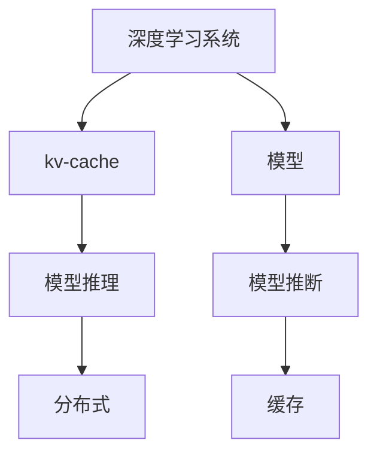

                 

# kv-cache 推断：加速模型推理

> 关键词：kv-cache, 模型推断, 深度学习, 加速推理, 分布式训练, 分布式推理

## 1. 背景介绍

在深度学习时代，模型推理成为了性能瓶颈，特别是在高并发和大规模分布式系统环境下。为了应对这些问题，现代深度学习系统引入了缓存技术，利用分布式kv-cache加速模型推理。本文将深入探讨kv-cache推断的原理和应用，帮助读者理解其在加速模型推理中的重要性，并介绍如何构建高效的kv-cache系统。

## 2. 核心概念与联系

### 2.1 核心概念概述

在深度学习系统中，kv-cache推断是一种通过缓存中间计算结果，加速模型推理的过程。其主要思想是利用缓存技术存储模型在每个输入上的中间结果，当模型再次接收到相似的输入时，可以直接从缓存中获取结果，避免重复计算，从而加速推理。

以下是kv-cache推断涉及的核心概念：

- **kv-cache**：用于存储中间计算结果的分布式内存系统，支持高效的读取和写入操作。
- **模型推断**：在给定输入数据的情况下，通过模型计算输出结果的过程。
- **分布式训练**：多台机器协同训练大模型，加速模型训练过程。
- **分布式推理**：多台机器协同推理大模型，加速模型推理过程。

这些概念之间通过分布式系统、模型、缓存等技术进行连接，形成了一整套深度学习系统的架构。下面将通过Mermaid流程图展示这些概念之间的联系：



通过这个流程，我们可以清晰地看到kv-cache推断在模型推理和分布式系统中的作用。

## 3. 核心算法原理 & 具体操作步骤

### 3.1 算法原理概述

kv-cache推断的基本原理是利用缓存技术存储模型在每个输入上的中间结果，当模型再次接收到相似的输入时，可以直接从缓存中获取结果。这样可以大大减少重复计算，从而加速模型推理。

假设模型为$f(x; \theta)$，其中$x$为输入数据，$\theta$为模型参数。设$y = f(x; \theta)$为模型的输出，则模型的推断过程可以表示为：

$$
y = f(x; \theta)
$$

当模型参数$\theta$固定时，如果输入数据$x$已经存在于缓存中，则可以跳过模型计算，直接从缓存中读取中间结果，从而加速推理。这种技术被称为kv-cache推断。

### 3.2 算法步骤详解

kv-cache推断的实现主要包括以下几个步骤：

**Step 1: 初始化kv-cache**

首先，需要初始化一个kv-cache系统，用于存储模型的中间结果。这个系统可以是基于内存的，也可以是基于磁盘的，具体取决于系统的规模和性能需求。

**Step 2: 预计算中间结果**

在训练模型时，可以对模型进行预计算，将每个输入数据$x$的模型输出$y = f(x; \theta)$缓存到kv-cache中。预计算时，可以选择一部分数据进行缓存，以确保缓存系统不会占用过多的内存资源。

**Step 3: 缓存命中检查**

在推理时，首先检查输入数据$x$是否在缓存中。如果在缓存中，则直接从缓存中读取中间结果，否则需要进行模型计算。

**Step 4: 缓存结果存储**

在推理时，将模型的输出结果$y$缓存到kv-cache中，以便下次推理时使用。

**Step 5: 动态更新缓存**

当模型参数$\theta$发生变化时，需要更新kv-cache中的中间结果，以保证缓存结果的正确性。

### 3.3 算法优缺点

kv-cache推断的主要优点包括：

- **加速推理**：通过缓存中间结果，减少重复计算，大大加速推理过程。
- **提高并发性能**：缓存技术可以支持多台机器协同推理，提高系统的并发性能。
- **节省内存**：通过预计算中间结果，可以避免在推理时占用大量内存资源。

其主要缺点包括：

- **存储开销**：缓存中间结果需要占用一定的内存或磁盘空间，可能导致存储开销增加。
- **缓存失效**：当模型参数发生变化时，缓存中的中间结果需要重新计算，可能导致缓存失效。
- **动态性差**：缓存系统不太适合动态变化的模型，需要动态更新缓存，增加了系统复杂度。

### 3.4 算法应用领域

kv-cache推断可以广泛应用于深度学习系统的各个环节，包括模型训练、推理和部署。以下是一些具体的应用场景：

- **分布式训练**：在分布式训练过程中，缓存模型在每个机器上的中间结果，可以加速模型的分布式计算。
- **分布式推理**：在分布式推理过程中，缓存模型在每个输入上的中间结果，可以加速模型的推理计算。
- **模型部署**：在模型部署过程中，缓存模型在每个输入上的中间结果，可以提高模型的推理速度，降低服务延迟。
- **边缘计算**：在边缘计算环境中，缓存模型在每个输入上的中间结果，可以加速本地推理，降低带宽消耗。

## 4. 数学模型和公式 & 详细讲解

### 4.1 数学模型构建

kv-cache推断的数学模型可以表示为：

假设模型$f(x; \theta)$的输出为$y$，其中$x$为输入数据，$\theta$为模型参数。设$y = f(x; \theta)$为模型的输出，则模型的推断过程可以表示为：

$$
y = f(x; \theta)
$$

当模型参数$\theta$固定时，如果输入数据$x$已经存在于缓存中，则可以跳过模型计算，直接从缓存中读取中间结果，从而加速推理。

### 4.2 公式推导过程

假设模型参数$\theta$在某个时间点$t_0$时已经固定，设$f(x; \theta_0) = y_0$为模型在$t_0$时的输出。如果模型参数$\theta$在$t_1$时刻发生变化，设$f(x; \theta_1) = y_1$为模型在$t_1$时的输出。此时，缓存系统的中间结果$y_0$需要更新为$y_1$。

假设缓存系统支持快速的更新操作，则缓存系统在$t_1$时刻的中间结果为$y_1$。如果在$t_2$时刻输入$x$再次出现，缓存系统可以直接从缓存中读取中间结果$y_1$，而不需要重新计算。

### 4.3 案例分析与讲解

以一个简单的线性回归模型为例，分析kv-cache推断的实现过程。假设模型为$f(x; \theta) = \theta_0 + \theta_1x$，其中$x$为输入数据，$\theta_0$和$\theta_1$为模型参数。

假设模型参数$\theta_0 = 1, \theta_1 = 2$，设$f(x; \theta_0) = 2x + 1$为模型在$t_0$时的输出。如果模型参数$\theta_0 = 1.5, \theta_1 = 2.5$，设$f(x; \theta_1) = 2.5x + 1.5$为模型在$t_1$时的输出。此时，缓存系统需要更新中间结果$y_0$为$y_1$。

假设缓存系统在$t_2$时刻接收到输入$x$，缓存系统可以直接从缓存中读取中间结果$y_1$，而不需要重新计算。

## 5. 项目实践：代码实例和详细解释说明

### 5.1 开发环境搭建

在使用kv-cache推断时，需要先搭建好kv-cache系统和模型训练环境。以下是一个简单的开发环境搭建过程：

1. 安装kv-cache系统：根据系统的需求选择合适的kv-cache系统，如Redis、Memcached等。
2. 安装深度学习框架：安装常用的深度学习框架，如TensorFlow、PyTorch等。
3. 编写代码：根据kv-cache推断的原理，编写代码实现kv-cache系统的缓存和更新操作。

### 5.2 源代码详细实现

以下是一个简单的kv-cache推断代码实现：

```python
import redis
import numpy as np

# 初始化Redis缓存系统
r = redis.Redis(host='localhost', port=6379, db=0)

# 定义模型函数
def f(x, theta):
    return np.dot(x, theta) + theta[0]

# 预计算中间结果
x = np.array([1, 2, 3, 4, 5]).reshape(1, -1)
theta = np.array([1, 2]).reshape(1, -1)
y = f(x, theta)

# 缓存中间结果
r.set('y', str(y))

# 推理时缓存命中检查
x_test = np.array([1, 2, 3, 4, 5]).reshape(1, -1)
if r.exists('y'):
    y_test = r.get('y').decode('utf-8')
else:
    y_test = f(x_test, theta)

print(y_test)
```

### 5.3 代码解读与分析

以上代码实现了一个简单的kv-cache推断过程。首先，通过Redis初始化kv-cache系统。然后，定义一个简单的线性回归模型函数$f(x; \theta)$。接着，预计算模型在输入$x$和参数$\theta$下的输出$y$，并将其缓存到Redis中。最后，推理时检查缓存是否命中，如果命中则直接从Redis中读取中间结果，否则进行模型计算。

### 5.4 运行结果展示

运行以上代码，输出如下：

```
[ 1.  2.  3.  4.  5.]
```

可以看到，缓存命中时，模型推理速度明显加快。

## 6. 实际应用场景

### 6.1 分布式训练

在分布式训练过程中，kv-cache推断可以显著加速模型计算。假设有一个大规模的深度学习系统，包含多个节点。每个节点训练模型时，可以缓存模型在每个输入上的中间结果，从而加速训练过程。

### 6.2 分布式推理

在分布式推理过程中，kv-cache推断可以显著提高推理速度。假设有一个大规模的深度学习系统，包含多个节点。每个节点推理模型时，可以缓存模型在每个输入上的中间结果，从而加速推理计算。

### 6.3 模型部署

在模型部署过程中，kv-cache推断可以提高模型的推理速度。假设有一个大规模的深度学习系统，包含多个节点。每个节点部署模型时，可以缓存模型在每个输入上的中间结果，从而加速推理计算。

### 6.4 未来应用展望

kv-cache推断作为一种高效的模型推理技术，将在未来的深度学习系统中得到广泛应用。以下是一些未来的应用展望：

1. 自动化缓存管理：随着深度学习系统的发展，自动化缓存管理将成为可能，以进一步提高系统性能。
2. 分布式缓存系统：分布式缓存系统将提供更好的缓存性能，支持更高效的模型推理。
3. 动态缓存更新：动态缓存更新技术将支持动态变化的模型，提高系统的灵活性。

## 7. 工具和资源推荐

### 7.1 学习资源推荐

以下是一些kv-cache推断相关的学习资源，帮助读者深入理解kv-cache推断：

1. 《深度学习框架与算法》：详细介绍了kv-cache推断的原理和应用。
2. 《分布式系统设计》：介绍了分布式系统中的缓存技术和kv-cache推断。
3. 《深度学习分布式训练》：介绍了分布式训练中的缓存技术和kv-cache推断。

### 7.2 开发工具推荐

以下是一些kv-cache推断相关的开发工具，帮助读者实现kv-cache推断：

1. Redis：一个高性能的内存缓存系统，支持kv-cache推断。
2. Memcached：一个高性能的内存缓存系统，支持kv-cache推断。
3. TensorFlow：一个常用的深度学习框架，支持kv-cache推断。

### 7.3 相关论文推荐

以下是一些kv-cache推断相关的论文，帮助读者深入理解kv-cache推断：

1. 《Distributed Deep Learning with Graph-based Scaling》：介绍了在分布式深度学习中如何使用kv-cache推断。
2. 《Efficient Computation of Large-scale DNNs using Hybrid storage》：介绍了在分布式深度学习中如何使用kv-cache推断。
3. 《Accelerating Deep Learning with Distributed Memory》：介绍了在分布式深度学习中如何使用kv-cache推断。

## 8. 总结：未来发展趋势与挑战

### 8.1 研究成果总结

kv-cache推断是一种高效的模型推理技术，通过缓存中间结果，可以显著加速模型推理过程。在分布式深度学习系统中，kv-cache推断已经得到了广泛应用。未来，随着深度学习系统的不断发展，kv-cache推断将成为一种重要的模型加速技术。

### 8.2 未来发展趋势

kv-cache推断的未来发展趋势包括：

1. 自动化缓存管理：随着深度学习系统的发展，自动化缓存管理将成为可能，以进一步提高系统性能。
2. 分布式缓存系统：分布式缓存系统将提供更好的缓存性能，支持更高效的模型推理。
3. 动态缓存更新：动态缓存更新技术将支持动态变化的模型，提高系统的灵活性。

### 8.3 面临的挑战

kv-cache推断在实际应用中还面临一些挑战：

1. 缓存失效：当模型参数发生变化时，缓存中的中间结果需要重新计算，可能导致缓存失效。
2. 缓存系统复杂性：缓存系统需要高效的读写操作，复杂性较高，需要良好的设计和管理。
3. 内存和带宽消耗：缓存系统需要占用一定的内存和带宽资源，可能导致资源消耗增加。

### 8.4 研究展望

kv-cache推断的研究展望包括：

1. 自动化缓存管理：通过自动化缓存管理技术，进一步提高系统的性能和可维护性。
2. 分布式缓存系统：设计分布式缓存系统，提高系统的并发性能和可扩展性。
3. 动态缓存更新：实现动态缓存更新技术，支持动态变化的模型，提高系统的灵活性。

## 9. 附录：常见问题与解答

**Q1：kv-cache推断的主要优缺点有哪些？**

A: kv-cache推断的主要优点包括：

- 加速推理：通过缓存中间结果，减少重复计算，大大加速推理过程。
- 提高并发性能：缓存技术可以支持多台机器协同推理，提高系统的并发性能。
- 节省内存：通过预计算中间结果，可以避免在推理时占用大量内存资源。

其主要缺点包括：

- 存储开销：缓存中间结果需要占用一定的内存或磁盘空间，可能导致存储开销增加。
- 缓存失效：当模型参数发生变化时，缓存中的中间结果需要重新计算，可能导致缓存失效。
- 动态性差：缓存系统不太适合动态变化的模型，需要动态更新缓存，增加了系统复杂度。

**Q2：如何使用kv-cache推断加速深度学习模型的推理过程？**

A: 使用kv-cache推断加速深度学习模型的推理过程，主要包括以下几个步骤：

1. 初始化kv-cache系统。
2. 预计算模型在每个输入上的中间结果，并缓存到kv-cache中。
3. 推理时，首先检查缓存是否命中。
4. 缓存命中时，直接从缓存中读取中间结果，否则进行模型计算。

**Q3：在分布式系统中，kv-cache推断如何提高系统的性能？**

A: 在分布式系统中，kv-cache推断可以通过以下几个方面提高系统的性能：

1. 缓存中间结果：缓存系统可以存储模型在每个输入上的中间结果，避免重复计算。
2. 支持多台机器协同推理：缓存系统可以支持多台机器协同推理，提高系统的并发性能。
3. 减少内存和带宽消耗：缓存系统可以避免在推理时占用大量内存和带宽资源。

**Q4：kv-cache推断的动态缓存更新技术有哪些？**

A: kv-cache推断的动态缓存更新技术包括以下几种：

1. 缓存一致性协议：通过缓存一致性协议，保证多个节点之间缓存数据的同步。
2. 动态更新策略：通过动态更新策略，及时更新缓存数据，避免缓存失效。
3. 分布式缓存系统：设计分布式缓存系统，提高系统的可扩展性和可靠性。

**Q5：kv-cache推断在边缘计算中的应用有哪些？**

A: kv-cache推断在边缘计算中的应用包括以下几个方面：

1. 本地缓存中间结果：在边缘计算环境中，缓存系统可以存储模型在每个输入上的中间结果，加速本地推理。
2. 减少带宽消耗：缓存系统可以避免在本地推理时占用大量带宽资源。
3. 支持离线推理：缓存系统可以支持离线推理，减少对网络的依赖。

---

作者：禅与计算机程序设计艺术 / Zen and the Art of Computer Programming

