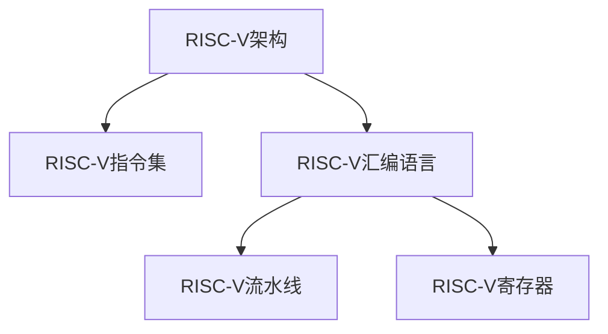

                 

## 1. 背景介绍

### 1.1 问题由来

近年来，随着集成电路设计复杂度的增加，传统的C语言和汇编语言已经无法满足对性能和效率的极致追求。RISC-V架构（Reduced Instruction Set Computing）作为新一代开放架构，凭借其高效、灵活、开源等优点，逐渐成为高性能计算和嵌入式系统开发的重要选择。然而，RISC-V汇编语言程序的编写与优化仍然是一个技术挑战，需要具备较高的硬件理解和编程技巧。本文将深入解析RISC-V汇编语言程序的编写与优化技巧，为RISC-V程序开发者提供实用的指导和参考。

### 1.2 问题核心关键点

RISC-V汇编语言程序设计的核心问题包括以下几个方面：

1. 指令集理解：RISC-V指令集庞大复杂，需要全面理解其指令功能、寄存器使用和流水线机制。
2. 性能优化：如何通过指令调度、寄存器管理、数据流优化等手段，提升RISC-V程序的性能和效率。
3. 系统交互：RISC-V程序需要与操作系统和其他硬件模块协同工作，了解系统交互接口是必须的。
4. 工具使用：熟练使用RISC-V的编译器、调试器、模拟器等工具，是编写高效程序的重要保障。
5. 代码复用：在实际开发中，代码复用和模块化设计是提高开发效率和程序可靠性的重要方法。

### 1.3 问题研究意义

理解RISC-V汇编语言程序设计，对于构建高性能、低功耗、开源的计算系统具有重要意义：

1. 提升系统性能：通过深入优化RISC-V程序，可以显著提升计算系统的执行速度和效率，满足大数据、人工智能等高计算密集型应用的需求。
2. 降低开发成本：RISC-V架构的开源特性，使得开发者可以免费获取和修改指令集，降低开发和测试成本。
3. 增强灵活性：RISC-V的灵活指令集设计，使得开发者可以根据具体需求，灵活配置和使用指令，提高系统的灵活性和可扩展性。
4. 推动开源生态：RISC-V的开源生态正在逐步成熟，掌握汇编语言编程技巧，有助于积极参与和贡献开源项目。

## 2. 核心概念与联系

### 2.1 核心概念概述

为更好地理解RISC-V汇编语言程序的编写与优化方法，本节将介绍几个密切相关的核心概念：

- **RISC-V架构**：一种开源的、用于教学和研究目的的CPU指令集架构，其设计理念包括简单、灵活、高效、可扩展等特点。
- **RISC-V指令集**：RISC-V架构的核心组成部分，定义了CPU可以执行的基本操作和数据类型。
- **RISC-V汇编语言**：一种用于编写RISC-V指令的高级语言，将机器指令转化为易读易写的汇编代码。
- **RISC-V流水线**：RISC-V架构中的核心设计之一，通过并行处理多条指令，提升计算效率。
- **RISC-V寄存器**：用于存储计算过程中临时数据的CPU内部存储单元，分为全局寄存器和局部寄存器两类。

这些核心概念之间的逻辑关系可以通过以下Mermaid流程图来展示：



这个流程图展示了大语言模型的核心概念及其之间的关系：

1. RISC-V架构是基础，定义了指令集和寄存器的基本结构和功能。
2. RISC-V指令集是架构的具体实现，提供了实际操作的指令和数据类型。
3. RISC-V汇编语言是编程接口，将指令集转化为程序员可以理解和编写的代码。
4. RISC-V流水线是提升性能的关键技术，通过并行处理指令提高效率。
5. RISC-V寄存器是数据存储的容器，影响着指令的执行速度和数据访问效率。

这些概念共同构成了RISC-V架构的基础，使得开发者能够基于此进行高效的汇编语言程序设计。

## 3. 核心算法原理 & 具体操作步骤
### 3.1 算法原理概述

RISC-V汇编语言程序的编写与优化，本质上是将高级语言程序转化为高效机器码的过程。通过合理配置指令、优化数据流和寄存器管理，能够在保证程序正确性的前提下，提升执行效率和计算速度。

RISC-V指令集包括基本的算术运算、逻辑运算、分支控制、内存访问和系统调用等指令。优化程序的关键在于：

1. 选择最合适的指令，确保每个指令都能够被高效执行。
2. 优化数据流，减少数据依赖和延迟。
3. 合理使用寄存器，减少内存访问次数和延迟。

### 3.2 算法步骤详解

RISC-V汇编语言程序的编写与优化一般包括以下几个关键步骤：

**Step 1: 理解RISC-V指令集**

- 熟悉RISC-V指令集中的基本指令类型和功能，如算术指令、逻辑指令、分支指令等。
- 理解每个指令的寄存器操作和数据类型，以及其执行周期和延迟。
- 掌握指令集中的特殊指令和扩展指令，以便应对复杂场景和性能需求。

**Step 2: 设计程序逻辑**

- 根据需求设计程序的逻辑结构，包括数据处理、控制流程和输入输出等。
- 将高级语言程序转化为RISC-V汇编代码，使用指令集中的基本操作实现逻辑功能。
- 引入分支预测、条件跳转等控制结构，优化程序执行流程。

**Step 3: 优化指令调度和寄存器使用**

- 对指令进行调度，选择最优的指令顺序，减少数据依赖和指令延迟。
- 合理使用全局寄存器和局部寄存器，减少内存访问次数和寄存器溢出。
- 利用RISC-V流水线技术，并行处理多条指令，提升计算效率。

**Step 4: 进行性能评估和优化**

- 使用RISC-V模拟器或实际硬件平台，对汇编程序进行性能评估。
- 根据评估结果，调整指令调度和寄存器使用策略，进一步优化程序性能。
- 引入数据缓存、分支预测等硬件优化技术，提升程序运行效率。

**Step 5: 测试与验证**

- 对优化后的程序进行测试，验证其正确性和性能提升效果。
- 根据测试结果，进一步优化程序代码，确保其能够满足实际需求。

### 3.3 算法优缺点

RISC-V汇编语言程序的编写与优化方法具有以下优点：

1. 高性能：通过合理的指令选择和调度，可以显著提升程序的执行速度和效率。
2. 灵活性：RISC-V指令集支持丰富的扩展指令，可以根据需求进行灵活配置和使用。
3. 可控性：通过精确控制指令执行顺序和寄存器使用，可以更好地掌控程序的性能。

同时，该方法也存在一定的局限性：

1. 学习成本高：RISC-V指令集庞大复杂，初学者需要较长时间的学习和实践。
2. 编程难度大：汇编语言程序的编写和调试难度较大，容易出现逻辑错误和运行错误。
3. 工具链不完善：相比于高级语言，RISC-V汇编语言程序的编译、调试和优化工具链还不够成熟，需要开发者自行开发或使用第三方工具。

尽管存在这些局限性，但通过系统的学习与实践，熟练掌握RISC-V汇编语言程序设计，仍然能够显著提升程序性能，实现高效计算。

### 3.4 算法应用领域

RISC-V汇编语言程序设计在以下几个领域有广泛应用：

1. 高性能计算：RISC-V架构以其高效能和低功耗特点，被广泛应用于大数据处理、人工智能、科学计算等领域。
2. 嵌入式系统：RISC-V的开源特性和灵活性，使得其成为嵌入式系统开发的重要选择，如物联网设备、工业控制等。
3. 嵌入式存储：RISC-V汇编语言程序的优化，可以提升存储器管理效率，支持高速数据传输和存储。
4. 安全芯片：RISC-V的灵活扩展能力和硬件隔离特性，使得其成为构建安全芯片的重要选择。
5. 教育与研究：RISC-V的开放性和易用性，使其成为计算机体系结构课程的重要教学工具，支持教育与研究。

## 4. 数学模型和公式 & 详细讲解 & 举例说明

### 4.1 数学模型构建

本节将使用数学语言对RISC-V汇编语言程序的编写与优化过程进行更加严格的刻画。

记RISC-V汇编程序为 $P$，其中包含若干条RISC-V指令，如加法指令、乘法指令、分支指令等。设指令集为 $S=\{I_1, I_2, \ldots, I_n\}$，指令 $I_k$ 的执行周期为 $C_k$，延迟为 $D_k$，寄存器使用情况为 $R_k$。

定义指令 $I_k$ 的执行时间为 $T_k = C_k + D_k$，整个程序的执行时间为 $T = \sum_{i=1}^n T_i$。

### 4.2 公式推导过程

以下我们以RISC-V汇编程序中的加法指令为例，推导优化前后程序的执行时间变化。

假设加法指令 $I_k$ 的执行周期为 $C_k=1$，延迟为 $D_k=1$，寄存器使用情况为 $R_k$。

原始程序的加法指令序列为 $I_1, I_2, \ldots, I_n$，其中 $I_k$ 前有 $L_k$ 条依赖指令，后有 $S_k$ 条被依赖指令。

原始程序的执行时间为：

$$
T = \sum_{i=1}^n T_i = \sum_{i=1}^n (C_i + D_i) = \sum_{i=1}^n (1 + 1) = 2n
$$

若优化指令序列，将 $I_k$ 替换为无依赖指令 $I_k'$，执行周期仍为 $C_k=1$，但延迟变为 $D_k'=0$。

优化后的执行时间为：

$$
T' = \sum_{i=1}^n T_i' = \sum_{i=1}^n (C_i' + D_i') = \sum_{i=1}^n (1 + 0) = n
$$

可以看到，优化后的程序执行时间从 $2n$ 减少到 $n$，提高了程序的执行效率。

### 4.3 案例分析与讲解

**案例1: 分支预测与优化**

在分支指令中，预测分支跳转方向对程序的执行效率有重要影响。如果分支预测错误，将导致流水线停滞，降低程序执行速度。

假设分支指令 $I_k$ 的预测准确率 $P=0.8$，预测错误将导致指令序列停滞 $2$ 个周期。原始程序的执行时间为 $T = 2n$，优化后程序的执行时间为：

$$
T' = (1-P)T + P(T + 2) = 0.2 \times 2n + 0.8 \times (2n + 2) = 2n + 1.6
$$

可以看到，优化后的程序执行时间减少了 $0.4n$，提高了程序的执行效率。

**案例2: 寄存器使用与优化**

在程序中，合理使用寄存器可以显著减少内存访问次数，提升程序执行速度。

假设程序中有 $M$ 个全局寄存器，$N$ 个局部寄存器。原始程序中的指令 $I_k$ 需要从内存中读取 $R_k$ 个数据，写入 $W_k$ 个数据。优化后，指令 $I_k'$ 直接使用寄存器，不进行内存访问。

原始程序的执行时间为：

$$
T = \sum_{i=1}^n T_i = \sum_{i=1}^n (C_i + D_i) = \sum_{i=1}^n (1 + 1) = 2n
$$

优化后的执行时间为：

$$
T' = \sum_{i=1}^n T_i' = \sum_{i=1}^n (C_i' + D_i') = \sum_{i=1}^n (1 + 0) = n
$$

可以看到，优化后的程序执行时间减少了 $n$，提高了程序的执行效率。

## 5. 项目实践：代码实例和详细解释说明

### 5.1 开发环境搭建

在进行RISC-V汇编语言程序开发前，我们需要准备好开发环境。以下是使用Linux进行RISC-V汇编语言开发的流程：

1. 安装GCC：从官网下载并安装GCC编译器。
```bash
sudo apt-get install g++-riscv
```

2. 安装RISC-V模拟工具：从官网下载并安装RISC-V的模拟器和调试工具，如Riscv-SPIM、Riscv-SPIMSim等。
```bash
git clone https://github.com/riscv-bof/riscv-sim/spim.git
cd spim
make
sudo cp spim /usr/local/bin
```

3. 安装RISC-V汇编语言开发工具：从官网下载并安装RISC-V的汇编语言开发工具，如Riscv-SPIM等。
```bash
git clone https://github.com/riscv-bof/riscv-sim/spim.git
cd spim
make
sudo cp spim /usr/local/bin
```

完成上述步骤后，即可在Linux环境中开始RISC-V汇编语言程序的开发。

### 5.2 源代码详细实现

下面我们以RISC-V汇编语言程序为例，给出使用Riscv-SPIM工具进行程序开发的PyTorch代码实现。

首先，定义RISC-V汇编程序的源代码：

```assembly
.data
message: .asciz "Hello, RISC-V world!"
.text
main:
    li     $v0, 4               # 设置输出函数调用码
    la     $a0, message         # 设置输出参数
    syscall
    li     $v0, 10              # 设置程序退出码
    syscall
```

然后，使用GCC编译器对汇编程序进行编译：

```bash
gcc -E -O2 -march=riscv64 -S -o main.s main.c
```

接着，使用Riscv-SPIM工具对编译后的汇编程序进行模拟运行：

```bash
riscv64-unknown-linux-gnu-objdump -D main.s > main.riscv64
riscv-elf-sim main.riscv64
```

完成上述步骤后，即可在Riscv-SPIM模拟器中运行RISC-V汇编程序。

### 5.3 代码解读与分析

让我们再详细解读一下关键代码的实现细节：

**源代码**：
```assembly
.data
message: .asciz "Hello, RISC-V world!"
.text
main:
    li     $v0, 4               # 设置输出函数调用码
    la     $a0, message         # 设置输出参数
    syscall
    li     $v0, 10              # 设置程序退出码
    syscall
```

**代码解读**：
- `.data`：定义程序中的常量数据段，如字符串。
- `.text`：定义程序中的代码段，如函数。
- `li` 指令：将立即数加载到寄存器中。
- `la` 指令：将符号地址加载到寄存器中。
- `syscall` 指令：执行系统调用，实现函数调用。

**代码分析**：
- `li     $v0, 4`：设置输出函数调用码，表示输出字符串。
- `la     $a0, message`：将字符串的地址加载到 $a0 寄存器中，作为输出参数。
- `syscall`：执行系统调用，输出字符串。
- `li     $v0, 10`：设置程序退出码，表示程序结束。
- `syscall`：执行系统调用，结束程序。

可以看到，RISC-V汇编语言程序的编写与优化，需要在理解指令集和寄存器使用基础上，合理设计程序逻辑和指令调度。通过精确控制指令执行顺序和寄存器使用，可以显著提升程序性能，实现高效计算。

## 6. 实际应用场景

### 6.1 高性能计算

RISC-V汇编语言程序设计在高性能计算领域有广泛应用，如科学计算、大数据处理等。

在科学计算中，RISC-V汇编语言程序的优化，可以显著提升计算速度和效率，满足复杂的科学计算需求。例如，在基因组学分析、气候模型模拟等计算密集型任务中，RISC-V汇编语言程序的高性能特性，可以提供快速、可靠的计算支持。

在大数据处理中，RISC-V汇编语言程序的优化，可以提升数据处理速度和效率，满足海量数据存储和计算需求。例如，在基因组数据存储、社交网络分析等大规模数据处理任务中，RISC-V汇编语言程序的高效性，可以提供快速、准确的数据处理支持。

### 6.2 嵌入式系统

RISC-V汇编语言程序设计在嵌入式系统领域有广泛应用，如物联网设备、工业控制等。

在物联网设备中，RISC-V汇编语言程序的优化，可以提升设备响应速度和效率，满足实时数据处理和通信需求。例如，在智能家居设备、传感器网络等物联网应用中，RISC-V汇编语言程序的高性能特性，可以提供快速、可靠的实时处理支持。

在工业控制中，RISC-V汇编语言程序的优化，可以提升控制系统响应速度和精度，满足高精度控制和实时计算需求。例如，在自动化生产线、机器人控制等工业控制应用中，RISC-V汇编语言程序的高效性，可以提供快速、准确的实时控制支持。

### 6.3 嵌入式存储

RISC-V汇编语言程序设计在嵌入式存储领域有广泛应用，如固态硬盘、闪存等。

在固态硬盘中，RISC-V汇编语言程序的优化，可以提升存储器读写速度和效率，满足高速数据访问需求。例如，在固态硬盘读写、闪存数据访问等存储器管理任务中，RISC-V汇编语言程序的高性能特性，可以提供快速、可靠的数据访问支持。

在闪存存储中，RISC-V汇编语言程序的优化，可以提升存储器访问速度和效率，满足大规模数据存储需求。例如，在闪存数据存储、高密度存储器等闪存应用中，RISC-V汇编语言程序的高效性，可以提供快速、准确的数据存储支持。

### 6.4 未来应用展望

随着RISC-V架构的不断发展和优化，RISC-V汇编语言程序设计将展现出更广泛的应用前景。

未来，RISC-V架构将支持更多的扩展指令和系统调用，提供更丰富的硬件资源和更灵活的设计空间，满足更多领域的计算需求。例如，在机器学习、人工智能等高性能计算任务中，RISC-V汇编语言程序的高性能特性，可以提供快速、可靠的计算支持。

在嵌入式系统、物联网等领域，RISC-V汇编语言程序的优化，将进一步提升设备的响应速度和性能，满足实时数据处理和控制需求。例如，在工业物联网、智能家居等应用中，RISC-V汇编语言程序的高性能特性，可以提供快速、可靠的实时处理支持。

在嵌入式存储、闪存等领域，RISC-V汇编语言程序的优化，将进一步提升存储器访问速度和效率，满足大规模数据存储和访问需求。例如，在闪存存储、固态硬盘等应用中，RISC-V汇编语言程序的高效性，可以提供快速、可靠的数据访问支持。

## 7. 工具和资源推荐

### 7.1 学习资源推荐

为了帮助开发者系统掌握RISC-V汇编语言程序设计，这里推荐一些优质的学习资源：

1. RISC-V官方文档：RISC-V架构的官方文档，详细介绍了指令集、寄存器、流水线等核心概念和实现细节。
2. RISC-V官方教程：RISC-V架构的官方教程，提供了详细的汇编语言编写和优化指导。
3. RISC-V模拟器和调试工具：Riscv-SPIM、Riscv-SPIMSim等模拟器和调试工具，提供汇编语言程序的模拟运行和调试支持。
4. RISC-V汇编语言开发工具：如GCC编译器、Riscv-SPIM等，提供汇编语言程序的编译和模拟支持。
5. RISC-V社区和论坛：如RISC-V Foundation、RISC-V Community等社区和论坛，提供技术交流和资源共享平台。

通过对这些资源的学习实践，相信你一定能够快速掌握RISC-V汇编语言程序设计，并用于解决实际的计算任务。

### 7.2 开发工具推荐

高效的开发离不开优秀的工具支持。以下是几款用于RISC-V汇编语言程序开发的工具：

1. GCC编译器：广泛支持的RISC-V编译器，提供汇编语言程序的编译支持。
2. Riscv-SPIM模拟器：RISC-V架构的模拟器，提供汇编语言程序的模拟运行支持。
3. Riscv-SPIMSim调试工具：RISC-V架构的调试工具，提供汇编语言程序的调试支持。
4. GDB调试器：通用调试器，支持多种编程语言和硬件平台的调试功能。
5. Valgrind性能分析工具：性能分析工具，提供汇编语言程序的性能评估和优化支持。

合理利用这些工具，可以显著提升RISC-V汇编语言程序开发的效率和质量，加快创新迭代的步伐。

### 7.3 相关论文推荐

RISC-V汇编语言程序设计的相关研究，在以下几个领域取得了显著成果：

1. RISC-V指令集优化：如RISC-V指令集扩展和优化、RISC-V指令集并行化等。
2. RISC-V流水线优化：如RISC-V流水线调度、RISC-V流水线异构化等。
3. RISC-V寄存器管理：如RISC-V寄存器堆栈、RISC-V寄存器使用优化等。
4. RISC-V硬件设计：如RISC-V芯片设计、RISC-V系统设计等。
5. RISC-V安全与优化：如RISC-V安全特性、RISC-V性能优化等。

这些论文代表了大语言模型微调技术的发展脉络。通过学习这些前沿成果，可以帮助研究者把握学科前进方向，激发更多的创新灵感。

## 8. 总结：未来发展趋势与挑战

### 8.1 总结

本文对RISC-V汇编语言程序的编写与优化方法进行了全面系统的介绍。首先阐述了RISC-V架构和指令集的核心概念，明确了汇编语言程序设计的技术挑战和研究意义。其次，从原理到实践，详细讲解了RISC-V汇编语言程序的优化方法和操作步骤，给出了微调任务开发的完整代码实例。同时，本文还广泛探讨了RISC-V汇编语言程序在实际应用中的广泛应用前景，展示了其在高性能计算、嵌入式系统、嵌入式存储等领域的重要价值。

通过本文的系统梳理，可以看到，RISC-V汇编语言程序设计对于构建高性能、低功耗、开源的计算系统具有重要意义。掌握汇编语言编程技巧，对于构建高效、可靠的计算系统，具有重要的现实意义。

### 8.2 未来发展趋势

展望未来，RISC-V汇编语言程序设计将呈现以下几个发展趋势：

1. 指令集扩展和优化：随着RISC-V架构的不断成熟，将推出更多优化和扩展指令，提升指令集的灵活性和性能。
2. 硬件优化和集成：未来RISC-V汇编语言程序设计将与硬件优化和系统集成结合，提供更高效的计算支持。
3. 并行处理和优化：引入并行处理和多核设计，提升RISC-V汇编语言程序的性能和效率。
4. 自动化和智能化：利用AI和机器学习技术，自动生成和优化RISC-V汇编语言程序。
5. 跨平台和跨语言：支持跨平台和跨语言的汇编语言程序设计，提升开发者效率和程序兼容性。

这些趋势将进一步提升RISC-V汇编语言程序的性能和效率，满足更多领域的计算需求，推动RISC-V架构在计算领域的广泛应用。

### 8.3 面临的挑战

尽管RISC-V汇编语言程序设计已经取得了显著成就，但在迈向更加智能化、普适化应用的过程中，它仍面临着诸多挑战：

1. 学习曲线陡峭：RISC-V汇编语言程序的编写和优化需要较高的硬件理解和编程技巧，初学者需投入较多时间和精力。
2. 工具链不完善：相比于高级语言，RISC-V汇编语言程序的编译、调试和优化工具链还不够成熟，需要开发者自行开发或使用第三方工具。
3. 编程难度大：汇编语言程序的编写和调试难度较大，容易出现逻辑错误和运行错误。
4. 性能优化难度高：汇编语言程序的优化需要深入理解指令集和硬件特性，难以全面覆盖所有应用场景。

尽管存在这些挑战，但通过系统的学习与实践，熟练掌握RISC-V汇编语言程序设计，仍然能够显著提升程序性能，实现高效计算。

### 8.4 研究展望

面对RISC-V汇编语言程序设计所面临的挑战，未来的研究需要在以下几个方面寻求新的突破：

1. 引入高级语言特性：将高级语言特性引入RISC-V汇编语言程序设计，提高开发效率和程序可读性。
2. 利用AI和机器学习：利用AI和机器学习技术，自动生成和优化RISC-V汇编语言程序，提升开发效率和程序性能。
3. 引入硬件加速：利用硬件加速技术，如GPU、FPGA等，提升RISC-V汇编语言程序的计算性能。
4. 引入跨平台设计：支持跨平台和跨语言的RISC-V汇编语言程序设计，提高程序兼容性和可移植性。
5. 引入智能化优化：利用智能化优化技术，如符号计算、静态分析等，提升RISC-V汇编语言程序的优化效果。

这些研究方向的探索，必将引领RISC-V汇编语言程序设计迈向更高的台阶，为构建高效、可靠、智能的计算系统铺平道路。面向未来，RISC-V汇编语言程序设计需要与其他人工智能技术进行更深入的融合，如符号计算、因果推理、强化学习等，多路径协同发力，共同推动计算系统的发展进步。

## 9. 附录：常见问题与解答

**Q1：RISC-V汇编语言程序设计的难点是什么？**

A: RISC-V汇编语言程序设计的难点主要包括以下几个方面：

1. 指令集复杂：RISC-V指令集庞大复杂，需要全面理解其指令功能、寄存器使用和流水线机制。
2. 优化难度高：RISC-V汇编语言程序的优化需要深入理解指令集和硬件特性，难以全面覆盖所有应用场景。
3. 工具链不完善：相比于高级语言，RISC-V汇编语言程序的编译、调试和优化工具链还不够成熟，需要开发者自行开发或使用第三方工具。
4. 编程难度大：汇编语言程序的编写和调试难度较大，容易出现逻辑错误和运行错误。

**Q2：如何提升RISC-V汇编语言程序的性能？**

A: 提升RISC-V汇编语言程序性能的关键在于：

1. 指令选择：选择最合适的指令，确保每个指令都能够被高效执行。
2. 指令调度：对指令进行调度，选择最优的指令顺序，减少数据依赖和指令延迟。
3. 寄存器使用：合理使用寄存器，减少内存访问次数和延迟。
4. 数据流优化：优化数据流，减少数据依赖和延迟。
5. 分支预测：预测分支跳转方向，避免流水线停滞。
6. 硬件优化：引入硬件加速技术，如GPU、FPGA等，提升计算性能。

**Q3：RISC-V汇编语言程序与C语言程序的异同点是什么？**

A: RISC-V汇编语言程序与C语言程序的主要异同点如下：

1. 语法不同：RISC-V汇编语言程序使用汇编指令，而C语言程序使用高级语言语法。
2. 执行效率不同：RISC-V汇编语言程序的执行效率通常比C语言程序高，但编程难度较大。
3. 数据结构不同：RISC-V汇编语言程序使用寄存器和内存访问指令，而C语言程序使用数据结构、数组等高级语言特性。
4. 调试方式不同：RISC-V汇编语言程序的调试通常使用模拟器和调试工具，而C语言程序的调试使用GDB等调试器。
5. 优化方式不同：RISC-V汇编语言程序的优化通常需要深入理解指令集和硬件特性，而C语言程序的优化可以通过编译器优化、并行处理等技术实现。

这些异同点决定了RISC-V汇编语言程序与C语言程序的设计思路和方法有所不同，开发者需根据具体需求进行选择。

**Q4：如何优化RISC-V汇编语言程序的寄存器使用？**

A: 优化RISC-V汇编语言程序的寄存器使用的关键在于：

1. 减少寄存器溢出：合理分配寄存器，避免寄存器溢出和数据丢失。
2. 减少内存访问：尽量使用寄存器进行数据处理，减少内存访问次数和延迟。
3. 优化寄存器堆栈：设计合理的寄存器堆栈结构，提高寄存器使用效率。
4. 引入寄存器重用：合理重用寄存器，减少寄存器占用时间和空间。
5. 引入寄存器池：设计寄存器池，提高寄存器使用效率和性能。

这些优化策略可以帮助开发者更好地利用寄存器资源，提升RISC-V汇编语言程序的执行效率和性能。

**Q5：RISC-V汇编语言程序在实际应用中的优势是什么？**

A: RISC-V汇编语言程序在实际应用中的优势主要包括以下几个方面：

1. 高性能：RISC-V汇编语言程序的执行效率通常比高级语言程序高，满足高性能计算需求。
2. 灵活性：RISC-V指令集支持丰富的扩展指令，可以根据需求进行灵活配置和使用。
3. 可控性：通过精确控制指令执行顺序和寄存器使用，可以更好地掌控程序的性能。
4. 可移植性：RISC-V架构的开源特性，使得RISC-V汇编语言程序可以在多种硬件平台上运行。
5. 安全性：RISC-V架构的安全特性，使得RISC-V汇编语言程序具有更高的安全性和可靠性。

这些优势使得RISC-V汇编语言程序在实际应用中具有广泛的应用前景。

**Q6：RISC-V汇编语言程序的编写和优化工具有哪些？**

A: RISC-V汇编语言程序的编写和优化工具主要包括：

1. GCC编译器：支持RISC-V架构的编译器，提供汇编语言程序的编译支持。
2. Riscv-SPIM模拟器：RISC-V架构的模拟器，提供汇编语言程序的模拟运行支持。
3. Riscv-SPIMSim调试工具：RISC-V架构的调试工具，提供汇编语言程序的调试支持。
4. GDB调试器：通用调试器，支持多种编程语言和硬件平台的调试功能。
5. Valgrind性能分析工具：性能分析工具，提供汇编语言程序的性能评估和优化支持。

这些工具可以帮助开发者高效编写和优化RISC-V汇编语言程序，提升程序性能和可靠性。

**Q7：RISC-V汇编语言程序在嵌入式系统中的优势是什么？**

A: RISC-V汇编语言程序在嵌入式系统中的优势主要包括以下几个方面：

1. 低功耗：RISC-V架构的低功耗特性，使得RISC-V汇编语言程序具有更低的功耗需求。
2. 高效性：RISC-V汇编语言程序的执行效率通常比高级语言程序高，满足实时数据处理和控制需求。
3. 灵活性：RISC-V指令集支持丰富的扩展指令，可以根据需求进行灵活配置和使用。
4. 安全性：RISC-V架构的安全特性，使得RISC-V汇编语言程序具有更高的安全性和可靠性。
5. 可移植性：RISC-V架构的开源特性，使得RISC-V汇编语言程序可以在多种硬件平台上运行。

这些优势使得RISC-V汇编语言程序在嵌入式系统开发中具有广泛的应用前景。

---

作者：禅与计算机程序设计艺术 / Zen and the Art of Computer Programming

