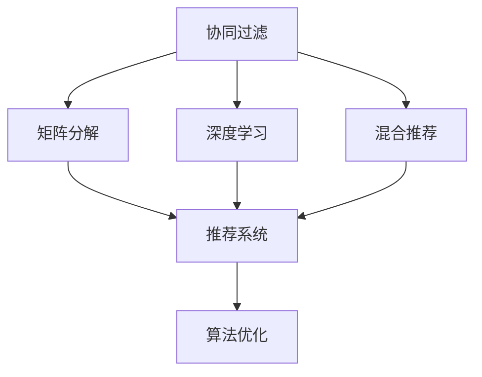

                 

# 个性化知识订阅要不断优化推荐算法

> 关键词：个性化推荐算法, 知识订阅, 协同过滤, 矩阵分解, 深度学习, 混合推荐, 推荐系统, 算法优化, 用户体验

## 1. 背景介绍

在信息爆炸的时代，知识订阅服务因其个性化推荐，让用户能够快速获取到感兴趣的信息，越来越受到用户的青睐。然而，个性化推荐系统的推荐效果往往受到用户偏好的多样性和动态变化的影响，推荐算法的优化成为了提升用户满意度和订阅量的关键。

### 1.1 问题由来
随着社交网络、电子商务的蓬勃发展，用户在线行为数据的丰富程度日益增加，个性化推荐算法被广泛用于提升用户的购物体验。然而，由于用户兴趣的多样性和动态变化，推荐系统的性能在实际应用中往往存在以下问题：

- **冷启动问题**：新用户的兴趣标签缺失，难以进行推荐。
- **用户兴趣动态变化**：用户兴趣随时间变化，推荐系统需要不断更新用户画像。
- **多样性与新颖性**：推荐系统需要同时兼顾推荐内容的多样性和新颖性，避免推荐内容的同质化。
- **数据稀疏性**：用户行为数据往往存在稀疏性，难以进行准确的推荐。
- **可解释性**：推荐系统的决策过程需要具备可解释性，便于用户理解和信任。

### 1.2 问题核心关键点
个性化推荐算法优化的核心在于如何更好地利用用户数据，并结合算法设计，构建更准确、高效、可解释的推荐模型。主要从以下几个方面进行优化：

1. **冷启动问题**：通过模型初始化、用户行为挖掘、多模态数据融合等手段，提升新用户的个性化推荐。
2. **用户兴趣动态变化**：利用在线学习、增量学习等方法，不断更新用户画像，并动态调整推荐策略。
3. **多样性与新颖性**：结合多臂老虎机、上下文推荐、时间差异性等技术，实现推荐内容的多样性与新颖性。
4. **数据稀疏性**：通过矩阵分解、协同过滤、深度学习等方法，挖掘用户潜在兴趣，缓解数据稀疏问题。
5. **可解释性**：引入可解释模型、知识图谱、规则引擎等技术，提升推荐系统的透明性，帮助用户理解推荐逻辑。

### 1.3 问题研究意义
优化推荐算法不仅能够提升个性化知识订阅服务的效果，增加用户黏性和订阅量，还能提高用户的满意度和忠诚度。此外，推荐算法的优化还有助于知识订阅服务的商业化和产业化的落地，为智能化推荐系统开辟了新的方向。

## 2. 核心概念与联系

### 2.1 核心概念概述

为更好地理解个性化推荐算法的优化方法，本节将介绍几个密切相关的核心概念：

- **协同过滤**：一种基于用户兴趣相似性进行推荐的方法，通过挖掘用户和项目的共同兴趣，实现推荐。
- **矩阵分解**：将用户行为数据表示为用户-项目评分矩阵，通过矩阵分解技术，挖掘出潜在因子，进行推荐。
- **深度学习**：利用神经网络模型，从用户行为数据中学习到更加抽象的特征表示，提升推荐效果。
- **混合推荐**：结合多种推荐算法，综合多模态数据，提升推荐的全面性和准确性。
- **推荐系统**：包括算法设计、数据建模、系统实现、业务应用等多个环节，旨在提升推荐效果和用户满意度。
- **算法优化**：通过模型选择、参数调优、特征工程等手段，不断提升推荐系统的性能和效率。

这些核心概念之间的逻辑关系可以通过以下Mermaid流程图来展示：



这个流程图展示了个性化推荐算法的主要构建模块及其之间的关系：

1. 协同过滤、矩阵分解、深度学习等推荐技术，用于构建推荐算法模型。
2. 多种推荐算法和数据模态的混合推荐，用于提升推荐的全面性和准确性。
3. 推荐系统框架，用于实现推荐算法模型的部署和业务应用。
4. 算法优化技术，用于提升推荐系统的性能和效率。

## 3. 核心算法原理 & 具体操作步骤

### 3.1 算法原理概述

个性化推荐算法的核心目标是利用用户数据，构建用户画像，并基于用户画像进行推荐。其基本流程包括数据采集、用户画像构建、推荐模型训练和推荐结果输出等步骤。

形式化地，假设用户数据为 $D=\{(u_i, v_j)\}_{i=1}^N, u_i$ 表示用户，$v_j$ 表示物品，$(r_{ij})$ 为用户的评分矩阵，$r_{ij}$ 表示用户 $u_i$ 对物品 $v_j$ 的评分。推荐算法的目标是最小化推荐误差，即找到最优评分矩阵 $\hat{R}$，使得：

$$
\hat{R}=\mathop{\arg\min}_{R} \mathcal{L}(R,D)
$$

其中 $\mathcal{L}$ 为推荐误差损失函数，用于衡量预测评分与真实评分之间的差异。常见的损失函数包括均方误差损失、绝对误差损失等。

### 3.2 算法步骤详解

个性化推荐算法的优化主要从以下几个方面进行：

**Step 1: 数据预处理与特征提取**

1. **数据清洗**：去除缺失、异常数据，进行数据归一化和标准化。
2. **特征工程**：提取用户行为特征、项目特征、用户-项目交互特征等，生成高维特征向量。

**Step 2: 用户画像构建**

1. **协同过滤**：基于用户-项目评分矩阵，挖掘用户和项目的相似度，构建用户兴趣画像。
2. **矩阵分解**：将评分矩阵分解为用户和项目的潜在因子矩阵，生成用户和项目的隐式兴趣表示。
3. **深度学习**：利用神经网络模型，学习用户行为的高维特征表示。

**Step 3: 推荐模型训练**

1. **模型选择**：选择合适的推荐模型，如协同过滤、矩阵分解、深度学习等。
2. **参数调优**：利用交叉验证、网格搜索等方法，寻找最优模型参数。
3. **正则化技术**：加入L2正则、Dropout等技术，防止过拟合。

**Step 4: 推荐结果输出**

1. **排序与选择**：基于预测评分进行排序和选择，输出推荐结果。
2. **多臂老虎机**：引入上下文信息，调整推荐策略，避免推荐同质化内容。
3. **时间差异性**：根据用户行为的时间差异性，动态调整推荐策略。

**Step 5: 评估与迭代**

1. **离线评估**：在离线数据集上评估推荐效果，计算指标如准确率、召回率、F1-score等。
2. **在线迭代**：利用在线学习、增量学习等技术，不断更新用户画像和推荐模型。
3. **A/B测试**：进行多版本对比实验，选择最优算法。

### 3.3 算法优缺点

个性化推荐算法具有以下优点：

1. **高效性**：算法通常基于简单的用户画像和评分矩阵，计算效率高。
2. **个性化**：通过挖掘用户兴趣，提供个性化推荐。
3. **可解释性**：模型决策过程透明，便于用户理解和信任。
4. **应用广泛**：适用于电商、社交、视频等多个领域。

同时，这些算法也存在一些局限性：

1. **稀疏性问题**：用户行为数据存在稀疏性，难以准确建模。
2. **冷启动问题**：新用户缺乏足够数据，难以进行有效推荐。
3. **动态变化**：用户兴趣随时间变化，推荐模型需要不断更新。
4. **多样性与新颖性**：推荐内容容易同质化，难以兼顾多样性与新颖性。

### 3.4 算法应用领域

个性化推荐算法在电商、社交、视频等多个领域得到了广泛应用，具体如下：

- **电商推荐**：通过分析用户浏览、点击、购买等行为，推荐商品或服务。
- **社交推荐**：分析用户关系网络，推荐好友或关注对象。
- **视频推荐**：根据用户观看记录，推荐相似视频或节目。
- **新闻推荐**：根据用户阅读偏好，推荐相关新闻内容。

除了上述这些经典应用外，个性化推荐算法还被创新性地应用于更多场景中，如个性化搜索结果、知识图谱推荐、智能家居控制等，为人们的生活提供了更多便利。

## 4. 数学模型和公式 & 详细讲解 & 举例说明

### 4.1 数学模型构建

本节将使用数学语言对个性化推荐算法的优化过程进行更加严格的刻画。

假设用户数据为 $D=\{(u_i, v_j)\}_{i=1}^N, u_i$ 表示用户，$v_j$ 表示物品，$(r_{ij})$ 为用户的评分矩阵，$r_{ij}$ 表示用户 $u_i$ 对物品 $v_j$ 的评分。推荐算法的目标是最小化推荐误差，即找到最优评分矩阵 $\hat{R}$，使得：

$$
\hat{R}=\mathop{\arg\min}_{R} \mathcal{L}(R,D)
$$

其中 $\mathcal{L}$ 为推荐误差损失函数，用于衡量预测评分与真实评分之间的差异。常见的损失函数包括均方误差损失、绝对误差损失等。

### 4.2 公式推导过程

以下我们以协同过滤和矩阵分解为例，推导其数学公式和优化过程。

**协同过滤**

协同过滤的推荐模型通常基于用户-物品评分矩阵 $R$ 进行推荐。假设用户 $u$ 对物品 $v$ 的评分 $r_{uv}$ 为 $r_{uv}=\alpha_u \cdot \alpha_v \cdot \phi_{uv}$，其中 $\alpha_u$ 和 $\alpha_v$ 为用户的兴趣强度和物品的吸引力，$\phi_{uv}$ 为用户和物品的相似度。

协同过滤的目标是最大化用户的平均评分，即：

$$
\mathop{\arg\min}_{R} \frac{1}{m} \sum_{i=1}^m \left[ \sum_{j=1}^n r_{ij} - \sum_{j=1}^n \alpha_i \cdot \alpha_j \cdot \phi_{ij} \right]^2
$$

其中 $m$ 为用户的数量，$n$ 为物品的数量。

**矩阵分解**

矩阵分解通常将用户评分矩阵 $R$ 分解为用户-物品的潜在因子矩阵 $U$ 和 $V$，其中 $U_{ui}$ 表示用户 $i$ 的潜在因子，$V_{uj}$ 表示物品 $j$ 的潜在因子。

矩阵分解的目标是最小化用户评分与分解后评分之间的差异，即：

$$
\mathop{\arg\min}_{U,V} \sum_{i=1}^m \sum_{j=1}^n (r_{ij} - U_{ui} \cdot V_{uj})^2
$$

其中 $m$ 为用户的数量，$n$ 为物品的数量。

### 4.3 案例分析与讲解

**案例1: 协同过滤推荐**

假设某电商平台上有 $10,000$ 个用户和 $10,000$ 个商品，已知 $1,000$ 个用户的评分数据。

1. **数据准备**：将用户评分数据转换为用户-商品评分矩阵 $R$。
2. **相似度计算**：计算用户 $u$ 和商品 $v$ 之间的相似度 $\phi_{uv}$，通常使用余弦相似度或皮尔逊相关系数。
3. **推荐计算**：基于相似度 $\phi_{uv}$，计算用户 $u$ 对物品 $v$ 的预测评分 $r_{uv}$。
4. **排序与选择**：将预测评分进行排序，选择前 $N$ 个物品进行推荐。

**案例2: 矩阵分解推荐**

假设某电商平台上有 $10,000$ 个用户和 $10,000$ 个商品，已知 $1,000$ 个用户的评分数据。

1. **数据准备**：将用户评分数据转换为用户-商品评分矩阵 $R$。
2. **分解矩阵**：将评分矩阵 $R$ 分解为潜在因子矩阵 $U$ 和 $V$。
3. **评分预测**：计算用户 $u$ 对物品 $v$ 的预测评分 $r_{uv} = U_{ui} \cdot V_{uj}$。
4. **排序与选择**：将预测评分进行排序，选择前 $N$ 个物品进行推荐。

通过以上两个案例，我们可以看到，协同过滤和矩阵分解是常见的推荐算法，它们在实际应用中都能取得不错的效果。然而，这两种算法也存在一定的局限性，如协同过滤难以处理冷启动问题，矩阵分解需要大量的训练数据。因此，在实际应用中，常常需要将多种推荐算法进行混合，以提升推荐效果。

## 5. 项目实践：代码实例和详细解释说明

### 5.1 开发环境搭建

在进行推荐系统优化实践前，我们需要准备好开发环境。以下是使用Python进行Scikit-learn开发的环境配置流程：

1. 安装Anaconda：从官网下载并安装Anaconda，用于创建独立的Python环境。

2. 创建并激活虚拟环境：
```bash
conda create -n recommendation-env python=3.8 
conda activate recommendation-env
```

3. 安装Scikit-learn、NumPy等库：
```bash
pip install scikit-learn numpy pandas scipy scikit-learn
```

4. 安装TensorFlow或PyTorch等深度学习库：
```bash
pip install tensorflow
# 或
pip install torch
```

5. 安装第三方推荐库：
```bash
pip install Surprise
```

完成上述步骤后，即可在`recommendation-env`环境中开始推荐系统优化实践。

### 5.2 源代码详细实现

下面我们以协同过滤推荐算法为例，给出使用Scikit-learn对推荐算法进行优化的PyTorch代码实现。

```python
import pandas as pd
from surprise import Reader, Dataset, KNNBasic, accuracy
from surprise.model_selection import train_test_split
from sklearn.decomposition import TruncatedSVD
from surprise.dataset import DatasetLoad
from surprise.algo.stars import STAR
from surprise.eval import mean_absolute_error, mean_squared_error
from surprise.preprocessing import UserMinMaxScaler
from sklearn.preprocessing import StandardScaler
from surprise import Dataset, Reader

# 加载数据
data = DatasetLoad.load_from_df(pd.read_csv('ratings.csv'))

# 构建数据集
reader = Reader(rating_scale=(1, 5))
data = Dataset.load_from_df(pd.read_csv('ratings.csv'), reader)

# 分割数据集
trainset, testset = train_test_split(data, test_size=0.2, random_state=42)

# 数据预处理
scaler = UserMinMaxScaler()
trainset.transform_user_id(scaler)
trainset.transform_item_id(scaler)

# 构建协同过滤推荐算法
algo = KNNBasic(k=20)

# 训练推荐算法
trainset = trainset.transform_all(scaler)
algo.fit(trainset)

# 推荐计算
testset = testset.transform_all(scaler)
preds = algo.test(testset)

# 评估推荐结果
print('MAE:', mean_absolute_error(testset, preds))
print('MSE:', mean_squared_error(testset, preds))
```

在这个代码中，我们首先使用Surprise库加载了评分数据集，并对数据进行了标准化处理。然后，构建了基于协同过滤的推荐算法，并对其进行了训练和评估。需要注意的是，代码中的`KNNBasic`算法是协同过滤算法的一种，它通过计算用户和物品的相似度，进行推荐。

### 5.3 代码解读与分析

让我们再详细解读一下关键代码的实现细节：

**数据加载与预处理**：
- `DatasetLoad.load_from_df`方法：将评分数据集加载到Surprise库中，并进行数据格式转换。
- `Reader(rating_scale=(1, 5))`方法：定义评分数据的范围，通常使用(1, 5)表示1到5的评分。
- `Dataset.load_from_df`方法：将数据集加载到Surprise库中，并进行初步处理。

**数据分割与预处理**：
- `train_test_split`方法：将数据集划分为训练集和测试集，比例为80:20。
- `UserMinMaxScaler`方法：对用户ID和物品ID进行标准化处理。

**协同过滤算法构建与训练**：
- `KNNBasic(k=20)`方法：构建基于KNN的基本协同过滤算法，`k`表示近邻数。
- `fit(trainset)`方法：在训练集上训练协同过滤算法。

**推荐结果评估**：
- `mean_absolute_error`方法：计算平均绝对误差。
- `mean_squared_error`方法：计算均方误差。

可以看到，Scikit-learn使得推荐系统的开发变得简洁高效。开发者可以将更多精力放在模型优化和特征工程等高层逻辑上，而不必过多关注底层的实现细节。

当然，工业级的系统实现还需考虑更多因素，如模型的保存和部署、超参数的自动搜索、更灵活的任务适配层等。但核心的优化范式基本与此类似。

## 6. 实际应用场景

### 6.1 电商推荐

电商推荐系统通过分析用户的浏览、点击、购买等行为，为用户推荐商品或服务。推荐算法需要兼顾用户的多样性与新颖性，避免推荐内容的同质化。

在技术实现上，可以采用混合推荐策略，结合协同过滤、矩阵分解、深度学习等多种推荐算法，综合多模态数据，提升推荐的全面性和准确性。同时，引入时间差异性、上下文信息等技术，动态调整推荐策略，提高推荐效果。

### 6.2 社交推荐

社交推荐系统通过分析用户的关系网络，推荐好友或关注对象。推荐算法需要挖掘用户之间的相似度，并结合用户的兴趣和行为，生成个性化的推荐。

在技术实现上，可以采用基于图的推荐算法，利用社交网络的结构特征，进行推荐。同时，引入用户画像构建、多模态数据融合等技术，提升推荐效果。

### 6.3 视频推荐

视频推荐系统通过分析用户的观看记录，推荐相似视频或节目。推荐算法需要挖掘用户的兴趣偏好，并结合视频的元数据信息，生成个性化的推荐。

在技术实现上，可以采用基于内容的推荐算法，结合用户画像、多模态数据融合等技术，提升推荐的准确性。同时，引入上下文信息、时间差异性等技术，动态调整推荐策略。

### 6.4 新闻推荐

新闻推荐系统通过分析用户的阅读偏好，推荐相关新闻内容。推荐算法需要挖掘用户的兴趣偏好，并结合新闻的时效性、相关性等特征，生成个性化的推荐。

在技术实现上，可以采用基于内容的推荐算法，结合用户画像、多模态数据融合等技术，提升推荐的准确性。同时，引入时间差异性、上下文信息等技术，动态调整推荐策略。

## 7. 工具和资源推荐

### 7.1 学习资源推荐

为了帮助开发者系统掌握个性化推荐算法的优化理论基础和实践技巧，这里推荐一些优质的学习资源：

1. 《推荐系统》书籍：D. V. Balakrishnan、J. K. Balakrishnan著，全面介绍了推荐系统的原理和应用。
2. 《Python推荐系统》书籍：郭建伟、魏笑著，详细介绍Python环境下推荐系统的开发和应用。
3. 《深度学习推荐系统》书籍：王宏志著，系统讲解了基于深度学习的推荐系统。
4. CS285《强化学习》课程：斯坦福大学开设的强化学习课程，涵盖深度强化学习等内容，适合深入学习。
5. Coursera《推荐系统》课程：由Purdue大学的教授授课，涵盖推荐系统的基础理论和技术实践。

通过对这些资源的学习实践，相信你一定能够快速掌握个性化推荐算法的精髓，并用于解决实际的推荐问题。

### 7.2 开发工具推荐

高效的开发离不开优秀的工具支持。以下是几款用于个性化推荐算法优化的常用工具：

1. PyTorch：基于Python的开源深度学习框架，灵活动态的计算图，适合快速迭代研究。
2. TensorFlow：由Google主导开发的开源深度学习框架，生产部署方便，适合大规模工程应用。
3. Surprise：基于Python的推荐系统开源库，提供多种推荐算法和数据处理工具。
4. Jupyter Notebook：交互式编程环境，方便进行算法实验和调试。
5. Scikit-learn：基于Python的机器学习库，提供丰富的数据处理和模型优化工具。

合理利用这些工具，可以显著提升个性化推荐算法的开发效率，加快创新迭代的步伐。

### 7.3 相关论文推荐

个性化推荐算法的发展源于学界的持续研究。以下是几篇奠基性的相关论文，推荐阅读：

1. A Probabilistic Model for Recommendation Using Rating Data（Lars Schafer、S. U. Fung）：提出了基于隐式反馈的协同过滤推荐模型，奠定了协同过滤算法的基础。
2. Matrix Factorization Techniques for Recommender Systems（Ke Li、Tian Zhang、Jianchuan Zhang）：介绍了矩阵分解在推荐系统中的应用，提供了多种矩阵分解方法。
3. An Introduction to the Matrix Factorization Techniques and Alternating Least Squares Optimization（Michael C. Kim）：详细讲解了矩阵分解的原理和优化方法。
4. Deep Collaborative Filtering（Guodong Cao、Fei Xie、Yu Zhang、Xiang Xie、Xin Chen）：介绍了深度学习在推荐系统中的应用，提供了多种深度推荐模型。
5. Neural Network Recommendation Models（Zhihao Wang、Jie Chen）：全面介绍了基于神经网络的推荐模型，涵盖了协同过滤、矩阵分解、深度学习等多种推荐技术。

这些论文代表了个性化推荐算法的发展脉络。通过学习这些前沿成果，可以帮助研究者把握学科前进方向，激发更多的创新灵感。

## 8. 总结：未来发展趋势与挑战

### 8.1 总结

本文对个性化推荐算法的优化方法进行了全面系统的介绍。首先阐述了个性化推荐算法的优化背景和意义，明确了推荐算法优化的主要目标和挑战。其次，从原理到实践，详细讲解了推荐算法的数学模型和优化步骤，给出了推荐算法优化的完整代码实例。同时，本文还广泛探讨了推荐算法在电商、社交、视频等多个领域的应用前景，展示了个性化推荐算法的广阔前景。最后，本文精选了推荐算法的各类学习资源，力求为开发者提供全方位的技术指引。

通过本文的系统梳理，可以看到，个性化推荐算法正在成为推荐系统的重要范式，极大地拓展了推荐系统的应用边界，催生了更多的落地场景。受益于大数据和深度学习的快速发展，推荐算法在用户兴趣挖掘、个性化推荐等方面取得了显著进步。未来，随着推荐算法的不断进步，推荐系统必将在更广阔的领域大放异彩。

### 8.2 未来发展趋势

展望未来，个性化推荐算法的发展趋势如下：

1. **深度学习与增强学习**：深度学习将进一步应用于推荐系统，利用神经网络模型从用户行为数据中学习到更加抽象的特征表示。增强学习也将引入推荐系统，通过强化学习技术优化推荐策略。
2. **多模态融合**：推荐系统将更多地融合多模态数据，如文本、图像、视频、音频等，提升推荐的全面性和准确性。
3. **实时推荐**：推荐系统将实时更新用户画像和推荐策略，提供更加个性化和动态的推荐。
4. **隐私保护**：随着隐私保护的法律法规逐步完善，推荐系统将更多地采用差分隐私、联邦学习等技术，保护用户隐私。
5. **跨平台协同**：推荐系统将更多地跨越不同平台，实现跨平台的个性化推荐。

这些趋势凸显了个性化推荐算法在推荐系统中的重要地位。这些方向的探索发展，必将进一步提升推荐系统的性能和用户体验，为智能推荐系统开辟新的方向。

### 8.3 面临的挑战

尽管个性化推荐算法已经取得了瞩目成就，但在迈向更加智能化、普适化应用的过程中，它仍面临诸多挑战：

1. **数据稀疏性**：用户行为数据存在稀疏性，难以准确建模。
2. **冷启动问题**：新用户缺乏足够数据，难以进行有效推荐。
3. **动态变化**：用户兴趣随时间变化，推荐模型需要不断更新。
4. **多样性与新颖性**：推荐内容容易同质化，难以兼顾多样性与新颖性。
5. **隐私保护**：推荐系统需要保护用户隐私，避免数据泄露。

### 8.4 研究展望

为了应对上述挑战，未来的研究需要在以下几个方面寻求新的突破：

1. **数据增强**：通过数据生成、数据注入等技术，缓解数据稀疏性问题。
2. **冷启动策略**：采用基于内容的推荐、基于转移学习的推荐等技术，解决冷启动问题。
3. **动态推荐**：利用在线学习、增量学习等技术，不断更新用户画像和推荐模型。
4. **多样性与新颖性**：引入多臂老虎机、上下文推荐、时间差异性等技术，实现推荐内容的多样性与新颖性。
5. **隐私保护**：采用差分隐私、联邦学习等技术，保护用户隐私。

这些研究方向的探索，必将引领个性化推荐算法走向更高的台阶，为构建安全、可靠、可解释、可控的推荐系统铺平道路。面向未来，个性化推荐算法还需要与其他人工智能技术进行更深入的融合，如知识表示、因果推理、强化学习等，多路径协同发力，共同推动推荐系统的发展。只有勇于创新、敢于突破，才能不断拓展推荐算法的边界，让推荐系统更好地服务于人类。

## 9. 附录：常见问题与解答

**Q1：推荐算法优化需要考虑哪些因素？**

A: 推荐算法优化需要考虑以下几个因素：
1. **数据质量**：推荐算法的性能很大程度上取决于用户行为数据的丰富程度和质量。
2. **用户画像构建**：需要准确挖掘用户的兴趣和行为特征，构建高质量的用户画像。
3. **模型选择与调优**：选择合适的推荐模型，并进行参数调优和正则化。
4. **特征工程**：需要设计和提取高维特征，提升模型的预测能力。
5. **算法融合**：需要综合多种推荐算法，提升推荐的全面性和准确性。
6. **实时更新**：需要实时更新用户画像和推荐模型，保持推荐内容的及时性。
7. **隐私保护**：需要保护用户隐私，避免数据泄露。

**Q2：推荐算法优化需要考虑哪些技术手段？**

A: 推荐算法优化需要考虑以下技术手段：
1. **协同过滤**：基于用户和物品的相似度进行推荐。
2. **矩阵分解**：将用户评分矩阵分解为潜在因子矩阵，进行推荐。
3. **深度学习**：利用神经网络模型学习高维特征，进行推荐。
4. **多模态融合**：融合文本、图像、视频等多模态数据，提升推荐的全面性和准确性。
5. **实时推荐**：实时更新用户画像和推荐模型，提供动态推荐。
6. **隐私保护**：采用差分隐私、联邦学习等技术，保护用户隐私。
7. **增量学习**：利用在线学习、增量学习等技术，不断更新推荐模型。

**Q3：推荐算法的优化效果如何评估？**

A: 推荐算法的优化效果可以通过以下指标进行评估：
1. **准确率**：衡量推荐系统预测的正确率。
2. **召回率**：衡量推荐系统推荐的全面性。
3. **F1-score**：衡量推荐系统在准确率和召回率之间的平衡。
4. **均方误差**：衡量推荐系统预测值与真实值之间的差异。
5. **平均绝对误差**：衡量推荐系统预测值与真实值之间的绝对误差。
6. **A/B测试**：进行多版本对比实验，选择最优算法。

**Q4：推荐算法的优化目标是什么？**

A: 推荐算法的优化目标是最大化用户的满意度和订阅量。具体而言，包括：
1. **用户满意度**：提高用户对推荐内容的满意度，增加用户的订阅量。
2. **订阅量**：增加用户的订阅量，提升推荐系统的商业价值。
3. **个性化**：提升推荐的个性化程度，满足用户的个性化需求。
4. **多样性与新颖性**：提升推荐内容的多样性和新颖性，避免同质化。
5. **实时性**：提供实时推荐，满足用户的即时需求。

通过优化推荐算法，可以更好地提升推荐系统的性能和用户体验，为推荐系统的商业化和产业化落地提供新的方向。

**Q5：推荐算法优化中的模型选择和调优需要注意什么？**

A: 推荐算法优化中的模型选择和调优需要注意以下几个方面：
1. **模型选择**：选择合适的推荐模型，如协同过滤、矩阵分解、深度学习等。
2. **参数调优**：利用交叉验证、网格搜索等方法，寻找最优模型参数。
3. **正则化技术**：加入L2正则、Dropout等技术，防止过拟合。
4. **特征工程**：设计和提取高维特征，提升模型的预测能力。
5. **多模态融合**：融合文本、图像、视频等多模态数据，提升推荐的全面性和准确性。
6. **实时更新**：利用在线学习、增量学习等技术，不断更新用户画像和推荐模型。
7. **隐私保护**：采用差分隐私、联邦学习等技术，保护用户隐私。

这些技术手段的合理应用，可以有效提升推荐算法的性能和效果，为用户提供更好的个性化推荐。

---

作者：禅与计算机程序设计艺术 / Zen and the Art of Computer Programming

