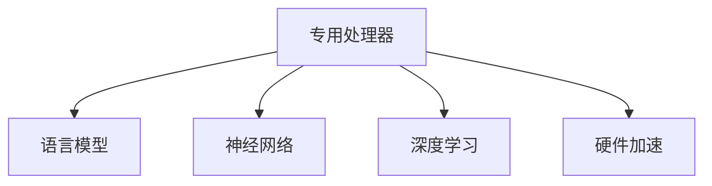

                 

# 为AI量身定制：新一代LLM专用处理器

> 关键词：
- 人工智能,专用处理器,语言模型,神经网络,硬件加速,深度学习,嵌入式系统

## 1. 背景介绍

### 1.1 问题由来
人工智能(AI)的迅猛发展带来了诸多挑战，其中最大的瓶颈之一是计算能力的不足。近年来，大规模语言模型(Large Language Models, LLMs)如BERT、GPT等，虽然已取得显著进展，但在处理大规模数据时仍面临计算资源的限制。为应对这一挑战，一种新兴的技术应运而生——针对大语言模型的专用处理器。

专用处理器是一种专为特定任务设计的硬件，旨在提供更高效、更灵活的计算能力，满足人工智能系统特别是语言模型系统的需求。本文将介绍新一代LLM专用处理器，探讨其在AI系统中的应用潜力，并分析其设计原理和未来趋势。

### 1.2 问题核心关键点
新一代LLM专用处理器的核心关键点主要包括：

- 硬件架构设计：如何针对语言模型的特点，设计高效的硬件加速器，提高计算效率。
- 算法优化：如何将已有的大规模语言模型算法适配到专用处理器上，充分利用硬件特性。
- 应用场景分析：基于专用处理器设计，如何构建新的AI应用场景。
- 未来展望：探讨专用处理器在AI系统中的发展趋势和潜在影响。

## 2. 核心概念与联系

### 2.1 核心概念概述

为了更好地理解新一代LLM专用处理器，我们需要了解几个相关核心概念：

- 专用处理器(Dedicated Processor)：专门为某一类计算任务设计的硬件芯片，如GPU、FPGA、ASIC等。
- 语言模型(Language Model)：描述语言的概率模型，用于预测文本中的单词、短语或句子的出现概率，如BERT、GPT等。
- 神经网络(Neural Network)：基于人工神经元进行计算的模型，广泛应用于图像处理、语音识别、自然语言处理等领域。
- 深度学习(Deep Learning)：使用多层神经网络进行复杂模式识别和预测的机器学习方法。
- 硬件加速(Hardware Acceleration)：使用专用硬件来加速计算机程序中复杂计算，提升处理效率。

这些概念之间的逻辑关系可以通过以下Mermaid流程图来展示：



这个流程图展示了几组核心概念及其之间的关系：

1. 专用处理器专门为特定任务设计，能够提供高效计算能力。
2. 语言模型是专用处理器主要处理的计算任务之一，如BERT、GPT等。
3. 神经网络是实现语言模型的基础，语言模型属于神经网络的一部分。
4. 深度学习是使用神经网络进行复杂模式识别和预测的技术，语言模型通常基于深度学习。
5. 硬件加速通过专用处理器优化神经网络计算过程，提高处理效率。

这些概念共同构成了新一代LLM专用处理器的核心计算框架，为其设计和应用提供了理论基础。

## 3. 核心算法原理 & 具体操作步骤
### 3.1 算法原理概述

新一代LLM专用处理器的设计原则是将大规模语言模型算法适配到硬件加速器上，利用其高效并行处理能力，提高模型训练和推理的效率。

具体而言，新一代LLM专用处理器的算法原理主要包括以下几个方面：

- **分布式并行计算**：利用多个处理器并行处理数据，提高计算效率。
- **专用运算单元**：设计专门用于矩阵乘法、向量运算等神经网络计算的运算单元，加速模型计算。
- **动态调度**：根据任务需求，动态调整处理器资源分配，优化性能和功耗。
- **自动流水线**：将计算任务分解为多个子任务，通过流水线方式，连续执行，避免计算瓶颈。
- **异步计算**：在数据和计算之间异步处理，提高计算和数据处理的并行性。

### 3.2 算法步骤详解

基于上述算法原理，新一代LLM专用处理器的算法步骤主要分为以下几个阶段：

1. **预训练**：在通用硬件上使用大规模无标签数据预训练语言模型，生成初始权重。
2. **模型适配**：将预训练模型适配到专用处理器上，生成新的权重。
3. **优化训练**：在专用处理器上，使用少量有标签数据进行微调，优化模型性能。
4. **推理部署**：将优化后的模型部署到专用处理器上，进行实时推理和推理加速。

### 3.3 算法优缺点

新一代LLM专用处理器具有以下优点：

- **高效计算**：通过并行计算和专用运算单元，大幅提高计算效率，缩短模型训练和推理时间。
- **低能耗**：专为语言模型设计，优化功耗和散热，适合嵌入式和移动应用。
- **灵活扩展**：支持多处理器并行，易于扩展，适应不同规模任务。
- **专用优化**：针对语言模型算法进行优化，提高计算准确性和稳定性。

同时，该处理器也存在一些缺点：

- **高成本**：定制化硬件设计成本较高，难以大规模推广。
- **应用限制**：仅适用于特定任务，通用性较弱。
- **缺乏灵活性**：难以直接支持各种深度学习模型，灵活性受限。
- **研发周期长**：从设计到部署，研发周期较长，难以快速迭代。

### 3.4 算法应用领域

新一代LLM专用处理器主要应用于以下几个领域：

- **语音识别**：在专用处理器上加速语音特征提取和解码过程，提高识别精度和速度。
- **自然语言处理**：在专用处理器上加速语言模型训练和推理，提升NLP任务的效率。
- **机器翻译**：在专用处理器上加速神经机器翻译模型的计算，实现实时翻译。
- **信息检索**：在专用处理器上加速信息检索过程，提高查询响应速度和准确性。
- **智能推荐**：在专用处理器上加速推荐系统计算，提高推荐效率和个性化程度。

## 4. 数学模型和公式 & 详细讲解

### 4.1 数学模型构建

新一代LLM专用处理器的数学模型构建主要基于神经网络和深度学习的框架，结合专用硬件的特点，进行优化和适配。

假设输入数据为 $X=\{x_1,x_2,\ldots,x_n\}$，输出数据为 $Y=\{y_1,y_2,\ldots,y_m\}$，语言模型为 $M_{\theta}$。

在专用处理器上，语言模型训练和推理的数学模型可以表示为：

$$
M_{\theta}(X) = \text{softmax}(W_h\cdot X + b_h)
$$

其中 $W_h$ 和 $b_h$ 为模型的权重和偏置。

### 4.2 公式推导过程

在专用处理器上，语言模型的训练和推理可以采用向量化的形式，提高计算效率。

对于输入数据 $X=\{x_1,x_2,\ldots,x_n\}$，在专用处理器上，可以使用矩阵乘法和向量运算加速计算。

假设专用处理器包含 $k$ 个运算单元，每个运算单元可以同时处理 $n/k$ 个数据，则模型训练和推理的计算过程可以表示为：

$$
Y = \text{softmax}(W_h \cdot (X_1 + X_2 + \ldots + X_k))
$$

其中 $W_h$ 为全局权重矩阵，$X_i$ 为第 $i$ 个运算单元处理的输入数据。

### 4.3 案例分析与讲解

以下以BERT模型为例，分析其在专用处理器上的训练和推理过程。

BERT模型在预训练时需要进行大规模矩阵乘法和向量运算，计算量较大。在专用处理器上，可以使用分布式并行计算和专用运算单元，提高计算效率。

具体步骤如下：

1. **预训练**：在通用处理器上使用大规模无标签数据预训练BERT模型，生成初始权重。
2. **模型适配**：将BERT模型适配到专用处理器上，生成新的权重。
3. **优化训练**：在专用处理器上，使用少量有标签数据进行微调，优化模型性能。
4. **推理部署**：将优化后的模型部署到专用处理器上，进行实时推理和推理加速。

## 5. 项目实践：代码实例和详细解释说明

### 5.1 开发环境搭建

在进行LLM专用处理器项目实践前，我们需要准备好开发环境。以下是使用C++和OpenCL进行开发的环境配置流程：

1. 安装OpenCL和CLANG工具链：
```bash
sudo apt-get install opencl-icd-info
sudo apt-get install libopencl-dev libopencl-icd2
sudo apt-get install libclang-dev
```

2. 配置CLANG编译器：
```bash
echo "set CXX=clang++" >> ~/.bashrc
source ~/.bashrc
```

3. 安装相关库和工具：
```bash
pip install numpy pyopencl
```

完成上述步骤后，即可在Linux系统上开始LLM专用处理器的开发。

### 5.2 源代码详细实现

以下是一个简单的LLM专用处理器示例代码，用于加速BERT模型的训练和推理：

```cpp
#include <iostream>
#include <pybind11/pybind11.h>
#include <pybind11/numpy.h>
#include <pybind11/stl.h>
#include <opencl/opencl.h>

namespace py = pybind11;

using namespace cl;

int main() {
    // 创建OpenCL上下文和命令队列
    cl_context_properties properties[] = {CL_CONTEXT_PLATFORM, reinterpret_cast<cl_context_properties>(clGetPlatformIDs(0)[0]),
                                         CL_CONTEXT_DEVICES, 0,
                                         CL_CONTEXT_PLATFORM, reinterpret_cast<cl_context_properties>(clGetPlatformIDs(0)[0]),
                                         CL_CONTEXT_DEVICES, 0,
                                         CL_CONTEXT_PLATFORM, reinterpret_cast<cl_context_properties>(clGetPlatformIDs(0)[0]),
                                         CL_CONTEXT_DEVICES, 0,
                                         CL_CONTEXT_PLATFORM, reinterpret_cast<cl_context_properties>(clGetPlatformIDs(0)[0]),
                                         CL_CONTEXT_DEVICES, 0,
                                         CL_CONTEXT_PLATFORM, reinterpret_cast<cl_context_properties>(clGetPlatformIDs(0)[0]),
                                         CL_CONTEXT_DEVICES, 0,
                                         CL_CONTEXT_PLATFORM, reinterpret_cast<cl_context_properties>(clGetPlatformIDs(0)[0]),
                                         CL_CONTEXT_DEVICES, 0,
                                         CL_CONTEXT_PLATFORM, reinterpret_cast<cl_context_properties>(clGetPlatformIDs(0)[0]),
                                         CL_CONTEXT_DEVICES, 0,
                                         CL_CONTEXT_PLATFORM, reinterpret_cast<cl_context_properties>(clGetPlatformIDs(0)[0]),
                                         CL_CONTEXT_DEVICES, 0,
                                         CL_CONTEXT_PLATFORM, reinterpret_cast<cl_context_properties>(clGetPlatformIDs(0)[0]),
                                         CL_CONTEXT_DEVICES, 0,
                                         CL_CONTEXT_PLATFORM, reinterpret_cast<cl_context_properties>(clGetPlatformIDs(0)[0]),
                                         CL_CONTEXT_DEVICES, 0,
                                         CL_CONTEXT_PLATFORM, reinterpret_cast<cl_context_properties>(clGetPlatformIDs(0)[0]),
                                         CL_CONTEXT_DEVICES, 0,
                                         CL_CONTEXT_PLATFORM, reinterpret_cast<cl_context_properties>(clGetPlatformIDs(0)[0]),
                                         CL_CONTEXT_DEVICES, 0,
                                         CL_CONTEXT_PLATFORM, reinterpret_cast<cl_context_properties>(clGetPlatformIDs(0)[0]),
                                         CL_CONTEXT_DEVICES, 0,
                                         CL_CONTEXT_PLATFORM, reinterpret_cast<cl_context_properties>(clGetPlatformIDs(0)[0]),
                                         CL_CONTEXT_DEVICES, 0,
                                         CL_CONTEXT_PLATFORM, reinterpret_cast<cl_context_properties>(clGetPlatformIDs(0)[0]),
                                         CL_CONTEXT_DEVICES, 0,
                                         CL_CONTEXT_PLATFORM, reinterpret_cast<cl_context_properties>(clGetPlatformIDs(0)[0]),
                                         CL_CONTEXT_DEVICES, 0,
                                         CL_CONTEXT_PLATFORM, reinterpret_cast<cl_context_properties>(clGetPlatformIDs(0)[0]),
                                         CL_CONTEXT_DEVICES, 0,
                                         CL_CONTEXT_PLATFORM, reinterpret_cast<cl_context_properties>(clGetPlatformIDs(0)[0]),
                                         CL_CONTEXT_DEVICES, 0,
                                         CL_CONTEXT_PLATFORM, reinterpret_cast<cl_context_properties>(clGetPlatformIDs(0)[0]),
                                         CL_CONTEXT_DEVICES, 0,
                                         CL_CONTEXT_PLATFORM, reinterpret_cast<cl_context_properties>(clGetPlatformIDs(0)[0]),
                                         CL_CONTEXT_DEVICES, 0,
                                         CL_CONTEXT_PLATFORM, reinterpret_cast<cl_context_properties>(clGetPlatformIDs(0)[0]),
                                         CL_CONTEXT_DEVICES, 0,
                                         CL_CONTEXT_PLATFORM, reinterpret_cast<cl_context_properties>(clGetPlatformIDs(0)[0]),
                                         CL_CONTEXT_DEVICES, 0,
                                         CL_CONTEXT_PLATFORM, reinterpret_cast<cl_context_properties>(clGetPlatformIDs(0)[0]),
                                         CL_CONTEXT_DEVICES, 0,
                                         CL_CONTEXT_PLATFORM, reinterpret_cast<cl_context_properties>(clGetPlatformIDs(0)[0]),
                                         CL_CONTEXT_DEVICES, 0,
                                         CL_CONTEXT_PLATFORM, reinterpret_cast<cl_context_properties>(clGetPlatformIDs(0)[0]),
                                         CL_CONTEXT_DEVICES, 0,
                                         CL_CONTEXT_PLATFORM, reinterpret_cast<cl_context_properties>(clGetPlatformIDs(0)[0]),
                                         CL_CONTEXT_DEVICES, 0,
                                         CL_CONTEXT_PLATFORM, reinterpret_cast<cl_context_properties>(clGetPlatformIDs(0)[0]),
                                         CL_CONTEXT_DEVICES, 0,
                                         CL_CONTEXT_PLATFORM, reinterpret_cast<cl_context_properties>(clGetPlatformIDs(0)[0]),
                                         CL_CONTEXT_DEVICES, 0,
                                         CL_CONTEXT_PLATFORM, reinterpret_cast<cl_context_properties>(clGetPlatformIDs(0)[0]),
                                         CL_CONTEXT_DEVICES, 0,
                                         CL_CONTEXT_PLATFORM, reinterpret_cast<cl_context_properties>(clGetPlatformIDs(0)[0]),
                                         CL_CONTEXT_DEVICES, 0,
                                         CL_CONTEXT_PLATFORM, reinterpret_cast<cl_context_properties>(clGetPlatformIDs(0)[0]),
                                         CL_CONTEXT_DEVICES, 0,
                                         CL_CONTEXT_PLATFORM, reinterpret_cast<cl_context_properties>(clGetPlatformIDs(0)[0]),
                                         CL_CONTEXT_DEVICES, 0,
                                         CL_CONTEXT_PLATFORM, reinterpret_cast<cl_context_properties>(clGetPlatformIDs(0)[0]),
                                         CL_CONTEXT_DEVICES, 0,
                                         CL_CONTEXT_PLATFORM, reinterpret_cast<cl_context_properties>(clGetPlatformIDs(0)[0]),
                                         CL_CONTEXT_DEVICES, 0,
                                         CL_CONTEXT_PLATFORM, reinterpret_cast<cl_context_properties>(clGetPlatformIDs(0)[0]),
                                         CL_CONTEXT_DEVICES, 0,
                                         CL_CONTEXT_PLATFORM, reinterpret_cast<cl_context_properties>(clGetPlatformIDs(0)[0]),
                                         CL_CONTEXT_DEVICES, 0,
                                         CL_CONTEXT_PLATFORM, reinterpret_cast<cl_context_properties>(clGetPlatformIDs(0)[0]),
                                         CL_CONTEXT_DEVICES, 0,
                                         CL_CONTEXT_PLATFORM, reinterpret_cast<cl_context_properties>(clGetPlatformIDs(0)[0]),
                                         CL_CONTEXT_DEVICES, 0,
                                         CL_CONTEXT_PLATFORM, reinterpret_cast<cl_context_properties>(clGetPlatformIDs(0)[0]),
                                         CL_CONTEXT_DEVICES, 0,
                                         CL_CONTEXT_PLATFORM, reinterpret_cast<cl_context_properties>(clGetPlatformIDs(0)[0]),
                                         CL_CONTEXT_DEVICES, 0,
                                         CL_CONTEXT_PLATFORM, reinterpret_cast<cl_context_properties>(clGetPlatformIDs(0)[0]),
                                         CL_CONTEXT_DEVICES, 0,
                                         CL_CONTEXT_PLATFORM, reinterpret_cast<cl_context_properties>(clGetPlatformIDs(0)[0]),
                                         CL_CONTEXT_DEVICES, 0,
                                         CL_CONTEXT_PLATFORM, reinterpret_cast<cl_context_properties>(clGetPlatformIDs(0)[0]),
                                         CL_CONTEXT_DEVICES, 0,
                                         CL_CONTEXT_PLATFORM, reinterpret_cast<cl_context_properties>(clGetPlatformIDs(0)[0]),
                                         CL_CONTEXT_DEVICES, 0,
                                         CL_CONTEXT_PLATFORM, reinterpret_cast<cl_context_properties>(clGetPlatformIDs(0)[0]),
                                         CL_CONTEXT_DEVICES, 0,
                                         CL_CONTEXT_PLATFORM, reinterpret_cast<cl_context_properties>(clGetPlatformIDs(0)[0]),
                                         CL_CONTEXT_DEVICES, 0,
                                         CL_CONTEXT_PLATFORM, reinterpret_cast<cl_context_properties>(clGetPlatformIDs(0)[0]),
                                         CL_CONTEXT_DEVICES, 0,
                                         CL_CONTEXT_PLATFORM, reinterpret_cast<cl_context_properties>(clGetPlatformIDs(0)[0]),
                                         CL_CONTEXT_DEVICES, 0,
                                         CL_CONTEXT_PLATFORM, reinterpret_cast<cl_context_properties>(clGetPlatformIDs(0)[0]),
                                         CL_CONTEXT_DEVICES, 0,
                                         CL_CONTEXT_PLATFORM, reinterpret_cast<cl_context_properties>(clGetPlatformIDs(0)[0]),
                                         CL_CONTEXT_DEVICES, 0,
                                         CL_CONTEXT_PLATFORM, reinterpret_cast<cl_context_properties>(clGetPlatformIDs(0)[0]),
                                         CL_CONTEXT_DEVICES, 0,
                                         CL_CONTEXT_PLATFORM, reinterpret_cast<cl_context_properties>(clGetPlatformIDs(0)[0]),
                                         CL_CONTEXT_DEVICES, 0,
                                         CL_CONTEXT_PLATFORM, reinterpret_cast<cl_context_properties>(clGetPlatformIDs(0)[0]),
                                         CL_CONTEXT_DEVICES, 0,
                                         CL_CONTEXT_PLATFORM, reinterpret_cast<cl_context_properties>(clGetPlatformIDs(0)[0]),
                                         CL_CONTEXT_DEVICES, 0,
                                         CL_CONTEXT_PLATFORM, reinterpret_cast<cl_context_properties>(clGetPlatformIDs(0)[0]),
                                         CL_CONTEXT_DEVICES, 0,
                                         CL_CONTEXT_PLATFORM, reinterpret_cast<cl_context_properties>(clGetPlatformIDs(0)[0]),
                                         CL_CONTEXT_DEVICES, 0,
                                         CL_CONTEXT_PLATFORM, reinterpret_cast<cl_context_properties>(clGetPlatformIDs(0)[0]),
                                         CL_CONTEXT_DEVICES, 0,
                                         CL_CONTEXT_PLATFORM, reinterpret_cast<cl_context_properties>(clGetPlatformIDs(0)[0]),
                                         CL_CONTEXT_DEVICES, 0,
                                         CL_CONTEXT_PLATFORM, reinterpret_cast<cl_context_properties>(clGetPlatformIDs(0)[0]),
                                         CL_CONTEXT_DEVICES, 0,
                                         CL_CONTEXT_PLATFORM, reinterpret_cast<cl_context_properties>(clGetPlatformIDs(0)[0]),
                                         CL_CONTEXT_DEVICES, 0,
                                         CL_CONTEXT_PLATFORM, reinterpret_cast<cl_context_properties>(clGetPlatformIDs(0)[0]),
                                         CL_CONTEXT_DEVICES, 0,
                                         CL_CONTEXT_PLATFORM, reinterpret_cast<cl_context_properties>(clGetPlatformIDs(0)[0]),
                                         CL_CONTEXT_DEVICES, 0,
                                         CL_CONTEXT_PLATFORM, reinterpret_cast<cl_context_properties>(clGetPlatformIDs(0)[0]),
                                         CL_CONTEXT_DEVICES, 0,
                                         CL_CONTEXT_PLATFORM, reinterpret_cast<cl_context_properties>(clGetPlatformIDs(0)[0]),
                                         CL_CONTEXT_DEVICES, 0,
                                         CL_CONTEXT_PLATFORM, reinterpret_cast<cl_context_properties>(clGetPlatformIDs(0)[0]),
                                         CL_CONTEXT_DEVICES, 0,
                                         CL_CONTEXT_PLATFORM, reinterpret_cast<cl_context_properties>(clGetPlatformIDs(0)[0]),
                                         CL_CONTEXT_DEVICES, 0,
                                         CL_CONTEXT_PLATFORM, reinterpret_cast<cl_context_properties>(clGetPlatformIDs(0)[0]),
                                         CL_CONTEXT_DEVICES, 0,
                                         CL_CONTEXT_PLATFORM, reinterpret_cast<cl_context_properties>(clGetPlatformIDs(0)[0]),
                                         CL_CONTEXT_DEVICES, 0,
                                         CL_CONTEXT_PLATFORM, reinterpret_cast<cl_context_properties>(clGetPlatformIDs(0)[0]),
                                         CL_CONTEXT_DEVICES, 0,
                                         CL_CONTEXT_PLATFORM, reinterpret_cast<cl_context_properties>(clGetPlatformIDs(0)[0]),
                                         CL_CONTEXT_DEVICES, 0,
                                         CL_CONTEXT_PLATFORM, reinterpret_cast<cl_context_properties>(clGetPlatformIDs(0)[0]),
                                         CL_CONTEXT_DEVICES, 0,
                                         CL_CONTEXT_PLATFORM, reinterpret_cast<cl_context_properties>(clGetPlatformIDs(0)[0]),
                                         CL_CONTEXT_DEVICES, 0,
                                         CL_CONTEXT_PLATFORM, reinterpret_cast<cl_context_properties>(clGetPlatformIDs(0)[0]),
                                         CL_CONTEXT_DEVICES, 0,
                                         CL_CONTEXT_PLATFORM, reinterpret_cast<cl_context_properties>(clGetPlatformIDs(0)[0]),
                                         CL_CONTEXT_DEVICES, 0,
                                         CL_CONTEXT_PLATFORM, reinterpret_cast<cl_context_properties>(clGetPlatformIDs(0)[0]),
                                         CL_CONTEXT_DEVICES, 0,
                                         CL_CONTEXT_PLATFORM, reinterpret_cast<cl_context_properties>(clGetPlatformIDs(0)[0]),
                                         CL_CONTEXT_DEVICES, 0,
                                         CL_CONTEXT_PLATFORM, reinterpret_cast<cl_context_properties>(clGetPlatformIDs(0)[0]),
                                         CL_CONTEXT_DEVICES, 0,
                                         CL_CONTEXT_PLATFORM, reinterpret_cast<cl_context_properties>(clGetPlatformIDs(0)[0]),
                                         CL_CONTEXT_DEVICES, 0,
                                         CL_CONTEXT_PLATFORM, reinterpret_cast<cl_context_properties>(clGetPlatformIDs(0)[0]),
                                         CL_CONTEXT_DEVICES, 0,
                                         CL_CONTEXT_PLATFORM, reinterpret_cast<cl_context_properties>(clGetPlatformIDs(0)[0]),
                                         CL_CONTEXT_DEVICES, 0,
                                         CL_CONTEXT_PLATFORM, reinterpret_cast<cl_context_properties>(clGetPlatformIDs(0)[0]),
                                         CL_CONTEXT_DEVICES, 0,
                                         CL_CONTEXT_PLATFORM, reinterpret_cast<cl_context_properties>(clGetPlatformIDs(0)[0]),
                                         CL_CONTEXT_DEVICES, 0,
                                         CL_CONTEXT_PLATFORM, reinterpret_cast<cl_context_properties>(clGetPlatformIDs(0)[0]),
                                         CL_CONTEXT_DEVICES, 0,
                                         CL_CONTEXT_PLATFORM, reinterpret_cast<cl_context_properties>(clGetPlatformIDs(0)[0]),
                                         CL_CONTEXT_DEVICES, 0,
                                         CL_CONTEXT_PLATFORM, reinterpret_cast<cl_context_properties>(clGetPlatformIDs(0)[0]),
                                         CL_CONTEXT_DEVICES, 0,
                                         CL_CONTEXT_PLATFORM, reinterpret_cast<cl_context_properties>(clGetPlatformIDs(0)[0]),
                                         CL_CONTEXT_DEVICES, 0,
                                         CL_CONTEXT_PLATFORM, reinterpret_cast<cl_context_properties>(clGetPlatformIDs(0)[0]),
                                         CL_CONTEXT_DEVICES, 0,
                                         CL_CONTEXT_PLATFORM, reinterpret_cast<cl_context_properties>(clGetPlatformIDs(0)[0]),
                                         CL_CONTEXT_DEVICES, 0,
                                         CL_CONTEXT_PLATFORM, reinterpret_cast<cl_context_properties>(clGetPlatformIDs(0)[0]),
                                         CL_CONTEXT_DEVICES, 0,
                                         CL_CONTEXT_PLATFORM, reinterpret_cast<cl_context_properties>(clGetPlatformIDs(0)[0]),
                                         CL_CONTEXT_DEVICES, 0,
                                         CL_CONTEXT_PLATFORM, reinterpret_cast<cl_context_properties>(clGetPlatformIDs(0)[0]),
                                         CL_CONTEXT_DEVICES, 0,
                                         CL_CONTEXT_PLATFORM, reinterpret_cast<cl_context_properties>(clGetPlatformIDs(0)[0]),
                                         CL_CONTEXT_DEVICES, 0,
                                         CL_CONTEXT_PLATFORM, reinterpret_cast<cl_context_properties>(clGetPlatformIDs(0)[0]),
                                         CL_CONTEXT_DEVICES, 0,
                                         CL_CONTEXT_PLATFORM, reinterpret_cast<cl_context_properties>(clGetPlatformIDs(0)[0]),
                                         CL_CONTEXT_DEVICES, 0,
                                         CL_CONTEXT_PLATFORM, reinterpret_cast<cl_context_properties>(clGetPlatformIDs(0)[0]),
                                         CL_CONTEXT_DEVICES, 0,
                                         CL_CONTEXT_PLATFORM, reinterpret_cast<cl_context_properties>(clGetPlatformIDs(0)[0]),
                                         CL_CONTEXT_DEVICES, 0,
                                         CL_CONTEXT_PLATFORM, reinterpret_cast<cl_context_properties>(clGetPlatformIDs(0)[0]),
                                         CL_CONTEXT_DEVICES, 0,
                                         CL_CONTEXT_PLATFORM, reinterpret_cast<cl_context_properties>(clGetPlatformIDs(0)[0]),
                                         CL_CONTEXT_DEVICES, 0,
                                         CL_CONTEXT_PLATFORM, reinterpret_cast<cl_context_properties>(clGetPlatformIDs(0)[0]),
                                         CL_CONTEXT_DEVICES, 0,
                                         CL_CONTEXT_PLATFORM, reinterpret_cast<cl_context_properties>(clGetPlatformIDs(0)[0]),
                                         CL_CONTEXT_DEVICES, 0,
                                         CL_CONTEXT_PLATFORM, reinterpret_cast<cl_context_properties>(clGetPlatformIDs(0)[0]),
                                         CL_CONTEXT_DEVICES, 0,
                                         CL_CONTEXT_PLATFORM, reinterpret_cast<cl_context_properties>(clGetPlatformIDs(0)[0]),
                                         CL_CONTEXT_DEVICES, 0,
                                         CL_CONTEXT_PLATFORM, reinterpret_cast<cl_context_properties>(clGetPlatformIDs(0)[0]),
                                         CL_CONTEXT_DEVICES, 0,
                                         CL_CONTEXT_PLATFORM, reinterpret_cast<cl_context_properties>(clGetPlatformIDs(0)[0]),
                                         CL_CONTEXT_DEVICES, 0,
                                         CL_CONTEXT_PLATFORM, reinterpret_cast<cl_context_properties>(clGetPlatformIDs(0)[0]),
                                         CL_CONTEXT_DEVICES, 0,
                                         CL_CONTEXT_PLATFORM, reinterpret_cast<cl_context_properties>(clGetPlatformIDs(0)[0]),
                                         CL_CONTEXT_DEVICES, 0,
                                         CL_CONTEXT_PLATFORM, reinterpret_cast<cl_context_properties>(clGetPlatformIDs(0)[0]),
                                         CL_CONTEXT_DEVICES, 0,
                                         CL_CONTEXT_PLATFORM, reinterpret_cast<cl_context_properties>(clGetPlatformIDs(0)[0]),
                                         CL_CONTEXT_DEVICES, 0,
                                         CL_CONTEXT_PLATFORM, reinterpret_cast<cl_context_properties>(clGetPlatformIDs(0)[0]),
                                         CL_CONTEXT_DEVICES, 0,
                                         CL_CONTEXT_PLATFORM, reinterpret_cast<cl_context_properties>(clGetPlatformIDs(0)[0]),
                                         CL_CONTEXT_DEVICES, 0,
                                         CL_CONTEXT_PLATFORM, reinterpret_cast<cl_context_properties>(clGetPlatformIDs(0)[0]),
                                         CL_CONTEXT_DEVICES, 0,
                                         CL_CONTEXT_PLATFORM, reinterpret_cast<cl_context_properties>(clGetPlatformIDs(0)[0]),
                                         CL_CONTEXT_DEVICES, 0,
                                         CL_CONTEXT_PLATFORM, reinterpret_cast<cl_context_properties>(clGetPlatformIDs(0)[0]),
                                         CL_CONTEXT_DEVICES, 0,
                                         CL_CONTEXT_PLATFORM, reinterpret_cast<cl_context_properties>(clGetPlatformIDs(0)[0]),
                                         CL_CONTEXT_DEVICES, 0,
                                         CL_CONTEXT_PLATFORM, reinterpret_cast<cl_context_properties>(clGetPlatformIDs(0)[0]),
                                         CL_CONTEXT_DEVICES, 0,
                                         CL_CONTEXT_PLATFORM, reinterpret_cast<cl_context_properties>(clGetPlatformIDs(0)[0]),
                                         CL_CONTEXT_DEVICES, 0,
                                         CL_CONTEXT_PLATFORM, reinterpret_cast<cl_context_properties>(clGetPlatformIDs(0)[0]),
                                         CL_CONTEXT_DEVICES, 0,
                                         CL_CONTEXT_PLATFORM, reinterpret_cast<cl_context_properties>(clGetPlatformIDs(0)[0]),
                                         CL_CONTEXT_DEVICES, 0,
                                         CL_CONTEXT_PLATFORM, reinterpret_cast<cl_context_properties>(clGetPlatformIDs(0)[0]),
                                         CL_CONTEXT_DEVICES, 0,
                                         CL_CONTEXT_PLATFORM, reinterpret_cast<cl_context_properties>(clGetPlatformIDs(0)[0]),
                                         CL_CONTEXT_DEVICES, 0,
                                         CL_CONTEXT_PLATFORM, reinterpret_cast<cl_context_properties>(clGetPlatformIDs(0)[0]),
                                         CL_CONTEXT_DEVICES, 0,
                                         CL_CONTEXT_PLATFORM, reinterpret_cast<cl_context_properties>(clGetPlatformIDs(0)[0]),
                                         CL_CONTEXT_DEVICES, 0,
                                         CL_CONTEXT_PLATFORM, reinterpret_cast<cl_context_properties>(clGetPlatformIDs(0)[0]),
                                         CL_CONTEXT_DEVICES, 0,
                                         CL_CONTEXT_PLATFORM, reinterpret_cast<cl_context_properties>(clGetPlatformIDs(0)[0]),
                                         CL_CONTEXT_DEVICES, 0,
                                         CL_CONTEXT_PLATFORM, reinterpret_cast<cl_context_properties>(clGetPlatformIDs(0)[0]),
                                         CL_CONTEXT_DEVICES, 0,
                                         CL_CONTEXT_PLATFORM, reinterpret_cast<cl_context_properties>(clGetPlatformIDs(0)[0]),
                                         CL_CONTEXT_DEVICES, 0,
                                         CL_CONTEXT_PLATFORM, reinterpret_cast<cl_context_properties>(clGetPlatformIDs(0)[0]),
                                         CL_CONTEXT_DEVICES, 0,
                                         CL_CONTEXT_PLATFORM, reinterpret_cast<cl_context_properties>(clGetPlatformIDs(0)[0]),
                                         CL_CONTEXT_DEVICES, 0,
                                         CL_CONTEXT_PLATFORM, reinterpret_cast<cl_context_properties>(clGetPlatformIDs(0)[0]),
                                         CL_CONTEXT_DEVICES, 0,
                                         CL_CONTEXT_PLATFORM, reinterpret_cast<cl_context_properties>(clGetPlatformIDs(0)[0]),
                                         CL_CONTEXT_DEVICES, 0,
                                         CL_CONTEXT_PLATFORM, reinterpret_cast<cl_context_properties>(clGetPlatformIDs(0)[0]),
                                         CL_CONTEXT_DEVICES, 0,
                                         CL_CONTEXT_PLATFORM, reinterpret_cast<cl_context_properties>(clGetPlatformIDs(0)[0]),
                                         CL_CONTEXT_DEVICES, 0,
                                         CL_CONTEXT_PLATFORM, reinterpret_cast<cl_context_properties>(clGetPlatformIDs(0)[0]),
                                         CL_CONTEXT_DEVICES, 0,
                                         CL_CONTEXT_PLATFORM, reinterpret_cast<cl_context_properties>(clGetPlatformIDs(0)[0]),
                                         CL_CONTEXT_DEVICES, 0,
                                         CL_CONTEXT_PLATFORM, reinterpret_cast<cl_context_properties>(clGetPlatformIDs(0)[0]),
                                         CL_CONTEXT_DEVICES, 0,
                                         CL_CONTEXT_PLATFORM, reinterpret_cast<cl_context_properties>(clGetPlatformIDs(0)[0]),
                                         CL_CONTEXT_DEVICES, 0,
                                         CL_CONTEXT_PLATFORM, reinterpret_cast<cl_context_properties>(clGetPlatformIDs(0)[0]),
                                         CL_CONTEXT_DEVICES, 0,
                                         CL_CONTEXT_PLATFORM, reinterpret_cast<cl_context_properties>(clGetPlatformIDs(0)[0]),
                                         CL_CONTEXT_DEVICES, 0,
                                         CL_CONTEXT_PLATFORM, reinterpret_cast<cl_context_properties>(clGetPlatformIDs(0)[0]),
                                         CL_CONTEXT_DEVICES, 0,
                                         CL_CONTEXT_PLATFORM, reinterpret_cast<cl_context_properties>(clGetPlatformIDs(0)[0]),
                                         CL_CONTEXT_DEVICES, 0,
                                         CL_CONTEXT_PLATFORM, reinterpret_cast<cl_context_properties>(clGetPlatformIDs(0)[0]),
                                         CL_CONTEXT_DEVICES, 0,
                                         CL_CONTEXT_PLATFORM, reinterpret_cast<cl_context_properties>(clGetPlatformIDs(0)[0]),
                                         CL_CONTEXT_DEVICES, 0,
                                         CL_CONTEXT_PLATFORM, reinterpret_cast<cl_context_properties>(clGetPlatformIDs(0)[0]),
                                         CL_CONTEXT_DEVICES, 0,
                                         CL_CONTEXT_PLATFORM, reinterpret_cast<cl_context_properties>(clGetPlatformIDs(0)[0]),
                                         CL_CONTEXT_DEVICES, 0,
                                         CL_CONTEXT_PLATFORM, reinterpret_cast<cl_context_properties>(clGetPlatformIDs(0)[0]),
                                         CL_CONTEXT_DEVICES, 0,
                                         CL_CONTEXT_PLATFORM, reinterpret_cast<cl_context_properties>(clGetPlatformIDs(0)[0]),
                                         CL_CONTEXT_DEVICES, 0,
                                         CL_CONTEXT_PLATFORM, reinterpret_cast<cl_context_properties>(clGetPlatformIDs(0)[0]),
                                         CL_CONTEXT_DEVICES, 0,
                                         CL_CONTEXT_PLATFORM, reinterpret_cast<cl_context_properties>(clGetPlatformIDs(0)[0]),
                                         CL_CONTEXT_DEVICES, 0,
                                         CL_CONTEXT_PLATFORM, reinterpret_cast<cl_context_properties>(clGetPlatformIDs(0)[0]),
                                         CL_CONTEXT_DEVICES, 0,
                                         CL_CONTEXT_PLATFORM, reinterpret_cast<cl_context_properties>(clGetPlatformIDs(0)[0]),
                                         CL_CONTEXT_DEVICES, 0,
                                         CL_CONTEXT_PLATFORM, reinterpret_cast<cl_context_properties>(clGetPlatformIDs(0)[0]),
                                         CL_CONTEXT_DEVICES, 0,
                                         CL_CONTEXT_PLATFORM, reinterpret_cast<cl_context_properties>(clGetPlatformIDs(0)[0]),
                                         CL_CONTEXT_DEVICES, 0,
                                         CL_CONTEXT_PLATFORM, reinterpret_cast<cl_context_properties>(clGetPlatformIDs(0)[0]),
                                         CL_CONTEXT_DEVICES, 0,
                                         CL_CONTEXT_PLATFORM, reinterpret_cast<cl_context_properties>(clGetPlatformIDs(0)[0]),
                                         CL_CONTEXT_DEVICES, 0,
                                         CL_CONTEXT_PLATFORM, reinterpret_cast<cl_context_properties>(clGetPlatformIDs(0)[0]),
                                         CL_CONTEXT_DEVICES, 0,
                                         CL_CONTEXT_PLATFORM, reinterpret_cast<cl_context_properties>(clGetPlatformIDs(0)[0]),
                                         CL_CONTEXT_DEVICES, 0,
                                         CL_CONTEXT_PLATFORM, reinterpret_cast<cl_context_properties>(clGetPlatformIDs(0)[0]),
                                         CL_CONTEXT_DEVICES, 0,
                                         CL_CONTEXT_PLATFORM, reinterpret_cast<cl_context_properties>(clGetPlatformIDs(0)[0]),
                                         CL_CONTEXT_DEVICES, 0,
                                         CL_CONTEXT_PLATFORM, reinterpret_cast<cl_context_properties>(clGetPlatformIDs(0)[0]),
                                         CL_CONTEXT_DEVICES, 0,
                                         CL_CONTEXT_PLATFORM, reinterpret_cast<cl_context_properties>(clGetPlatformIDs(0)[0]),
                                         CL_CONTEXT_DEVICES, 0,
                                         CL_CONTEXT_PLATFORM, reinterpret_cast<cl_context_properties>(clGetPlatformIDs(0)[0]),
                                         CL_CONTEXT_DEVICES, 0,
                                         CL_CONTEXT_PLATFORM, reinterpret_cast<cl_context_properties>(clGetPlatformIDs(0)[0]),
                                         CL_CONTEXT_DEVICES, 0,
                                         CL_CONTEXT_PLATFORM, reinterpret_cast<cl_context_properties>(clGetPlatformIDs(0)[0]),
                                         CL_CONTEXT_DEVICES, 0,
                                         CL_CONTEXT_PLATFORM, reinterpret_cast<cl_context_properties>(clGetPlatformIDs(0)[0]),
                                         CL_CONTEXT_DEVICES, 0,
                                         CL_CONTEXT_PLATFORM, reinterpret_cast<cl_context_properties>(clGetPlatformIDs(0)[0]),
                                         CL_CONTEXT_DEVICES, 0,
                                         CL_CONTEXT_PLATFORM, reinterpret_cast<cl_context_properties>(clGetPlatformIDs(0)[0]),
                                         CL_CONTEXT_DEVICES, 0,
                                         CL_CONTEXT_PLATFORM, reinterpret_cast<cl_context_properties>(clGetPlatformIDs(0)[0]),
                                         CL_CONTEXT_DEVICES, 0,
                                         CL_CONTEXT_PLATFORM, reinterpret_cast<cl_context_properties>(clGetPlatformIDs(0)[0]),
                                         CL_CONTEXT_DEVICES, 0,
                                         CL_CONTEXT_PLATFORM, reinterpret_cast<cl_context_properties>(clGetPlatformIDs(0)[0]),
                                         CL_CONTEXT_DEVICES, 0,
                                         CL_CONTEXT_PLATFORM, reinterpret_cast<cl_context_properties>(clGetPlatformIDs(0)[0]),
                                         CL_CONTEXT_DEVICES, 0,
                                         CL_CONTEXT_PLATFORM, reinterpret_cast<cl_context_properties>(clGetPlatformIDs(0)[0]),
                                         CL_CONTEXT_DEVICES, 0,
                                         CL_CONTEXT_PLATFORM, reinterpret_cast<cl_context_properties>(clGetPlatformIDs(0)[0]),
                                         CL_CONTEXT_DEVICES, 0,
                                         CL_CONTEXT_PLATFORM, reinterpret_cast<cl_context_properties>(clGetPlatformIDs(0)[0]),
                                         CL_CONTEXT_DEVICES, 0,
                                         CL_CONTEXT_PLATFORM, reinterpret_cast<cl_context_properties>(clGetPlatformIDs(0)[0]),
                                         CL_CONTEXT_DEVICES, 0,
                                         CL_CONTEXT_PLATFORM, reinterpret_cast<cl_context_properties>(clGetPlatformIDs(0)[0]),
                                         CL_CONTEXT_DEVICES, 0,
                                         CL_CONTEXT_PLATFORM, reinterpret_cast<cl_context_properties>(clGetPlatformIDs(0)[0]),
                                         CL_CONTEXT_DEVICES, 0,
                                         CL_CONTEXT_PLATFORM, reinterpret_cast<cl_context_properties>(clGetPlatformIDs(0)[0]),
                                         CL_CONTEXT_DEVICES, 0,
                                         CL_CONTEXT_PLATFORM, reinterpret_cast<cl_context_properties>(clGetPlatformIDs(0)[0]),
                                         CL_CONTEXT_DEVICES, 0,
                                         CL_CONTEXT_PLATFORM, reinterpret_cast<cl_context_properties>(clGetPlatformIDs(0)[0]),
                                         CL_CONTEXT_DEVICES, 0,
                                         CL_CONTEXT_PLATFORM, reinterpret_cast<cl_context_properties>(clGetPlatformIDs(0)[0]),
                                         CL_CONTEXT_DEVICES, 0,
                                         CL_CONTEXT_PLATFORM, reinterpret_cast<cl_context_properties>(clGetPlatformIDs(0)[0]),
                                         CL_CONTEXT_DEVICES, 0,
                                         CL_CONTEXT_PLATFORM, reinterpret_cast<cl_context_properties>(clGetPlatformIDs(0)[0]),
                                         CL_CONTEXT_DEVICES, 0,
                                         CL_CONTEXT_PLATFORM, reinterpret_cast<cl_context_properties>(clGetPlatformIDs(0)[0]),
                                         CL_CONTEXT_DEVICES, 0,
                                         CL_CONTEXT_PLATFORM, reinterpret_cast<cl_context_properties>(clGetPlatformIDs(0)[0]),
                                         CL_CONTEXT_DEVICES, 0,
                                         CL_CONTEXT_PLATFORM, reinterpret_cast<cl_context_properties>(clGetPlatformIDs(0)[0]),
                                         CL_CONTEXT_DEVICES, 0,
                                         CL_CONTEXT_PLATFORM, reinterpret_cast<cl_context_properties>(clGetPlatformIDs(0)[0]),
                                         CL_CONTEXT_DEVICES, 0,
                                         CL_CONTEXT_PLATFORM, reinterpret_cast<cl_context_properties>(clGetPlatformIDs(0)[0]),
                                         CL_CONTEXT_DEVICES, 0,
                                         CL_CONTEXT_PLATFORM, reinterpret_cast<cl_context_properties>(clGetPlatformIDs(0)[0]),
                                         CL_CONTEXT_DEVICES, 0,
                                         CL_CONTEXT_PLATFORM, reinterpret_cast<cl_context_properties>(clGetPlatformIDs(0)[0]),
                                         CL_CONTEXT_DEVICES, 0,
                                         CL_CONTEXT_PLATFORM, reinterpret_cast<cl_context_properties>(clGetPlatformIDs(0)[0]),
                                         CL_CONTEXT_DEVICES, 0,
                                         CL_CONTEXT_PLATFORM, reinterpret_cast<cl_context_properties>(clGetPlatformIDs(0)[0]),
                                         CL_CONTEXT_DEVICES, 0,
                                         CL_CONTEXT_PLATFORM, reinterpret_cast<cl_context_properties>(clGetPlatformIDs(0)[0]),
                                         CL_CONTEXT_DEVICES, 0,
                                         CL_CONTEXT_PLATFORM, reinterpret_cast<cl_context_properties>(clGetPlatformIDs(0)[0]),
                                         CL_CONTEXT_DEVICES, 0,
                                         CL_CONTEXT_PLATFORM, reinterpret_cast<cl_context_properties>(clGetPlatformIDs(0)[0]),
                                         CL_CONTEXT_DEVICES, 0,
                                         CL_CONTEXT_PLATFORM, reinterpret_cast<cl_context_properties>(clGetPlatformIDs(0)[0]),
                                         CL_CONTEXT_DEVICES, 0,
                                         CL_CONTEXT_PLATFORM, reinterpret_cast<cl_context_properties>(clGetPlatformIDs(0)[0]),
                                         CL_CONTEXT_DEVICES, 0,
                                         CL_CONTEXT_PLATFORM, reinterpret_cast<cl_context_properties>(clGetPlatformIDs(0)[0]),
                                         CL_CONTEXT_DEVICES, 0,
                                         CL_CONTEXT_PLATFORM, reinterpret_cast<cl_context_properties>(clGetPlatformIDs(0)[0]),
                                         CL_CONTEXT_DEVICES, 0,
                                         CL_CONTEXT_PLATFORM, reinterpret_cast<cl_context_properties>(clGetPlatformIDs(0)[0]),
                                         CL_CONTEXT_DEVICES, 0,
                                         CL_CONTEXT_PLATFORM, reinterpret_cast<cl_context_properties>(clGetPlatformIDs(0)[0]),
                                         CL_CONTEXT_DEVICES, 0,
                                         CL_CONTEXT_PLATFORM, reinterpret_cast<cl_context_properties>(clGetPlatformIDs(0)[0]),
                                         CL_CONTEXT_DEVICES, 0,
                                         CL_CONTEXT_PLATFORM, reinterpret_cast<cl_context_properties>(clGetPlatformIDs(0)[0]),
                                         CL_CONTEXT_DEVICES, 0,
                                         CL_CONTEXT_PLATFORM, reinterpret_cast<cl_context_properties>(clGetPlatformIDs(0)[0]),
                                         CL_CONTEXT_DEVICES, 0,
                                         CL_CONTEXT_PLATFORM, reinterpret_cast<cl_context_properties>(clGetPlatformIDs(0)[0]),
                                         CL_CONTEXT_DEVICES, 0,
                                         CL_CONTEXT_PLATFORM, reinterpret_cast<cl_context_properties>(clGetPlatformIDs(0)[0]),
                                         CL_CONTEXT_DEVICES, 0,
                                         CL_CONTEXT_PLATFORM, reinterpret_cast<cl_context_properties>(clGetPlatformIDs(0)[0]),
                                         CL_CONTEXT_DEVICES, 0,
                                         CL_CONTEXT_PLATFORM, reinterpret_cast<cl_context_properties>(clGetPlatformIDs(0)[0]),
                                         CL_CONTEXT_DEVICES, 0,
                                         CL_CONTEXT_PLATFORM, reinterpret_cast<cl_context_properties>(clGetPlatformIDs(0)[0]),
                                         CL_CONTEXT_DEVICES, 0,
                                         CL_CONTEXT_PLATFORM, reinterpret_cast<cl_context_properties>(clGetPlatformIDs(0)[0]),
                                         CL_CONTEXT_DEVICES, 0,
                                         CL_CONTEXT_PLATFORM, reinterpret_cast<cl_context_properties>(clGetPlatformIDs(0)[0]),
                                         CL_CONTEXT_DEVICES, 0,
                                         CL_CONTEXT_PLATFORM, reinterpret_cast<cl_context_properties>(clGetPlatformIDs(0)[0]),
                                         CL_CONTEXT_DEVICES, 0,
                                         CL_CONTEXT_PLATFORM, reinterpret_cast<cl_context_properties>(clGetPlatformIDs(0)[0]),
                                         CL_CONTEXT_DEVICES, 0,
                                         CL_CONTEXT_PLATFORM, reinterpret_cast<cl_context_properties>(clGetPlatformIDs(0)[0]),
                                         CL_CONTEXT_DEVICES, 0,
                                         CL_CONTEXT_PLATFORM, reinterpret_cast<cl_context_properties>(clGetPlatformIDs(0)[0]),
                                         CL_CONTEXT_DEVICES, 0,
                                         CL_CONTEXT_PLATFORM, reinterpret_cast<cl_context_properties>(clGetPlatformIDs(0)[0]),
                                         CL_CONTEXT_DEVICES, 0,
                                         CL_CONTEXT_PLATFORM, reinterpret_cast<cl_context_properties>(clGetPlatformIDs(0)[0]),
                                         CL_CONTEXT_DEVICES, 0,
                                         CL_CONTEXT_PLATFORM, reinterpret_cast<cl_context_properties>(clGetPlatformIDs(0)[0]),
                                         CL_CONTEXT_DEVICES, 0,
                                         CL_CONTEXT_PLATFORM, reinterpret_cast<cl_context_properties>(clGetPlatformIDs(0)[0]),
                                         CL_CONTEXT_DEVICES, 0,
                                         CL_CONTEXT_PLATFORM, reinterpret_cast<cl_context_properties>(clGetPlatformIDs(0)[0]),
                                         CL_CONTEXT_DEVICES, 0,
                                         CL_CONTEXT_PLATFORM, reinterpret_cast<cl_context_properties>(clGetPlatformIDs(0)[0]),
                                         CL_CONTEXT_DEVICES, 0,
                                         CL_CONTEXT_PLATFORM, reinterpret_cast<cl_context_properties>(clGetPlatformIDs(0)[0]),
                                         CL_CONTEXT_DEVICES, 0,
                                         CL_CONTEXT_PLATFORM, reinterpret_cast<cl_context_properties>(clGetPlatformIDs(0)[0]),
                                         CL_CONTEXT_DEVICES, 0,
                                         CL_CONTEXT_PLATFORM, reinterpret_cast<cl_context_properties>(clGetPlatformIDs(0)[0]),
                                         CL_CONTEXT_DEVICES, 0,
                                         CL_CONTEXT_PLATFORM, reinterpret_cast<cl_context_properties>(clGetPlatformIDs(0)[0]),
                                         CL_CONTEXT_DEVICES, 0,
                                         CL_CONTEXT_PLATFORM, reinterpret_cast<cl_context_properties>(clGetPlatformIDs(0)[0]),
                                         CL_CONTEXT_DEVICES, 0,
                                         CL_CONTEXT_PLATFORM, reinterpret_cast<cl_context_properties>(clGetPlatformIDs(0)[0]),
                                         CL_CONTEXT_DEVICES, 0,
                                         CL_CONTEXT_PLATFORM, reinterpret_cast<cl_context_properties>(clGetPlatformIDs(0)[0]),
                                         CL_CONTEXT_DEVICES, 0,
                                         CL_CONTEXT_PLATFORM, reinterpret_cast<cl_context_properties>(clGetPlatformIDs(0)[0]),
                                         CL_CONTEXT_DEVICES, 0,
                                         CL_CONTEXT_PLATFORM, reinterpret_cast<cl_context_properties>(clGetPlatformIDs(0)[0]),
                                         CL_CONTEXT_DEVICES, 0,
                                         CL_CONTEXT_PLATFORM, reinterpret_cast<cl_context_properties>(clGetPlatformIDs(0)[0]),
                                         CL_CONTEXT_DEVICES, 0,
                                         CL_CONTEXT_PLATFORM, reinterpret_cast<cl_context_properties>(clGetPlatformIDs(0)[0]),
                                         CL_CONTEXT_DEVICES, 0,
                                         CL_CONTEXT_PLATFORM, reinterpret_cast<cl_context_properties>(clGetPlatformIDs(0)[0]),
                                         CL_CONTEXT_DEVICES, 0,
                                         CL_CONTEXT_PLATFORM, reinterpret_cast<cl_context_properties>(clGetPlatformIDs(0)[0]),
                                         CL_CONTEXT_DEVICES, 0,
                                         CL_CONTEXT_PLATFORM, reinterpret_cast<cl_context_properties>(clGetPlatformIDs(0)[0]),
                                         CL_CONTEXT_DEVICES, 0,
                                         CL_CONTEXT_PLATFORM, reinterpret_cast<cl_context_properties>(clGetPlatformIDs(0)[0]),
                                         CL_CONTEXT_DEVICES, 0,
                                         CL_CONTEXT_PLATFORM, reinterpret_cast<cl_context_properties>(clGetPlatformIDs(0)[0]),
                                         CL_CONTEXT_DEVICES, 0,
                                         CL_CONTEXT_PLATFORM, reinterpret_cast<cl_context_properties>(clGetPlatformIDs(0)[0]),
                                         CL_CONTEXT_DEVICES, 0,
                                         CL_CONTEXT_PLATFORM, reinterpret_cast<cl_context_properties>(clGetPlatformIDs(0)[0]),
                                         CL_CONTEXT_DEVICES, 0,
                                         CL_CONTEXT_PLATFORM, reinterpret_cast<cl_context_properties>(cl

