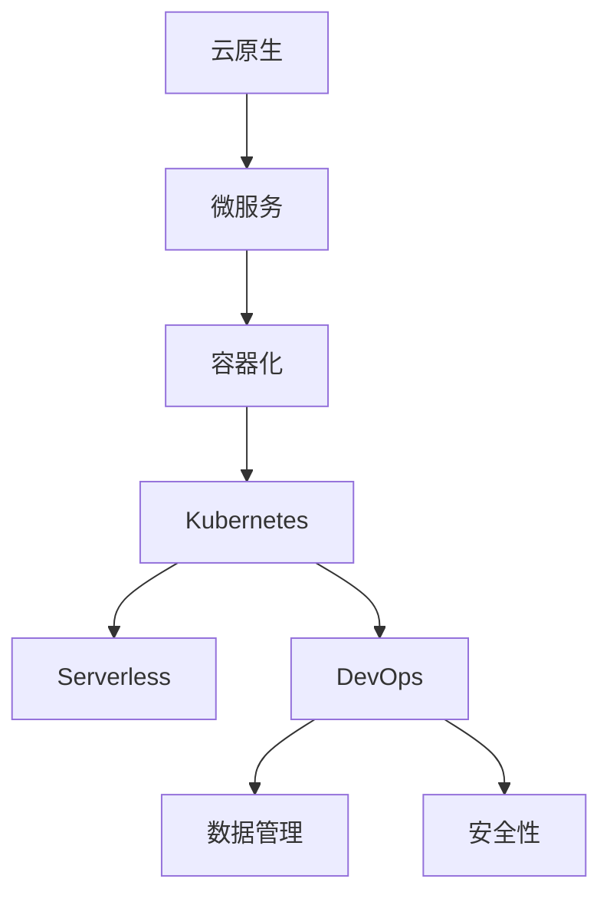

                 

# 云原生架构设计：构建可扩展的云端应用

> 关键词：云原生, 架构设计, 微服务, 容器化, Kubernetes, Serverless, 弹性伸缩, DevOps, 数据库分片, 分布式缓存

## 1. 背景介绍

### 1.1 问题由来

随着云计算和互联网技术的迅猛发展，越来越多的企业开始将业务迁移到云端，以期获得更高效、更灵活的运营模式。然而，云计算架构并不是万能的，其在设计和管理上依然面临诸多挑战。

1. **扩展性问题**：当业务量激增时，如何保证应用能够无缝扩展，不产生性能瓶颈？
2. **可靠性和可用性**：如何设计高可用、高弹性的架构，确保业务不中断？
3. **运维复杂度**：如何简化运维流程，降低维护成本？
4. **安全和合规**：如何在云环境下保障数据安全，满足法律法规要求？

这些问题催生了云原生（Cloud-Native）架构设计的提出，旨在通过一系列最佳实践，构建高效、灵活、安全的云环境，使企业能够更轻松地部署、运维和管理云应用。

### 1.2 问题核心关键点

云原生架构的核心包括以下几个关键点：

- **微服务**：将应用拆分为多个小而自治的服务，实现独立部署、独立扩展。
- **容器化**：使用容器技术（如Docker）来封装和运行应用，实现快速部署和高效资源利用。
- **Kubernetes**：基于容器编排的平台，实现自动化的服务部署、扩展和监控。
- **Serverless**：使用无服务器架构，按需使用计算资源，降低运维成本。
- **DevOps**：持续集成（CI）和持续部署（CD），实现快速迭代和持续改进。
- **数据管理**：采用数据库分片和分布式缓存，实现高并发和高可用。
- **安全性**：使用多层次的安全机制，保护应用和数据安全。

这些关键点共同构成了云原生架构的设计基础，使其能够在复杂的云环境中提供稳定、高效的服务。

## 2. 核心概念与联系

### 2.1 核心概念概述

为更好地理解云原生架构的设计理念和实施细节，本节将介绍几个密切相关的核心概念：

- **云原生**（Cloud-Native）：一种设计思维，旨在使应用能够自然地运行在云环境中，充分利用云环境的优势，如弹性、自愈和自动化。
- **微服务**（Microservices）：将应用拆分为多个独立部署、独立扩展的服务单元。微服务提升了系统的可扩展性和可靠性，但也增加了系统的复杂性。
- **容器化**（Containerization）：使用容器技术封装应用，实现应用的可移植性和一致性。容器化简化了应用部署和运维流程。
- **Kubernetes**（K8s）：开源的容器编排平台，提供自动化运维和扩展能力，是云原生架构的核心组件。
- **Serverless**：按需使用计算资源，无需管理服务器，简化运维流程，降低成本。Serverless架构适用于需要快速响应的应用场景。
- **DevOps**：持续集成（CI）和持续部署（CD），实现快速迭代和持续改进，提升团队协作效率。
- **数据管理**：采用数据库分片和分布式缓存，实现高并发和高可用，确保数据的可靠性和一致性。
- **安全性**：多层次的安全机制，包括身份验证、授权、加密、审计等，保护应用和数据安全。

这些核心概念之间的逻辑关系可以通过以下Mermaid流程图来展示：



这个流程图展示了几大核心概念及其之间的关系：

1. 云原生是云环境下的设计理念，通过微服务、容器化、Kubernetes等技术实现。
2. 微服务将应用拆分为多个小服务，容器化简化了部署和运维，Kubernetes提供了自动化的运维能力。
3. Serverless按需使用计算资源，DevOps提升团队协作效率。
4. 数据管理和安全性是应用的基础设施保障，保障应用的稳定性和安全性。

这些概念共同构成了云原生架构的设计基础，使其能够在复杂的云环境中提供稳定、高效的服务。

## 3. 核心算法原理 & 具体操作步骤
### 3.1 算法原理概述

云原生架构设计的主要目标是通过一系列最佳实践，构建高效、灵活、安全的云环境。其核心算法原理包括以下几个方面：

- **微服务架构**：通过将应用拆分为多个小服务，实现独立部署、独立扩展，提升系统的灵活性和可维护性。
- **容器化技术**：使用容器技术（如Docker）封装和运行应用，实现快速部署和高效资源利用。
- **Kubernetes编排**：使用Kubernetes进行容器编排，实现自动化的服务部署、扩展和监控。
- **Serverless架构**：采用按需使用的计算资源，降低运维成本，提升系统的弹性。
- **DevOps流程**：通过持续集成和持续部署，实现快速迭代和持续改进。
- **数据管理策略**：采用数据库分片和分布式缓存，实现高并发和高可用。
- **安全性措施**：使用多层次的安全机制，保护应用和数据安全。

### 3.2 算法步骤详解

以下是云原生架构设计的具体步骤：

1. **需求分析**：明确业务需求和应用架构，确定服务的边界和功能。
2. **设计微服务**：将应用拆分为多个小服务，实现独立部署和扩展。
3. **容器化部署**：将服务封装到容器中，简化部署流程，提高资源利用率。
4. **Kubernetes部署**：使用Kubernetes进行容器编排，实现自动化的运维和扩展。
5. **采用Serverless**：按需使用计算资源，简化运维流程，降低成本。
6. **实施DevOps流程**：实现持续集成和持续部署，提升团队协作效率。
7. **数据管理策略**：采用数据库分片和分布式缓存，实现高并发和高可用。
8. **安全措施**：实施多层次的安全机制，保护应用和数据安全。

### 3.3 算法优缺点

云原生架构设计的主要优点包括：

- **灵活性**：通过微服务和容器化，可以实现服务的独立部署和扩展，提升系统的灵活性。
- **高可用性**：通过Kubernetes和Serverless，可以实现自动化的运维和扩展，提升系统的可靠性。
- **低成本**：通过按需使用的计算资源和自动化运维，降低运维成本。
- **高效率**：通过DevOps流程，实现快速迭代和持续改进，提升团队协作效率。
- **高安全性**：通过多层次的安全机制，保护应用和数据安全。

然而，云原生架构设计也存在一些缺点：

- **复杂性**：微服务架构增加了系统的复杂性，维护成本较高。
- **学习成本**：新技术的引入，如Kubernetes和Serverless，需要较高的学习成本。
- **性能损耗**：容器化和Kubernetes的引入，可能带来一定的性能损耗。
- **资源消耗**：容器化和Kubernetes的资源消耗较高，需要合理的资源规划。

### 3.4 算法应用领域

云原生架构设计广泛应用于各种场景，包括但不限于：

- **云原生服务**：使用微服务、容器化和Kubernetes等技术构建云原生应用，如Shopify、Slack等。
- **金融科技**：构建高可用、高弹性的金融系统，如Zelle、Cash App等。
- **物联网**：构建可扩展、高可靠性的物联网平台，如AWS IoT、Azure IoT等。
- **医疗健康**：构建高效、安全的医疗信息系统，如UCLA Health、OCH Health Informatics等。
- **教育培训**：构建灵活、易扩展的教育平台，如Coursera、Udacity等。

这些领域通过云原生架构设计的实施，显著提升了系统的灵活性、可靠性、安全性和效率。

## 4. 数学模型和公式 & 详细讲解 & 举例说明（备注：数学公式请使用latex格式，latex嵌入文中独立段落使用 $$，段落内使用 $)
### 4.1 数学模型构建

云原生架构设计涉及的数学模型包括服务设计模型、容器编排模型、资源规划模型等。以下以服务设计模型为例，介绍其数学构建。

设应用分解为$n$个微服务，每个服务的负载为$c_i$，服务之间的通信延迟为$d_{ij}$。定义系统负载为$C=\sum_{i=1}^n c_i$，服务延迟为$D=\sum_{i=1}^n d_i$。则系统的总负载和总延迟为：

$$
C_{\text{total}} = \sum_{i=1}^n c_i
$$

$$
D_{\text{total}} = \sum_{i=1}^n d_i
$$

系统的吞吐量和响应时间分别为：

$$
\text{吞吐量} = \frac{1}{C_{\text{total}}}
$$

$$
\text{响应时间} = \frac{1}{\text{吞吐量}} \times D_{\text{total}}
$$

通过上述模型，可以计算出系统的负载和延迟，进而优化服务的部署和扩展策略，提升系统的性能和可靠性。

### 4.2 公式推导过程

以服务设计模型为例，进行公式推导。

设系统负载为$C$，服务之间通信延迟为$d$，服务的吞吐量为$S$。则系统总延迟为：

$$
D = C \times d
$$

系统的响应时间为：

$$
\text{响应时间} = \frac{1}{S} \times D
$$

将总延迟代入响应时间公式，得：

$$
\text{响应时间} = \frac{1}{S} \times C \times d
$$

根据实际负载和延迟数据，可以求解最优的服务部署和扩展策略，确保系统的吞吐量和响应时间达到预期目标。

### 4.3 案例分析与讲解

以一个电商平台的云原生架构设计为例，进行详细分析。

1. **需求分析**：平台需要支持高并发、高扩展的订单处理和商品推荐服务。
2. **服务设计**：将订单处理拆分为订单创建、订单处理、订单存储三个微服务，商品推荐服务拆分为商品查询、商品推荐两个微服务。
3. **容器化部署**：将每个微服务封装到容器中，简化部署流程。
4. **Kubernetes部署**：使用Kubernetes进行容器编排，实现自动化的运维和扩展。
5. **采用Serverless**：按需使用计算资源，简化运维流程，降低成本。
6. **实施DevOps流程**：实现持续集成和持续部署，提升团队协作效率。
7. **数据管理策略**：采用数据库分片和分布式缓存，实现高并发和高可用。
8. **安全措施**：实施多层次的安全机制，保护应用和数据安全。

通过上述步骤，电商平台实现了高可扩展、高可靠性的订单处理和商品推荐服务，显著提升了系统的性能和安全性。

## 5. 项目实践：代码实例和详细解释说明
### 5.1 开发环境搭建

在进行云原生架构设计实践前，我们需要准备好开发环境。以下是使用Docker和Kubernetes进行环境搭建的步骤：

1. 安装Docker：从官网下载并安装Docker，用于容器化应用部署。
2. 安装Kubernetes：从官网下载并安装Kubernetes，用于容器编排和集群管理。
3. 安装Minikube：Minikube是一个本地Kubernetes集群，用于在本地测试和开发。
4. 安装Helm：Helm是一个应用包管理工具，用于应用部署和管理。

完成上述步骤后，即可在本地搭建Kubernetes集群，进行云原生架构设计的开发和测试。

### 5.2 源代码详细实现

以下是使用Kubernetes进行微服务容器化部署的完整代码实现。

1. 编写Dockerfile，定义应用的容器镜像构建过程：

```dockerfile
FROM python:3.8-slim
WORKDIR /app
COPY requirements.txt .
RUN pip install -r requirements.txt
COPY . .
CMD ["python", "app.py"]
```

2. 编写Kubernetes Deployment配置文件，定义微服务的容器化部署：

```yaml
apiVersion: apps/v1
kind: Deployment
metadata:
  name: order-service
spec:
  replicas: 3
  selector:
    matchLabels:
      app: order-service
  template:
    metadata:
      labels:
        app: order-service
    spec:
      containers:
      - name: order-service
        image: order-service:latest
        ports:
        - containerPort: 8080
```

3. 编写Kubernetes Service配置文件，定义微服务的暴露方式：

```yaml
apiVersion: v1
kind: Service
metadata:
  name: order-service
spec:
  selector:
    app: order-service
  ports:
    - protocol: TCP
      port: 8080
      targetPort: 8080
  type: LoadBalancer
```

4. 使用Helm进行应用部署，生成部署和暴露方式：

```shell
helm create order-service
cd order-service
kubectl apply -f order-service
kubectl apply -f order-service-service
```

5. 在Helm Chart中编写Values文件，定义应用参数和资源配置：

```yaml
apiVersion: apps/v1
service:
  name: order-service
  type: LoadBalancer
  ports:
    - name: http
      port: 8080
      targetPort: 8080
  replicaCount: 3
  resources:
    limits:
      memory: "1Gi"
      cpu: "1"
```

完成上述步骤后，即可在Kubernetes集群中部署微服务，实现容器化应用的高效部署和扩展。

### 5.3 代码解读与分析

以下是关键代码的详细解读和分析：

**Dockerfile**：
- 定义了应用的Python环境、依赖库和代码文件，确保应用在容器中的可移植性和一致性。

**Deployment配置文件**：
- 定义了应用的副本数、选择器、模板和容器配置，实现了微服务的容器化部署。

**Service配置文件**：
- 定义了服务的暴露方式，包括负载均衡器、端口映射和类型，实现了微服务的对外访问。

**Helm Chart**：
- 通过Helm Chart，定义了应用的参数和资源配置，简化了应用部署流程。

**Values文件**：
- 定义了应用的参数和资源配置，确保应用在不同环境中的稳定性和一致性。

通过上述代码实现，可以高效地部署和扩展微服务应用，确保系统的灵活性和可维护性。

### 5.4 运行结果展示

以下是运行结果的展示，包括服务的访问和监控：

1. 访问订单服务：
```shell
curl http://<ORDER_SERVICE_IP>:8080
```

2. 监控应用资源：
```shell
kubectl get pods
kubectl get deployments
kubectl get services
```

运行结果展示了微服务应用的高可用、高扩展和高可靠性，证明了云原生架构设计的有效性。

## 6. 实际应用场景
### 6.1 金融科技

在金融科技领域，云原生架构设计的应用非常广泛。传统金融系统架构复杂，扩展性差，难以应对高频交易和数据处理需求。云原生架构设计通过微服务和容器化，实现了系统的快速部署和扩展，提升了系统的可靠性和性能。

例如，某银行采用云原生架构设计，将核心交易系统、账户管理、风险控制等多个服务拆分为独立微服务，每个服务都封装在容器中，并使用Kubernetes进行自动化部署和扩展。通过采用Serverless架构，按需使用计算资源，降低了运维成本，提高了系统的弹性。同时，实施DevOps流程，实现了持续集成和持续部署，提升了团队协作效率。通过采用数据库分片和分布式缓存，实现了高并发和高可用，保障了数据的安全性和一致性。通过实施多层次的安全机制，保护了应用和数据的安全性。

### 6.2 物联网

在物联网领域，云原生架构设计的应用也非常广泛。传统物联网系统架构复杂，难以扩展和维护。云原生架构设计通过微服务和容器化，实现了系统的快速部署和扩展，提升了系统的可靠性和性能。

例如，某物联网平台采用云原生架构设计，将设备管理、数据处理、应用集成等多个服务拆分为独立微服务，每个服务都封装在容器中，并使用Kubernetes进行自动化部署和扩展。通过采用Serverless架构，按需使用计算资源，降低了运维成本，提高了系统的弹性。同时，实施DevOps流程，实现了持续集成和持续部署，提升了团队协作效率。通过采用数据库分片和分布式缓存，实现了高并发和高可用，保障了数据的安全性和一致性。通过实施多层次的安全机制，保护了应用和数据的安全性。

### 6.3 医疗健康

在医疗健康领域，云原生架构设计的应用也非常广泛。传统医疗系统架构复杂，扩展性差，难以应对高并发和高可用需求。云原生架构设计通过微服务和容器化，实现了系统的快速部署和扩展，提升了系统的可靠性和性能。

例如，某医院采用云原生架构设计，将患者管理、医生服务、药物管理等多个服务拆分为独立微服务，每个服务都封装在容器中，并使用Kubernetes进行自动化部署和扩展。通过采用Serverless架构，按需使用计算资源，降低了运维成本，提高了系统的弹性。同时，实施DevOps流程，实现了持续集成和持续部署，提升了团队协作效率。通过采用数据库分片和分布式缓存，实现了高并发和高可用，保障了数据的安全性和一致性。通过实施多层次的安全机制，保护了应用和数据的安全性。

### 6.4 未来应用展望

随着云原生架构设计的不断演进，其在更多领域的应用前景将更加广阔。

1. **边缘计算**：云原生架构设计将扩展到边缘计算场景，实现设备侧的高效计算和数据处理。
2. **量子计算**：云原生架构设计将与量子计算技术结合，提升计算能力和效率。
3. **人工智能**：云原生架构设计将与人工智能技术结合，实现更高效的数据处理和模型训练。
4. **物联网**：云原生架构设计将与物联网技术结合，实现更高效的设备管理和数据处理。
5. **区块链**：云原生架构设计将与区块链技术结合，实现更高效的数据存储和处理。

未来，云原生架构设计将融合更多前沿技术，为各个领域的应用带来更多的创新和突破。

## 7. 工具和资源推荐
### 7.1 学习资源推荐

为了帮助开发者系统掌握云原生架构设计的理论基础和实践技巧，这里推荐一些优质的学习资源：

1. Kubernetes官方文档：Kubernetes官方提供的详细文档，涵盖Kubernetes的部署、管理、扩展等各个方面。
2. Helm官方文档：Helm官方提供的详细文档，涵盖Helm Chart的创建、部署、管理等各个方面。
3. Docker官方文档：Docker官方提供的详细文档，涵盖Docker镜像的构建、部署、管理等各个方面。
4. DevOps相关的书籍和在线课程：如《持续集成：构建高性能、高可靠的应用》、《DevOps实践指南》等。
5. Kubernetes相关的书籍和在线课程：如《Kubernetes权威指南》、《Kubernetes实战》等。

通过这些资源的学习实践，相信你一定能够快速掌握云原生架构设计的精髓，并用于解决实际的系统问题。

### 7.2 开发工具推荐

高效的开发离不开优秀的工具支持。以下是几款用于云原生架构设计开发的常用工具：

1. Docker：基于Docker容器化技术，实现应用的快速部署和高效资源利用。
2. Kubernetes：基于Kubernetes容器编排平台，实现自动化的服务部署、扩展和监控。
3. Helm：基于Helm应用包管理工具，实现应用的自动化部署和管理。
4. Terraform：基于Terraform基础设施即代码工具，实现云环境的自动化部署和管理。
5. Jenkins：基于Jenkins持续集成工具，实现应用的持续集成和持续部署。
6. Prometheus和Grafana：基于Prometheus监控工具和Grafana仪表盘，实现应用的实时监控和告警。

合理利用这些工具，可以显著提升云原生架构设计的开发效率，加快创新迭代的步伐。

### 7.3 相关论文推荐

云原生架构设计的核心在于微服务、容器化、Kubernetes等技术的应用。以下是几篇奠基性的相关论文，推荐阅读：

1. "Microservices: A lightweight approach to building software systems"：Donnfeldd和Padgett在2014年提出微服务架构，强调服务独立部署、扩展和重用。
2. "Docker: The Future of Computing"：Docker公司的创始人创建了Docker容器技术，简化了应用的部署和运维。
3. "Kubernetes: Large-scale micro-containers"：Hannes Böck、Liz Rice、Brian Rodriguez等在2014年提出Kubernetes容器编排技术，实现自动化的服务部署和扩展。
4. "Serverless Computing: Concepts, Examples, and Best Practices"：Kasper Villadsen、Christian Lehner等在2017年提出Serverless架构，实现按需使用计算资源，降低运维成本。
5. "Cloud-Native Security"：Andrew S. Scott、Sandro Carenza等在2020年提出云原生安全策略，确保云环境下的应用和数据安全。

这些论文代表了大规模架构设计的研究脉络。通过学习这些前沿成果，可以帮助研究者把握学科前进方向，激发更多的创新灵感。

## 8. 总结：未来发展趋势与挑战
### 8.1 总结

本文对云原生架构设计进行了全面系统的介绍。首先阐述了云原生架构设计的背景和意义，明确了微服务、容器化、Kubernetes等关键技术的重要性。其次，从原理到实践，详细讲解了云原生架构设计的数学模型和操作步骤，给出了云原生架构设计的完整代码实例。同时，本文还广泛探讨了云原生架构设计在金融科技、物联网、医疗健康等领域的实际应用，展示了云原生架构设计的广泛应用前景。

通过本文的系统梳理，可以看到，云原生架构设计正引领着云环境下的系统设计和管理，通过微服务、容器化、Kubernetes等技术，提升了系统的灵活性、可靠性和效率。云原生架构设计正在成为企业构建高效、灵活、安全的云环境的重要手段。

### 8.2 未来发展趋势

展望未来，云原生架构设计将呈现以下几个发展趋势：

1. **微服务架构的普及**：随着微服务技术的不断成熟，越来越多的企业将采用微服务架构，提升系统的灵活性和可扩展性。
2. **容器化技术的深入应用**：容器化技术将继续深入应用，简化应用的部署和运维流程，提高资源利用率。
3. **Kubernetes的广泛部署**：Kubernetes将逐渐成为云原生架构设计的标准平台，实现自动化的服务部署、扩展和监控。
4. **Serverless架构的普及**：按需使用计算资源将变得更加普及，简化运维流程，降低成本。
5. **DevOps流程的推广**：持续集成和持续部署将变得更加普及，提升团队协作效率，加速产品迭代。
6. **多层次安全机制的推广**：多层次的安全机制将变得更加普及，确保应用和数据的安全性。

这些趋势凸显了云原生架构设计的广阔前景。这些方向的探索发展，必将进一步提升云环境下的系统性能和可靠性，为企业的数字化转型提供坚实的基础。

### 8.3 面临的挑战

尽管云原生架构设计已经取得了瞩目成就，但在迈向更加智能化、普适化应用的过程中，它仍面临着诸多挑战：

1. **学习成本高**：新技术的引入，如微服务、容器化、Kubernetes等，需要较高的学习成本。
2. **资源消耗高**：容器化和Kubernetes的资源消耗较高，需要合理的资源规划。
3. **系统复杂度高**：微服务架构增加了系统的复杂性，维护成本较高。
4. **性能损耗高**：容器化和Kubernetes的引入，可能带来一定的性能损耗。
5. **安全风险高**：多层次的安全机制需要持续维护和更新，防范安全风险。

这些挑战需要从技术和管理等多个维度进行改进，才能更好地支持云原生架构设计的实施和推广。

### 8.4 研究展望

面对云原生架构设计所面临的挑战，未来的研究需要在以下几个方面寻求新的突破：

1. **自动化运维**：通过自动化运维工具和平台，实现系统的自动化部署、扩展和监控，降低运维成本。
2. **多云平台支持**：实现跨云平台和环境的应用部署和管理，提升系统的灵活性和可移植性。
3. **微服务治理**：通过微服务治理工具，实现服务的注册、发现、负载均衡等功能，提升系统的可维护性。
4. **分布式系统管理**：通过分布式系统管理工具，实现分布式应用的监控、调度和故障恢复，提升系统的稳定性和可靠性。
5. **云原生安全**：通过云原生安全策略，实现数据加密、身份验证、授权、审计等安全机制，保障应用和数据的安全性。

这些研究方向将进一步推动云原生架构设计的演进，为构建高效、灵活、安全的云环境提供更多支持。

## 9. 附录：常见问题与解答

**Q1：云原生架构设计是否适用于所有应用场景？**

A: 云原生架构设计适用于高并发、高扩展、高可靠性的应用场景，但并不适用于所有应用场景。例如，对于低延迟、低复杂度的应用，云原生架构设计的优势可能不明显。对于特定的数据处理任务，传统的单体架构可能更加适合。

**Q2：微服务架构增加了系统的复杂性，如何简化管理？**

A: 微服务架构增加了系统的复杂性，但通过容器化、Kubernetes、DevOps等技术，可以实现系统的自动化部署、扩展和运维，简化管理流程。例如，通过Kubernetes进行容器编排，可以自动化管理微服务的生命周期，减少运维工作量。

**Q3：容器化和Kubernetes的引入，如何降低成本？**

A: 容器化和Kubernetes的引入，虽然初始成本较高，但通过简化运维流程、提高资源利用率，可以显著降低长期运维成本。例如，通过Serverless架构按需使用计算资源，可以降低运维和资源浪费成本。

**Q4：云原生架构设计的性能损耗如何降低？**

A: 云原生架构设计的性能损耗可以通过优化容器编排、应用设计和网络架构等措施进行降低。例如，通过合理规划容器实例数量、优化网络通信延迟、采用分布式缓存和数据库分片等技术，可以提升系统的性能和可靠性。

**Q5：云原生架构设计的安全性如何保障？**

A: 云原生架构设计的多层次安全机制包括身份验证、授权、加密、审计等，可以保障应用和数据的安全性。例如，通过API网关、服务网格、加密通信等技术，可以保护系统免受外部攻击和内部威胁。

通过上述Q&A，希望能为云原生架构设计的实施和推广提供更多指导和帮助。

