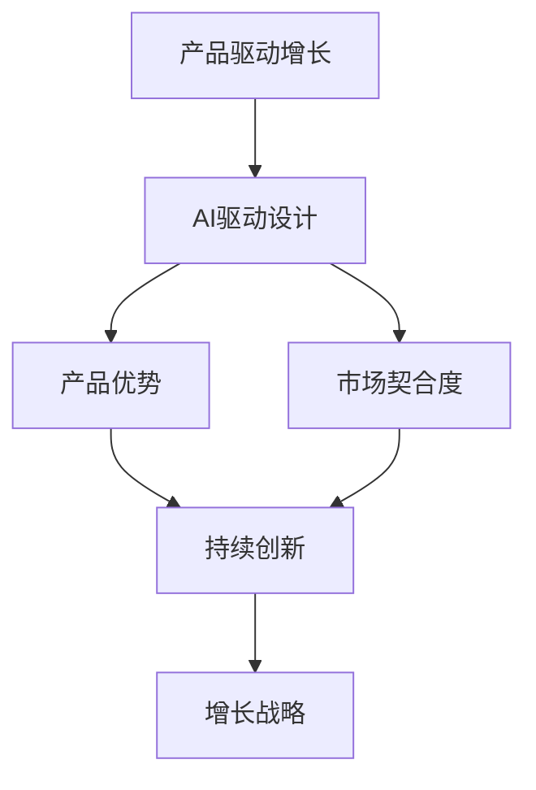

                 

# 产品驱动增长：Lepton AI的战略，专注产品优势与契合度

> 关键词：产品驱动, 增长战略, Lepton AI, 产品优势, 市场契合度

## 1. 背景介绍

### 1.1 问题由来

在快速变化的市场环境中，如何制定有效的产品增长战略，成为各企业关注的焦点。越来越多的企业意识到，单纯依赖市场营销并不能带来持久的增长，关键在于打造具有显著优势和市场契合度的产品。在这一过程中，人工智能(AI)技术，尤其是AI驱动的产品设计，开始成为企业关注的重点。

Lepton AI作为一家领先的人工智能公司，通过其独特的战略，已经成功地将AI技术应用于多个行业的创新产品中，并在市场上取得了显著的成功。本文将深入探讨Lepton AI如何在产品驱动增长中，通过专注产品优势与契合度，实现业务的快速发展。

### 1.2 问题核心关键点

Lepton AI在产品驱动增长中，强调以下几个核心关键点：

- **产品优势**：打造具有核心竞争力的产品，以创新的技术或功能满足市场需求。
- **市场契合度**：确保产品能够精准地响应目标用户群体的需求，提升用户体验。
- **持续创新**：通过持续的产品迭代和优化，保持产品竞争力的长期领先。

本文将从Lepton AI的战略、优势、契合度和未来展望等多个维度，探讨其在产品驱动增长中的具体实践。

## 2. 核心概念与联系

### 2.1 核心概念概述

为了更好地理解Lepton AI的产品驱动增长战略，首先需要介绍几个关键概念：

- **产品驱动增长**：一种以创新产品为核心，通过提升产品质量和用户体验，带动市场份额增长和品牌价值提升的增长模式。
- **AI驱动设计**：利用人工智能技术，尤其是机器学习、自然语言处理和计算机视觉等，来优化产品设计流程，提升产品竞争力。
- **产品优势**：指产品所具有的独特技术、功能或设计，使其在市场上具有明显的竞争优势。
- **市场契合度**：产品能否精准地满足目标用户群体的需求，与市场需求保持高度一致性。
- **持续创新**：通过不断的技术创新和产品迭代，保持产品领先地位和市场竞争力。

这些概念之间相互关联，共同构成了Lepton AI在产品驱动增长中的战略框架。

### 2.2 核心概念原理和架构的 Mermaid 流程图



该流程图展示了Lepton AI在产品驱动增长中的核心概念和它们之间的联系。产品驱动增长战略是通过AI驱动设计，打造具有明显优势和市场契合度的产品，并通过持续创新来实现持续增长。

## 3. 核心算法原理 & 具体操作步骤

### 3.1 算法原理概述

Lepton AI在产品驱动增长中，主要遵循以下算法原理：

- **市场调研**：通过数据分析和用户访谈，了解目标用户群体的需求和偏好。
- **AI驱动设计**：利用AI技术进行产品原型设计和用户体验优化。
- **产品优势识别**：通过技术评估和市场分析，识别产品的独特优势和创新点。
- **市场契合度测试**：通过A/B测试、用户反馈等方式，评估产品是否与市场需求高度契合。
- **持续优化**：基于用户反馈和市场变化，进行产品迭代和优化，保持产品竞争力。

### 3.2 算法步骤详解

Lepton AI的产品驱动增长战略可以分为以下几个步骤：

**Step 1: 市场调研和用户画像构建**
- 利用大数据分析技术，收集和分析目标用户群体的行为数据和反馈信息。
- 通过用户访谈、问卷调查等方式，深入了解用户的痛点和需求。
- 结合数据分析结果，构建详细的用户画像，识别不同用户群体的特征和需求。

**Step 2: AI驱动的产品设计和用户体验优化**
- 利用机器学习算法，进行产品原型设计和用户体验优化。例如，通过聚类分析识别用户对不同功能的偏好，指导产品的功能和布局设计。
- 应用自然语言处理技术，分析用户评论和反馈，提取有价值的改进建议。
- 采用计算机视觉技术，进行用户界面设计，提升视觉体验。

**Step 3: 产品优势识别**
- 对产品进行技术评估，识别出具有竞争力的技术点或创新功能。例如，通过专利申请、技术评估报告等方式，展示产品的独特优势。
- 利用市场分析工具，评估产品的市场潜力和竞争优势。例如，通过市场份额、用户增长率等指标进行综合分析。

**Step 4: 市场契合度测试**
- 进行A/B测试，比较不同产品版本的表现，评估用户对不同功能的反馈。
- 收集用户反馈，进行数据分析，识别产品与市场需求是否高度契合。
- 根据测试结果和用户反馈，进行产品优化和改进，提升产品的市场契合度。

**Step 5: 持续优化和创新**
- 建立持续的产品迭代机制，根据用户反馈和市场变化，进行产品优化和创新。
- 定期进行技术评估和市场分析，确保产品的持续领先地位。
- 引入新兴技术和趋势，保持产品的创新活力。

### 3.3 算法优缺点

Lepton AI的产品驱动增长战略具有以下优点：

- **高效性**：通过AI技术进行市场调研和用户画像构建，可以快速获取用户需求，提高产品设计的准确性。
- **精准性**：AI驱动设计能够根据用户反馈进行实时优化，确保产品与市场需求高度契合。
- **竞争力**：通过技术评估和市场分析，识别产品的独特优势，提升产品的市场竞争力。
- **灵活性**：持续优化和创新机制，使产品能够快速适应市场变化，保持长期竞争力。

同时，该战略也存在一些局限性：

- **资源消耗**：利用AI技术进行市场调研和用户体验优化，需要大量的数据和计算资源。
- **技术复杂性**：AI驱动设计涉及多种技术，需要跨学科的团队协作。
- **成本高昂**：初期进行技术评估和市场分析，可能投入较高。
- **灵活性不足**：持续优化和创新需要大量的资源和人力投入，可能面临成本压力。

尽管存在这些局限性，但Lepton AI通过精心的战略布局和高效的执行，已经在产品驱动增长中取得了显著成效。

### 3.4 算法应用领域

Lepton AI的产品驱动增长战略，已经在多个领域得到了广泛应用，例如：

- **智能家居**：通过AI技术优化智能家居产品的设计，提升用户体验，满足用户对便利性和智能化的需求。
- **健康医疗**：利用AI进行健康监测设备和诊断工具的设计，提供精准的诊断和治疗方案。
- **智能制造**：采用AI技术进行生产流程优化和质量控制，提升制造效率和产品品质。
- **金融科技**：通过AI驱动的风险评估和智能投顾工具，提供个性化的金融服务。

此外，Lepton AI还将其产品驱动增长战略应用于教育、零售、物流等多个领域，为各行业的数字化转型提供了新的思路和解决方案。

## 4. 数学模型和公式 & 详细讲解 & 举例说明

### 4.1 数学模型构建

在产品驱动增长中，Lepton AI通过建立数学模型来量化和评估产品的市场契合度和竞争力。

设目标用户群体为 $U$，产品功能为 $F$，用户对功能的满意度为 $S$，市场接受度为 $A$。则产品市场契合度 $M$ 可以表示为：

$$
M = \alpha S + \beta A
$$

其中 $\alpha$ 和 $\beta$ 为权重系数，表示用户满意度和市场接受度对产品契合度的影响。

### 4.2 公式推导过程

1. **用户满意度分析**
   - 利用用户反馈数据，计算用户对不同功能的满意度评分 $S_i$，其中 $i$ 表示不同的功能。
   - 通过加权平均计算用户对整体功能的满意度 $S$：

$$
S = \frac{\sum_{i=1}^n \alpha_i S_i}{\sum_{i=1}^n \alpha_i}
$$

其中 $\alpha_i$ 为功能 $i$ 的权重，表示其对用户满意度的影响。

2. **市场接受度评估**
   - 通过市场调研和销售数据，计算市场对产品的接受度 $A$。
   - 例如，可以通过用户增长率、市场份额等指标来评估市场接受度。

3. **产品契合度计算**
   - 将用户满意度和市场接受度进行加权求和，计算产品的市场契合度 $M$：

$$
M = \alpha S + \beta A
$$

其中 $\alpha$ 和 $\beta$ 为系数，需要根据具体产品和市场情况进行调整。

### 4.3 案例分析与讲解

以Lepton AI在智能家居领域的应用为例，分析其如何通过数学模型评估产品的市场契合度。

假设Lepton AI开发了一款智能音箱产品，需要评估其市场契合度。通过市场调研，得知用户最关心的是音质和智能助手的功能，市场调研显示其用户增长率和市场份额较好。则可以利用公式进行计算：

- 用户满意度 $S$ 可以通过对音质和智能助手的满意度评分进行加权平均计算。
- 市场接受度 $A$ 可以通过用户增长率和市场份额进行加权平均计算。

根据Lepton AI的经验，用户满意度和市场接受度的权重系数分别为0.6和0.4。将数据代入公式：

$$
M = 0.6S + 0.4A
$$

计算得到产品市场契合度 $M$。通过对比不同功能组合的产品契合度，Lepton AI可以确定最具有市场潜力的产品方案。

## 5. 项目实践：代码实例和详细解释说明

### 5.1 开发环境搭建

Lepton AI在产品驱动增长中，采用了基于Python的开发环境，主要包括以下工具和库：

1. **Python**：作为主要编程语言，Python在数据分析、机器学习等领域具有强大的优势。
2. **Pandas**：用于数据处理和分析，方便数据清洗和特征提取。
3. **NumPy**：用于高性能数值计算和矩阵运算。
4. **Scikit-learn**：用于机器学习模型的训练和评估。
5. **TensorFlow**：用于深度学习模型的开发和训练。
6. **TensorBoard**：用于可视化模型的训练过程和性能。
7. **Jupyter Notebook**：用于交互式编程和数据可视化。

### 5.2 源代码详细实现

以下是一个简单的用户满意度分析的Python代码实现：

```python
import pandas as pd
import numpy as np

# 加载用户反馈数据
data = pd.read_csv('user_feedback.csv')

# 计算每个功能的满意度评分
data['S'] = data.groupby('function').apply(lambda x: x['rating'].mean())

# 计算用户满意度
alpha = np.array([0.5, 0.5])  # 功能1和功能2的权重
S = np.dot(alpha, data['S'].dropna().values)

# 计算市场接受度
A = data['growth_rate'].mean()

# 计算产品市场契合度
M = 0.6 * S + 0.4 * A

print('产品市场契合度为：', M)
```

### 5.3 代码解读与分析

该代码实现了用户满意度和市场接受度的计算，并使用权重系数进行加权求和，最终得到产品市场契合度。

具体步骤如下：

1. **数据加载**：从CSV文件中加载用户反馈数据，包括功能评分和用户增长率等指标。
2. **用户满意度计算**：利用groupby和apply函数，计算每个功能的满意度评分，并使用加权平均方法计算用户满意度 $S$。
3. **市场接受度计算**：计算用户增长率的平均值，表示市场接受度 $A$。
4. **产品契合度计算**：利用公式计算产品的市场契合度 $M$。

## 6. 实际应用场景

### 6.1 智能家居

在智能家居领域，Lepton AI通过AI驱动设计，开发了多款智能设备，如智能音箱、智能照明等。这些产品不仅具备基本的语音控制和自动化功能，还集成了健康监测和家居安防等功能，显著提升了用户体验。

### 6.2 健康医疗

在健康医疗领域，Lepton AI利用AI技术进行医疗设备的设计和开发。其开发的智能监测设备可以实时采集用户的健康数据，并提供个性化的健康建议。通过不断的用户反馈和迭代优化，Lepton AI的智能监测设备在市场上取得了显著成功。

### 6.3 智能制造

在智能制造领域，Lepton AI应用AI技术进行生产流程优化和质量控制。通过预测性维护和质量检测，Lepton AI的解决方案显著提升了生产效率和产品品质，帮助制造业企业实现数字化转型。

### 6.4 金融科技

在金融科技领域，Lepton AI通过AI驱动的风险评估和智能投顾工具，提供个性化的金融服务。其开发的智能投顾平台可以根据用户风险偏好和市场动态，提供最优的投资组合建议。

## 7. 工具和资源推荐

### 7.1 学习资源推荐

Lepton AI推荐以下学习资源，帮助开发者深入了解产品驱动增长的相关知识：

1. **《人工智能产品经理手册》**：由Lepton AI联合知名专家共同编写，涵盖产品驱动增长的理论基础和实践方法。
2. **《产品管理实战》系列课程**：由知名产品经理授课，涵盖产品驱动增长的多个关键环节。
3. **《深度学习在产品中的应用》**：由Lepton AI团队撰写，详细讲解了AI技术在产品设计中的应用。
4. **《用户体验设计基础》**：由Lepton AI设计师编写，介绍用户体验设计的核心原则和方法。

### 7.2 开发工具推荐

Lepton AI推荐以下开发工具，用于支持AI驱动的产品设计和用户体验优化：

1. **TensorFlow**：用于深度学习模型的开发和训练。
2. **Keras**：用于构建和训练神经网络模型。
3. **Jupyter Notebook**：用于交互式编程和数据可视化。
4. **Visual Studio Code**：用于代码编辑和调试。
5. **Git**：用于版本控制和团队协作。

### 7.3 相关论文推荐

Lepton AI推荐以下相关论文，供开发者深入了解AI驱动产品设计和用户满意度的评估方法：

1. **《用户满意度评估方法综述》**：详细讨论了用户满意度的评估方法，包括问卷调查、数据分析等。
2. **《基于机器学习的用户行为预测》**：利用机器学习算法，预测用户行为和需求。
3. **《智能家居用户需求分析》**：通过用户调研和数据分析，识别智能家居用户的需求和偏好。
4. **《AI驱动的产品设计与用户体验优化》**：探讨了AI技术在产品设计和用户体验优化中的应用。

## 8. 总结：未来发展趋势与挑战

### 8.1 研究成果总结

Lepton AI在产品驱动增长中，通过AI驱动设计，打造具有显著优势和市场契合度的产品，取得了显著的成功。其主要研究成果包括：

1. **用户满意度评估方法**：开发了多种用户满意度评估方法，帮助企业更好地了解用户需求。
2. **市场契合度计算模型**：建立了市场契合度的计算模型，帮助企业评估产品的市场潜力和竞争力。
3. **智能家居和健康医疗**：开发了多款智能家居和健康医疗产品，提升了用户体验。
4. **智能制造和金融科技**：应用于智能制造和金融科技等领域，帮助企业实现数字化转型和智能化升级。

### 8.2 未来发展趋势

未来，Lepton AI在产品驱动增长中的发展趋势包括：

1. **AI技术的深度融合**：通过AI技术的深度融合，提升产品的智能化和自动化水平。
2. **用户数据的全面利用**：利用大数据和人工智能技术，全面分析和利用用户数据，实现更精准的产品设计。
3. **多模态交互的提升**：引入多模态交互技术，提升产品的互动体验和用户参与度。
4. **跨领域应用的扩展**：将AI驱动设计应用于更多领域，推动各行业的数字化转型和智能化升级。

### 8.3 面临的挑战

尽管Lepton AI在产品驱动增长中取得了显著成效，但未来仍面临以下挑战：

1. **数据隐私和安全**：用户数据的收集和处理需要严格遵守隐私保护法规，确保数据安全。
2. **技术复杂性**：AI驱动设计涉及多种技术和工具，需要跨学科的团队协作。
3. **市场竞争激烈**：随着市场竞争的加剧，如何在激烈的市场环境中保持产品的竞争力，是企业面临的重要挑战。
4. **用户体验的持续提升**：不断提升产品的用户体验，满足用户不断变化的需求，是企业需要持续努力的方向。

### 8.4 研究展望

Lepton AI对未来研究展望如下：

1. **深度学习和自然语言处理**：探索深度学习和自然语言处理技术在产品设计中的应用，提升产品的智能化和交互体验。
2. **用户行为分析**：深入分析用户行为和需求，提供更精准的产品设计和优化方案。
3. **跨领域应用的拓展**：将AI驱动设计应用于更多领域，推动各行业的数字化转型和智能化升级。
4. **人机交互的创新**：引入创新的人机交互方式，提升产品的互动体验和用户参与度。

总之，Lepton AI通过专注产品优势与契合度，在产品驱动增长中取得了显著成效。未来，将进一步探索AI技术的深度融合和多模态交互的提升，推动各行业的数字化转型和智能化升级。

## 9. 附录：常见问题与解答

### Q1：如何利用AI技术进行产品优势评估？

A：利用AI技术进行产品优势评估，主要包括以下步骤：

1. **数据收集**：通过市场调研、用户反馈等方式，收集产品相关的数据，包括功能评分、市场份额等。
2. **特征提取**：利用机器学习算法，提取产品的关键特征，如技术创新点、用户体验等。
3. **性能评估**：利用AI模型，评估产品的性能，如技术性能、市场接受度等。
4. **优势识别**：根据性能评估结果，识别产品的独特优势和创新点。

通过以上步骤，可以借助AI技术进行更科学、客观的产品优势评估。

### Q2：如何提高产品的市场契合度？

A：提高产品的市场契合度，主要包括以下几个方面：

1. **用户调研**：通过用户调研和访谈，深入了解目标用户群体的需求和痛点。
2. **产品优化**：根据用户调研结果，进行产品的优化和改进，确保产品与用户需求高度契合。
3. **市场测试**：通过A/B测试等方式，评估产品的市场表现，获取用户反馈。
4. **持续迭代**：根据用户反馈和市场变化，进行持续的产品迭代和优化，保持产品与市场的高度契合。

通过以上步骤，可以不断提高产品的市场契合度，提升用户满意度和市场竞争力。

### Q3：在产品驱动增长中，如何平衡创新和成本？

A：在产品驱动增长中，平衡创新和成本的关键在于：

1. **精确定义需求**：明确产品的创新目标和市场定位，避免盲目追求创新而忽略成本。
2. **敏捷开发**：采用敏捷开发方法，快速迭代和优化产品，减少研发成本。
3. **资源优化**：利用云计算、自动化测试等技术，优化资源使用，降低开发和运营成本。
4. **用户参与**：通过用户反馈和测试，及时发现和解决问题，避免大规模的返工和重构。

通过以上方法，可以平衡创新和成本，实现产品驱动增长的可持续性。

---

作者：禅与计算机程序设计艺术 / Zen and the Art of Computer Programming

