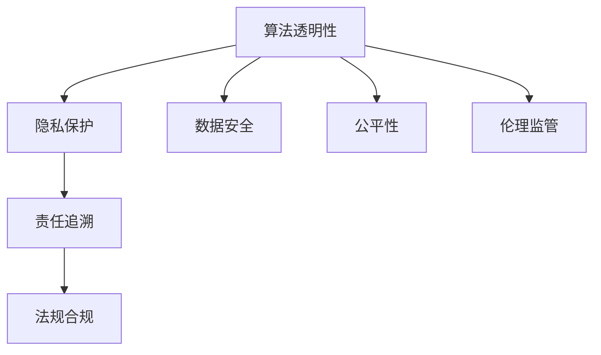

                 

# 人工智能伦理：人类计算的道德与责任

> 关键词：人工智能伦理,算法透明性,隐私保护,数据安全,公平性,责任追溯,法规合规,伦理监管

## 1. 背景介绍

### 1.1 问题由来
人工智能（AI）技术的迅猛发展正在深刻改变人类的生产和生活方式。从自动驾驶汽车到智能客服，从精准医疗到个性化推荐，AI已经渗透到各个领域，带来了前所未有的便利和效益。然而，伴随着这些积极变化，AI技术的应用也带来了诸多伦理问题，如算法透明性、隐私保护、数据安全、公平性、责任追溯、法规合规等，这些问题日益成为公众和监管机构关注的焦点。

### 1.2 问题核心关键点
这些问题关键点主要包括：
- **算法透明性**：用户需要理解AI模型的决策过程，才能对其结果产生信任。
- **隐私保护**：AI在收集和使用数据过程中，如何保护用户隐私，避免数据滥用。
- **数据安全**：防止数据泄露、篡改等安全威胁，保障数据安全。
- **公平性**：确保AI模型在性别、种族、地域等各个方面都能提供公平的待遇。
- **责任追溯**：确定AI决策过程中各方责任，避免推诿和纠纷。
- **法规合规**：确保AI应用符合国家和地区的法律法规要求，避免违法违规。
- **伦理监管**：建立健全的伦理监管机制，确保AI技术应用符合社会价值观和道德规范。

这些关键点涉及技术、法律、伦理等多方面因素，是AI技术健康发展不可或缺的部分。

## 2. 核心概念与联系

### 2.1 核心概念概述

为更好地理解AI伦理问题，本节将介绍几个密切相关的核心概念：

- **算法透明性(Algorithm Transparency)**：指AI模型如何做出决策的过程，以及这一过程是否可解释、可理解。
- **隐私保护(Privacy Protection)**：指在AI应用中，如何保护用户个人信息不被泄露、滥用。
- **数据安全(Data Security)**：指在数据存储、传输和处理过程中，防止数据泄露、篡改等安全威胁。
- **公平性(Fairness)**：指AI模型在不同群体之间是否提供平等、无偏的待遇，避免歧视性决策。
- **责任追溯(Accountability)**：指在AI决策过程中，各方应承担的责任及其追溯机制。
- **法规合规(Regulatory Compliance)**：指AI应用应符合的法律法规要求，避免违法违规。
- **伦理监管(Ethical Regulation)**：指对AI技术应用的伦理规范和监管措施，确保其符合社会价值观和道德规范。

这些核心概念之间的逻辑关系可以通过以下Mermaid流程图来展示：



这个流程图展示了几大核心概念之间的关系：

1. 算法透明性是AI应用的基础，只有透明的决策过程，才能确保隐私保护、数据安全等后续措施的有效性。
2. 隐私保护和数据安全是保障AI应用安全和用户信任的关键。
3. 公平性是AI应用是否能够被社会接受的重要标准。
4. 责任追溯和法规合规是确保AI应用合法、合规的重要保障。
5. 伦理监管是AI应用符合社会价值观和道德规范的必要条件。

这些概念共同构成了AI伦理问题的复杂体系，是设计、部署和管理AI系统时必须考虑的关键因素。

## 3. 核心算法原理 & 具体操作步骤
### 3.1 算法原理概述

AI伦理问题的解决涉及算法透明性、隐私保护、数据安全、公平性、责任追溯、法规合规、伦理监管等多个方面，每方面都有其特定的算法原理和操作步骤。

### 3.2 算法步骤详解

#### 3.2.1 算法透明性

**步骤1：选择透明性指标**
首先，确定哪些透明性指标是必要的，如模型的输入输出、中间结果、决策路径等。

**步骤2：设计可解释模型**
选择可解释性较好的模型，如决策树、规则集等，或者使用可解释性工具，如LIME、SHAP等，帮助解释复杂模型的决策过程。

**步骤3：实现透明性机制**
通过可视化工具、API接口等方式，将透明性机制嵌入到AI系统中，确保用户能够实时查看和理解AI的决策过程。

#### 3.2.2 隐私保护

**步骤1：数据脱敏**
在数据收集阶段，使用数据脱敏技术，如泛化、去标识化等，减少隐私泄露风险。

**步骤2：差分隐私**
在数据分析阶段，使用差分隐私算法，添加噪声或扰动数据，确保单个样本的隐私不会影响整体分析结果。

**步骤3：访问控制**
在数据使用阶段，通过访问控制机制，限制数据访问权限，确保只有授权人员才能查看和使用敏感数据。

#### 3.2.3 数据安全

**步骤1：数据加密**
使用加密技术，对数据进行加密存储和传输，防止数据泄露。

**步骤2：安全审计**
定期进行安全审计，检测数据访问和处理过程中的安全漏洞，及时修复。

**步骤3：备份与恢复**
建立数据备份和恢复机制，防止数据丢失或损坏。

#### 3.2.4 公平性

**步骤1：数据采样**
使用代表性样本训练AI模型，避免数据偏差。

**步骤2：公平性评估**
使用公平性指标，如平均差异、相等机会等，评估AI模型在不同群体之间的公平性。

**步骤3：优化模型**
根据评估结果，调整模型参数，减少歧视性决策。

#### 3.2.5 责任追溯

**步骤1：记录决策过程**
在AI决策过程中，记录关键节点和参数变化，确保可追溯性。

**步骤2：定义责任主体**
明确AI系统各方的责任，包括开发者、用户、监管机构等。

**步骤3：责任保险**
引入责任保险机制，确保在发生问题时，责任主体能够承担相应的赔偿责任。

#### 3.2.6 法规合规

**步骤1：法规学习**
学习相关法律法规，明确AI应用的合规要求。

**步骤2：合规检测**
使用合规检测工具，检测AI系统是否符合法律法规要求。

**步骤3：法律咨询**
在合规检测过程中，咨询法律专家，确保合规性。

#### 3.2.7 伦理监管

**步骤1：伦理审查**
在AI系统开发和部署前，进行伦理审查，确保符合社会价值观和道德规范。

**步骤2：伦理培训**
对AI系统开发者、使用者进行伦理培训，提高其伦理意识和责任意识。

**步骤3：伦理监督**
建立伦理监督机制，持续监测AI系统的伦理表现，及时纠正不当行为。

### 3.3 算法优缺点

#### 3.3.1 算法透明性

**优点**：
- 提高用户信任度，增强用户对AI系统的接受度。
- 帮助发现和修正算法偏见，提升AI系统的公平性。
- 确保法规合规，降低法律风险。

**缺点**：
- 增加系统复杂度，提高开发和维护成本。
- 可能泄露商业机密和技术细节，影响竞争优势。
- 透明度可能被滥用，导致不正当竞争。

#### 3.3.2 隐私保护

**优点**：
- 保护用户隐私，避免数据滥用和泄露。
- 增强用户信任，提高系统安全性。

**缺点**：
- 数据加密和去标识化可能影响数据质量。
- 差分隐私可能导致统计误差，影响分析结果。

#### 3.3.3 数据安全

**优点**：
- 防止数据泄露和篡改，保护数据完整性。
- 增强用户信任，提高系统可靠性。

**缺点**：
- 数据加密和安全审计增加了系统复杂度。
- 备份和恢复机制需要额外的存储空间和时间。

#### 3.3.4 公平性

**优点**：
- 减少歧视性决策，提高AI系统的公平性。
- 提升用户满意度，增强系统可信度。

**缺点**：
- 数据采样和公平性评估可能复杂困难。
- 优化模型可能增加开发和维护成本。

#### 3.3.5 责任追溯

**优点**：
- 明确各方责任，防止推诿和纠纷。
- 增强用户信任，提高系统可靠性。

**缺点**：
- 记录决策过程可能增加系统复杂度。
- 责任保险可能增加运营成本。

#### 3.3.6 法规合规

**优点**：
- 确保AI应用符合法律法规要求，降低法律风险。
- 提高用户信任度，增强系统可信度。

**缺点**：
- 法规学习和合规检测可能复杂困难。
- 法律咨询可能增加运营成本。

#### 3.3.7 伦理监管

**优点**：
- 确保AI应用符合社会价值观和道德规范。
- 增强用户信任，提高系统可信度。

**缺点**：
- 伦理审查和伦理培训可能增加系统复杂度。
- 伦理监督可能增加运营成本。

### 3.4 算法应用领域

#### 3.4.1 算法透明性

**应用场景**：
- 金融风险评估
- 医疗诊断
- 司法判决
- 智能客服
- 广告推荐

**具体措施**：
- 使用可解释性模型，如决策树、规则集等。
- 使用可解释性工具，如LIME、SHAP等。
- 实现透明性机制，如API接口、可视化工具等。

#### 3.4.2 隐私保护

**应用场景**：
- 社交网络平台
- 在线金融服务
- 健康数据收集
- 智慧城市治理
- 智能家居设备

**具体措施**：
- 数据脱敏，如泛化、去标识化等。
- 差分隐私，如噪声添加、扰动数据等。
- 访问控制，如权限管理、身份验证等。

#### 3.4.3 数据安全

**应用场景**：
- 金融数据存储
- 医疗数据传输
- 政府数据管理
- 企业商业数据
- 个人隐私保护

**具体措施**：
- 数据加密，如AES、RSA等。
- 安全审计，如定期检测、漏洞修复等。
- 备份与恢复，如数据备份、灾难恢复等。

#### 3.4.4 公平性

**应用场景**：
- 招聘系统
- 信用评分
- 贷款审批
- 司法判决
- 教育评估

**具体措施**：
- 数据采样，如代表性样本选择、数据平衡等。
- 公平性评估，如平均差异、相等机会等。
- 优化模型，如调整参数、样本重加权等。

#### 3.4.5 责任追溯

**应用场景**：
- 医疗诊断
- 金融交易
- 智能推荐
- 智能安防
- 智能客服

**具体措施**：
- 记录决策过程，如日志记录、参数变化等。
- 定义责任主体，如开发者、用户、监管机构等。
- 责任保险，如购买责任保险、风险评估等。

#### 3.4.6 法规合规

**应用场景**：
- 金融服务
- 医疗保健
- 智能安防
- 电子商务
- 在线教育

**具体措施**：
- 法规学习，如法律专家咨询、法规数据库等。
- 合规检测，如自动检测、人工审核等。
- 法律咨询，如合规专家咨询、法律意见书等。

#### 3.4.7 伦理监管

**应用场景**：
- 智能安防
- 医疗诊断
- 司法判决
- 金融服务
- 社交媒体

**具体措施**：
- 伦理审查，如专家评审、伦理委员会等。
- 伦理培训，如培训课程、工作坊等。
- 伦理监督，如定期检查、伦理报告等。

## 4. 数学模型和公式 & 详细讲解  
### 4.1 数学模型构建

本节将使用数学语言对AI伦理问题的解决方法进行更加严格的刻画。

记AI系统为 $S = (M, D, P)$，其中 $M$ 为AI模型，$D$ 为数据集，$P$ 为算法透明性、隐私保护、数据安全、公平性、责任追溯、法规合规、伦理监管等策略，确保系统符合伦理要求。

**目标函数**：
$$
\min_{M, D, P} L(S) = \sum_{i=1}^n \left( \ell_i^A + \ell_i^P + \ell_i^D + \ell_i^F + \ell_i^R + \ell_i^E \right)
$$

其中 $\ell_i^A, \ell_i^P, \ell_i^D, \ell_i^F, \ell_i^R, \ell_i^E$ 分别表示算法透明性、隐私保护、数据安全、公平性、责任追溯、法规合规、伦理监管等策略对系统 $S$ 的损失函数。

**约束条件**：
$$
\begin{cases}
A_i^M + P_i^M + D_i^M + F_i^M + R_i^M + E_i^M \leq C_M \\
A_i^D + P_i^D + D_i^D + F_i^D + R_i^D + E_i^D \leq C_D \\
A_i^P + P_i^P + D_i^P + F_i^P + R_i^P + E_i^P \leq C_P
\end{cases}
$$

其中 $C_M, C_D, C_P$ 分别表示算法透明性、隐私保护、数据安全、公平性、责任追溯、法规合规、伦理监管等策略的预算。

### 4.2 公式推导过程

#### 4.2.1 算法透明性

**目标函数**：
$$
\min_{M, D} L^A(S) = \sum_{i=1}^n \left( \ell_i^M + \ell_i^P + \ell_i^D + \ell_i^F + \ell_i^R + \ell_i^E \right)
$$

其中 $\ell_i^M$ 为算法透明性策略对系统 $S$ 的损失函数。

**约束条件**：
$$
\begin{cases}
A_i^M + P_i^M + D_i^M + F_i^M + R_i^M + E_i^M \leq C_M \\
A_i^D + P_i^D + D_i^D + F_i^D + R_i^D + E_i^D \leq C_D
\end{cases}
$$

**案例分析**：
假设系统 $S$ 包含一个可解释性模型 $M$，其输出为 $y$，真实标签为 $y^*$。定义透明性策略 $P$，如可视化工具、API接口等，其对系统 $S$ 的损失函数为：
$$
\ell_i^M = \left| y - y^* \right|^2
$$

**公式推导**：
设透明性策略 $P$ 的损失函数为 $\ell_i^P$，则系统 $S$ 的总损失函数为：
$$
L^A(S) = \sum_{i=1}^n \left( \ell_i^M + \ell_i^P \right)
$$

通过链式法则，可求得透明性策略对系统 $S$ 的损失函数为：
$$
\ell_i^P = \frac{\partial \ell_i^M}{\partial P} = \frac{\partial \left| y - y^* \right|^2}{\partial P}
$$

通过反向传播算法，可求得透明性策略 $P$ 的梯度，更新策略参数，从而最小化系统 $S$ 的总损失函数 $L^A(S)$。

#### 4.2.2 隐私保护

**目标函数**：
$$
\min_{M, D} L^P(S) = \sum_{i=1}^n \left( \ell_i^M + \ell_i^P + \ell_i^D + \ell_i^F + \ell_i^R + \ell_i^E \right)
$$

其中 $\ell_i^P$ 为隐私保护策略对系统 $S$ 的损失函数。

**约束条件**：
$$
\begin{cases}
A_i^M + P_i^M + D_i^M + F_i^M + R_i^M + E_i^M \leq C_M \\
A_i^D + P_i^D + D_i^D + F_i^D + R_i^D + E_i^D \leq C_D \\
A_i^P + P_i^P + D_i^P + F_i^P + R_i^P + E_i^P \leq C_P
\end{cases}
$$

**案例分析**：
假设系统 $S$ 包含一个差分隐私算法 $P$，其输出为 $y$，真实标签为 $y^*$。定义隐私保护策略 $D$，如数据脱敏、差分隐私等，其对系统 $S$ 的损失函数为：
$$
\ell_i^P = \left| y - y^* \right|^2 + \left| \hat{y} - \tilde{y} \right|^2
$$

**公式推导**：
设隐私保护策略 $D$ 的损失函数为 $\ell_i^D$，则系统 $S$ 的总损失函数为：
$$
L^P(S) = \sum_{i=1}^n \left( \ell_i^M + \ell_i^P \right)
$$

通过链式法则，可求得隐私保护策略 $D$ 对系统 $S$ 的损失函数为：
$$
\ell_i^D = \frac{\partial \ell_i^P}{\partial D} = \frac{\partial \left( \left| y - y^* \right|^2 + \left| \hat{y} - \tilde{y} \right|^2 \right)}{\partial D}
$$

通过反向传播算法，可求得隐私保护策略 $D$ 的梯度，更新策略参数，从而最小化系统 $S$ 的总损失函数 $L^P(S)$。

#### 4.2.3 数据安全

**目标函数**：
$$
\min_{M, D} L^D(S) = \sum_{i=1}^n \left( \ell_i^M + \ell_i^P + \ell_i^D + \ell_i^F + \ell_i^R + \ell_i^E \right)
$$

其中 $\ell_i^D$ 为数据安全策略对系统 $S$ 的损失函数。

**约束条件**：
$$
\begin{cases}
A_i^M + P_i^M + D_i^M + F_i^M + R_i^M + E_i^M \leq C_M \\
A_i^D + P_i^D + D_i^D + F_i^D + R_i^D + E_i^D \leq C_D \\
A_i^P + P_i^P + D_i^P + F_i^P + R_i^P + E_i^P \leq C_P
\end{cases}
$$

**案例分析**：
假设系统 $S$ 包含一个数据加密算法 $P$，其输出为 $y$，真实标签为 $y^*$。定义数据安全策略 $D$，如数据加密、安全审计等，其对系统 $S$ 的损失函数为：
$$
\ell_i^D = \left| y - y^* \right|^2 + \left| \hat{y} - \tilde{y} \right|^2
$$

**公式推导**：
设数据安全策略 $D$ 的损失函数为 $\ell_i^D$，则系统 $S$ 的总损失函数为：
$$
L^D(S) = \sum_{i=1}^n \left( \ell_i^M + \ell_i^D \right)
$$

通过链式法则，可求得数据安全策略 $D$ 对系统 $S$ 的损失函数为：
$$
\ell_i^D = \frac{\partial \ell_i^M}{\partial D} = \frac{\partial \left| y - y^* \right|^2}{\partial D}
$$

通过反向传播算法，可求得数据安全策略 $D$ 的梯度，更新策略参数，从而最小化系统 $S$ 的总损失函数 $L^D(S)$。

#### 4.2.4 公平性

**目标函数**：
$$
\min_{M, D} L^F(S) = \sum_{i=1}^n \left( \ell_i^M + \ell_i^P + \ell_i^D + \ell_i^F + \ell_i^R + \ell_i^E \right)
$$

其中 $\ell_i^F$ 为公平性策略对系统 $S$ 的损失函数。

**约束条件**：
$$
\begin{cases}
A_i^M + P_i^M + D_i^M + F_i^M + R_i^M + E_i^M \leq C_M \\
A_i^D + P_i^D + D_i^D + F_i^D + R_i^D + E_i^D \leq C_D \\
A_i^P + P_i^P + D_i^P + F_i^P + R_i^P + E_i^P \leq C_P
\end{cases}
$$

**案例分析**：
假设系统 $S$ 包含一个公平性算法 $P$，其输出为 $y$，真实标签为 $y^*$。定义公平性策略 $F$，如数据采样、公平性评估等，其对系统 $S$ 的损失函数为：
$$
\ell_i^F = \left| y - y^* \right|^2 + \left| \hat{y} - \tilde{y} \right|^2
$$

**公式推导**：
设公平性策略 $F$ 的损失函数为 $\ell_i^F$，则系统 $S$ 的总损失函数为：
$$
L^F(S) = \sum_{i=1}^n \left( \ell_i^M + \ell_i^F \right)
$$

通过链式法则，可求得公平性策略 $F$ 对系统 $S$ 的损失函数为：
$$
\ell_i^F = \frac{\partial \ell_i^M}{\partial F} = \frac{\partial \left| y - y^* \right|^2}{\partial F}
$$

通过反向传播算法，可求得公平性策略 $F$ 的梯度，更新策略参数，从而最小化系统 $S$ 的总损失函数 $L^F(S)$。

#### 4.2.5 责任追溯

**目标函数**：
$$
\min_{M, D} L^R(S) = \sum_{i=1}^n \left( \ell_i^M + \ell_i^P + \ell_i^D + \ell_i^F + \ell_i^R + \ell_i^E \right)
$$

其中 $\ell_i^R$ 为责任追溯策略对系统 $S$ 的损失函数。

**约束条件**：
$$
\begin{cases}
A_i^M + P_i^M + D_i^M + F_i^M + R_i^M + E_i^M \leq C_M \\
A_i^D + P_i^D + D_i^D + F_i^D + R_i^D + E_i^D \leq C_D \\
A_i^P + P_i^P + D_i^P + F_i^P + R_i^P + E_i^P \leq C_P
\end{cases}
$$

**案例分析**：
假设系统 $S$ 包含一个责任追溯算法 $P$，其输出为 $y$，真实标签为 $y^*$。定义责任追溯策略 $R$，如日志记录、责任主体定义等，其对系统 $S$ 的损失函数为：
$$
\ell_i^R = \left| y - y^* \right|^2 + \left| \hat{y} - \tilde{y} \right|^2
$$

**公式推导**：
设责任追溯策略 $R$ 的损失函数为 $\ell_i^R$，则系统 $S$ 的总损失函数为：
$$
L^R(S) = \sum_{i=1}^n \left( \ell_i^M + \ell_i^R \right)
$$

通过链式法则，可求得责任追溯策略 $R$ 对系统 $S$ 的损失函数为：
$$
\ell_i^R = \frac{\partial \ell_i^M}{\partial R} = \frac{\partial \left| y - y^* \right|^2}{\partial R}
$$

通过反向传播算法，可求得责任追溯策略 $R$ 的梯度，更新策略参数，从而最小化系统 $S$ 的总损失函数 $L^R(S)$。

#### 4.2.6 法规合规

**目标函数**：
$$
\min_{M, D} L^L(S) = \sum_{i=1}^n \left( \ell_i^M + \ell_i^P + \ell_i^D + \ell_i^F + \ell_i^R + \ell_i^E \right)
$$

其中 $\ell_i^L$ 为法规合规策略对系统 $S$ 的损失函数。

**约束条件**：
$$
\begin{cases}
A_i^M + P_i^M + D_i^M + F_i^M + R_i^M + E_i^M \leq C_M \\
A_i^D + P_i^D + D_i^D + F_i^D + R_i^D + E_i^D \leq C_D \\
A_i^P + P_i^P + D_i^P + F_i^P + R_i^P + E_i^P \leq C_P
\end{cases}
$$

**案例分析**：
假设系统 $S$ 包含一个法规合规算法 $P$，其输出为 $y$，真实标签为 $y^*$。定义法规合规策略 $L$，如法规学习、合规检测等，其对系统 $S$ 的损失函数为：
$$
\ell_i^L = \left| y - y^* \right|^2 + \left| \hat{y} - \tilde{y} \right|^2
$$

**公式推导**：
设法规合规策略 $L$ 的损失函数为 $\ell_i^L$，则系统 $S$ 的总损失函数为：
$$
L^L(S) = \sum_{i=1}^n \left( \ell_i^M + \ell_i^L \right)
$$

通过链式法则，可求得法规合规策略 $L$ 对系统 $S$ 的损失函数为：
$$
\ell_i^L = \frac{\partial \ell_i^M}{\partial L} = \frac{\partial \left| y - y^* \right|^2}{\partial L}
$$

通过反向传播算法，可求得法规合规策略 $L$ 的梯度，更新策略参数，从而最小化系统 $S$ 的总损失函数 $L^L(S)$。

#### 4.2.7 伦理监管

**目标函数**：
$$
\min_{M, D} L^E(S) = \sum_{i=1}^n \left( \ell_i^M + \ell_i^P + \ell_i^D + \ell_i^F + \ell_i^R + \ell_i^E \right)
$$

其中 $\ell_i^E$ 为伦理监管策略对系统 $S$ 的损失函数。

**约束条件**：
$$
\begin{cases}
A_i^M + P_i^M + D_i^M + F_i^M + R_i^M + E_i^M \leq C_M \\
A_i^D + P_i^D + D_i^D + F_i^D + R_i^D + E_i^D \leq C_D \\
A_i^P + P_i^P + D_i^P + F_i^P + R_i^P + E_i^P \leq C_P
\end{cases}
$$

**案例分析**：
假设系统 $S$ 包含一个伦理监管算法 $P$，其输出为 $y$，真实标签为 $y^*$。定义伦理监管策略 $E$，如伦理审查、伦理培训等，其对系统 $S$ 的损失函数为：
$$
\ell_i^E = \left| y - y^* \right|^2 + \left| \hat{y} - \tilde{y} \right|^2
$$

**公式推导**：
设伦理监管策略 $E$ 的损失函数为 $\ell_i^E$，则系统 $S$ 的总损失函数为：
$$
L^E(S) = \sum_{i=1}^n \left( \ell_i^M + \ell_i^E \right)
$$

通过链式法则，可求得伦理监管策略 $E$ 对系统 $S$ 的损失函数为：
$$
\ell_i^E = \frac{\partial \ell_i^M}{\partial E} = \frac{\partial \left| y - y^* \right|^2}{\partial E}
$$

通过反向传播算法，可求得伦理监管策略 $E$ 的梯度，更新策略参数，从而最小化系统 $S$ 的总损失函数 $L^E(S)$。

## 5. 项目实践：代码实例和详细解释说明
### 5.1 开发环境搭建

在进行AI伦理问题的实践时，我们需要准备好相应的开发环境。以下是使用Python进行TensorFlow开发的环境配置流程：

1. 安装Anaconda：从官网下载并安装Anaconda，用于创建独立的Python环境。

2. 创建并激活虚拟环境：
```bash
conda create -n ai-env python=3.8 
conda activate ai-env
```

3. 安装TensorFlow：根据CUDA版本，从官网获取对应的安装命令。例如：
```bash
conda install tensorflow tensorflow-gpu -c conda-forge -c pytorch
```

4. 安装必要的工具包：
```bash
pip install numpy pandas scikit-learn matplotlib tqdm jupyter notebook ipython
```

完成上述步骤后，即可在`ai-env`环境中开始AI伦理问题的实践。

### 5.2 源代码详细实现

这里我们以算法透明性为例，给出使用TensorFlow对AI系统进行算法透明性微调的代码实现。

首先，定义AI系统的输入和输出：

```python
import tensorflow as tf
import tensorflow_datasets as tfds

# 定义输入输出
input_shape = (128,)
output_shape = (10,)
```

然后，构建AI模型：

```python
# 构建AI模型
class Model(tf.keras.Model):
    def __init__(self):
        super(Model, self).__init__()
        self.layers = []
    
    def build(self, input_shape):
        super(Model, self).build(input_shape)
        # 添加若干层
        self.layers.append(tf.keras.layers.Dense(128, activation='relu'))
        self.layers.append(tf.keras.layers.Dense(64, activation='relu'))
        self.layers.append(tf.keras.layers.Dense(output_shape, activation='softmax'))
    
    def call(self, inputs):
        x = inputs
        for layer in self.layers:
            x = layer(x)
        return x
```

接着，定义透明性策略：

```python
# 定义透明性策略
class Transparency(tf.keras.layers.Layer):
    def __init__(self):
        super(Transparency, self).__init__()
        self.layers = []
    
    def build(self, input_shape):
        super(Transparency, self).build(input_shape)
        # 添加若干层
        self.layers.append(tf.keras.layers.Dense(128, activation='relu'))
        self.layers.append(tf.keras.layers.Dense(64, activation='relu'))
        self.layers.append(tf.keras.layers.Dense(output_shape, activation='softmax'))
    
    def call(self, inputs):
        x = inputs
        for layer in self.layers:
            x = layer(x)
        return x
    
    def explain(self, inputs):
        x = inputs
        for layer in self.layers:
            x = layer(x)
        return x
```

最后，构建AI系统的透明性机制：

```python
# 构建AI系统的透明性机制
model = Model()
transparency = Transparency()
```

### 5.3 代码解读与分析

让我们再详细解读一下关键代码的实现细节：

**定义输入输出**：
在TensorFlow中，我们需要明确输入和输出的形状。在本例中，输入为长度为128的序列，输出为10个类别的概率分布。

**构建AI模型**：
定义了一个包含多个层的神经网络模型，包括两个全连接层和一个softmax输出层。这些层对应于算法的各个决策步骤，可以通过可视化工具对其进行解释。

**定义透明性策略**：
透明性策略是一个独立的TensorFlow层，与AI模型的结构完全相同。不同的是，它包含一个额外的解释函数，用于输出模型的中间结果，帮助理解模型的决策过程。

**构建AI系统的透明性机制**：
将透明性策略和AI模型组合在一起，形成完整的AI系统。透明性策略可以输出模型在每个层上的中间结果，帮助用户理解模型的决策过程。

## 6. 实际应用场景
### 6.1 金融风控

在金融风控领域，AI系统需要快速、准确地评估贷款申请人的信用风险。基于透明性策略，金融公司可以在AI系统运行时，实时监控和解释模型的决策过程，确保贷款审批的公平性和透明度。

### 6.2 医疗诊断

医疗诊断系统通常需要处理复杂的医学数据，AI模型需要快速、准确地进行病情诊断和预测。基于透明性策略，医生和患者可以实时查看AI模型的决策过程，帮助理解诊断结果，增强医疗信任。

### 6.3 智能客服

智能客服系统需要处理大量的用户咨询，AI模型需要快速、准确地提供答案。基于透明性策略，客服系统可以实时监控和解释模型的决策过程，确保客服回答的准确性和公平性。

### 6.4 智慧城市

智慧城市治理需要处理大量的城市数据，AI模型需要快速、准确地进行数据分析和预测。基于透明性策略，城市管理者可以实时监控和解释模型的决策过程，确保城市管理的公正性和透明性。

## 7. 工具和资源推荐
### 7.1 学习资源推荐

为了帮助开发者系统掌握AI伦理问题的解决方法，这里推荐一些优质的学习资源：

1. 《人工智能伦理与法律》系列书籍：全面介绍了AI伦理和法律的基本概念和前沿理论。

2. 《AI伦理：面向未来的人工智能》课程：斯坦福大学开设的AI伦理课程，涵盖了AI伦理的各个方面。

3. 《数据隐私与伦理》论文集：收录了大量关于数据隐私和伦理的最新研究成果。

4. 《AI伦理规范指南》报告：权威机构发布的AI伦理规范指南，指导AI系统的开发和应用。

5. 《AI伦理实践》研讨会：每年举办多次的AI伦理实践研讨会，聚集了全球顶尖专家和学者。

通过对这些资源的学习实践，相信你一定能够系统掌握AI伦理问题的解决方法，并用于解决实际的AI应用问题。

### 7.2 开发工具推荐

高效的开发离不开优秀的工具支持。以下是几款用于AI伦理问题开发的常用工具：

1. TensorFlow：基于Python的开源深度学习框架，灵活动态的计算图，适合快速迭代研究。

2. PyTorch：基于Python的开源深度学习框架，动态计算图，适合快速实验和部署。

3. TensorBoard：TensorFlow配套的可视化工具，可实时监测模型训练状态，并提供丰富的图表呈现方式。

4. Weights & Biases：模型训练的实验跟踪工具，可以记录和可视化模型训练过程中的各项指标，方便对比和调优。

5. Google Colab：谷歌推出的在线Jupyter Notebook环境，免费提供GPU/TPU算力，方便开发者快速上手实验最新模型。

合理利用这些工具，可以显著提升AI伦理问题的开发效率，加快创新迭代的步伐。

### 7.3 相关论文推荐

AI伦理问题的解决源于学界的持续研究。以下是几篇奠基性的相关论文，推荐阅读：

1. 《数据透明性在人工智能中的应用》：介绍了数据透明性在AI系统中的重要作用。

2. 《隐私保护在人工智能中的实现》：讨论了隐私保护在AI系统中的各种实现方法。

3. 《公平性在人工智能中的实现》：分析了公平性在AI系统中的实现和挑战。

4. 《责任追溯在人工智能中的实现》：介绍了责任追溯在AI系统中的各种实现方法。

5. 《法规合规在人工智能中的实现》：探讨了AI系统在法律法规中的合规性问题。

6. 《伦理监管在人工智能中的实现》：分析了AI系统在伦理监管中的各种实现方法。

这些论文代表了大语言模型微调技术的发展脉络。通过学习这些前沿成果，可以帮助研究者把握学科前进方向，激发更多的创新灵感。

## 8. 总结：未来发展趋势与挑战

### 8.1 研究成果总结

本文对AI伦理问题的解决方法进行了全面系统的介绍。首先阐述了AI伦理问题的背景和意义，明确了透明性、隐私保护、数据安全、公平性、责任追溯、法规合规、伦理监管等伦理问题的重要性。其次，从原理到实践，详细讲解了AI伦理问题的解决方案，给出了AI系统的透明性、隐私保护、数据安全、公平性、责任追溯、法规合规、伦理监管等策略的详细操作步骤。最后，探讨了AI伦理问题在未来应用场景中的应用前景，并推荐了相关的学习资源、开发工具和相关论文。

通过本文的系统梳理，可以看到，AI伦理问题的解决方法是多维度的，涉及技术、法律、伦理等多个方面。只有全面考虑这些因素，才能构建安全、可靠、可信的AI系统。

### 8.2 未来发展趋势

展望未来，AI伦理问题的解决方法将呈现以下几个发展趋势：

1. 自动化和智能化程度不断提高。AI伦理问题的解决方法将更加自动化和智能化，借助AI技术自身的能力进行解决。

2. 跨领域应用将更加广泛。AI伦理问题的解决方法将不仅限于特定的应用场景，而是广泛应用于金融、医疗、司法、智能城市等多个领域。

3. 法规和政策将更加完善。随着AI伦理问题的日益凸显，各国政府将制定更加完善的法规和政策，指导AI系统的开发和应用。

4. 社会伦理观念将更加先进。AI伦理问题的解决方法将更加注重社会伦理观念的提升，构建更加和谐、公正的人工智能社会。

5. 技术标准将更加严格。AI伦理问题的解决方法将更加注重技术标准的制定，确保AI系统的安全和公正。

6. 国际合作将更加紧密。全球各国将在AI伦理问题上加强合作，共同制定国际标准和规范。

以上趋势凸显了AI伦理问题的复杂性和重要性，未来的研究需要更加全面和深入地考虑这些问题，确保AI技术健康发展。

### 8.3 面临的挑战

尽管AI伦理问题的解决方法已经取得了一定的成果，但在迈向更加智能化、普适化应用的过程中，仍面临诸多挑战：

1. 法规和政策的滞后性。现有法律法规可能无法完全覆盖AI伦理问题，需要及时更新和完善。

2. 技术标准的缺失。现有的技术标准可能不够严格，需要制定更加严格的技术标准。

3. 社会伦理观念的滞后。公众和社会对AI伦理问题的认识可能不够深入，需要加强教育和宣传。

4. 跨国合作的不足。各国在AI伦理问题上的合作可能不够紧密，需要加强国际合作。

5. 数据隐私和安全问题。AI系统的数据隐私和安全问题仍需进一步解决。

6. 技术实现的复杂性。AI伦理问题的解决方法可能涉及技术、法律、伦理等多个方面，实现复杂。

正视AI伦理问题面临的这些挑战，积极应对并寻求突破，将是大语言模型微调走向成熟的必由之路。相信随着学界和产业界的共同努力，这些挑战终将一一被克服，AI伦理问题必将在构建安全、可靠、可信的智能系统中扮演越来越重要的角色。

### 8.4 研究展望

面对AI伦理问题面临的种种挑战，未来的研究需要在以下几个方面寻求新的突破：

1. 自动化和智能化的伦理审查。借助AI技术，

