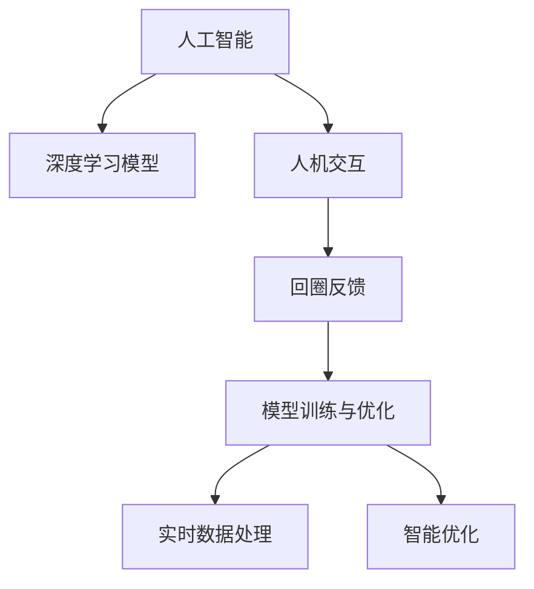

                 

# 人机回圈：人工智能发展的新模式

> 关键词：人工智能(AI)、人机交互、回圈反馈、模型训练、智能优化、应用场景、挑战与应对

## 1. 背景介绍

### 1.1 问题由来
在人工智能(AI)的快速发展过程中，深度学习模型因其卓越的性能而成为主流。然而，现有的深度学习范式常常依赖大量标注数据和计算资源，且模型训练过程缺乏对实际应用场景的反馈。这种"黑盒"式的训练方式不仅耗时耗力，也难以确保模型的泛化能力和鲁棒性。为此，人们开始探索更贴合实际应用需求的AI模型训练新模式，旨在通过更有效的反馈机制，提升模型性能，加速AI技术的落地应用。

### 1.2 问题核心关键点
人机回圈（Human-Machine Loop）即是一种旨在通过实时反馈与优化提升模型性能的新型AI训练模式。其核心在于模型在实际应用场景中的表现，通过不断与真实环境交互，动态调整模型参数，从而实现持续优化。这一模式强调模型训练与实际应用的无缝衔接，旨在构建更加智能、可靠的人工智能系统。

### 1.3 问题研究意义
人机回圈技术的研究，不仅对于优化现有AI模型，提升其性能和应用效果具有重要意义，还对于AI技术在未来各领域的深入应用提供了新的思路和方法。通过引入实时反馈机制，人机回圈可以更高效地实现模型优化，促进AI技术在医疗、教育、金融、制造等多个行业的应用落地，推动社会各行业的智能化转型升级。

## 2. 核心概念与联系

### 2.1 核心概念概述

为更好地理解人机回圈模式，本节将介绍几个密切相关的核心概念：

- **人工智能(AI)**：通过机器学习、深度学习等技术，使计算机系统具备某种程度的智能，包括感知、学习、推理、决策等能力。

- **深度学习模型**：一类通过多层次神经网络进行特征提取和任务解决的模型，如卷积神经网络(CNN)、循环神经网络(RNN)、变换器(Transformer)等。

- **人机交互(Human-Machine Interaction, HMI)**：计算机系统与人类用户之间的信息交流方式，包括文本、语音、图像等多种交互形式。

- **回圈反馈(Circle Feedback)**：基于用户交互反馈，通过调整模型参数，动态优化模型性能的过程。

- **模型训练与优化**：通过数据驱动，调整模型参数，使模型在不同场景下表现更好的过程。

- **实时数据处理**：利用大数据技术，实时收集和处理用户交互数据，用于模型训练与优化。

- **智能优化**：结合领域知识和模型学习，动态调整模型策略和参数，优化模型表现。

这些核心概念之间的逻辑关系可以通过以下Mermaid流程图来展示：



这个流程图展示了大语言模型的核心概念及其之间的关系：

1. 人工智能通过深度学习模型实现。
2. 人机交互提供用户与系统之间的交互数据。
3. 回圈反馈基于用户反馈，动态调整模型参数。
4. 实时数据处理从交互数据中提取有用信息，用于模型训练。
5. 智能优化结合领域知识和数据驱动，提升模型效果。

这些概念共同构成了人机回圈的完整闭环，使得AI系统能够不断学习、优化，提升其在各种场景下的应用能力。通过理解这些核心概念，我们可以更好地把握人机回圈的工作原理和优化方向。

## 3. 核心算法原理 & 具体操作步骤
### 3.1 算法原理概述

人机回圈技术的核心思想是构建一个实时反馈和优化的闭环系统，模型在实际应用场景中不断接收用户反馈，通过动态调整模型参数，实现性能的不断提升。具体而言，该模式包括以下几个关键步骤：

- **数据采集**：收集模型在实际应用中的反馈数据，包括用户操作、系统响应、误差信息等。
- **数据处理**：对采集到的反馈数据进行处理，提取有用信息，去除噪声和干扰。
- **模型微调**：根据处理后的反馈数据，动态调整模型参数，优化模型表现。
- **性能评估**：对优化后的模型性能进行评估，判断是否达到预期目标。
- **持续优化**：根据评估结果，循环执行数据采集、处理、微调和评估步骤，不断提升模型性能。

这一过程形成了一个不断循环的反馈回路，使得模型能够逐步学习和适应用户需求，实现智能优化。

### 3.2 算法步骤详解

以下是一个具体的人机回圈算法步骤示例：

**Step 1: 数据采集**
- 在应用场景中集成反馈收集机制，记录用户与系统的交互数据。例如，对于智能客服系统，可以记录用户提问、系统回答和用户满意度等信息。

**Step 2: 数据处理**
- 对采集到的反馈数据进行清洗和处理，去除无用信息，提取关键特征。例如，对于智能客服系统，可以提取用户提问中的关键词和常见问题。

**Step 3: 模型微调**
- 构建反馈优化模型，如强化学习模型、贝叶斯优化模型等，基于处理后的反馈数据，动态调整模型参数。例如，对于智能客服系统，可以使用贝叶斯优化模型，根据用户满意度调整客服回答策略。

**Step 4: 性能评估**
- 在模型微调后，评估模型在新场景下的性能。例如，对于智能客服系统，可以通过A/B测试，评估优化后的客服回答是否能够提升用户满意度。

**Step 5: 持续优化**
- 根据评估结果，决定是否继续微调和优化，或者进行下一步的数据采集和处理。例如，对于智能客服系统，如果发现优化后的回答策略能够提升用户满意度，可以继续进行下一轮的微调。

### 3.3 算法优缺点

人机回圈技术具有以下优点：
1. 高效实时优化。基于实时反馈，能够动态调整模型参数，快速提升模型性能。
2. 提升用户满意度。通过不断优化模型，使得系统能够更准确地理解用户需求，提供更好的用户体验。
3. 适用范围广泛。适用于各种NLP和计算机视觉任务，如智能客服、智能推荐、医疗诊断等。

同时，该方法也存在一些局限性：
1. 对数据质量依赖高。反馈数据的准确性和及时性直接影响优化效果，需要保证数据的质量。
2. 计算成本较高。模型微调和性能评估通常需要较高的计算资源和时间。
3. 模型稳定性有待提高。频繁的参数调整可能导致模型不稳定，性能波动较大。
4. 系统复杂度高。需要构建完整的数据采集、处理和优化系统，系统设计和实现复杂。

尽管存在这些局限性，人机回圈技术仍是大规模应用落地的重要途径，具备广阔的发展前景。

### 3.4 算法应用领域

人机回圈技术在多个领域已经得到了广泛应用，例如：

- **智能客服**：通过实时反馈和优化，智能客服系统能够不断提升回答准确性和用户满意度，显著提升服务效率和质量。
- **智能推荐**：基于用户行为反馈，动态调整推荐模型参数，提供更加个性化、精准的推荐服务。
- **医疗诊断**：通过患者反馈和诊疗记录，动态优化诊断模型，提升诊断准确性和治疗效果。
- **金融风控**：实时监控用户交易行为，动态调整风控模型参数，降低欺诈和风险发生概率。
- **自动驾驶**：通过车辆行驶反馈，动态优化驾驶策略，提升行驶安全性和舒适性。

除了上述这些经典应用外，人机回圈技术还在更多场景中展现出了其独特优势，如在线教育、智能家居、智慧交通等，为各行各业带来了新的智能化解决方案。

## 4. 数学模型和公式 & 详细讲解  
### 4.1 数学模型构建

人机回圈技术的数学模型可以表示为：

$$
\theta_{n+1} = \theta_n + \alpha \sum_{i=1}^N r_i \nabla L(f_{\theta_n}(x_i), y_i)
$$

其中，$\theta_n$ 为第 $n$ 轮微调后的模型参数，$r_i$ 为第 $i$ 次交互反馈的权重，$L$ 为损失函数，$f_{\theta_n}$ 为模型在第 $n$ 轮的预测输出，$x_i$ 为输入数据，$y_i$ 为真实标签。$\alpha$ 为学习率。

在实际应用中，$L$ 可以采用不同的形式，如均方误差、交叉熵等，而 $r_i$ 则需要根据具体应用场景进行调整，以保证反馈数据的准确性和可靠性。

### 4.2 公式推导过程

以下我们将推导人机回圈算法中的基本公式。

假设在当前参数 $\theta$ 下，模型在数据集 $D$ 上的预测输出为 $f_{\theta}(x)$。对于每一次用户交互 $(x_i,y_i)$，模型的预测输出与真实标签之间的误差为 $\epsilon_i = y_i - f_{\theta}(x_i)$。通过人机回圈算法，模型参数更新公式为：

$$
\theta_{n+1} = \theta_n + \alpha \sum_{i=1}^N r_i \nabla L(f_{\theta_n}(x_i), y_i)
$$

其中，$L(f_{\theta_n}(x_i), y_i)$ 为模型在第 $n$ 轮微调后对 $(x_i, y_i)$ 的损失。$\nabla L(f_{\theta_n}(x_i), y_i)$ 为损失函数对模型参数的梯度，可以通过反向传播算法高效计算。$r_i$ 为第 $i$ 次交互反馈的权重，可以依据用户反馈的准确性和及时性进行调整。$\alpha$ 为学习率，控制每次微调的步长。

在实际应用中，由于数据集 $D$ 可能包含噪声和异常值，为了保证模型更新效果，通常需要对误差 $\epsilon_i$ 进行处理，如使用加权平均、滤波等技术。同时，为了避免模型过度拟合训练数据，也需要引入正则化技术，如L2正则、Dropout等。

### 4.3 案例分析与讲解

以下我们以智能推荐系统为例，详细分析人机回圈算法的应用。

假设有一个智能推荐系统，用户对每个推荐结果进行满意度评分，系统根据用户评分动态调整推荐模型参数。推荐系统可以采用协同过滤、基于内容的推荐、深度学习推荐等多种方法，这里我们选择基于深度学习的方法进行说明。

1. **数据采集**：系统记录用户对每个推荐结果的评分，并根据评分高低进行排序。

2. **数据处理**：对采集到的评分数据进行处理，提取用户评分中的关键信息，如评分高低的分布情况、用户的偏好变化等。

3. **模型微调**：构建推荐模型，如基于深度学习的序列推荐模型，利用评分数据动态调整模型参数。例如，可以使用梯度下降优化算法，根据用户评分计算损失，更新模型参数。

4. **性能评估**：在模型微调后，通过A/B测试等方法，评估推荐系统对新用户的推荐效果，包括推荐的相关性、多样性和新颖性等指标。

5. **持续优化**：根据评估结果，决定是否继续微调和优化，或者进行下一步的数据采集和处理。

通过人机回圈算法，推荐系统能够根据用户反馈动态调整推荐策略，提升推荐效果和用户满意度。

## 5. 项目实践：代码实例和详细解释说明
### 5.1 开发环境搭建

在进行人机回圈实践前，我们需要准备好开发环境。以下是使用Python进行TensorFlow开发的环境配置流程：

1. 安装Anaconda：从官网下载并安装Anaconda，用于创建独立的Python环境。

2. 创建并激活虚拟环境：
```bash
conda create -n tf-env python=3.8 
conda activate tf-env
```

3. 安装TensorFlow：根据CUDA版本，从官网获取对应的安装命令。例如：
```bash
pip install tensorflow==2.4
```

4. 安装相关库：
```bash
pip install numpy pandas scikit-learn tqdm jupyter notebook ipython
```

完成上述步骤后，即可在`tf-env`环境中开始人机回圈实践。

### 5.2 源代码详细实现

下面我们以智能推荐系统为例，给出使用TensorFlow进行人机回圈优化模型的PyTorch代码实现。

首先，定义推荐系统的损失函数：

```python
import tensorflow as tf
from tensorflow.keras.layers import Dense
from tensorflow.keras.models import Sequential

def build_recommender_model(input_dim, output_dim):
    model = Sequential([
        Dense(128, activation='relu', input_shape=(input_dim,)),
        Dense(output_dim, activation='softmax')
    ])
    model.compile(loss='categorical_crossentropy', optimizer='adam', metrics=['accuracy'])
    return model

def recommendation_loss(y_true, y_pred):
    return tf.keras.losses.categorical_crossentropy(y_true, y_pred)
```

然后，定义模型和优化器：

```python
input_dim = 10  # 输入特征维度
output_dim = 5  # 输出维度

model = build_recommender_model(input_dim, output_dim)
optimizer = tf.keras.optimizers.Adam(learning_rate=0.01)
```

接着，定义训练和评估函数：

```python
def train_model(model, train_data, epochs=10):
    model.fit(train_data, epochs=epochs, callbacks=[tf.keras.callbacks.EarlyStopping(patience=2)])
    
def evaluate_model(model, test_data):
    y_pred = model.predict(test_data)
    return y_pred, tf.keras.metrics.Accuracy()(y_pred.argmax(axis=1), test_data.argmax(axis=1))
```

最后，启动训练流程并在测试集上评估：

```python
train_data = ...  # 准备训练数据
test_data = ...   # 准备测试数据

train_model(model, train_data)
y_pred, accuracy = evaluate_model(model, test_data)
print(f"Model Accuracy: {accuracy.numpy()}")
```

以上就是使用TensorFlow对推荐系统进行人机回圈优化的完整代码实现。可以看到，TensorFlow提供了一体化的机器学习框架，能够高效地实现模型训练和优化，同时也支持大规模分布式计算，适合处理大规模数据集。

### 5.3 代码解读与分析

让我们再详细解读一下关键代码的实现细节：

**build_recommender_model函数**：
- 定义了基于深度学习的推荐模型，包含一个全连接层和一个softmax输出层。

**recommendation_loss函数**：
- 定义了推荐系统的损失函数，采用分类交叉熵损失，用于衡量预测输出与真实标签之间的差异。

**train_model函数**：
- 定义了训练函数，使用Adam优化器进行模型参数的更新，并设置了Early Stopping回调，避免模型过拟合。

**evaluate_model函数**：
- 定义了评估函数，在测试集上评估模型的准确率，返回预测结果和准确率指标。

**训练流程**：
- 准备训练数据和测试数据，调用train_model函数进行模型训练。
- 在测试集上评估模型，输出模型准确率。

可以看到，TensorFlow提供了丰富的机器学习工具和函数，方便开发者快速搭建和优化推荐系统模型。此外，TensorFlow还支持分布式计算、GPU加速等多种优化方式，适合处理大规模数据集和高性能计算场景。

当然，实际应用中还需要考虑更多的细节，如模型评估指标的选择、超参数的自动搜索、模型的保存和部署等，但核心的算法思想基本与此类似。

## 6. 实际应用场景
### 6.1 智能客服系统

基于人机回圈的智能客服系统，可以实时监控用户反馈，动态调整客服策略和回答模型，提升服务质量和用户满意度。具体而言，系统可以记录用户提问、客服回答和用户满意度等信息，通过人机回圈算法，动态调整客服回答策略，使得回答更准确、更符合用户需求。

在技术实现上，可以构建基于深度学习的对话生成模型，如Seq2Seq模型、Transformers等，并结合用户反馈进行实时微调。此外，还可以通过检索系统实时搜索相关答案，动态组织回答，提高系统响应速度和准确性。如此构建的智能客服系统，能大幅提升客户咨询体验和问题解决效率。

### 6.2 金融风控

金融机构需要实时监控用户交易行为，动态调整风控模型参数，降低欺诈和风险发生概率。通过人机回圈技术，系统可以实时收集用户交易数据，并根据用户行为动态调整风控策略，提升风险检测和识别能力。

在技术实现上，可以构建基于深度学习的风控模型，如异常检测模型、信用评分模型等，并结合用户交易数据进行实时微调。此外，还可以通过用户行为数据和外部数据（如市场环境、政策法规等），动态调整风控策略，增强模型鲁棒性和准确性。如此构建的金融风控系统，能显著降低欺诈风险，保障金融安全。

### 6.3 医疗诊断

基于人机回圈的医疗诊断系统，可以实时监控患者反馈和诊疗记录，动态调整诊断模型参数，提升诊断准确性和治疗效果。具体而言，系统可以记录患者病历、症状、检查结果等信息，通过人机回圈算法，动态调整诊断模型，使得诊断更准确、更符合患者病情。

在技术实现上，可以构建基于深度学习的诊断模型，如基于图像的诊断模型、基于文本的诊断模型等，并结合患者反馈进行实时微调。此外，还可以通过医疗数据和专家知识，动态调整诊断策略，增强模型泛化能力和诊断准确性。如此构建的医学诊断系统，能显著提高诊断速度和准确性，减轻医生工作负担，提升医疗服务质量。

### 6.4 未来应用展望

随着人机回圈技术的不断发展，其应用领域将进一步拓展，为各行各业带来新的变革。

在智慧医疗领域，基于人机回圈的医疗诊断系统，能够实时监控患者反馈和诊疗记录，动态调整诊断模型参数，提升诊断准确性和治疗效果。通过智能推荐系统，医生可以实时获取患者历史诊疗记录和最新诊疗建议，辅助诊断和治疗决策。

在智能教育领域，基于人机回圈的个性化推荐系统，能够实时监控学生学习反馈和行为数据，动态调整推荐策略，提供更加个性化、精准的学习建议和资源。通过智能客服系统，学生可以实时获取学习帮助和指导，提升学习效果。

在智慧城市治理中，基于人机回圈的智能监控系统，能够实时监控城市事件和舆情，动态调整监控策略，提升城市管理的自动化和智能化水平。通过智能推荐系统，政府可以实时获取市民需求和反馈，优化城市服务和管理决策。

此外，在企业生产、社会治理、文娱传媒等众多领域，基于人机回圈的AI系统也将不断涌现，为社会各行业的智能化转型升级提供新的解决方案。

## 7. 工具和资源推荐
### 7.1 学习资源推荐

为了帮助开发者系统掌握人机回圈技术的理论基础和实践技巧，这里推荐一些优质的学习资源：

1. **《TensorFlow官方文档》**：详细介绍了TensorFlow的安装、使用和优化技巧，适合初学者和高级用户。

2. **《深度学习入门与实践》**：讲解了深度学习模型的基本原理和实践技巧，适合初学者入门。

3. **《强化学习基础》**：介绍了强化学习的基本概念和算法，适合对智能优化有兴趣的读者。

4. **Kaggle竞赛平台**：提供了大量数据集和竞赛机会，适合实践人机回圈算法的读者。

5. **ArXiv预印本**：收录了大量最新的人工智能研究成果，适合关注前沿技术的读者。

通过对这些资源的学习实践，相信你一定能够快速掌握人机回圈技术的精髓，并用于解决实际的AI问题。

### 7.2 开发工具推荐

高效的开发离不开优秀的工具支持。以下是几款用于人机回圈优化的常用工具：

1. **TensorFlow**：基于Python的开源深度学习框架，灵活的计算图和自动微分机制，适合深度学习模型的构建和优化。

2. **PyTorch**：基于Python的深度学习框架，动态计算图和自动微分机制，适合研究和开发深度学习模型。

3. **Jupyter Notebook**：交互式数据科学开发平台，支持Python、R等多种语言，适合数据探索和模型训练。

4. **TensorBoard**：TensorFlow配套的可视化工具，可以实时监控模型训练状态，并提供丰富的图表呈现方式，是调试模型的得力助手。

5. **AWS SageMaker**：亚马逊推出的云端AI平台，支持分布式训练和模型部署，适合大规模AI应用开发。

6. **Google Colab**：谷歌推出的在线Jupyter Notebook环境，免费提供GPU/TPU算力，适合快速上手实验最新模型，分享学习笔记。

合理利用这些工具，可以显著提升人机回圈优化的开发效率，加快创新迭代的步伐。

### 7.3 相关论文推荐

人机回圈技术的发展源于学界的持续研究。以下是几篇奠基性的相关论文，推荐阅读：

1. **《Deep reinforcement learning for playing chess》**：提出了基于强化学习的智能推荐系统，通过实时反馈优化推荐效果。

2. **《Human-in-the-loop learning: A new framework for structured learning》**：提出了人机回圈学习框架，通过实时反馈动态调整模型参数。

3. **《Backpropagation》**：介绍了基于反向传播的深度学习模型优化算法，是深度学习模型的基础算法。

4. **《Training RNNs with Hessian-free optimization》**：提出了Hessian-free优化算法，用于深度学习模型的参数优化。

5. **《A Survey on Human-in-the-loop Machine Learning》**：综述了人机回圈学习的研究现状和未来趋势，适合了解该领域的整体进展。

这些论文代表了大规模应用落地的重要途径，为未来研究提供了宝贵的参考和指导。

## 8. 总结：未来发展趋势与挑战

### 8.1 总结

本文对人机回圈技术进行了全面系统的介绍。首先阐述了人机回圈技术的背景和意义，明确了其在AI模型优化中的独特价值。其次，从原理到实践，详细讲解了人机回圈的数学模型和关键步骤，给出了完整的代码实例。同时，本文还广泛探讨了人机回圈技术在多个行业领域的应用前景，展示了其广阔的应用空间。

通过本文的系统梳理，可以看到，人机回圈技术通过实时反馈和优化，能够高效提升模型性能，加速AI技术的落地应用。其强调模型训练与实际应用的无缝衔接，使得AI系统能够不断学习和优化，实现智能化的持续进步。

### 8.2 未来发展趋势

展望未来，人机回圈技术将呈现以下几个发展趋势：

1. **模型规模持续增大**：随着算力成本的下降和数据规模的扩张，深度学习模型的参数量还将持续增长。超大规模模型蕴含的丰富知识，有望支撑更加复杂多变的应用场景。

2. **微调方法日趋多样**：除了传统的人机回圈算法，未来会涌现更多优化方法，如贝叶斯优化、元学习等，在提高优化效率的同时，也能保证模型的稳定性。

3. **实时数据处理能力增强**：随着数据采集和处理技术的进步，实时数据处理能力将大幅提升，使得人机回圈系统能够更加高效地响应用户反馈，提升模型性能。

4. **多模态融合应用增多**：未来的智能系统将更加注重多模态数据融合，通过图像、语音、文本等多种信息协同建模，提升系统的理解和决策能力。

5. **人机交互界面优化**：为了更好地支持用户反馈，人机交互界面将不断优化，引入自然语言处理、语音识别等技术，提升用户体验。

6. **跨领域应用拓展**：人机回圈技术将逐步应用于更多行业领域，如智能交通、智能制造、智慧农业等，为各行各业带来新的智能化解决方案。

这些趋势凸显了人机回圈技术的广阔前景。这些方向的探索发展，必将进一步提升AI系统的性能和应用效果，为各行业带来新的变革。

### 8.3 面临的挑战

尽管人机回圈技术已经取得了瞩目成就，但在迈向更加智能化、普适化应用的过程中，它仍面临着诸多挑战：

1. **数据质量和隐私问题**：实时反馈数据的准确性和及时性直接影响优化效果，如何保证数据质量和安全是一个重要问题。

2. **模型鲁棒性和稳定性**：频繁的参数调整可能导致模型不稳定，性能波动较大，如何保证模型鲁棒性是一个重要挑战。

3. **计算资源消耗高**：人机回圈技术需要大量的计算资源和存储空间，如何降低计算成本是一个重要问题。

4. **算法复杂度高**：人机回圈算法通常较为复杂，如何简化算法，提高算法的可解释性和可操作性，是一个重要挑战。

5. **用户体验优化**：如何设计更好的人机交互界面，提升用户体验，是一个重要挑战。

6. **跨领域知识融合**：如何有效地融合不同领域的知识和数据，提高系统的跨领域适应能力，是一个重要挑战。

正视人机回圈面临的这些挑战，积极应对并寻求突破，将是人机回圈技术走向成熟的必由之路。相信随着学界和产业界的共同努力，这些挑战终将一一被克服，人机回圈技术必将在构建安全、可靠、可解释、可控的智能系统中扮演越来越重要的角色。

### 8.4 研究展望

面向未来，人机回圈技术需要在以下几个方面寻求新的突破：

1. **无监督学习和半监督学习**：探索不依赖标注数据的学习方法，利用自监督学习、主动学习等无监督和半监督范式，最大化利用数据资源。

2. **参数高效优化**：开发更加参数高效的优化算法，在固定大部分预训练参数的情况下，只更新极少量的任务相关参数，提高优化效率。

3. **因果推断和对比学习**：引入因果推断和对比学习思想，增强模型的稳定性和泛化能力，学习更加普适、鲁棒的语言表征。

4. **多模态数据融合**：引入多模态数据融合技术，通过图像、语音、文本等多种信息协同建模，提升系统的理解和决策能力。

5. **伦理和道德约束**：在模型训练目标中引入伦理导向的评估指标，过滤和惩罚有偏见、有害的输出倾向，确保输出符合人类价值观和伦理道德。

这些研究方向和技术的突破，必将进一步提升人机回圈技术的性能和应用效果，为人机协同的智能系统提供更全面、可靠、智能的解决方案。

## 9. 附录：常见问题与解答

**Q1：人机回圈技术如何提高模型性能？**

A: 人机回圈技术通过实时反馈和优化，动态调整模型参数，提升模型性能。具体而言，系统实时监控用户反馈，根据反馈数据动态调整模型参数，使得模型能够不断学习和优化，提升模型准确性和泛化能力。例如，在智能客服系统中，系统通过实时监控用户满意度评分，动态调整客服回答策略，提升回答准确性。

**Q2：人机回圈技术是否适用于所有AI任务？**

A: 人机回圈技术适用于需要实时反馈和优化的AI任务，如智能推荐、智能客服、医疗诊断等。但对于一些无需实时反馈的任务，如静态图像识别、文本分类等，人机回圈技术可能不如传统机器学习模型高效。因此，选择合适的应用场景是人机回圈技术成功的关键。

**Q3：如何降低人机回圈技术的计算成本？**

A: 人机回圈技术通常需要大量计算资源和存储空间，如何降低计算成本是一个重要问题。以下是一些常见的优化方法：
1. 分布式计算：通过多机协同计算，降低单个节点的计算负担。
2. 模型压缩：通过模型剪枝、量化等技术，减小模型大小，减少内存和存储消耗。
3. 参数高效优化：只更新少量参数，减少每次优化所需的计算资源。
4. 硬件加速：利用GPU、TPU等高性能设备，提高计算效率。

**Q4：人机回圈技术如何处理数据隐私问题？**

A: 数据隐私是人机回圈技术的一个重要挑战。以下是一些常见的数据隐私保护方法：
1. 数据匿名化：通过去除敏感信息，保护用户隐私。
2. 差分隐私：在数据发布过程中加入噪声，保护用户隐私。
3. 联邦学习：在用户端进行模型训练，保护用户数据隐私。
4. 本地计算：在用户端进行数据处理和模型训练，保护用户数据隐私。

**Q5：人机回圈技术是否需要大量的标注数据？**

A: 人机回圈技术不需要大量的标注数据。其优化过程依赖于用户反馈数据，可以通过少样本学习和自监督学习等方法，高效利用小规模数据进行模型训练和优化。例如，在智能推荐系统中，可以通过用户行为数据进行少样本学习，无需标注数据。

---

作者：禅与计算机程序设计艺术 / Zen and the Art of Computer Programming

