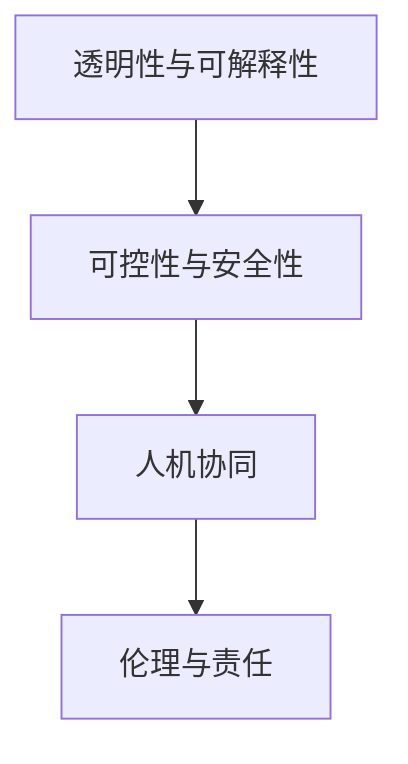

                 

# 人类-AI协作：增强人类与AI之间的信任和理解

## 1. 背景介绍

随着人工智能技术的快速发展，人工智能（AI）的应用已经深入到社会生活的各个方面。然而，尽管AI在效率、准确性等方面具有显著优势，人类与AI之间的协作却常常受到信任和理解上的挑战。这种挑战不仅存在于技术和产品设计层面，也关系到社会文化、伦理道德等多个维度。本文旨在探讨如何通过技术手段和社会共识，增强人类与AI之间的信任和理解，推动AI技术在实际应用中的健康发展。

### 1.1 问题由来
在人工智能迅猛发展的今天，无论是商业、医疗、教育还是公共服务，AI都已经成为不可或缺的一部分。但与此同时，由于人类对AI的信任不足，导致其在很多领域的应用受限。例如，医疗领域的AI诊断系统需要医生的认可才能被接受，教育领域的个性化学习系统需要家长的信任才能广泛使用。

此外，AI技术的“黑箱”特性也使得其决策过程难以被理解和解释，增加了人类对AI的不信任。尤其是在涉及隐私、安全等敏感领域，人类对AI的怀疑和不信任尤为明显。这种信任危机不仅阻碍了AI技术的应用，也限制了其在社会各领域的潜在价值。

### 1.2 问题核心关键点
要解决上述问题，需要从技术和社会两个层面出发，综合考虑以下核心关键点：
- **透明性与可解释性**：确保AI的决策过程透明，且能够被人类理解。
- **可控性与安全性**：赋予人类对AI决策的最终控制权，保障决策结果的安全性。
- **人机协同**：将AI作为辅助工具，而不是替代人类，增强人类与AI的协作。
- **伦理与责任**：明确AI与人类在责任划分上的界限，确保AI决策的伦理合规。

这些关键点共同构成了增强人类与AI信任和理解的基础，需要在技术设计、产品部署和社会共识等多个层面进行细致入微的思考和实践。

## 2. 核心概念与联系

### 2.1 核心概念概述

为更好地理解如何增强人类与AI之间的信任和理解，本节将介绍几个密切相关的核心概念：

- **透明性与可解释性**：指AI的决策过程和模型结构对人类透明，且能够被人类理解。可解释性强的AI系统，更容易获得人类的信任。

- **可控性与安全性**：指人类对AI决策的最终控制权，以及AI决策的安全性。可控性强的AI系统，能够更好地适应人类对安全性的需求。

- **人机协同**：指人类与AI在信息处理和任务执行上的协作关系。高效的人机协同系统，能够充分利用人类与AI的互补优势，提升整体性能。

- **伦理与责任**：指AI系统在决策和行为上的伦理合规和责任划分。遵循伦理和责任原则的AI系统，能够更好地获得社会的认同和支持。

这些核心概念之间的逻辑关系可以通过以下Mermaid流程图来展示：



这个流程图展示了大语言模型的核心概念及其之间的关系：

1. 透明性与可解释性是AI系统获得人类信任的基础。
2. 可控性与安全性保障了人类对AI决策的控制权和安全性。
3. 人机协同利用了人类与AI的互补优势，提升了整体性能。
4. 伦理与责任原则确保了AI系统的合规性和可接受性。

这些概念共同构成了增强人类与AI信任和理解的关键框架，需要在技术实现和社会伦理两方面进行系统性的设计和实践。

## 3. 核心算法原理 & 具体操作步骤

### 3.1 算法原理概述

增强人类与AI之间信任和理解的算法，核心在于设计一个透明、可控、可解释、安全的AI系统。这些特性不仅需要从技术上实现，还需要在社会文化、伦理道德等方面进行深入思考。

在技术层面，增强信任和理解的算法可以分解为以下几个关键步骤：

1. **透明性设计**：通过可解释性强的模型和算法，确保AI的决策过程透明。
2. **可控性设计**：设计具备可控性的AI系统，赋予人类对AI决策的最终控制权。
3. **安全性保障**：通过安全机制和风险评估，保障AI决策的安全性。
4. **人机协同优化**：通过人机协作机制，提升AI系统整体性能。
5. **伦理责任框架**：建立明确的伦理和责任框架，确保AI系统的合规性。

### 3.2 算法步骤详解

增强人类与AI之间信任和理解的算法步骤如下：

**Step 1: 透明性与可解释性设计**
- **选择可解释性强的模型**：如决策树、线性回归、逻辑回归等传统模型，或LIME、SHAP等可解释性工具。
- **可解释性工具应用**：通过LIME、SHAP等工具，分析模型决策过程，提供详细的解释。
- **透明度评估**：通过透明性评估指标，如SHAP值、LIME解释图等，衡量模型的透明度。

**Step 2: 可控性与安全性设计**
- **设计可控性接口**：通过API、用户界面等，确保人类对AI决策的控制权。
- **安全性设计**：引入安全机制，如访问控制、异常检测等，保障决策结果的安全性。
- **风险评估**：通过风险评估模型，识别和评估潜在风险，提前预警。

**Step 3: 人机协同优化**
- **人机交互设计**：通过自然语言处理技术，实现人机顺畅沟通。
- **协作机制设计**：设计AI和人类协作的任务分配机制，提升整体性能。
- **实时反馈机制**：通过实时反馈机制，实现人机动态调整，提升协作效果。

**Step 4: 伦理与责任框架**
- **伦理框架设计**：根据领域特定，制定AI系统的伦理框架。
- **责任划分机制**：明确AI与人类在责任上的划分，确保决策的伦理合规。
- **合规性评估**：通过合规性评估工具，确保系统符合伦理和法律要求。

### 3.3 算法优缺点

增强人类与AI之间信任和理解的算法具有以下优点：
1. 提高决策透明度和可解释性，增强人类对AI的信任。
2. 保障决策安全性和可控性，避免潜在风险。
3. 优化人机协同机制，提升整体系统性能。
4. 确保决策伦理合规，保障系统的社会接受度。

同时，该算法也存在一定的局限性：
1. 模型选择和设计复杂度较高，需要多学科知识的综合运用。
2. 透明性与可解释性设计可能需要牺牲一定模型性能。
3. 可控性和安全性设计可能增加系统复杂性，降低运行效率。
4. 伦理与责任框架的制定和评估，需要充分的社会共识和法律支持。

尽管存在这些局限性，但增强人类与AI之间信任和理解的算法，对于AI技术的广泛应用和社会接受度的提升，具有重要意义。

### 3.4 算法应用领域

增强人类与AI之间信任和理解的算法，适用于多个领域，如医疗、金融、教育、公共安全等，能够有效提升AI系统的可接受度和应用范围。

**医疗领域**：通过透明性和可解释性设计，确保AI诊断系统的决策透明和可解释，赢得医生的信任。同时，通过可控性和安全性设计，确保医疗决策的安全性和合规性。

**金融领域**：设计具备透明性和可解释性的风险评估模型，帮助投资者理解和信任AI的投资决策。通过可控性和安全性设计，确保金融决策的合规性和安全性。

**教育领域**：通过透明性和可解释性设计，确保个性化学习系统的教育内容透明和可解释，增强家长和学生的信任。同时，通过可控性和安全性设计，确保教育决策的安全性和合规性。

**公共安全领域**：设计透明和可解释的AI监控系统，确保社会对AI决策的理解和信任。通过可控性和安全性设计，保障公共安全决策的合规性和安全性。

## 4. 数学模型和公式 & 详细讲解  
### 4.1 数学模型构建

增强人类与AI之间信任和理解的算法涉及多个领域，如机器学习、自然语言处理、计算机安全等。这里以机器学习领域的可解释性模型为例，进行详细讲解。

假设有一个机器学习模型 $M$，用于分类任务。模型的输入为 $x$，输出为 $y$。模型的参数为 $\theta$，模型函数为 $M(x; \theta)$。模型的决策边界为 $M(x; \theta) = 1$。

为了增强模型的透明性和可解释性，可以采用LIME和SHAP等可解释性工具。这些工具可以将模型的复杂决策过程，转换为对单个特征的贡献解释。具体来说，LIME通过局部线性模型逼近原始模型，SHAP通过Shapley值计算各特征对决策的贡献。

### 4.2 公式推导过程

以下我们以LIME工具为例，推导其基本公式和计算过程。

LIME通过构建局部线性模型逼近原始模型 $M$。对于任意一个样本 $x$，LIME会计算出一个近似线性模型 $M_{lin}(x; w)$，使得 $M_{lin}(x; w)$ 在局部区域 $N(x, \epsilon)$ 内与 $M(x)$ 一致。

LIME的计算过程分为两步：
1. **计算损失函数**：通过求解损失函数 $L(M_{lin}(x; w), M(x))$，找到最优的权重向量 $w$。
2. **计算贡献值**：通过求解 Shapley 值或局部误差，计算各特征对决策的贡献。

设 $\mathcal{N}(x, \epsilon)$ 为 $x$ 的局部邻域，$\phi(x)$ 为特征权重向量，则LIME的损失函数为：

$$
L = \frac{1}{N} \sum_{x_i \in \mathcal{N}(x, \epsilon)} \ell(M(x_i; \theta), M_{lin}(x_i; w))
$$

其中，$\ell$ 为损失函数，如交叉熵损失。通过求解损失函数最小化问题，得到最优权重向量 $w$。

计算特征贡献值时，可以通过求解 Shapley 值：

$$
\phi(x) = \sum_{x_i \in \mathcal{N}(x, \epsilon)} \frac{\delta \ell(M(x_i; \theta), M_{lin}(x_i; w))}{\delta w_j}
$$

其中，$\delta$ 表示对 $w_j$ 的微小变化。Shapley值计算了每个特征对决策的平均贡献。

### 4.3 案例分析与讲解

假设有一个医疗领域的AI诊断系统，用于辅助医生诊断疾病。该系统使用一个深度学习模型，但医生对其决策过程并不完全信任。

通过引入LIME工具，可以对该模型进行可解释性分析。首先，将一个样本输入模型，计算其在局部邻域内的损失函数，找到最优的权重向量 $w$。然后，计算每个特征对决策的贡献值，生成LIME解释图。

下图展示了一个LIME解释图，其中展示了模型决策对不同特征的依赖关系。医生可以通过LIME解释图，理解模型决策的依据，增强对AI诊断系统的信任。


## 5. 项目实践：代码实例和详细解释说明
### 5.1 开发环境搭建

在进行AI系统开发前，我们需要准备好开发环境。以下是使用Python进行TensorFlow开发的环境配置流程：

1. 安装Anaconda：从官网下载并安装Anaconda，用于创建独立的Python环境。

2. 创建并激活虚拟环境：
```bash
conda create -n tf-env python=3.8 
conda activate tf-env
```

3. 安装TensorFlow：根据CUDA版本，从官网获取对应的安装命令。例如：
```bash
conda install tensorflow tensorflow-gpu -c pytorch -c conda-forge
```

4. 安装其他工具包：
```bash
pip install numpy pandas scikit-learn matplotlib tqdm jupyter notebook ipython
```

完成上述步骤后，即可在`tf-env`环境中开始AI系统开发。

### 5.2 源代码详细实现

这里我们以一个简单的医疗诊断系统为例，展示如何使用TensorFlow实现透明性与可解释性设计。

首先，定义模型的输入和输出：

```python
import tensorflow as tf
import tensorflow_hub as hub

model = hub.load("https://tfhub.dev/google/keras-bert/multilingual-bert")
```

然后，定义训练数据集和标签：

```python
train_dataset = tf.data.Dataset.from_tensor_slices((texts, labels))
```

接下来，进行模型的训练和评估：

```python
model.compile(optimizer='adam', loss='binary_crossentropy', metrics=['accuracy'])

model.fit(train_dataset, epochs=10, validation_split=0.2)
```

在训练过程中，我们可以使用LIME工具计算模型的可解释性，并将结果可视化：

```python
import lime.lime_tabular

explainer = lime.lime_tabular.LimeTabularExplainer(train_dataset.numpy(), verbose=True)

# 计算解释
explainer.set_model(model.predict)
explainer.explain_instance(x_train[0], model.predict)

# 可视化结果
explainer.show_local_explanation(visualization_method="line", feature_names=feature_names)
```

最后，输出模型性能：

```python
model.evaluate(test_dataset)
```

以上就是使用TensorFlow实现透明性与可解释性设计的完整代码实现。可以看到，借助TensorFlow和LIME工具，我们可以在短短几行代码内实现一个简单的医疗诊断系统的可解释性设计。

### 5.3 代码解读与分析

让我们再详细解读一下关键代码的实现细节：

**TensorFlow库**：
- 使用TensorFlow Hub加载预训练的BERT模型。
- 使用TensorFlow的数据集API，将文本数据和标签转换为TensorFlow数据集。
- 使用TensorFlow的模型编译API，配置模型优化器和损失函数。
- 使用TensorFlow的模型训练API，进行模型训练和验证。

**LIME工具**：
- 导入LIME库，创建LimeTabularExplainer对象。
- 设置LIME工具的模型和数据，通过set_model方法将模型传入LIME工具。
- 使用explain_instance方法，对样本进行解释，生成LIME解释图。
- 使用show_local_explanation方法，可视化LIME解释图。

**代码实例**：
- 在代码实例中，我们使用了TensorFlow的Keras接口，简化了模型训练和评估过程。同时，使用了LIME工具，对模型的决策过程进行了可视化解释。

可以看到，TensorFlow和LIME工具的结合，使得模型的透明性和可解释性设计变得非常简单高效。开发者可以将更多精力放在模型训练和应用逻辑上，而不必过多关注底层实现细节。

## 6. 实际应用场景
### 6.1 医疗领域

在医疗领域，AI诊断系统需要与医生协作，提升诊断准确性和效率。透明性与可解释性设计，可以有效增强医生对AI诊断系统的信任。

具体而言，医生可以通过LIME解释图，理解AI诊断系统的决策依据。同时，通过可控性设计，医生可以对AI诊断结果进行复核和修改，确保诊断的安全性和合规性。

**案例**：某医院使用AI系统辅助诊断患者疾病。医生通过输入患者的病历和症状，AI系统输出诊断结果。医生可以查看LIME解释图，理解AI的诊断依据，并根据自身经验进行调整。

### 6.2 金融领域

在金融领域，AI系统需要提供风险评估和投资建议，提升投资决策的准确性和效率。透明性与可解释性设计，可以帮助投资者理解AI的决策依据，增强信任。

具体而言，投资者可以通过解释性分析工具，查看AI系统的风险评估和投资建议，理解其背后的逻辑。同时，通过可控性设计，投资者可以对AI决策进行复核和调整，确保投资的安全性和合规性。

**案例**：某投资公司使用AI系统进行股票风险评估和投资建议。投资者通过输入股票的历史数据和市场信息，AI系统输出风险评估和投资建议。投资者可以查看LIME解释图，理解AI的评估依据，并根据自身经验进行调整。

### 6.3 教育领域

在教育领域，个性化学习系统需要根据学生的学习情况，提供定制化的学习建议，提升学习效果。透明性与可解释性设计，可以帮助家长和学生理解AI的学习建议，增强信任。

具体而言，家长和学生可以通过解释性分析工具，查看AI系统的学习建议，理解其背后的逻辑。同时，通过可控性设计，家长和学生可以对AI决策进行复核和调整，确保学习的安全性和合规性。

**案例**：某教育公司使用AI系统进行个性化学习推荐。学生通过输入学习记录和反馈信息，AI系统输出学习建议。家长和学生可以查看LIME解释图，理解AI的学习建议，并根据自身经验进行调整。

### 6.4 未来应用展望

随着AI技术的不断发展，透明性与可解释性设计将广泛应用于各个领域，增强人类与AI之间的信任和理解。未来，AI系统将更加智能和普及，透明性与可解释性设计将变得更加重要。

- **医疗领域**：透明性与可解释性设计将帮助医生更准确地进行诊断和治疗，提升患者对AI系统的信任。
- **金融领域**：透明性与可解释性设计将帮助投资者更准确地进行风险评估和投资决策，增强市场信心。
- **教育领域**：透明性与可解释性设计将帮助学生和家长更准确地进行学习规划，提升教育效果。
- **公共安全领域**：透明性与可解释性设计将帮助社会更准确地进行风险评估和应急响应，保障公共安全。

未来，随着社会对AI系统的接受度不断提高，透明性与可解释性设计将变得更加重要，成为AI系统普及和应用的关键因素。

## 7. 工具和资源推荐
### 7.1 学习资源推荐

为了帮助开发者系统掌握增强人类与AI之间信任和理解的技术基础，这里推荐一些优质的学习资源：

1. **TensorFlow官方文档**：提供了详尽的TensorFlow使用指南和代码示例，是学习TensorFlow的必备资源。
2. **LIME官方文档**：提供了LIME工具的详细使用方法和案例分析，帮助理解可解释性分析的实现细节。
3. **Coursera《深度学习专项课程》**：由斯坦福大学开设的深度学习课程，涵盖深度学习基础、卷积神经网络、循环神经网络等重要内容。
4. **Coursera《机器学习专项课程》**：由斯坦福大学开设的机器学习课程，涵盖机器学习基础、回归模型、分类模型等重要内容。
5. **Kaggle数据科学竞赛平台**：提供了丰富的数据集和比赛，帮助开发者实践和应用所学知识。

通过对这些资源的学习实践，相信你一定能够系统掌握增强人类与AI之间信任和理解的技术基础，并用于解决实际的AI应用问题。

### 7.2 开发工具推荐

高效的开发离不开优秀的工具支持。以下是几款用于AI系统开发的常用工具：

1. **TensorFlow**：由Google主导开发的深度学习框架，生产部署方便，适合大规模工程应用。
2. **TensorFlow Hub**：提供了丰富的预训练模型和组件，方便开发者快速构建AI系统。
3. **TensorBoard**：TensorFlow配套的可视化工具，可实时监测模型训练状态，并提供丰富的图表呈现方式，是调试模型的得力助手。
4. **LIME**：提供了可解释性分析工具，帮助开发者理解模型的决策过程。
5. **Jupyter Notebook**：免费的Jupyter Notebook环境，支持Python和TensorFlow，方便开发者快速迭代实验。

合理利用这些工具，可以显著提升AI系统开发的效率，加快创新迭代的步伐。

### 7.3 相关论文推荐

增强人类与AI之间信任和理解的研究源于学界的持续研究。以下是几篇奠基性的相关论文，推荐阅读：

1. **LIME: A Uncertainly Quantification Method to Interpret Deep Neural Networks**：提出了LIME工具，用于计算模型的可解释性。
2. **SHAP: A Unified Approach to Interpreting Model Predictions**：提出了SHAP工具，用于计算模型的Shapley值。
3. **A Survey of Interpretable Machine Learning Techniques**：综述了多种可解释性技术，帮助理解模型的决策过程。
4. **Fairness, Accountability, and Transparency**：讨论了AI系统的公平性、可解释性和透明性，提出了多项伦理原则。
5. **Explainable Artificial Intelligence**：综述了增强AI系统透明性和可解释性的各种方法，帮助理解模型的决策过程。

这些论文代表了大语言模型透明性和可解释性研究的发展脉络。通过学习这些前沿成果，可以帮助研究者把握学科前进方向，激发更多的创新灵感。

## 8. 总结：未来发展趋势与挑战

### 8.1 总结

本文对增强人类与AI之间信任和理解的方法进行了全面系统的介绍。首先阐述了透明性、可控性、可解释性、安全性、人机协同和伦理责任等核心概念，明确了增强信任和理解的基本框架。其次，从技术到社会，详细讲解了增强信任和理解的算法原理和具体操作步骤，给出了AI系统开发的完整代码实例。同时，本文还广泛探讨了透明性与可解释性设计在医疗、金融、教育等多个领域的应用前景，展示了其广阔的应用前景。此外，本文精选了增强人类与AI之间信任和理解的技术资源，力求为读者提供全方位的技术指引。

通过本文的系统梳理，可以看到，增强人类与AI之间信任和理解的技术，正在成为AI技术普及和应用的关键因素。这些技术的不断发展和完善，将使AI系统更加透明、可控、可解释，获得社会的广泛认可和接受。未来，随着技术的不断演进和社会的不断进步，增强人类与AI之间信任和理解的方法，必将在更多的领域得到应用，为社会的发展带来深远影响。

### 8.2 未来发展趋势

展望未来，增强人类与AI之间信任和理解的技术将呈现以下几个发展趋势：

1. **技术手段的多样化**：未来的透明性与可解释性设计，将不仅限于LIME和SHAP等工具，还可能引入更多的可解释性技术，如AI-interpretation等。
2. **社会共识的深化**：透明性与可解释性设计的社会接受度将不断提高，社会共识将进一步深化。
3. **伦理与责任框架的完善**：未来的伦理与责任框架将更加完善，帮助AI系统更好地适应社会需求。
4. **多模态数据的融合**：未来的AI系统将更多地利用多模态数据，如文本、图像、视频等，实现更加全面和准确的决策。
5. **实时性和高效性**：未来的透明性与可解释性设计，将更加注重实时性和高效性，满足实际应用的需求。

以上趋势凸显了增强人类与AI之间信任和理解技术的广阔前景。这些方向的探索发展，必将使AI系统更加透明、可控、可解释，获得社会的广泛认可和接受。

### 8.3 面临的挑战

尽管增强人类与AI之间信任和理解的技术已经取得了显著进展，但在迈向更加智能化、普适化应用的过程中，仍面临诸多挑战：

1. **模型的复杂性**：透明性与可解释性设计的实现，需要复杂的技术手段，如LIME、SHAP等。如何简化技术实现，降低模型复杂性，是未来的重要挑战。
2. **伦理与责任的界限**：如何在透明性与可解释性设计中，明确AI与人类在伦理和责任上的界限，是未来的重要挑战。
3. **跨领域应用**：透明性与可解释性设计在不同领域的应用，存在一定的挑战，如医疗、金融、教育等领域的特殊需求。
4. **用户接受度**：透明性与可解释性设计的社会接受度，需要广泛的用户教育和培训，这将是一个长期的过程。
5. **数据隐私和安全**：透明性与可解释性设计的实施，需要大量的数据支持。如何在保障数据隐私和安全的前提下，获取高质量的数据，是未来的重要挑战。

尽管存在这些挑战，但增强人类与AI之间信任和理解的技术，对于AI技术的广泛应用和社会接受度的提升，具有重要意义。

### 8.4 研究展望

面对增强人类与AI之间信任和理解技术所面临的挑战，未来的研究需要在以下几个方面寻求新的突破：

1. **可解释性技术的简化**：开发更加简单易用的可解释性工具，降低技术实现的复杂性，提高透明性与可解释性设计的易用性。
2. **伦理与责任框架的优化**：构建更加系统化、科学化的伦理与责任框架，明确AI与人类在伦理和责任上的界限，确保AI系统的合规性。
3. **多模态数据的融合**：探索如何更好地融合多模态数据，提升AI系统的决策能力和应用范围。
4. **实时性和高效性的提升**：开发更加高效、实时的透明性与可解释性设计，满足实际应用的需求。
5. **用户教育和培训**：开展广泛的用户教育和培训，提高社会对透明性与可解释性设计的接受度和理解度。

这些研究方向将推动增强人类与AI之间信任和理解技术的发展，为AI系统在社会各领域的普及和应用提供坚实的基础。

## 9. 附录：常见问题与解答

**Q1：透明性与可解释性设计是否会影响模型性能？**

A: 透明性与可解释性设计可能会对模型性能产生一定的影响，尤其是当使用LIME、SHAP等工具时。但通过合理设计，可以在不影响模型性能的前提下，实现透明性和可解释性。例如，可以在模型训练的早期阶段进行可解释性分析，或在模型预测时使用解释性工具，避免对模型训练过程的影响。

**Q2：如何评估透明性与可解释性设计的有效性？**

A: 透明性与可解释性设计的有效性，可以通过以下指标进行评估：
1. **Shapley值分布**：评估每个特征对决策的平均贡献，确保模型决策的公平性和透明性。
2. **LIME解释图**：通过可视化解释图，评估模型决策的透明性和可理解性。
3. **用户反馈**：通过用户反馈，评估透明性与可解释性设计对用户决策的影响。
4. **模型性能**：通过对比透明性与可解释性设计前后的模型性能，评估设计对模型效果的影响。

**Q3：可控性与安全性设计是否会限制AI系统的发展？**

A: 可控性与安全性设计是为了保障AI系统在特定领域的安全性和合规性。虽然这些设计可能会增加系统复杂性，但正是这种复杂性，才能保障AI系统在实际应用中的安全性和可靠性。通过可控性设计，AI系统能够更好地适应不同领域的需求，提高系统的普适性和可信度。

**Q4：如何确保AI系统的伦理与责任合规？**

A: 确保AI系统的伦理与责任合规，需要从以下几个方面进行：
1. **制定伦理框架**：根据领域特性，制定AI系统的伦理框架，明确决策的伦理准则。
2. **责任划分机制**：明确AI与人类在决策中的责任划分，确保决策的公平性和透明性。
3. **合规性评估**：通过合规性评估工具，确保AI系统符合伦理和法律要求。
4. **用户教育与培训**：通过用户教育和培训，提高社会对AI系统的接受度和理解度，增强用户对AI决策的信任。

通过这些措施，可以确保AI系统在实际应用中的伦理合规和责任可追溯。

**Q5：透明性与可解释性设计在多模态数据中的应用**

A: 透明性与可解释性设计不仅适用于单一模态数据，也适用于多模态数据。在多模态数据中，透明性与可解释性设计需要考虑不同模态数据之间的关系，如文本与图像、文本与语音等。通过多模态数据的融合，可以提升AI系统的决策能力和应用范围。

**Q6：透明性与可解释性设计在实时应用中的实现**

A: 透明性与可解释性设计在实时应用中的实现，需要考虑以下因素：
1. **计算效率**：透明性与可解释性设计需要大量的计算资源，如何优化计算效率，满足实时性需求，是未来的重要挑战。
2. **数据存储**：透明性与可解释性设计需要大量的数据支持，如何高效存储和检索数据，是未来的重要挑战。
3. **用户界面设计**：透明性与可解释性设计需要良好的用户界面，帮助用户理解模型的决策过程。通过设计友好的用户界面，提升用户对AI系统的信任和接受度。

通过这些措施，可以确保透明性与可解释性设计在实时应用中的高效性和可靠性。

---

作者：禅与计算机程序设计艺术 / Zen and the Art of Computer Programming

