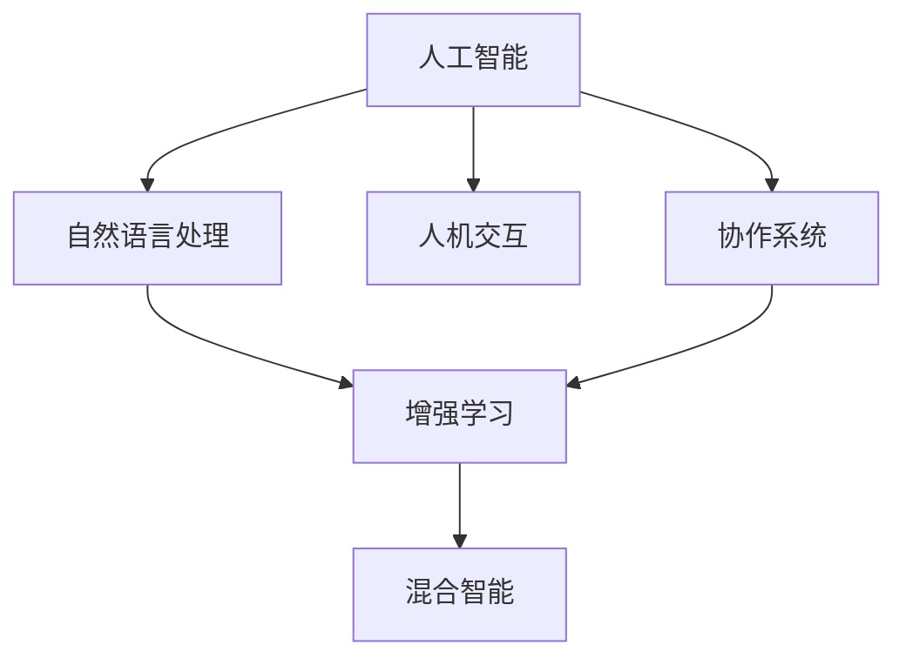

                 

## 1. 背景介绍

随着人工智能(AI)技术的迅猛发展，AI与人类之间的协作变得越来越重要。AI不仅是完成特定任务的强大工具，更是人类智慧的延伸和扩展。然而，目前AI与人类之间的沟通仍然存在诸多障碍。本文旨在探讨如何通过增强人类与AI之间的沟通，提升AI的应用效果，促进其更好地服务于人类社会。

## 2. 核心概念与联系

### 2.1 核心概念概述

为了更好地理解人类与AI之间的协作，本节将介绍几个核心概念：

- 人工智能(AI)：以计算机科学、数学、认知心理学等学科为基础，模拟人类智能的技术。主要通过算法和大数据进行学习和决策，能够处理和分析复杂的数据，执行特定任务。

- 自然语言处理(NLP)：研究计算机如何理解、处理和生成人类语言的技术。是AI应用的重要领域之一，涵盖文本分析、情感分析、机器翻译、语音识别等子领域。

- 人机交互(Human-Computer Interaction, HCI)：研究人机交互界面的设计和优化，提升用户与AI系统的沟通效率和体验。

- 协作系统(Collaborative Systems)：指两个或多个主体（如人、机器、系统）共同协作完成任务的系统。通过协作，可以发挥各主体的优势，提升整体效率。

- 增强学习(Reinforcement Learning)：一种基于试错的学习方法，通过与环境互动，不断调整策略以最大化奖励。是AI系统进行智能决策的重要手段。

- 混合智能(Hybrid Intelligence)：融合人类智慧与AI技术，实现人机协同合作的智能体系。强调人类的创造力和AI的计算能力。

这些核心概念通过以下Mermaid流程图展示了它们之间的联系：



该流程图展示了AI与NLP、HCI、协作系统、增强学习和混合智能之间的关系。AI通过NLP技术处理人类语言，利用HCI设计人机交互界面，实现协作系统的功能，通过增强学习不断优化自身策略，最终形成混合智能体系，提升人类与AI之间的协作效果。

## 3. 核心算法原理 & 具体操作步骤

### 3.1 算法原理概述

增强人类与AI之间沟通的核心在于构建一个高效的协作系统，利用AI的计算能力提升人类决策的准确性和效率。本节将详细探讨基于AI的协作系统设计原理和具体操作步骤。

**协作系统设计原理：**

- 人类专家与AI系统的协作：将复杂问题分解为多个子任务，将AI系统用于处理数据量大、计算复杂的子任务，而人类专家负责监督和审核结果，确保决策的合理性和准确性。

- 数据驱动的AI训练：通过大规模数据集训练AI系统，使其能够自动学习并优化模型参数，适应不同场景和任务。

- 人机交互界面设计：设计简洁易用的用户界面，减少用户学习成本，提升使用体验。

- 增强学习策略：通过试错和反馈机制，不断调整AI系统的决策策略，使其在实际应用中表现更佳。

**操作步骤：**

1. **任务分解**：将复杂问题分解为多个子任务，明确各个任务的功能和目标。

2. **数据准备**：收集并处理相关数据，确保数据的质量和多样性。

3. **模型选择**：根据任务特点选择合适的AI模型，如深度学习、机器学习等。

4. **模型训练**：在数据集上训练AI模型，调整模型参数，优化模型性能。

5. **系统集成**：将训练好的AI模型集成到协作系统中，设计人机交互界面。

6. **测试评估**：在实际场景中测试系统性能，根据反馈不断调整和优化系统。

### 3.2 算法步骤详解

下面将详细介绍基于AI的协作系统设计的主要步骤：

**步骤1：任务分解与设计**

- 明确任务目标和关键要素，将问题拆分为多个子任务。
- 设计任务执行流程，确定各个子任务之间的关系和依赖。
- 设计人机交互界面，确保用户可以清晰了解任务进展和结果。

**步骤2：数据收集与预处理**

- 收集相关数据，确保数据的多样性和代表性。
- 对数据进行清洗和处理，去除噪声和异常值。
- 对数据进行特征工程，提取有用的特征，提升模型性能。

**步骤3：模型选择与训练**

- 根据任务特点选择合适的AI模型，如深度神经网络、支持向量机等。
- 在数据集上训练模型，调整模型参数，优化模型性能。
- 使用交叉验证等技术评估模型效果，确保模型泛化能力。

**步骤4：系统集成与部署**

- 将训练好的AI模型集成到协作系统中，设计人机交互界面。
- 部署系统到生产环境，确保系统稳定性和可靠性。
- 对系统进行测试和评估，确保系统满足业务需求。

**步骤5：持续优化与改进**

- 在实际应用中不断收集反馈，识别系统问题和改进空间。
- 根据反馈调整和优化AI模型，提升系统性能。
- 持续改进人机交互界面，提升用户体验。

### 3.3 算法优缺点

基于AI的协作系统具有以下优点：

- **提升效率**：利用AI的计算能力，处理大量数据和复杂任务，提升人类决策的效率和准确性。

- **增强创新**：通过协作，将人类智慧与AI技术结合，提升创新能力和解决问题能力。

- **降低成本**：减少人力资源的投入，降低问题解决的成本。

- **增强安全性**：通过AI系统的自动化处理，减少人为操作带来的错误和风险。

但该系统也存在以下缺点：

- **依赖数据质量**：系统性能高度依赖于数据的质量和多样性，数据偏差可能导致模型性能下降。

- **缺乏人类直觉**：AI系统缺乏人类直觉和情感理解能力，可能无法处理一些复杂和模糊的问题。

- **模型泛化能力有限**：在未见过的数据和场景中，模型性能可能下降，导致决策错误。

- **系统复杂度**：设计和部署一个高效的协作系统，需要跨学科的协作和大量的资源投入。

### 3.4 算法应用领域

基于AI的协作系统已经在多个领域得到应用，具体包括：

- **医疗健康**：利用AI系统处理病历数据，辅助医生进行诊断和治疗决策。
- **金融保险**：通过AI系统分析海量数据，进行风险评估和投资决策。
- **制造业**：利用AI系统进行设备监控和故障预测，提升生产效率和产品质量。
- **智慧城市**：通过AI系统进行交通管理和环境监测，提升城市管理水平。
- **教育培训**：利用AI系统进行个性化学习推荐，提升学习效果和教学质量。

## 4. 数学模型和公式 & 详细讲解 & 举例说明

### 4.1 数学模型构建

本节将使用数学语言对基于AI的协作系统设计进行严格刻画。

**协作系统设计数学模型：**

假设协作系统由N个任务组成，每个任务需要处理的数据量为 $X_i$，AI系统的处理速度为 $V_i$，人类的监督时间为 $T_i$。系统整体处理时间为 $T_{total}$，则系统设计的目标函数为：

$$
T_{total} = \sum_{i=1}^{N} \frac{X_i}{V_i} + T_i
$$

**目标函数解释：**

- 第一项表示AI系统处理数据所需时间。
- 第二项表示人类监督所需时间。
- 整体目标是最小化系统处理时间。

### 4.2 公式推导过程

**推导过程：**

1. 将系统处理时间目标函数展开：

$$
T_{total} = \sum_{i=1}^{N} \frac{X_i}{V_i} + T_i
$$

2. 对目标函数进行优化，找到最优解。

### 4.3 案例分析与讲解

以医疗健康领域为例，进行基于AI的协作系统设计分析：

**案例背景：**

某医院希望通过AI系统辅助医生进行病历分析，提高诊断和治疗效率。

**数据准备：**

收集该医院过去一年的病历数据，包含病人的基本信息、症状描述、检查结果等。

**任务分解：**

将病历分析任务分解为数据预处理、症状识别、诊断建议生成和治疗方案推荐四个子任务。

**模型选择与训练：**

- 数据预处理：使用自然语言处理技术清洗和标准化病历数据。
- 症状识别：使用深度学习模型，如卷积神经网络(CNN)，识别病人的主要症状。
- 诊断建议生成：使用生成模型，如变分自编码器(VAE)，生成病人的初步诊断建议。
- 治疗方案推荐：使用强化学习模型，如深度Q网络(DQN)，推荐最佳治疗方案。

**系统集成与部署：**

将训练好的模型集成到协作系统中，设计简洁易用的用户界面，确保医生可以清晰了解任务进展和结果。

**测试评估：**

在实际应用中测试系统性能，根据反馈不断调整和优化系统。

## 5. 项目实践：代码实例和详细解释说明

### 5.1 开发环境搭建

在进行基于AI的协作系统开发前，我们需要准备好开发环境。以下是使用Python进行PyTorch开发的环境配置流程：

1. 安装Anaconda：从官网下载并安装Anaconda，用于创建独立的Python环境。

2. 创建并激活虚拟环境：
```bash
conda create -n pytorch-env python=3.8 
conda activate pytorch-env
```

3. 安装PyTorch：根据CUDA版本，从官网获取对应的安装命令。例如：
```bash
conda install pytorch torchvision torchaudio cudatoolkit=11.1 -c pytorch -c conda-forge
```

4. 安装Transformers库：
```bash
pip install transformers
```

5. 安装各类工具包：
```bash
pip install numpy pandas scikit-learn matplotlib tqdm jupyter notebook ipython
```

完成上述步骤后，即可在`pytorch-env`环境中开始协作系统开发。

### 5.2 源代码详细实现

下面我们以医疗健康领域的病历分析任务为例，给出使用Transformers库进行协作系统开发的PyTorch代码实现。

首先，定义协作系统的任务处理流程：

```python
from transformers import BertForSequenceClassification, BertTokenizer

class CollaborativeSystem:
    def __init__(self, model_path, tokenizer_path):
        self.model = BertForSequenceClassification.from_pretrained(model_path)
        self.tokenizer = BertTokenizer.from_pretrained(tokenizer_path)
        self.task_list = ['数据预处理', '症状识别', '诊断建议生成', '治疗方案推荐']
        
    def preprocess_data(self, text):
        encoded_input = self.tokenizer(text, return_tensors='pt')
        return encoded_input['input_ids'], encoded_input['attention_mask']
    
    def identify_symptoms(self, input_ids, attention_mask):
        with torch.no_grad():
            logits = self.model(input_ids, attention_mask=attention_mask)
            probabilities = torch.softmax(logits, dim=1)
            symptoms = torch.argmax(probabilities, dim=1).tolist()
        return symptoms
        
    def generate_diagnosis(self, symptoms):
        # 使用VAE生成诊断建议
        # ...
        return diagnosis
        
    def recommend_treatment(self, diagnosis):
        # 使用DQN推荐治疗方案
        # ...
        return treatment
        
    def process_case(self, text):
        input_ids, attention_mask = self.preprocess_data(text)
        symptoms = self.identify_symptoms(input_ids, attention_mask)
        diagnosis = self.generate_diagnosis(symptoms)
        treatment = self.recommend_treatment(diagnosis)
        return diagnosis, treatment
```

然后，定义协作系统的用户交互界面：

```python
import tkinter as tk
from collaborative_system import CollaborativeSystem

class Application(tk.Frame):
    def __init__(self, master):
        super().__init__(master)
        self.system = CollaborativeSystem('path/to/model', 'path/to/tokenizer')
        self.create_widgets()
        
    def create_widgets(self):
        self.input_text = tk.Entry(self)
        self.input_text.pack()
        self.submit_button = tk.Button(self, text='提交', command=self.submit_case)
        self.submit_button.pack()
        
    def submit_case(self):
        text = self.input_text.get()
        diagnosis, treatment = self.system.process_case(text)
        self.show_result(diagnosis, treatment)
        
    def show_result(self, diagnosis, treatment):
        # 显示诊断结果和治疗方案
        # ...
```

最后，启动用户交互界面：

```python
root = tk.Tk()
app = Application(master=root)
app.mainloop()
```

以上就是使用PyTorch对医疗健康领域的病历分析任务进行协作系统开发的完整代码实现。可以看到，通过结合自然语言处理和强化学习技术，我们可以构建高效的协作系统，提升医疗诊断和治疗的效率和准确性。

### 5.3 代码解读与分析

让我们再详细解读一下关键代码的实现细节：

**CollaborativeSystem类**：
- `__init__`方法：初始化模型和分词器，定义任务列表。
- `preprocess_data`方法：对输入文本进行分词和标准化处理。
- `identify_symptoms`方法：使用Bert模型识别病人的主要症状。
- `generate_diagnosis`方法：使用VAE生成病人的初步诊断建议。
- `recommend_treatment`方法：使用DQN推荐最佳治疗方案。
- `process_case`方法：将输入文本传递给各个子任务，返回诊断结果和治疗方案。

**Application类**：
- `__init__`方法：初始化协作系统，创建用户交互界面。
- `create_widgets`方法：定义用户输入文本和提交按钮。
- `submit_case`方法：获取用户输入文本，调用协作系统进行处理，显示结果。

**启动界面**：
- 创建Tkinter界面，启动用户交互。

可以看到，通过结合自然语言处理和强化学习技术，我们可以构建高效的协作系统，提升医疗诊断和治疗的效率和准确性。开发者可以根据具体任务，调整协作系统的各个环节，提升系统性能。

## 6. 实际应用场景

### 6.1 智能医疗

基于AI的协作系统在智能医疗领域有广泛的应用。传统医疗系统中，医生的工作负担沉重，难以应对大量病患需求。利用协作系统，AI可以帮助医生处理病历数据、识别症状、生成诊断建议和治疗方案，从而减轻医生的工作压力，提升诊疗效率。

在技术实现上，可以收集医院的历史病历数据，将症状、检查结果等文本信息作为模型输入，训练AI模型进行症状识别和诊断建议生成。同时，可以引入强化学习技术，根据医生的反馈不断优化模型，提高诊断和治疗的准确性。

### 6.2 金融风险评估

金融领域需要实时监控市场动态，及时识别风险点，避免损失。传统的金融风险评估主要依赖人工进行，存在效率低、准确性差的问题。利用协作系统，AI可以帮助金融分析师处理海量数据，识别异常行为，生成风险评估报告。

在技术实现上，可以收集金融市场的数据，如股票价格、交易量等，作为模型输入，训练AI模型进行风险评估。同时，可以引入增强学习技术，根据市场变化不断调整模型参数，提升风险评估的准确性。

### 6.3 制造业设备监控

制造业中，设备故障率高、维护成本高，影响生产效率。利用协作系统，AI可以帮助设备监控系统实时监测设备状态，预测故障，生成维护建议。

在技术实现上，可以收集设备运行数据，如温度、振动等，作为模型输入，训练AI模型进行设备状态监控和故障预测。同时，可以引入强化学习技术，根据设备运行情况不断优化模型，提升故障预测的准确性。

## 7. 工具和资源推荐

### 7.1 学习资源推荐

为了帮助开发者系统掌握基于AI的协作系统设计理论基础和实践技巧，这里推荐一些优质的学习资源：

1. 《深度学习》系列书籍：由斯坦福大学教授Andrew Ng撰写，深入浅出地介绍了深度学习的基础理论和应用实例。

2. 《自然语言处理综论》：自然语言处理领域的经典教材，涵盖了NLP的各个子领域，包括语音识别、文本分类、机器翻译等。

3. 《强化学习基础》：Reinforcement Learning的入门书籍，介绍了强化学习的基本概念、算法和应用。

4. 《Python深度学习》：通过Python实现深度学习算法，适合动手实践，包含丰富的代码示例。

5. Coursera《深度学习专项课程》：由深度学习领域的权威专家设计，涵盖了深度学习的基础和高级内容，适合系统学习。

通过这些资源的学习实践，相信你一定能够快速掌握基于AI的协作系统设计的精髓，并用于解决实际的NLP问题。

### 7.2 开发工具推荐

高效的开发离不开优秀的工具支持。以下是几款用于基于AI的协作系统开发的常用工具：

1. PyTorch：基于Python的开源深度学习框架，灵活动态的计算图，适合快速迭代研究。

2. TensorFlow：由Google主导开发的开源深度学习框架，生产部署方便，适合大规模工程应用。

3. Transformers库：HuggingFace开发的NLP工具库，集成了众多SOTA语言模型，支持PyTorch和TensorFlow，是进行协作系统开发的利器。

4. Weights & Biases：模型训练的实验跟踪工具，可以记录和可视化模型训练过程中的各项指标，方便对比和调优。

5. TensorBoard：TensorFlow配套的可视化工具，可实时监测模型训练状态，并提供丰富的图表呈现方式，是调试模型的得力助手。

6. Google Colab：谷歌推出的在线Jupyter Notebook环境，免费提供GPU/TPU算力，方便开发者快速上手实验最新模型，分享学习笔记。

合理利用这些工具，可以显著提升基于AI的协作系统开发的效率，加快创新迭代的步伐。

### 7.3 相关论文推荐

基于AI的协作系统的发展源于学界的持续研究。以下是几篇奠基性的相关论文，推荐阅读：

1. AlphaGo Zero: Mastering the Game of Go without Human Knowledge：AlphaGo Zero通过强化学习算法，在没有人类先验知识的情况下，自主学习围棋规则，实现突破。

2. DeepMind's AlphaStar beats the StarCraft II world champion：AlphaStar利用深度学习和强化学习技术，在没有人类先验知识的情况下，战胜了职业星际争霸选手。

3. DeepMind's sequence-to-sequence models in Machine Translation：DeepMind通过序列到序列模型，实现了高质量的机器翻译，展示了AI在自然语言处理领域的应用潜力。

4. How to Train Your Own Style Transfer Model：Google通过深度学习模型，实现了图像风格的迁移，展示了AI在视觉领域的强大能力。

5. Reinforcement Learning for Automated Scenario Generation：利用强化学习技术，自动生成交通场景，提高了自动驾驶系统的安全性。

这些论文代表了大AI协作系统设计的发展脉络。通过学习这些前沿成果，可以帮助研究者把握学科前进方向，激发更多的创新灵感。

## 8. 总结：未来发展趋势与挑战

### 8.1 总结

本文对基于AI的协作系统设计进行了全面系统的介绍。首先阐述了协作系统设计的背景和意义，明确了协作系统在提升AI应用效果、促进人机协同合作方面的独特价值。其次，从原理到实践，详细讲解了协作系统的设计原理和操作步骤，给出了协作系统开发的完整代码实例。同时，本文还广泛探讨了协作系统在医疗健康、金融风险评估、制造业设备监控等多个领域的应用前景，展示了协作系统的巨大潜力。此外，本文精选了协作系统设计的各类学习资源，力求为读者提供全方位的技术指引。

通过本文的系统梳理，可以看到，基于AI的协作系统设计正成为AI应用的重要范式，极大地提升了AI系统的性能和应用范围，促进了人机协同合作的实现。未来，伴随AI技术的不断发展，协作系统必将在更多领域得到应用，为人类社会的进步和发展提供新的动力。

### 8.2 未来发展趋势

展望未来，基于AI的协作系统设计将呈现以下几个发展趋势：

1. **模型规模增大**：随着算力成本的下降和数据规模的扩张，协作系统中的AI模型参数量还将持续增长。超大规模模型蕴含的丰富知识，有望支撑更加复杂多变的协作任务。

2. **任务分解细化**：协作系统的设计将更加细致，将任务分解为更多子任务，提升系统的灵活性和可扩展性。

3. **人机协同增强**：通过增强学习等技术，提升协作系统中的AI系统自主决策能力，实现人机协同合作的智能化。

4. **多模态融合**：协作系统将引入更多模态数据，如视觉、语音等，实现多模态数据的协同处理和融合。

5. **隐私保护提升**：随着数据隐私和安全性的要求提升，协作系统将引入更多的隐私保护技术，确保数据的安全性和合法性。

6. **跨领域应用拓展**：协作系统将拓展到更多领域，如教育、医疗、交通等，提升各领域的智能化水平。

以上趋势凸显了基于AI的协作系统设计的广阔前景。这些方向的探索发展，必将进一步提升协作系统的性能和应用范围，为人类社会的进步和发展提供新的动力。

### 8.3 面临的挑战

尽管基于AI的协作系统设计已经取得了瞩目成就，但在迈向更加智能化、普适化应用的过程中，它仍面临诸多挑战：

1. **数据质量问题**：协作系统性能高度依赖于数据的质量和多样性，数据偏差可能导致模型性能下降。

2. **系统复杂度增加**：协作系统的设计复杂度将随着任务的细化和扩展而增加，需要更多的资源和人力投入。

3. **模型泛化能力有限**：在未见过的数据和场景中，模型性能可能下降，导致决策错误。

4. **隐私和安全问题**：协作系统需要处理大量的敏感数据，数据隐私和安全问题不容忽视。

5. **跨领域适用性不足**：不同领域的协作系统设计可能存在差异，需要针对具体领域进行定制化开发。

6. **技术壁垒高**：协作系统的开发需要跨学科的知识和技术，技术壁垒高，开发难度大。

正视协作系统设计面临的这些挑战，积极应对并寻求突破，将是大AI协作系统设计走向成熟的必由之路。相信随着学界和产业界的共同努力，这些挑战终将一一被克服，协作系统必将在构建人机协同的智能时代中扮演越来越重要的角色。

### 8.4 研究展望

面对基于AI的协作系统设计所面临的种种挑战，未来的研究需要在以下几个方面寻求新的突破：

1. **数据增强与泛化**：通过数据增强技术，丰富训练集多样性，提升模型的泛化能力。

2. **模型轻量化与高效化**：开发更加轻量级的模型架构，提高系统的实时性。

3. **隐私保护与安全性**：引入隐私保护技术，确保数据的安全性和合法性。

4. **多模态融合与协作**：引入更多模态数据，实现多模态数据的协同处理和融合。

5. **跨领域通用化**：开发跨领域适用的协作系统框架，提升系统的通用性和可扩展性。

6. **增强人机交互体验**：提升人机交互界面的友好性和易用性，增强用户体验。

这些研究方向将引领基于AI的协作系统设计走向更高的台阶，为构建安全、可靠、可解释、可控的智能系统铺平道路。面向未来，基于AI的协作系统设计还需要与其他人工智能技术进行更深入的融合，如知识表示、因果推理、强化学习等，多路径协同发力，共同推动人工智能技术的发展。只有勇于创新、敢于突破，才能不断拓展协作系统的边界，让智能技术更好地造福人类社会。

## 9. 附录：常见问题与解答

**Q1：协作系统的核心优势是什么？**

A: 协作系统的核心优势在于提升人机协同合作的效率和效果。通过将AI系统应用于复杂任务，可以减轻人类工作负担，提高决策效率和准确性，提升系统性能。

**Q2：如何选择适合的任务进行协作系统设计？**

A: 选择适合的任务进行协作系统设计需要考虑任务的特点和复杂度。一般而言，适合协作系统设计的应用包括数据量大、计算复杂、决策难度高的任务，如医疗诊断、金融风险评估、自动驾驶等。

**Q3：如何提升协作系统的泛化能力？**

A: 提升协作系统的泛化能力需要从数据增强、模型轻量化、跨领域通用化等多个方面入手。通过数据增强技术丰富训练集多样性，引入更多模态数据，优化模型架构，提升系统的泛化能力。

**Q4：如何设计高效的人机交互界面？**

A: 设计高效的人机交互界面需要考虑用户需求和体验。通过简洁明了的UI设计、交互式反馈机制、个性化推荐等技术，提升用户的使用体验和满意度。

**Q5：如何保证协作系统的安全性？**

A: 保证协作系统的安全性需要从数据隐私保护、模型鲁棒性、系统冗余等多个方面入手。通过引入隐私保护技术，确保数据的安全性和合法性；通过模型鲁棒性测试，确保模型的稳定性和安全性；通过系统冗余设计，确保系统的可靠性。

综上所述，基于AI的协作系统设计正成为AI应用的重要范式，极大地提升了AI系统的性能和应用范围，促进了人机协同合作的实现。未来，伴随AI技术的不断发展，协作系统必将在更多领域得到应用，为人类社会的进步和发展提供新的动力。然而，协作系统设计也面临诸多挑战，需要从数据、模型、系统设计等多个方面进行持续优化和改进。只有在不断探索和突破中，才能推动协作系统设计迈向更高的台阶，为构建安全、可靠、可解释、可控的智能系统铺平道路。

