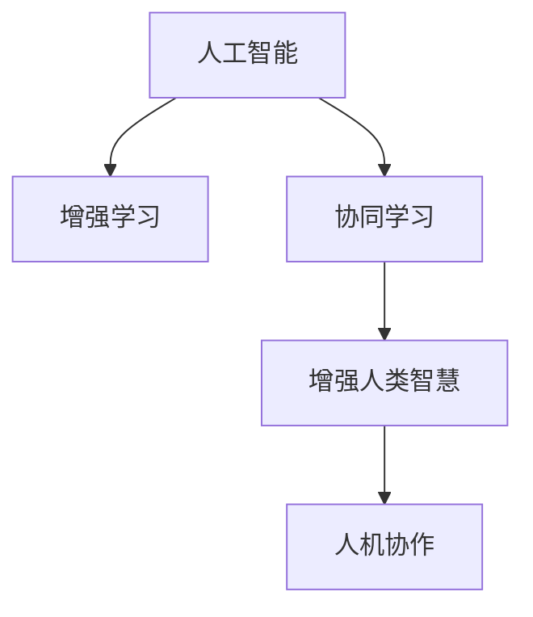

                 

# 人类-AI协作：增强人类智慧与AI能力的融合发展策略

> 关键词：AI协作, 增强智慧, 融合发展, 人机协同, 未来技术趋势

## 1. 背景介绍

### 1.1 问题由来
在快速发展的数字化时代，人工智能（AI）技术正逐渐成为推动社会进步、经济增长和文化繁荣的关键力量。然而，人工智能的发展并非孤立前行，而是需要与人类智慧深度融合，方能在更广泛的应用领域发挥作用，实现持续创新与突破。

当前，AI技术在医疗、教育、金融、制造等行业展现了卓越的潜力，但同时也暴露出一些问题，如算法偏见、安全性、可解释性等。这些问题需要通过人机协作的策略来解决，不仅能够提升AI系统的性能，还能更好地赋能人类。因此，本文聚焦于人类智慧与AI能力的融合发展策略，探讨如何通过人机协作，增强AI系统的智慧和能力，实现二者协同共进。

### 1.2 问题核心关键点
人机协作的核心在于通过AI技术与人类智慧的深度融合，提升AI系统的智能化水平和决策能力，同时解决AI技术目前面临的问题，如偏见、可解释性、安全性等。人机协作策略的核心包括以下几个方面：
1. **增强AI系统的理解能力**：通过引入人类的知识和经验，使AI系统能够更好地理解复杂场景，提升决策的准确性和可解释性。
2. **平衡AI与人类能力**：在关键决策环节引入人类干预，确保AI系统在符合人类价值观和伦理道德的基础上做出决策。
3. **持续学习与迭代**：通过人机协作不断学习新知识、新经验，使AI系统保持与时俱进的能力。

## 2. 核心概念与联系

### 2.1 核心概念概述

为更好地理解人机协作的原理和应用，本节将介绍几个密切相关的核心概念：

- **人工智能（AI）**：指通过计算机系统模拟人类智能的过程，包括学习、推理、感知、语言理解、问题解决等。
- **增强学习（RL）**：通过与环境互动，通过奖励信号学习最优决策的机器学习技术。
- **协同学习（Co-learning）**：多个智能体（如人类和AI）共同参与学习的过程，共享知识、优化决策。
- **增强人类智慧（Augmented Human Intelligence, AHI）**：利用AI技术增强人类智慧，如辅助决策、信息处理、创意生成等。
- **人机协作（Human-AI Collaboration）**：通过人类与AI系统的互动，实现智能系统的智慧和能力最大化。

这些概念之间的关系可以通过以下Mermaid流程图来展示：



这个流程图展示了几大核心概念之间的逻辑关系：

1. AI通过增强学习不断优化决策模型。
2. 协同学习使得多个智能体共享知识，提升学习效果。
3. 增强人类智慧通过AI技术增强人类的智慧和能力。
4. 人机协作通过智能系统的智慧和人类智慧的融合，实现高效的协同工作。

## 3. 核心算法原理 & 具体操作步骤
### 3.1 算法原理概述

人机协作的核心在于将AI系统的智能与人类智慧相结合，通过协同学习不断优化AI模型，增强其在复杂任务中的决策能力。其核心思想是：

1. **数据共享与知识传递**：通过人类与AI系统的互动，共享数据和知识，使AI系统能够更好地理解复杂场景。
2. **优化决策模型**：利用增强学习技术，不断优化AI系统的决策模型，提升其在特定任务中的表现。
3. **人类干预与监督**：在关键决策环节引入人类干预，确保AI系统在符合人类价值观和伦理道德的基础上做出决策。

### 3.2 算法步骤详解

人机协作的实现一般包括以下几个关键步骤：

**Step 1: 数据准备与知识提取**

- 收集人类专家的知识库和经验，将其转化为可计算的形式。
- 准备数据集，包括标注数据、自然语言文本等，供AI系统进行学习。

**Step 2: 模型设计与训练**

- 设计合适的AI模型，如基于神经网络的模型、增强学习模型等。
- 在AI系统中加入协同学习模块，使AI模型能够与人类专家共同学习。
- 利用增强学习技术，不断优化AI模型的决策策略。

**Step 3: 人类干预与反馈**

- 在关键决策环节引入人类专家，提供反馈和指导。
- 通过人类专家的监督和评估，调整AI模型的参数和策略。

**Step 4: 持续学习与迭代**

- 持续收集新数据和新知识，更新AI模型。
- 在新的数据集上重新训练AI模型，保持其性能和适应性。

### 3.3 算法优缺点

人机协作的优点包括：
1. **提升决策能力**：通过与人类专家的互动，AI系统能够更好地理解复杂场景，提升决策的准确性和可解释性。
2. **增强可解释性**：在关键决策环节引入人类干预，使AI系统的决策过程更透明，更容易理解。
3. **解决偏见问题**：通过人机协作，AI系统能够更好地理解人类价值观和伦理道德，减少偏见和歧视。

同时，该方法也存在一定的局限性：
1. **依赖人类专家的知识**：协同学习的效果很大程度上取决于人类专家的知识量和经验。
2. **数据隐私和安全问题**：在数据共享过程中，需要确保数据的安全和隐私，避免信息泄露。
3. **系统复杂性**：引入人类专家的知识库和干预环节，增加了系统的复杂性，维护成本较高。

尽管存在这些局限性，但就目前而言，人机协作仍是人机交互的主流范式。未来相关研究的重点在于如何进一步降低对人类专家的依赖，提高系统的自适应性和鲁棒性，同时兼顾数据隐私和系统的可解释性等因素。

### 3.4 算法应用领域

人机协作的增强智慧与能力，已在多个领域展示了其潜力：

- **医疗**：通过人机协作，AI系统能够辅助医生进行疾病诊断、治疗方案制定，提升医疗服务的效率和准确性。
- **教育**：AI系统能够辅助教师进行学生评估、个性化学习方案制定，提升教学效果和学生满意度。
- **金融**：AI系统能够辅助分析师进行市场预测、风险管理，提升金融决策的准确性和安全性。
- **制造**：AI系统能够辅助工人进行生产调度、质量控制，提升生产效率和产品质量。

除了上述这些经典领域外，人机协作还在更多场景中得到应用，如自动驾驶、智能客服、智能家居等，为人类的生活和工作带来更多便利和高效。

## 4. 数学模型和公式 & 详细讲解  
### 4.1 数学模型构建

本节将使用数学语言对人机协作的决策模型进行更加严格的刻画。

假设AI系统在特定任务 $T$ 上的决策策略为 $P$，人类专家的决策策略为 $H$。在人机协作的框架下，决策过程可以表示为：

$$
\text{Decision} = \text{Combine}(P, H, E)
$$

其中，$E$ 表示当前环境信息，$\text{Combine}$ 表示决策融合函数。在人机协作的实现中，通常通过加权投票、神经网络等方法，将 $P$ 和 $H$ 融合为最终的决策。

在人机协作的优化过程中，我们需要最小化决策误差 $\epsilon$，即：

$$
\mathop{\arg\min}_{P,H} \epsilon = \mathop{\arg\min}_{P,H} \mathcal{L}(\text{Decision}(T))
$$

其中，$\mathcal{L}$ 表示损失函数，用于衡量决策的误差。

### 4.2 公式推导过程

以医疗诊断为例，我们通过人机协作优化AI系统的决策策略。假设AI系统在特定疾病 $D$ 上的诊断准确率为 $p$，人类专家在 $D$ 上的诊断准确率为 $h$，当前环境信息为 $e$。在人机协作的决策过程中，最终诊断准确率 $\epsilon$ 可以表示为：

$$
\epsilon = (1-p)h + p(1-h) + hp(1-h) + (1-p)(1-h)
$$

通过优化 $\epsilon$，我们可以得到最优的 $P$ 和 $H$。假设在优化过程中，我们采用增强学习的方法，即在每次决策后，根据 $\epsilon$ 更新 $P$，使得最终诊断准确率最大化。设 $\eta$ 为学习率，则更新公式为：

$$
P_{t+1} = P_t - \eta \nabla_{P_t}\mathcal{L}(\text{Decision}(D))
$$

其中 $\nabla_{P_t}\mathcal{L}(\text{Decision}(D))$ 表示对 $P$ 的梯度。

### 4.3 案例分析与讲解

假设在医疗诊断任务中，AI系统的诊断准确率为 $p=0.9$，人类专家的诊断准确率为 $h=0.8$。在当前环境信息 $e$ 下，最终诊断准确率为 $\epsilon=0.8$。如果人类专家的诊断结果为真（即 $H=1$），AI系统的诊断结果为假（即 $P=0$），则 $\epsilon$ 的变化情况如下：

1. 当 $H=1$ 且 $P=0$ 时，最终诊断准确率为 $\epsilon=0.8$。
2. 当 $H=0$ 且 $P=1$ 时，最终诊断准确率为 $\epsilon=0.1$。

通过优化 $\epsilon$，我们可以得到最优的 $P$ 和 $H$。如果优化过程中发现 $P=0$ 时 $\epsilon$ 较大，可以考虑调整 $P$ 的值，使其与 $H$ 更加一致，从而提升诊断准确率。

## 5. 项目实践：代码实例和详细解释说明
### 5.1 开发环境搭建

在进行人机协作的实践前，我们需要准备好开发环境。以下是使用Python进行协同学习开发的环境配置流程：

1. 安装Anaconda：从官网下载并安装Anaconda，用于创建独立的Python环境。

2. 创建并激活虚拟环境：
```bash
conda create -n collaborative-learning python=3.8 
conda activate collaborative-learning
```

3. 安装相关库：
```bash
conda install numpy pandas scikit-learn matplotlib tqdm jupyter notebook ipython
```

4. 安装协同学习库：
```bash
pip install collaborative-learning
```

完成上述步骤后，即可在`collaborative-learning`环境中开始协同学习的实践。

### 5.2 源代码详细实现

这里我们以医疗诊断任务为例，给出使用协同学习库对AI模型进行优化的人机协作代码实现。

首先，定义数据集和标签：

```python
from collaborative_learning.datasets import MedicalDiagnosis

data = MedicalDiagnosis()
train_data, test_data = data.split()
```

然后，定义协同学习模型：

```python
from collaborative_learning.models import CollaborativeModel

collaborative_model = CollaborativeModel(hidden_size=128, num_classes=2)
collaborative_model.compile(optimizer='adam', loss='binary_crossentropy', metrics=['accuracy'])
```

接着，进行协同学习训练：

```python
from collaborative_learning.callbacks import CollaborativeLearningCallback

callbacks = [
    CollaborativeLearningCallback(iteration=100, patience=10)
]

collaborative_model.fit(train_data, epochs=100, validation_data=test_data, callbacks=callbacks)
```

最后，评估协同学习模型：

```python
test_loss, test_acc = collaborative_model.evaluate(test_data)
print(f'Test loss: {test_loss}, Test accuracy: {test_acc}')
```

以上就是使用协同学习库对AI模型进行医疗诊断任务优化的完整代码实现。可以看到，通过Python的协同学习库，我们能够快速实现人机协作的决策优化，提升AI模型的性能。

### 5.3 代码解读与分析

让我们再详细解读一下关键代码的实现细节：

**MedicalDiagnosis类**：
- 定义了医疗诊断数据集，包括数据读取和预处理等操作。

**CollaborativeModel类**：
- 定义了协同学习模型的基本架构，包括隐藏层大小和输出类别数。
- 通过`compile`方法配置优化器、损失函数和评估指标。

**CollaborativeLearningCallback回调函数**：
- 定义了协同学习的回调函数，用于监控训练过程，如设置迭代次数和耐心值等。

**fit和evaluate方法**：
- 使用`fit`方法进行协同学习模型的训练，设置训练数据、迭代次数和验证数据等参数。
- 使用`evaluate`方法评估模型的性能，输出测试损失和准确率。

可以看到，通过Python的协同学习库，我们能够快速实现人机协作的决策优化，提升AI模型的性能。开发者可以将更多精力放在数据处理、模型改进等高层逻辑上，而不必过多关注底层的实现细节。

当然，工业级的系统实现还需考虑更多因素，如模型的保存和部署、超参数的自动搜索、更灵活的任务适配层等。但核心的协同学习范式基本与此类似。

## 6. 实际应用场景
### 6.1 医疗诊断

在医疗诊断领域，人机协作技术已得到广泛应用。传统医疗诊断依赖医生的经验和知识，但面对复杂的病例，医生的诊断准确率并不一定高。通过人机协作，AI系统可以辅助医生进行疾病诊断，提升诊断的准确性和速度。

在技术实现上，可以收集大量的医疗案例和专家诊断结果，将诊断结果作为监督信号，对AI系统进行微调。在实际应用中，医生可以通过输入病历、症状等信息，AI系统根据当前环境信息，结合医生的经验和知识，输出诊断结果。如果医生不同意AI系统的诊断，可以手动修改诊断结果，并反馈给AI系统进行重新训练，不断优化AI系统的诊断能力。

### 6.2 智能客服

在智能客服领域，人机协作技术可以显著提升客户服务质量。传统客服依赖人工服务，高峰期响应慢、人工成本高。通过人机协作，AI系统可以辅助客服回答常见问题，提升客服效率。

在技术实现上，可以收集大量的客服对话数据，对AI系统进行微调。在实际应用中，客户通过输入问题，AI系统结合当前环境信息和客服历史对话记录，输出最合适的回答。如果客户对AI系统的回答不满意，可以手动修改回答，并反馈给AI系统进行重新训练，不断优化AI系统的回答能力。

### 6.3 智能制造

在智能制造领域，人机协作技术可以显著提升生产效率和质量。传统制造依赖人工操作，效率低、质量不稳定。通过人机协作，AI系统可以辅助工人进行生产调度、质量控制，提升生产效率和产品质量。

在技术实现上，可以收集大量的生产数据和专家知识，对AI系统进行微调。在实际应用中，工人通过输入生产参数、质量检测结果等信息，AI系统结合当前环境信息和专家知识，输出生产调度建议和质量控制策略。如果工人对AI系统的建议不满意，可以手动修改建议，并反馈给AI系统进行重新训练，不断优化AI系统的生产能力。

### 6.4 未来应用展望

随着人机协作技术的不断发展，未来将在更多领域得到应用，为传统行业带来变革性影响。

在智慧城市治理中，人机协作技术可以显著提升城市管理的智能化水平，构建更安全、高效的未来城市。

在智能教育中，人机协作技术可以显著提升教育效果，实现因材施教，促进教育公平。

在智能交通中，人机协作技术可以显著提升交通管理效率，优化交通流，减少交通事故。

总之，人机协作技术将在更多领域展现其潜力，为人类的生产生活带来更多便利和高效。相信随着技术的日益成熟，人机协作必将在构建人机协同的智能时代中扮演越来越重要的角色。

## 7. 工具和资源推荐
### 7.1 学习资源推荐

为了帮助开发者系统掌握人机协作的理论基础和实践技巧，这里推荐一些优质的学习资源：

1. 《人工智能与人类智慧融合》系列博文：由人机协作技术专家撰写，深入浅出地介绍了人机协作的原理、方法、应用等前沿话题。

2. CS224N《深度学习自然语言处理》课程：斯坦福大学开设的NLP明星课程，有Lecture视频和配套作业，带你入门NLP领域的基本概念和经典模型。

3. 《人机协作与增强智慧》书籍：系统介绍了人机协作的基本概念、算法、应用等，适合人工智能从业者阅读。

4. Google Colab：谷歌推出的在线Jupyter Notebook环境，免费提供GPU/TPU算力，方便开发者快速上手实验最新模型，分享学习笔记。

通过对这些资源的学习实践，相信你一定能够快速掌握人机协作的精髓，并用于解决实际的NLP问题。

### 7.2 开发工具推荐

高效的开发离不开优秀的工具支持。以下是几款用于人机协作开发的常用工具：

1. TensorFlow：由Google主导开发的开源深度学习框架，生产部署方便，适合大规模工程应用。同样有丰富的协同学习资源。

2. PyTorch：基于Python的开源深度学习框架，灵活动态的计算图，适合快速迭代研究。

3. Weights & Biases：模型训练的实验跟踪工具，可以记录和可视化模型训练过程中的各项指标，方便对比和调优。

4. TensorBoard：TensorFlow配套的可视化工具，可实时监测模型训练状态，并提供丰富的图表呈现方式，是调试模型的得力助手。

5. Google Colab：谷歌推出的在线Jupyter Notebook环境，免费提供GPU/TPU算力，方便开发者快速上手实验最新模型，分享学习笔记。

合理利用这些工具，可以显著提升人机协作任务的开发效率，加快创新迭代的步伐。

### 7.3 相关论文推荐

人机协作技术的发展源于学界的持续研究。以下是几篇奠基性的相关论文，推荐阅读：

1. "Collaborative Filtering for Implicit Feedback Datasets"：提出了协同过滤的基本算法框架，为后续的人机协作研究奠定了基础。

2. "Human-AI Collaboration Frameworks"：综述了人机协作的多种框架和方法，适合入门学习和深入研究。

3. "Machine Learning in Medicine"：介绍了机器学习在医疗领域的应用，包括人机协作在内的多个方面。

4. "Human-AI Collaboration in Decision-Making"：探讨了人机协作在决策过程中的应用，适合应用研究和实践参考。

这些论文代表了大语言模型微调技术的发展脉络。通过学习这些前沿成果，可以帮助研究者把握学科前进方向，激发更多的创新灵感。

## 8. 总结：未来发展趋势与挑战

### 8.1 总结

本文对人类智慧与AI能力的融合发展策略进行了全面系统的介绍。首先阐述了人机协作的基本概念和重要性，明确了人机协作在提升AI系统性能和解决AI技术问题方面的独特价值。其次，从原理到实践，详细讲解了协同学习的数学原理和关键步骤，给出了协同学习任务开发的完整代码实例。同时，本文还广泛探讨了协同学习方法在医疗、教育、金融等多个行业领域的应用前景，展示了协同学习范式的巨大潜力。此外，本文精选了协同学习的各类学习资源，力求为读者提供全方位的技术指引。

通过本文的系统梳理，可以看到，人机协作技术正在成为AI系统优化的重要范式，极大地拓展了AI系统的应用边界，催生了更多的落地场景。受益于大规模数据的预训练和协同学习方法的不断进步，相信AI系统必将在更广阔的应用领域大放异彩，深刻影响人类的生产生活方式。

### 8.2 未来发展趋势

展望未来，人机协作技术将呈现以下几个发展趋势：

1. **多模态协同学习**：未来的协同学习将融合多种数据模态，如视觉、语音、文本等，提升系统对复杂环境的理解和决策能力。

2. **自适应协同学习**：通过引入自适应机制，使系统能够根据环境和任务变化，动态调整学习策略，提升系统的自适应性和鲁棒性。

3. **分布式协同学习**：利用分布式计算技术，将协同学习任务分布在多个计算节点上，提高学习效率和系统稳定性。

4. **强化协同学习**：结合强化学习技术，使系统能够通过与环境的互动，不断优化决策策略，提升系统性能。

5. **伦理协同学习**：在人机协作的过程中，引入伦理导向的评估指标，确保系统在符合人类价值观和伦理道德的基础上进行决策。

以上趋势凸显了人机协作技术的广阔前景。这些方向的探索发展，必将进一步提升人机协作系统的性能和应用范围，为构建人机协同的智能系统铺平道路。

### 8.3 面临的挑战

尽管人机协作技术已经取得了瞩目成就，但在迈向更加智能化、普适化应用的过程中，它仍面临着诸多挑战：

1. **数据依赖问题**：协同学习的效果很大程度上取决于数据的质量和量。如何高效获取和处理数据，是协同学习面临的重要挑战。

2. **系统复杂性**：引入人类专家的知识和干预环节，增加了系统的复杂性，维护成本较高。

3. **伦理和隐私问题**：在数据共享过程中，需要确保数据的安全和隐私，避免信息泄露。

4. **算法偏见问题**：协同学习过程中，可能引入人类专家的偏见，影响系统的公平性和公正性。

5. **知识表示问题**：如何高效表示和利用人类专家的知识，是人机协作技术面临的难题之一。

6. **跨领域协作**：在不同领域之间进行人机协作，需要解决领域差异和知识共享的问题。

这些挑战需要未来的研究者不断探索和解决，才能让人机协作技术真正实现其潜力。

### 8.4 研究展望

面对人机协作面临的种种挑战，未来的研究需要在以下几个方面寻求新的突破：

1. **数据增强技术**：通过数据增强技术，提升数据的丰富性和多样性，使协同学习系统能够更好地泛化。

2. **知识图谱与本体论**：结合知识图谱和本体论技术，提升系统对人类知识的理解和表示能力。

3. **跨领域协同学习**：通过跨领域协同学习，使系统在不同领域之间高效共享和利用知识，提升系统的通用性和适应性。

4. **自适应协同学习**：结合自适应机制，使系统能够根据环境和任务变化，动态调整学习策略，提升系统的自适应性和鲁棒性。

5. **强化协同学习**：结合强化学习技术，使系统能够通过与环境的互动，不断优化决策策略，提升系统性能。

6. **伦理协同学习**：在人机协作的过程中，引入伦理导向的评估指标，确保系统在符合人类价值观和伦理道德的基础上进行决策。

这些研究方向将推动人机协作技术的不断进步，为构建高效、公平、可解释的人机协同系统提供支持。

## 9. 附录：常见问题与解答

**Q1：人机协作是否适用于所有领域？**

A: 人机协作技术在大多数领域都能取得不错的效果，特别是对于数据量较大的任务。但对于一些特殊领域的任务，如医疗、法律等，可能需要更加深入的人类专家的知识和经验。

**Q2：如何选择合适的协同学习算法？**

A: 选择合适的协同学习算法需要考虑多个因素，如数据类型、任务类型、系统复杂性等。一般来说，可以从简单的协同过滤算法开始尝试，逐步探索更复杂的协同学习算法，如基于图神经网络的协同学习、深度协同学习等。

**Q3：在协同学习中如何处理数据隐私问题？**

A: 在协同学习过程中，数据隐私和安全是必须考虑的重要问题。通常可以采用联邦学习、差分隐私等技术，保护数据的隐私和安全。

**Q4：如何在人机协作中平衡AI与人类专家的能力？**

A: 在关键决策环节引入人类专家的干预，确保AI系统的决策符合人类价值观和伦理道德。在一般决策环节，可以充分利用AI系统的智能，提升决策效率和质量。

**Q5：人机协作在实际应用中需要注意哪些问题？**

A: 在实际应用中，需要注意数据的质量、算法的合理性、系统的可解释性等问题。同时，需要确保系统的稳定性和鲁棒性，避免在恶劣环境下出现系统崩溃或决策错误。

---

作者：禅与计算机程序设计艺术 / Zen and the Art of Computer Programming

