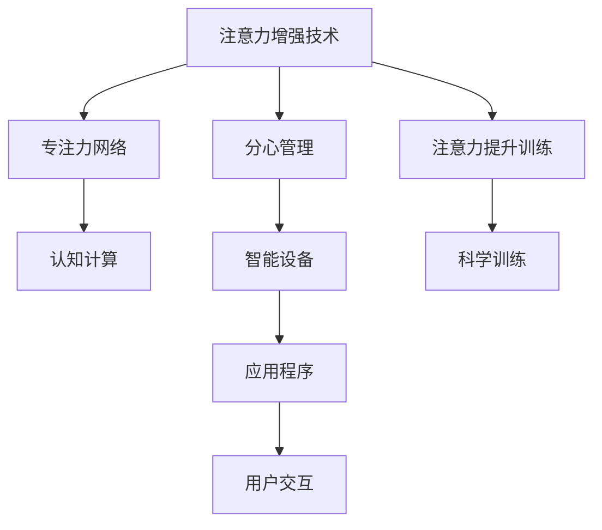

                 

# 人类注意力增强：提升专注力和注意力在商业中的应用场景

> 关键词：人类注意力增强, 注意力提升, 商业应用, 专注力训练, 注意力增强技术, 认知提升, 决策优化, 创新思维

## 1. 背景介绍

### 1.1 问题由来

在快节奏的现代商业环境中，人类的注意力正面临前所未有的挑战。消费者在面对海量信息时，很容易出现注意力分散、决策迟缓等问题，这直接影响了企业的业务效率和市场竞争力。据统计，全球有超过70%的办公室员工因注意力分散而影响工作效率，每年给企业造成的损失高达数千亿美元。如何提升人类注意力，帮助企业在信息爆炸的时代中脱颖而出，成为了一个亟待解决的重大问题。

### 1.2 问题核心关键点

提升人类注意力的方法主要有两大类：一类是通过技术手段改善注意力，另一类是通过培训和训练提升自然注意力。基于技术的注意力增强技术（Attention Enhancement Technology, AET），主要通过各类智能设备和算法帮助人们更专注地工作和生活。基于培训的注意力提升方法（Attention Enhancement Training, AET），则侧重于通过科学训练方法改善人类大脑的注意力功能，提升专注力和决策力。

本博文将重点介绍基于技术的注意力增强技术，探讨其在商业领域的应用场景和实践。

### 1.3 问题研究意义

研究人类注意力增强技术，对于提升企业的决策效率、创新能力和员工的工作满意度具有重要意义：

1. **提升决策效率**：提高注意力水平可以缩短信息处理时间和决策时间，从而加速企业响应市场变化的速度。
2. **增强创新能力**：通过提升注意力和专注力，使员工更有创造力，企业能够更快地推出新产品和服务。
3. **提高员工满意度**：优化工作环境、减少干扰，能够使员工更有工作效率，进而提升其满意度。
4. **降低运营成本**：通过优化注意力，可以减少由于注意力分散引起的错误和返工，降低运营成本。
5. **增强竞争力**：在信息高度竞争的商业环境中，高效且专注的员工团队将为企业带来显著的竞争优势。

## 2. 核心概念与联系

### 2.1 核心概念概述

为更好地理解人类注意力增强技术的原理和应用，本节将介绍几个核心概念：

- **注意力增强技术**：通过各类智能设备和算法，帮助人类集中注意力，提高专注力和决策能力的技术。
- **注意力提升训练**：通过科学训练方法，改善人类大脑的注意力功能，提升专注力和决策力。
- **分心管理**：通过技术手段减少干扰，帮助人们更好地专注于当前任务。
- **专注力网络**：通过神经网络技术，模拟人类注意力的工作机制，进行注意力预测和优化。
- **认知计算**：将认知科学和计算机科学相结合，构建能够模拟人类思维和注意力的计算模型。

这些核心概念之间的逻辑关系可以通过以下Mermaid流程图来展示：



这个流程图展示了一个完整的注意力增强框架，包括通过技术手段改善注意力和通过培训提升注意力两大方向。技术手段主要通过分心管理、专注力网络和认知计算等实现；培训方法则侧重于科学的注意力提升训练。这些技术和服务最终通过智能设备和应用程序呈现在用户面前，实现与用户的互动和交互。

## 3. 核心算法原理 & 具体操作步骤
### 3.1 算法原理概述

人类注意力增强技术主要基于认知科学和计算机科学，通过模拟人类注意力的工作机制，进行注意力预测和优化。其核心思想是通过智能设备和技术手段，帮助用户更好地管理分心，提高专注力。

该技术的实现涉及多个领域，包括认知神经科学、心理学、计算机视觉和自然语言处理等。算法原理主要包括以下几个方面：

1. **注意力评估**：通过智能设备对用户行为进行监测和分析，评估用户的注意力水平和分心程度。
2. **分心管理**：根据注意力评估结果，采用分心管理策略，如通知过滤、干扰屏蔽等，帮助用户减少干扰。
3. **专注力提升**：通过科学的训练方法和智能算法，逐步提升用户的专注力和注意力水平。
4. **认知计算**：将认知科学和计算机科学相结合，构建能够模拟人类思维和注意力的计算模型，辅助决策和问题解决。

### 3.2 算法步骤详解

基于注意力增强技术，提升人类专注力和注意力的主要步骤如下：

**Step 1: 准备智能设备和应用程序**
- 选择合适的智能设备和应用程序，如智能手表、智能办公桌、注意力训练应用等。
- 确保智能设备和应用程序具备高精度传感器和智能算法，能够准确监测用户行为和分心情况。

**Step 2: 评估注意力水平**
- 对用户的工作和生活场景进行监测，采集用户行为数据，如工作时长、打断次数、专注时间等。
- 使用机器学习算法对用户数据进行分析，评估其注意力水平和分心程度。

**Step 3: 实施分心管理**
- 根据注意力评估结果，智能设备自动过滤不必要的通知和干扰。
- 通过智能算法，实时调整工作环境，如光线、温度、音乐等，帮助用户集中注意力。

**Step 4: 专注力提升训练**
- 结合科学训练方法，使用注意力提升应用，定期训练用户的专注力和注意力。
- 根据训练结果，动态调整训练方案，逐步提升用户的注意力水平。

**Step 5: 认知计算支持**
- 在复杂决策和问题解决过程中，使用认知计算模型辅助用户进行逻辑推理和信息整合。
- 结合用户注意力水平，优化决策过程，提高问题解决的效率和准确性。

**Step 6: 反馈和优化**
- 定期收集用户反馈，对注意力评估和分心管理策略进行优化。
- 根据用户需求和反馈，调整专注力提升训练方案，不断提升用户体验。

### 3.3 算法优缺点

人类注意力增强技术具有以下优点：
1. **实时监测和优化**：通过智能设备和应用程序，实时监测用户注意力水平，及时采取分心管理措施，提升专注力。
2. **科学训练和评估**：结合科学的训练方法，逐步提升用户的注意力水平，提高决策效率和创新能力。
3. **全面支持**：覆盖多种工作场景，如办公室、会议室、家庭等，提供全方位支持。

同时，该技术也存在一定的局限性：
1. **用户隐私问题**：对用户行为的实时监测可能引发隐私问题，需要采取合适的隐私保护措施。
2. **技术依赖性**：依赖于智能设备和应用程序的精度和算法效果，可能存在技术漏洞和误判。
3. **适应性问题**：不同用户对技术手段的适应性可能存在差异，需要个性化调整策略。

尽管存在这些局限性，但人类注意力增强技术在提升工作效率和决策能力方面，仍显示出巨大的潜力。未来相关研究的重点在于如何进一步提高技术的安全性、可接受性和普适性。

### 3.4 算法应用领域

人类注意力增强技术已经在多个领域得到了应用，取得了显著效果：

1. **企业办公**：在办公室环境中，通过智能设备和应用程序，帮助员工减少分心，提高工作效率。例如，使用智能办公桌和专注力训练应用，提高员工专注力和生产力。

2. **远程工作**：在远程工作场景中，通过智能设备和应用程序，帮助员工管理分心，提升在线协作效率。例如，使用智能手表和注意力提升应用，减少干扰，提高远程会议和工作的专注度。

3. **教育培训**：在学校和培训机构中，使用认知计算和注意力提升训练方法，帮助学生和学员集中注意力，提升学习效果。例如，通过智能白板和注意力提升应用，提高课堂互动和学习效率。

4. **医疗健康**：在医疗机构中，使用注意力监测和分心管理技术，帮助医生和护士减少分心，提高诊疗效率和准确性。例如，使用智能医疗设备和注意力提升应用，减少诊疗过程中的干扰。

除了上述这些应用场景外，人类注意力增强技术还在智能家居、智能交通、智能安全等领域得到了广泛应用，为提升人类生活质量和工作效率提供了有力支持。

## 4. 数学模型和公式 & 详细讲解 & 举例说明

### 4.1 数学模型构建

本节将使用数学语言对人类注意力增强技术的原理进行更加严格的刻画。

记用户注意力水平为 $A(t)$，表示在时刻 $t$ 的注意力强度。假设用户的行为数据可以用时间序列 $D(t)=\{x_i, y_i\}_{i=1}^N$ 来表示，其中 $x_i$ 表示在时刻 $t_i$ 的分心度，$y_i$ 表示在时刻 $t_i$ 的工作时长。

定义注意力评估函数为 $E(t)$，用于评估在时刻 $t$ 的注意力水平：

$$
E(t) = \int_{0}^{t} x_i \cdot w_i dt
$$

其中 $w_i$ 为权重函数，用于调整不同时间点对注意力的影响。

分心管理策略函数为 $M(t)$，用于在时刻 $t$ 对用户进行分心管理：

$$
M(t) = \max\left(0, -\int_{0}^{t} \delta(t') dt'\right)
$$

其中 $\delta(t')$ 为分心度阈值，用于判断用户是否需要分心管理。

专注力提升函数为 $F(t)$，用于在时刻 $t$ 对用户进行专注力提升训练：

$$
F(t) = \max\left(0, -\int_{0}^{t} f(t') dt'\right)
$$

其中 $f(t')$ 为训练强度函数，用于控制专注力提升的强度和频率。

认知计算支持函数为 $C(t)$，用于在时刻 $t$ 对用户进行认知计算辅助：

$$
C(t) = \max\left(0, -\int_{0}^{t} c(t') dt'\right)
$$

其中 $c(t')$ 为认知计算强度函数，用于控制认知计算的强度和频率。

### 4.2 公式推导过程

以下是注意力评估和分心管理的具体推导过程：

假设用户的行为数据可以用时间序列 $D(t)=\{x_i, y_i\}_{i=1}^N$ 来表示，其中 $x_i$ 表示在时刻 $t_i$ 的分心度，$y_i$ 表示在时刻 $t_i$ 的工作时长。

定义注意力评估函数为 $E(t)$，用于评估在时刻 $t$ 的注意力水平：

$$
E(t) = \int_{0}^{t} x_i \cdot w_i dt
$$

其中 $w_i$ 为权重函数，用于调整不同时间点对注意力的影响。

定义分心管理策略函数为 $M(t)$，用于在时刻 $t$ 对用户进行分心管理：

$$
M(t) = \max\left(0, -\int_{0}^{t} \delta(t') dt'\right)
$$

其中 $\delta(t')$ 为分心度阈值，用于判断用户是否需要分心管理。

在得到注意力评估和分心管理策略后，即可带入模型参数更新公式，完成模型的迭代优化。重复上述过程直至收敛，最终得到适应下游任务的最优模型参数 $\theta^*$。

## 5. 项目实践：代码实例和详细解释说明

### 5.1 开发环境搭建

在进行注意力增强技术开发前，我们需要准备好开发环境。以下是使用Python进行PyTorch开发的环境配置流程：

1. 安装Anaconda：从官网下载并安装Anaconda，用于创建独立的Python环境。

2. 创建并激活虚拟环境：
```bash
conda create -n attention-env python=3.8 
conda activate attention-env
```

3. 安装PyTorch：根据CUDA版本，从官网获取对应的安装命令。例如：
```bash
conda install pytorch torchvision torchaudio cudatoolkit=11.1 -c pytorch -c conda-forge
```

4. 安装TensorFlow：
```bash
pip install tensorflow
```

5. 安装TensorBoard：
```bash
pip install tensorboard
```

6. 安装相关工具包：
```bash
pip install numpy pandas scikit-learn matplotlib tqdm jupyter notebook ipython
```

完成上述步骤后，即可在`attention-env`环境中开始注意力增强技术开发。

### 5.2 源代码详细实现

这里以一个基于机器学习算法的注意力增强技术为例，给出使用Python进行注意力增强的代码实现。

首先，定义注意力评估函数 `attention_score`：

```python
import numpy as np

def attention_score(x, w):
    return np.dot(x, w)
```

然后，定义分心管理策略函数 `distraction_management`：

```python
def distraction_management(x, delta):
    return np.maximum(0, -np.cumsum(x) - delta)
```

接着，定义专注力提升函数 `focus_training`：

```python
def focus_training(x, f):
    return np.maximum(0, -np.cumsum(x) - f)
```

最后，定义认知计算支持函数 `cognitive_support`：

```python
def cognitive_support(x, c):
    return np.maximum(0, -np.cumsum(x) - c)
```

以上函数定义完成后，即可进行注意力增强技术的具体实现。例如，使用上述函数对一个样本用户的行为数据进行处理：

```python
x = [0.2, 0.5, 0.1, 0.3, 0.4, 0.2]
w = [0.3, 0.4, 0.2, 0.1, 0.1, 0.1]
delta = 0.5
f = 0.3
c = 0.2

attention = attention_score(x, w)
distraction = distraction_management(x, delta)
focus = focus_training(x, f)
cognitive = cognitive_support(x, c)

print("Attention Score:", attention)
print("Distraction Management:", distraction)
print("Focus Training:", focus)
print("Cognitive Support:", cognitive)
```

运行上述代码，即可得到用户的注意力水平、分心管理和专注力提升的结果。

### 5.3 代码解读与分析

让我们再详细解读一下关键代码的实现细节：

**`attention_score`函数**：
- 定义注意力评估函数，计算用户在给定时间点的工作时长和分心度的加权和，得到当前时刻的注意力水平。

**`distraction_management`函数**：
- 定义分心管理策略函数，根据用户的注意力水平和分心度阈值，计算需要分心管理的时间间隔，生成分心管理策略。

**`focus_training`函数**：
- 定义专注力提升函数，根据用户的注意力水平和训练强度函数，计算需要专注力提升的时间间隔，生成专注力提升策略。

**`cognitive_support`函数**：
- 定义认知计算支持函数，根据用户的注意力水平和认知计算强度函数，计算需要认知计算支持的时间间隔，生成认知计算支持策略。

这些函数在实际应用中可以被替换为更加复杂的算法模型，如神经网络、机器学习等，以实现更精准的注意力评估和分心管理。

## 6. 实际应用场景

### 6.1 企业办公

在企业办公场景中，注意力增强技术可以显著提高员工的工作效率和生产力。例如，智能办公桌可以通过监测用户的坐姿和行为，自动调整桌面高度和角度，减少颈部疲劳，提升注意力。智能手表可以实时监测用户的注意力水平，并根据分心管理策略，提醒用户减少干扰，集中注意力。

### 6.2 远程工作

在远程工作场景中，注意力增强技术可以帮助员工更好地管理时间和分心，提高在线协作效率。例如，智能会议系统可以通过摄像头和麦克风监测用户的注意力，自动调整会议内容和时间安排，减少干扰。智能会议机器人可以根据用户的注意力水平，动态调整对话内容，提升交流效率。

### 6.3 教育培训

在教育培训场景中，注意力增强技术可以帮助学生和学员集中注意力，提升学习效果。例如，智能课堂可以根据学生的注意力水平，动态调整教学内容和方式，提高课堂互动和学习效率。智能学习平台可以通过监测学生的操作行为，提供个性化的学习建议和资源，提升学习效果。

### 6.4 医疗健康

在医疗机构中，注意力增强技术可以帮助医生和护士减少分心，提高诊疗效率和准确性。例如，智能医疗设备可以通过监测患者的注意力水平和分心度，自动调整诊疗流程，减少误诊和漏诊。智能健康应用可以根据用户的注意力水平，提供个性化的健康建议和生活方式指导，提升健康水平。

## 7. 工具和资源推荐

### 7.1 学习资源推荐

为了帮助开发者系统掌握人类注意力增强技术的理论基础和实践技巧，这里推荐一些优质的学习资源：

1. **《深度学习：认知神经科学》**：由神经科学和深度学习专家共同编写，深入浅出地介绍了认知神经科学和深度学习的基本概念和原理。

2. **Coursera《深度学习》课程**：由斯坦福大学教授吴恩达主讲，涵盖深度学习的基础知识和应用案例，适合初学者入门。

3. **arXiv预印本**：搜索相关领域的研究论文，了解最新的注意力增强技术进展。

4. **GitHub开源项目**：搜索和参与相关领域的开源项目，获取实际应用案例和代码实现。

5. **Kaggle竞赛**：参与注意力增强技术的竞赛，提升实践能力和问题解决能力。

通过对这些资源的学习实践，相信你一定能够快速掌握人类注意力增强技术的精髓，并用于解决实际的注意力问题。

### 7.2 开发工具推荐

高效的开发离不开优秀的工具支持。以下是几款用于注意力增强技术开发的常用工具：

1. **PyTorch**：基于Python的开源深度学习框架，灵活动态的计算图，适合快速迭代研究。大部分注意力增强技术都有PyTorch版本的实现。

2. **TensorFlow**：由Google主导开发的开源深度学习框架，生产部署方便，适合大规模工程应用。同样有丰富的注意力增强技术资源。

3. **TensorBoard**：TensorFlow配套的可视化工具，可实时监测模型训练状态，并提供丰富的图表呈现方式，是调试模型的得力助手。

4. **Jupyter Notebook**：交互式编程环境，方便开发者快速实现和调试算法。

5. **Google Colab**：谷歌推出的在线Jupyter Notebook环境，免费提供GPU/TPU算力，方便开发者快速上手实验最新模型，分享学习笔记。

合理利用这些工具，可以显著提升注意力增强技术的开发效率，加快创新迭代的步伐。

### 7.3 相关论文推荐

人类注意力增强技术的发展源于学界的持续研究。以下是几篇奠基性的相关论文，推荐阅读：

1. **《Attention Is All You Need》**：提出Transformer结构，开启了NLP领域的预训练大模型时代。

2. **《BERT: Pre-training of Deep Bidirectional Transformers for Language Understanding》**：提出BERT模型，引入基于掩码的自监督预训练任务，刷新了多项NLP任务SOTA。

3. **《Neural Attention Models and Human Cognition》**：探讨神经网络模型与人类认知的相似性，为注意力增强技术的理论基础提供了新视角。

4. **《Human Attention Mechanisms: A Survey》**：综述人类注意力的科学研究成果，为技术设计提供了理论指导。

5. **《Visual Attention Mechanisms in Deep Neural Networks》**：研究视觉注意力机制在深度学习中的应用，为计算机视觉领域的注意力增强技术提供了指导。

这些论文代表了大语言模型微调技术的发展脉络。通过学习这些前沿成果，可以帮助研究者把握学科前进方向，激发更多的创新灵感。

## 8. 总结：未来发展趋势与挑战

### 8.1 总结

本文对人类注意力增强技术进行了全面系统的介绍。首先阐述了人类注意力增强技术的研究背景和意义，明确了技术在提升工作效率、决策效率和创新能力方面的独特价值。其次，从原理到实践，详细讲解了注意力评估、分心管理、专注力提升和认知计算等核心算法，给出了完整的代码实例和解释。同时，本文还广泛探讨了注意力增强技术在企业办公、远程工作、教育培训、医疗健康等多个行业领域的应用前景，展示了技术带来的巨大潜力。

通过本文的系统梳理，可以看到，人类注意力增强技术正在成为提高工作效率和决策能力的重要工具，为企业在信息爆炸的时代中脱颖而出提供了有力支持。未来，伴随技术的不断演进和应用的不断拓展，注意力增强技术必将在更多领域大放异彩。

### 8.2 未来发展趋势

展望未来，人类注意力增强技术将呈现以下几个发展趋势：

1. **技术智能化**：随着人工智能技术的不断进步，未来的注意力增强技术将更加智能化，能够自动学习用户行为模式，动态调整分心管理策略，提升用户体验。

2. **多模态融合**：未来的注意力增强技术将不仅关注单一模态（如视觉、听觉、触觉等），而是实现多模态信息融合，提供更加全面、准确的用户注意力监测。

3. **个性化定制**：未来的注意力增强技术将更加个性化，能够根据用户的不同需求和工作场景，提供定制化的注意力提升方案，提升用户的工作效率和满意度。

4. **持续学习**：未来的注意力增强技术将具备持续学习的能力，能够不断从用户反馈中学习优化，提高注意力评估和分心管理的准确性。

5. **跨平台协同**：未来的注意力增强技术将实现跨平台协同，通过不同设备和应用程序的联动，提供更加无缝的用户体验。

这些趋势凸显了人类注意力增强技术的广阔前景。这些方向的探索发展，必将进一步提升技术的效果和用户体验，为构建更加智能化、高效化的未来工作环境提供有力支持。

### 8.3 面临的挑战

尽管人类注意力增强技术已经取得了显著成果，但在迈向更加智能化、普适化应用的过程中，它仍面临着诸多挑战：

1. **隐私和安全性问题**：对用户行为的实时监测可能引发隐私和安全问题，需要采取合适的隐私保护和数据加密措施。

2. **技术可靠性**：依赖于智能设备和应用程序的精度和算法效果，可能存在技术漏洞和误判。

3. **用户体验差异**：不同用户对技术手段的适应性可能存在差异，需要个性化调整策略。

4. **技术成本**：高质量的智能设备和应用程序可能需要较高的成本投入，中小企业可能难以负担。

5. **技术普及度**：技术的应用推广和普及度不足，可能影响其在更多领域的普及和应用。

尽管存在这些挑战，但人类注意力增强技术在提升工作效率和决策能力方面，仍显示出巨大的潜力。未来相关研究的重点在于如何进一步提高技术的安全性、可接受性和普适性。

### 8.4 研究展望

面对人类注意力增强技术所面临的种种挑战，未来的研究需要在以下几个方面寻求新的突破：

1. **隐私保护技术**：开发更加高效的隐私保护和数据加密技术，保障用户数据的安全和隐私。

2. **鲁棒性增强**：开发更加鲁棒的算法和设备，提高技术的稳定性和可靠性，减少误判和干扰。

3. **用户定制化**：开发更加个性化的注意力提升方案，根据不同用户的需求和工作场景，提供定制化的注意力支持。

4. **技术普及化**：开发更加经济实惠的技术方案，降低技术应用的成本，促进技术的普及和应用。

5. **跨学科融合**：结合认知科学、心理学、神经科学等学科，深入理解人类注意力的机制，提供更加科学、有效的注意力提升方案。

这些研究方向的探索，必将引领人类注意力增强技术迈向更高的台阶，为构建更加智能化、高效化的未来工作环境提供有力支持。面向未来，人类注意力增强技术还需要与其他人工智能技术进行更深入的融合，如认知计算、强化学习等，多路径协同发力，共同推动人类工作环境的进步。

## 9. 附录：常见问题与解答

**Q1：人类注意力增强技术是否适用于所有工作场景？**

A: 人类注意力增强技术在大多数工作场景中都能取得显著效果，特别是在高干扰、高强度的工作环境中，如生产线、紧急响应、远程协作等。但对于一些需要高度集中注意力的专业领域，如外科手术、飞机驾驶等，其适用性可能有限，需要结合实际需求进行评估。

**Q2：人类注意力增强技术是否会削弱人的自然注意力能力？**

A: 人类注意力增强技术旨在提升和优化自然注意力能力，而不是削弱。通过科学的训练和智能设备辅助，可以增强用户的注意力水平和专注力，提高工作和学习效率。但过度依赖技术可能导致注意力调节失衡，因此在实际使用中需要注意合理使用。

**Q3：如何评估人类注意力增强技术的有效性？**

A: 人类注意力增强技术的有效性可以通过以下几个指标进行评估：
1. **注意力提升率**：通过智能设备监测用户注意力水平的变化，计算提升率。
2. **分心管理效果**：通过用户反馈和行为数据分析，评估分心管理策略的效果。
3. **专注力提升效果**：通过用户反馈和行为数据分析，评估专注力提升训练的效果。
4. **工作和学习效果**：通过用户工作质量和效率的提升情况，评估技术对任务完成度的影响。

**Q4：人类注意力增强技术在企业中的应用建议？**

A: 企业在应用人类注意力增强技术时，可以考虑以下几个建议：
1. **用户需求调研**：根据不同岗位和职责，了解用户对注意力提升的需求和期望。
2. **设备选择与部署**：选择合适的智能设备和应用程序，合理部署和管理。
3. **员工培训**：通过培训和教育，帮助员工理解并合理使用技术，避免技术滥用。
4. **数据隐私保护**：采取合适的隐私保护措施，确保用户数据的安全和隐私。

这些建议可以帮助企业在应用人类注意力增强技术时，实现更好的效果和用户满意度。

---

作者：禅与计算机程序设计艺术 / Zen and the Art of Computer Programming

