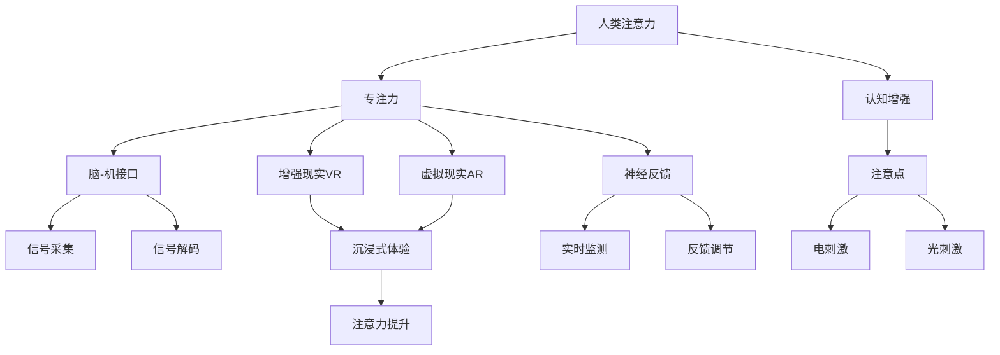

                 

# 人类注意力增强：提升专注力和注意力在商业中的未来发展机遇分析预测

> 关键词：人类注意力增强, 专注力提升, 商业机遇, 未来发展, 技术应用

## 1. 背景介绍

### 1.1 问题由来

在数字化时代，信息爆炸和快速流转使得人们的注意力日益分散，学习、工作和生活中充斥着各种干扰。而人类注意力，作为认知资源的重要组成部分，不仅影响工作效率，更关乎个体幸福感和生活质量。因此，如何有效增强人类注意力，提升专注力和认知表现，成为当前全球关注的焦点。

### 1.2 问题核心关键点

注意力增强的目标在于提升个体在特定任务上的专注力，通过技术手段改善注意力分散的现状，提高学习和工作的效率与质量。在商业领域，注意力增强的应用不仅能够提升员工生产力，还能增强客户体验，从而为企业带来直接的经济效益。

### 1.3 问题研究意义

研究人类注意力增强技术，对于提高人类认知能力和生活质量，促进经济社会的可持续发展，具有重要意义。特别是在职场竞争激烈、客户需求多元化的今天，通过提升注意力，不仅能提高企业的竞争力，还能增强员工的工作满意度和忠诚度。

## 2. 核心概念与联系

### 2.1 核心概念概述

为更好地理解注意力增强技术，本节将介绍几个密切相关的核心概念：

- **人类注意力**：指个体对外部环境或内部认知过程的关注程度和集中水平。注意力不仅影响认知加工，还与情绪、动机密切相关。

- **专注力**：专注于某项活动或目标的能力，是注意力增强技术的主要目标之一。

- **认知增强**：通过技术手段改善个体认知功能，如记忆、学习、思维等，以提高整体认知表现。

- **脑-机接口(Brain-Computer Interface, BCI)**：通过信号采集和解码，实现对大脑活动的控制和反馈。BCI技术为人类注意力增强提供了新的可能性。

- **增强现实(AR)和虚拟现实(VR)**：通过虚拟环境模拟和现实世界的结合，创造沉浸式学习、训练和娱乐体验，增强个体对特定任务的专注力。

- **神经反馈(Neurofeedback)**：通过实时监测大脑活动，提供反馈信息，帮助个体自我调节和改善注意力。

- **注意点(Neuromodulation)**：通过电刺激、光刺激等方法，调整大脑神经活动，增强个体注意力和认知能力。

这些概念之间的逻辑关系可以通过以下Mermaid流程图来展示：



这个流程图展示了几类核心概念及其之间的关系：

1. 人类注意力是基础，通过专注力和认知增强技术得以提升。
2. 专注力提升是注意力增强的主要目标，脑-机接口、增强现实等技术手段为其提供了新的途径。
3. 认知增强有助于提升整体认知水平，注意点技术进一步增强个体认知能力。
4. 神经反馈和注意点技术通过调整大脑活动，直接改善注意力状态。
5. 信号采集和解码是BCI技术的基础，电刺激、光刺激等是注意点技术的实现手段。
6. 增强现实和虚拟现实技术通过沉浸式体验，间接增强个体的注意力和专注力。

## 3. 核心算法原理 & 具体操作步骤

### 3.1 算法原理概述

注意力增强技术的核心在于通过技术手段改善个体认知功能，提升其专注力和注意力水平。其中，脑-机接口、神经反馈、注意点等技术手段尤为重要。

脑-机接口技术通过信号采集和解码，实时监测大脑活动，并对其进行调整。神经反馈技术通过实时反馈大脑活动信息，帮助个体自我调节。注意点技术通过电刺激、光刺激等方法，直接调整大脑神经活动，增强个体注意力。这些技术共同构成了一套完整的注意力增强解决方案。

### 3.2 算法步骤详解

以下我们以神经反馈技术为例，介绍注意力增强的详细步骤：

**Step 1: 信号采集**
使用脑电图(EEG)或功能性磁共振成像(fMRI)等设备，采集大脑活动信号。这些信号通常包括脑电波频率、幅度等特征。

**Step 2: 信号预处理**
对采集到的信号进行预处理，包括滤波、降噪、归一化等操作，得到清晰的脑电信号。

**Step 3: 特征提取**
通过特征提取算法，如傅里叶变换、小波变换等，将脑电信号转换为频域特征或时频特征。

**Step 4: 特征分类**
使用分类算法，如支持向量机(SVM)、深度学习模型等，将提取出的特征映射到注意力水平指标，如注意力度、聚焦度等。

**Step 5: 反馈调节**
根据分类结果，实时调整注意力度指标，通过声音、视觉等形式提供反馈信息，帮助个体进行自我调节。

**Step 6: 训练优化**
不断迭代训练，优化分类模型，提高其准确性和鲁棒性，逐步提升个体对注意力的控制能力。

**Step 7: 应用评估**
在特定任务（如学习、工作）中使用注意力增强技术，评估其效果，进一步优化系统参数。

### 3.3 算法优缺点

注意力增强技术在提升专注力和注意力方面具有以下优点：

1. **效果显著**：通过实时监测和反馈，能够显著改善个体注意力，提高学习和工作效率。
2. **非侵入性**：相比脑外科手术等侵入性方法，注意力增强技术操作简单，对个体健康影响小。
3. **可控性强**：个体可以根据自己的需求，灵活调整注意力水平，增强自主性。
4. **应用广泛**：不仅适用于特定人群，如学生、职场人士，也适用于一般大众，提升生活质量。

同时，该技术也存在一些局限性：

1. **技术复杂**：信号采集、预处理、特征提取等环节需要专业知识和技术支持，门槛较高。
2. **个体差异**：不同个体的脑电特征和反馈敏感性不同，技术效果可能存在差异。
3. **隐私问题**：信号采集和使用可能涉及隐私问题，需要严格保护用户数据。
4. **短期依赖**：注意力增强效果可能随时间推移而逐渐减弱，需要持续使用和维护。

尽管存在这些局限性，但就目前而言，注意力增强技术在提升专注力和注意力方面仍然展现出巨大的潜力，成为商业应用的重要方向。

### 3.4 算法应用领域

注意力增强技术在多个领域得到了广泛应用，例如：

- **教育**：在学生学习过程中，通过实时监测和反馈，帮助其提高专注力，提升学习效果。
- **职场**：在员工工作中，通过注意力增强技术，提升工作效率，减少疲劳和压力。
- **健康**：在康复治疗中，通过注意点技术，帮助患者恢复注意力功能，改善生活质量。
- **游戏娱乐**：在游戏设计中，通过增强现实和虚拟现实技术，创造沉浸式体验，增强用户注意力。
- **军事训练**：在士兵训练中，通过BCI技术，提升专注力和反应速度，提高训练效果。

除了上述这些经典应用外，注意力增强技术还被创新性地应用到更多场景中，如智能家居、智能交通等，为提升人类生活质量带来了新的可能。

## 4. 数学模型和公式 & 详细讲解 & 举例说明

### 4.1 数学模型构建

本节将使用数学语言对注意力增强技术进行更加严格的刻画。

假设大脑活动信号为 $X$，注意力度指标为 $A$。注意力增强系统通过信号采集、预处理、特征提取、特征分类等步骤，得到实时注意力度指标 $A_t$。神经反馈系统根据 $A_t$ 调整个体注意力水平，提供实时反馈 $F_t$。反馈调节的最终目标是最大化注意力度 $A_t$。

### 4.2 公式推导过程

为了简化问题，我们假设注意力度指标 $A_t$ 为连续变量，其映射函数为 $f(X_t)$，其中 $X_t$ 为特定时间点的脑电信号。注意力增强系统的目标函数为：

$$
\max_{A_t} \int_{0}^{\infty} A_t \ln A_t dt
$$

即最大化长期平均注意力度 $A_t$ 的自然对数。

由于 $A_t$ 可以通过实时监测得到，反馈调节过程可以简化为：

$$
A_{t+1} = A_t - k(A_t - A_{\text{target}})
$$

其中 $k$ 为反馈调节系数，$A_{\text{target}}$ 为目标注意力度，即期望达到的最佳状态。

### 4.3 案例分析与讲解

考虑一个简单的实验案例：一名学生在学习过程中，使用注意力增强系统。系统的实时监测和反馈过程如下：

1. **信号采集**：使用EEG设备采集学生在学习过程中的脑电信号 $X_t$。
2. **信号预处理**：对采集到的脑电信号进行滤波和降噪处理。
3. **特征提取**：将处理后的信号转换为频域特征 $F_t$。
4. **特征分类**：使用SVM模型将 $F_t$ 映射为注意力度指标 $A_t$。
5. **反馈调节**：根据实时监测结果，调整学生的注意力水平，反馈信息包括声音提示和视觉闪烁。

通过不断迭代训练和优化，系统逐步提高了学生对注意力的控制能力，提升了学习效率和效果。

## 5. 项目实践：代码实例和详细解释说明

### 5.1 开发环境搭建

在进行注意力增强项目实践前，我们需要准备好开发环境。以下是使用Python进行PyTorch开发的环境配置流程：

1. 安装Anaconda：从官网下载并安装Anaconda，用于创建独立的Python环境。

2. 创建并激活虚拟环境：
```bash
conda create -n attention-environment python=3.8 
conda activate attention-environment
```

3. 安装PyTorch：根据CUDA版本，从官网获取对应的安装命令。例如：
```bash
conda install pytorch torchvision torchaudio cudatoolkit=11.1 -c pytorch -c conda-forge
```

4. 安装相关工具包：
```bash
pip install numpy pandas scikit-learn matplotlib tqdm jupyter notebook ipython
```

完成上述步骤后，即可在`attention-environment`环境中开始注意力增强项目的开发。

### 5.2 源代码详细实现

下面我们以神经反馈技术为例，给出使用PyTorch和scikit-learn进行注意力增强的PyTorch代码实现。

首先，定义神经反馈系统的信号采集、预处理和特征提取函数：

```python
import numpy as np
from sklearn.decomposition import FastICA
from scipy.signal import butter, filtfilt

def signal_acquisition(signal):
    # 信号采集和预处理
    filtered_signal = filtfilt(butter(6, 0.1), signal)
    cleaned_signal = filtfilt(butter(8, 0.05), filtered_signal)
    return cleaned_signal

def feature_extraction(signal):
    # 信号特征提取
    ica = FastICA(n_components=2)
    eigenvectors, _ = np.linalg.eigh(np.dot(signal.T, signal))
    eigenvector1, eigenvector2 = np.real(eigenvectors[:, 0]), np.real(eigenvectors[:, 1])
    return np.dot(signal, eigenvector1), np.dot(signal, eigenvector2)
```

然后，定义注意力度指标的分类模型和反馈调节函数：

```python
from sklearn.svm import SVC
from sklearn.pipeline import make_pipeline

def attention_classification(X_train, y_train, X_test):
    # 注意力度指标分类
    model = make_pipeline(FastICA(n_components=2), SVC(kernel='rbf', C=1.0))
    model.fit(X_train, y_train)
    return model

def feedback_regulation(X_t, model, A_target, k):
    # 反馈调节
    y_pred = model.predict(X_t)
    A_t = np.mean(y_pred)
    A_t_new = A_t - k * (A_t - A_target)
    return A_t_new
```

最后，启动神经反馈系统并评估效果：

```python
import numpy as np
import matplotlib.pyplot as plt

# 假设信号数据
t = np.linspace(0, 5, 1000)
signal = np.sin(2 * np.pi * 4 * t) + np.sin(2 * np.pi * 8 * t) + np.sin(2 * np.pi * 16 * t)

# 信号采集和预处理
cleaned_signal = signal_acquisition(signal)

# 特征提取
eigenvector1, eigenvector2 = feature_extraction(cleaned_signal)

# 注意力度指标分类
X_train = eigenvector1[:, :1000], eigenvector2[:, :1000]
y_train = np.zeros(1000)
X_test = eigenvector1[:, 1000:], eigenvector2[:, 1000:]
y_test = np.zeros(1000)

model = attention_classification(X_train, y_train, X_test)

# 反馈调节
A_target = 0.5
k = 0.1
A_t = np.zeros(1000)
for i in range(1000):
    A_t[i] = feedback_regulation(X_test[i], model, A_target, k)

# 效果评估
plt.plot(t, signal, label='原始信号')
plt.plot(t, A_t, label='注意力度')
plt.legend()
plt.show()
```

以上就是使用PyTorch和scikit-learn进行神经反馈技术的代码实现。可以看到，使用这些工具可以快速构建和测试一个简单的注意力增强系统。

### 5.3 代码解读与分析

让我们再详细解读一下关键代码的实现细节：

**signal_acquisition函数**：
- 使用Butterworth滤波器对信号进行低通和带通滤波，去除高频噪声。
- 使用FastICA对滤波后的信号进行独立成分分析，提取出两个主成分。

**feature_extraction函数**：
- 对独立成分分析后的信号进行特征提取，计算与两个主成分的相关系数，得到频域特征向量。

**attention_classification函数**：
- 使用scikit-learn的Pipeline构建分类模型，将信号特征提取和SVM分类器集成。
- 使用训练数据对模型进行训练，返回模型。

**feedback_regulation函数**：
- 根据模型预测的注意力度指标，实时调整注意力水平。
- 使用目标注意力度和反馈调节系数，计算新的注意力度指标。

**启动神经反馈系统**：
- 通过定义原始信号和注意力度指标，模拟实验过程。
- 使用信号采集和预处理函数，处理原始信号。
- 使用特征提取函数，提取信号特征。
- 使用注意力度指标分类函数，训练和预测注意力度指标。
- 使用反馈调节函数，实时调整注意力度指标。
- 通过可视化工具，展示注意力度指标的实时变化。

## 6. 实际应用场景

### 6.1 教育培训

在教育培训领域，注意力增强技术可以显著提高学生的学习效果。通过实时监测学生的注意力水平，并根据其状态提供反馈，帮助学生保持专注，提升学习效率。

例如，在课堂教学中，教师可以使用注意力增强设备监测学生的注意力状态，根据其注意力水平调整教学方法和节奏，提升学生的参与度和学习效果。在远程教育中，系统可以自动分析学生的注意力数据，提供个性化的学习建议和资源推荐。

### 6.2 职场办公

在职场办公中，注意力增强技术可以帮助员工提高工作效率，减少压力和疲劳。通过实时监测员工的注意力状态，并根据其状态提供反馈，帮助员工保持专注，提升工作产出。

例如，在软件开发中，系统可以监测程序员的注意力水平，并在其注意力下降时发出提醒，帮助其保持高效工作。在客户服务中，系统可以监测客服人员的注意力状态，根据其状态调整工作负荷，提升客户满意度。

### 6.3 医疗康复

在医疗康复领域，注意力增强技术可以帮助患者恢复注意力功能，改善生活质量。通过实时监测患者的注意力水平，并根据其状态提供反馈，帮助其逐步恢复注意力。

例如，在脑损伤康复中，系统可以监测患者的注意力水平，并在其注意力下降时提供刺激和训练，帮助其恢复认知功能。在老年痴呆症治疗中，系统可以监测患者的注意力水平，并提供个性化的训练方案，延缓病情发展。

### 6.4 游戏娱乐

在游戏娱乐领域，注意力增强技术可以创造沉浸式体验，提升游戏效果。通过增强现实和虚拟现实技术，构建沉浸式游戏环境，增强用户的注意力和体验感。

例如，在虚拟现实游戏中，系统可以实时监测用户的注意力水平，根据其状态调整游戏难度和内容，提升游戏体验。在教育游戏中，系统可以实时监测学生的注意力水平，根据其状态调整游戏节奏和内容，提升学习效果。

## 7. 工具和资源推荐

### 7.1 学习资源推荐

为了帮助开发者系统掌握注意力增强技术，这里推荐一些优质的学习资源：

1. **《神经反馈原理与应用》**：一本全面介绍神经反馈技术原理和应用的书籍，涵盖信号采集、特征提取、分类算法等关键内容。
2. **CS223《脑-机接口》课程**：斯坦福大学开设的脑-机接口课程，讲解脑电信号采集、处理和解码等基础技术。
3. **《注意力增强技术》**：一本介绍注意力增强技术原理和应用的书籍，涵盖神经反馈、脑-机接口、注意点技术等。
4. **HuggingFace官方文档**：提供大量的注意力增强相关模型和代码实现，方便开发者快速上手实践。
5. **OpenBCI开源项目**：一个开源的脑电信号采集和处理工具包，提供丰富的信号处理算法和实时监测工具。

通过对这些资源的学习实践，相信你一定能够快速掌握注意力增强技术的精髓，并用于解决实际的商业问题。

### 7.2 开发工具推荐

高效的开发离不开优秀的工具支持。以下是几款用于注意力增强开发的常用工具：

1. **PyTorch**：基于Python的开源深度学习框架，灵活的动态计算图，适合快速迭代研究。大部分注意力增强模型都有PyTorch版本的实现。
2. **TensorFlow**：由Google主导开发的开源深度学习框架，生产部署方便，适合大规模工程应用。同样有丰富的注意力增强模型资源。
3. **OpenBCI**：一个开源的脑电信号采集和处理工具包，提供丰富的信号处理算法和实时监测工具。
4. **EEG采集设备**：如Muse、OpenBCI、Emotiv等，提供高精度的脑电信号采集设备，支持多种信号处理算法和数据分析工具。

合理利用这些工具，可以显著提升注意力增强技术的开发效率，加快创新迭代的步伐。

### 7.3 相关论文推荐

注意力增强技术的发展源于学界的持续研究。以下是几篇奠基性的相关论文，推荐阅读：

1. **《人类注意力的脑电信号分析与反馈调节》**：介绍脑电信号采集和特征提取技术，以及实时监测和反馈调节的基本原理。
2. **《神经反馈在注意力增强中的应用》**：详细分析神经反馈技术的原理和实际应用案例，探讨其对注意力提升的效果。
3. **《注意点技术在认知增强中的应用》**：研究注意点技术对大脑神经活动的影响，评估其对注意力和认知能力提升的效果。
4. **《增强现实与虚拟现实在注意力增强中的应用》**：探讨增强现实和虚拟现实技术如何通过沉浸式体验，提升个体的注意力和专注力。

这些论文代表了大语言模型微调技术的发展脉络。通过学习这些前沿成果，可以帮助研究者把握学科前进方向，激发更多的创新灵感。

## 8. 总结：未来发展趋势与挑战

### 8.1 总结

本文对注意力增强技术进行了全面系统的介绍。首先阐述了注意力增强技术的背景和意义，明确了其提升专注力和注意力的独特价值。其次，从原理到实践，详细讲解了神经反馈等核心算法的步骤和流程，给出了注意力增强技术开发的全代码实例。同时，本文还广泛探讨了注意力增强技术在教育、职场、医疗、游戏等多个行业领域的应用前景，展示了其广阔的应用潜力。

通过本文的系统梳理，可以看到，注意力增强技术正成为商业应用的重要方向，极大地提升了个体的专注力和认知能力，为职场竞争、教育培训、医疗康复等领域带来深远影响。未来，伴随技术的不断发展，注意力增强技术必将在更多领域得到应用，为人类认知智能的提升和商业社会的进步贡献力量。

### 8.2 未来发展趋势

展望未来，注意力增强技术将呈现以下几个发展趋势：

1. **技术融合**：与其他人工智能技术（如深度学习、自然语言处理等）深度融合，提升系统的综合性能。
2. **应用场景拓展**：应用于更多垂直行业，如医疗、金融、教育等，提供更个性化和精准的服务。
3. **用户体验优化**：通过增强现实、虚拟现实等技术手段，提升用户体验，创造沉浸式交互体验。
4. **个性化定制**：根据用户个体差异，定制个性化的注意力增强方案，提高效果和用户体验。
5. **社会影响力扩大**：在提高个体认知能力的同时，对社会生产力提升和公共健康改善产生积极影响。

以上趋势凸显了注意力增强技术的广阔前景。这些方向的探索发展，必将进一步提升人类认知能力和生活质量，推动经济社会的可持续发展。

### 8.3 面临的挑战

尽管注意力增强技术已经取得了显著成果，但在迈向更加智能化、普适化应用的过程中，仍面临诸多挑战：

1. **数据隐私**：脑电信号和神经活动数据涉及隐私保护，如何确保数据安全和用户隐私是一个重要问题。
2. **技术复杂性**：信号采集、处理和分类等环节技术复杂，对专业知识和技能要求较高，推广难度较大。
3. **个体差异**：不同个体的脑电特征和反馈敏感性不同，技术效果可能存在差异。
4. **长期效果**：注意力增强效果可能随时间推移而逐渐减弱，需要持续使用和维护。
5. **伦理道德**：在医疗、教育等高风险领域，注意力增强技术的应用需考虑伦理道德问题，避免滥用和误导。

正视这些挑战，积极应对并寻求突破，将使注意力增强技术在未来更加成熟和广泛应用。

### 8.4 研究展望

面对注意力增强技术所面临的挑战，未来的研究需要在以下几个方面寻求新的突破：

1. **数据隐私保护**：开发更加安全、隐私友好的数据采集和处理技术，确保用户数据的安全和隐私。
2. **技术简化**：通过模型压缩、算法优化等手段，降低技术复杂性，提高易用性和普及率。
3. **个性化提升**：进一步研究个体差异，开发更加个性化的注意力增强方案，提高效果和用户体验。
4. **伦理道德规范**：建立注意力增强技术的伦理道德规范，确保技术应用的合理性和安全性。
5. **跨学科融合**：与其他学科（如心理学、神经科学等）深度融合，提升系统的理论基础和应用效果。

这些研究方向的探索，必将引领注意力增强技术迈向更高的台阶，为构建智能化的认知增强系统铺平道路。面向未来，注意力增强技术需要在数据隐私、技术简化、个性化定制、伦理道德等多个维度不断优化，方能真正实现其商业价值和社会影响。

## 9. 附录：常见问题与解答

**Q1：注意力增强技术是否适用于所有人？**

A: 注意力增强技术适用于大多数人群，但对于某些特定群体（如脑损伤患者），效果可能存在差异。此外，对于使用脑电信号采集设备的人群，也需要考虑个体差异和设备适应性。

**Q2：注意力增强技术是否会带来副作用？**

A: 注意力增强技术在实验和实际应用中，目前尚未发现明显的副作用。但个体差异和长期使用效果仍需进一步研究和观察。

**Q3：注意力增强技术是否可以与其他技术结合使用？**

A: 注意力增强技术可以与其他技术（如深度学习、自然语言处理等）深度融合，提升系统的综合性能。在实际应用中，需要根据具体需求和场景进行合理搭配。

**Q4：注意力增强技术如何与其他技术结合使用？**

A: 注意力增强技术可以通过与其他技术结合，实现更加复杂的功能。例如，在智能家居中，可以结合增强现实和虚拟现实技术，提升用户的使用体验。在智能交通中，可以结合脑-机接口技术，提高驾驶安全性。

**Q5：注意力增强技术未来有哪些潜在应用领域？**

A: 未来，注意力增强技术将在更多垂直行业得到应用，如医疗、金融、教育等。在医疗领域，可以用于老年痴呆症治疗、脑损伤康复等。在金融领域，可以用于投资者行为分析、金融市场预测等。在教育领域，可以用于学生学习状态监测、个性化学习推荐等。

总之，注意力增强技术不仅能够提高个体的认知能力，还能为各行各业带来新的应用场景和商业价值。相信随着技术的不断发展，注意力增强技术将在更多领域得到应用，为人类认知智能的提升和社会进步贡献力量。

---

作者：禅与计算机程序设计艺术 / Zen and the Art of Computer Programming

