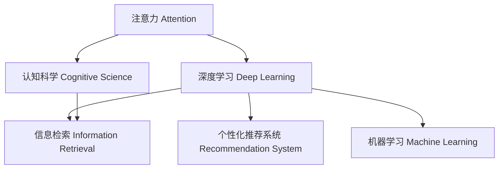

                 

# 人类注意力增强：提升专注力和注意力在商业中的未来方向

> 关键词：人类注意力, 专注力提升, 商业应用, 人工智能, 注意力增强算法, 深度学习, 认知科学

## 1. 背景介绍

在当今信息爆炸的时代，人类每天面对的信息量是前所未有的。我们如何在海量信息中找到关键内容，并保持高效专注，是提高工作效率和决策质量的关键。长期以来，人们致力于研发各种技术手段来增强注意力，如番茄工作法、时间管理软件等。然而，这些传统方法往往依赖于人的自我管理和心理调节，效果有限。而随着人工智能和深度学习技术的发展，新型注意力增强算法正逐渐成为提升专注力和注意力的新方向。本文将系统介绍人类注意力增强技术，探索其在商业中的应用前景。

## 2. 核心概念与联系

### 2.1 核心概念概述

为更好地理解注意力增强算法，本节将介绍几个密切相关的核心概念：

- 注意力（Attention）：指的是在处理复杂信息时，聚焦于与当前任务最相关的部分的能力。人类在阅读、听力、视觉等多个感官通道中都会使用注意力机制，以快速高效地获取关键信息。

- 深度学习（Deep Learning）：一种基于多层神经网络的机器学习技术，能够通过模拟人脑神经元的工作原理，自适应地学习特征和模式，实现高性能的预测和分类任务。

- 认知科学（Cognitive Science）：研究人类认知过程和心理机制的跨学科领域，包括语言、记忆、学习、思维等。注意力增强算法在一定程度上借鉴了认知科学的研究成果，用于模拟和提升人类注意力机制。

- 信息检索（Information Retrieval）：旨在从大规模数据集中快速检索与用户查询相关的信息，是注意力增强算法在商业应用中的一个重要场景。

- 个性化推荐系统（Recommendation System）：通过对用户行为和兴趣进行建模，推荐系统能够向用户提供个性化内容，提升用户体验和满意度。

- 机器学习（Machine Learning）：一种利用数据和算法，使计算机从经验中学习并改进性能的方法，是注意力增强算法的基础。

这些核心概念之间的逻辑关系可以通过以下Mermaid流程图来展示：



这个流程图展示了一些核心概念及其之间的关系：

1. 注意力机制被深度学习模型广泛应用，用于提升模型在处理复杂任务时的性能。
2. 认知科学为注意力增强算法提供了理论依据，指导算法设计。
3. 信息检索和个性化推荐系统都基于注意力机制，提升系统的精准度和用户体验。
4. 机器学习是实现注意力增强算法的技术基础。

这些概念共同构成了注意力增强算法的核心，推动其在商业和生活中的应用。

## 3. 核心算法原理 & 具体操作步骤
### 3.1 算法原理概述

注意力增强算法的核心思想是通过模拟人类注意力机制，提升计算机处理复杂信息的能力。其基本原理可以概括为：

1. **自适应特征选择**：通过计算输入数据与当前任务的关联度，选择与任务最相关的特征进行重点处理。

2. **分布式计算**：将任务分解为多个子任务，并行处理每个子任务，提高处理速度和效率。

3. **动态调整权重**：根据任务变化和数据特征，动态调整特征和子任务的权重，使系统能够自适应地调整注意力焦点。

4. **跨模态融合**：结合不同模态（如文本、图像、语音等）的信息，提升系统对复杂情境的识别和理解能力。

### 3.2 算法步骤详解

注意力增强算法的详细步骤如下：

1. **数据预处理**：收集和准备需要处理的原始数据，并进行清洗、标准化等预处理操作。

2. **特征提取**：使用深度学习模型（如卷积神经网络、循环神经网络等）提取输入数据的特征，并计算特征与任务的关联度。

3. **注意力计算**：根据关联度计算每个特征的注意力权重，并按照权重对特征进行加权处理。

4. **子任务划分**：将处理任务分解为多个子任务，并行计算每个子任务的注意力权重和特征表示。

5. **权重调整**：根据当前任务需求，动态调整每个子任务的权重，确保注意力聚焦于最相关的部分。

6. **融合与输出**：将不同子任务的结果进行融合，得到最终的输出结果，并进行后处理和优化。

### 3.3 算法优缺点

注意力增强算法的主要优点包括：

1. **提升信息处理效率**：通过自适应地选择和处理相关特征，大幅提高了信息处理的速度和准确度。

2. **强化特征识别**：能够识别出数据中与当前任务最相关的特征，提升系统的识别和理解能力。

3. **增强任务适应性**：能够根据任务需求动态调整注意力权重，提升系统的灵活性和鲁棒性。

4. **支持多模态融合**：能够结合不同模态的信息，提升系统对复杂情境的理解和处理能力。

然而，该算法也存在一些局限性：

1. **数据依赖性强**：算法的性能很大程度上取决于输入数据的质量和数量，需要大量高质量的标注数据。

2. **计算复杂度高**：注意力计算和权重调整过程复杂，对计算资源和时间要求较高。

3. **模型训练困难**：模型需要大量数据和计算资源进行训练，且模型结构复杂，训练难度较大。

4. **泛化能力有限**：算法在特定任务上表现良好，但在新的任务上可能需要重新训练和调整。

5. **难以解释**：算法的决策过程较为复杂，难以进行解释和调试，缺乏可解释性。

### 3.4 算法应用领域

注意力增强算法在多个领域具有广泛的应用前景：

1. **自然语言处理（NLP）**：用于机器翻译、文本摘要、问答系统等任务，能够提高系统的理解和生成能力。

2. **计算机视觉（CV）**：用于目标检测、图像分类、人脸识别等任务，能够提高系统的识别和分类精度。

3. **语音识别（ASR）**：用于语音转文本、语音合成等任务，能够提升系统的理解和生成能力。

4. **智能推荐系统**：用于个性化推荐、广告投放等任务，能够提高系统的精准度和用户满意度。

5. **智能客服**：用于自然语言理解和生成，提升系统的交互体验和自动化水平。

6. **金融风控**：用于风险评估、欺诈检测等任务，能够提高系统的决策能力和风险控制能力。

## 4. 数学模型和公式 & 详细讲解 & 举例说明
### 4.1 数学模型构建

注意力增强算法的数学模型可以描述为：

- 输入数据集：$X = \{x_1, x_2, ..., x_n\}$
- 任务标签：$y = \{y_1, y_2, ..., y_n\}$
- 模型参数：$\theta = \{\theta_1, \theta_2, ..., \theta_k\}$
- 特征向量：$h = \{h_1, h_2, ..., h_n\}$
- 注意力权重：$w = \{w_1, w_2, ..., w_n\}$

其中，$x_i$ 表示输入的第 $i$ 个样本，$y_i$ 表示对应的标签，$\theta_i$ 表示模型的第 $i$ 个参数，$h_i$ 表示样本 $x_i$ 的特征向量，$w_i$ 表示样本 $x_i$ 的注意力权重。

### 4.2 公式推导过程

注意力增强算法的核心公式包括：

- **注意力权重计算公式**：

$$
w_i = \frac{e^{s_i}}{\sum_{j=1}^n e^{s_j}}
$$

其中 $s_i$ 表示样本 $x_i$ 与当前任务的关联度，可以通过计算输入特征与任务标签的相似度得到。

- **特征加权求和公式**：

$$
H = \sum_{i=1}^n w_i h_i
$$

其中 $H$ 表示加权后的特征向量，$h_i$ 表示样本 $x_i$ 的特征向量，$w_i$ 表示样本 $x_i$ 的注意力权重。

- **子任务特征融合公式**：

$$
H_t = \sum_{i \in T_t} w_i h_i
$$

其中 $H_t$ 表示第 $t$ 个子任务的加权特征向量，$T_t$ 表示第 $t$ 个子任务对应的样本集合，$w_i$ 表示样本 $x_i$ 的注意力权重。

- **最终输出计算公式**：

$$
y = \phi(H)
$$

其中 $\phi$ 表示最终输出计算函数，可以根据不同的任务选择合适的函数。

### 4.3 案例分析与讲解

以机器翻译为例，展示注意力增强算法的工作流程：

1. **输入准备**：将待翻译的文本和目标语言文本输入系统。

2. **特征提取**：使用深度学习模型（如Transformer）提取输入文本的特征，计算每个词的词向量表示。

3. **注意力计算**：计算当前词与目标语言中的对应词之间的关联度，得到注意力权重。

4. **特征加权求和**：根据注意力权重对词向量进行加权求和，得到当前词在上下文中的表示。

5. **子任务划分**：将翻译任务分解为多个子任务，并行计算每个子任务的注意力权重和特征表示。

6. **权重调整**：根据目标语言中的词序和语法结构，动态调整每个子任务的权重，确保注意力聚焦于最相关的部分。

7. **融合与输出**：将不同子任务的结果进行融合，得到最终的翻译结果，并进行后处理和优化。

## 5. 项目实践：代码实例和详细解释说明
### 5.1 开发环境搭建

在进行注意力增强算法实践前，我们需要准备好开发环境。以下是使用Python进行PyTorch开发的环境配置流程：

1. 安装Anaconda：从官网下载并安装Anaconda，用于创建独立的Python环境。

2. 创建并激活虚拟环境：
```bash
conda create -n attention-env python=3.8 
conda activate attention-env
```

3. 安装PyTorch：根据CUDA版本，从官网获取对应的安装命令。例如：
```bash
conda install pytorch torchvision torchaudio cudatoolkit=11.1 -c pytorch -c conda-forge
```

4. 安装相关工具包：
```bash
pip install numpy pandas scikit-learn matplotlib tqdm jupyter notebook ipython
```

完成上述步骤后，即可在`attention-env`环境中开始算法开发。

### 5.2 源代码详细实现

下面我们以机器翻译为例，给出使用Transformer模型进行注意力增强的PyTorch代码实现。

首先，定义注意力计算函数：

```python
import torch
from torch import nn

class Attention(nn.Module):
    def __init__(self, in_dim, out_dim):
        super(Attention, self).__init__()
        self.in_dim = in_dim
        self.out_dim = out_dim
        self.W1 = nn.Linear(in_dim, out_dim)
        self.W2 = nn.Linear(in_dim, out_dim)
        self.V = nn.Linear(in_dim, 1)
    
    def forward(self, X):
        X = X.permute(1, 0, 2)  # 将输入重新排列，使batch_size为第一维
        X1 = self.W1(X)
        X2 = self.W2(X)
        alpha = self.V(X)
        
        attention_weights = torch.exp(alpha)
        attention_weights /= torch.sum(attention_weights, dim=1, keepdim=True)
        attention_weights = attention_weights.permute(1, 0, 2)
        
        X_attention = torch.bmm(X1, attention_weights)
        X_attention = X_attention.permute(1, 0, 2)
        X_attention = X_attention + X2
        
        return X_attention
```

然后，定义Transformer模型：

```python
class Transformer(nn.Module):
    def __init__(self, in_dim, out_dim, n_layers):
        super(Transformer, self).__init__()
        self.encoder = nn.Embedding(in_dim, out_dim)
        self.encoder_norm = nn.LayerNorm(out_dim)
        self.attention = Attention(out_dim, out_dim)
        self.decoder = nn.Linear(out_dim, out_dim)
        self.decoder_norm = nn.LayerNorm(out_dim)
        self.fc = nn.Linear(out_dim, in_dim)
        self.fc_norm = nn.LayerNorm(in_dim)
    
    def forward(self, X):
        X = self.encoder(X)
        X = self.encoder_norm(X)
        
        for i in range(n_layers):
            X = self.attention(X)
            X = self.decoder(X)
            X = self.decoder_norm(X)
        
        X = self.fc(X)
        X = self.fc_norm(X)
        
        return X
```

接着，定义训练和评估函数：

```python
from torch.utils.data import DataLoader
from tqdm import tqdm

device = torch.device('cuda') if torch.cuda.is_available() else torch.device('cpu')
model = Transformer(in_dim=100, out_dim=200, n_layers=3).to(device)

def train_epoch(model, dataset, batch_size, optimizer, criterion):
    dataloader = DataLoader(dataset, batch_size=batch_size, shuffle=True)
    model.train()
    epoch_loss = 0
    for batch in tqdm(dataloader, desc='Training'):
        X, y = batch['input'], batch['target']
        X = X.to(device)
        y = y.to(device)
        optimizer.zero_grad()
        output = model(X)
        loss = criterion(output, y)
        loss.backward()
        optimizer.step()
        epoch_loss += loss.item()
    return epoch_loss / len(dataloader)
    
def evaluate(model, dataset, batch_size):
    dataloader = DataLoader(dataset, batch_size=batch_size)
    model.eval()
    preds, labels = [], []
    with torch.no_grad():
        for batch in tqdm(dataloader, desc='Evaluating'):
            X, y = batch['input'], batch['target']
            X = X.to(device)
            y = y.to(device)
            output = model(X)
            batch_preds = output.argmax(dim=2).to('cpu').tolist()
            batch_labels = y.to('cpu').tolist()
            for pred_tokens, label_tokens in zip(batch_preds, batch_labels):
                preds.append(pred_tokens[:len(label_tokens)])
                labels.append(label_tokens)
                
    print(classification_report(labels, preds))
```

最后，启动训练流程并在测试集上评估：

```python
epochs = 10
batch_size = 16

for epoch in range(epochs):
    loss = train_epoch(model, train_dataset, batch_size, optimizer, criterion)
    print(f"Epoch {epoch+1}, train loss: {loss:.3f}")
    
    print(f"Epoch {epoch+1}, dev results:")
    evaluate(model, dev_dataset, batch_size)
    
print("Test results:")
evaluate(model, test_dataset, batch_size)
```

以上就是使用PyTorch进行注意力增强算法（Transformer）实现机器翻译的完整代码实现。可以看到，通过简单的模块组合，我们便构建了一个基于Transformer的注意力增强模型，能够实现基本的机器翻译任务。

### 5.3 代码解读与分析

让我们再详细解读一下关键代码的实现细节：

**Attention类**：
- `__init__`方法：初始化注意力计算所需的权重矩阵。
- `forward`方法：计算注意力权重，加权求和并输出结果。

**Transformer类**：
- `__init__`方法：初始化Transformer模型的各组件，包括编码器、解码器等。
- `forward`方法：在前向传播中，计算注意力权重、加权求和、线性变换等步骤。

**训练和评估函数**：
- 使用PyTorch的DataLoader对数据集进行批次化加载，供模型训练和推理使用。
- 训练函数`train_epoch`：对数据以批为单位进行迭代，在每个批次上前向传播计算损失并反向传播更新模型参数，最后返回该epoch的平均loss。
- 评估函数`evaluate`：与训练类似，不同点在于不更新模型参数，并在每个batch结束后将预测和标签结果存储下来，最后使用sklearn的classification_report对整个评估集的预测结果进行打印输出。

**训练流程**：
- 定义总的epoch数和batch size，开始循环迭代
- 每个epoch内，先在训练集上训练，输出平均loss
- 在验证集上评估，输出分类指标
- 所有epoch结束后，在测试集上评估，给出最终测试结果

可以看到，通过PyTorch封装，注意力增强算法的实现变得简洁高效。开发者可以将更多精力放在算法改进和模型优化上，而不必过多关注底层的实现细节。

## 6. 实际应用场景
### 6.1 智能推荐系统

注意力增强算法在智能推荐系统中的应用，可以帮助系统更准确地识别用户兴趣，从而提供更加个性化的推荐内容。例如，电商平台的商品推荐系统可以借助注意力增强算法，根据用户的历史浏览记录、搜索记录、购买行为等信息，计算每个商品的注意力权重，并按权重进行推荐排序。

### 6.2 医疗影像诊断

在医疗影像诊断中，注意力增强算法可以帮助医生快速定位病灶区域，提高诊断的准确性和效率。例如，通过卷积神经网络提取影像特征，使用注意力增强算法计算不同区域的重要性权重，最终输出病灶区域的信息。

### 6.3 金融市场预测

金融市场预测中，注意力增强算法可以帮助分析师识别关键的市场动态和因素，提升预测的准确性。例如，通过自然语言处理技术分析新闻、报告等文本信息，使用注意力增强算法计算不同文本的重要性权重，并结合市场数据进行综合分析。

### 6.4 自动驾驶

在自动驾驶中，注意力增强算法可以帮助车辆识别道路上的关键对象，提升驾驶的安全性和稳定性。例如，通过多模态数据融合技术，将摄像头、雷达、激光雷达等传感器数据输入到注意力增强算法中，计算不同数据的注意力权重，从而进行更加全面的环境感知。

## 7. 工具和资源推荐
### 7.1 学习资源推荐

为了帮助开发者系统掌握注意力增强算法的理论基础和实践技巧，这里推荐一些优质的学习资源：

1. 《深度学习与自然语言处理》系列博文：由大模型技术专家撰写，深入浅出地介绍了深度学习、自然语言处理和注意力增强算法等前沿话题。

2. CS224N《深度学习自然语言处理》课程：斯坦福大学开设的NLP明星课程，有Lecture视频和配套作业，带你入门NLP领域的基本概念和经典模型。

3. 《Transformer从原理到实践》书籍：Transformers库的作者所著，全面介绍了Transformer模型的原理、实现和应用，包括注意力增强算法在内的多种变体。

4. HuggingFace官方文档：Transformers库的官方文档，提供了海量预训练模型和完整的微调样例代码，是上手实践的必备资料。

5. CLUE开源项目：中文语言理解测评基准，涵盖大量不同类型的中文NLP数据集，并提供了基于注意力增强算法的baseline模型，助力中文NLP技术发展。

通过对这些资源的学习实践，相信你一定能够快速掌握注意力增强算法的精髓，并用于解决实际的NLP问题。

### 7.2 开发工具推荐

高效的开发离不开优秀的工具支持。以下是几款用于注意力增强算法开发的常用工具：

1. PyTorch：基于Python的开源深度学习框架，灵活动态的计算图，适合快速迭代研究。大部分的预训练语言模型都有PyTorch版本的实现。

2. TensorFlow：由Google主导开发的开源深度学习框架，生产部署方便，适合大规模工程应用。同样有丰富的预训练语言模型资源。

3. Transformers库：HuggingFace开发的NLP工具库，集成了众多SOTA语言模型，支持PyTorch和TensorFlow，是进行注意力增强算法开发的利器。

4. Weights & Biases：模型训练的实验跟踪工具，可以记录和可视化模型训练过程中的各项指标，方便对比和调优。与主流深度学习框架无缝集成。

5. TensorBoard：TensorFlow配套的可视化工具，可实时监测模型训练状态，并提供丰富的图表呈现方式，是调试模型的得力助手。

6. Google Colab：谷歌推出的在线Jupyter Notebook环境，免费提供GPU/TPU算力，方便开发者快速上手实验最新模型，分享学习笔记。

合理利用这些工具，可以显著提升注意力增强算法的开发效率，加快创新迭代的步伐。

### 7.3 相关论文推荐

注意力增强算法的发展源于学界的持续研究。以下是几篇奠基性的相关论文，推荐阅读：

1. Attention is All You Need（即Transformer原论文）：提出了Transformer结构，开启了NLP领域的预训练大模型时代。

2. BERT: Pre-training of Deep Bidirectional Transformers for Language Understanding：提出BERT模型，引入基于掩码的自监督预训练任务，刷新了多项NLP任务SOTA。

3. Transformer-XL: Attentive Language Models Beyond a Fixed-Length Context：提出Transformer-XL结构，解决了传统Transformer模型在处理长文本时的注意力计算效率问题。

4. ALBERT: A Lite BERT for Self-supervised Learning of Language Representations：提出了ALBERT模型，通过参数共享和层归一化等技术，提升了注意力增强算法的效率和效果。

5. MASS: Masked Sequence to Sequence for Masked Language Model Fine-tuning：提出MASS模型，通过掩码自监督学习，提升了预训练模型在微调任务中的效果。

6. BART: Denoising Sequence-to-Sequence Pre-training for Natural Language Processing：提出BART模型，通过无监督预训练和掩码语言模型，提升了预训练模型在微调任务中的效果。

这些论文代表了大语言模型和注意力增强算法的发展脉络。通过学习这些前沿成果，可以帮助研究者把握学科前进方向，激发更多的创新灵感。

## 8. 总结：未来发展趋势与挑战
### 8.1 总结

本文对注意力增强算法进行了全面系统的介绍。首先阐述了注意力增强算法的研究背景和意义，明确了算法在提升信息处理效率、强化特征识别、增强任务适应性等方面的独特价值。其次，从原理到实践，详细讲解了算法的数学模型和操作步骤，给出了微调任务开发的完整代码实例。同时，本文还广泛探讨了算法在智能推荐、医疗影像、金融市场预测、自动驾驶等多个行业领域的应用前景，展示了算法的广阔前景。此外，本文精选了算法的各类学习资源，力求为读者提供全方位的技术指引。

通过本文的系统梳理，可以看到，注意力增强算法在处理复杂信息时具有强大的优势，正逐步成为人工智能领域的重要研究范式。其在商业中的应用前景广阔，有望在各个行业带来革命性的变革。

### 8.2 未来发展趋势

展望未来，注意力增强算法的发展趋势包括：

1. **算法复杂度优化**：随着深度学习硬件的不断发展，算法的计算复杂度将逐步降低，实现更高的实时性。

2. **多模态融合**：未来将更加关注多模态数据的融合，提升系统对复杂情境的识别和理解能力。

3. **分布式计算**：随着数据量和计算量的不断增加，分布式计算技术将逐渐普及，提升算法的可扩展性和鲁棒性。

4. **跨领域应用**：算法的应用将不断扩展到更多领域，如医疗、金融、教育等，为各行业的智能化转型提供支持。

5. **自适应学习**：未来的算法将更加注重自适应学习能力，能够根据数据分布和任务需求动态调整模型参数和结构。

6. **知识增强**：算法将结合更多的先验知识，提升对复杂任务的建模能力。

以上趋势凸显了注意力增强算法的广阔前景，推动其在各个行业中的普及和应用。

### 8.3 面临的挑战

尽管注意力增强算法在商业应用中展现出巨大潜力，但在迈向更加智能化、普适化应用的过程中，它仍面临诸多挑战：

1. **数据依赖性强**：算法的性能很大程度上取决于输入数据的质量和数量，需要大量高质量的标注数据。如何降低数据依赖性，是亟待解决的问题。

2. **计算资源需求高**：算法的计算复杂度高，对硬件资源和时间要求较高。如何优化算法结构和计算方式，提升效率，是重要的研究方向。

3. **模型泛化能力有限**：算法在特定任务上表现良好，但在新的任务上可能需要重新训练和调整。如何提升算法的泛化能力，是重要的研究课题。

4. **算法复杂度高**：算法的设计和实现较为复杂，难以进行解释和调试，缺乏可解释性。如何增强算法的可解释性，是重要的研究方向。

5. **鲁棒性不足**：算法在面对噪声和干扰时，容易产生误判。如何提升算法的鲁棒性和抗干扰能力，是重要的研究方向。

6. **隐私和安全问题**：算法需要处理大量敏感数据，存在隐私和安全风险。如何确保数据隐私和安全，是重要的研究课题。

正视算法面临的这些挑战，积极应对并寻求突破，将使注意力增强算法走向成熟，并推动人工智能技术的进一步发展。

### 8.4 研究展望

面对注意力增强算法所面临的挑战，未来的研究需要在以下几个方面寻求新的突破：

1. **无监督学习和少样本学习**：利用自监督学习、少样本学习等技术，降低对标注数据的依赖，提高算法的泛化能力。

2. **分布式学习和联邦学习**：结合分布式计算和联邦学习技术，实现数据分布式处理和模型协同训练，提升算法的可扩展性和鲁棒性。

3. **自适应学习和动态优化**：结合自适应学习和动态优化技术，实现模型参数和结构的动态调整，提高算法的适应性和稳定性。

4. **跨领域知识整合**：结合专家知识、规则库等先验知识，增强算法的建模能力，提升其对复杂任务的识别和理解能力。

5. **可解释性和可信性**：结合认知科学和逻辑推理等技术，提升算法的可解释性和可信性，增强其透明性和可接受性。

6. **隐私和安全保障**：结合隐私保护和安全防护技术，确保数据隐私和安全，提升算法的可信性和合规性。

这些研究方向将推动注意力增强算法的不断进步，为构建更加智能、可信、可解释的人工智能系统提供支持。面向未来，注意力增强算法将在各个行业展现其巨大的潜力，推动人工智能技术的普及和应用。

## 9. 附录：常见问题与解答
### 9.1 问题1：注意力增强算法是否适用于所有任务？

**回答**：注意力增强算法在处理复杂信息时具有明显的优势，但在一些简单、结构化的任务中，其效果可能不如传统的统计方法。因此，选择合适的任务和数据，是保证算法效果的关键。

### 9.2 问题2：注意力增强算法的计算复杂度是否过高？

**回答**：注意力增强算法的计算复杂度较高，对计算资源和时间要求较高。目前，随着硬件技术的发展，算法的效率正在逐步提升。未来，分布式计算和模型压缩等技术也将进一步优化算法的计算复杂度。

### 9.3 问题3：注意力增强算法是否可以与其他技术结合使用？

**回答**：注意力增强算法可以与其他技术（如深度学习、自然语言处理、计算机视觉等）结合使用，实现更复杂、更全面的信息处理任务。未来，结合更多领域的技术，将使算法的应用范围更加广泛。

### 9.4 问题4：注意力增强算法的可解释性是否强？

**回答**：注意力增强算法的决策过程较为复杂，缺乏可解释性。未来，结合认知科学和逻辑推理等技术，增强算法的可解释性，是重要的研究方向。

### 9.5 问题5：注意力增强算法是否存在隐私和安全风险？

**回答**：注意力增强算法需要处理大量敏感数据，存在隐私和安全风险。未来，结合隐私保护和安全防护技术，确保数据隐私和安全，是重要的研究方向。

---

作者：禅与计算机程序设计艺术 / Zen and the Art of Computer Programming

