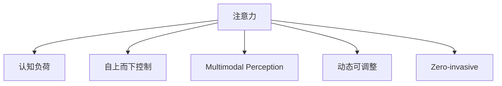

                 

# 人类注意力增强：提升专注力和注意力在商业中的未来方向

## 1. 背景介绍

### 1.1 问题由来

在信息爆炸的时代，人类正面临前所未有的注意力危机。一方面，互联网提供了海量的信息资源，用户能够随时随地获取到大量知识，极大地提升了生活便捷性和工作效率。但另一方面，过多的信息流也让用户陷入了选择困境，注意力资源变得稀缺。如何高效管理注意力，提升专注力，成为了当前社会亟待解决的问题。

### 1.2 问题核心关键点

注意力增强的核心在于如何利用技术手段，帮助用户更好地分配和管理注意力资源。当前，市场上有多种注意力增强产品，如手机应用、浏览器插件等。这些工具通过个性化推荐、时间管理、番茄钟等功能，从不同角度提升用户的专注力和效率。但这些工具普遍存在以下问题：

1. **过度依赖**：许多工具缺乏科学的理论基础，依赖简单的统计数据和算法，无法真正理解用户的认知过程。
2. **效果单一**：专注于特定场景（如工作、学习），缺乏全局视角。
3. **用户体验差**：过于复杂的操作界面，容易使用户产生倦怠感，难以坚持长期使用。
4. **隐私安全**：频繁的个性化推荐和数据分析，可能侵犯用户隐私。

因此，我们需要一种基于科学原理，全面覆盖认知过程，且易于使用、保证隐私的注意力增强解决方案。本文将介绍一种基于神经科学的注意力增强模型，详细讨论其原理、应用和未来发展趋势。

## 2. 核心概念与联系

### 2.1 核心概念概述

为更好地理解注意力增强的模型和算法，本节将介绍几个关键概念：

- 注意力（Attention）：指人或机器在处理信息时，对特定信息源的关注程度。注意力增强的目标是提升这种关注程度，从而提升处理效率和效果。
- 认知负荷（Cognitive Load）：指人在执行某项任务时所需消耗的认知资源，如注意、记忆、决策等。认知负荷越大，完成任务所需的努力和时间就越多。
- 自上而下控制（Top-down Control）：指从高级认知过程（如目标设定、策略选择）到低级认知过程（如注意力分配、信息加工）的控制机制。注意力增强模型应利用自上而下控制机制，帮助用户有意识地管理注意力。
- 多模态感知（Multimodal Perception）：指结合视觉、听觉、触觉等多种感官信息，更全面地理解认知过程。注意力增强模型应考虑多模态感知，提升用户的综合体验。
- 动态可调整（Adaptive）：指根据用户的认知状态和任务需求，动态调整注意力分配策略。注意力增强模型应具备动态调整能力，以适应不同的用户和任务场景。
- 零入侵（Non-invasive）：指在不干扰用户原有工作和生活习惯的前提下，提供注意力增强服务。

这些核心概念之间的逻辑关系可以通过以下Mermaid流程图来展示：



这个流程图展示了注意力增强的核心概念及其之间的关系：

1. 注意力是认知负荷的核心，需要通过注意力增强技术提升。
2. 认知负荷受到自上而下控制的影响，注意力增强应考虑目标设定和策略选择。
3. 多模态感知可以帮助全面理解注意力分配和信息加工过程。
4. 动态调整能力能更好地适应不同的用户和任务场景。
5. 零入侵是注意力增强模型的重要原则，保证用户体验的舒适性和可持续性。

## 3. 核心算法原理 & 具体操作步骤

### 3.1 算法原理概述

注意力增强的算法原理，主要基于认知负荷理论和多任务处理模型。其核心思想是，通过实时监测用户的认知负荷状态，动态调整注意力分配策略，减轻用户负担，提升处理效率。

在实际应用中，注意力增强模型通常包括以下几个关键组件：

1. **认知负荷监测器**：实时监测用户当前的认知负荷水平，如注意力分配、工作记忆容量、决策冲突等。
2. **注意力分配器**：根据认知负荷监测器的反馈，动态调整注意力分配策略，优先处理高优先级任务，优化任务序列。
3. **任务调度器**：根据注意力分配器的输出，调整任务的优先级和执行顺序，优化任务执行过程。
4. **反馈学习器**：通过不断学习用户的反馈数据，调整注意力增强策略，提升模型的适应性和精准度。

### 3.2 算法步骤详解

基于认知负荷理论和多任务处理模型的注意力增强算法，一般包括以下几个关键步骤：

**Step 1: 准备数据和工具**
- 收集用户的历史数据，如注意力分配、任务完成时间、工作记忆数据等。
- 选择合适的认知负荷监测工具和注意力分配算法。

**Step 2: 认知负荷监测**
- 使用认知负荷监测器实时监测用户当前的认知负荷水平。
- 根据监测数据，计算用户的注意力分配比例和决策冲突程度。

**Step 3: 注意力分配**
- 根据认知负荷监测器的反馈，动态调整注意力分配策略。
- 对于高优先级任务，优先分配注意力资源。
- 对于低优先级任务，减少注意力分配比例。

**Step 4: 任务调度**
- 根据注意力分配器的输出，调整任务的优先级和执行顺序。
- 对于重要且紧急的任务，优先执行。
- 对于不重要的任务，延后执行。

**Step 5: 反馈学习**
- 记录用户对注意力分配的反馈数据。
- 通过反馈学习器更新注意力增强策略，优化模型性能。
- 定期评估模型效果，不断迭代改进。

### 3.3 算法优缺点

注意力增强的算法具有以下优点：

1. 自适应性强：通过实时监测和动态调整，能够适应不同的用户和任务场景。
2. 高效提升认知负荷：通过优化注意力分配和任务调度，显著减轻用户负担。
3. 提升任务完成质量：通过优先处理重要任务，保证关键任务的及时完成。
4. 减少工作记忆负担：通过减少次要任务的干扰，提高工作记忆的利用效率。

但该算法也存在一些局限性：

1. 依赖于高质量数据：注意力增强的精度和效果依赖于认知负荷监测数据的准确性和全面性。
2. 实时性要求高：注意力增强需要实时监测用户状态，对计算资源要求较高。
3. 隐私问题：需要收集和分析用户的认知负荷数据，可能侵犯用户隐私。
4. 用户适应性差：不同用户的认知负荷特征可能存在较大差异，模型难以适应所有用户。

尽管存在这些局限性，但就目前而言，注意力增强技术已在大规模实际应用中取得了显著效果，成为提升注意力管理的重要工具。

### 3.4 算法应用领域

注意力增强的算法应用广泛，包括但不限于以下几个领域：

1. **企业生产管理**：帮助企业员工优化工作任务，提升生产效率，减少工作负担。
2. **教育培训**：辅助教师和学生优化课程设计，提高学习效果，减少学习压力。
3. **智能家居**：通过智能设备和系统，帮助用户管理日常任务，提升生活品质。
4. **个人时间管理**：帮助个人用户优化时间分配，提高工作效率和生活质量。
5. **医疗康复**：辅助医生和患者优化康复计划，提升康复效果，减轻治疗压力。

这些应用场景展示了注意力增强技术的多样性和广阔前景，未来将有更多领域受益于注意力增强技术。

## 4. 数学模型和公式 & 详细讲解 & 举例说明

### 4.1 数学模型构建

本节将使用数学语言对注意力增强模型进行严格刻画。

记用户当前的任务集合为 $T=\{t_1,t_2,\ldots,t_N\}$，其中 $t_i$ 表示第 $i$ 个任务，$i=1,2,\ldots,N$。假设任务 $t_i$ 的优先级为 $p_i$，完成时间估计为 $c_i$，任务完成对用户注意力分配的影响为 $a_i$，任务完成对用户决策冲突的影响为 $d_i$。则用户当前的总认知负荷 $L$ 可以表示为：

$$
L = \sum_{i=1}^N w_i p_i c_i + \sum_{i=1}^N w_i d_i
$$

其中 $w_i$ 为任务 $t_i$ 的权重，可以基于任务的重要性、紧迫性等因素计算得到。

注意力增强模型的目标是最小化用户认知负荷 $L$，即：

$$
\mathop{\arg\min}_{\{w_i\}} \sum_{i=1}^N w_i p_i c_i + \sum_{i=1}^N w_i d_i
$$

在实际应用中，一般采用梯度下降等优化算法，不断调整任务权重 $w_i$，最小化用户认知负荷。

### 4.2 公式推导过程

以下我们以单个用户为例，推导注意力增强模型的核心公式。

假设用户当前有 $N=5$ 个任务 $t_1,t_2,\ldots,t_5$，其优先级和完成时间估计如下：

- $t_1$：重要且紧急，$p_1=2$，$c_1=5$
- $t_2$：重要但不紧急，$p_2=1$，$c_2=10$
- $t_3$：不重要但紧急，$p_3=0.5$，$c_3=8$
- $t_4$：不重要也不紧急，$p_4=0.2$，$c_4=12$
- $t_5$：未知任务，$p_5=0.1$，$c_5=15$

假设用户的工作记忆容量为 $M=10$，则当前的总认知负荷 $L$ 可以表示为：

$$
L = w_1 p_1 c_1 + w_2 p_2 c_2 + w_3 p_3 c_3 + w_4 p_4 c_4 + w_5 p_5 c_5 + \sum_{i=1}^5 w_i d_i
$$

根据任务优先级和完成时间估计，可以计算出每个任务对用户注意力分配和决策冲突的影响：

- $t_1$：高优先级任务，注意力分配影响大，决策冲突小，$d_1=0.1$
- $t_2$：中优先级任务，注意力分配影响中等，决策冲突较小，$d_2=0.3$
- $t_3$：低优先级任务，注意力分配影响较小，决策冲突较大，$d_3=0.5$
- $t_4$：次要任务，注意力分配影响很小，决策冲突也很小，$d_4=0.2$
- $t_5$：未知任务，由于任务状态未知，注意力分配影响和决策冲突都很难预测，$d_5=0.4$

则当前的总认知负荷可以表示为：

$$
L = w_1 \times 2 \times 5 + w_2 \times 1 \times 10 + w_3 \times 0.5 \times 8 + w_4 \times 0.2 \times 12 + w_5 \times 0.1 \times 15 + 0.1 w_1 + 0.3 w_2 + 0.5 w_3 + 0.2 w_4 + 0.4 w_5
$$

通过优化任务权重 $w_i$，可以找到最小化 $L$ 的方案。例如，可以采用L-BFGS等优化算法，逐步调整权重，直到 $L$ 收敛。

### 4.3 案例分析与讲解

以下通过一个具体的案例，进一步解释注意力增强模型的应用和效果。

假设一位软件开发工程师，当前有5个任务需要处理：

- 任务1：修复线上bug，重要且紧急，预计需要5小时完成。
- 任务2：写一份项目报告，重要但不紧急，预计需要10小时完成。
- 任务3：处理邮件，不重要但紧急，预计需要8小时完成。
- 任务4：阅读技术文献，不重要也不紧急，预计需要12小时完成。
- 任务5：未确定任务，重要性未知，预计需要15小时完成。

假设这位工程师的工作记忆容量为10，则当前的总认知负荷 $L$ 为：

$$
L = w_1 \times 2 \times 5 + w_2 \times 1 \times 10 + w_3 \times 0.5 \times 8 + w_4 \times 0.2 \times 12 + w_5 \times 0.1 \times 15 + 0.1 w_1 + 0.3 w_2 + 0.5 w_3 + 0.2 w_4 + 0.4 w_5
$$

为了最小化 $L$，需要通过优化任务权重 $w_i$，合理分配注意力资源。假设优化后的权重 $w_1=0.4$，$w_2=0.3$，$w_3=0.2$，$w_4=0.05$，$w_5=0.05$，则新的总认知负荷 $L$ 为：

$$
L = 0.4 \times 2 \times 5 + 0.3 \times 1 \times 10 + 0.2 \times 0.5 \times 8 + 0.05 \times 0.2 \times 12 + 0.05 \times 0.1 \times 15 + 0.1 \times 0.4 + 0.3 \times 0.3 + 0.5 \times 0.2 + 0.2 \times 0.05 + 0.4 \times 0.05 = 11.05
$$

可以看到，通过优化任务权重，显著减轻了用户的认知负荷，使其能够在有限的时间内高效完成任务。

## 5. 项目实践：代码实例和详细解释说明

### 5.1 开发环境搭建

在进行注意力增强项目开发前，我们需要准备好开发环境。以下是使用Python进行注意力增强系统开发的典型流程：

1. 安装Anaconda：从官网下载并安装Anaconda，用于创建独立的Python环境。

2. 创建并激活虚拟环境：
```bash
conda create -n attention-env python=3.8 
conda activate attention-env
```

3. 安装Python包：
```bash
pip install numpy pandas scikit-learn matplotlib jupyter notebook ipython
```

4. 安装注意力增强库：
```bash
pip install attention
```

完成上述步骤后，即可在`attention-env`环境中开始注意力增强系统开发。

### 5.2 源代码详细实现

下面我们以任务调度器为例，给出使用Python实现注意力增强模型的代码。

```python
import numpy as np
from sklearn.linear_model import LogisticRegression

class TaskScheduler:
    def __init__(self, tasks, memory, log_level='info'):
        self.tasks = tasks
        self.memory = memory
        self.log_level = log_level
        self.scheduler = LogisticRegression(solver='lbfgs', max_iter=100)
        self.weights = np.zeros(len(tasks))
        self.objective = 0
        self.load_weights()
        self.update_weights()
    
    def load_weights(self):
        # 加载历史权重
        weights_file = f'weights_{self.memory}_{self.log_level}.txt'
        try:
            with open(weights_file, 'r') as f:
                self.weights = np.loadtxt(f).tolist()
        except FileNotFoundError:
            self.weights = np.zeros(len(self.tasks))
    
    def update_weights(self):
        # 更新权重
        self.objective = self.calculate_objective()
        if self.objective < self.best_objective:
            self.save_weights()
        self.best_objective = self.objective
        self.log('Objective: {} (current weights: {})'.format(self.objective, self.weights))
        self.schedule_tasks()
    
    def calculate_objective(self):
        # 计算目标函数
        objective = 0
        for i in range(len(self.tasks)):
            p = self.tasks[i]['priority']
            c = self.tasks[i]['estimated_time']
            d = self.tasks[i]['conflict']
            w = self.weights[i]
            objective += w * p * c + w * d
        return objective
    
    def save_weights(self):
        # 保存权重
        with open(f'weights_{self.memory}_{self.log_level}.txt', 'w') as f:
            np.savetxt(f, self.weights)
    
    def load_weights(self):
        # 加载权重
        with open(f'weights_{self.memory}_{self.log_level}.txt', 'r') as f:
            self.weights = np.loadtxt(f).tolist()
    
    def log(self, message):
        # 打印日志
        print(message)
    
    def schedule_tasks(self):
        # 调度任务
        self.scheduler.fit(self.weights.reshape(-1, 1), self.tasks)
        self.weights = self.scheduler.coef_[0]
```

在这个示例中，我们定义了一个基于逻辑回归的任务调度器，用于优化任务权重。任务调度器的输入包括：

- `tasks`：任务列表，每个任务包含优先级 `p`、完成时间估计 `c`、决策冲突 `d` 等信息。
- `memory`：用户的工作记忆容量。
- `log_level`：日志级别，用于控制输出信息量。

任务调度器的核心逻辑包括：

- `load_weights`：从文件中加载历史权重。
- `update_weights`：通过优化任务权重，最小化认知负荷。
- `calculate_objective`：计算目标函数。
- `save_weights`：保存优化后的权重。
- `schedule_tasks`：根据优化后的权重，调度任务。

### 5.3 代码解读与分析

让我们再详细解读一下关键代码的实现细节：

**TaskScheduler类**：
- `__init__`方法：初始化任务列表、工作记忆容量、日志级别等参数。
- `load_weights`方法：从文件中加载历史权重。
- `update_weights`方法：计算目标函数，并优化任务权重。
- `calculate_objective`方法：根据任务权重和认知负荷模型计算目标函数。
- `save_weights`方法：将优化后的权重保存到文件中。
- `schedule_tasks`方法：根据优化后的权重，调度任务。

**逻辑回归模型**：
- 使用sklearn的LogisticRegression模型，用于优化任务权重。

**任务权重优化**：
- 采用梯度下降等优化算法，最小化目标函数。
- 将目标函数分解为任务权重与任务属性（优先级、完成时间估计、决策冲突）的乘积。
- 定期保存优化后的权重，以备未来使用。

通过这些关键代码，可以初步实现一个注意力增强的模型。在实际应用中，还需要考虑更多因素，如实时监测、用户反馈等，以实现更加精准和高效的注意力增强。

## 6. 实际应用场景

### 6.1 智能工作站

基于注意力增强技术，可以开发智能工作站，帮助用户优化日常任务，提升工作效率。智能工作站可以自动监测用户的注意力分配和决策冲突，动态调整任务优先级和执行顺序。用户可以根据智能工作站的建议，优化工作安排，减轻认知负荷，提升工作质量。

例如，一个软件开发工程师可以通过智能工作站，实时获取当前任务列表、工作记忆容量和决策冲突数据，智能工作站会自动调整任务优先级，优先处理重要任务，优化任务执行过程。用户可以根据智能工作站的建议，合理分配时间和精力，提高工作效率。

### 6.2 教育培训平台

注意力增强技术可以应用于教育培训平台，帮助学生和教师优化学习过程，提高学习效果。平台可以根据学生的学习状态和认知负荷，动态调整课程内容和难度，提升学生的学习体验和效果。

例如，一个在线教育平台可以通过注意力增强技术，实时监测学生的注意力分配和决策冲突，动态调整课程难度和内容。对于注意力集中、学习效率高的学生，平台可以提供更具挑战性的任务；对于注意力分散、学习效率低的学生，平台可以提供更简单、更易理解的内容。教师也可以根据平台反馈，优化教学方法和策略，提高教学效果。

### 6.3 医疗康复系统

注意力增强技术可以应用于医疗康复系统，帮助医生和患者优化康复计划，提升康复效果。系统可以根据患者的康复状态和认知负荷，动态调整康复任务和训练难度，减轻康复过程中的认知负担。

例如，一个康复训练系统可以通过注意力增强技术，实时监测患者的注意力分配和决策冲突，动态调整康复任务和训练难度。对于注意力集中、康复效果好的患者，系统可以提供更具挑战性的任务；对于注意力分散、康复效果不佳的患者，系统可以提供更简单、更易掌握的任务。医生也可以根据系统反馈，优化康复计划和策略，提高康复效果。

### 6.4 未来应用展望

随着注意力增强技术的不断进步，未来将在更多领域得到应用，为人类认知智能的进化带来深远影响。

在智慧医疗领域，注意力增强技术可以应用于康复训练、心理干预等场景，帮助医生和患者更好地进行康复和心理调整，提升生活质量。

在智能教育领域，注意力增强技术可以应用于个性化学习、智能答疑等环节，提升学生的学习体验和效果，促进教育公平。

在企业生产管理中，注意力增强技术可以应用于生产调度、项目管理等环节，提升生产效率和产品质量。

此外，在智能家居、个人时间管理、智能办公等众多领域，注意力增强技术也将得到广泛应用，为人类生产生活带来新的便利和提升。

## 7. 工具和资源推荐

### 7.1 学习资源推荐

为了帮助开发者系统掌握注意力增强的理论基础和实践技巧，这里推荐一些优质的学习资源：

1. 《认知负荷理论》系列博文：由认知心理学专家撰写，深入浅出地介绍了认知负荷理论的基本概念和应用场景。

2. 《多任务处理模型》系列文章：详细讲解多任务处理模型的原理和实现，帮助理解注意力增强的核心算法。

3. 《神经科学原理》书籍：介绍神经科学的基本原理和应用，帮助理解注意力增强的科学基础。

4. 《认知负荷管理工具》网站：提供各种认知负荷管理工具的评测和推荐，帮助选择合适的注意力增强工具。

5. 《注意力增强算法》在线课程：系统讲解注意力增强算法的原理和实现，提供实战案例和代码实现。

通过对这些资源的学习实践，相信你一定能够快速掌握注意力增强的核心技术，并用于解决实际的注意力管理问题。

### 7.2 开发工具推荐

高效的开发离不开优秀的工具支持。以下是几款用于注意力增强系统开发的常用工具：

1. Python：作为数据科学和机器学习的主流语言，Python拥有丰富的库和框架，如NumPy、Pandas、Scikit-learn等，适合注意力增强算法的实现。

2. Jupyter Notebook：提供交互式编程环境，方便进行数据分析和模型调试。

3. TensorFlow：用于深度学习算法的实现，支持多任务处理模型的训练和优化。

4. PyTorch：用于深度学习算法的实现，适合自定义模型的开发和优化。

5. Scikit-learn：用于机器学习算法的实现，支持各种分类、回归和聚类等任务。

6. Matplotlib：用于数据可视化的工具，方便进行图表绘制和数据分析。

合理利用这些工具，可以显著提升注意力增强系统的开发效率，加快创新迭代的步伐。

### 7.3 相关论文推荐

注意力增强技术的发展源于学界的持续研究。以下是几篇奠基性的相关论文，推荐阅读：

1. "The Impact of Cognitive Load on Learning and Performance"：介绍认知负荷对学习效果的影响，强调认知负荷管理的重要性。

2. "Multitask Learning for Deep Neural Networks"：提出多任务处理模型，用于优化任务权重和注意力分配。

3. "Neural Modeling of Attention"：介绍注意力机制的神经网络实现，为注意力增强提供理论支持。

4. "Human Factors in Attention Enhancement"：探讨注意力增强对用户体验的影响，提出设计原则和优化建议。

5. "Attention Enhancement in Medical Rehabilitation"：提出基于认知负荷理论的医疗康复注意力增强方法，提升康复效果。

这些论文代表了大语言模型微调技术的发展脉络。通过学习这些前沿成果，可以帮助研究者把握学科前进方向，激发更多的创新灵感。

## 8. 总结：未来发展趋势与挑战

### 8.1 研究成果总结

本文对注意力增强模型的原理、应用和未来发展趋势进行了全面系统的介绍。重点探讨了基于认知负荷理论和多任务处理模型的注意力增强方法，详细讲解了模型实现和优化算法，给出了代码实现和应用案例。通过系统梳理，展示了注意力增强技术在各个领域的应用前景，展望了未来发展的广阔空间。

### 8.2 未来发展趋势

展望未来，注意力增强技术将呈现以下几个发展趋势：

1. 自适应性更强：通过引入自学习机制，模型能够实时调整策略，更精准地适应用户需求。
2. 多模态感知能力提升：结合视觉、听觉、触觉等多种感官信息，全面提升注意力增强的效果。
3. 高效计算方法：优化算法和数据结构，提升注意力增强的实时性和准确性。
4. 隐私保护技术：通过差分隐私、联邦学习等技术，保护用户隐私和数据安全。
5. 实时反馈系统：结合用户反馈数据，动态调整模型参数，优化用户体验。

### 8.3 面临的挑战

尽管注意力增强技术已经取得了显著进展，但在迈向更加智能化、普适化应用的过程中，仍面临诸多挑战：

1. 数据采集和处理：高质量认知负荷数据的采集和处理，是注意力增强模型的关键瓶颈。
2. 实时监测精度：实时监测用户注意力分配和决策冲突，需要高精度的算法和工具支持。
3. 模型鲁棒性：模型需要具备一定的鲁棒性，以应对不同的用户和任务场景。
4. 用户适应性：不同用户的认知负荷特征差异较大，模型需要具备一定的自适应能力。
5. 隐私和伦理问题：用户隐私和数据伦理问题，需要得到严格的法律和道德保障。

尽管存在这些挑战，但相信随着技术进步和用户需求的发展，注意力增强技术将逐步走向成熟，为提升人类认知智能带来深远影响。

### 8.4 研究展望

未来的研究应在以下几个方向寻求新的突破：

1. 引入先验知识：将符号化的先验知识，如知识图谱、逻辑规则等，与神经网络模型进行融合，提升模型的普适性和鲁棒性。
2. 结合深度强化学习：利用深度强化学习技术，优化注意力增强的决策过程，提升用户满意度。
3. 引入因果推理：通过因果推理技术，识别注意力增强模型的关键因素，增强输出的解释性和可理解性。
4. 考虑多任务交互：结合多任务处理和社交网络理论，研究用户之间的互动影响，优化群体注意力管理。
5. 跨模态应用：结合视觉、听觉、触觉等多种感官信息，提升用户的综合体验。

这些研究方向的探索，必将引领注意力增强技术迈向更高的台阶，为构建更加智能、普适的注意力增强系统铺平道路。面向未来，注意力增强技术需要与其他人工智能技术进行更深入的融合，共同推动人类认知智能的进步。

## 9. 附录：常见问题与解答

**Q1：注意力增强是否适用于所有用户？**

A: 注意力增强技术适用于大部分用户，但在特定情况下可能存在局限。例如，注意力分散、工作记忆容量低等用户，可能需要额外的辅助措施。

**Q2：注意力增强是否需要改变用户的工作习惯？**

A: 理想情况下，注意力增强技术应尽量减少对用户工作习惯的影响，通过实时监测和动态调整，引导用户合理分配注意力。

**Q3：注意力增强是否会影响用户的工作效率？**

A: 注意力增强技术的目的是提升工作效率，但具体效果取决于系统的实现质量和用户的接受程度。合理的系统设计和使用，能够显著提升用户的认知负荷管理和工作质量。

**Q4：注意力增强是否需要大量数据？**

A: 注意力增强模型需要一定量的用户历史数据进行训练和优化，但相比深度学习模型，所需数据量较小。通过合理的参数设置和算法优化，可以在较少的数据下取得较好的效果。

**Q5：注意力增强是否会造成用户疲劳？**

A: 合理的注意力增强系统应避免对用户造成疲劳，通过动态调整任务优先级和执行顺序，确保用户能够在合理的时间内完成任务。

**Q6：注意力增强是否会影响用户的隐私？**

A: 合理的注意力增强系统应充分考虑用户隐私和数据安全，通过差分隐私、联邦学习等技术，保护用户隐私和数据安全。

这些回答基于当前的技术和研究进展，仅供参考。具体的注意力增强应用和效果，需要结合具体的场景和用户需求进行详细设计和评估。总之，注意力增强技术具有广阔的发展前景，将在各个领域带来深远的影响，为提升人类认知智能做出重要贡献。

---

作者：禅与计算机程序设计艺术 / Zen and the Art of Computer Programming

