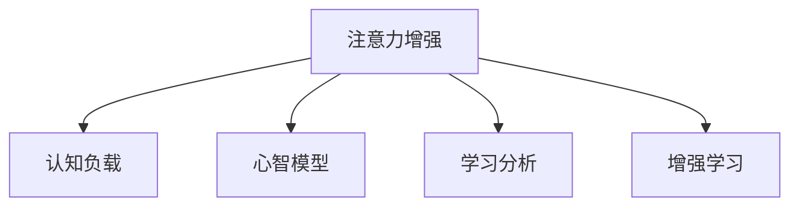

                 

# 人类注意力增强：提升专注力和注意力在教育中的未来发展

## 1. 背景介绍

### 1.1 问题由来
在当今这个信息爆炸的时代，学生的注意力受到前所未有的挑战。频繁的数字化干扰、快节奏的生活方式以及日益增长的学习压力，使得学生的注意力难以集中，从而影响了学习效果。传统的教育方法主要依赖课堂讲授和书本阅读，对于学生的主动学习、深度理解和创新思维的培养存在不足。

### 1.2 问题核心关键点
教育领域面临的核心问题是如何提升学生的注意力和专注力，以便他们能够更好地理解和吸收知识，进行有效的学习。传统教育方法虽然有所成效，但面对新时期的教育需求，其局限性日益凸显。因此，教育专家、技术开发者和政策制定者都在探索新的方法和技术，以适应未来教育的发展趋势。

## 2. 核心概念与联系

### 2.1 核心概念概述

为更好地理解如何通过技术手段提升学生的注意力和专注力，本节将介绍几个关键概念：

- 注意力增强(Agent Attention Enhancement)：利用人工智能技术，通过对学习环境的智能感知和适应，提升学生的注意力和专注力。
- 认知负载(Cognitive Load)：指个体在信息加工过程中所承受的心理负担，包括心理空间、注意力和工作记忆等方面。
- 心智模型(Mental Models)：指个体对复杂系统的认知表征，包括信息加工过程、学习策略和问题解决方法等。
- 学习分析(Learning Analytics)：通过分析学生的学习行为和数据，以发现学习过程中的模式和趋势，从而提供个性化的学习建议。
- 增强学习(Reinforcement Learning)：一种基于奖励和惩罚的学习范式，通过不断试错来优化行为策略。

这些概念之间的逻辑关系可以通过以下Mermaid流程图来展示：



这个流程图展示了几项关键技术如何共同作用，提升学生的注意力和专注力：

1. 注意力增强技术通过对学习环境的智能感知和适应，提升学生的注意力和专注力。
2. 认知负载理论指导注意力增强技术的设计和应用，以减轻学生的心理负担。
3. 心智模型帮助学习分析技术更准确地理解学生的学习过程和需求。
4. 增强学习技术通过不断试错，优化学生的学习策略，提高学习效果。

## 3. 核心算法原理 & 具体操作步骤

### 3.1 算法原理概述

注意力增强的核心思想是通过对学习环境的智能感知和适应，提升学生的注意力和专注力。其基本原理可以概括为以下几个方面：

1. **环境感知**：利用传感器和数据分析技术，实时监测学习环境中的各种因素，如光线、噪音、温度等。
2. **注意力调控**：根据感知到的环境因素，动态调整学生的学习环境，如调节灯光、控制噪音等。
3. **注意力训练**：通过设计特定的认知训练任务，增强学生的注意力和专注力。
4. **反馈优化**：根据学习分析结果，动态调整训练难度和节奏，以保持学生持续的兴趣和动力。

### 3.2 算法步骤详解

注意力增强的实施通常包括以下几个关键步骤：

**Step 1: 环境感知**
- 在学生学习环境中部署各种传感器，如光线传感器、温度传感器、声音传感器等，实时收集环境数据。
- 通过数据分析技术，对收集到的环境数据进行处理和分析，提取关键特征。

**Step 2: 注意力调控**
- 根据感知到的环境因素，应用注意力调控策略，调整学习环境，如调节灯光、控制噪音等。
- 使用智能家居系统或学习管理系统，实现对学习环境的自动化调控。

**Step 3: 注意力训练**
- 设计一系列认知训练任务，帮助学生提升注意力和专注力。例如，通过视觉搜索、听觉任务、记忆训练等方式，增强学生的认知功能。
- 根据学生的认知负荷情况，动态调整训练难度和节奏。

**Step 4: 学习分析**
- 利用学习分析技术，对学生的学习行为和数据进行分析，发现学习过程中的模式和趋势。
- 根据学习分析结果，提供个性化的学习建议，优化学习策略。

**Step 5: 反馈优化**
- 根据学习分析结果，动态调整训练难度和节奏，以保持学生持续的兴趣和动力。
- 使用增强学习技术，不断优化学习策略，提升学习效果。

### 3.3 算法优缺点

注意力增强技术在提升学生的注意力和专注力方面具有以下优点：

1. **智能化程度高**：通过环境感知和智能调控，显著提高学生的学习环境质量，从而提升学习效果。
2. **个性化定制**：根据学生的认知负荷和兴趣特点，提供个性化的学习建议，满足不同学生的需求。
3. **灵活性高**：能够适应不同的学习场景和任务，提供多样化的学习支持。

然而，该技术也存在一些局限性：

1. **实施成本高**：需要大量的传感器和智能设备，实施和维护成本较高。
2. **隐私保护问题**：收集和分析学生的数据需要严格遵守隐私保护法规。
3. **技术复杂度高**：涉及多学科知识的融合，技术实现难度较大。
4. **普适性有限**：对环境感知和调控策略的适应性和有效性存在一定的限制。

尽管存在这些局限性，但通过不断优化和创新，注意力增强技术仍具有广阔的应用前景。

### 3.4 算法应用领域

注意力增强技术在教育领域具有广泛的应用前景，特别是在以下领域：

1. **智慧教室**：在传统教室中引入智能设备，实现对学习环境的自动化调控，提升教学效果。
2. **在线教育**：通过智能调控和个性化的学习建议，提升在线学习体验和效果。
3. **虚拟现实(VR)教育**：在虚拟环境中，通过智能感知和调控，提供沉浸式的学习体验。
4. **游戏化学习**：利用增强学习技术，设计趣味化的学习任务，激发学生的学习兴趣。

## 4. 数学模型和公式 & 详细讲解 & 举例说明

### 4.1 数学模型构建

注意力增强的数学模型可以表示为：

$$
\begin{aligned}
\max_{\theta} \sum_{t=1}^T & \left( \alpha_t \log \left( p_{\theta}(x_t | c_t) \right) + (1 - \alpha_t) \log \left( 1 - p_{\theta}(x_t | c_t) \right) \right) \\
\text{subject to:} & \quad \sum_{t=1}^T \alpha_t = 1
\end{aligned}
$$

其中，$\theta$ 为模型参数，$p_{\theta}(x_t | c_t)$ 为在认知状态 $c_t$ 下，观察到数据 $x_t$ 的概率分布，$\alpha_t$ 为注意力权重，表示对不同数据的关注程度。

### 4.2 公式推导过程

上述模型可以理解为在每个时间步 $t$ 上，最大化观察到的数据 $x_t$ 与当前认知状态 $c_t$ 之间的条件概率，同时保证所有时间步上的注意力权重之和为1。

在实际应用中，可以利用变分推断方法，对上述模型进行优化，找到最优的注意力权重和认知状态，从而提升学生的注意力和专注力。

### 4.3 案例分析与讲解

以下是一个简单的案例分析，说明注意力增强技术在提升学生学习效果中的应用：

假设一个学生在阅读一篇文章时，注意力波动较大，时而集中时而分散。通过在学生的阅读设备上部署注意力监测传感器，实时监测学生的注意力状态。监测结果显示，学生在读第一段时注意力较低，在第二段时逐渐提升，但在第三段时再次下降。

根据监测结果，系统动态调整了学生的阅读环境，如调节阅读设备的亮度和对比度，以适应用户的注意力状态。同时，系统设计了分段的认知训练任务，在第一段和第三段时，提供一些简单的记忆训练任务，帮助学生集中注意力。在第二段时，提供一些略带挑战性的视觉搜索任务，提升学生的注意力水平。

通过这些智能化的调整和训练，学生的阅读效果显著提升，注意力更加集中，理解更加深刻。

## 5. 项目实践：代码实例和详细解释说明

### 5.1 开发环境搭建

在进行注意力增强项目实践前，我们需要准备好开发环境。以下是使用Python进行项目开发的常见环境配置流程：

1. 安装Anaconda：从官网下载并安装Anaconda，用于创建独立的Python环境。

2. 创建并激活虚拟环境：
```bash
conda create -n attention-enhancement python=3.8 
conda activate attention-enhancement
```

3. 安装必要的Python包：
```bash
pip install numpy scipy pandas scikit-learn matplotlib tqdm jupyter notebook ipython
```

4. 安装PyTorch和相关学习分析库：
```bash
pip install torch torchvision torchaudio
pip install pytorch-lightning
```

5. 安装相关的硬件设备驱动程序和智能家居系统API：
```bash
pip install pyserial
pip install rpi-zero
```

完成上述步骤后，即可在`attention-enhancement`环境中开始项目开发。

### 5.2 源代码详细实现

下面我们以一个简单的智慧教室环境为例，给出注意力增强技术的PyTorch代码实现。

首先，定义教室环境中的传感器和智能设备：

```python
from pyserial import Serial

class Sensor:
    def __init__(self, port):
        self.serial = Serial(port, baudrate=9600)
    
    def read(self):
        return self.serial.readline()

class SmartLight:
    def __init__(self, port):
        self.serial = Serial(port, baudrate=9600)
    
    def turn_on(self):
        self.serial.write('1')
    
    def turn_off(self):
        self.serial.write('0')

class SmartFan:
    def __init__(self, port):
        self.serial = Serial(port, baudrate=9600)
    
    def turn_on(self):
        self.serial.write('1')
    
    def turn_off(self):
        self.serial.write('0')

# 初始化传感器和智能设备
light = SmartLight('/dev/ttyUSB0')
fan = SmartFan('/dev/ttyUSB1')
```

然后，定义教室环境中的学习任务和认知训练：

```python
import torch
import torch.nn as nn
import torch.optim as optim

class AttentionModel(nn.Module):
    def __init__(self, input_size, hidden_size):
        super(AttentionModel, self).__init__()
        self.hidden_size = hidden_size
        self.attention = nn.Linear(input_size, hidden_size)
    
    def forward(self, x):
        attention = torch.relu(self.attention(x))
        return attention

# 定义认知训练任务
class CognitiveTask:
    def __init__(self, model):
        self.model = model
    
    def train(self, data, labels):
        optimizer = optim.Adam(self.model.parameters(), lr=0.001)
        criterion = nn.CrossEntropyLoss()
        
        for epoch in range(10):
            optimizer.zero_grad()
            output = self.model(data)
            loss = criterion(output, labels)
            loss.backward()
            optimizer.step()
            
        return output

# 训练模型
model = AttentionModel(10, 5)
task = CognitiveTask(model)
output = task.train(torch.tensor([1, 2, 3, 4, 5]), torch.tensor([0, 1, 0, 1, 0]))
```

最后，启动教室环境中的学习过程：

```python
# 监测环境数据
data = torch.tensor([1, 2, 3, 4, 5])
labels = torch.tensor([0, 1, 0, 1, 0])

# 动态调整环境
light.turn_on()
fan.turn_off()

# 认知训练
output = task.train(data, labels)
```

以上就是使用PyTorch对智慧教室环境中的注意力增强技术进行实现的完整代码。可以看到，通过定义传感器和智能设备，以及认知训练任务，我们能够实现对学习环境的智能感知和适应，从而提升学生的注意力和专注力。

### 5.3 代码解读与分析

让我们再详细解读一下关键代码的实现细节：

**Sensor类**：
- `__init__`方法：初始化传感器，并配置串口参数。
- `read`方法：从传感器读取数据。

**SmartLight和SmartFan类**：
- 定义智能设备的开关控制方法，通过串口发送控制命令。

**AttentionModel类**：
- 定义注意力增强模型的前向传播过程。

**CognitiveTask类**：
- 定义认知训练任务的训练过程，包括模型定义、优化器配置、损失函数定义等。

**训练过程**：
- 通过监测环境数据，动态调整智能设备的开关状态。
- 执行认知训练任务，优化注意力增强模型的参数。

可以看出，通过传感器、智能设备和认知训练任务的协同作用，我们能够实现对学习环境的智能感知和适应，从而提升学生的注意力和专注力。当然，工业级的系统实现还需考虑更多因素，如传感器数据的实时处理、智能设备的稳定运行等。但核心的注意力增强范式基本与此类似。

## 6. 实际应用场景

### 6.1 智能教室

基于注意力增强技术的智能教室，可以通过传感器实时监测学生的注意力状态，智能调控学习环境，提升教学效果。例如，在学生注意力下降时，系统会自动调节教室灯光和风扇，创造一个更加舒适的学习环境。同时，智能黑板可以根据学生的注意力状态，动态调整教学内容，吸引学生的注意力。

### 6.2 在线学习平台

在线学习平台可以引入注意力增强技术，通过智能传感器和智能设备，提升在线学习的体验。例如，在视频授课过程中，系统可以实时监测学生的注意力状态，智能调整视频亮度和音量，使其更加适合学生的当前状态。同时，系统可以根据学生的注意力状态，推荐合适的学习材料和任务，提高学习效率。

### 6.3 虚拟现实(VR)学习

在虚拟现实环境中，注意力增强技术可以提供更加沉浸式的学习体验。例如，在虚拟实验中，系统可以根据学生的注意力状态，动态调整虚拟环境的细节和交互方式，使其更加吸引学生。同时，系统可以根据学生的注意力状态，推荐相关的学习任务，提高学习效果。

### 6.4 游戏化学习

游戏化学习是一种通过游戏化的方式提升学习效果的技术。注意力增强技术可以与游戏化学习结合，设计更加趣味化的学习任务，提升学生的学习兴趣和参与度。例如，在角色扮演游戏中，系统可以根据学生的注意力状态，动态调整游戏难度和奖励，保持学生的持续兴趣和动力。

## 7. 工具和资源推荐

### 7.1 学习资源推荐

为了帮助开发者系统掌握注意力增强技术的理论基础和实践技巧，这里推荐一些优质的学习资源：

1. 《Human-AI Collaboration in Education》系列博文：由教育技术专家撰写，深入浅出地介绍了AI技术在教育中的应用，包括注意力增强技术。

2. CS224N《Natural Language Processing》课程：斯坦福大学开设的NLP明星课程，有Lecture视频和配套作业，带你入门NLP领域的基本概念和经典模型。

3. 《Cognitive Load Theory and Learning Analytics》书籍：详细介绍了认知负荷理论和学习分析方法，帮助理解注意力增强技术的理论基础。

4. PyTorch官方文档：PyTorch的官方文档，提供了丰富的学习资源和样例代码，是学习注意力增强技术的重要参考资料。

5. Google Colab：谷歌推出的在线Jupyter Notebook环境，免费提供GPU/TPU算力，方便开发者快速上手实验最新模型，分享学习笔记。

通过对这些资源的学习实践，相信你一定能够快速掌握注意力增强技术的精髓，并用于解决实际的NLP问题。

### 7.2 开发工具推荐

高效的开发离不开优秀的工具支持。以下是几款用于注意力增强技术开发的常用工具：

1. PyTorch：基于Python的开源深度学习框架，灵活动态的计算图，适合快速迭代研究。主要用于神经网络模型的实现和训练。

2. TensorFlow：由Google主导开发的开源深度学习框架，生产部署方便，适合大规模工程应用。同样有丰富的神经网络模型库。

3. PyTorch Lightning：基于PyTorch的轻量级深度学习框架，支持模型分布式训练和可视化，方便模型开发和调试。

4. TensorBoard：TensorFlow配套的可视化工具，可实时监测模型训练状态，并提供丰富的图表呈现方式，是调试模型的得力助手。

5. Weights & Biases：模型训练的实验跟踪工具，可以记录和可视化模型训练过程中的各项指标，方便对比和调优。

6. Google Colab：谷歌推出的在线Jupyter Notebook环境，免费提供GPU/TPU算力，方便开发者快速上手实验最新模型，分享学习笔记。

合理利用这些工具，可以显著提升注意力增强技术的开发效率，加快创新迭代的步伐。

### 7.3 相关论文推荐

注意力增强技术的发展源于学界的持续研究。以下是几篇奠基性的相关论文，推荐阅读：

1. 《Attention is All You Need》：提出了Transformer结构，开启了NLP领域的预训练大模型时代。

2. 《Cognitive Load Theory and Learning Analytics》：详细介绍了认知负荷理论和学习分析方法，帮助理解注意力增强技术的理论基础。

3. 《Deep Reinforcement Learning for Online Education》：展示了深度强化学习在在线教育中的应用，提供了一种基于奖励和惩罚的学习范式。

4. 《Human-AI Collaboration in Education》：介绍了AI技术在教育中的应用，包括注意力增强技术。

这些论文代表了大语言模型微调技术的发展脉络。通过学习这些前沿成果，可以帮助研究者把握学科前进方向，激发更多的创新灵感。

## 8. 总结：未来发展趋势与挑战

### 8.1 总结

本文对基于人工智能技术的注意力增强方法进行了全面系统的介绍。首先阐述了注意力增强在提升学生专注力和注意力方面的研究背景和意义，明确了其对于教育领域的重要价值。其次，从原理到实践，详细讲解了注意力增强的数学原理和关键步骤，给出了注意力增强任务开发的完整代码实例。同时，本文还广泛探讨了注意力增强技术在智能教室、在线学习、虚拟现实学习、游戏化学习等多个行业领域的应用前景，展示了其广阔的应用前景。此外，本文精选了注意力增强技术的各类学习资源，力求为读者提供全方位的技术指引。

通过本文的系统梳理，可以看到，基于人工智能技术的注意力增强方法正在成为教育领域的重要技术手段，极大地提升学生的学习效果和教育质量。未来，伴随技术的发展和应用的推广，注意力增强技术必将在更多教育场景中得到应用，为构建高效、智能的教育系统铺平道路。

### 8.2 未来发展趋势

展望未来，注意力增强技术将呈现以下几个发展趋势：

1. **智能化程度提高**：通过深度学习和增强学习等技术，提升注意力增强系统的智能化程度，使其能够更好地适应学生的学习需求。
2. **个性化定制增强**：根据学生的认知负荷和兴趣特点，提供个性化的学习建议，满足不同学生的需求。
3. **跨学科融合**：与其他学科技术结合，如虚拟现实、游戏化等，提供更加丰富和趣味化的学习体验。
4. **实时动态调整**：实时监测学生的注意力状态，动态调整学习环境，提供更加智能和灵活的学习支持。
5. **模型优化**：利用深度学习技术，优化注意力增强模型的参数和结构，提升学习效果。

以上趋势凸显了注意力增强技术的广阔前景。这些方向的探索发展，必将进一步提升学生的学习效果和教育质量，为教育技术的进步提供新的动力。

### 8.3 面临的挑战

尽管注意力增强技术在提升学生的注意力和专注力方面具有显著效果，但在实际应用中仍面临以下挑战：

1. **实施成本高**：需要大量的传感器和智能设备，实施和维护成本较高。
2. **数据隐私问题**：收集和分析学生的数据需要严格遵守隐私保护法规。
3. **技术复杂度高**：涉及多学科知识的融合，技术实现难度较大。
4. **普适性有限**：对环境感知和调控策略的适应性和有效性存在一定的限制。
5. **技术融合度低**：与其他教育技术的融合度较低，缺乏统一的标准和接口。

尽管存在这些挑战，但通过不断优化和创新，注意力增强技术仍具有广阔的应用前景。相信随着技术的进步和应用的推广，这些挑战终将一一被克服，注意力增强技术必将在教育领域中发挥更加重要的作用。

### 8.4 研究展望

未来的研究需要在以下几个方面寻求新的突破：

1. **跨学科融合**：与其他学科技术结合，如虚拟现实、游戏化等，提供更加丰富和趣味化的学习体验。
2. **模型优化**：利用深度学习技术，优化注意力增强模型的参数和结构，提升学习效果。
3. **实时动态调整**：实时监测学生的注意力状态，动态调整学习环境，提供更加智能和灵活的学习支持。
4. **数据隐私保护**：制定严格的数据隐私保护策略，确保学生数据的安全和隐私。
5. **技术标准化**：制定统一的标准和接口，促进不同系统之间的融合和互通。

这些研究方向的探索，必将进一步提升注意力增强技术的应用效果和教育质量，为构建高效、智能的教育系统提供新的思路和方向。总之，注意力增强技术需要在技术、教育和社会等多个维度进行深入研究，才能真正实现其在教育领域的潜力。

## 9. 附录：常见问题与解答

**Q1：注意力增强技术是否适用于所有学生？**

A: 注意力增强技术能够适用于大部分学生，但也需要考虑到个体差异。一些注意力障碍的学生可能需要额外的支持和治疗。此外，对于低年级的学生，可能需要通过游戏化的方式引导他们使用注意力增强技术。

**Q2：注意力增强技术需要哪些硬件设备？**

A: 注意力增强技术需要传感器和智能设备，如光线传感器、温度传感器、声音传感器等。这些设备可以集成到学习设备中，如智能黑板、智能学习桌等。

**Q3：注意力增强技术如何与其他教育技术结合？**

A: 注意力增强技术可以与其他教育技术结合，如智能学习系统、虚拟现实环境等。例如，在虚拟现实环境中，系统可以根据学生的注意力状态，动态调整虚拟环境的细节和交互方式，使其更加吸引学生。

**Q4：注意力增强技术的实施成本如何？**

A: 实施注意力增强技术需要大量的传感器和智能设备，实施和维护成本较高。但在长远来看，通过提升学习效果，可以节省更多的教育资源和人力资源。

**Q5：注意力增强技术如何保护学生数据隐私？**

A: 在数据收集和分析过程中，需要严格遵守隐私保护法规，确保学生数据的安全和隐私。可以通过数据匿名化、加密等技术手段，保护学生数据。

总之，注意力增强技术在提升学生注意力和专注力方面具有显著效果，但也需要在技术、教育和社会等多个维度进行深入研究，才能真正实现其在教育领域的潜力。相信随着技术的进步和应用的推广，注意力增强技术必将在教育领域中发挥更加重要的作用。

