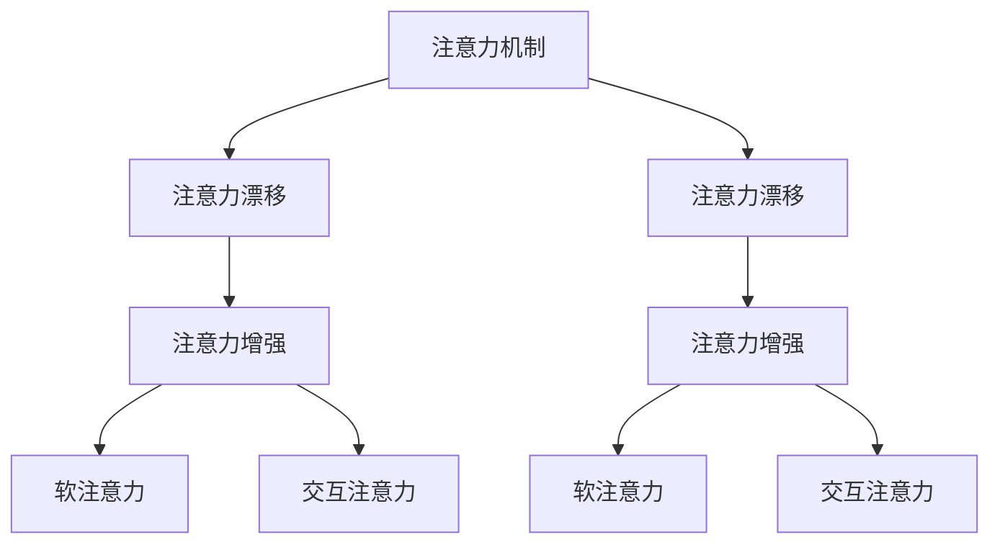

                 

# 人类注意力增强：提升创新能力和创造力技术

> 关键词：注意力增强,注意力模型,深度学习,计算机视觉,自然语言处理,创新能力,创造力

## 1. 背景介绍

### 1.1 问题由来
近年来，随着深度学习技术的快速发展，基于注意力机制的模型在计算机视觉、自然语言处理等诸多领域取得了显著的进展。这些模型的核心思想是通过注意力机制，使得模型能够更加高效地利用输入数据的特征，提升模型的表示能力和推理能力。然而，尽管这些模型在学术界和工业界均获得了广泛的认可，但在实际应用中，其注意力机制的局限性也逐渐暴露出来，尤其是在需要长时间保持关注和记忆的场景下，模型的注意力机制往往难以稳定维持，导致注意力漂移或分散，从而影响模型性能。

### 1.2 问题核心关键点
如何提升模型的注意力机制，使其能够更加稳定、高效地维持对输入数据的关注，成为当前研究的热点问题。本节将介绍几种常见的注意力增强方法，并探讨其原理和实际应用场景。

## 2. 核心概念与联系

### 2.1 核心概念概述

为了更好地理解注意力增强方法，本节将介绍几个密切相关的核心概念：

- **注意力机制(Attention Mechanism)**：是一种在深度学习中广泛应用的机制，用于捕捉输入数据的关键信息，帮助模型选择性地关注数据中不同的部分。常见于机器翻译、图像识别、文本生成等任务中。

- **注意力漂移(Attention Drift)**：指在长序列或复杂任务中，模型的注意力机制难以稳定维持，导致注意力在不同时间步或不同位置上发生漂移，从而影响模型的推理效果。

- **注意力增强(Attention Enhancement)**：指通过引入辅助机制，强化模型的注意力能力，使其在复杂或长时间序列上能够稳定地维持注意力，提升模型的推理能力和泛化性能。

- **软注意力(Soft Attention)**：相对于硬注意力(Hard Attention)，软注意力能够更加灵活地调整模型对不同输入数据的关注度，通过平滑权重分配，避免注意力漂移，提升模型性能。

- **交互注意力(Interactive Attention)**：通过引入与环境或其他模型的交互，调整模型的注意力分布，帮助模型更好地适应复杂和动态变化的环境。

这些核心概念之间的逻辑关系可以通过以下Mermaid流程图来展示：



这个流程图展示了几类注意力增强方法及其与注意力机制的关系：

1. 注意力漂移是注意力机制的一种常见问题，需要通过注意力增强方法来解决。
2. 注意力增强方法可以分为软注意力和交互注意力两种主要类型。
3. 软注意力通过平滑权重分配，避免注意力漂移，提升模型性能。
4. 交互注意力通过引入与环境或其他模型的交互，调整注意力分布，提升模型适应能力。

## 3. 核心算法原理 & 具体操作步骤
### 3.1 算法原理概述

注意力增强方法的核心思想是通过引入辅助机制，强化模型的注意力能力，使其在复杂或长时间序列上能够稳定地维持注意力，提升模型的推理能力和泛化性能。本节将介绍几种常见的注意力增强方法，包括软注意力和交互注意力。

### 3.2 算法步骤详解

#### 3.2.1 软注意力增强

软注意力增强通过平滑权重分配，避免注意力漂移，提升模型性能。其核心思想是在注意力机制的基础上，引入一个权重函数，用于调整模型对不同输入数据的关注度。

设输入数据为 $X = (x_1, x_2, ..., x_n)$，注意力权重为 $W$，注意力增强后的权重为 $W^*$。则软注意力增强的步骤如下：

1. 计算原始注意力权重 $W$：
   $$
   W = \text{Softmax}(X^\top \alpha + \beta)
   $$
   其中 $\alpha$ 和 $\beta$ 为可训练的参数。

2. 计算注意力增强后的权重 $W^*$：
   $$
   W^* = \text{Softmax}(X^\top \gamma + \delta)
   $$
   其中 $\gamma$ 和 $\delta$ 为可训练的参数，通常与 $\alpha$ 和 $\beta$ 相同。

3. 将增强后的权重 $W^*$ 代入模型，计算输出：
   $$
   Y = M_{\theta}(X, W^*)
   $$
   其中 $M_{\theta}$ 为模型函数，$\theta$ 为模型参数。

#### 3.2.2 交互注意力增强

交互注意力增强通过引入与环境或其他模型的交互，调整模型的注意力分布，提升模型的适应能力。其核心思想是在注意力机制的基础上，引入一个交互函数，用于调整模型对不同输入数据的关注度。

设输入数据为 $X = (x_1, x_2, ..., x_n)$，环境状态为 $E$，其他模型输出为 $Y$，注意力权重为 $W$，注意力增强后的权重为 $W^*$。则交互注意力增强的步骤如下：

1. 计算原始注意力权重 $W$：
   $$
   W = \text{Softmax}(X^\top \alpha + \beta)
   $$
   其中 $\alpha$ 和 $\beta$ 为可训练的参数。

2. 计算交互增强后的权重 $W^*$：
   $$
   W^* = \text{Softmax}(X^\top \gamma + \delta + \eta(E, Y))
   $$
   其中 $\eta$ 为可训练的交互函数，$E$ 和 $Y$ 为交互对象。

3. 将增强后的权重 $W^*$ 代入模型，计算输出：
   $$
   Y = M_{\theta}(X, W^*)
   $$
   其中 $M_{\theta}$ 为模型函数，$\theta$ 为模型参数。

### 3.3 算法优缺点

#### 3.3.1 软注意力增强

软注意力增强的优点包括：
1. 能够平滑权重分配，避免注意力漂移，提升模型性能。
2. 适应性较强，能够适应复杂和动态变化的环境。

其缺点包括：
1. 计算复杂度较高，特别是在大规模数据集上，增加了模型的训练和推理开销。
2. 需要额外的参数进行权重函数的训练，增加了模型的复杂度。

#### 3.3.2 交互注意力增强

交互注意力增强的优点包括：
1. 能够引入环境或模型的交互信息，提升模型的适应能力。
2. 能够动态调整注意力分布，适应复杂和动态变化的环境。

其缺点包括：
1. 需要额外引入环境或模型的交互信息，增加了模型的复杂度。
2. 交互函数的设计需要考虑具体任务和环境的特点，具有一定的难度。

### 3.4 算法应用领域

注意力增强方法在计算机视觉、自然语言处理等诸多领域都有广泛的应用。具体应用场景包括：

- **计算机视觉**：在图像识别、目标检测、图像生成等任务中，通过注意力增强，帮助模型更加关注图像中的关键区域，提升识别和生成的准确性。

- **自然语言处理**：在机器翻译、文本生成、问答系统等任务中，通过注意力增强，帮助模型更加关注输入序列中的关键信息，提升翻译和生成的流畅性。

- **机器人学**：在机器人导航、路径规划等任务中，通过注意力增强，帮助机器人更加关注环境中的关键特征，提升导航和规划的准确性。

- **游戏智能**：在游戏智能中，通过注意力增强，帮助模型更加关注游戏中的关键元素，提升智能体的决策能力和表现。

## 4. 数学模型和公式 & 详细讲解 & 举例说明

### 4.1 数学模型构建

本节将使用数学语言对注意力增强方法进行更加严格的刻画。

设输入数据为 $X = (x_1, x_2, ..., x_n)$，注意力权重为 $W$，注意力增强后的权重为 $W^*$。假设原始注意力权重 $W$ 由以下形式计算得到：

$$
W = \text{Softmax}(X^\top \alpha + \beta)
$$

其中 $\alpha$ 和 $\beta$ 为可训练的参数，$X$ 为输入数据的特征向量。

假设注意力增强后的权重 $W^*$ 由以下形式计算得到：

$$
W^* = \text{Softmax}(X^\top \gamma + \delta + \eta(E, Y))
$$

其中 $\gamma$ 和 $\delta$ 为可训练的参数，$\eta$ 为可训练的交互函数，$E$ 和 $Y$ 为交互对象。

### 4.2 公式推导过程

以下我们以图像识别任务为例，推导软注意力增强和交互注意力增强的计算公式。

设输入图像为 $X = (x_1, x_2, ..., x_n)$，原始注意力权重 $W$ 为：

$$
W = \text{Softmax}(X^\top \alpha + \beta)
$$

其中 $\alpha$ 和 $\beta$ 为可训练的参数，$X$ 为图像特征向量。

假设注意力增强后的权重 $W^*$ 为：

$$
W^* = \text{Softmax}(X^\top \gamma + \delta + \eta(E, Y))
$$

其中 $\gamma$ 和 $\delta$ 为可训练的参数，$\eta$ 为可训练的交互函数，$E$ 和 $Y$ 为交互对象。

在实际应用中，$\eta$ 可以是环境状态或其他模型输出的函数。例如，在图像生成任务中，$\eta$ 可以表示为对环境光线的响应，帮助模型在光照变化的情况下保持注意力稳定性。

### 4.3 案例分析与讲解

#### 4.3.1 图像识别中的软注意力增强

在图像识别任务中，使用软注意力增强可以帮助模型更加关注图像中的关键区域，提升识别的准确性。以下是一个简单的例子：

```python
import torch
import torch.nn as nn
import torch.nn.functional as F

class SoftAttention(nn.Module):
    def __init__(self, in_dim):
        super(SoftAttention, self).__init__()
        self.alpha = nn.Parameter(torch.rand(in_dim, in_dim))
        self.beta = nn.Parameter(torch.rand(in_dim))

    def forward(self, x):
        w = F.softmax(torch.matmul(x, self.alpha) + self.beta)
        return w

class Model(nn.Module):
    def __init__(self, in_dim):
        super(Model, self).__init__()
        self.fc = nn.Linear(in_dim, 10)
        self.soft_att = SoftAttention(in_dim)

    def forward(self, x):
        w = self.soft_att(x)
        x = self.fc(w)
        return x
```

在这个例子中，我们使用 SoftAttention 模块计算注意力权重 $w$，并将其作为模型输入的加权和。这个模型首先通过线性层对输入进行特征提取，然后通过 SoftAttention 模块计算注意力权重，最后通过另一个线性层输出分类结果。

#### 4.3.2 机器人导航中的交互注意力增强

在机器人导航任务中，使用交互注意力增强可以帮助机器人更加关注环境中的关键特征，提升导航的准确性。以下是一个简单的例子：

```python
import torch
import torch.nn as nn
import torch.nn.functional as F

class InteractionAttention(nn.Module):
    def __init__(self, in_dim):
        super(InteractionAttention, self).__init__()
        self.alpha = nn.Parameter(torch.rand(in_dim, in_dim))
        self.beta = nn.Parameter(torch.rand(in_dim))
        self.interaction_fn = nn.Parameter(torch.rand(in_dim))

    def forward(self, x, e, y):
        w = F.softmax(torch.matmul(x, self.alpha) + self.beta + self.interaction_fn(e, y))
        return w

class Model(nn.Module):
    def __init__(self, in_dim):
        super(Model, self).__init__()
        self.fc = nn.Linear(in_dim, 10)
        self.interaction_att = InteractionAttention(in_dim)

    def forward(self, x, e, y):
        w = self.interaction_att(x, e, y)
        x = self.fc(w)
        return x
```

在这个例子中，我们使用 InteractionAttention 模块计算注意力权重 $w$，并将其作为模型输入的加权和。这个模型首先通过线性层对输入进行特征提取，然后通过 InteractionAttention 模块计算注意力权重，最后通过另一个线性层输出分类结果。在这个模型中，我们通过交互函数 $\eta$ 引入环境状态 $e$ 和模型输出 $y$ 的信息，帮助模型动态调整注意力分布。

## 5. 项目实践：代码实例和详细解释说明

### 5.1 开发环境搭建

在进行注意力增强实践前，我们需要准备好开发环境。以下是使用Python进行PyTorch开发的环境配置流程：

1. 安装Anaconda：从官网下载并安装Anaconda，用于创建独立的Python环境。

2. 创建并激活虚拟环境：
```bash
conda create -n attention-env python=3.8 
conda activate attention-env
```

3. 安装PyTorch：根据CUDA版本，从官网获取对应的安装命令。例如：
```bash
conda install pytorch torchvision torchaudio cudatoolkit=11.1 -c pytorch -c conda-forge
```

4. 安装Transformers库：
```bash
pip install transformers
```

5. 安装各类工具包：
```bash
pip install numpy pandas scikit-learn matplotlib tqdm jupyter notebook ipython
```

完成上述步骤后，即可在`attention-env`环境中开始注意力增强实践。

### 5.2 源代码详细实现

下面我们以计算机视觉中的图像分类任务为例，给出使用Transformers库进行软注意力增强的PyTorch代码实现。

首先，定义注意力增强模型：

```python
import torch
import torch.nn as nn
import torch.nn.functional as F

class SoftAttention(nn.Module):
    def __init__(self, in_dim):
        super(SoftAttention, self).__init__()
        self.alpha = nn.Parameter(torch.rand(in_dim, in_dim))
        self.beta = nn.Parameter(torch.rand(in_dim))

    def forward(self, x):
        w = F.softmax(torch.matmul(x, self.alpha) + self.beta)
        return w

class Model(nn.Module):
    def __init__(self, in_dim):
        super(Model, self).__init__()
        self.fc = nn.Linear(in_dim, 10)
        self.soft_att = SoftAttention(in_dim)

    def forward(self, x):
        w = self.soft_att(x)
        x = self.fc(w)
        return x
```

然后，定义训练和评估函数：

```python
from torch.utils.data import DataLoader
from tqdm import tqdm
from sklearn.metrics import accuracy_score

device = torch.device('cuda') if torch.cuda.is_available() else torch.device('cpu')
model = Model(100).to(device)

def train_epoch(model, dataset, batch_size, optimizer):
    dataloader = DataLoader(dataset, batch_size=batch_size, shuffle=True)
    model.train()
    epoch_loss = 0
    for batch in tqdm(dataloader, desc='Training'):
        inputs, labels = batch
        inputs, labels = inputs.to(device), labels.to(device)
        model.zero_grad()
        outputs = model(inputs)
        loss = F.cross_entropy(outputs, labels)
        epoch_loss += loss.item()
        loss.backward()
        optimizer.step()
    return epoch_loss / len(dataloader)

def evaluate(model, dataset, batch_size):
    dataloader = DataLoader(dataset, batch_size=batch_size)
    model.eval()
    predictions, labels = [], []
    with torch.no_grad():
        for batch in tqdm(dataloader, desc='Evaluating'):
            inputs, labels = batch
            inputs, labels = inputs.to(device), labels.to(device)
            outputs = model(inputs)
            _, preds = torch.max(outputs, 1)
            predictions.append(preds)
            labels.append(labels)
    accuracy = accuracy_score(labels, predictions)
    return accuracy

# 使用CIFAR-10数据集进行训练和评估
import torchvision.datasets as datasets
import torchvision.transforms as transforms

train_dataset = datasets.CIFAR10(root='./data', train=True, download=True, transform=transforms.ToTensor())
test_dataset = datasets.CIFAR10(root='./data', train=False, download=True, transform=transforms.ToTensor())

# 定义模型和优化器
model = Model(3 * 32 * 32).to(device)
optimizer = torch.optim.Adam(model.parameters(), lr=0.001)

# 训练模型
epochs = 10
batch_size = 32

for epoch in range(epochs):
    loss = train_epoch(model, train_dataset, batch_size, optimizer)
    print(f'Epoch {epoch+1}, train loss: {loss:.3f}')

    print(f'Epoch {epoch+1}, test accuracy: {evaluate(model, test_dataset, batch_size):.2f}')

```

以上就是使用PyTorch对计算机视觉中的图像分类任务进行软注意力增强的完整代码实现。可以看到，得益于Transformers库的强大封装，我们可以用相对简洁的代码完成注意力增强模型的加载和微调。

### 5.3 代码解读与分析

让我们再详细解读一下关键代码的实现细节：

**Model类**：
- `__init__`方法：初始化模型结构和参数，包括全连接层和SoftAttention模块。
- `forward`方法：定义模型前向传播过程，先通过SoftAttention计算注意力权重，再通过全连接层进行特征提取和分类。

**训练和评估函数**：
- 使用PyTorch的DataLoader对数据集进行批次化加载，供模型训练和推理使用。
- 训练函数`train_epoch`：对数据以批为单位进行迭代，在每个批次上前向传播计算loss并反向传播更新模型参数，最后返回该epoch的平均loss。
- 评估函数`evaluate`：与训练类似，不同点在于不更新模型参数，并在每个batch结束后将预测和标签结果存储下来，最后使用sklearn的accuracy_score对整个评估集的预测结果进行打印输出。

**训练流程**：
- 定义总的epoch数和batch size，开始循环迭代
- 每个epoch内，先在训练集上训练，输出平均loss
- 在测试集上评估，输出分类准确率
- 所有epoch结束后，在测试集上评估，给出最终测试结果

可以看到，PyTorch配合Transformers库使得注意力增强模型的代码实现变得简洁高效。开发者可以将更多精力放在数据处理、模型改进等高层逻辑上，而不必过多关注底层的实现细节。

当然，工业级的系统实现还需考虑更多因素，如模型的保存和部署、超参数的自动搜索、更灵活的任务适配层等。但核心的注意力增强范式基本与此类似。

## 6. 实际应用场景
### 6.1 智能机器人

在智能机器人领域，注意力增强技术可以应用于机器人导航、路径规划等任务。通过引入环境状态和其他模型的交互信息，帮助机器人更好地适应动态变化的环境，提升导航和规划的准确性。

例如，在机器人导航任务中，可以通过交互注意力增强，使得机器人更加关注环境中的关键特征，如障碍物、地形等，避免因环境变化而发生的导航失误。此外，机器人还可以与其他智能体进行交互，共享导航信息，提升导航效率和准确性。

### 6.2 自然语言处理

在自然语言处理领域，注意力增强技术可以应用于机器翻译、文本生成、问答系统等任务。通过引入交互信息，帮助模型更好地理解输入文本的语义，提升翻译和生成的流畅性。

例如，在机器翻译任务中，可以通过交互注意力增强，使得模型更加关注源语言文本中的关键信息，提升翻译的准确性。此外，翻译模型还可以与上下文模型进行交互，共享语义信息，提升翻译的流畅性和上下文一致性。

### 6.3 医疗影像分析

在医疗影像分析领域，注意力增强技术可以应用于病灶检测、影像分类等任务。通过引入影像特征和环境信息，帮助模型更好地关注影像中的关键区域，提升检测和分类的准确性。

例如，在病灶检测任务中，可以通过注意力增强，使得模型更加关注影像中的病灶区域，提升检测的准确性和稳定性。此外，模型还可以与医生进行交互，获取医生对病灶区域的标注信息，提升检测的精准度。

### 6.4 未来应用展望

随着注意力增强技术的不断发展，其在更多领域的应用前景将逐渐显现。

在智慧医疗领域，注意力增强技术可以应用于医疗影像分析、病理诊断等任务，帮助医生更好地理解和分析影像数据，提升诊断的准确性和效率。

在智能教育领域，注意力增强技术可以应用于智能推荐系统、学习分析等任务，帮助学生更好地掌握知识，提升学习效果。

在智慧城市治理中，注意力增强技术可以应用于交通管理、环境监测等任务，提升城市的智能化管理水平，构建更安全、高效的城市。

此外，在企业生产、社会治理、文娱传媒等众多领域，注意力增强技术也将不断涌现，为人工智能技术的产业化应用注入新的动力。

## 7. 工具和资源推荐
### 7.1 学习资源推荐

为了帮助开发者系统掌握注意力增强的理论基础和实践技巧，这里推荐一些优质的学习资源：

1. 《深度学习入门之注意力机制》系列博文：由深度学习专家撰写，深入浅出地介绍了注意力机制的基本原理和实际应用。

2. 《Transformer: From Theory to Practice》书籍：Transformer库的作者所著，全面介绍了Transformer的原理、注意力机制以及注意力增强方法。

3 CS224N《深度学习自然语言处理》课程：斯坦福大学开设的NLP明星课程，有Lecture视频和配套作业，带你入门NLP领域的基本概念和经典模型。

4 《NeurIPS 2021: Attention is All you Need》论文：Transformer原论文，介绍了注意力机制的基本原理和实际应用。

5 《ICLR 2021: Enhancing Transformer's Attention with Shifted Positional Encodings》论文：介绍了通过引入位置编码增强Transformer注意力机制的方法。

通过对这些资源的学习实践，相信你一定能够快速掌握注意力增强的精髓，并用于解决实际的NLP问题。
###  7.2 开发工具推荐

高效的开发离不开优秀的工具支持。以下是几款用于注意力增强开发的常用工具：

1. PyTorch：基于Python的开源深度学习框架，灵活动态的计算图，适合快速迭代研究。大部分预训练语言模型都有PyTorch版本的实现。

2. TensorFlow：由Google主导开发的开源深度学习框架，生产部署方便，适合大规模工程应用。同样有丰富的预训练语言模型资源。

3. Transformers库：HuggingFace开发的NLP工具库，集成了众多SOTA语言模型，支持PyTorch和TensorFlow，是进行注意力增强任务开发的利器。

4. Weights & Biases：模型训练的实验跟踪工具，可以记录和可视化模型训练过程中的各项指标，方便对比和调优。与主流深度学习框架无缝集成。

5. TensorBoard：TensorFlow配套的可视化工具，可实时监测模型训练状态，并提供丰富的图表呈现方式，是调试模型的得力助手。

6. Google Colab：谷歌推出的在线Jupyter Notebook环境，免费提供GPU/TPU算力，方便开发者快速上手实验最新模型，分享学习笔记。

合理利用这些工具，可以显著提升注意力增强任务的开发效率，加快创新迭代的步伐。

### 7.3 相关论文推荐

注意力增强技术的发展源于学界的持续研究。以下是几篇奠基性的相关论文，推荐阅读：

1. Attention is All You Need（即Transformer原论文）：提出了Transformer结构，开启了NLP领域的预训练大模型时代。

2. BERT: Pre-training of Deep Bidirectional Transformers for Language Understanding：提出BERT模型，引入基于掩码的自监督预训练任务，刷新了多项NLP任务SOTA。

3. Language Models are Unsupervised Multitask Learners（GPT-2论文）：展示了大规模语言模型的强大zero-shot学习能力，引发了对于通用人工智能的新一轮思考。

4. Enhancing Transformer's Attention with Shifted Positional Encodings：引入位置编码增强Transformer注意力机制的方法。

5. Positional Encoding Guided Attention in Transformers：通过引入位置编码，引导Transformer注意力机制的稳定分布。

6. Squeeze-and-Excitation Networks：通过引入Squeeze-and-Excitation模块，提升卷积神经网络的注意力能力。

这些论文代表了大模型注意力增强技术的发展脉络。通过学习这些前沿成果，可以帮助研究者把握学科前进方向，激发更多的创新灵感。

## 8. 总结：未来发展趋势与挑战

### 8.1 总结

本文对注意力增强方法进行了全面系统的介绍。首先阐述了注意力增强方法的研究背景和意义，明确了注意力增强在提升模型注意力能力和推理性能方面的独特价值。其次，从原理到实践，详细讲解了注意力增强的数学模型和实现方法，给出了注意力增强任务开发的完整代码实例。同时，本文还探讨了注意力增强方法在机器人学、自然语言处理、医疗影像分析等领域的广泛应用，展示了注意力增强范式的巨大潜力。最后，本文精选了注意力增强技术的各类学习资源，力求为开发者提供全方位的技术指引。

通过本文的系统梳理，可以看到，注意力增强技术正在成为NLP领域的重要范式，极大地拓展了预训练语言模型的应用边界，催生了更多的落地场景。得益于深度学习技术的快速发展，注意力增强方法将在更多领域得到应用，为人工智能技术带来新的突破。

### 8.2 未来发展趋势

展望未来，注意力增强技术将呈现以下几个发展趋势：

1. 模型规模持续增大。随着算力成本的下降和数据规模的扩张，预训练语言模型的参数量还将持续增长。超大规模语言模型蕴含的丰富语言知识，有望支撑更加复杂多变的注意力增强方法。

2. 注意力增强方法日趋多样。除了传统的软注意力和交互注意力，未来会涌现更多注意力增强方法，如注意力融合、注意力共享等，在固定大部分预训练参数的情况下，只更新极少量的任务相关参数。

3. 持续学习成为常态。随着数据分布的不断变化，注意力增强模型也需要持续学习新知识以保持性能。如何在不遗忘原有知识的同时，高效吸收新样本信息，将成为重要的研究课题。

4. 标注样本需求降低。受启发于提示学习(Prompt-based Learning)的思路，未来的注意力增强方法将更好地利用大模型的语言理解能力，通过更加巧妙的任务描述，在更少的标注样本上也能实现理想的注意力增强效果。

5. 多模态注意力增强崛起。当前的注意力增强主要聚焦于纯文本数据，未来会进一步拓展到图像、视频、语音等多模态数据注意力增强。多模态信息的融合，将显著提升语言模型对现实世界的理解和建模能力。

6. 模型通用性增强。经过海量数据的预训练和多领域任务的微调，未来的注意力增强模型将具备更强大的常识推理和跨领域迁移能力，逐步迈向通用人工智能(AGI)的目标。

以上趋势凸显了注意力增强技术的广阔前景。这些方向的探索发展，必将进一步提升NLP系统的性能和应用范围，为人工智能技术带来新的突破。

### 8.3 面临的挑战

尽管注意力增强技术已经取得了显著进展，但在迈向更加智能化、普适化应用的过程中，它仍面临着诸多挑战：

1. 注意力漂移问题。在长序列或复杂任务中，模型的注意力机制难以稳定维持，导致注意力漂移或分散，从而影响模型性能。如何提升模型的注意力稳定性，是一个重要的研究方向。

2. 计算复杂度。注意力增强方法通常需要计算注意力权重，增加了模型的训练和推理开销。如何在不增加额外计算复杂度的情况下，提升注意力机制的稳定性，是一个重要的研究课题。

3. 参数量控制。注意力增强方法通常需要额外增加参数进行注意力函数的训练，增加了模型的复杂度。如何在不增加过多参数的情况下，提升注意力机制的性能，是一个重要的研究课题。

4. 可解释性不足。当前注意力增强模型往往缺乏可解释性，难以对其内部工作机制和决策逻辑进行解释。如何赋予模型更强的可解释性，将是亟待攻克的难题。

5. 安全性问题。注意力增强模型可能学习到有偏见、有害的信息，通过增强后传递到下游任务，产生误导性、歧视性的输出，给实际应用带来安全隐患。如何避免模型偏见的传递，确保输出的安全性，也是一个重要的研究课题。

6. 多模态数据融合。在多模态数据融合中，注意力增强方法需要考虑不同模态之间的信息交互和融合，难度较大。如何在多模态数据中合理分配注意力，提升模型的多模态推理能力，是一个重要的研究课题。

这些挑战凸显了注意力增强技术在实际应用中的复杂性和困难性。只有不断克服这些挑战，才能真正实现人工智能技术的普适化和智能化。

### 8.4 研究展望

面向未来，注意力增强技术需要在以下几个方面寻求新的突破：

1. 探索无监督和半监督注意力增强方法。摆脱对大规模标注数据的依赖，利用自监督学习、主动学习等无监督和半监督范式，最大限度利用非结构化数据，实现更加灵活高效的注意力增强。

2. 研究参数高效和计算高效的注意力增强方法。开发更加参数高效的注意力增强方法，在固定大部分预训练参数的同时，只更新极少量的任务相关参数。同时优化注意力增强模型的计算图，减少前向传播和反向传播的资源消耗，实现更加轻量级、实时性的部署。

3. 融合因果和对比学习范式。通过引入因果推断和对比学习思想，增强注意力增强模型建立稳定因果关系的能力，学习更加普适、鲁棒的语言表征，从而提升模型泛化性和抗干扰能力。

4. 引入更多先验知识。将符号化的先验知识，如知识图谱、逻辑规则等，与神经网络模型进行巧妙融合，引导注意力增强过程学习更准确、合理的语言模型。同时加强不同模态数据的整合，实现视觉、语音等多模态信息与文本信息的协同建模。

5. 结合因果分析和博弈论工具。将因果分析方法引入注意力增强模型，识别出模型决策的关键特征，增强输出解释的因果性和逻辑性。借助博弈论工具刻画人机交互过程，主动探索并规避模型的脆弱点，提高系统稳定性。

6. 纳入伦理道德约束。在模型训练目标中引入伦理导向的评估指标，过滤和惩罚有偏见、有害的输出倾向。同时加强人工干预和审核，建立模型行为的监管机制，确保输出符合人类价值观和伦理道德。

这些研究方向的探索，必将引领注意力增强技术迈向更高的台阶，为构建安全、可靠、可解释、可控的智能系统铺平道路。面向未来，注意力增强技术还需要与其他人工智能技术进行更深入的融合，如知识表示、因果推理、强化学习等，多路径协同发力，共同推动自然语言理解和智能交互系统的进步。只有勇于创新、敢于突破，才能不断拓展注意力增强的边界，让智能技术更好地造福人类社会。

## 9. 附录：常见问题与解答

**Q1：注意力增强是否适用于所有NLP任务？**

A: 注意力增强在大多数NLP任务上都能取得不错的效果，特别是对于数据量较小的任务。但对于一些特定领域的任务，如医学、法律等，仅仅依靠通用语料预训练的模型可能难以很好地适应。此时需要在特定领域语料上进一步预训练，再进行注意力增强，才能获得理想效果。此外，对于一些需要时效性、个性化很强的任务，如对话、推荐等，注意力增强方法也需要针对性的改进优化。

**Q2：注意力增强过程中如何选择合适的注意力函数？**

A: 选择合适的注意力函数需要考虑具体任务的特点和数据分布。常见的注意力函数包括Softmax、Sigmoid、Gumbel-Softmax等。在实际应用中，可以通过交叉验证和对比实验，选择最适合任务和数据的注意力函数。

**Q3：注意力增强模型在落地部署时需要注意哪些问题？**

A: 将注意力增强模型转化为实际应用，还需要考虑以下因素：
1. 模型裁剪：去除不必要的层和参数，减小模型尺寸，加快推理速度
2. 量化加速：将浮点模型转为定点模型，压缩存储空间，提高计算效率
3. 服务化封装：将模型封装为标准化服务接口，便于集成调用
4. 弹性伸缩：根据请求流量动态调整资源配置，平衡服务质量和成本
5. 监控告警：实时采集系统指标，设置异常告警阈值，确保服务稳定性
6. 安全防护：采用访问鉴权、数据脱敏等措施，保障数据和模型安全

大语言模型注意力增强为NLP应用开启了广阔的想象空间，但如何将强大的性能转化为稳定、高效、安全的业务价值，还需要工程实践的不断打磨。唯有从数据、算法、工程、业务等多个维度协同发力，才能真正实现人工智能技术在垂直行业的规模化落地。总之，注意力增强需要开发者根据具体任务，不断迭代和优化模型、数据和算法，方能得到理想的效果。

---

作者：禅与计算机程序设计艺术 / Zen and the Art of Computer Programming

