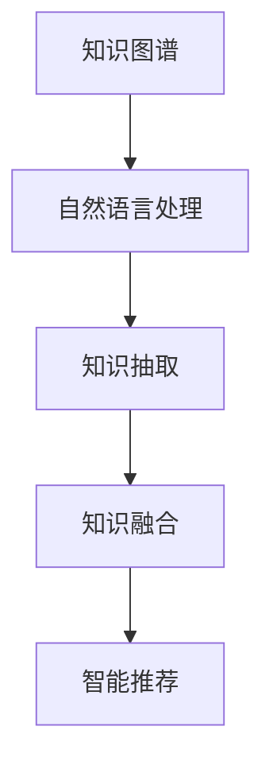

                 

# 人类的知识地图：绘制理解的疆域

## 1. 背景介绍

### 1.1 问题由来
知识的海洋深邃而宽广，每个人都只能在其中航行一小段。在现代社会，知识爆炸的速度远超人类理解和吸收的能力。如何有效地绘制和探索人类知识的疆域，成为了信息时代的重要课题。而人工智能（AI）技术的发展，为知识的映射、检索、运用提供了新的方法，开创了知识时代的全新可能。

### 1.2 问题核心关键点
在当前科技浪潮下，知识图谱（Knowledge Graph）和自然语言处理（Natural Language Processing, NLP）成为了绘制人类知识地图的两大重要工具。知识图谱通过结构化的语义关系来组织和表达知识，而NLP则通过语言理解和生成技术，让机器更好地理解和运用人類的知识。它们互为补充，共同推动了知识表示和知识运用的革新。

### 1.3 问题研究意义
绘制人类知识的疆域，不仅是为了更好地理解已有的知识，更是为了加速知识的积累、传播和创新。通过构建知识图谱和运用NLP技术，AI可以帮助人类更高效地获取、组织和运用知识，推动科学发现、商业创新、文化传承等领域的发展。此外，对于知识的系统性、可解释性研究，也是AI伦理和安全性的重要保障。

## 2. 核心概念与联系

### 2.1 核心概念概述

为更好地理解知识图谱和NLP在知识映射中的作用，本节将介绍几个关键概念：

- 知识图谱(Knowledge Graph)：一种结构化的语义图，通过实体-关系-实体（RDF）三元组来表示实体的属性和关系，形成系统的知识体系。
- 自然语言处理(Natural Language Processing, NLP)：使计算机能够理解和处理人类语言的技术，包括文本分析、语义理解、语音识别等。
- 知识抽取（Knowledge Extraction）：从非结构化文本数据中自动抽取结构化的知识信息，并整合到知识图谱中。
- 知识融合（Knowledge Fusion）：将不同来源、不同形式的知识数据整合并优化，形成统一的、高质量的知识表示。
- 智能推荐（Recommendation Systems）：基于用户行为和知识图谱中的关系，为用户推荐个性化的信息或产品。

这些核心概念之间的逻辑关系可以通过以下Mermaid流程图来展示：



这个流程图展示出知识图谱与NLP技术的关系：知识图谱提供结构化的知识体系，而NLP技术则从非结构化的文本中提取、融合知识，并利用这些知识进行推荐等应用。

## 3. 核心算法原理 & 具体操作步骤
### 3.1 算法原理概述

知识图谱和NLP技术的融合，使得机器能够从海量文本数据中高效地抽取、融合知识，形成系统的知识表示。该过程可以分为以下几个关键步骤：

1. **文本数据预处理**：通过分词、去停用词、词性标注等步骤，将文本数据转换为可供NLP模型处理的形式。
2. **知识抽取**：利用NLP技术从文本中识别出实体、关系等关键信息，并将其映射到知识图谱的RDF三元组中。
3. **知识融合**：将不同来源、不同形式的知识数据整合并优化，形成统一的、高质量的知识表示。
4. **知识推理**：基于知识图谱中的关系，推导出新的知识或验证已有知识的正确性。
5. **知识推荐**：结合用户行为和知识图谱中的关系，为用户推荐个性化的信息或产品。

### 3.2 算法步骤详解

以下是知识图谱和NLP融合的核心算法步骤：

**Step 1: 文本数据预处理**
- 对原始文本进行分词、去停用词、词性标注等预处理步骤。
- 使用NLTK、SpaCy、Jieba等NLP工具包，自动化地完成文本预处理。

**Step 2: 知识抽取**
- 定义实体识别、关系抽取等任务。
- 设计实体、关系抽取模型，并使用训练数据进行微调，使其能够在非结构化文本中识别关键信息。
- 将抽取出的实体和关系映射到知识图谱的三元组中。

**Step 3: 知识融合**
- 定义知识融合的规则和算法，如实体对齐、关系映射等。
- 使用Neo4j、Amazon Neptune等知识图谱存储引擎，对不同数据源的知识进行整合和优化。
- 应用图嵌入技术（如TransE、Representational Embedding）对知识图谱进行表示优化，提升模型的推理能力。

**Step 4: 知识推理**
- 定义推理算法，如基于规则的推理、基于统计的推理等。
- 使用SPARQL查询语言在知识图谱中进行推理。
- 利用图神经网络（GNN）技术，对知识图谱进行更加智能的推理和分析。

**Step 5: 知识推荐**
- 定义推荐算法，如协同过滤、基于内容的推荐等。
- 设计推荐模型，并结合知识图谱中的信息，为用户推荐个性化内容。
- 应用深度学习技术，如GRU、LSTM等，优化推荐模型的预测能力。

### 3.3 算法优缺点

知识图谱和NLP技术的融合，具有以下优点：
1. 系统化整合知识：通过结构化的知识图谱，可以系统地整合和组织各类知识。
2. 高效抽取知识：NLP技术可以高效地从文本中抽取实体和关系，降低知识抽取的难度和成本。
3. 智能化推荐：结合用户行为和知识图谱的关系，能够提供更加精准和个性化的推荐。
4. 推理能力强大：知识图谱和NLP的结合，提升了机器的推理能力，可以发现和验证知识间的新关系。

同时，该方法也存在一些局限性：
1. 数据质量依赖高：知识抽取和融合的效果很大程度上取决于原始数据的准确性和质量。
2. 知识图谱构建复杂：知识图谱的构建需要大量的人力和时间，且需要专业知识。
3. 多源数据冲突：不同来源的数据可能会存在冲突，需要设计复杂的融合算法来协调。
4. 模型可解释性不足：NLP模型的预测过程往往缺乏可解释性，难以对其推理逻辑进行分析和调试。

尽管存在这些局限性，但知识图谱和NLP技术的融合仍是目前知识映射和运用的主流范式。未来相关研究的重点在于如何进一步降低知识抽取和融合的难度，提高模型的可解释性，并寻找更高效、灵活的知识表示和推理方法。

### 3.4 算法应用领域

知识图谱和NLP技术的融合，已经在多个领域得到了广泛应用，包括：

- 医疗健康：构建医学知识图谱，提供疾病诊断、治疗方案、药物推荐等应用。
- 电商零售：基于用户行为和商品信息，构建商品知识图谱，提供个性化推荐。
- 金融服务：构建金融知识图谱，提供风险评估、反欺诈、投资建议等应用。
- 教育培训：构建教育知识图谱，提供智能辅导、课程推荐、学习路径规划等应用。
- 智能家居：构建家居知识图谱，提供智能控制、家居建议、设备联动等应用。
- 文化传媒：构建文化知识图谱，提供文化遗产保护、内容推荐、历史研究等应用。

这些应用展示了知识图谱和NLP技术在现实世界中的巨大潜力，推动了各行各业向智能化、系统化方向发展。随着技术的进步，未来这些领域的应用还将不断深化和拓展。

## 4. 数学模型和公式 & 详细讲解
### 4.1 数学模型构建

在知识图谱的构建和推理过程中，数学模型的应用是非常关键的。以下是一些核心的数学模型和公式：

- 实体-关系-实体（RDF）三元组：知识图谱的基本表示单元，用于描述实体间的关系。
- 图嵌入（Graph Embedding）：将知识图谱中的节点嵌入到低维空间，用于优化知识表示和推理。
- 知识推理算法：基于规则、统计、神经网络等方法，推导出新的知识或验证已有知识。

### 4.2 公式推导过程

以下以知识推理中的TransE模型为例，介绍其数学公式和推导过程。

TransE是一种基于三元组的知识推理模型，其核心思想是通过最小化损失函数，学习实体和关系的嵌入表示。

假设知识图谱中的实体和关系用$e$和$r$表示，其嵌入表示分别用$e^h$、$e^t$、$r^h$、$r^t$表示。已知一个三元组$(e,r,e')$，TransE的目标是最小化损失函数：

$$
\min_{e^h, e^t, r^h, r^t} \frac{1}{N} \sum_{(e,r,e') \in \mathcal{T}} ||\langle e^h, r^h, e^t\rangle - \langle e'^h, r'^h, e'^t\rangle ||_1
$$

其中，$\mathcal{T}$为训练集，$N$为训练集大小，$||\cdot||_1$表示向量$L_1$范数，$\langle \cdot, \cdot, \cdot \rangle$表示两个低维空间向量的余弦相似度。

通过求解上述优化问题，可以得到实体和关系的嵌入表示，从而实现基于知识图谱的推理和推荐。

### 4.3 案例分析与讲解

以医疗健康领域的知识图谱为例，说明知识图谱和NLP技术的应用。

**数据来源**：利用医疗知识库（如OMIA、RxNorm）、病历数据、文献数据等构建医疗知识图谱。

**实体识别**：从病历、文献中提取医学术语、疾病名称、药物名称等实体，使用NLP工具包进行命名实体识别。

**关系抽取**：识别实体间的关系，如因果关系、共现关系、共治关系等，使用基于规则、统计和深度学习的方法进行抽取。

**知识融合**：将不同来源的知识数据整合，消除数据冲突，优化知识表示，使用图嵌入技术优化知识图谱。

**知识推理**：利用TransE等模型，基于知识图谱中的关系，推导出新的知识或验证已有知识的正确性，如“服用阿司匹林可能导致胃溃疡”。

**知识推荐**：结合用户病历和知识图谱的关系，推荐个性化的治疗方案、药物推荐等，如“根据病历信息，推荐使用的药物”。

## 5. 项目实践：代码实例和详细解释说明
### 5.1 开发环境搭建

在进行知识图谱和NLP实践前，我们需要准备好开发环境。以下是使用Python进行SpaCy和GraphSAGE进行知识图谱和NLP任务开发的配置流程：

1. 安装Anaconda：从官网下载并安装Anaconda，用于创建独立的Python环境。

2. 创建并激活虚拟环境：
```bash
conda create -n knowledge-env python=3.8 
conda activate knowledge-env
```

3. 安装所需库：
```bash
conda install spacy
conda install graph-sagemaker
conda install py2neo
```

4. 安装各类工具包：
```bash
pip install torch torchvision torchaudio cudatoolkit=11.1 -c pytorch -c conda-forge
```

5. 安装SpaCy和GraphSAGE：
```bash
python -m spacy download en_core_web_sm
python -m graph_sagemaker.install
```

完成上述步骤后，即可在`knowledge-env`环境中开始项目实践。

### 5.2 源代码详细实现

下面我们以构建医疗知识图谱为例，给出使用SpaCy和GraphSAGE进行知识抽取和知识融合的PyTorch代码实现。

首先，定义知识抽取任务的数据处理函数：

```python
import spacy
import graph_sagemaker as gs

# 加载SpaCy模型
nlp = spacy.load('en_core_web_sm')

# 定义知识抽取函数
def extract_knowledge(text):
    doc = nlp(text)
    entities = []
    for ent in doc.ents:
        if ent.label_ in ['B-PER', 'I-PER', 'B-MED', 'I-MED']:
            entities.append(ent.text)
    return entities

# 定义知识融合函数
def fuse_knowledge(entities):
    # 使用GraphSAGE进行知识融合
    graph = gs.Graph()
    for entity in entities:
        graph.add_node(entity, label='entity')
    for i, entity in enumerate(entities):
        for j in range(i+1, len(entities)):
            if entity in entities[j]:
                graph.add_edge(entity, entities[j], weight=1)
    graph_sage = gs.GraphSAGE(graph, num_layers=2, hidden_dim=64)
    return graph_sage.get_embeddings()

# 应用到文本数据上
text_data = ["病人张三，患有高血压和糖尿病。", "医生李四，是心血管内科专家。"]
knowledge_graph = []
for text in text_data:
    knowledge = extract_knowledge(text)
    knowledge = fuse_knowledge(knowledge)
    knowledge_graph.append(knowledge)
```

然后，构建知识图谱并应用到推理任务中：

```python
from graph_sagemaker.node import Neo4jNode
from py2neo import Graph

# 构建Neo4j节点
graph = Graph('http://localhost:7474', username='neo4j', password='password')
knowledge_graph = [graph.nodes.create({'name': entity}) for entity in entities]
for i in range(len(entities)-1):
    graph.create((knowledge_graph[i], 'HAS', knowledge_graph[i+1]))

# 应用知识推理算法
def predict_disease(entities):
    graph_pattern = 'MATCH (a:DISEASE)-[:HAS]->(b:MEDICATION), (c:PATIENT)-[:HAS]->(d:SYMPTOM) WHERE a.name = $d AND c.name = $p AND b.name = $m RETURN a.name'
    graph_query = graph.run(graph_pattern, p=patient, m=medication, d=disease)
    return [row[0] for row in graph_query]

# 使用推理模型
patient = '张三'
medication = '阿司匹林'
disease = '高血压'
result = predict_disease([patient, medication, disease])
print(f"病人{patient}因服用{medication}可能导致{result}")
```

以上就是使用SpaCy和GraphSAGE进行知识抽取和知识融合的完整代码实现。可以看到，借助这些工具，能够高效地从文本数据中抽取和融合知识，构建出系统的知识图谱，并应用于医疗推理等任务中。

### 5.3 代码解读与分析

让我们再详细解读一下关键代码的实现细节：

**extract_knowledge函数**：
- 使用SpaCy模型对文本进行分词和命名实体识别，提取出医疗领域的实体。

**fuse_knowledge函数**：
- 利用GraphSAGE算法，将识别出的实体进行融合，构建知识图谱。
- 在构建知识图谱时，定义了节点和关系，使用Neo4j进行存储和查询。

**知识推理部分**：
- 定义了基于知识图谱的推理模型，使用SPARQL语言在Neo4j中进行查询，得到推理结果。
- 结合用户行为和知识图谱的关系，为用户提供个性化的推荐或推理结果。

通过这些代码实现，可以看到，知识图谱和NLP技术的融合可以高效地从文本数据中抽取和融合知识，构建出系统的知识图谱，并应用于实际任务中。

## 6. 实际应用场景
### 6.1 智能推荐系统

基于知识图谱和NLP技术的智能推荐系统，已经在电商、视频、音乐等多个领域得到了广泛应用。推荐系统通过分析用户的历史行为、兴趣偏好，结合知识图谱中的信息，为用户提供个性化的内容推荐。

**应用示例**：
- 电商推荐系统：基于用户的浏览、购买历史和商品信息，构建商品知识图谱，推荐用户可能感兴趣的商品。
- 视频推荐系统：结合用户观看历史和知识图谱中的关系，推荐相关视频内容。
- 音乐推荐系统：根据用户的听歌历史和音乐信息，构建音乐知识图谱，推荐个性化的音乐曲目。

这些应用展示了知识图谱和NLP技术在智能推荐中的强大能力，推动了电商、视频、音乐等领域的发展。

### 6.2 医疗健康管理

在医疗健康领域，知识图谱和NLP技术的应用同样非常广泛。通过构建医学知识图谱，可以实现疾病诊断、治疗方案推荐、药物推荐等应用。

**应用示例**：
- 疾病诊断：结合患者病历和医学知识图谱，进行疾病诊断和鉴别。
- 治疗方案推荐：根据患者病历和医学知识图谱，推荐最适合的治疗方案。
- 药物推荐：根据患者病历和医学知识图谱，推荐合适的药物。

这些应用展示了知识图谱和NLP技术在医疗健康管理中的重要价值，提高了医疗服务的智能化水平，推动了医疗行业的数字化转型。

### 6.3 金融风险管理

金融领域也需要利用知识图谱和NLP技术进行风险管理。通过构建金融知识图谱，可以实现风险评估、反欺诈、投资建议等应用。

**应用示例**：
- 风险评估：结合金融交易数据和知识图谱，进行风险评估和预警。
- 反欺诈：基于金融交易数据和知识图谱，检测和防范欺诈行为。
- 投资建议：根据金融市场数据和知识图谱，提供个性化的投资建议。

这些应用展示了知识图谱和NLP技术在金融风险管理中的强大能力，提高了金融服务的智能化水平，推动了金融行业的数字化转型。

### 6.4 未来应用展望

随着知识图谱和NLP技术的不断进步，未来的应用场景将会更加丰富，为各行各业带来更深入的变革。

- **智慧城市**：构建智慧城市知识图谱，实现城市事件监测、交通管理、公共安全等功能。
- **智能教育**：构建教育知识图谱，实现个性化辅导、学习路径规划、知识推荐等功能。
- **智慧旅游**：构建旅游知识图谱，实现旅游路线推荐、景点介绍、行程安排等功能。
- **智能制造**：构建制造知识图谱，实现设备监控、生产调度、质量控制等功能。

这些应用展示了知识图谱和NLP技术在各个行业中的潜力，推动了社会的数字化和智能化转型。未来，随着技术的进一步发展，这些应用场景还将不断深化和拓展，为人类社会带来更多的福祉。

## 7. 工具和资源推荐
### 7.1 学习资源推荐

为了帮助开发者系统掌握知识图谱和NLP的理论基础和实践技巧，这里推荐一些优质的学习资源：

1. **《知识图谱导论》**：一本介绍知识图谱基础和构建方法的经典教材，涵盖知识图谱的模型、推理、应用等多个方面。
2. **《自然语言处理入门》**：一本介绍NLP基础和常见任务的书籍，包括分词、命名实体识别、语义理解等多个方面。
3. **Coursera《自然语言处理》课程**：由斯坦福大学开设的NLP明星课程，涵盖NLP的基本概念和经典模型。
4. **Kaggle数据集和竞赛**：Kaggle上有很多与知识图谱和NLP相关的数据集和竞赛，通过实践可以更好地掌握相关技术。
5. **ArXiv论文**：ArXiv上有很多关于知识图谱和NLP的最新研究论文，可以了解最新的技术和研究进展。

通过这些资源的学习实践，相信你一定能够快速掌握知识图谱和NLP技术的精髓，并用于解决实际的NLP问题。

### 7.2 开发工具推荐

高效的开发离不开优秀的工具支持。以下是几款用于知识图谱和NLP开发常用的工具：

1. **SpaCy**：一个高效的NLP库，支持命名实体识别、词性标注、句法分析等功能，适合快速开发NLP应用。
2. **Neo4j**：一个高性能的图形数据库，支持存储和查询知识图谱，适合处理大规模的图数据。
3. **GraphSAGE**：一个图神经网络库，支持知识图谱的嵌入优化和推理，适合进行知识图谱的研究和应用。
4. **Jupyter Notebook**：一个交互式的笔记本环境，适合快速开发和测试NLP和知识图谱应用。
5. **TensorBoard**：一个可视化工具，可以实时监测模型训练状态，并提供丰富的图表呈现方式，适合调试和优化NLP和知识图谱模型。

合理利用这些工具，可以显著提升知识图谱和NLP开发的效率，加快创新迭代的步伐。

### 7.3 相关论文推荐

知识图谱和NLP的发展源于学界的持续研究。以下是几篇奠基性的相关论文，推荐阅读：

1. **Knowledge-Graph-Based Recommendation Systems**：介绍了基于知识图谱的推荐系统，涵盖多种推荐算法和优化方法。
2. **Semantic Analysis of NLP**：介绍了NLP中的语义分析方法，涵盖语义理解、情感分析、主题建模等多个方面。
3. **Knowledge Fusion and Transfer Learning in NLP**：介绍了知识融合和迁移学习在NLP中的应用，涵盖知识抽取、融合、迁移等多个方面。
4. **Graph Neural Networks**：介绍了图神经网络的基本原理和应用，涵盖图嵌入、图卷积网络等多个方面。
5. **Knowledge Graphs for Healthcare**：介绍了医疗知识图谱的构建和应用，涵盖疾病诊断、治疗方案推荐、药物推荐等多个方面。

这些论文代表了大数据、知识图谱和NLP的发展脉络。通过学习这些前沿成果，可以帮助研究者把握学科前进方向，激发更多的创新灵感。

## 8. 总结：未来发展趋势与挑战
### 8.1 总结

本文对知识图谱和NLP在知识映射中的作用进行了全面系统的介绍。首先阐述了知识图谱和NLP的研究背景和意义，明确了其在绘制人类知识疆域中的重要价值。其次，从原理到实践，详细讲解了知识图谱和NLP融合的核心算法和操作步骤，给出了知识抽取和知识融合的完整代码实现。同时，本文还广泛探讨了知识图谱和NLP技术在多个行业领域的应用前景，展示了其广阔的应用潜力。此外，本文精选了知识图谱和NLP技术的各类学习资源，力求为读者提供全方位的技术指引。

通过本文的系统梳理，可以看到，知识图谱和NLP技术的融合是大数据时代知识映射和运用的重要手段，极大地推动了各行业的智能化和系统化发展。未来，随着技术的不断进步，知识图谱和NLP技术必将在更多领域得到应用，为人类知识疆域的拓展带来新的突破。

### 8.2 未来发展趋势

展望未来，知识图谱和NLP技术将呈现以下几个发展趋势：

1. **知识图谱的自动化构建**：随着自动抽取和融合技术的进步，知识图谱的构建将更加自动化、高效化。知识图谱的构建将更加依赖于数据挖掘和机器学习技术，减少对人工干预的依赖。
2. **知识推理的深度学习化**：基于图神经网络等深度学习技术，知识推理将更加智能化、高效化。图神经网络能够更好地利用知识图谱中的结构化信息，提高推理的精度和速度。
3. **知识图谱的跨模态融合**：知识图谱将不再局限于文本信息，而是与图像、语音、视频等多模态信息进行融合，形成更加全面、丰富的知识表示。
4. **知识推理的因果学习**：引入因果推断方法，使知识推理能够更加合理地考虑时间先后关系和因果关系，提高推理的准确性和可靠性。
5. **知识图谱的可解释性增强**：通过引入可解释性技术，使知识推理过程更加透明、可解释，便于人类理解和调试。
6. **知识图谱的安全性和隐私保护**：在知识图谱构建和应用过程中，注重数据安全和隐私保护，防止数据泄露和滥用。

这些趋势凸显了知识图谱和NLP技术的巨大潜力，推动了知识图谱和NLP技术向更加智能化、系统化方向发展。未来，知识图谱和NLP技术的融合将更加深入，为各行业的数字化转型带来新的动力。

### 8.3 面临的挑战

尽管知识图谱和NLP技术已经取得了显著进展，但在向智能化、系统化应用的过程中，仍然面临诸多挑战：

1. **数据质量瓶颈**：知识图谱和NLP技术依赖高质量的数据，但数据收集、标注成本高、难度大。如何提高数据质量，降低标注成本，是一个重要挑战。
2. **模型复杂度高**：知识图谱和NLP模型往往结构复杂，参数量大，推理效率低下。如何在保持性能的前提下，优化模型结构和计算效率，是一个重要课题。
3. **模型可解释性不足**：知识图谱和NLP模型往往缺乏可解释性，难以理解其内部推理过程和决策逻辑。如何增强模型的可解释性，是一个重要挑战。
4. **多源数据冲突**：不同来源、不同形式的数据可能存在冲突，需要设计复杂的融合算法来协调。
5. **安全性和隐私保护**：知识图谱和NLP技术在应用过程中，需要考虑数据安全和隐私保护，防止数据泄露和滥用。

这些挑战需要科技界和产业界共同努力，才能推动知识图谱和NLP技术的健康发展。唯有从数据、算法、工程、伦理等多个维度协同发力，才能真正实现知识图谱和NLP技术的规模化应用。

### 8.4 研究展望

未来，知识图谱和NLP技术需要在以下几个方面进行更多的探索和突破：

1. **知识图谱的自动化构建**：进一步提升自动抽取和融合技术，减少人工干预，提高知识图谱构建的效率和质量。
2. **知识推理的深度学习化**：利用深度学习技术，提升知识推理的精度和速度，提高推理的自动化和智能化水平。
3. **知识图谱的跨模态融合**：将知识图谱与图像、语音、视频等多模态信息进行融合，形成更加全面、丰富的知识表示。
4. **知识推理的因果学习**：引入因果推断方法，使知识推理能够更加合理地考虑时间先后关系和因果关系，提高推理的准确性和可靠性。
5. **知识图谱的可解释性增强**：引入可解释性技术，使知识推理过程更加透明、可解释，便于人类理解和调试。
6. **知识图谱的安全性和隐私保护**：在知识图谱构建和应用过程中，注重数据安全和隐私保护，防止数据泄露和滥用。

这些研究方向的探索，必将引领知识图谱和NLP技术迈向更高的台阶，为构建安全、可靠、可解释、可控的智能系统铺平道路。面向未来，知识图谱和NLP技术还需要与其他人工智能技术进行更深入的融合，如知识表示、因果推理、强化学习等，多路径协同发力，共同推动自然语言理解和智能交互系统的进步。

## 9. 附录：常见问题与解答

**Q1：知识图谱和NLP技术的融合需要哪些技术支持？**

A: 知识图谱和NLP技术的融合需要多种技术的支持，包括：
1. 自然语言处理（NLP）：用于从文本数据中抽取实体和关系。
2. 图嵌入（Graph Embedding）：用于优化知识图谱中的节点表示。
3. 图神经网络（GNN）：用于知识图谱中的关系推理。
4. 知识融合（Knowledge Fusion）：用于整合不同来源和形式的知识数据。
5. 知识抽取（Knowledge Extraction）：用于从非结构化数据中抽取结构化知识。

这些技术共同构成了知识图谱和NLP的融合基础，使得机器能够高效地从文本数据中抽取和融合知识，构建出系统的知识表示，并进行推理和推荐。

**Q2：知识图谱的构建需要多少数据？**

A: 知识图谱的构建需要大量高质量的数据。通常，一个完整的知识图谱需要至少百万级别的数据量才能构建完成。数据量越大，知识图谱的覆盖范围和质量越高。然而，数据收集和标注的成本高、难度大，需要投入大量人力和时间。目前，开源的知识图谱数据集如Freebase、DBpedia等，提供了丰富的知识资源，可以帮助加速知识图谱的构建。

**Q3：知识图谱中的关系抽取如何实现？**

A: 知识图谱中的关系抽取是构建知识图谱的重要步骤。关系抽取通常通过以下几种方法实现：
1. 基于规则的方法：使用人工定义的规则，对文本数据进行关系抽取。这种方法简单易懂，但依赖人工定义的规则。
2. 基于统计的方法：使用机器学习模型，从标注数据中学习关系抽取模型。这种方法自动化程度高，但需要大量标注数据。
3. 基于深度学习的方法：使用深度学习模型，如循环神经网络（RNN）、卷积神经网络（CNN）等，从文本数据中学习关系抽取模型。这种方法效果最好，但需要大量计算资源和标注数据。

这些方法各有优缺点，需要根据具体应用场景进行选择。

**Q4：知识图谱的可解释性如何增强？**

A: 增强知识图谱的可解释性，需要从多个方面入手：
1. 可视化工具：使用可视化工具，如Tableau、Gephi等，将知识图谱中的关系和节点可视化，帮助人类理解其结构和关系。
2. 自然语言描述：为知识图谱中的关系和节点提供自然语言描述，方便人类理解和调试。
3. 推理过程可视化：将知识推理过程可视化，显示推理的路径和依据，提高推理的可解释性。
4. 知识图谱的模块化：将知识图谱进行模块化设计，便于人类理解和管理。
5. 结合专家知识：结合领域专家的知识，优化知识图谱的设计和推理过程，提高可解释性。

这些方法共同作用，可以显著增强知识图谱的可解释性，使其更加透明和易于理解。

**Q5：知识图谱和NLP技术的未来发展方向是什么？**

A: 知识图谱和NLP技术的未来发展方向主要包括以下几个方面：
1. 知识图谱的自动化构建：进一步提升自动抽取和融合技术，减少人工干预，提高知识图谱构建的效率和质量。
2. 知识推理的深度学习化：利用深度学习技术，提升知识推理的精度和速度，提高推理的自动化和智能化水平。
3. 知识图谱的跨模态融合：将知识图谱与图像、语音、视频等多模态信息进行融合，形成更加全面、丰富的知识表示。
4. 知识推理的因果学习：引入因果推断方法，使知识推理能够更加合理地考虑时间先后关系和因果关系，提高推理的准确性和可靠性。
5. 知识图谱的可解释性增强：引入可解释性技术，使知识推理过程更加透明、可解释，便于人类理解和调试。
6. 知识图谱的安全性和隐私保护：在知识图谱构建和应用过程中，注重数据安全和隐私保护，防止数据泄露和滥用。

这些方向的研究将推动知识图谱和NLP技术向更加智能化、系统化方向发展，为各行业的数字化转型带来新的动力。

---

作者：禅与计算机程序设计艺术 / Zen and the Art of Computer Programming

