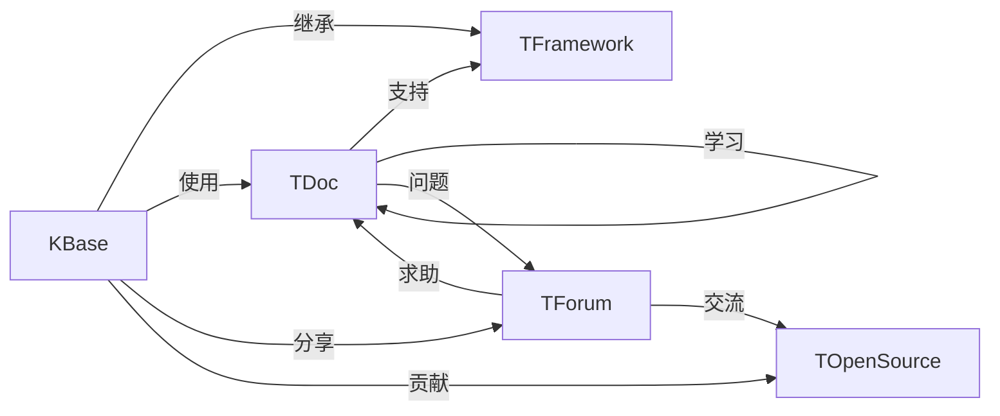

                 

# 人类知识的传承：一代代人的接力赛跑

## 1. 背景介绍

### 1.1 问题由来

在计算机科学和人工智能(AI)领域，我们正处于一个前所未有的知识爆炸时代。自20世纪中叶以来，从早期的人工智能概念，到机器学习的兴盛，再到深度学习的崛起，技术发展日新月异。然而，在快速迭代的技术潮流中，人类知识的传承显得尤为艰难。

每一代人需要从头学习和掌握这些技术，而无法直接继承前人的知识和经验。这不仅消耗了大量的时间和资源，也使得技术的发展和普及速度受到极大限制。如何更好地传承知识，让新一代研究者站在巨人的肩膀上，加速科学进步，是当前科技领域亟待解决的问题。

### 1.2 问题核心关键点

本文将从核心概念的梳理与联系、算法原理与操作步骤、实际应用与未来展望等多个维度深入探讨这一问题，力求提供一种系统化、可操作的解决方案。

## 2. 核心概念与联系

### 2.1 核心概念概述

为了更好地理解技术传承的机制，我们需要明确几个关键概念及其相互关系：

- **知识库(Knowledge Base)**：包含了人类历史上积累的所有知识，通过文本、数据库、代码库等多种形式存储。
- **工具与框架(Tools & Frameworks)**：为了方便知识的应用和传播，开发了一系列工具和框架，如GitHub、Jupyter Notebook、TensorFlow等。
- **文档与教程(Developer Documentation & Tutorials)**：提供了详细的技术手册和操作指南，帮助开发者理解和使用技术。
- **社区与论坛(Online Communities & Forums)**：形成了知识共享和交流的社交网络，促进了技术人员的互动与协作。
- **开源运动(Open Source Movement)**：强调开放、协作、共享的原则，推动了知识和技术的快速传播与改进。

这些概念共同构成了知识传承的技术基础，帮助人类不断积累和创新。

### 2.2 核心概念联系

以下是一个简单的Mermaid流程图，展示了这些核心概念之间的联系：



这个图表展示了知识库如何通过不同的渠道和方式，与工具、框架、文档、社区和开源运动进行互动。通过这种互联互通，技术知识和经验的传承得以实现。

## 3. 核心算法原理 & 具体操作步骤
### 3.1 算法原理概述

为了实现知识的有效传承，我们需要构建一种机制，使得新知识能够在旧知识的基础上不断迭代和更新。这个过程可以类比为接力赛跑，每一代选手通过接力棒，将上一代的知识和经验传递下去，并在此基础上进行创新和改进。

从算法原理的角度，这个过程涉及以下几个关键步骤：

1. **继承与抽取**：从知识库中抽取有用的信息，并将其整合到新知识中。
2. **修改与优化**：在旧知识的基础上，进行必要的修改和优化，以适应新的应用场景。
3. **测试与验证**：通过实际应用和测试，验证新知识的有效性和可靠性。
4. **记录与分享**：将新知识记录下来，并通过文档、代码、社区等多种形式进行共享。

### 3.2 算法步骤详解

#### 3.2.1 继承与抽取

1. **知识选择**：根据当前需求，从知识库中选择相关的知识。这可能包括代码库中的函数、论文库中的算法、数据库中的数据等。
2. **知识抽取**：通过阅读、翻译、注释等方式，将选择到的知识抽取出来，形成清晰的文档和代码。
3. **知识整合**：将抽取出来的知识与当前项目的需求结合起来，进行必要的修改和补充，形成新的知识集。

#### 3.2.2 修改与优化

1. **功能增强**：在原有功能的基础上，添加新的功能模块，满足更广泛的需求。
2. **性能优化**：对代码进行性能调优，提高运行效率和可扩展性。
3. **错误修复**：修复代码中的已知错误，提升代码质量和稳定性。

#### 3.2.3 测试与验证

1. **单元测试**：对新代码进行单元测试，确保每个模块的功能正确性。
2. **集成测试**：将新代码集成到整个系统中，进行端到端测试，验证系统功能的完整性。
3. **性能测试**：评估新代码对系统性能的影响，确保在负载下能够稳定运行。

#### 3.2.4 记录与分享

1. **文档编写**：将修改和优化过程记录下来，形成详细的文档和教程。
2. **代码提交**：将新代码提交到代码库，供其他人使用和修改。
3. **社区分享**：在技术社区和论坛中分享新知识，促进交流和协作。

### 3.3 算法优缺点

#### 3.3.1 优点

1. **可重复性**：知识传承的过程是可重复的，新知识可以在旧知识的基础上不断迭代和优化。
2. **广泛适用**：这种机制适用于各种规模和复杂度的项目，可以广泛应用于科研、工程、教学等多个领域。
3. **低成本**：相比于从头开发，继承和修改现有知识可以大幅降低时间和资源的投入。
4. **持续改进**：在社区和开源运动的支持下，新知识能够不断得到改进和完善。

#### 3.3.2 缺点

1. **技术壁垒**：继承和修改需要一定的技术水平，对新人的门槛较高。
2. **依赖性强**：知识传承依赖于现有知识库和工具，如果知识库不完善，传承过程可能会受阻。
3. **维护成本**：持续更新和维护现有知识库需要大量时间和精力。
4. **版本管理**：在多个版本之间的切换和合并过程中，可能出现版本冲突和数据丢失等问题。

### 3.4 算法应用领域

知识传承的机制已经广泛应用于以下几个领域：

- **科研与工程**：在计算机视觉、自然语言处理、机器学习等技术领域，新知识往往基于现有算法进行改进和优化。
- **教育与培训**：通过在线课程和文档，将最新技术传授给学生和开发者，促进技术传播和应用。
- **产业与创业**：在人工智能、大数据、物联网等新兴产业中，借鉴和改进现有技术，加速产品和服务的创新。
- **开源与社区**：开源运动和开源社区是知识传承的重要平台，通过代码贡献、文档编写、社区讨论等方式，实现知识的共享和迭代。

## 4. 数学模型和公式 & 详细讲解 & 举例说明
### 4.1 数学模型构建

在技术传承的过程中，我们可以使用数学模型来描述这一机制。以下是一个简化的模型：

设 $K$ 表示知识库，$T$ 表示工具和框架，$D$ 表示文档和教程，$C$ 表示社区和论坛，$O$ 表示开源运动。

**状态转移方程**：

$$
K_{t+1} = f(K_t, T_t, D_t, C_t, O_t)
$$

其中 $f$ 表示状态转移函数，将上一轮的知识库 $K_t$ 和新的工具 $T_t$、文档 $D_t$、社区 $C_t$、开源运动 $O_t$ 结合起来，形成新的知识库 $K_{t+1}$。

**目标函数**：

$$
\min_{K_t, T_t, D_t, C_t, O_t} \sum_{i=1}^N \text{cost}(K_i, T_i, D_i, C_i, O_i)
$$

其中 $\text{cost}$ 表示传承过程中的成本，$N$ 表示传承的轮次。目标是最小化整个传承过程的成本，实现知识的有效传承。

### 4.2 公式推导过程

以一个简单的函数为例，展示如何通过继承与修改，实现新功能的开发：

原函数：

$$
f(x) = x^2
$$

假设需要添加一个新的功能 $f'(x) = x^3$：

1. **继承**：将原函数 $f(x)$ 作为模板，通过注释和修改，形成新的函数：

$$
f'(x) = x^2 + x^3
$$

2. **优化**：对新函数进行测试和验证，发现 $x=0$ 时，$f'(x)$ 的值错误。对函数进行优化，修正为：

$$
f'(x) = x^2 + x^3
$$

3. **测试**：通过单元测试和集成测试，确保新函数的正确性和性能。

4. **记录与分享**：将修改和优化的过程记录下来，形成详细的文档和教程，供其他人使用和修改。

### 4.3 案例分析与讲解

以TensorFlow框架为例，展示如何在现有框架的基础上，开发新的功能模块：

1. **继承**：选择TensorFlow作为知识库的基础，通过文档和教程，了解其核心功能。

2. **修改**：在TensorFlow上添加新的层和函数，如LSTM、GRU等，扩展其应用场景。

3. **优化**：通过性能调优和错误修复，提升新功能模块的稳定性和效率。

4. **测试**：通过单元测试和集成测试，验证新功能的正确性和性能。

5. **记录与分享**：将修改和优化的过程记录下来，形成详细的文档和教程，供其他人使用和修改。

## 5. 项目实践：代码实例和详细解释说明
### 5.1 开发环境搭建

为了进行项目实践，我们需要准备以下几个环境：

1. **Python环境**：安装Python 3.x版本，推荐使用Anaconda或Miniconda进行环境管理。
2. **开发工具**：安装Visual Studio Code、PyCharm等IDE工具。
3. **版本控制**：安装Git，配置GitHub账号，创建代码仓库。
4. **代码管理工具**：安装GitHub Desktop、SourceTree等工具，进行版本管理和代码协作。
5. **文档编写工具**：安装LaTeX、Markdown等文档编写工具，记录和分享技术文档。

### 5.2 源代码详细实现

以下是一个简单的代码实现，展示如何在TensorFlow中添加新的层：

1. **安装TensorFlow**：

```bash
pip install tensorflow
```

2. **编写代码**：

```python
import tensorflow as tf

# 定义新层
class MyLayer(tf.keras.layers.Layer):
    def __init__(self, units=32):
        super(MyLayer, self).__init__()
        self.units = units
    
    def call(self, inputs):
        return tf.square(inputs)

# 创建模型
model = tf.keras.Sequential([
    tf.keras.layers.Dense(64, activation='relu'),
    MyLayer(32),
    tf.keras.layers.Dense(10, activation='softmax')
])

# 训练模型
model.compile(optimizer='adam', loss='categorical_crossentropy', metrics=['accuracy'])
model.fit(x_train, y_train, epochs=10, validation_data=(x_val, y_val))
```

3. **测试与验证**：

```python
# 测试模型
loss, acc = model.evaluate(x_test, y_test, verbose=0)
print('Test loss:', loss)
print('Test accuracy:', acc)
```

4. **记录与分享**：

将代码和文档记录到GitHub上，供其他人使用和修改。

### 5.3 代码解读与分析

- **定义新层**：通过继承和修改现有的TensorFlow层，添加新的功能。
- **创建模型**：将新层集成到模型中，形成完整的训练流程。
- **测试与验证**：通过测试和验证，确保新层的功能正确性和性能。
- **记录与分享**：将修改和优化的过程记录下来，供其他人使用和修改。

## 6. 实际应用场景

### 6.1 科研与工程

在科研与工程领域，知识传承通过多种形式进行。例如，在计算机视觉项目中，研究人员可以通过使用现有的框架（如TensorFlow、PyTorch等）进行快速的模型训练和验证，并在现有代码基础上添加新的功能模块。

### 6.2 教育与培训

在教育与培训领域，通过在线课程和文档，将最新技术传授给学生和开发者，促进技术传播和应用。例如，Coursera、Udacity等在线平台，提供了丰富的计算机科学和人工智能课程，供学生学习。

### 6.3 产业与创业

在产业与创业领域，借鉴和改进现有技术，加速产品和服务的创新。例如，OpenAI的GPT-3模型，就是在现有Transformer架构的基础上，通过大规模预训练和微调，实现了自然语言处理的新突破。

### 6.4 开源与社区

在开源与社区领域，通过代码贡献、文档编写、社区讨论等方式，实现知识的共享和迭代。例如，Linux操作系统和Apache HTTP Server等开源项目，通过全球开发者的贡献，不断完善和改进。

## 7. 工具和资源推荐

### 7.1 学习资源推荐

为了帮助开发者系统掌握知识传承的技术，推荐以下学习资源：

1. **《编程珠玑》（Programming Pearls）**：经典编程入门书籍，通过实际案例展示了编程技巧和知识传承的重要性。
2. **《深度学习入门：基于Python的理论与实现》**：介绍深度学习的基础知识和实践技巧，适合初学者和进阶学习者。
3. **Coursera、Udacity等在线课程平台**：提供大量计算机科学和人工智能课程，帮助开发者系统学习相关知识。
4. **Kaggle平台**：提供丰富的数据集和竞赛项目，供开发者实践和交流。

### 7.2 开发工具推荐

以下几款工具推荐用于知识传承的开发和实践：

1. **GitHub**：版本控制和代码协作平台，支持代码托管、版本管理、协作开发等功能。
2. **Jupyter Notebook**：交互式编程环境，支持编写和运行Python代码，并实时显示结果。
3. **LaTeX**：文档编写工具，支持复杂的数学公式和排版，适合编写技术文档和学术论文。
4. **Slack、Discord等通信工具**：用于社区交流和协作，方便开发者实时沟通和分享知识。

### 7.3 相关论文推荐

以下是几篇关于知识传承的论文，推荐阅读：

1. **《知识库和数据库的协同设计：面向语义推理的元知识库》（Semantic Integration of Knowledge Bases and Databases）**：探讨了知识库和数据库的协同设计问题，提出了一种基于语义推理的元知识库框架。
2. **《开源软件演进和演化模型》（Evolution and Evolutionary Models of Open Source Software）**：分析了开源软件演进的过程和机制，提出了一种基于演化模型的知识管理方法。
3. **《基于开源社区的创新扩散模型》（Diffusion of Innovations in Open Source Communities）**：研究了开源社区中新技术的扩散机制，提出了一种基于社会网络理论的模型。

## 8. 总结：未来发展趋势与挑战

### 8.1 总结

本文对知识传承的机制进行了深入探讨，通过继承、修改、测试和记录等关键步骤，展示了如何实现知识的有效传承。通过梳理核心概念和算法原理，本文提供了一种系统化的知识传承方法，适用于科研、工程、教育、产业等多个领域。

### 8.2 未来发展趋势

展望未来，知识传承将呈现以下几个发展趋势：

1. **自动化传承**：通过机器学习和自然语言处理技术，自动化的知识传承将成为可能，减少人工干预和成本。
2. **跨领域传承**：不同领域之间的知识传承将变得更加容易，例如跨学科的技术创新和应用。
3. **协作传承**：知识传承将更加注重社区和协作，通过开放平台和开源运动，实现知识的高效传播和共享。
4. **人机协同**：结合人工智能技术和人类专家的智慧，实现更加智能和高效的知识传承。
5. **数据驱动**：数据将成为知识传承的重要基础，通过数据挖掘和分析，发现知识之间的关联和规律。

### 8.3 面临的挑战

尽管知识传承机制已经取得了一定的进展，但仍面临以下几个挑战：

1. **技术壁垒**：现有知识库和工具的复杂性，对新手和专家都提出了较高的门槛。
2. **数据质量**：知识传承依赖于高质量的数据和文档，数据的准确性和完整性对传承效果至关重要。
3. **版本管理**：多版本之间的切换和合并，容易出现版本冲突和数据丢失等问题。
4. **社区协作**：社区和开源运动需要更多的管理和协调，才能实现高效的合作和知识共享。
5. **知识产权**：开源运动中的知识共享和贡献，需要明确知识产权和法律保障。

### 8.4 研究展望

未来，知识传承的研究需要在以下几个方面进行探索：

1. **自动化工具**：开发更多自动化工具，减少人工干预，提高知识传承的效率。
2. **语义分析**：通过自然语言处理技术，提高文档和代码的理解和检索效率。
3. **跨领域知识图谱**：构建跨领域的知识图谱，实现不同领域之间的知识传承和融合。
4. **人机协同知识库**：结合人工智能技术和专家智慧，构建智能知识库，实现知识的智能管理和传承。
5. **伦理和法律保障**：制定相关的伦理和法律规范，保障知识传承的公正性和安全性。

这些研究方向将推动知识传承技术的发展，帮助人类不断积累和创新，实现技术的快速迭代和应用。

## 9. 附录：常见问题与解答

### 9.1 Q1：如何选择合适的知识库？

A: 选择知识库时，需要考虑其覆盖领域、数据质量和更新频率等因素。建议选择覆盖面广、数据质量高、更新频繁的知识库，如Google Scholar、arXiv等。

### 9.2 Q2：知识传承过程中有哪些工具和资源？

A: 知识传承过程中，常用的工具和资源包括GitHub、Jupyter Notebook、LaTeX等。这些工具和资源能够帮助开发者高效地进行版本管理、代码编写和文档编写。

### 9.3 Q3：如何记录和分享知识？

A: 通过编写详细的文档和代码注释，记录知识传承过程中的每一步操作。将文档和代码上传到GitHub等平台，供其他人使用和修改。同时，通过社区和论坛分享知识，促进交流和协作。

### 9.4 Q4：知识传承过程中需要注意哪些问题？

A: 知识传承过程中，需要注意技术壁垒、数据质量、版本管理、社区协作和知识产权等问题。这些问题需要综合考虑和解决，才能实现有效的知识传承。

### 9.5 Q5：如何提升知识传承的效率？

A: 提升知识传承的效率，可以通过自动化工具、语义分析、跨领域知识图谱等人机协同方式，减少人工干预和提高传承效率。

---

作者：禅与计算机程序设计艺术 / Zen and the Art of Computer Programming

