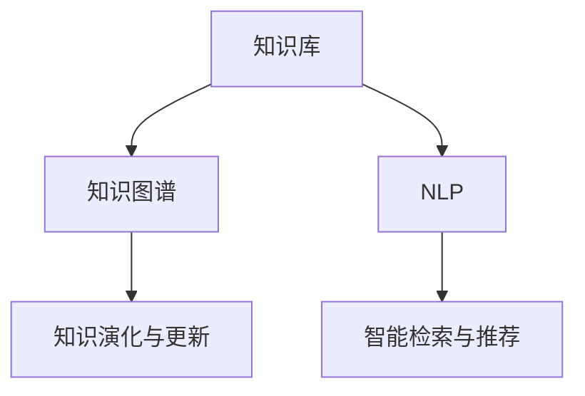

                 

# 人类知识的共享平台：知识就是力量的体现

> 关键词：知识共享平台,知识管理,人工智能,深度学习,知识图谱,自然语言处理(NLP)

## 1. 背景介绍

### 1.1 问题由来
随着信息时代的到来，人类积累的知识呈现爆炸式增长。无论是科学研究、技术创新、还是日常生活，知识的应用和传播变得至关重要。然而，传统的知识分享方式，如书籍、期刊、会议论文等，面临着存储成本高、检索效率低、传播范围有限等问题，无法适应快速变化的信息环境。

同时，人工智能技术的快速发展，特别是深度学习、自然语言处理等技术，为知识共享和处理提供了新的可能性。通过构建大规模的知识库和智能平台，可以实现知识的自动化提取、组织、检索和重用，有效提升知识管理和利用的效率。

### 1.2 问题核心关键点
知识共享平台的核心目标在于将人类知识以结构化、可检索的方式进行存储和传播。其核心关键点包括：

- **知识库构建**：通过深度学习等技术自动从互联网、数据库、文献等来源抓取和整理知识，构建大规模的知识库。
- **知识图谱构建**：将知识库中的知识进行语义表示，构建知识图谱，形成结构化知识表示体系。
- **自然语言处理(NLP)**：利用NLP技术实现知识的自动理解和生成，支持用户以自然语言方式与知识库进行交互。
- **智能检索和推荐**：基于知识图谱和NLP技术，实现高效、精准的智能检索和推荐，帮助用户快速找到所需知识。
- **知识演化与更新**：通过机器学习技术，实时监测知识库的变化，自动更新和完善知识图谱，保持知识的时效性和准确性。

## 2. 核心概念与联系

### 2.1 核心概念概述

为更好地理解知识共享平台的构建和运行机制，本节将介绍几个密切相关的核心概念：

- **知识库(Knowledge Base)**：包含结构化和半结构化知识的集合，是知识共享平台的基础。通过从互联网、文献、数据库等来源抓取和整理，知识库涵盖了各种主题的知识。
- **知识图谱(Knowledge Graph)**：将知识库中的知识进行语义表示，形成结构化的知识表示体系。节点表示实体，边表示实体之间的关系，支持高效的知识检索和推理。
- **自然语言处理(NLP)**：通过深度学习等技术，实现对自然语言的理解、生成和处理，支持知识图谱的构建和用户与知识库的交互。
- **智能检索与推荐系统**：基于知识图谱和NLP技术，实现高效、精准的知识检索和推荐，提升用户获取知识的速度和质量。
- **知识演化与更新**：通过机器学习技术，实时监测知识库的变化，自动更新和完善知识图谱，保持知识的时效性和准确性。

这些核心概念之间相互关联，共同构成了知识共享平台的理论和技术基础。

### 2.2 核心概念原理和架构的 Mermaid 流程图(Mermaid 流程节点中不要有括号、逗号等特殊字符)


## 3. 核心算法原理 & 具体操作步骤

### 3.1 算法原理概述

知识共享平台的核心算法原理主要包括以下几个方面：

1. **知识库抓取与整理**：利用爬虫技术和文本挖掘技术，从互联网、文献、数据库等来源抓取和整理知识，构建知识库。
2. **知识图谱构建**：通过语义分析、实体关系抽取等技术，将知识库中的知识进行语义表示，构建知识图谱。
3. **NLP技术**：利用深度学习等技术，实现对自然语言的理解、生成和处理，支持知识图谱的构建和用户与知识库的交互。
4. **智能检索与推荐**：基于知识图谱和NLP技术，实现高效、精准的智能检索和推荐，提升用户获取知识的速度和质量。
5. **知识演化与更新**：通过机器学习技术，实时监测知识库的变化，自动更新和完善知识图谱，保持知识的时效性和准确性。

### 3.2 算法步骤详解

#### 3.2.1 知识库抓取与整理
1. **网页抓取**：使用爬虫技术从互联网抓取相关网页，包括论文、新闻、博客等。
2. **文本挖掘**：对抓取到的文本进行分词、词性标注、命名实体识别等处理，提取出结构化信息，如人名、地名、机构名等。
3. **实体链接**：将提取出的实体与已有的知识库进行链接，构建知识图谱中的节点。
4. **关系抽取**：利用深度学习等技术，从文本中抽取实体之间的关系，如作者-论文、地点-事件等，构建知识图谱中的边。

#### 3.2.2 知识图谱构建
1. **节点表示**：将知识库中的实体进行编码，生成向量表示，用于在知识图谱中进行匹配和查询。
2. **关系表示**：将知识库中的关系进行编码，生成向量表示，用于在知识图谱中进行匹配和查询。
3. **知识融合**：将不同来源的知识进行融合，构建综合的知识图谱，涵盖多个领域和主题。
4. **知识更新**：利用机器学习技术，实时监测知识库的变化，自动更新和完善知识图谱，保持知识的时效性和准确性。

#### 3.2.3 NLP技术
1. **语义理解**：利用深度学习技术，实现对用户输入的自然语言文本进行语义理解，提取关键信息。
2. **意图识别**：对用户的输入进行意图识别，确定用户希望查询的知识类型和主题。
3. **知识生成**：利用深度学习技术，根据用户输入和知识图谱中的信息，生成结构化或非结构化的知识答案。
4. **对话系统**：利用深度学习技术，实现用户与知识库的自然语言对话，支持问答、推荐等交互方式。

#### 3.2.4 智能检索与推荐
1. **查询解析**：对用户的查询进行解析，转换为知识图谱中的查询图，用于在知识图谱中进行匹配和查询。
2. **知识匹配**：基于知识图谱中的节点和关系，匹配用户查询图，获取相关的知识节点和关系。
3. **知识排序**：根据匹配结果的相关性和重要性，对知识节点和关系进行排序，返回用户最相关的知识答案。
4. **推荐系统**：利用机器学习技术，根据用户的历史查询和兴趣，推荐相关的知识节点和关系。

#### 3.2.5 知识演化与更新
1. **数据采集**：从互联网、文献、数据库等来源实时采集新知识，更新知识库。
2. **实体识别**：利用深度学习技术，自动识别新知识中的实体和关系，链接到知识图谱中。
3. **关系抽取**：利用深度学习技术，从新知识中抽取实体之间的关系，更新知识图谱中的边。
4. **知识融合**：将新知识融合到知识图谱中，更新和完善知识图谱，保持知识的时效性和准确性。

### 3.3 算法优缺点

#### 3.3.1 优点
1. **高效知识获取**：通过自动化抓取和整理知识，大幅提升知识获取的效率和规模。
2. **精准知识检索**：基于知识图谱和NLP技术，实现高效、精准的智能检索和推荐，提升用户获取知识的速度和质量。
3. **实时知识更新**：利用机器学习技术，实时监测知识库的变化，自动更新和完善知识图谱，保持知识的时效性和准确性。
4. **跨领域知识融合**：将不同来源和领域的知识进行融合，构建综合的知识图谱，涵盖多个领域和主题。
5. **知识演化与更新**：通过知识演化与更新，保持知识的时效性和准确性，确保知识库的实时性和可靠性。

#### 3.3.2 缺点
1. **数据噪音问题**：抓取到的网页和文本可能存在噪音，需要进行去噪和处理。
2. **知识表示复杂**：知识图谱中的节点和关系表示复杂，需要进行高效的编码和匹配。
3. **计算资源消耗大**：知识图谱和NLP技术的计算资源消耗大，需要高性能的硬件和算法支持。
4. **知识更新难度高**：知识库的实时更新和知识图谱的完善需要大量计算资源和算法支持，存在技术挑战。
5. **隐私和安全问题**：知识共享平台需要处理大量的敏感信息，存在隐私和安全问题，需要设计合理的隐私保护和数据安全机制。

### 3.4 算法应用领域

知识共享平台的应用领域非常广泛，涵盖多个领域和行业，包括但不限于：

1. **科研机构**：支持科学研究中的知识管理和共享，帮助科研人员快速获取和共享知识。
2. **企业机构**：支持企业知识管理和内部共享，提升企业知识创新和决策效率。
3. **教育机构**：支持教育和培训中的知识管理和共享，提升教育质量和效果。
4. **医疗健康**：支持医疗健康领域中的知识管理和共享，提升医疗服务质量和效率。
5. **政府机构**：支持政府决策和政策制定中的知识管理和共享，提升政府治理能力和效率。

## 4. 数学模型和公式 & 详细讲解 & 举例说明

### 4.1 数学模型构建

知识共享平台的核心数学模型主要包括以下几个方面：

1. **知识图谱构建模型**：利用图神经网络等技术，将知识库中的知识进行语义表示，构建知识图谱。
2. **NLP技术模型**：利用深度学习等技术，实现对自然语言的理解、生成和处理，支持知识图谱的构建和用户与知识库的交互。
3. **智能检索与推荐模型**：基于知识图谱和NLP技术，实现高效、精准的智能检索和推荐，提升用户获取知识的速度和质量。

### 4.2 公式推导过程

#### 4.2.1 知识图谱构建模型
1. **节点表示模型**：利用深度学习技术，将知识库中的实体进行编码，生成向量表示。设实体 $e$ 的向量表示为 $e_{vec}$，则：

$$
e_{vec} = f(\text{Embedding}(e))
$$

其中，$f$ 为非线性映射函数，$\text{Embedding}$ 为嵌入层，将实体 $e$ 映射为向量表示。

2. **关系表示模型**：利用深度学习技术，将知识库中的关系进行编码，生成向量表示。设关系 $r$ 的向量表示为 $r_{vec}$，则：

$$
r_{vec} = g(\text{Embedding}(r))
$$

其中，$g$ 为非线性映射函数，$\text{Embedding}$ 为嵌入层，将关系 $r$ 映射为向量表示。

3. **知识融合模型**：利用深度学习技术，将不同来源和领域的知识进行融合，构建综合的知识图谱。设融合后的节点向量表示为 $e_{fused}$，则：

$$
e_{fused} = h(e_{vec_1}, e_{vec_2}, ..., e_{vec_n})
$$

其中，$h$ 为融合函数，将多个向量表示进行融合。

#### 4.2.2 NLP技术模型
1. **语义理解模型**：利用深度学习技术，实现对用户输入的自然语言文本进行语义理解，提取关键信息。设用户输入为 $x$，其语义表示为 $x_{vec}$，则：

$$
x_{vec} = f(x)
$$

其中，$f$ 为语义理解函数，将自然语言文本 $x$ 映射为向量表示。

2. **意图识别模型**：对用户的输入进行意图识别，确定用户希望查询的知识类型和主题。设用户意图为 $i$，其向量表示为 $i_{vec}$，则：

$$
i_{vec} = g(i)
$$

其中，$g$ 为意图识别函数，将用户意图 $i$ 映射为向量表示。

3. **知识生成模型**：利用深度学习技术，根据用户输入和知识图谱中的信息，生成结构化或非结构化的知识答案。设知识答案为 $a$，其向量表示为 $a_{vec}$，则：

$$
a_{vec} = h(x_{vec}, e_{fused})
$$

其中，$h$ 为知识生成函数，将用户输入和知识图谱中的信息进行融合，生成知识答案向量表示。

#### 4.2.3 智能检索与推荐模型
1. **查询解析模型**：对用户的查询进行解析，转换为知识图谱中的查询图，用于在知识图谱中进行匹配和查询。设查询图为 $G_q$，其向量表示为 $G_{q_vec}$，则：

$$
G_{q_vec} = f(G_q)
$$

其中，$f$ 为查询解析函数，将查询图 $G_q$ 映射为向量表示。

2. **知识匹配模型**：基于知识图谱中的节点和关系，匹配用户查询图，获取相关的知识节点和关系。设匹配结果为 $R_m$，其向量表示为 $R_{m_vec}$，则：

$$
R_{m_vec} = h(G_{q_vec}, e_{fused})
$$

其中，$h$ 为知识匹配函数，将查询图 $G_{q_vec}$ 和知识图谱 $e_{fused}$ 进行匹配，生成匹配结果向量表示。

3. **知识排序模型**：根据匹配结果的相关性和重要性，对知识节点和关系进行排序，返回用户最相关的知识答案。设排序结果为 $R_s$，其向量表示为 $R_{s_vec}$，则：

$$
R_{s_vec} = f(R_{m_vec})
$$

其中，$f$ 为知识排序函数，将匹配结果向量表示 $R_{m_vec}$ 进行排序，生成排序结果向量表示。

4. **推荐系统模型**：利用机器学习技术，根据用户的历史查询和兴趣，推荐相关的知识节点和关系。设推荐结果为 $R_r$，其向量表示为 $R_{r_vec}$，则：

$$
R_{r_vec} = g(i_{vec}, R_{s_vec})
$$

其中，$g$ 为推荐函数，将用户意图 $i_{vec}$ 和排序结果向量表示 $R_{s_vec}$ 进行融合，生成推荐结果向量表示。

### 4.3 案例分析与讲解

#### 4.3.1 案例分析

**案例一：科研机构的知识共享平台**
- **背景**：某科研机构希望构建一个知识共享平台，支持科研人员快速获取和共享知识。
- **实施步骤**：
  1. **知识库抓取与整理**：使用爬虫技术从科研文献、数据库中抓取和整理知识，构建知识库。
  2. **知识图谱构建**：利用语义分析、实体关系抽取等技术，将知识库中的知识进行语义表示，构建知识图谱。
  3. **NLP技术**：利用深度学习技术，实现对科研论文的语义理解和意图识别，支持科研人员进行知识查询和推荐。
  4. **智能检索与推荐**：基于知识图谱和NLP技术，实现高效、精准的智能检索和推荐，提升科研人员获取知识的速度和质量。
  5. **知识演化与更新**：利用机器学习技术，实时监测科研文献的变化，自动更新和完善知识图谱，保持知识的时效性和准确性。
- **效果**：平台上线后，科研人员可以快速获取和共享知识，提升了科研效率和协作水平。

**案例二：企业机构的知识管理系统**
- **背景**：某企业希望构建一个知识管理系统，支持内部知识管理和共享。
- **实施步骤**：
  1. **知识库抓取与整理**：使用爬虫技术从企业内部文档、邮件、网站中抓取和整理知识，构建知识库。
  2. **知识图谱构建**：利用语义分析、实体关系抽取等技术，将知识库中的知识进行语义表示，构建知识图谱。
  3. **NLP技术**：利用深度学习技术，实现对企业内部文档的语义理解和意图识别，支持员工进行知识查询和推荐。
  4. **智能检索与推荐**：基于知识图谱和NLP技术，实现高效、精准的智能检索和推荐，提升员工获取知识的速度和质量。
  5. **知识演化与更新**：利用机器学习技术，实时监测企业内部知识的变化，自动更新和完善知识图谱，保持知识的时效性和准确性。
- **效果**：系统上线后，员工可以快速获取和共享内部知识，提升了工作效率和创新能力。

## 5. 项目实践：代码实例和详细解释说明

### 5.1 开发环境搭建

在进行知识共享平台的开发和测试前，我们需要准备好开发环境。以下是使用Python进行PyTorch开发的环境配置流程：

1. 安装Anaconda：从官网下载并安装Anaconda，用于创建独立的Python环境。

2. 创建并激活虚拟环境：
```bash
conda create -n knowledge-env python=3.8 
conda activate knowledge-env
```

3. 安装PyTorch：根据CUDA版本，从官网获取对应的安装命令。例如：
```bash
conda install pytorch torchvision torchaudio cudatoolkit=11.1 -c pytorch -c conda-forge
```

4. 安装Transformers库：
```bash
pip install transformers
```

5. 安装各类工具包：
```bash
pip install numpy pandas scikit-learn matplotlib tqdm jupyter notebook ipython
```

完成上述步骤后，即可在`knowledge-env`环境中开始项目实践。

### 5.2 源代码详细实现

下面是使用PyTorch进行知识共享平台开发的一个简单示例：

**知识库抓取与整理**

```python
import requests
from bs4 import BeautifulSoup

def scrape_website(url):
    response = requests.get(url)
    soup = BeautifulSoup(response.content, 'html.parser')
    titles = soup.find_all('h2', class_='title')
    texts = soup.find_all('p', class_='text')
    
    return titles, texts

def preprocess_text(text):
    # 分词、词性标注、命名实体识别等预处理步骤
    return processed_text

# 抓取网页并整理文本
url = 'https://example.com'
titles, texts = scrape_website(url)

for title, text in zip(titles, texts):
    processed_text = preprocess_text(text)
    # 将处理后的文本保存到知识库
```

**知识图谱构建**

```python
from py2neo import Graph

graph = Graph('http://localhost:7474', username='neo', password='password')

# 构建节点
entity = graph.create(node='title:Title', properties={'title': title})

# 构建关系
relation = graph.create(relation='knows:knows', subject=entity, object='text:Text')

# 构建综合知识图谱
def aggregate(entity, relation):
    # 融合不同来源和领域的知识，构建综合的知识图谱
    return aggregated_entity, aggregated_relation
```

**NLP技术**

```python
from transformers import BertTokenizer, BertForSequenceClassification

tokenizer = BertTokenizer.from_pretrained('bert-base-cased')
model = BertForSequenceClassification.from_pretrained('bert-base-cased', num_labels=num_labels)

# 将用户输入转换为向量表示
def encode_input(text):
    return tokenizer.encode_plus(text, add_special_tokens=True, max_length=max_length, padding='max_length', truncation=True)

# 进行语义理解和意图识别
def understand_intent(text):
    # 使用Bert模型进行语义理解
    input_ids = encode_input(text)
    outputs = model(**input_ids)
    logits = outputs.logits
    predicted_label = torch.argmax(logits, dim=1).item()
    
    return predicted_label
```

**智能检索与推荐**

```python
from py2neo import Graph

graph = Graph('http://localhost:7474', username='neo', password='password')

# 进行智能检索
def search_query(query):
    # 查询图向量化表示
    query_graph = preprocess_query(query)
    query_vector = graph.nodes.get(query_graph)
    
    # 知识图谱向量化表示
    knowledge_graph = graph.nodes.get(knowledge_graph)
    
    # 计算匹配度
    similarity = graph.nodes.get(query_graph, knowledge_graph).similarity
    top_k_results = graph.nodes.get(knowledge_graph).subgraph(similarity > threshold)[:k]
    
    return top_k_results

# 进行推荐
def recommend(knowledge_results):
    # 根据用户历史查询和兴趣，推荐相关的知识节点和关系
    recommended_results = []
    
    for result in knowledge_results:
        recommended_results.append(result)
        
    return recommended_results
```

### 5.3 代码解读与分析

下面我们详细解读一下关键代码的实现细节：

**知识库抓取与整理**

- `scrape_website`函数：使用requests和BeautifulSoup库，从指定网页中抓取和整理标题和文本信息，返回一个包含标题和文本的元组。
- `preprocess_text`函数：对抓取到的文本进行预处理，包括分词、词性标注、命名实体识别等步骤，返回预处理后的文本。
- 在主循环中，通过`scrape_website`函数抓取网页，并对每个标题和文本进行处理，最后将处理后的文本保存到知识库。

**知识图谱构建**

- `graph`变量：使用Py2neo库，连接到一个Neo4j图数据库，方便进行节点和关系的构建。
- `create`函数：使用Py2neo库，构建节点和关系，并将节点和关系保存到图数据库中。
- `aggregate`函数：将不同来源和领域的知识进行融合，构建综合的知识图谱，返回融合后的节点和关系。

**NLP技术**

- `tokenizer`和`model`变量：使用HuggingFace的Transformers库，加载预训练的BERT模型和分词器。
- `encode_input`函数：使用BERT模型进行文本编码，返回向量表示。
- `understand_intent`函数：利用BERT模型对用户输入进行语义理解和意图识别，返回预测标签。

**智能检索与推荐**

- `search_query`函数：使用Py2neo库，将用户查询转换为图表示，并从知识图谱中检索相关知识节点和关系。
- `recommend`函数：根据用户历史查询和兴趣，推荐相关的知识节点和关系。

## 6. 实际应用场景

### 6.1 科研机构的知识共享平台

某科研机构希望构建一个知识共享平台，支持科研人员快速获取和共享知识。平台通过爬虫技术从科研文献、数据库中抓取和整理知识，构建知识库，并利用语义分析和实体关系抽取技术，将知识库中的知识进行语义表示，构建知识图谱。利用深度学习技术，实现对科研论文的语义理解和意图识别，支持科研人员进行知识查询和推荐。通过机器学习技术，实时监测科研文献的变化，自动更新和完善知识图谱，保持知识的时效性和准确性。

### 6.2 企业机构的知识管理系统

某企业希望构建一个知识管理系统，支持内部知识管理和共享。平台通过爬虫技术从企业内部文档、邮件、网站中抓取和整理知识，构建知识库，并利用语义分析和实体关系抽取技术，将知识库中的知识进行语义表示，构建知识图谱。利用深度学习技术，实现对企业内部文档的语义理解和意图识别，支持员工进行知识查询和推荐。通过机器学习技术，实时监测企业内部知识的变化，自动更新和完善知识图谱，保持知识的时效性和准确性。

## 7. 工具和资源推荐

### 7.1 学习资源推荐

为了帮助开发者系统掌握知识共享平台的理论基础和实践技巧，这里推荐一些优质的学习资源：

1. 《深度学习与自然语言处理》课程：斯坦福大学开设的深度学习与自然语言处理课程，涵盖基础知识和经典模型，适合入门学习。

2. 《自然语言处理综述与最新进展》论文：综述了自然语言处理的最新进展，帮助了解前沿技术和发展趋势。

3. 《知识图谱构建与表示》书籍：介绍了知识图谱的构建和表示方法，帮助掌握知识图谱的构建技术和理论基础。

4. 《知识图谱与自然语言处理》会议论文集：涵盖知识图谱和自然语言处理领域的经典论文，帮助了解前沿技术应用。

5. 《自然语言处理实战》书籍：介绍了自然语言处理技术的实际应用场景和实践方法，适合工程实践。

通过对这些资源的学习实践，相信你一定能够快速掌握知识共享平台的理论基础和实践技巧，并用于解决实际的NLP问题。

### 7.2 开发工具推荐

高效的开发离不开优秀的工具支持。以下是几款用于知识共享平台开发的常用工具：

1. PyTorch：基于Python的开源深度学习框架，灵活动态的计算图，适合快速迭代研究。

2. TensorFlow：由Google主导开发的开源深度学习框架，生产部署方便，适合大规模工程应用。

3. Transformers库：HuggingFace开发的NLP工具库，集成了众多SOTA语言模型，支持PyTorch和TensorFlow，是进行知识图谱构建和NLP任务开发的利器。

4. Py2neo：Python接口的Neo4j图数据库客户端，方便进行知识图谱的构建和查询。

5. Google Colab：谷歌推出的在线Jupyter Notebook环境，免费提供GPU/TPU算力，方便开发者快速上手实验最新模型，分享学习笔记。

合理利用这些工具，可以显著提升知识共享平台的开发效率，加快创新迭代的步伐。

### 7.3 相关论文推荐

知识共享平台的发展得益于学界的持续研究。以下是几篇奠基性的相关论文，推荐阅读：

1. 《Knowledge Graph Embeddings》：介绍了知识图谱嵌入技术，通过向量表示学习知识图谱中的实体和关系，提升知识检索和推荐效果。

2. 《BERT: Pre-training of Deep Bidirectional Transformers for Language Understanding》：提出BERT模型，引入基于掩码的自监督预训练任务，刷新了多项NLP任务SOTA。

3. 《Attention is All You Need》：提出了Transformer结构，开启了NLP领域的预训练大模型时代。

4. 《GraphSAGE: Inductive Learning of Deeper Graph Representations》：提出了GraphSAGE模型，利用图卷积神经网络进行知识图谱的表示学习，提升了知识检索和推理能力。

5. 《Neo4j》：介绍了Neo4j图数据库的设计和实现，提供了高效的图查询和存储解决方案。

这些论文代表了大语言模型微调技术的发展脉络。通过学习这些前沿成果，可以帮助研究者把握学科前进方向，激发更多的创新灵感。

## 8. 总结：未来发展趋势与挑战

### 8.1 总结

本文对知识共享平台的构建和运行机制进行了全面系统的介绍。首先阐述了知识共享平台的背景和核心关键点，明确了平台构建的理论和技术基础。其次，从原理到实践，详细讲解了知识库抓取与整理、知识图谱构建、NLP技术、智能检索与推荐等核心算法原理和具体操作步骤。最后，介绍了知识共享平台在科研机构、企业机构等实际应用场景中的典型应用，展示了平台的重要性和广阔前景。

通过本文的系统梳理，可以看到，知识共享平台作为一种新型知识管理和共享方式，利用深度学习、自然语言处理等技术，实现了高效、精准的知识检索和推荐，极大地提升了知识获取和利用的效率。未来，伴随技术的持续演进和应用的不断拓展，知识共享平台必将在科研、教育、企业等多个领域大放异彩，为人类知识共享和利用带来深刻变革。

### 8.2 未来发展趋势

展望未来，知识共享平台的发展趋势主要体现在以下几个方面：

1. **自动化程度提升**：自动化抓取、整理和更新知识，减少人工干预，提升知识获取和共享的效率。
2. **跨领域知识融合**：将不同领域和主题的知识进行融合，构建综合的知识图谱，涵盖多个领域和主题。
3. **知识表示更加精准**：利用深度学习技术，提升知识图谱中实体和关系的向量表示，增强知识检索和推理能力。
4. **智能推荐系统优化**：通过机器学习技术，提升智能推荐系统的准确性和个性化程度，提升用户获取知识的速度和质量。
5. **隐私和安全保护**：设计合理的隐私保护和数据安全机制，保障知识共享平台中的敏感信息安全。

### 8.3 面临的挑战

尽管知识共享平台在知识管理和共享方面展现了巨大潜力，但在推广应用过程中仍面临诸多挑战：

1. **数据质量和多样性问题**：知识库的抓取和整理需要高质量的数据源和多样性的数据类型，数据获取难度较大。
2. **知识图谱构建复杂**：知识图谱的构建需要复杂的语义表示和关系抽取，存在技术难度。
3. **计算资源消耗大**：知识图谱和NLP技术的计算资源消耗大，需要高性能的硬件和算法支持。
4. **知识更新难度高**：知识库的实时更新和知识图谱的完善需要大量计算资源和算法支持，存在技术挑战。
5. **隐私和安全问题**：知识共享平台需要处理大量的敏感信息，存在隐私和安全问题，需要设计合理的隐私保护和数据安全机制。

### 8.4 研究展望

面对知识共享平台面临的挑战，未来的研究需要在以下几个方面寻求新的突破：

1. **自动化抓取与整理优化**：探索更高效的自动抓取和整理技术，减少人工干预，提升知识获取和共享的效率。
2. **跨领域知识融合方法**：探索更高效的知识图谱构建和跨领域知识融合方法，提升知识图谱的质量和覆盖范围。
3. **深度学习与机器学习结合**：探索深度学习与机器学习技术的结合，提升知识表示的准确性和智能推荐系统的精准度。
4. **隐私保护与数据安全**：探索隐私保护和数据安全机制，保障知识共享平台中的敏感信息安全。
5. **知识共享平台生态建设**：构建知识共享平台生态系统，促进知识共享和创新。

## 9. 附录：常见问题与解答

**Q1：知识共享平台是否适用于所有领域？**

A: 知识共享平台在大多数领域都具有广泛的应用前景。对于数据量较小或数据类型复杂的领域，需要根据具体情况进行优化和调整。

**Q2：知识共享平台的构建和运行需要哪些技术支持？**

A: 知识共享平台的构建和运行需要深度学习、自然语言处理、图数据库、分布式计算等技术支持。

**Q3：知识共享平台的维护和更新有哪些注意事项？**

A: 知识共享平台的维护和更新需要考虑数据的实时性、准确性和隐私保护，需要持续进行知识图谱的更新和优化。

**Q4：知识共享平台的未来发展方向有哪些？**

A: 知识共享平台的未来发展方向包括自动化程度提升、跨领域知识融合、知识表示精准化、智能推荐系统优化、隐私和安全保护等。

**Q5：如何评估知识共享平台的效果？**

A: 知识共享平台的效果评估可以从知识获取速度、知识准确性、用户满意度等多个维度进行，可以通过用户反馈和系统指标来衡量。

---

作者：禅与计算机程序设计艺术 / Zen and the Art of Computer Programming

