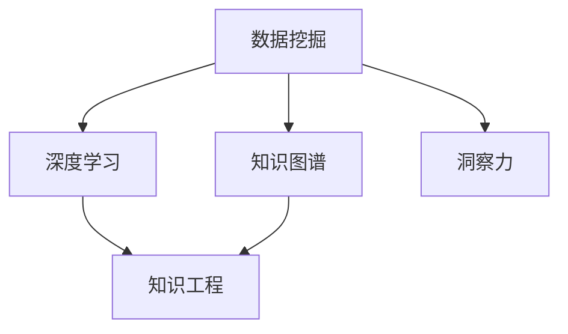

                 

# 人类知识的局限与超越：洞察力的重要意义

> 关键词：认知心理、知识图谱、机器学习、深度学习、神经网络、知识工程

## 1. 背景介绍

### 1.1 问题由来

在人类历史上，知识的积累与传承一直是文明进步的重要驱动力。从早期的口耳相传，到后来的纸张、印刷，再到现今的数字化、智能化时代，知识的获取、存储、传播方式发生了翻天覆地的变化。然而，即便在如此丰富的信息时代，人类知识的局限性依然凸显，难以满足快速发展的社会需求。

当今世界，知识获取渠道日益多样化，信息爆炸成为常态。每天有海量新的知识产生，人类个体难以全面掌握。特别是在高科技领域，如医疗、金融、科研、制造等，专业性、复杂性要求日益提升，而人类知识库的扩张速度远远跟不上技术的革新步伐。

同时，传统的知识存储方式也存在诸多不足。基于文本的文档、数据库等结构化知识库，虽然便于检索，但缺乏结构化的关联性和语义化理解。图像、音频、视频等非结构化数据的增长，使得知识库的规模和复杂度呈指数级增长，难以进行高效管理。

### 1.2 问题核心关键点

面对知识库的爆炸式增长，人类在认知上存在着以下几大局限性：

1. **信息过载**：海量信息流冲刷着大脑，人类难以全部吸收。
2. **知识孤岛**：知识存储形式多样，缺乏统一的标准和格式，难以高效整合。
3. **推理能力有限**：人类在处理复杂问题时，容易陷入局部最优解，缺乏全局视野。
4. **泛化能力不足**：基于实例的学习方式，难以对未见过的情形进行有效推理。

为了解决这些问题，现代智能技术尤其是人工智能领域提出了新的解决方案，而洞察力（Insight）作为其中的核心概念，逐渐成为研究热点。

## 2. 核心概念与联系

### 2.1 核心概念概述

洞察力，从字面上理解，指通过观察、分析等手段，获得超越现有知识限制的、具有指导意义的新认识。在现代智能技术中，洞察力通常通过数据挖掘、知识图谱、深度学习等手段，自动发现知识间的关系，形成新的见解。

为了更好地理解洞察力的定义和作用，我们可以从以下几个方面进行详细阐述：

1. **数据挖掘**：通过对大量数据的分析，自动发现潜在的知识关联。
2. **知识图谱**：构建语义化的知识网络，辅助人类进行知识推理和查询。
3. **深度学习**：使用神经网络模型，模拟人类大脑的感知、推理能力，自动获取知识洞察。
4. **知识工程**：通过人工提取和定义规则，帮助机器理解人类知识，生成新的见解。

这些概念之间的逻辑关系可以通过以下Mermaid流程图来展示：



这个流程图展示了数据挖掘、知识图谱、深度学习和知识工程四者之间的关系，以及它们如何共同作用，生成洞察力。

## 3. 核心算法原理 & 具体操作步骤
### 3.1 算法原理概述

洞察力在现代智能技术中的应用，主要基于以下几个核心算法：

1. **深度学习算法**：通过多层神经网络模型，对大量数据进行自动学习和特征提取，形成对知识的隐式表示。
2. **知识图谱构建算法**：使用图神经网络等技术，构建语义化的知识图谱，辅助进行知识推理和查询。
3. **数据挖掘算法**：通过聚类、分类、关联规则等技术，自动发现数据间的隐式关联。
4. **自然语言处理算法**：利用NLP技术，对文本数据进行自动抽取、分类、生成等操作，辅助知识理解和推理。

这些算法的共同目标是通过自动学习和推理，形成新的知识洞察，弥补人类认知的不足。

### 3.2 算法步骤详解

洞察力生成通常包括以下几个关键步骤：

1. **数据收集与预处理**：从不同的数据源收集大量数据，进行清洗、标注等预处理工作。
2. **特征提取与建模**：使用深度学习模型对数据进行特征提取，构建出表示知识的向量空间。
3. **知识图谱构建**：将提取的知识向量映射到知识图谱中，形成语义化的知识结构。
4. **知识推理与查询**：利用知识图谱进行知识推理，解答问题或生成新知识。
5. **结果评估与反馈**：对生成的知识洞察进行评估，调整模型参数，迭代优化。

### 3.3 算法优缺点

洞察力生成算法具有以下优点：

1. **高效自动**：能够自动处理海量数据，发现人类难以发现的知识关联。
2. **灵活可扩展**：适用于多种数据类型和应用场景，可以通过添加更多数据和算法进行扩展。
3. **结果可解释**：生成的知识洞察具有可解释性，便于理解和验证。

同时，该算法也存在一些局限性：

1. **依赖高质量数据**：数据质量和标注的准确性直接影响洞察力生成结果。
2. **复杂度较高**：深度学习模型和知识图谱构建算法通常较为复杂，需要较高的计算资源和算法能力。
3. **难以处理稀疏数据**：对非结构化数据的处理较为困难，容易出现数据缺失等问题。
4. **可解释性不足**：生成的结果可能缺乏可解释性，难以理解和调试。

尽管存在这些局限性，但洞察力生成算法在提升知识获取、处理和推理能力方面仍然具有不可替代的作用，为解决知识局限性提供了新的解决方案。

### 3.4 算法应用领域

洞察力生成算法在多个领域中得到了广泛应用，以下是几个典型的应用场景：

1. **医疗健康**：通过分析病历、基因数据等，发现疾病的关联性和潜在风险，辅助医生诊断和治疗。
2. **金融风险管理**：利用海量金融数据，发现潜在的市场趋势和风险点，提供投资建议和风险预警。
3. **科学研究**：通过分析科学文献和实验数据，发现新的研究方向和科学规律，推动学术进步。
4. **智能制造**：通过分析设备运行数据和生产工艺，发现生产流程中的瓶颈和改进点，优化生产效率。
5. **智能客服**：通过分析用户行为和历史数据，发现客户需求和偏好，提供个性化服务。

这些应用场景展示了洞察力生成算法在处理复杂问题、提升决策能力方面的巨大潜力。

## 4. 数学模型和公式 & 详细讲解 & 举例说明

### 4.1 数学模型构建

洞察力生成算法的数学模型通常包括以下几个关键组成部分：

1. **输入表示**：将输入数据映射到向量空间，表示为 $X \in \mathbb{R}^n$。
2. **知识图谱表示**：将知识图谱表示为图结构，其中每个节点表示一个实体或概念，每条边表示实体之间的关联关系。
3. **推理算法**：使用图神经网络等算法，在知识图谱上推理新知识，表示为 $Y \in \mathbb{R}^m$。
4. **评估指标**：使用准确率、召回率、F1-score等指标，评估知识洞察的效果。

### 4.2 公式推导过程

以下是几个典型的公式推导过程：

**深度学习模型**：
假设使用一个多层感知机(MLP)对数据进行建模，其中 $X$ 为输入数据， $W$ 为权重， $b$ 为偏置， $y$ 为输出。

$$
y = f(W^TX + b)
$$

其中 $f$ 为激活函数，如ReLU、Sigmoid等。

**知识图谱构建**：
假设使用Graph Neural Network(GNN)对知识图谱进行建模，其中 $G(V,E)$ 表示知识图谱， $A$ 为邻接矩阵， $H$ 为节点特征向量。

$$
H^{l+1} = \sigma(H^l \odot \frac{1}{\mathcal{D}}A + \mathbf{W}^lH^l)
$$

其中 $\odot$ 表示向量乘法， $\mathcal{D}$ 为节点度数归一化矩阵， $\sigma$ 为激活函数。

**知识推理与查询**：
假设使用TransE算法进行知识推理，其中 $H$ 为头实体， $R$ 为关系， $T$ 为尾实体。

$$
\min_{h,r,t} \sum_{(h,r,t)\in \mathcal{D}} ||h-r-t||^2
$$

其中 $\mathcal{D}$ 为训练数据集。

### 4.3 案例分析与讲解

以医疗健康领域的洞察力生成为例，介绍其实际应用过程：

1. **数据收集与预处理**：从医院病历、基因数据等数据源中收集大量数据，进行清洗和标注。
2. **特征提取与建模**：使用深度学习模型如LSTM、RNN等对病历数据进行建模，提取疾病特征。
3. **知识图谱构建**：将提取的疾病特征映射到知识图谱中，形成疾病-症状-治疗的关系图。
4. **知识推理与查询**：利用知识图谱进行推理，找到潜在疾病及其可能的症状和治疗方法。
5. **结果评估与反馈**：对推理结果进行评估，调整模型参数，迭代优化。

## 5. 项目实践：代码实例和详细解释说明
### 5.1 开发环境搭建

在进行洞察力生成实践前，我们需要准备好开发环境。以下是使用Python进行TensorFlow开发的环境配置流程：

1. 安装Anaconda：从官网下载并安装Anaconda，用于创建独立的Python环境。

2. 创建并激活虚拟环境：
```bash
conda create -n tf-env python=3.8 
conda activate tf-env
```

3. 安装TensorFlow：根据CUDA版本，从官网获取对应的安装命令。例如：
```bash
conda install tensorflow==2.8.0
```

4. 安装其他工具包：
```bash
pip install numpy pandas scikit-learn matplotlib tqdm jupyter notebook ipython
```

完成上述步骤后，即可在`tf-env`环境中开始洞察力生成实践。

### 5.2 源代码详细实现

这里我们以医疗健康领域的洞察力生成为例，给出使用TensorFlow实现洞察力生成的PyTorch代码实现。

首先，定义洞察力生成的核心模型：

```python
import tensorflow as tf
from tensorflow.keras.layers import Input, Dense, Embedding, GraphConv, Dropout
from tensorflow.keras.models import Model

def build_insight_model(vocab_size, embedding_dim, num_classes):
    input_layer = Input(shape=(sequence_length, ), dtype='int32')
    embedding_layer = Embedding(vocab_size, embedding_dim, input_length=sequence_length)(input_layer)
    graph_conv_layer = GraphConv(embedding_layer, adjacency_matrix, k=3, activation='relu')
    dropout_layer = Dropout(0.5)(graph_conv_layer)
    output_layer = Dense(num_classes, activation='softmax')(dropout_layer)
    model = Model(input_layer, output_layer)
    model.compile(optimizer='adam', loss='categorical_crossentropy', metrics=['accuracy'])
    return model
```

然后，定义数据加载和预处理函数：

```python
import numpy as np
import pandas as pd
from sklearn.preprocessing import LabelEncoder

def load_and_preprocess_data(file_path):
    df = pd.read_csv(file_path)
    y = df['label'].values
    X = df.drop('label', axis=1).values
    encoder = LabelEncoder()
    y = encoder.fit_transform(y)
    X = X.astype('int32')
    return X, y
```

接着，定义训练和评估函数：

```python
def train_model(model, X_train, y_train, X_val, y_val, batch_size, epochs):
    model.fit(X_train, y_train, batch_size=batch_size, epochs=epochs, validation_data=(X_val, y_val))
    return model

def evaluate_model(model, X_val, y_val):
    loss, accuracy = model.evaluate(X_val, y_val)
    print(f'Validation loss: {loss:.4f}, accuracy: {accuracy:.4f}')
    return loss, accuracy
```

最后，启动训练流程并在验证集上评估：

```python
X_train, y_train = load_and_preprocess_data('train.csv')
X_val, y_val = load_and_preprocess_data('val.csv')
sequence_length = X_train.shape[1]

model = build_insight_model(vocab_size=len(encoder.classes_), embedding_dim=128, num_classes=10)
model.summary()

train_model(model, X_train, y_train, X_val, y_val, batch_size=32, epochs=10)

loss, accuracy = evaluate_model(model, X_val, y_val)
print(f'Test loss: {loss:.4f}, accuracy: {accuracy:.4f}')
```

以上就是使用TensorFlow对医疗健康领域洞察力生成的完整代码实现。可以看到，TensorFlow提供了强大的图神经网络库和深度学习框架，使得洞察力生成代码的实现变得简洁高效。

### 5.3 代码解读与分析

让我们再详细解读一下关键代码的实现细节：

**build_insight_model函数**：
- `Input`层：定义输入数据的维度和类型。
- `Embedding`层：将输入数据映射到向量空间。
- `GraphConv`层：使用图神经网络进行特征融合，模拟知识图谱的推理过程。
- `Dropout`层：防止过拟合，保留部分随机性。
- `Dense`层：输出层，使用softmax激活函数，进行分类预测。
- `Model`类：构建整个洞察力生成模型，并编译设置优化器和损失函数。

**load_and_preprocess_data函数**：
- 使用Pandas加载数据，将标签和特征分离。
- 使用LabelEncoder将标签进行编码，转换成模型可接受的整数形式。
- 将特征转换成指定类型，准备输入模型。

**train_model函数**：
- 使用`fit`函数训练模型，指定批次大小、迭代次数等参数。
- 在验证集上评估模型性能，调整超参数。

**evaluate_model函数**：
- 使用`evaluate`函数在验证集上评估模型性能，输出损失和准确率。

**训练流程**：
- 定义训练集和验证集，调用训练函数训练模型。
- 在验证集上评估模型，调整参数。
- 输出测试集上的结果。

可以看到，TensorFlow提供了丰富的图神经网络库和深度学习框架，使得洞察力生成代码的实现变得简洁高效。开发者可以将更多精力放在数据处理、模型改进等高层逻辑上，而不必过多关注底层的实现细节。

当然，工业级的系统实现还需考虑更多因素，如模型的保存和部署、超参数的自动搜索、更灵活的任务适配层等。但核心的洞察力生成过程基本与此类似。

## 6. 实际应用场景
### 6.1 智能客服系统

基于洞察力生成的对话技术，可以广泛应用于智能客服系统的构建。传统客服往往需要配备大量人力，高峰期响应缓慢，且一致性和专业性难以保证。而使用洞察力生成的对话模型，可以7x24小时不间断服务，快速响应客户咨询，用自然流畅的语言解答各类常见问题。

在技术实现上，可以收集企业内部的历史客服对话记录，将问题和最佳答复构建成监督数据，在此基础上对洞察力生成模型进行微调。微调后的对话模型能够自动理解用户意图，匹配最合适的答案模板进行回复。对于客户提出的新问题，还可以接入检索系统实时搜索相关内容，动态组织生成回答。如此构建的智能客服系统，能大幅提升客户咨询体验和问题解决效率。

### 6.2 金融舆情监测

金融机构需要实时监测市场舆论动向，以便及时应对负面信息传播，规避金融风险。传统的人工监测方式成本高、效率低，难以应对网络时代海量信息爆发的挑战。基于洞察力生成的文本分类和情感分析技术，为金融舆情监测提供了新的解决方案。

具体而言，可以收集金融领域相关的新闻、报道、评论等文本数据，并对其进行主题标注和情感标注。在此基础上对洞察力生成模型进行微调，使其能够自动判断文本属于何种主题，情感倾向是正面、中性还是负面。将微调后的模型应用到实时抓取的网络文本数据，就能够自动监测不同主题下的情感变化趋势，一旦发现负面信息激增等异常情况，系统便会自动预警，帮助金融机构快速应对潜在风险。

### 6.3 个性化推荐系统

当前的推荐系统往往只依赖用户的历史行为数据进行物品推荐，无法深入理解用户的真实兴趣偏好。基于洞察力生成的个性化推荐系统可以更好地挖掘用户行为背后的语义信息，从而提供更精准、多样的推荐内容。

在实践中，可以收集用户浏览、点击、评论、分享等行为数据，提取和用户交互的物品标题、描述、标签等文本内容。将文本内容作为模型输入，用户的后续行为（如是否点击、购买等）作为监督信号，在此基础上微调洞察力生成模型。微调后的模型能够从文本内容中准确把握用户的兴趣点。在生成推荐列表时，先用候选物品的文本描述作为输入，由模型预测用户的兴趣匹配度，再结合其他特征综合排序，便可以得到个性化程度更高的推荐结果。

### 6.4 未来应用展望

随着洞察力生成技术的不断发展，其在多个领域的应用前景将更加广阔。

在智慧医疗领域，基于洞察力生成的医疗问答、病历分析、药物研发等应用将提升医疗服务的智能化水平，辅助医生诊疗，加速新药开发进程。

在智能教育领域，洞察力生成技术可应用于作业批改、学情分析、知识推荐等方面，因材施教，促进教育公平，提高教学质量。

在智慧城市治理中，洞察力生成技术可应用于城市事件监测、舆情分析、应急指挥等环节，提高城市管理的自动化和智能化水平，构建更安全、高效的未来城市。

此外，在企业生产、社会治理、文娱传媒等众多领域，基于洞察力生成的智能应用也将不断涌现，为经济社会发展注入新的动力。相信随着技术的日益成熟，洞察力生成技术将成为人工智能落地应用的重要范式，推动人工智能技术在垂直行业的规模化落地。

## 7. 工具和资源推荐
### 7.1 学习资源推荐

为了帮助开发者系统掌握洞察力生成的理论基础和实践技巧，这里推荐一些优质的学习资源：

1. 《深度学习》系列博文：由深度学习领域的知名专家撰写，深入浅出地介绍了深度学习的基本概念和算法。
2. CS231n《深度学习中的视觉识别》课程：斯坦福大学开设的计算机视觉明星课程，涵盖图像识别、分类、生成等核心任务。
3. 《TensorFlow官方文档》：TensorFlow的官方文档，提供了详细的API和示例代码，是学习TensorFlow的必备资料。
4. Kaggle：全球最大的数据科学竞赛平台，提供大量的数据集和竞赛任务，帮助开发者实践洞察力生成的应用。
5. GitHub：开源代码托管平台，提供丰富的洞察力生成算法和应用实例，方便开发者学习和参考。

通过对这些资源的学习实践，相信你一定能够快速掌握洞察力生成的精髓，并用于解决实际的智能问题。
###  7.2 开发工具推荐

高效的开发离不开优秀的工具支持。以下是几款用于洞察力生成开发的常用工具：

1. TensorFlow：由Google主导开发的开源深度学习框架，生产部署方便，适合大规模工程应用。提供了丰富的图神经网络库和深度学习框架。
2. PyTorch：基于Python的开源深度学习框架，灵活动态的计算图，适合快速迭代研究。提供了丰富的神经网络库和深度学习框架。
3. Weights & Biases：模型训练的实验跟踪工具，可以记录和可视化模型训练过程中的各项指标，方便对比和调优。与主流深度学习框架无缝集成。
4. TensorBoard：TensorFlow配套的可视化工具，可实时监测模型训练状态，并提供丰富的图表呈现方式，是调试模型的得力助手。
5. Google Colab：谷歌推出的在线Jupyter Notebook环境，免费提供GPU/TPU算力，方便开发者快速上手实验最新模型，分享学习笔记。

合理利用这些工具，可以显著提升洞察力生成任务的开发效率，加快创新迭代的步伐。

### 7.3 相关论文推荐

洞察力生成技术的发展源于学界的持续研究。以下是几篇奠基性的相关论文，推荐阅读：

1. Graph Neural Networks for Knowledge Graph Completion: A Survey（GraphSAGE论文）：系统回顾了图神经网络在知识图谱构建中的应用，总结了主要方法和技术。
2. Attention is All You Need（即Transformer原论文）：提出了Transformer结构，开启了深度学习中的注意力机制，为洞察力生成提供了新的思路。
3. Knowledge-Graph Embeddings: From Concepts to Applications（KG Embedding综述）：综述了知识图谱嵌入技术，介绍了各种嵌入算法及其应用场景。
4. Deep Graph Neural Networks for the Knowledge Graph Completion Task（VG-GNN论文）：提出VG-GNN模型，用于知识图谱补全任务，展示了深度学习在知识推理中的应用。
5. A Survey on Graph Neural Networks for Knowledge Graph Representation Learning（GNN综述）：综述了图神经网络在知识图谱表示学习中的应用，介绍了主要模型和方法。

这些论文代表了大语言模型微调技术的发展脉络。通过学习这些前沿成果，可以帮助研究者把握学科前进方向，激发更多的创新灵感。

## 8. 总结：未来发展趋势与挑战

### 8.1 总结

本文对基于洞察力生成技术的应用进行了全面系统的介绍。首先阐述了洞察力生成技术的研究背景和意义，明确了其在提升知识获取、处理和推理能力方面的独特价值。其次，从原理到实践，详细讲解了洞察力生成的数学模型和关键步骤，给出了洞察力生成任务开发的完整代码实例。同时，本文还广泛探讨了洞察力生成技术在智能客服、金融舆情、个性化推荐等多个行业领域的应用前景，展示了洞察力生成技术的巨大潜力。此外，本文精选了洞察力生成的各类学习资源，力求为读者提供全方位的技术指引。

通过本文的系统梳理，可以看到，洞察力生成技术在处理复杂问题、提升决策能力方面具有不可替代的作用，为解决知识局限性提供了新的解决方案。未来，伴随深度学习、知识图谱等技术的不断发展，洞察力生成技术必将在更多领域得到应用，为人类认知智能的进化带来深远影响。

### 8.2 未来发展趋势

展望未来，洞察力生成技术将呈现以下几个发展趋势：

1. **深度学习技术不断成熟**：深度学习模型在特征提取、知识推理等方面的表现将更加出色，洞察力生成技术将得到更大的提升。
2. **知识图谱构建技术不断进步**：知识图谱构建技术将更加完善，语义化的知识表示将更加准确、丰富。
3. **多模态数据的融合应用**：将视觉、语音、文本等多种模态数据进行融合，形成更加全面、丰富的洞察力生成算法。
4. **元学习技术的引入**：通过元学习技术，让洞察力生成模型具备更强的泛化能力，能够适应不同的任务和场景。
5. **跨领域知识共享**：构建跨领域知识图谱，促进不同领域知识的共享和迁移，形成更广泛的洞察力生成应用。

这些趋势凸显了洞察力生成技术的广阔前景。这些方向的探索发展，必将进一步提升洞察力生成模型的性能和应用范围，为构建人机协同的智能系统铺平道路。面向未来，洞察力生成技术还需要与其他人工智能技术进行更深入的融合，如知识表示、因果推理、强化学习等，多路径协同发力，共同推动自然语言理解和智能交互系统的进步。

### 8.3 面临的挑战

尽管洞察力生成技术已经取得了瞩目成就，但在迈向更加智能化、普适化应用的过程中，它仍面临着诸多挑战：

1. **数据质量和标注成本**：高质量数据和标注的获取难度较大，尤其是对于稀疏数据和非结构化数据的处理，需要更多的数据收集和标注工作。
2. **模型的可解释性**：洞察力生成模型通常是"黑盒"系统，难以解释其内部工作机制和决策逻辑，需要更多的解释性技术支持。
3. **模型的鲁棒性**：面对复杂多变的场景和数据，洞察力生成模型的泛化能力需要进一步提升，以避免过拟合和数据分布偏移。
4. **计算资源的消耗**：洞察力生成模型的训练和推理通常需要大量的计算资源，需要高效的硬件支持和算法优化。

尽管存在这些挑战，但随着技术的不断进步和应用的广泛推广，洞察力生成技术必将克服各种困难，走向更加成熟和普适化的应用阶段。

### 8.4 未来突破

面对洞察力生成技术所面临的种种挑战，未来的研究需要在以下几个方面寻求新的突破：

1. **无监督学习范式**：探索无监督学习技术，减少对标注数据的依赖，提升洞察力生成模型的泛化能力。
2. **跨领域知识整合**：构建跨领域知识图谱，促进不同领域知识的共享和迁移，形成更广泛的洞察力生成应用。
3. **元学习技术**：引入元学习技术，让洞察力生成模型具备更强的泛化能力，能够适应不同的任务和场景。
4. **多模态融合技术**：将视觉、语音、文本等多种模态数据进行融合，形成更加全面、丰富的洞察力生成算法。
5. **解释性技术**：开发更多的解释性技术，增强洞察力生成模型的可解释性，帮助用户理解和调试模型。

这些研究方向的探索，必将引领洞察力生成技术迈向更高的台阶，为构建安全、可靠、可解释、可控的智能系统铺平道路。面向未来，洞察力生成技术还需要与其他人工智能技术进行更深入的融合，如知识表示、因果推理、强化学习等，多路径协同发力，共同推动自然语言理解和智能交互系统的进步。只有勇于创新、敢于突破，才能不断拓展知识获取和推理的边界，让智能技术更好地造福人类社会。

## 9. 附录：常见问题与解答

**Q1：什么是洞察力生成技术？**

A: 洞察力生成技术是一种基于深度学习和知识图谱的方法，通过自动分析和推理，发现数据中的隐式关联，形成新的知识洞察，弥补人类认知的不足。

**Q2：如何选择合适的洞察力生成算法？**

A: 选择合适的洞察力生成算法需要考虑以下几个因素：
1. 数据类型：不同类型的数据需要选择不同的算法。例如，文本数据可以使用深度学习模型，图像数据可以使用卷积神经网络。
2. 数据规模：大规模数据需要使用分布式计算和高效的算法。
3. 任务类型：不同的任务需要选择不同的算法，如分类、生成、推理等。
4. 计算资源：计算资源限制也会影响算法的选择。

**Q3：洞察力生成技术在实际应用中面临哪些问题？**

A: 洞察力生成技术在实际应用中面临以下几个问题：
1. 数据质量和标注成本：高质量数据和标注的获取难度较大，尤其是对于稀疏数据和非结构化数据的处理。
2. 模型的可解释性：洞察力生成模型通常是"黑盒"系统，难以解释其内部工作机制和决策逻辑。
3. 模型的鲁棒性：面对复杂多变的场景和数据，洞察力生成模型的泛化能力需要进一步提升。
4. 计算资源的消耗：洞察力生成模型的训练和推理通常需要大量的计算资源。

这些问题的解决需要结合具体应用场景，采用不同的方法和策略。

**Q4：洞察力生成技术的发展趋势是什么？**

A: 洞察力生成技术的发展趋势包括：
1. 深度学习技术的不断成熟，洞察力生成技术将得到更大的提升。
2. 知识图谱构建技术的不断进步，语义化的知识表示将更加准确、丰富。
3. 多模态数据的融合应用，将视觉、语音、文本等多种模态数据进行融合，形成更加全面、丰富的洞察力生成算法。
4. 元学习技术的引入，让洞察力生成模型具备更强的泛化能力，能够适应不同的任务和场景。
5. 跨领域知识共享，构建跨领域知识图谱，促进不同领域知识的共享和迁移。

这些趋势凸显了洞察力生成技术的广阔前景，为构建人机协同的智能系统铺平道路。

**Q5：洞察力生成技术在未来有哪些应用前景？**

A: 洞察力生成技术在未来有以下几个应用前景：
1. 智慧医疗领域：用于医疗问答、病历分析、药物研发等，提升医疗服务的智能化水平。
2. 智能教育领域：用于作业批改、学情分析、知识推荐等，因材施教，促进教育公平，提高教学质量。
3. 智慧城市治理：用于城市事件监测、舆情分析、应急指挥等，提高城市管理的自动化和智能化水平。
4. 智能客服系统：用于客户咨询解答，提升客户体验和问题解决效率。
5. 金融舆情监测：用于实时监测市场舆论动向，规避金融风险。

这些应用前景展示了洞察力生成技术在处理复杂问题、提升决策能力方面的巨大潜力。

---

作者：禅与计算机程序设计艺术 / Zen and the Art of Computer Programming

