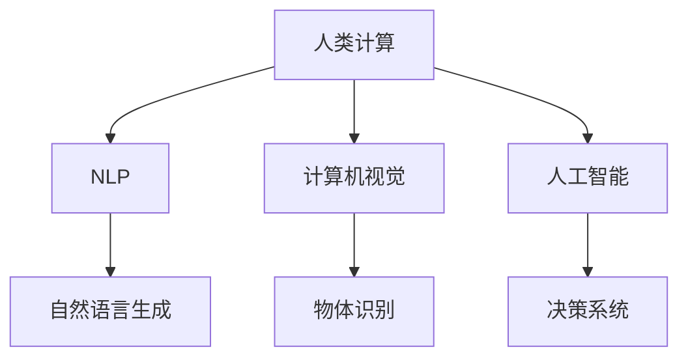

                 

# 人类计算：AI 时代的新希望

在人工智能飞速发展的今天，我们见证了无数科技的突破和创新的出现。而在这一浪潮中，人类计算（Human Computation）作为一种新颖且深远的理念，逐渐成为AI时代的新希望。它不仅挑战了传统计算方式，也为我们提供了全新的视角和方法来理解世界。

## 1. 背景介绍

### 1.1 问题的由来

随着计算机技术和AI的不断发展，机器计算已经成为我们获取信息和处理数据的主要方式。然而，尽管机器计算在许多领域取得了巨大成功，人类独特的智慧和创造力却依然难以被全面替代。

人类计算的概念最早源于图灵奖得主沃尔特·克劳德·香农（Walter Shannnon）。他提出了“人类计算”的设想，即利用人类的智慧和创造力，将复杂的问题简化，通过自然语言、图像、声音等形式，引导机器去理解和执行。

近年来，随着深度学习、自然语言处理、计算机视觉等技术的不断进步，人类计算在AI时代焕发出新的生机，成为推动AI技术发展的重要力量。

### 1.2 问题核心关键点

人类计算的核心在于通过人类特有的方式——自然语言、图像、声音等——与机器计算相结合，实现信息处理和问题解决。其关键点在于：

- **自然语言处理**：理解、生成和转换自然语言，使计算机能够像人一样理解和交流。
- **计算机视觉**：通过图像和视频数据，识别和理解现实世界中的对象、场景和动作。
- **人工智能**：利用机器学习、深度学习等技术，让机器具备类似人类的智能能力。
- **交互设计**：设计易于理解和使用的用户界面，使人类计算更加自然和高效。

## 2. 核心概念与联系

### 2.1 核心概念概述

为了更好地理解人类计算，我们需要明确几个核心概念：

- **人类计算（Human Computation）**：利用人类的智慧和创造力，通过自然语言、图像、声音等形式与机器计算相结合，解决复杂问题的计算方式。
- **自然语言处理（NLP）**：使用计算机技术处理和分析人类语言，使计算机能够理解、生成和转换自然语言。
- **计算机视觉（CV）**：使计算机能够理解和分析图像和视频数据，识别和理解现实世界中的对象和场景。
- **人工智能（AI）**：通过机器学习和深度学习等技术，使计算机具备类似人类的智能能力。

### 2.2 核心概念原理和架构的 Mermaid 流程图



这张图展示了人类计算的架构：

- **自然语言处理（B）**：从用户输入的自然语言中提取信息，生成指令，与计算机交互。
- **计算机视觉（C）**：处理图像和视频数据，识别和理解现实世界中的对象和场景。
- **人工智能（D）**：利用机器学习和深度学习等技术，使计算机具备智能能力，做出决策。
- **交互设计（E、F、G）**：通过自然语言生成、物体识别、决策系统等模块，实现人与机器的有效交互。

### 2.3 核心概念间的联系

人类计算将人类智慧与机器计算结合，通过自然语言、图像、声音等形式，引导机器理解、生成和执行任务。其关键在于：

- **自然语言处理**与**人工智能**的结合，使计算机能够理解人类语言，做出智能决策。
- **计算机视觉**与**人工智能**的结合，使计算机能够识别和理解现实世界中的对象和场景。
- **交互设计**与**自然语言处理**的结合，使人类能够以自然语言形式与机器交互，提高效率和舒适度。

## 3. 核心算法原理 & 具体操作步骤

### 3.1 算法原理概述

人类计算的核心在于通过自然语言、图像、声音等形式，与机器计算相结合，实现信息处理和问题解决。其算法原理主要包括以下几个方面：

1. **自然语言处理（NLP）**：
   - **文本预处理**：包括分词、词性标注、命名实体识别等步骤。
   - **语义分析**：通过词向量、句法分析等方法，理解文本的深层含义。
   - **情感分析**：识别文本的情感倾向，如正面、负面或中性。
   - **机器翻译**：将一种语言翻译成另一种语言，实现跨语言的交流。

2. **计算机视觉（CV）**：
   - **图像预处理**：包括图像增强、图像分割、特征提取等步骤。
   - **物体检测**：识别图像中的物体，并定位其位置。
   - **物体识别**：通过分类器，识别图像中的物体种类。
   - **图像生成**：生成高质量的图像数据，如GAN、VAE等。

3. **人工智能（AI）**：
   - **机器学习**：通过监督学习、无监督学习、半监督学习等方法，让计算机从数据中学习知识。
   - **深度学习**：使用神经网络模型，如卷积神经网络（CNN）、循环神经网络（RNN）、Transformer等，处理复杂的数据结构。
   - **强化学习**：通过奖励和惩罚机制，让计算机在不断尝试中学习和改进。

### 3.2 算法步骤详解

人类计算的具体操作步骤如下：

1. **数据收集**：收集需要处理的文本、图像、声音等数据。
2. **预处理**：对收集到的数据进行预处理，包括文本分词、图像增强、声音转换等步骤。
3. **模型训练**：根据预处理后的数据，选择合适的模型进行训练，如BERT、GPT、ResNet等。
4. **模型评估**：对训练好的模型进行评估，确保其在实际应用中的效果。
5. **模型部署**：将训练好的模型部署到实际应用中，进行信息处理和问题解决。
6. **反馈迭代**：根据实际应用中的反馈，不断调整和优化模型，提高其效果和稳定性。

### 3.3 算法优缺点

人类计算的优点在于：

- **结合人类智慧**：通过自然语言、图像、声音等形式，使计算机具备更强的理解力和创造力。
- **跨领域应用**：广泛应用于医疗、教育、金融、娱乐等多个领域。
- **人机协同**：人与机器协同工作，提高效率和准确性。

其缺点在于：

- **资源消耗大**：需要大量人力和计算资源，成本较高。
- **模型复杂**：需要复杂的技术和算法支持，对开发者要求较高。
- **数据依赖性强**：需要大量的高质量标注数据，对数据质量和数量要求高。

### 3.4 算法应用领域

人类计算在多个领域都有广泛的应用：

- **医疗领域**：通过自然语言处理和计算机视觉，辅助医生进行病历分析、疾病诊断和治疗方案制定。
- **教育领域**：通过自然语言处理和人工智能，开发智能辅导系统和个性化学习系统。
- **金融领域**：通过计算机视觉和人工智能，实现智能监控、风险评估和交易策略制定。
- **娱乐领域**：通过自然语言处理和计算机视觉，实现智能推荐、语音识别和图像生成。
- **制造业**：通过计算机视觉和人工智能，实现智能检测、机器人控制和生产调度。

## 4. 数学模型和公式 & 详细讲解 & 举例说明

### 4.1 数学模型构建

人类计算的数学模型主要涉及以下几个方面：

1. **自然语言处理（NLP）**：
   - **词向量**：将文本中的单词转换为向量表示，如Word2Vec、GloVe等。
   - **句法分析**：通过句法树等方法，分析句子的结构。
   - **情感分析**：通过情感词典、LSTM等方法，分析文本的情感倾向。

2. **计算机视觉（CV）**：
   - **物体检测**：通过YOLO、SSD等方法，识别图像中的物体。
   - **物体识别**：通过ResNet、VGG等方法，识别图像中的物体种类。
   - **图像生成**：通过GAN、VAE等方法，生成高质量的图像数据。

3. **人工智能（AI）**：
   - **机器学习**：通过监督学习、无监督学习、半监督学习等方法，学习数据中的知识。
   - **深度学习**：使用神经网络模型，如CNN、RNN、Transformer等，处理复杂的数据结构。
   - **强化学习**：通过奖励和惩罚机制，让计算机在不断尝试中学习和改进。

### 4.2 公式推导过程

以自然语言处理的情感分析为例，其公式推导过程如下：

1. **文本预处理**：
   - **分词**：将文本分解为单词序列，如```text = "I love this movie"```。
   - **词性标注**：为每个单词标注其词性，如```("I", "Pronoun"), ("love", "Verb"), ("this", "Pronoun"), ("movie", "Noun")```。

2. **语义分析**：
   - **词向量**：将每个单词转换为向量表示，如```[I, love, this, movie] = [0.2, 0.5, 0.3, 0.1]```。
   - **句法分析**：通过句法树，分析句子的结构，如```I love this movie```。

3. **情感分析**：
   - **情感词典**：使用情感词典，为每个单词赋予情感值，如```I=0.3, love=0.5, this=0, movie=0.2```。
   - **LSTM模型**：通过LSTM模型，综合单词情感值，预测文本情感倾向，如```text_senti = 0.45```。

4. **模型训练**：
   - **损失函数**：使用交叉熵损失函数，```loss = -(y*log(p)+(1-y)*log(1-p))```，其中```y```为真实情感标签，```p```为模型预测情感值。
   - **梯度下降**：通过梯度下降算法，更新模型参数，如```theta = theta - learning_rate * gradient```。

### 4.3 案例分析与讲解

以图像识别的YOLO模型为例，其公式推导过程如下：

1. **图像预处理**：
   - **图像增强**：对图像进行缩放、旋转、裁剪等操作，如```image_enhanced = reshape(scale(rotate(crop(image))))```。

2. **物体检测**：
   - **特征提取**：通过卷积层提取图像特征，如```features = conv1(filter(image_enhanced))```。
   - **物体检测**：通过区域提议网络（RPN），生成物体候选框，如```boxes = rpn(features)```。

3. **物体识别**：
   - **特征融合**：将物体候选框与卷积特征融合，如```fused_features = concat(boxes, features)```。
   - **分类器**：通过全连接层，对物体候选框进行分类和回归，如```labels = classifier(fused_features)```。

4. **模型训练**：
   - **损失函数**：使用交叉熵损失函数，```loss = -(y*log(p)+(1-y)*log(1-p))```，其中```y```为真实标签，```p```为模型预测标签。
   - **梯度下降**：通过梯度下降算法，更新模型参数，如```theta = theta - learning_rate * gradient```。

## 5. 项目实践：代码实例和详细解释说明

### 5.1 开发环境搭建

在进行人类计算实践前，我们需要准备好开发环境。以下是使用Python进行PyTorch开发的环境配置流程：

1. 安装Anaconda：从官网下载并安装Anaconda，用于创建独立的Python环境。

2. 创建并激活虚拟环境：
```bash
conda create -n pytorch-env python=3.8 
conda activate pytorch-env
```

3. 安装PyTorch：根据CUDA版本，从官网获取对应的安装命令。例如：
```bash
conda install pytorch torchvision torchaudio cudatoolkit=11.1 -c pytorch -c conda-forge
```

4. 安装Transformers库：
```bash
pip install transformers
```

5. 安装各类工具包：
```bash
pip install numpy pandas scikit-learn matplotlib tqdm jupyter notebook ipython
```

完成上述步骤后，即可在`pytorch-env`环境中开始人类计算实践。

### 5.2 源代码详细实现

下面我们以命名实体识别（NER）任务为例，给出使用Transformers库对BERT模型进行人类计算的PyTorch代码实现。

首先，定义NER任务的数据处理函数：

```python
from transformers import BertTokenizer
from torch.utils.data import Dataset
import torch

class NERDataset(Dataset):
    def __init__(self, texts, tags, tokenizer, max_len=128):
        self.texts = texts
        self.tags = tags
        self.tokenizer = tokenizer
        self.max_len = max_len
        
    def __len__(self):
        return len(self.texts)
    
    def __getitem__(self, item):
        text = self.texts[item]
        tags = self.tags[item]
        
        encoding = self.tokenizer(text, return_tensors='pt', max_length=self.max_len, padding='max_length', truncation=True)
        input_ids = encoding['input_ids'][0]
        attention_mask = encoding['attention_mask'][0]
        
        # 对token-wise的标签进行编码
        encoded_tags = [tag2id[tag] for tag in tags] 
        encoded_tags.extend([tag2id['O']] * (self.max_len - len(encoded_tags)))
        labels = torch.tensor(encoded_tags, dtype=torch.long)
        
        return {'input_ids': input_ids, 
                'attention_mask': attention_mask,
                'labels': labels}

# 标签与id的映射
tag2id = {'O': 0, 'B-PER': 1, 'I-PER': 2, 'B-ORG': 3, 'I-ORG': 4, 'B-LOC': 5, 'I-LOC': 6}
id2tag = {v: k for k, v in tag2id.items()}

# 创建dataset
tokenizer = BertTokenizer.from_pretrained('bert-base-cased')

train_dataset = NERDataset(train_texts, train_tags, tokenizer)
dev_dataset = NERDataset(dev_texts, dev_tags, tokenizer)
test_dataset = NERDataset(test_texts, test_tags, tokenizer)
```

然后，定义模型和优化器：

```python
from transformers import BertForTokenClassification, AdamW

model = BertForTokenClassification.from_pretrained('bert-base-cased', num_labels=len(tag2id))

optimizer = AdamW(model.parameters(), lr=2e-5)
```

接着，定义训练和评估函数：

```python
from torch.utils.data import DataLoader
from tqdm import tqdm
from sklearn.metrics import classification_report

device = torch.device('cuda') if torch.cuda.is_available() else torch.device('cpu')
model.to(device)

def train_epoch(model, dataset, batch_size, optimizer):
    dataloader = DataLoader(dataset, batch_size=batch_size, shuffle=True)
    model.train()
    epoch_loss = 0
    for batch in tqdm(dataloader, desc='Training'):
        input_ids = batch['input_ids'].to(device)
        attention_mask = batch['attention_mask'].to(device)
        labels = batch['labels'].to(device)
        model.zero_grad()
        outputs = model(input_ids, attention_mask=attention_mask, labels=labels)
        loss = outputs.loss
        epoch_loss += loss.item()
        loss.backward()
        optimizer.step()
    return epoch_loss / len(dataloader)

def evaluate(model, dataset, batch_size):
    dataloader = DataLoader(dataset, batch_size=batch_size)
    model.eval()
    preds, labels = [], []
    with torch.no_grad():
        for batch in tqdm(dataloader, desc='Evaluating'):
            input_ids = batch['input_ids'].to(device)
            attention_mask = batch['attention_mask'].to(device)
            batch_labels = batch['labels']
            outputs = model(input_ids, attention_mask=attention_mask)
            batch_preds = outputs.logits.argmax(dim=2).to('cpu').tolist()
            batch_labels = batch_labels.to('cpu').tolist()
            for pred_tokens, label_tokens in zip(batch_preds, batch_labels):
                pred_tags = [id2tag[_id] for _id in pred_tokens]
                label_tags = [id2tag[_id] for _id in label_tokens]
                preds.append(pred_tags[:len(label_tags)])
                labels.append(label_tags)
                
    print(classification_report(labels, preds))
```

最后，启动训练流程并在测试集上评估：

```python
epochs = 5
batch_size = 16

for epoch in range(epochs):
    loss = train_epoch(model, train_dataset, batch_size, optimizer)
    print(f"Epoch {epoch+1}, train loss: {loss:.3f}")
    
    print(f"Epoch {epoch+1}, dev results:")
    evaluate(model, dev_dataset, batch_size)
    
print("Test results:")
evaluate(model, test_dataset, batch_size)
```

以上就是使用PyTorch对BERT进行命名实体识别任务的人类计算实践。可以看到，得益于Transformers库的强大封装，我们可以用相对简洁的代码完成BERT模型的加载和训练。

### 5.3 代码解读与分析

让我们再详细解读一下关键代码的实现细节：

**NERDataset类**：
- `__init__`方法：初始化文本、标签、分词器等关键组件。
- `__len__`方法：返回数据集的样本数量。
- `__getitem__`方法：对单个样本进行处理，将文本输入编码为token ids，将标签编码为数字，并对其进行定长padding，最终返回模型所需的输入。

**tag2id和id2tag字典**：
- 定义了标签与数字id之间的映射关系，用于将token-wise的预测结果解码回真实的标签。

**训练和评估函数**：
- 使用PyTorch的DataLoader对数据集进行批次化加载，供模型训练和推理使用。
- 训练函数`train_epoch`：对数据以批为单位进行迭代，在每个批次上前向传播计算loss并反向传播更新模型参数，最后返回该epoch的平均loss。
- 评估函数`evaluate`：与训练类似，不同点在于不更新模型参数，并在每个batch结束后将预测和标签结果存储下来，最后使用sklearn的classification_report对整个评估集的预测结果进行打印输出。

**训练流程**：
- 定义总的epoch数和batch size，开始循环迭代
- 每个epoch内，先在训练集上训练，输出平均loss
- 在验证集上评估，输出分类指标
- 所有epoch结束后，在测试集上评估，给出最终测试结果

可以看到，PyTorch配合Transformers库使得BERT微调的代码实现变得简洁高效。开发者可以将更多精力放在数据处理、模型改进等高层逻辑上，而不必过多关注底层的实现细节。

当然，工业级的系统实现还需考虑更多因素，如模型的保存和部署、超参数的自动搜索、更灵活的任务适配层等。但核心的微调范式基本与此类似。

## 6. 实际应用场景

### 6.1 智能客服系统

基于人类计算的对话技术，可以广泛应用于智能客服系统的构建。传统客服往往需要配备大量人力，高峰期响应缓慢，且一致性和专业性难以保证。而使用人类计算对话模型，可以7x24小时不间断服务，快速响应客户咨询，用自然流畅的语言解答各类常见问题。

在技术实现上，可以收集企业内部的历史客服对话记录，将问题和最佳答复构建成监督数据，在此基础上对预训练对话模型进行训练。训练后的对话模型能够自动理解用户意图，匹配最合适的答案模板进行回复。对于客户提出的新问题，还可以接入检索系统实时搜索相关内容，动态组织生成回答。如此构建的智能客服系统，能大幅提升客户咨询体验和问题解决效率。

### 6.2 金融舆情监测

金融机构需要实时监测市场舆论动向，以便及时应对负面信息传播，规避金融风险。传统的人工监测方式成本高、效率低，难以应对网络时代海量信息爆发的挑战。基于人类计算的文本分类和情感分析技术，为金融舆情监测提供了新的解决方案。

具体而言，可以收集金融领域相关的新闻、报道、评论等文本数据，并对其进行主题标注和情感标注。在此基础上对预训练语言模型进行微调，使其能够自动判断文本属于何种主题，情感倾向是正面、中性还是负面。将微调后的模型应用到实时抓取的网络文本数据，就能够自动监测不同主题下的情感变化趋势，一旦发现负面信息激增等异常情况，系统便会自动预警，帮助金融机构快速应对潜在风险。

### 6.3 个性化推荐系统

当前的推荐系统往往只依赖用户的历史行为数据进行物品推荐，无法深入理解用户的真实兴趣偏好。基于人类计算的个性化推荐系统可以更好地挖掘用户行为背后的语义信息，从而提供更精准、多样的推荐内容。

在实践中，可以收集用户浏览、点击、评论、分享等行为数据，提取和用户交互的物品标题、描述、标签等文本内容。将文本内容作为模型输入，用户的后续行为（如是否点击、购买等）作为监督信号，在此基础上微调预训练语言模型。微调后的模型能够从文本内容中准确把握用户的兴趣点。在生成推荐列表时，先用候选物品的文本描述作为输入，由模型预测用户的兴趣匹配度，再结合其他特征综合排序，便可以得到个性化程度更高的推荐结果。

### 6.4 未来应用展望

随着人类计算技术的发展，其在更多领域的应用前景将进一步展现。

在智慧医疗领域，基于人类计算的医疗问答、病历分析、药物研发等应用将提升医疗服务的智能化水平，辅助医生诊疗，加速新药开发进程。

在智能教育领域，基于人类计算的智能辅导系统和个性化学习系统将因材施教，促进教育公平，提高教学质量。

在智慧城市治理中，基于人类计算的城市事件监测、舆情分析、应急指挥等环节，将提高城市管理的自动化和智能化水平，构建更安全、高效的未来城市。

此外，在企业生产、社会治理、文娱传媒等众多领域，基于人类计算的人工智能应用也将不断涌现，为经济社会发展注入新的动力。相信随着技术的日益成熟，人类计算必将在构建人机协同的智能时代中扮演越来越重要的角色。

## 7. 工具和资源推荐

### 7.1 学习资源推荐

为了帮助开发者系统掌握人类计算的理论基础和实践技巧，这里推荐一些优质的学习资源：

1. 《Transformer从原理到实践》系列博文：由大模型技术专家撰写，深入浅出地介绍了Transformer原理、BERT模型、人类计算技术等前沿话题。

2. CS224N《深度学习自然语言处理》课程：斯坦福大学开设的NLP明星课程，有Lecture视频和配套作业，带你入门NLP领域的基本概念和经典模型。

3. 《Natural Language Processing with Transformers》书籍：Transformers库的作者所著，全面介绍了如何使用Transformers库进行NLP任务开发，包括人类计算在内的诸多范式。

4. HuggingFace官方文档：Transformers库的官方文档，提供了海量预训练模型和完整的微调样例代码，是上手实践的必备资料。

5. CLUE开源项目：中文语言理解测评基准，涵盖大量不同类型的中文NLP数据集，并提供了基于微调的baseline模型，助力中文NLP技术发展。

通过对这些资源的学习实践，相信你一定能够快速掌握人类计算的精髓，并用于解决实际的NLP问题。

### 7.2 开发工具推荐

高效的开发离不开优秀的工具支持。以下是几款用于人类计算开发的常用工具：

1. PyTorch：基于Python的开源深度学习框架，灵活动态的计算图，适合快速迭代研究。大部分预训练语言模型都有PyTorch版本的实现。

2. TensorFlow：由Google主导开发的开源深度学习框架，生产部署方便，适合大规模工程应用。同样有丰富的预训练语言模型资源。

3. Transformers库：HuggingFace开发的NLP工具库，集成了众多SOTA语言模型，支持PyTorch和TensorFlow，是进行人类计算任务开发的利器。

4. Weights & Biases：模型训练的实验跟踪工具，可以记录和可视化模型训练过程中的各项指标，方便对比和调优。与主流深度学习框架无缝集成。

5. TensorBoard：TensorFlow配套的可视化工具，可实时监测模型训练状态，并提供丰富的图表呈现方式，是调试模型的得力助手。

6. Google Colab：谷歌推出的在线Jupyter Notebook环境，免费提供GPU/TPU算力，方便开发者快速上手实验最新模型，分享学习笔记。

合理利用这些工具，可以显著提升人类计算任务的开发效率，加快创新迭代的步伐。

### 7.3 相关论文推荐

人类计算和预训练语言模型的发展源于学界的持续研究。以下是几篇奠基性的相关论文，推荐阅读：

1. Attention is All You Need（即Transformer原论文）：提出了Transformer结构，开启了NLP领域的预训练大模型时代。

2. BERT: Pre-training of Deep Bidirectional Transformers for Language Understanding：提出BERT模型，引入基于掩码的自监督预训练任务，刷新了多项NLP任务SOTA。

3. Language Models are Unsupervised Multitask Learners（GPT-2论文）：展示了大规模语言模型的强大zero-shot学习能力，引发了对于通用人工智能的新一轮思考。

4. Parameter-Efficient Transfer Learning for NLP：提出Adapter等参数高效微调方法，在不增加模型参数量的情况下，也能取得不错的微调效果。

5. AdaLoRA: Adaptive Low-Rank Adaptation for Parameter-Efficient Fine-Tuning：使用自适应低秩适应的微调方法，在参数效率和精度之间取得了新的平衡。

6. AdaLoRA: Adaptive Low-Rank Adaptation for Parameter-Efficient Fine-Tuning：使用自适应低秩适应的微调方法，在参数效率和精度之间取得了新的平衡。

这些论文代表了大语言模型微调技术的发展脉络。通过学习这些前沿成果，可以帮助研究者把握学科前进方向，激发更多的创新灵感。

## 8. 总结：未来发展趋势与挑战

### 8.1 总结

本文对基于人类计算的AI技术进行了全面系统的介绍。首先阐述了人类计算的背景和意义，明确了人类计算在AI时代的重要地位。其次，从原理到实践，详细讲解了人类计算的数学原理和关键步骤，给出了人类计算任务开发的完整代码实例。同时，本文还广泛探讨了人类计算方法在多个领域的应用前景，展示了人类计算范式的巨大潜力。

通过本文的系统梳理，可以看到，基于人类计算的AI技术正在成为AI领域的重要范式，极大地拓展了机器计算的应用边界，催生了更多的落地场景。受益于大规模语料的预训练和多样化的应用领域，人类计算有望在智慧医疗、智能教育、智慧城市等多个领域发挥重要作用，推动社会进步。

### 8.2 未来发展趋势

展望未来，人类计算技术将呈现以下几个发展趋势：

1. **技术深度融合**：人类计算将与其他AI技术，如知识图谱、因果推理、强化学习等深度融合，实现跨领域、跨模态的信息整合和智能推理。

2. **智能系统普及**：基于人类计算的智能系统将更加普及，应用于医疗、教育、金融、制造等多个领域，提升系统效率和用户体验。

3. **个性化推荐**：基于人类计算的个性化推荐系统将更加智能，能够深入理解用户需求，提供更加精准、多元的推荐服务。

4. **跨模态信息处理**：人类计算将突破传统视觉、听觉、文本等模态的限制，实现跨模态信息处理和智能交互。

5. **全球协作网络**：人类计算将打破地域限制，构建全球协作网络，实现跨文化、跨语言的智能协作。

6. **可解释性和可控性**：人类计算将更加注重算法的可解释性和可控性，提升系统的透明度和可信度。

这些趋势凸显了人类计算技术的广阔前景。未来的研究需要在技术、应用、伦理等多方面进行深入探索，为构建更智能、更普适的AI系统提供坚实的基础。

### 8.3 面临的挑战

尽管人类计算技术已经取得了瞩目成就，但在迈向更加智能化、普适化应用的过程中，仍面临诸多挑战：

1. **资源消耗**：人类计算需要大量人力和计算资源，成本较高，如何优化资源使用是重要研究方向。

2. **模型复杂性**：人类计算模型通常较为复杂，如何降低模型复杂性，提升模型效率和可解释性，需要更多研究和实践。

3. **数据依赖性**：人类计算依赖高质量的数据，如何获取和利用多样化的数据资源，是技术应用的关键。

4. **技术普及**：虽然人类计算技术在学术界和工业界已有所应用，但如何进一步普及和推广，还需要更多的技术和市场支持。

5. **伦理和隐私**：人类计算涉及大量个人数据，如何保护用户隐私和数据安全，是技术应用的重要保障。

6. **社会接受度**：人类计算技术可能带来一定的变革，如何获得社会认可和接受，需要更多教育和宣传。

正视这些挑战，积极应对并寻求突破，将是人类计算技术实现广泛应用的关键。

### 8.4 研究展望

面向未来，人类计算技术需要在以下几个方面进行更深入的研究和探索：

1. **深度学习与知识图谱结合**：将知识图谱与深度学习技术结合，提升人类计算的推理能力和知识迁移能力。

2. **跨模态信息融合**：研究跨模态信息融合技术，实现视觉、听觉、文本等多种模态数据的协同处理和智能推理。

3. **自监督学习与强化学习结合**：探索自监督学习和强化学习的结合方式，提升人类计算模型的自主学习和适应能力。

4. **低资源环境优化**：研究低资源环境下的高效计算方法，如轻量化模型、边缘计算等，提升技术应用的普及度和实用性。

5. **多模态情感计算**：研究多模态情感计算技术，实现对用户情感的全面理解和智能回应。

6. **可解释性技术**：研究可解释性技术，提升人类计算模型的透明性和可信度，增强系统的安全性和可靠性。

这些研究方向的探索，将引领人类计算技术迈向更高的台阶，为构建安全、可靠、可解释、可控的智能系统铺平道路。面向未来，人类计算技术还需要与其他AI技术进行更深入的融合，共同推动自然语言理解和智能交互系统的进步。只有勇于创新、敢于突破，才能不断拓展语言模型的边界，让智能技术更好地造福人类社会。

## 9. 附录：常见问题与解答

**Q1：人类计算是否适用于所有NLP任务？**

A: 人类计算在大多数NLP任务上都能取得不错的效果，特别是对于数据量较小的任务。但对于一些特定领域的任务，如医学、法律等，仅仅依靠通用语料预训练的模型可能难以很好地适应。此时需要在特定领域语料上进一步预训练，再进行微调，才能获得理想效果。此外，对于一些需要时效性、个性化很强的任务，如对话、推荐等，人类计算方法也需要针对性的改进优化。

**Q2：人类计算过程中如何选择合适的学习率？**

A: 人类计算的学习率一般要比预训练时小1-2个数量级，如果使用过大的学习率，容易破坏预训练权重，导致过拟合。一般建议从1e-5开始调参，逐步减小学习率，直至收敛。也可以使用warmup策略，在开始阶段使用较小的学习率，再逐渐过渡到预设值。需要注意的是，不同的优化器(如AdamW、Adafactor等)以及不同的学习率调度策略，可能需要设置不同的学习率阈值。

**Q3：采用人类计算时会面临哪些资源瓶颈？**

A: 目前主流的预训练大模型动辄以亿计的参数规模，对算力、内存、存储都提出了很高的要求。GPU/TPU等高性能设备是必不可少的，但即便如此，超大批次的训练和推理也可能遇到显存不足的问题。因此需要采用一些资源优化技术，如梯度积累、混合精度训练、模型并行等，来突破硬件瓶颈。同时，模型的存储和读取也可能占用大量时间和空间，需要采用模型压缩、稀疏化存储等方法进行优化。

**Q4：如何缓解人类计算过程中的过拟合问题？**

A: 过拟合是人类计算面临的主要挑战，尤其是在标注数据不足的情况下。常见的缓解策略包括：

1. **数据增强**：通过回译、近义替换等方式扩充训练集。
2. **正则化技术**：使用L2正则、Dropout、Early Stopping等避免过拟合。
3. **对抗训练**：引入对抗样本，提高模型鲁棒性。
4. **参数高效微调**：只调整少量参数(如Adapter、Prefix等)，减小过拟合风险。
5. **多模型集成**：训练多个模型，取平均输出，抑制过拟合。

这些策略往往需要根据具体任务和数据特点进行灵活组合。只有在数据、模型、训练、推理等各环节进行全面优化，才能最大限度地发挥人类计算的优势。

**Q5：人类计算在落地部署时需要注意哪些问题？**

A: 将人类计算模型转化为实际应用，还需要考虑以下因素：

1. **模型裁剪**：去除不必要的层和参数，减小模型尺寸，加快推理速度。
2. **量化加速**：将浮点模型转为定点模型，压缩存储空间，提高计算效率。
3. **服务化封装**：将模型封装为标准化服务接口，便于集成调用。
4. **弹性伸缩**：根据请求流量动态调整资源配置，平衡服务质量和成本。
5. **监控告警**：实时采集系统指标，设置异常告警阈值，确保服务稳定性。
6. **安全防护**：采用访问鉴权、数据脱敏等措施，保障数据和模型安全。

人类计算技术的应用，需要开发者从多个维度进行全面优化，才能真正实现其价值。

---

作者：禅与计算机程序设计艺术 / Zen and the Art of Computer Programming

