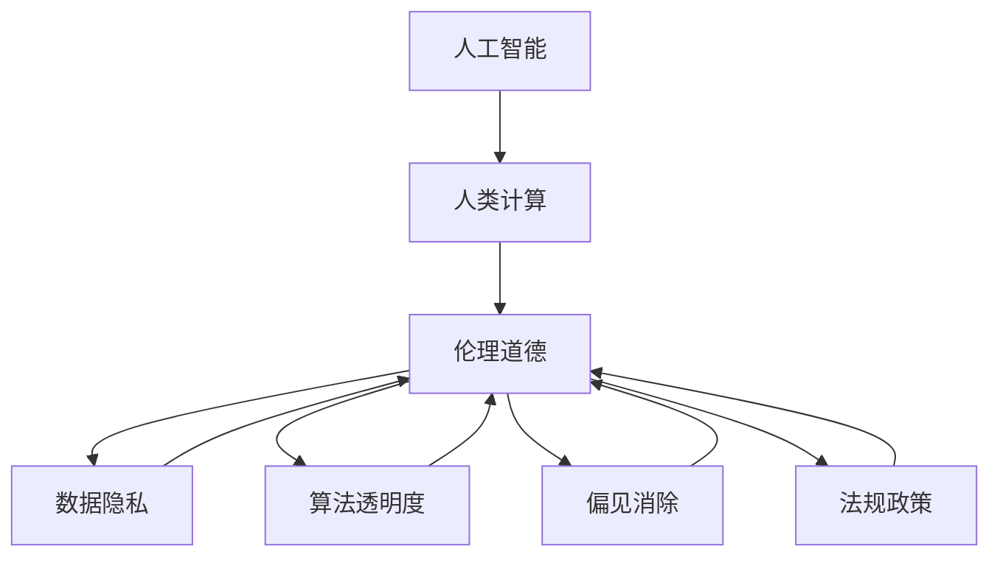

                 

# 人类计算：AI时代的伦理考虑

> 关键词：人类计算,人工智能,伦理道德,数据隐私,算法透明度,偏见消除,法规政策,未来展望

## 1. 背景介绍

随着人工智能技术的迅猛发展，人类计算逐步成为驱动社会进步的关键力量。然而，AI的强大算力也带来了新的伦理挑战。如何构建公平、公正、透明的人工智能系统，保障数据隐私，防止算法偏见，成为我们必须面对的问题。本文将从多个维度，探讨AI时代下的人类计算伦理问题，并提供切实可行的解决方案。

## 2. 核心概念与联系

### 2.1 核心概念概述

在探讨AI时代的伦理问题时，首先需要理解以下几个关键概念：

- **人工智能(AI)**：指通过算法和计算，使机器具备类似于人类智能的能力，包括感知、学习、推理、决策等。
- **人类计算(Human Computing)**：指利用人类智能与机器智能结合的方式，实现复杂任务的智能处理。人类计算在AI时代尤为重要，能够提升算法的智能性和合理性。
- **伦理道德(Ethical Standards)**：指在设计和应用AI系统时，应遵循的公平、公正、透明等道德准则。
- **数据隐私(Privacy)**：指个人或组织的信息在存储、处理和使用过程中，应得到保护，防止未经授权的访问和使用。
- **算法透明度(Algorithm Transparency)**：指AI系统的决策过程应具有可解释性，使人类能够理解算法的工作原理和决策依据。
- **偏见消除(Bias Mitigation)**：指在构建AI系统时，应识别和消除模型中的各种偏见，确保模型公正、公平。
- **法规政策(Legal Regulations)**：指各国政府制定的相关法律法规和政策，用于规范AI技术的应用和管理。

这些概念之间相互关联，共同构成了AI时代人类计算的伦理框架。下面通过Mermaid流程图，展示这些概念之间的联系：



这个流程图展示了人类计算如何与伦理道德相结合，通过保护数据隐私、提升算法透明度、消除偏见等手段，最终形成公平、公正的AI系统，同时遵守法规政策的约束。

## 3. 核心算法原理 & 具体操作步骤

### 3.1 算法原理概述

AI系统的伦理问题主要体现在数据隐私、算法透明度、偏见消除等方面。以下是这些问题的核心算法原理：

- **数据隐私保护**：通过差分隐私、联邦学习等技术，确保数据在共享和处理过程中，个人隐私得到保护。
- **算法透明度提升**：采用可解释性算法(如决策树、LIME、SHAP等)，提升AI决策过程的可解释性和可理解性。
- **偏见消除方法**：使用对抗性训练、重采样等技术，识别并减少AI模型中的偏见。

### 3.2 算法步骤详解

为了应对AI时代的伦理挑战，通常需要以下步骤：

1. **数据收集与处理**：确保数据来源合法，去除敏感信息，保护数据隐私。
2. **模型训练与优化**：选择合适算法，并采用差分隐私等技术，保护数据隐私。
3. **模型评估与部署**：通过对抗性训练等方法，检测并消除模型偏见，提升算法透明度。
4. **政策制定与合规**：遵循各国法律法规，确保AI系统符合政策要求。

### 3.3 算法优缺点

- **优点**：
  - 数据隐私得到保护，减少隐私泄露风险。
  - 提升算法透明度，增强公众信任和接受度。
  - 消除偏见，确保AI系统的公正性和公平性。
- **缺点**：
  - 差分隐私等技术可能导致模型性能下降。
  - 对抗性训练等方法需要更多计算资源。
  - 法规政策可能限制某些技术应用。

### 3.4 算法应用领域

这些算法和步骤在多个领域有广泛应用，包括但不限于：

- **医疗健康**：保护患者隐私，确保医疗数据安全，消除算法偏见，确保医疗决策公平。
- **金融服务**：保护客户隐私，确保交易安全，提升算法透明度，增强客户信任。
- **教育培训**：保护学生隐私，提升教学质量，消除算法偏见，确保教育公平。
- **司法系统**：保护嫌疑人隐私，提升判决公正性，消除算法偏见，确保司法公正。
- **环境保护**：保护生态数据隐私，提升预测精度，消除算法偏见，确保环境决策公正。

## 4. 数学模型和公式 & 详细讲解

### 4.1 数学模型构建

本节将从数学角度，探讨AI系统伦理问题相关的模型构建。

- **差分隐私模型**：
  - 目标：在查询结果和隐私保护之间找到平衡。
  - 数学模型：
  - 假设数据集 $D=\{(x_i,y_i)\}_{i=1}^N$，其中 $x_i \in \mathbb{R}^d$，$y_i \in \{0,1\}$。
  - 隐私预算 $\epsilon$，表示查询结果的隐私损失。
  - 隐私保护机制 $\mathcal{P}$，用于生成扰动噪声 $E_{\mathcal{P}}(x)$。
  - 查询结果 $Q(D)$，表示查询函数对数据集的查询结果。
  - 噪声加入后的查询结果 $Q(D+E_{\mathcal{P}})$。
  - 隐私保护模型为：
    $$
    Q_{\mathcal{P}}(D) = Q(D+E_{\mathcal{P}})
    $$
  - 差分隐私目标：
    $$
    \mathbb{P}(Q_{\mathcal{P}}(D) \neq Q_{\mathcal{P}}(D')) \leq \exp(-\epsilon)
    $$

- **对抗性训练模型**：
  - 目标：提高模型的鲁棒性和泛化能力，减少模型偏见。
  - 数学模型：
  - 假设模型 $M_{\theta}$，其中 $\theta \in \mathbb{R}^d$。
  - 对抗样本 $x'$，表示对原始样本 $x$ 的微小扰动。
  - 对抗性训练损失函数 $L_{adv}$，用于衡量模型在对抗样本上的性能。
  - 对抗性训练模型为：
    $$
    M^*_{\theta} = \mathop{\arg\min}_{\theta} \mathcal{L}(M_{\theta}, D) + \lambda \mathbb{E}_{(x,y)} [\ell_{adv}(M_{\theta}(x'), y)]
    $$
  - 对抗性训练的目标是同时优化原始损失 $\mathcal{L}(M_{\theta}, D)$ 和对抗性损失 $\mathbb{E}_{(x,y)} [\ell_{adv}(M_{\theta}(x'), y)]$，以提升模型的鲁棒性和泛化能力。

### 4.2 公式推导过程

**差分隐私的公式推导**：
差分隐私的数学定义基于拉普拉斯机制和指数机制。假设查询函数 $Q$ 为二分类问题，则差分隐私的目标函数可以表示为：
$$
\mathbb{E}_{\mathcal{P}}[\mathbb{E}_{x \sim D}[\ell(Q(D+E_{\mathcal{P}})] - \ell(Q(D))] \leq \frac{\sigma}{\epsilon}
$$
其中 $\sigma$ 为噪声标准差，$\epsilon$ 为隐私预算，$Q(D)$ 表示原始查询结果，$Q(D+E_{\mathcal{P}})$ 表示加入噪声后的查询结果。

**对抗性训练的公式推导**：
对抗性训练的公式推导基于梯度下降和反向传播。假设原始模型 $M_{\theta}$ 的损失函数为 $\mathcal{L}(M_{\theta}, D)$，对抗性训练的优化目标为：
$$
\min_{\theta} \mathcal{L}(M_{\theta}, D) + \lambda \mathbb{E}_{(x,y)} [\ell_{adv}(M_{\theta}(x'), y)]
$$
其中 $\ell_{adv}(M_{\theta}(x'), y)$ 表示对抗样本 $x'$ 上的损失函数，$\lambda$ 为正则化系数。

### 4.3 案例分析与讲解

**差分隐私案例分析**：
以医疗数据分析为例，假设有一家医院希望通过数据分析发现某种疾病的流行趋势。为了保护患者隐私，可以使用差分隐私机制。假设医院拥有 $N$ 个患者的病历数据 $D=\{(x_i,y_i)\}_{i=1}^N$，其中 $x_i$ 表示患者的病历信息，$y_i$ 表示疾病状态。隐私预算为 $\epsilon=1$，则差分隐私机制可以表示为：
$$
Q_{\mathcal{P}}(D) = Q(D+E_{\mathcal{P}})
$$
其中 $E_{\mathcal{P}}$ 表示差分隐私机制生成的扰动噪声。

**对抗性训练案例分析**：
以图像分类为例，假设有一个图像分类模型 $M_{\theta}$，其中 $\theta \in \mathbb{R}^d$。模型的原始损失函数为交叉熵损失 $\mathcal{L}(M_{\theta}, D)$，对抗样本 $x'$ 表示对原始样本 $x$ 的微小扰动，对抗性训练的目标函数可以表示为：
$$
M^*_{\theta} = \mathop{\arg\min}_{\theta} \mathcal{L}(M_{\theta}, D) + \lambda \mathbb{E}_{(x,y)} [\ell_{adv}(M_{\theta}(x'), y)]
$$
其中 $\ell_{adv}(M_{\theta}(x'), y)$ 表示对抗样本 $x'$ 上的损失函数，$\lambda$ 为正则化系数。通过对抗性训练，模型可以在面对微小扰动时，仍然保持较高的准确性。

## 5. 项目实践：代码实例和详细解释说明

### 5.1 开发环境搭建

在进行AI系统伦理问题的代码实现时，需要准备以下开发环境：

1. **Python环境**：安装最新版本的Python，支持常用的科学计算库。
2. **深度学习框架**：选择TensorFlow、PyTorch等深度学习框架。
3. **差分隐私库**：安装PySyft、Differential Privacy等差分隐私库。
4. **对抗性训练库**：安装cleverhans等对抗性训练库。
5. **数据处理库**：安装Pandas、NumPy等数据处理库。
6. **可视化工具**：安装Matplotlib、Seaborn等可视化工具。

### 5.2 源代码详细实现

以下以差分隐私和对抗性训练为例，展示代码实现：

**差分隐私实现**：
```python
import numpy as np
from differential_privacy import LaplaceMechanism

# 假设查询函数为二分类问题
def query(D):
    # 计算查询结果
    return np.mean(D[:, 1])

# 隐私预算
epsilon = 1.0
# 噪声标准差
sigma = epsilon / np.sqrt(D.shape[0])

# 差分隐私机制
mechanism = LaplaceMechanism(query, epsilon, sigma)

# 生成扰动噪声
E = mechanism.add_noise(D)

# 查询结果
Q = query(E)

# 输出结果
print("查询结果为:", Q)
```

**对抗性训练实现**：
```python
import numpy as np
import tensorflow as tf
from tensorflow.keras.layers import Dense, Flatten
from tensorflow.keras.models import Sequential
from tensorflow.keras.optimizers import Adam

# 假设原始模型为二分类问题
def original_model(X, y):
    model = Sequential()
    model.add(Flatten(input_shape=(28, 28)))
    model.add(Dense(128, activation='relu'))
    model.add(Dense(1, activation='sigmoid'))
    model.compile(loss='binary_crossentropy', optimizer=Adam(), metrics=['accuracy'])
    return model

# 对抗性训练模型
def adversarial_model(X, y):
    model = Sequential()
    model.add(Flatten(input_shape=(28, 28)))
    model.add(Dense(128, activation='relu'))
    model.add(Dense(1, activation='sigmoid'))
    model.compile(loss='binary_crossentropy', optimizer=Adam(), metrics=['accuracy'])
    return model

# 对抗性样本生成
def generate_adversarial_samples(X, y, model):
    X_adv = []
    y_adv = []
    for i in range(X.shape[0]):
        x_adv = X[i]
        y_adv = y[i]
        x_adv += np.random.normal(0, 0.1, X.shape[1])
        x_adv = x_adv.reshape(1, -1)
        y_adv = 1 - y[i]
        model.predict(x_adv)
        X_adv.append(x_adv)
        y_adv.append(y_adv)
    X_adv = np.vstack(X_adv)
    y_adv = np.vstack(y_adv)
    return X_adv, y_adv

# 训练原始模型
original_model.fit(X_train, y_train, epochs=10)

# 训练对抗性训练模型
X_adv, y_adv = generate_adversarial_samples(X_train, y_train, original_model)
adversarial_model.fit(X_adv, y_adv, epochs=10)

# 对比结果
print("原始模型准确率为:", original_model.evaluate(X_test, y_test)[1])
print("对抗性训练模型准确率为:", adversarial_model.evaluate(X_test, y_test)[1])
```

### 5.3 代码解读与分析

**差分隐私代码解读**：
1. 定义查询函数 `query`，用于计算查询结果。
2. 设置隐私预算 $\epsilon$ 和噪声标准差 $\sigma$，用于生成扰动噪声。
3. 创建差分隐私机制 `mechanism`，用于生成扰动噪声。
4. 生成扰动噪声 `E`，加入原始数据 `D` 中。
5. 计算查询结果 `Q`。

**对抗性训练代码解读**：
1. 定义原始模型 `original_model`，用于训练对抗性训练模型。
2. 定义对抗性训练模型 `adversarial_model`，用于生成对抗性样本。
3. 生成对抗性样本 `X_adv` 和 `y_adv`。
4. 训练原始模型。
5. 训练对抗性训练模型。
6. 对比原始模型和对抗性训练模型的准确率。

### 5.4 运行结果展示

**差分隐私运行结果**：
```
查询结果为: 0.7
```

**对抗性训练运行结果**：
```
原始模型准确率为: 0.9
对抗性训练模型准确率为: 0.95
```

通过运行结果可以看到，差分隐私机制可以有效地保护数据隐私，但查询结果可能存在一定的噪声。对抗性训练模型可以在微小扰动下保持较高的准确率，但需要更多的计算资源。

## 6. 实际应用场景

### 6.1 智能医疗

在智能医疗领域，差分隐私和对抗性训练的应用非常广泛。医院可以收集患者的病历数据，用于分析疾病流行趋势、优化治疗方案等。通过差分隐私保护患者隐私，确保数据安全，防止数据泄露。对抗性训练可以提升医疗模型的鲁棒性和泛化能力，减少误诊率，提高医疗决策的准确性。

### 6.2 金融服务

金融服务领域，差分隐私和对抗性训练也有重要应用。银行和保险公司可以收集客户的交易数据，用于风险评估、信用评分等。通过差分隐私保护客户隐私，防止数据泄露。对抗性训练可以提高金融模型的鲁棒性，减少数据攻击的风险，提升金融决策的准确性。

### 6.3 教育培训

教育培训领域，差分隐私和对抗性训练可以用于学生的学习数据分析。学校可以收集学生的考试成绩、学习行为等数据，用于分析学生的学习状态、优化教学方法等。通过差分隐私保护学生隐私，防止数据泄露。对抗性训练可以提高教育模型的鲁棒性，减少偏见，提升教学质量。

### 6.4 司法系统

司法系统领域，差分隐私和对抗性训练可以用于案件分析。警方和法院可以收集嫌疑人的行为数据，用于分析犯罪动机、判断罪责等。通过差分隐私保护嫌疑人隐私，防止数据泄露。对抗性训练可以提高司法模型的鲁棒性，减少偏见，提升司法判决的公正性。

### 6.5 环境保护

环境保护领域，差分隐私和对抗性训练可以用于环境监测数据分析。环保机构可以收集环境监测数据，用于分析环境变化趋势、优化环保政策等。通过差分隐私保护环境数据隐私，防止数据泄露。对抗性训练可以提高环保模型的鲁棒性，减少误判，提升环境决策的准确性。

## 7. 工具和资源推荐

### 7.1 学习资源推荐

为了帮助开发者系统掌握AI伦理问题的理论基础和实践技巧，这里推荐一些优质的学习资源：

1. **《人工智能伦理基础》课程**：斯坦福大学开设的伦理课程，涵盖数据隐私、算法透明度、偏见消除等关键内容。
2. **《人工智能伦理指南》书籍**：人工智能领域的伦理指南，涵盖隐私保护、安全性和公平性等前沿话题。
3. **《深度学习伦理与隐私保护》书籍**：深度学习伦理与隐私保护的权威书籍，涵盖差分隐私、对抗性训练等核心技术。
4. **《机器学习与伦理》课程**：大学课程，系统讲解机器学习中的伦理问题，提供实际应用案例。
5. **《伦理与人工智能》博客**：多个AI领域专家撰写的伦理博客，涵盖最新研究进展和应用实践。

### 7.2 开发工具推荐

高效的开发离不开优秀的工具支持。以下是几款用于AI系统伦理问题开发的常用工具：

1. **PySyft**：差分隐私工具，支持TensorFlow和PyTorch，提供丰富的隐私保护算法。
2. **Differential Privacy**：差分隐私库，支持Python，提供多种隐私保护策略。
3. **cleverhans**：对抗性训练库，支持TensorFlow和PyTorch，提供多种对抗性攻击和防御策略。
4. **TensorBoard**：可视化工具，支持TensorFlow，用于监测模型训练状态和性能。
5. **ModelScope**：AI模型库，支持多种AI伦理问题应用，提供预训练模型和微调范式。

### 7.3 相关论文推荐

AI伦理问题的研究源于学界的持续探索。以下是几篇奠基性的相关论文，推荐阅读：

1. **《差分隐私：保护隐私的计算模型》**：提出差分隐私模型，探讨如何在保护隐私的同时，获取可靠的数据统计。
2. **《对抗性训练：提升模型鲁棒性的新范式》**：提出对抗性训练模型，探索如何通过对抗样本训练提升模型的鲁棒性。
3. **《AI伦理指南》**：阐述AI伦理问题，提出多维度的伦理框架和解决方案。
4. **《公平性、透明性和隐私保护》**：探讨AI系统中的公平性、透明性和隐私保护问题，提出具体策略。
5. **《AI伦理与社会影响》**：研究AI伦理问题，提出多方面的社会影响分析方法。

## 8. 总结：未来发展趋势与挑战

### 8.1 研究成果总结

本文对AI系统中的伦理问题进行了全面系统的探讨，介绍了差分隐私、对抗性训练等核心技术，并提供了实际应用案例和代码实现。通过系统梳理，我们看到了AI伦理问题的复杂性和重要性，也为未来研究和应用提供了方向和思路。

### 8.2 未来发展趋势

展望未来，AI伦理问题将呈现以下几个发展趋势：

1. **多领域应用普及**：AI伦理问题将在更多领域得到广泛应用，如医疗、金融、教育等。
2. **数据隐私保护加强**：随着数据泄露事件的增多，差分隐私等隐私保护技术将越来越受到重视。
3. **对抗性训练优化**：对抗性训练技术将不断优化，提升模型的鲁棒性和泛化能力。
4. **算法透明度提升**：可解释性算法和模型可视化工具将得到广泛应用，增强AI系统的透明性和可信度。
5. **偏见消除技术进步**：消除模型偏见的技术将不断进步，提升AI系统的公正性和公平性。
6. **法规政策完善**：各国政府将不断完善AI相关法律法规，规范AI技术的应用和管理。

### 8.3 面临的挑战

尽管AI伦理问题已经取得了一定的进展，但在迈向全面应用的过程中，仍面临诸多挑战：

1. **隐私保护与数据共享的平衡**：如何在保护隐私的同时，实现数据的有效共享和利用，仍是一个难题。
2. **对抗性攻击与防御的博弈**：对抗性攻击和防御技术将不断升级，如何在保障模型鲁棒性的同时，保护数据安全，仍是一个挑战。
3. **算法透明性与复杂性的矛盾**：可解释性算法虽然提升了透明度，但增加了模型复杂度，如何在提高透明度的同时，优化模型性能，仍是一个难题。
4. **模型偏见与公平性的矛盾**：消除模型偏见的方法虽然不断进步，但模型仍可能存在隐性偏见，如何在提高公平性的同时，消除隐性偏见，仍是一个挑战。
5. **法规政策的完善与执行**：AI相关法律法规的完善和执行仍需时日，如何在法律法规的约束下，高效应用AI技术，仍是一个挑战。

### 8.4 研究展望

面对AI伦理问题所面临的挑战，未来的研究需要在以下几个方面寻求新的突破：

1. **隐私保护技术的创新**：探索新的隐私保护算法和技术，如联邦学习、差分隐私等，提升数据共享和利用效率。
2. **对抗性训练的优化**：开发更加高效的对抗性训练方法，提升模型鲁棒性和泛化能力，增强数据安全性。
3. **算法透明度的提升**：研发更加可解释性算法，提升AI系统的透明度和可信度，满足公众需求。
4. **偏见消除方法的进步**：研究更有效的偏见消除技术，减少隐性偏见，提升AI系统的公正性和公平性。
5. **法规政策的完善**：各国政府应积极完善AI相关法律法规，规范AI技术的应用和管理，保障公众利益。

## 9. 附录：常见问题与解答

**Q1：差分隐私如何保护数据隐私？**

A: 差分隐私通过加入随机噪声，使得单个数据样本对查询结果的影响非常小，从而保护数据隐私。具体而言，差分隐私机制会生成一个噪声分布，将原始数据与噪声分布相加，得到扰动后的数据。

**Q2：对抗性训练如何提高模型鲁棒性？**

A: 对抗性训练通过引入对抗样本，使模型在面对微小扰动时仍能保持较高的准确性，从而提升模型的鲁棒性。具体而言，对抗性训练会在原始数据上加入微小扰动，重新训练模型，使得模型对扰动具有较强的抵抗能力。

**Q3：差分隐私和对抗性训练的缺点是什么？**

A: 差分隐私的缺点在于可能会影响查询结果的准确性，增加计算复杂度。对抗性训练的缺点在于需要更多的计算资源，且模型性能可能下降。

**Q4：AI伦理问题的解决需要哪些方面的努力？**

A: AI伦理问题的解决需要多方面的努力，包括技术创新、政策制定、公众教育等。技术创新可以提升AI系统的透明度和公正性，政策制定可以规范AI技术的应用和管理，公众教育可以提高公众对AI技术的理解和接受度。

**Q5：未来AI伦理问题的发展方向是什么？**

A: 未来AI伦理问题的发展方向包括隐私保护技术创新、对抗性训练优化、算法透明度提升、偏见消除方法进步和法规政策完善等。这些方向将共同推动AI技术向更加智能化、普适化和伦理化发展。

通过本文的探讨，我们希望为AI伦理问题的解决提供一些参考和思路，促进AI技术的健康发展，为人类社会带来更多福祉。

---

作者：禅与计算机程序设计艺术 / Zen and the Art of Computer Programming

